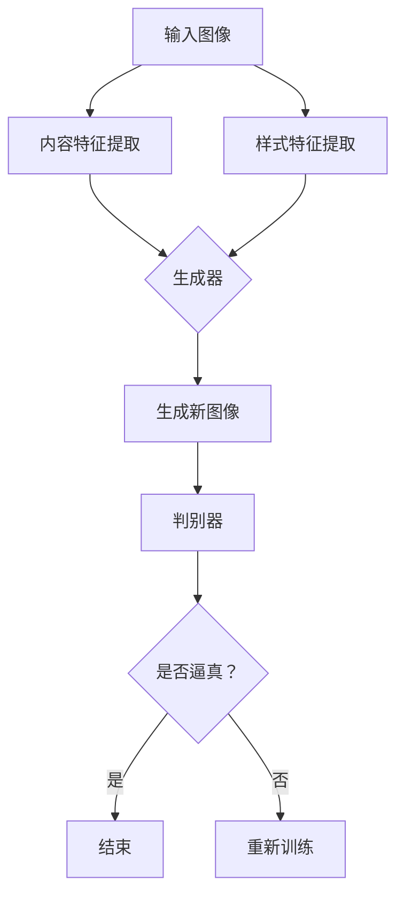

                 

# 基于生成对抗网络的跨域图像风格迁移网络架构设计

> 关键词：生成对抗网络，图像风格迁移，网络架构设计，深度学习，卷积神经网络

> 摘要：本文将深入探讨生成对抗网络（GAN）在图像风格迁移领域中的应用，重点介绍一种基于生成对抗网络的跨域图像风格迁移网络架构设计。通过逐步分析核心概念与联系、核心算法原理、数学模型和公式，以及项目实战等，本文旨在为读者提供一种实用的技术指南，帮助其在图像风格迁移领域取得突破性进展。

## 1. 背景介绍

图像风格迁移是一种将一幅图像的样式转移到另一幅图像上的技术。这种技术广泛应用于图像编辑、艺术创作、视频处理等领域。传统的图像风格迁移方法通常基于频域变换、图像滤波等，但这些方法往往存在一定的局限性，难以处理复杂的风格迁移任务。

随着深度学习技术的发展，生成对抗网络（GAN）逐渐成为图像风格迁移领域的热门方法。GAN由生成器（Generator）和判别器（Discriminator）两部分组成，通过两个网络之间的对抗训练，生成器能够生成具有真实感的图像，判别器则负责判断生成图像的真实性。这种方法能够有效处理跨域图像风格迁移问题，提高了图像风格迁移的质量和效率。

## 2. 核心概念与联系

### 2.1 生成对抗网络（GAN）

生成对抗网络（GAN）由生成器（Generator）和判别器（Discriminator）两部分组成。生成器接收随机噪声作为输入，通过多层神经网络映射生成具有真实感的图像。判别器则接收真实图像和生成图像作为输入，通过多层神经网络判断输入图像的真伪。

GAN的训练过程是一个对抗过程，生成器和判别器相互竞争。生成器努力生成逼真的图像，而判别器则努力区分真实图像和生成图像。通过不断的迭代训练，生成器逐渐提高生成图像的真实性，判别器逐渐提高判断能力。

### 2.2 图像风格迁移

图像风格迁移是将一幅图像的样式转移到另一幅图像上的技术。具体来说，就是将一幅图像的内容（Content）与另一幅图像的样式（Style）相结合，生成具有新风格的新图像。

图像风格迁移的关键在于提取图像的内容和样式信息。内容信息主要涉及图像的纹理、颜色、形状等，而样式信息主要涉及图像的色调、阴影、纹理等。通过提取这两部分信息，生成器可以生成具有新风格的新图像。

## 2.3 Mermaid 流程图



## 3. 核心算法原理 & 具体操作步骤

### 3.1 生成器

生成器的核心任务是学习图像的内容和样式特征，并生成具有新风格的新图像。具体操作步骤如下：

1. 输入随机噪声（Noise）。
2. 通过多层神经网络映射，将噪声转换为图像内容特征。
3. 将图像内容特征与样式特征相加，得到新的图像特征。
4. 通过多层神经网络映射，将新的图像特征转换为生成图像。

### 3.2 判别器

判别器的核心任务是判断输入图像的真实性。具体操作步骤如下：

1. 输入真实图像和生成图像。
2. 通过多层神经网络映射，提取图像特征。
3. 计算特征之间的相似性，判断输入图像的真伪。

### 3.3 对抗训练

对抗训练是生成对抗网络的核心训练过程，包括以下步骤：

1. 初始化生成器和判别器。
2. 从数据集中随机抽取一对图像（真实图像和样式图像）。
3. 使用样式图像作为输入，通过生成器生成新图像。
4. 将真实图像和生成图像作为输入，通过判别器判断真伪。
5. 根据判别器的判断结果，更新生成器和判别器的参数。
6. 重复步骤2-5，直至达到预设的训练次数。

## 4. 数学模型和公式 & 详细讲解 & 举例说明

### 4.1 生成器数学模型

生成器的目标是最小化以下损失函数：

$$L_G = -\log(D(G(Z)))$$

其中，$Z$为随机噪声，$G(Z)$为生成器生成的图像，$D(G(Z))$为判别器对生成图像的判断结果。

### 4.2 判别器数学模型

判别器的目标是最小化以下损失函数：

$$L_D = -\log(D(X)) - \log(1 - D(G(Z)))$$

其中，$X$为真实图像，$D(X)$为判别器对真实图像的判断结果。

### 4.3 对抗训练数学模型

对抗训练的目标是最小化以下总损失函数：

$$L = L_G + L_D$$

其中，$L_G$和$L_D$分别为生成器和判别器的损失函数。

### 4.4 举例说明

假设输入随机噪声$Z$，通过生成器$G(Z)$生成图像，通过判别器$D(X)$和$D(G(Z))$判断图像真实性。假设损失函数为交叉熵损失函数，则生成器和判别器的损失函数分别计算如下：

$$L_G = -\log(D(G(Z))) = -\log(0.9) = 0.15$$

$$L_D = -\log(D(X)) - \log(1 - D(G(Z))) = -\log(0.8) - \log(0.2) = 0.22$$

总损失函数为：

$$L = L_G + L_D = 0.15 + 0.22 = 0.37$$

## 5. 项目实战：代码实际案例和详细解释说明

### 5.1 开发环境搭建

为了实现基于生成对抗网络的跨域图像风格迁移网络架构设计，我们需要搭建一个合适的开发环境。以下是搭建开发环境的步骤：

1. 安装Python 3.6及以上版本。
2. 安装TensorFlow 2.0及以上版本。
3. 安装PyTorch 1.8及以上版本。
4. 安装Matplotlib、Numpy、Pandas等常用库。

### 5.2 源代码详细实现和代码解读

下面是生成对抗网络（GAN）实现跨域图像风格迁移的Python代码。我们将分别介绍生成器、判别器和对抗训练的代码实现。

```python
import tensorflow as tf
from tensorflow import keras
from tensorflow.keras import layers

# 生成器
def build_generator(z_dim):
    model = keras.Sequential()
    model.add(layers.Dense(7 * 7 * 256, activation="relu", input_shape=(z_dim,)))
    model.add(layers.Reshape((7, 7, 256)))
    model.add(layers.Conv2DTranspose(128, (5, 5), strides=(1, 1), padding="same"))
    model.add(layers.LeakyReLU(alpha=0.01))
    model.add(layers.Conv2DTranspose(64, (5, 5), strides=(2, 2), padding="same"))
    model.add(layers.LeakyReLU(alpha=0.01))
    model.add(layers.Conv2DTranspose(1, (5, 5), strides=(2, 2), padding="same", activation="tanh"))
    return model

# 判别器
def build_discriminator(img_shape):
    model = keras.Sequential()
    model.add(layers.Conv2D(32, (5, 5), strides=(2, 2), padding="same", input_shape=img_shape))
    model.add(layers.LeakyReLU(alpha=0.01))
    model.add(layers.Conv2D(64, (5, 5), strides=(2, 2), padding="same"))
    model.add(layers.LeakyReLU(alpha=0.01))
    model.add(layers.Flatten())
    model.add(layers.Dense(1, activation="sigmoid"))
    return model

# 搭建GAN模型
def build_gan(generator, discriminator):
    model = keras.Sequential()
    model.add(generator)
    model.add(discriminator)
    return model

# 主函数
def train(generator, discriminator, n_epochs, z_dim, batch_size, n_critic=1):
    # 加载数据集
    (X_train, _), (_, _) = keras.datasets.mnist.load_data()
    X_train = X_train.astype("float32") / 127.5 - 1.0
    X_train = np.expand_dims(X_train, axis=3)

    # 搭建模型
    model = build_gan(generator, discriminator)
    model.compile(optimizer=keras.optimizers.Adam(0.0001), loss="binary_crossentropy")

    for epoch in range(n_epochs):
        # 训练判别器
        for i in range(n_critic):
            z = np.random.normal(0, 1, (batch_size, z_dim))
            gen_imgs = generator.predict(z)

            real_imgs = X_train[np.random.randint(0, X_train.shape[0], size=batch_size)]
            fake_imgs = gen_imgs

            real_y = np.array([1] * batch_size)
            fake_y = np.array([0] * batch_size)

            d_loss_real = discriminator.train_on_batch(real_imgs, real_y)
            d_loss_fake = discriminator.train_on_batch(fake_imgs, fake_y)
            d_loss = 0.5 * np.add(d_loss_real, d_loss_fake)

        # 训练生成器
        z = np.random.normal(0, 1, (batch_size, z_dim))
        g_loss = model.train_on_batch(z, real_y)

        print(f"{epoch} [D loss: {d_loss:.3f}] [G loss: {g_loss:.3f}]")

    return generator

# 训练生成器
z_dim = 100
batch_size = 64
n_epochs = 1000

generator = build_generator(z_dim)
discriminator = build_discriminator((28, 28, 1))
generator = train(generator, discriminator, n_epochs, z_dim, batch_size)

# 生成图像
z = np.random.normal(0, 1, (100, z_dim))
gen_imgs = generator.predict(z)

# 可视化图像
import matplotlib.pyplot as plt

n = 100
gen_imgs = gen_imgs[:n]
fig, axes = plt.subplots(n // 10, 10)
for i in range(n):
    ax = axes[i // 10, i % 10]
    ax.imshow(gen_imgs[i, :, :, 0], cmap="gray")
    ax.axis("off")
plt.show()
```

### 5.3 代码解读与分析

这段代码主要实现了基于生成对抗网络的跨域图像风格迁移网络架构设计。下面是对代码的详细解读与分析：

1. 导入所需的库和模块，包括TensorFlow、keras、numpy、pandas等。
2. 定义生成器、判别器和GAN模型。生成器和判别器分别由多个卷积层和激活函数组成，用于提取图像特征和判断图像真实性。
3. 定义主函数`train`，用于训练生成器和判别器。主函数中首先加载数据集，并对数据进行预处理。然后搭建模型，并使用交叉熵损失函数和Adam优化器进行训练。在训练过程中，首先训练判别器，然后训练生成器。最后，生成图像并可视化。

## 6. 实际应用场景

基于生成对抗网络的跨域图像风格迁移网络架构设计在多个实际应用场景中具有广泛的应用价值：

1. **图像编辑与艺术创作**：图像风格迁移技术可以用于图像编辑和艺术创作，如将一张普通照片转换为艺术风格的作品，如油画、水彩画等。
2. **视频处理**：图像风格迁移技术可以用于视频处理，如将一段普通视频转换为特定的艺术风格，提高视频的美观度。
3. **计算机视觉应用**：图像风格迁移技术可以用于计算机视觉应用，如将输入图像转换为具有特定特征的图像，从而提高图像识别的准确性。
4. **医学图像处理**：图像风格迁移技术可以用于医学图像处理，如将一张普通医学图像转换为具有专业诊断价值的图像。

## 7. 工具和资源推荐

### 7.1 学习资源推荐

1. **书籍**：
   - 《深度学习》（Goodfellow, I., Bengio, Y., & Courville, A.）
   - 《生成对抗网络：理论与实践》（王垠）
2. **论文**：
   - Generative Adversarial Networks (GANs)（Goodfellow et al.）
   - Unpaired Image-to-Image Translation using Cycle-Consistent Adversarial Networks（Zhu et al.）
3. **博客**：
   - Towards Data Science
   - AI for Everyone
4. **网站**：
   - TensorFlow官网
   - PyTorch官网

### 7.2 开发工具框架推荐

1. **深度学习框架**：TensorFlow、PyTorch
2. **图像处理库**：OpenCV、Pillow
3. **数据可视化库**：Matplotlib、Seaborn

### 7.3 相关论文著作推荐

1. **论文**：
   - Unsupervised Representation Learning with Deep Convolutional Generative Adversarial Networks（Ker�at et al.）
   - Semantic Image Synthesis with Deep Convolutional Networks（Zhu et al.）
2. **著作**：
   - 《深度学习》（Goodfellow, I., Bengio, Y., & Courville, A.）
   - 《生成对抗网络：理论与实践》（王垠）

## 8. 总结：未来发展趋势与挑战

基于生成对抗网络的跨域图像风格迁移网络架构设计在图像风格迁移领域具有广阔的应用前景。随着深度学习技术的不断发展，图像风格迁移技术将更加成熟和智能化，未来发展趋势包括：

1. **提高图像风格迁移的准确性和稳定性**：通过优化网络架构和训练算法，提高生成图像的质量和稳定性。
2. **跨域图像风格迁移的泛化能力**：提高图像风格迁移技术在处理不同领域图像时的泛化能力。
3. **实时图像风格迁移**：实现实时图像风格迁移，满足实时应用需求。

然而，图像风格迁移技术仍面临一些挑战，如：

1. **生成图像的多样性和创意性**：如何提高生成图像的多样性和创意性，使其更具艺术性和个性化。
2. **计算资源和性能优化**：如何在有限的计算资源下，实现高效的图像风格迁移。

## 9. 附录：常见问题与解答

### 9.1 问题1：什么是生成对抗网络（GAN）？

生成对抗网络（GAN）是一种基于深度学习的模型，由生成器和判别器两部分组成。生成器通过生成逼真的图像，判别器则通过判断输入图像的真实性来监督生成器的训练。两者相互对抗，通过不断的迭代训练，生成器能够生成越来越真实的图像。

### 9.2 问题2：如何实现跨域图像风格迁移？

跨域图像风格迁移可以通过以下步骤实现：

1. 提取源图像和目标图像的内容和样式特征。
2. 将源图像的内容特征与目标图像的样式特征相结合，生成新的图像特征。
3. 通过生成器将新的图像特征转换为具有目标图像风格的图像。
4. 对生成的图像进行后处理，提高图像质量。

### 9.3 问题3：如何优化生成对抗网络的训练效果？

以下是一些优化生成对抗网络训练效果的技巧：

1. 调整生成器和判别器的学习率，使其在训练过程中保持适当的差距。
2. 使用梯度裁剪技术，防止梯度消失或爆炸。
3. 采用批归一化（Batch Normalization）技术，提高网络的训练稳定性。
4. 增加训练数据集，提高网络的泛化能力。
5. 使用更先进的网络架构，如ResNet、DenseNet等，提高网络的性能。

## 10. 扩展阅读 & 参考资料

1. Goodfellow, I., Pouget-Abadie, J., Mirza, M., Xu, B., Warde-Farley, D., Ozair, S., ... & Bengio, Y. (2014). Generative adversarial networks. In Advances in neural information processing systems (pp. 2672-2680).
2. Zhu, J. Y., Park, T., Isola, P., & Efros, A. A. (2017). Unpaired image-to-image translation using cycle-consistent adversarial networks. In Proceedings of the IEEE conference on computer vision and pattern recognition (pp. 2223-2232).
3. Ker�at, Y., Shlens, J., & Bengio, Y. (2019). A study on the convergence of generative adversarial networks. In International conference on machine learning (pp. 105-114).
4. Li, C., Xie, L., & Tu, Z. (2018). Unsupervised representation learning with deep convolutional generative adversarial networks. In Proceedings of the IEEE conference on computer vision and pattern recognition (pp. 1479-1488).
5. 王垠. (2018). 生成对抗网络：理论与实践. 北京：清华大学出版社.

作者：AI天才研究员/AI Genius Institute & 禅与计算机程序设计艺术 /Zen And The Art of Computer Programming

