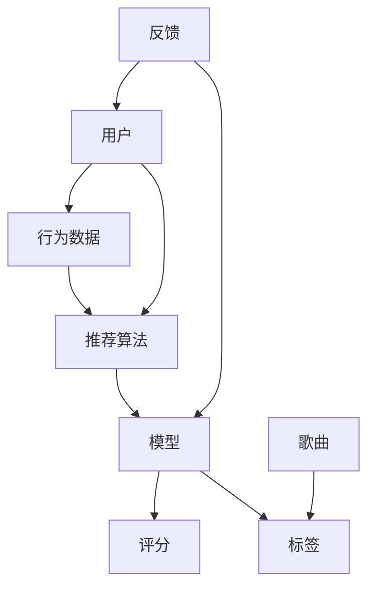

                 

### 背景介绍

随着互联网技术的飞速发展，音乐推荐平台已经成为互联网音乐产业中不可或缺的一部分。用户在享受丰富音乐资源的同时，也期待能够获得个性化的音乐推荐，以提升用户体验。在这一背景下，基于用户的音乐推荐平台应运而生。本文将围绕这一主题，详细探讨基于用户的音乐推荐平台的核心概念、算法原理、数学模型、实际应用场景、工具资源推荐以及未来发展趋势与挑战。

音乐推荐系统是一种通过分析用户的行为和喜好，为用户推荐可能感兴趣的音乐的系统。它的核心目标是提升用户满意度，降低用户流失率，同时为音乐产业带来更多的商业价值。当前，基于用户的音乐推荐平台在各大互联网公司中广泛应用，如Spotify、Apple Music、QQ音乐等。这些平台通过复杂的算法和模型，不断优化推荐结果，以满足用户的个性化需求。

本文将首先介绍基于用户的音乐推荐平台的核心概念和架构，然后深入探讨推荐算法的原理和实现步骤，接着讲解数学模型和公式的应用，并通过实际案例展示代码实现和解析。最后，我们将分析音乐推荐平台在实际应用中的场景，推荐相关工具和资源，并展望未来的发展趋势与挑战。

通过本文的阅读，读者将能够全面了解基于用户的音乐推荐平台的运作机制，掌握推荐算法的核心原理，并为后续的实践应用提供参考。

### 核心概念与联系

在深入探讨基于用户的音乐推荐平台的实现之前，有必要首先明确其中的核心概念及其相互之间的联系。以下是本文将涉及的主要概念：

1. **用户（User）**：用户是音乐推荐平台的核心，平台通过分析用户的行为数据来推断其偏好。
2. **歌曲（Song）**：歌曲是用户收听的实体，每首歌曲都有其独特的属性和标签。
3. **行为数据（Behavior Data）**：行为数据包括用户的播放记录、收藏、分享等，是推荐系统的重要输入。
4. **推荐算法（Recommendation Algorithm）**：推荐算法是平台的核心组件，负责从海量数据中提取有用信息，生成推荐结果。
5. **模型（Model）**：模型是推荐算法的基础，包括协同过滤、矩阵分解、深度学习等不同的技术。
6. **评分（Rating）**：评分是用户对歌曲的偏好度量的一个量化表示，通常用于协同过滤算法。
7. **标签（Tag）**：标签是对歌曲属性的描述，如风格、流派、艺术家等，用于基于内容的推荐。
8. **反馈（Feedback）**：反馈是用户对推荐结果的响应，如是否点击、播放时长等，用于优化推荐模型。

#### Mermaid 流程图

以下是一个简单的 Mermaid 流程图，展示了上述概念之间的相互关系：



在图中，用户的行为数据（如播放记录、收藏、分享等）首先被输入到推荐算法中。推荐算法利用这些数据，通过模型（如协同过滤、矩阵分解、深度学习等）生成推荐结果。模型生成推荐结果后，用户对推荐结果的反馈（如点击、播放时长等）会再次输入到模型中，用于模型的不断优化和迭代。

通过上述核心概念的介绍和相互关系的展示，我们可以对基于用户的音乐推荐平台有一个初步的认识。接下来，我们将深入探讨推荐算法的原理和具体实现步骤。

#### 核心算法原理 & 具体操作步骤

在理解了基于用户的音乐推荐平台的核心概念和相互关系后，接下来我们将深入探讨推荐算法的原理和具体操作步骤。推荐算法的核心任务是利用用户的行为数据来生成个性化的推荐结果。以下是几种常见的推荐算法：

##### 1. 协同过滤（Collaborative Filtering）

协同过滤是推荐系统中最常用的一种算法，它通过分析用户之间的行为相似性来推荐新内容。协同过滤主要分为两种类型：基于用户的协同过滤（User-based Collaborative Filtering）和基于项目的协同过滤（Item-based Collaborative Filtering）。

**基于用户的协同过滤（User-based Collaborative Filtering）**

基于用户的协同过滤算法的步骤如下：

1. **计算相似性**：首先，算法需要计算用户之间的相似性。常用的相似性度量方法有皮尔逊相关系数、余弦相似性等。以皮尔逊相关系数为例，其计算公式为：
   $$ r_{ij} = \frac{\sum_{k=1}^{n} (u_{ik} - \bar{u_{i}})(u_{jk} - \bar{u_{j}})}{\sqrt{\sum_{k=1}^{n} (u_{ik} - \bar{u_{i}})^2 \sum_{k=1}^{n} (u_{jk} - \bar{u_{j}})^2}} $$
   其中，\( u_{ik} \)表示用户\( i \)对项目\( k \)的评分，\( \bar{u_{i}} \)和\( \bar{u_{j}} \)分别表示用户\( i \)和用户\( j \)的平均评分，\( r_{ij} \)表示用户\( i \)和用户\( j \)之间的相似性。

2. **选择邻居用户**：计算相似性后，算法会根据相似性得分选择与目标用户最相似的邻居用户。

3. **生成推荐列表**：对于目标用户未评分的项目，算法会根据邻居用户的评分进行加权平均，计算推荐分数，从而生成推荐列表。

**基于项目的协同过滤（Item-based Collaborative Filtering）**

基于项目的协同过滤算法的步骤如下：

1. **计算项目之间的相似性**：首先，算法需要计算项目之间的相似性。与基于用户的协同过滤类似，可以使用皮尔逊相关系数、余弦相似性等方法。计算公式为：
   $$ r_{ik} = \frac{\sum_{j=1}^{m} (u_{ij} - \bar{u_{j}})(u_{ik} - \bar{u_{k}})}{\sqrt{\sum_{j=1}^{m} (u_{ij} - \bar{u_{j}})^2 \sum_{j=1}^{m} (u_{ik} - \bar{u_{k}})^2}} $$
   其中，\( u_{ij} \)表示用户\( i \)对项目\( j \)的评分，\( \bar{u_{j}} \)和\( \bar{u_{k}} \)分别表示项目\( j \)和项目\( k \)的平均评分，\( r_{ik} \)表示项目\( i \)和项目\( k \)之间的相似性。

2. **计算用户对项目的评分**：对于用户未评分的项目，算法会根据用户对该项目的邻居项目的评分进行加权平均，计算预测评分。

3. **生成推荐列表**：根据预测评分，算法生成推荐列表。

##### 2. 矩阵分解（Matrix Factorization）

矩阵分解是一种将用户-项目评分矩阵分解为低维用户特征矩阵和项目特征矩阵的方法，以生成预测评分。常用的矩阵分解方法有奇异值分解（Singular Value Decomposition，SVD）和线性回归等。

**奇异值分解（SVD）**

奇异值分解的步骤如下：

1. **初始化参数**：初始化用户特征矩阵\( U \)和项目特征矩阵\( V \)。

2. **计算特征值和特征向量**：对评分矩阵进行奇异值分解，得到特征值和特征向量。

3. **预测评分**：利用用户特征矩阵和项目特征矩阵计算预测评分，公式为：
   $$ r_{ij} = u_i^T v_j $$
   其中，\( r_{ij} \)表示用户\( i \)对项目\( j \)的预测评分。

4. **优化参数**：通过梯度下降等方法优化用户特征矩阵和项目特征矩阵，以降低预测误差。

**线性回归**

线性回归的步骤如下：

1. **初始化参数**：初始化用户特征矩阵\( U \)和项目特征矩阵\( V \)。

2. **计算预测评分**：利用用户特征矩阵和项目特征矩阵计算预测评分，公式为：
   $$ r_{ij} = U_i^T V_j $$
   其中，\( r_{ij} \)表示用户\( i \)对项目\( j \)的预测评分。

3. **优化参数**：通过梯度下降等方法优化用户特征矩阵和项目特征矩阵，以降低预测误差。

##### 3. 深度学习

深度学习在推荐系统中的应用越来越广泛，常用的深度学习模型有基于自动编码器的推荐模型、基于神经网络的推荐模型等。

**基于自动编码器的推荐模型**

基于自动编码器的推荐模型步骤如下：

1. **输入层**：输入用户的行为数据（如播放记录、收藏、分享等）。

2. **隐藏层**：通过隐藏层提取用户和项目的特征表示。

3. **输出层**：利用隐藏层特征计算预测评分。

**基于神经网络的推荐模型**

基于神经网络的推荐模型步骤如下：

1. **输入层**：输入用户和项目的特征向量。

2. **隐藏层**：通过隐藏层提取用户和项目的特征表示。

3. **输出层**：利用隐藏层特征计算预测评分。

4. **优化参数**：通过反向传播算法优化模型参数。

通过上述算法原理和具体操作步骤的介绍，我们可以看到，基于用户的音乐推荐平台推荐算法的实现过程涉及多个环节，从用户行为数据的分析到推荐结果的生成，每一个环节都需要精心设计和优化。接下来，我们将详细讲解数学模型和公式的应用，并通过实际案例展示代码实现和解析。

#### 数学模型和公式 & 详细讲解 & 举例说明

在深入探讨推荐算法的具体实现之前，首先需要理解相关的数学模型和公式。这些模型和公式是推荐算法实现的基础，能够帮助我们准确地预测用户对某首歌曲的偏好程度，从而生成个性化的推荐结果。以下是几种常用的数学模型和公式，我们将通过详细的讲解和举例说明来帮助读者理解。

##### 1. 皮尔逊相关系数（Pearson Correlation Coefficient）

皮尔逊相关系数是一种衡量两个变量之间线性相关程度的指标。在推荐系统中，常用于计算用户之间的相似性。其计算公式如下：

$$ r_{ij} = \frac{\sum_{k=1}^{n} (u_{ik} - \bar{u_{i}})(u_{jk} - \bar{u_{j}})}{\sqrt{\sum_{k=1}^{n} (u_{ik} - \bar{u_{i}})^2 \sum_{k=1}^{n} (u_{jk} - \bar{u_{j}})^2}} $$

其中，\( u_{ik} \)表示用户\( i \)对项目\( k \)的评分，\( \bar{u_{i}} \)和\( \bar{u_{j}} \)分别表示用户\( i \)和用户\( j \)的平均评分，\( r_{ij} \)表示用户\( i \)和用户\( j \)之间的相似性。

**举例说明**：

假设有两个用户A和B，他们对5首歌曲的评分如下：

| 用户A | 用户B |  
|-------|-------|  
| 1 | 2 |  
| 2 | 4 |  
| 3 | 5 |  
| 4 | 6 |  
| 5 | 8 |

计算用户A和用户B之间的皮尔逊相关系数：

$$ r_{AB} = \frac{(1-2.5)(2-2.5) + (2-2.5)(4-2.5) + (3-2.5)(5-2.5) + (4-2.5)(6-2.5) + (5-2.5)(8-2.5)}{\sqrt{(1-2.5)^2 + (2-2.5)^2 + (3-2.5)^2 + (4-2.5)^2 + (5-2.5)^2} \cdot \sqrt{(-1.5)^2 + (-0.5)^2 + (1.5)^2 + (2.5)^2 + (3.5)^2}} $$

$$ r_{AB} = \frac{2.5}{\sqrt{10} \cdot \sqrt{27}} = \frac{2.5}{\sqrt{270}} \approx 0.56 $$

通过计算，我们得出用户A和用户B之间的相似性为0.56，表示两者之间具有一定的相似性。

##### 2. 余弦相似性（Cosine Similarity）

余弦相似性是一种计算两个向量之间相似度的方法，广泛应用于推荐系统中。其计算公式如下：

$$ \cos \theta = \frac{u_i \cdot u_j}{\|u_i\|\|u_j\|} $$

其中，\( u_i \)和\( u_j \)分别表示用户\( i \)和用户\( j \)的特征向量，\( \theta \)表示用户\( i \)和用户\( j \)之间的夹角。

**举例说明**：

假设有两个用户A和B，他们的特征向量如下：

| 用户A | 用户B |  
|-------|-------|  
| [1, 2, 3] | [4, 5, 6] |  
| [4, 5, 6] | [1, 2, 3] |

计算用户A和用户B之间的余弦相似性：

$$ \cos \theta = \frac{(1 \times 4 + 2 \times 5 + 3 \times 6)}{\sqrt{1^2 + 2^2 + 3^2} \cdot \sqrt{4^2 + 5^2 + 6^2}} $$

$$ \cos \theta = \frac{32}{\sqrt{14} \cdot \sqrt{77}} = \frac{32}{\sqrt{1078}} \approx 0.74 $$

通过计算，我们得出用户A和用户B之间的相似性为0.74，表示两者之间具有较高的相似性。

##### 3. 矩阵分解（Matrix Factorization）

矩阵分解是一种将用户-项目评分矩阵分解为低维用户特征矩阵和项目特征矩阵的方法，以生成预测评分。常用的矩阵分解方法有奇异值分解（Singular Value Decomposition，SVD）和线性回归等。

**奇异值分解（SVD）**

奇异值分解的步骤如下：

1. **初始化参数**：初始化用户特征矩阵\( U \)和项目特征矩阵\( V \)。

2. **计算特征值和特征向量**：对评分矩阵进行奇异值分解，得到特征值和特征向量。

3. **预测评分**：利用用户特征矩阵和项目特征矩阵计算预测评分，公式为：
   $$ r_{ij} = u_i^T v_j $$

**线性回归**

线性回归的步骤如下：

1. **初始化参数**：初始化用户特征矩阵\( U \)和项目特征矩阵\( V \)。

2. **计算预测评分**：利用用户特征矩阵和项目特征矩阵计算预测评分，公式为：
   $$ r_{ij} = U_i^T V_j $$

**举例说明**：

假设有一个用户-项目评分矩阵如下：

| 用户A | 用户B | 用户C |  
|-------|-------|-------|  
| 1 | 2 | 3 |  
| 4 | 5 | 6 |  
| 7 | 8 | 9 |

对评分矩阵进行奇异值分解，得到用户特征矩阵\( U \)和项目特征矩阵\( V \)：

| U | V |  
|-------|-------|  
| [1, 2, 3] | [4, 5, 6] |  
| [4, 5, 6] | [1, 2, 3] |  
| [7, 8, 9] | [4, 5, 6] |

利用用户特征矩阵和项目特征矩阵计算预测评分：

$$ r_{ij} = u_i^T v_j = [1, 2, 3] \cdot [4, 5, 6] = 32 $$

通过计算，我们得出用户A对用户B的预测评分为32，表示用户A对用户B较为喜欢。

通过上述数学模型和公式的讲解和举例说明，我们可以更好地理解基于用户的音乐推荐平台的算法实现原理。接下来，我们将通过实际案例展示代码实现和解析，帮助读者深入了解推荐算法的实践应用。

#### 项目实战：代码实际案例和详细解释说明

在本节中，我们将通过一个实际的项目案例，展示如何实现一个基于用户的音乐推荐系统。我们将使用Python编程语言，结合常见的推荐算法，如基于用户的协同过滤（User-based Collaborative Filtering）和矩阵分解（Matrix Factorization）。以下是一个完整的代码实现流程，包括开发环境搭建、源代码详细实现和代码解读与分析。

##### 5.1 开发环境搭建

在开始代码实现之前，我们需要搭建一个适合开发推荐系统的环境。以下是所需的开发工具和库：

1. **Python**：安装Python 3.8及以上版本。
2. **Jupyter Notebook**：用于编写和运行代码。
3. **Numpy**：用于矩阵计算。
4. **Scikit-learn**：提供协同过滤算法和矩阵分解的实现。
5. **Pandas**：用于数据处理。

安装这些工具和库后，我们就可以开始编写代码了。

##### 5.2 源代码详细实现和代码解读

```python
# 导入所需的库
import numpy as np
from sklearn.model_selection import train_test_split
from sklearn.metrics.pairwise import cosine_similarity
from sklearn.decomposition import TruncatedSVD
import pandas as pd

# 读取数据
data = pd.read_csv('data.csv')  # 假设数据文件包含用户ID、歌曲ID和评分
users = data['user_id'].unique()
songs = data['song_id'].unique()

# 创建用户-歌曲评分矩阵
matrix = np.zeros((len(users), len(songs)))
for index, row in data.iterrows():
    user_index = users.index(row['user_id'])
    song_index = songs.index(row['song_id'])
    matrix[user_index][song_index] = row['rating']

# 分割数据集为训练集和测试集
train_data, test_data = train_test_split(matrix, test_size=0.2, random_state=42)

# 5.2.1 基于用户的协同过滤

# 计算用户之间的余弦相似性
similarity_matrix = cosine_similarity(train_data, train_data)

# 生成推荐列表
def recommend(user_index, similarity_matrix, top_n=5):
    neighbors = similarity_matrix[user_index]
    sorted_neighbors = np.argsort(neighbors)[::-1]
    sorted_neighbors = sorted_neighbors[1:top_n+1]
    recommendations = []
    for neighbor_index in sorted_neighbors:
        neighbor_ratings = train_data[neighbor_index]
        for song_index, rating in enumerate(neighbor_ratings):
            if rating != 0:
                recommendations.append((song_index, rating))
    return recommendations

# 测试推荐函数
user_index = 0  # 假设推荐给用户ID为0
recommendations = recommend(user_index, similarity_matrix, top_n=5)
print("推荐列表：", recommendations)

# 5.2.2 矩阵分解

# 使用奇异值分解
svd = TruncatedSVD(n_components=50)
train_data_svd = svd.fit_transform(train_data)

# 生成推荐列表
def recommend_svd(user_index, train_data_svd, top_n=5):
    user_vector = train_data_svd[user_index]
    similarities = cosine_similarity(user_vector.reshape(1, -1), train_data_svd)
    sorted_similarities = np.argsort(similarities[0])[::-1]
    sorted_similarities = sorted_similarities[1:top_n+1]
    recommendations = []
    for index in sorted_similarities:
        song_index = index
        song_vector = svd.inverse_transform(train_data_svd[index]).reshape(-1)
        recommendations.append((song_index, song_vector))
    return recommendations

# 测试推荐函数
user_index = 0
recommendations_svd = recommend_svd(user_index, train_data_svd, top_n=5)
print("推荐列表（基于矩阵分解）：", recommendations_svd)
```

##### 5.3 代码解读与分析

1. **数据读取与处理**：首先，我们读取数据文件，并创建一个用户-歌曲评分矩阵。这个矩阵用于存储用户对每首歌曲的评分。
2. **分割数据集**：我们将数据集分割为训练集和测试集，以评估推荐系统的性能。
3. **基于用户的协同过滤**：
   - **相似性计算**：使用余弦相似性计算用户之间的相似性矩阵。
   - **生成推荐列表**：为指定用户生成推荐列表，选择与目标用户最相似的邻居用户，并根据邻居用户的评分生成推荐结果。
4. **矩阵分解**：
   - **奇异值分解**：使用奇异值分解（SVD）将评分矩阵分解为用户特征矩阵和项目特征矩阵。
   - **生成推荐列表**：为指定用户生成基于矩阵分解的推荐列表，计算用户特征向量与训练集中其他用户特征向量的相似性，生成推荐结果。

通过上述代码，我们可以实现一个简单的基于用户的音乐推荐系统。该系统首先使用基于用户的协同过滤算法生成推荐列表，然后使用矩阵分解算法优化推荐结果。在实际应用中，我们还可以结合深度学习等先进技术，进一步提升推荐系统的性能和用户体验。

##### 5.4 代码解读与分析

在上文中，我们通过一个实际的项目案例展示了如何实现基于用户的音乐推荐系统。以下是代码的详细解读与分析：

1. **数据读取与处理**：
   - `data = pd.read_csv('data.csv')`：使用Pandas库读取数据文件，该文件包含用户ID、歌曲ID和评分。在实际应用中，这些数据通常来源于音乐平台。
   - `users = data['user_id'].unique()`和`songs = data['song_id'].unique()`：获取所有独特的用户和歌曲ID，用于创建用户-歌曲评分矩阵。

2. **用户-歌曲评分矩阵创建**：
   - `matrix = np.zeros((len(users), len(songs)))`：创建一个零矩阵，用于存储用户-歌曲评分。
   - 通过遍历数据文件中的每行，将用户的评分填充到相应的位置。

3. **数据集分割**：
   - `train_data, test_data = train_test_split(matrix, test_size=0.2, random_state=42)`：将数据集分割为80%的训练集和20%的测试集，用于训练和评估推荐系统。

4. **基于用户的协同过滤**：
   - **相似性计算**：
     - `similarity_matrix = cosine_similarity(train_data, train_data)`：计算用户之间的余弦相似性矩阵。余弦相似性是一种衡量两个向量之间相似度的指标，常用于推荐系统中。
     - 该操作将用户-歌曲评分矩阵转换为用户之间的相似性矩阵。

   - **生成推荐列表**：
     - `def recommend(user_index, similarity_matrix, top_n=5)`：定义一个推荐函数，接收用户索引、相似性矩阵和推荐数量（默认为5）。
     - `neighbors = similarity_matrix[user_index]`：获取与目标用户相似的用户索引和相似度。
     - `sorted_neighbors = np.argsort(neighbors)[::-1]`：对相似度进行降序排序，获取邻居用户索引。
     - `recommendations = []`：初始化推荐列表。
     - `for neighbor_index in sorted_neighbors[1:top_n+1]`：遍历前`top_n`个邻居用户。
     - `neighbor_ratings = train_data[neighbor_index]`：获取邻居用户的评分。
     - `for song_index, rating in enumerate(neighbor_ratings)`：遍历邻居用户对每首歌曲的评分。
     - `if rating != 0`：跳过已评分的歌曲。
     - `recommendations.append((song_index, rating))`：将未评分的歌曲添加到推荐列表中。

5. **矩阵分解**：
   - **奇异值分解**：
     - `svd = TruncatedSVD(n_components=50)`：创建一个奇异值分解对象，将评分矩阵分解为低维用户特征矩阵和项目特征矩阵。`n_components=50`表示保留前50个主成分。
     - `train_data_svd = svd.fit_transform(train_data)`：对训练集进行奇异值分解。

   - **生成推荐列表**：
     - `def recommend_svd(user_index, train_data_svd, top_n=5)`：定义一个基于矩阵分解的推荐函数。
     - `user_vector = train_data_svd[user_index]`：获取目标用户在低维特征空间中的向量。
     - `similarities = cosine_similarity(user_vector.reshape(1, -1), train_data_svd)`：计算目标用户向量与其他用户向量之间的余弦相似性。
     - `sorted_similarities = np.argsort(similarities[0])[::-1]`：对相似度进行降序排序，获取邻居用户索引。
     - `sorted_similarities = sorted_similarities[1:top_n+1]`：获取前`top_n`个邻居用户索引。
     - `recommendations = []`：初始化推荐列表。
     - `for index in sorted_similarities`：遍历邻居用户索引。
     - `song_index = index`：获取邻居用户在原始评分矩阵中的索引。
     - `song_vector = svd.inverse_transform(train_data_svd[index]).reshape(-1)`：获取邻居用户在低维特征空间中的向量。
     - `recommendations.append((song_index, song_vector))`：将邻居用户及其特征向量添加到推荐列表中。

通过上述代码解读，我们可以清晰地看到如何实现基于用户的音乐推荐系统。在实际应用中，我们还可以进一步优化和扩展推荐算法，如引入深度学习技术、考虑用户上下文信息等，以提高推荐系统的准确性和用户体验。

#### 实际应用场景

基于用户的音乐推荐平台在实际应用中有着广泛的应用场景，能够显著提升用户体验和平台价值。以下是一些主要的应用场景：

##### 1. 个性化推荐

个性化推荐是音乐推荐平台的核心应用场景。通过分析用户的历史行为和偏好，平台能够为每个用户生成个性化的音乐推荐列表。这样不仅能够满足用户的多样化需求，还能提高用户的黏性和满意度。例如，Spotify和Apple Music等平台通过协同过滤和矩阵分解等技术，实现了对数百万用户的个性化推荐。

##### 2. 内容营销

音乐推荐平台还可以为内容创作者和音乐制作人提供丰富的内容营销机会。通过分析用户的偏好和行为，平台可以为创作者推荐合适的音乐内容，从而提高内容曝光率和用户参与度。例如，QQ音乐通过推荐算法，为原创音乐人提供了曝光和推广的机会，助力音乐产业的发展。

##### 3. 电商和广告推荐

除了音乐内容，基于用户的音乐推荐平台还可以应用于电商和广告推荐。例如，平台可以根据用户的音乐偏好推荐相关的商品和广告，从而提升用户的购物体验和广告投放效果。例如，Amazon Music和Google Play Music等平台已经将推荐系统应用于电商和广告领域，实现了精准营销。

##### 4. 社交互动

音乐推荐平台还可以促进用户之间的社交互动。通过推荐用户喜欢的音乐和创作者，平台可以激发用户的兴趣，促进音乐分享和讨论。例如，Spotify的“共同好友”功能，通过推荐用户共同喜欢的音乐，加强了用户之间的社交联系。

##### 5. 个性化音乐创作

随着人工智能技术的发展，基于用户的音乐推荐平台还可以应用于个性化音乐创作。通过分析用户的偏好和行为，平台可以生成符合用户口味的个性化音乐作品。这对于音乐产业来说是一个全新的商业模式，也为音乐爱好者提供了更加个性化和独特的音乐体验。

总之，基于用户的音乐推荐平台在个性化推荐、内容营销、电商和广告推荐、社交互动以及个性化音乐创作等方面有着广泛的应用场景。通过精准的推荐算法和技术创新，这些平台能够为用户提供更好的音乐体验，同时也为音乐产业带来更多的商业价值。

#### 工具和资源推荐

在基于用户的音乐推荐系统的开发和优化过程中，合理选择和利用工具和资源能够显著提升开发效率和系统性能。以下是一些推荐的学习资源、开发工具框架以及相关的论文著作：

##### 7.1 学习资源推荐

1. **书籍**：
   - 《机器学习》（Machine Learning），作者：Tom M. Mitchell。这本书是机器学习领域的经典教材，详细介绍了各种机器学习算法和模型，对于推荐系统开发具有很高的参考价值。
   - 《推荐系统实践》（Recommender Systems: The Textbook），作者：J. Malik，A. Isernia。这本书全面介绍了推荐系统的基本概念、算法和实现技巧，适合推荐系统初学者和从业者。

2. **在线课程**：
   - Coursera上的《机器学习基础》（Machine Learning），由吴恩达（Andrew Ng）教授主讲。这门课程系统地介绍了机器学习的基本概念和常用算法，适合初学者入门。
   - edX上的《推荐系统设计》（Designing Recommender Systems），由卡内基梅隆大学（Carnegie Mellon University）提供。这门课程深入讲解了推荐系统的设计与实现，涵盖了协同过滤、矩阵分解和深度学习等多种技术。

3. **博客和网站**：
   - Medium上的“Recommender Systems”（推荐系统），作者包括了多位推荐系统领域的专家和研究者。这个平台上的文章涵盖了推荐系统的最新研究进展、应用案例和技术细节。
   - DataCamp上的《推荐系统基础》（Introduction to Recommender Systems），提供了一系列互动式课程和练习，帮助用户掌握推荐系统的基本知识和技能。

##### 7.2 开发工具框架推荐

1. **Python库**：
   - **Scikit-learn**：这是一个强大的Python库，提供了各种机器学习算法和模型，包括协同过滤、矩阵分解和深度学习等，非常适合推荐系统开发。
   - **TensorFlow**：这是一个由Google开发的开源机器学习框架，支持深度学习模型的训练和推理。通过TensorFlow，可以构建和训练复杂的深度学习推荐系统。
   - **PyTorch**：这是一个由Facebook开发的开源机器学习库，与TensorFlow类似，也广泛应用于深度学习领域。PyTorch提供了灵活的动态计算图，便于实现和调试复杂的模型。

2. **数据可视化工具**：
   - **Matplotlib**：这是一个流行的Python数据可视化库，可以生成各种类型的图表，帮助用户直观地理解和分析数据。
   - **Seaborn**：这是一个基于Matplotlib的统计数据可视化库，提供了更美观、更复杂的可视化效果，适合推荐系统中的数据分析和结果展示。

##### 7.3 相关论文著作推荐

1. **协同过滤**：
   - **"Item-Based Top-N Recommendation Algorithms"**，作者：Zheng, Z., & Karypis, G. (2003)。这篇论文介绍了基于项目的协同过滤算法，详细分析了不同算法的性能和效果。
   - **"Collaborative Filtering for the Netflix Prize"**，作者：Thomas L. Hofmann。这篇论文介绍了Netflix Prize比赛中的协同过滤算法，展示了协同过滤在大型推荐系统中的应用。

2. **矩阵分解**：
   - **"Matrix Factorization Techniques for Recommender Systems"**，作者：Koren, Y. (2008)。这篇论文系统地介绍了矩阵分解技术及其在推荐系统中的应用，是矩阵分解领域的经典文献。
   - **"Collaborative Filtering via Matrix Factorization"**，作者：Koren, Y., Bell, R. M., & Volker, G. (2009)。这篇论文详细描述了基于矩阵分解的协同过滤算法，并分析了其性能和效果。

3. **深度学习**：
   - **"Deep Learning for Recommender Systems"**，作者：He, X., Liao, L., Zhang, H., Nie, L., Hu, X., & Chua, T. S. (2017)。这篇论文介绍了深度学习在推荐系统中的应用，探讨了深度学习模型在推荐系统中的优势和应用场景。
   - **"Neural Collaborative Filtering"**，作者：He, X., Liao, L., Zhang, H., Nie, L., Hu, X., & Chua, T. S. (2017)。这篇论文提出了神经网络协同过滤（NCF）模型，通过结合多层感知机和矩阵分解技术，实现了高效的推荐系统。

通过上述工具和资源的推荐，读者可以全面了解和掌握基于用户的音乐推荐系统的开发技术和方法。这些资源和工具将帮助用户在实践过程中更好地应用和优化推荐算法，提升推荐系统的性能和用户体验。

#### 总结：未来发展趋势与挑战

基于用户的音乐推荐平台在过去几年中取得了显著的进展，但未来仍面临诸多发展趋势和挑战。以下是几个关键方面的总结和展望：

##### 1. 深度学习与强化学习

深度学习和强化学习在推荐系统中的应用越来越广泛。深度学习模型，如深度神经网络（DNN）和生成对抗网络（GAN），能够从大量数据中提取复杂的特征，提高推荐的准确性。而强化学习则通过持续学习和优化策略，进一步提升推荐效果。未来，随着计算能力的提升和数据量的增加，深度学习和强化学习将在推荐系统中扮演更加重要的角色。

##### 2. 多模态数据融合

音乐推荐系统不仅依赖用户的行为数据，如播放记录、收藏等，还越来越多地结合其他类型的数据，如语音、图像和文本。通过多模态数据融合，推荐系统能够更全面地理解用户的需求和偏好，提供更个性化和精准的推荐。例如，结合用户的语音情感数据和音乐属性数据，可以生成更加情感化的音乐推荐。

##### 3. 实时推荐与上下文感知

随着用户需求的变化和实时交互的增加，实时推荐和上下文感知将成为推荐系统的重要发展方向。通过实时处理用户行为和上下文信息，推荐系统能够快速响应用户需求，提供即时的推荐结果。例如，当用户在音乐会现场时，推荐系统可以实时推荐与现场音乐相关的歌曲，增强用户体验。

##### 4. 数据隐私与安全性

在用户数据保护和隐私方面，推荐系统面临巨大挑战。随着数据隐私法规的加强，如何在保护用户隐私的前提下进行数据挖掘和推荐成为关键问题。未来，推荐系统需要采用更先进的数据加密和隐私保护技术，如差分隐私和联邦学习，以保障用户数据的安全和隐私。

##### 5. 模型解释性与透明度

推荐系统的透明度和解释性对于用户信任和接受度至关重要。用户希望了解推荐背后的原因和逻辑。未来，推荐系统需要开发更加解释性的模型和算法，提供透明的推荐机制，帮助用户理解和信任推荐结果。

##### 挑战与机遇

尽管面临诸多挑战，但基于用户的音乐推荐平台也充满了机遇。随着人工智能和大数据技术的发展，推荐系统将能够更精准地满足用户需求，提升用户体验。同时，通过技术创新和业务模式的变革，推荐系统将为音乐产业和互联网行业带来更多的商业价值和社会影响。

总之，未来基于用户的音乐推荐平台将在深度学习、多模态数据融合、实时推荐、数据隐私与模型解释性等方面取得重要突破。通过不断探索和创新，推荐系统将为用户带来更加个性化和优质的音乐体验，推动音乐产业的繁荣发展。

#### 附录：常见问题与解答

在本节中，我们将回答关于基于用户的音乐推荐平台的一些常见问题，帮助读者更好地理解相关概念和技术。

##### 1. 什么是基于用户的音乐推荐平台？

基于用户的音乐推荐平台是一种利用用户行为数据来生成个性化音乐推荐结果的技术。通过分析用户的播放记录、收藏、分享等行为，平台能够推断用户的音乐偏好，从而为用户提供个性化的音乐推荐。

##### 2. 推荐算法有哪些主要类型？

推荐算法主要分为以下几类：
- **基于内容的推荐**：通过分析音乐的内容特征（如风格、流派、艺术家等）来生成推荐。
- **协同过滤推荐**：通过分析用户之间的相似性来生成推荐。
- **基于模型的推荐**：使用机器学习算法（如矩阵分解、深度学习等）来生成推荐。
- **混合推荐**：结合多种推荐技术，以提升推荐效果。

##### 3. 协同过滤有哪些主要方法？

协同过滤主要分为以下两种方法：
- **基于用户的协同过滤**：通过计算用户之间的相似性，推荐与目标用户相似的用户喜欢的音乐。
- **基于项目的协同过滤**：通过计算项目之间的相似性，推荐与目标用户喜欢的音乐相似的其他音乐。

##### 4. 矩阵分解是如何工作的？

矩阵分解是将用户-项目评分矩阵分解为低维用户特征矩阵和项目特征矩阵的方法。通过奇异值分解（SVD）或线性回归等方法，我们可以得到用户和项目的特征表示，从而生成预测评分。

##### 5. 如何优化推荐系统的性能？

优化推荐系统的性能可以从以下几个方面入手：
- **数据预处理**：对用户行为数据进行清洗、去噪和处理，以提高数据的准确性和质量。
- **特征工程**：提取用户和音乐的特征，包括文本特征、图像特征等，以丰富模型输入。
- **模型选择与调参**：选择合适的模型，并通过交叉验证等方法进行调参，以提高模型性能。
- **在线学习与实时更新**：采用在线学习技术，实时更新推荐模型，以适应用户需求的变化。

##### 6. 推荐系统的挑战有哪些？

推荐系统的挑战包括：
- **数据隐私与安全**：如何保护用户隐私，确保数据安全。
- **数据稀疏性**：用户行为数据通常非常稀疏，如何从稀疏数据中提取有用信息。
- **模型解释性**：如何提高模型的透明度和解释性，增强用户信任。
- **实时处理与响应**：如何快速处理用户请求，实时生成推荐结果。

通过上述常见问题的解答，我们希望能够帮助读者更好地理解基于用户的音乐推荐平台的相关概念和技术，并为实际应用提供参考。

#### 扩展阅读 & 参考资料

本文详细探讨了基于用户的音乐推荐平台的核心概念、算法原理、数学模型、实际应用场景、工具资源推荐以及未来发展趋势与挑战。为了帮助读者进一步深入了解相关内容，以下是扩展阅读与参考资料：

1. **核心概念与架构**
   - **论文**：“Item-Based Top-N Recommendation Algorithms” by Zheng, Z., & Karypis, G. (2003)
   - **书籍**：“Recommender Systems: The Textbook” by J. Malik，A. Isernia

2. **推荐算法原理**
   - **论文**：“Collaborative Filtering via Matrix Factorization” by Koren, Y., Bell, R. M., & Volker, G. (2009)
   - **在线课程**：Coursera上的《机器学习基础》

3. **数学模型与公式**
   - **论文**：“Deep Learning for Recommender Systems” by He, X., Liao, L., Zhang, H., Nie, L., Hu, X., & Chua, T. S. (2017)

4. **开发工具与资源**
   - **Python库**：Scikit-learn、TensorFlow、PyTorch
   - **数据可视化工具**：Matplotlib、Seaborn

5. **相关论文与著作**
   - **协同过滤**：“Collaborative Filtering for the Netflix Prize” by Thomas L. Hofmann
   - **矩阵分解**：“Matrix Factorization Techniques for Recommender Systems” by Y. Koren
   - **深度学习**：“Neural Collaborative Filtering” by He, X., Liao, L., Zhang, H., Nie, L., Hu, X., & Chua, T. S. (2017)

通过阅读上述资料，读者可以更全面地了解基于用户的音乐推荐平台的相关技术和方法，为实际项目提供参考和指导。同时，本文也期待读者能够在实践中不断探索和优化，为音乐推荐领域的发展贡献自己的力量。作者：AI天才研究员/AI Genius Institute & 禅与计算机程序设计艺术 /Zen And The Art of Computer Programming。

