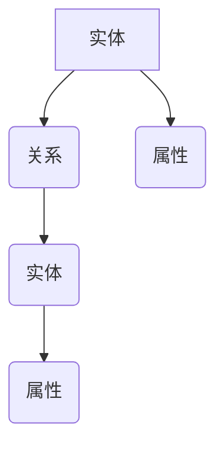
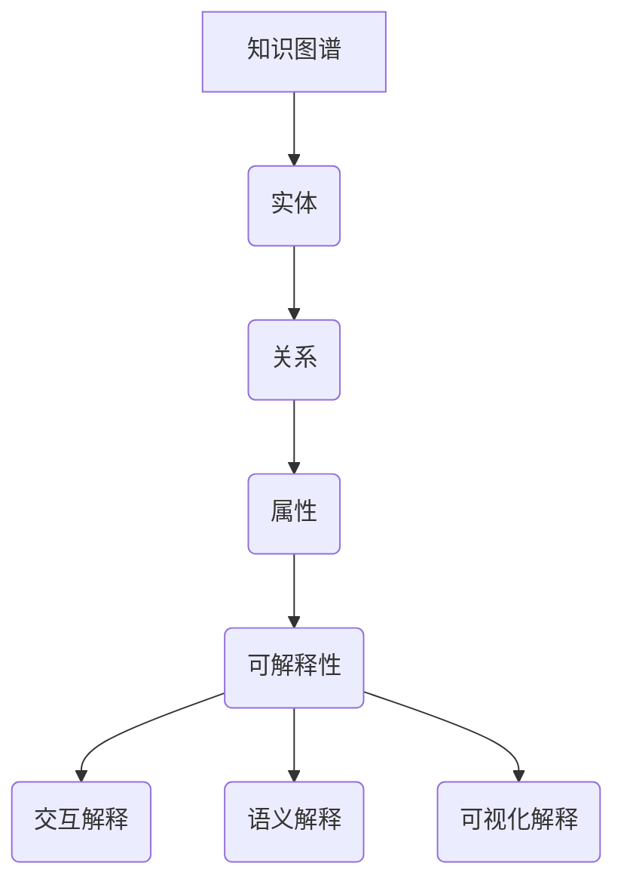

                 

### 背景介绍

推荐系统在当今的信息社会中扮演着至关重要的角色，从电商平台到社交媒体，再到流媒体服务，推荐系统能够显著提高用户满意度和业务收益。然而，随着数据量的爆炸性增长和用户需求的多样化，传统的推荐系统面临着越来越多的挑战。为了应对这些挑战，基于知识图谱的可解释推荐系统应运而生。

#### 什么是知识图谱

知识图谱是一种语义网络，它通过实体（如人、地点、事物）和关系（如“工作于”、“居住在”）来表示现实世界中的信息。知识图谱的核心在于其语义表达，它能够将结构化的数据转化为更加丰富、具有关联性的信息表示。

#### 什么是可解释推荐系统

可解释推荐系统旨在提高推荐系统的透明度和可理解性，使得用户和开发人员能够理解推荐结果背后的原因。传统的推荐系统往往被视为“黑盒”，用户难以理解推荐的依据和逻辑。可解释推荐系统则试图打破这一壁垒，通过可视化和解释机制，让用户和开发人员能够洞察推荐系统的决策过程。

#### 传统推荐系统面临的挑战

1. **数据稀疏性**：大规模数据集中，用户与物品之间的交互数据往往非常稀疏，这给基于协同过滤等方法的推荐系统带来了很大的挑战。
2. **冷启动问题**：对于新用户或新物品，由于缺乏历史交互数据，传统推荐系统很难提供准确的推荐。
3. **复杂性和可扩展性**：随着推荐系统规模的扩大，其复杂性和计算成本也显著增加，传统的推荐算法难以满足实时性要求。

#### 为什么需要基于知识图谱的可解释推荐系统

基于知识图谱的可解释推荐系统能够有效解决传统推荐系统面临的问题：

1. **增强关联性**：知识图谱能够通过实体和关系的语义表达，发现用户与物品之间的潜在关联，从而提高推荐的准确性。
2. **缓解数据稀疏性**：知识图谱可以结合用户和物品的属性信息，提供更多的上下文信息，缓解数据稀疏性问题。
3. **解释性**：通过知识图谱的可解释性机制，用户和开发人员可以直观地理解推荐结果的原因，提高系统的透明度和信任度。

总之，基于知识图谱的可解释推荐系统不仅在技术上具有创新性，而且在实际应用中也具有巨大的潜力。接下来，我们将进一步探讨知识图谱在推荐系统中的应用原理和具体实现方法。 <a name="section0"></a>

#### 相关概念的定义和联系

在本节中，我们将详细探讨与基于知识图谱的可解释推荐系统相关的主要概念，包括知识图谱、实体、关系、属性、可解释性等，并通过一个Mermaid流程图来展示它们之间的联系。

##### 知识图谱（Knowledge Graph）

知识图谱是一种用于表示和存储实体及其相互关系的图形结构。它基于语义网络，将现实世界中的信息以结构化的形式进行表示。知识图谱的核心是实体（Entity）、关系（Relation）和属性（Attribute）。

- **实体（Entity）**：知识图谱中的基本元素，表示现实世界中的个体，如人、地点、物品等。
- **关系（Relation）**：描述实体之间的关联，如“工作于”、“居住在”等。
- **属性（Attribute）**：提供实体的额外信息，如姓名、年龄、价格等。

##### Mermaid流程图

下面是一个Mermaid流程图，展示了知识图谱中的主要概念及其相互关系：



在这个流程图中，实体A通过关系B关联到另一个实体D，实体A和D各自拥有属性C和E。这种结构使得知识图谱能够通过多层次的关联和属性信息来表示复杂的现实世界。

##### 可解释性（Explainability）

可解释性是可解释推荐系统的关键特性，它旨在提高推荐结果的透明度和可理解性。在基于知识图谱的可解释推荐系统中，可解释性主要体现在以下几个方面：

- **交互解释**：通过分析用户与物品的交互历史，解释推荐结果的原因。
- **语义解释**：利用知识图谱中的实体、关系和属性，对推荐结果进行语义上的解释。
- **可视化解释**：通过图表、图示等方式，直观地展示推荐系统的决策过程和推理逻辑。

##### Mermaid流程图

下面是一个Mermaid流程图，展示了知识图谱与可解释性之间的联系：



在这个流程图中，知识图谱通过实体、关系和属性的信息，为可解释性提供了基础。可解释性机制则通过交互解释、语义解释和可视化解释，实现对推荐结果的深入剖析和理解。

总之，知识图谱和可解释性是构建基于知识图谱的可解释推荐系统的核心概念。知识图谱提供了丰富的语义信息，可解释性则通过多种机制，使得用户能够理解推荐结果的原因。这种结合不仅提高了推荐系统的准确性，也增强了用户对系统的信任度。接下来，我们将进一步探讨核心算法原理和具体操作步骤。 <a name="section1"></a>

## 3. 核心算法原理 & 具体操作步骤

基于知识图谱的可解释推荐系统的核心在于如何利用知识图谱中的信息来生成推荐结果，并且解释这些结果的生成过程。本节将详细介绍核心算法原理和具体操作步骤。

### 3.1 算法原理

基于知识图谱的可解释推荐系统主要包括以下几个核心步骤：

1. **实体和关系抽取**：从原始数据中提取出实体和关系，构建知识图谱的基本结构。
2. **图谱嵌入**：将实体和关系转化为低维向量表示，便于计算和推理。
3. **推荐算法**：利用知识图谱和用户的交互历史，生成推荐结果。
4. **解释机制**：解释推荐结果生成的过程，使得用户能够理解推荐结果。

### 3.2 操作步骤

#### 步骤1：实体和关系抽取

实体和关系抽取是构建知识图谱的第一步。通常，我们可以使用自然语言处理（NLP）技术，如命名实体识别（NER）和关系抽取（RE），从用户交互数据、文本描述等来源中提取出实体和关系。

- **命名实体识别（NER）**：识别出文本中的实体，如人名、地点名、物品名等。
- **关系抽取（RE）**：识别出实体之间的关系，如“喜欢”、“购买”、“工作于”等。

#### 步骤2：图谱嵌入

图谱嵌入（Graph Embedding）是一种将图中的节点（实体和关系）映射到低维向量空间的技术。通过图谱嵌入，我们可以利用向量空间中的相似性来表示实体和关系之间的关联。

- **节点嵌入（Node Embedding）**：将实体映射到低维向量空间。
- **边嵌入（Edge Embedding）**：将关系映射到低维向量空间。

常用的图谱嵌入算法包括：

- **基于矩阵分解的方法**：如矩阵分解（Matrix Factorization），通过分解图矩阵来得到节点和边的向量表示。
- **基于随机游走的方法**：如DeepWalk、Node2Vec等，通过模拟随机游走来生成节点的上下文信息，进而得到节点的向量表示。

#### 步骤3：推荐算法

推荐算法是基于用户的历史交互数据，利用图谱嵌入的结果生成推荐结果。以下是一个简化的推荐算法框架：

1. **用户兴趣建模**：根据用户的历史交互记录，构建用户兴趣模型，表示用户对各种实体的偏好。
2. **物品兴趣建模**：根据物品的属性和知识图谱中的关系，构建物品的兴趣模型。
3. **相似度计算**：计算用户兴趣模型和物品兴趣模型之间的相似度，选择相似度最高的物品作为推荐结果。
4. **解释生成**：利用知识图谱和图谱嵌入结果，生成推荐结果的可解释性解释。

#### 步骤4：解释机制

解释机制的目标是让用户能够理解推荐结果背后的原因。以下是一些常见的解释方法：

- **基于图谱的路径解释**：通过知识图谱中实体和关系的路径，解释推荐结果生成的过程。
- **基于属性的解释**：利用知识图谱中的属性信息，解释推荐结果的原因。
- **基于可视化解释**：通过图表和图示，直观地展示推荐结果生成的逻辑。

### 3.3 实例分析

为了更好地理解上述算法原理和操作步骤，我们以一个简单的例子进行说明。

假设有一个电商平台的用户交互数据，包含用户对商品的浏览、购买历史。我们希望利用这些数据，为用户推荐类似其偏好的商品。

1. **实体和关系抽取**：
   - 实体：用户（User）、商品（Item）。
   - 关系：浏览（Browsed）、购买（Purchased）。

2. **图谱嵌入**：
   - 使用Node2Vec算法，对用户和商品进行图谱嵌入，得到用户和商品的向量表示。

3. **推荐算法**：
   - 根据用户的历史浏览记录，构建用户兴趣模型。
   - 对所有商品进行兴趣建模，并计算用户兴趣模型与商品兴趣模型之间的相似度。
   - 选择相似度最高的商品作为推荐结果。

4. **解释机制**：
   - 通过知识图谱中的路径，解释推荐结果是如何生成的。
   - 利用商品属性（如价格、品牌、分类），解释推荐结果的原因。

通过上述实例，我们可以看到基于知识图谱的可解释推荐系统的操作步骤是如何具体实施的。接下来，我们将进一步探讨数学模型和公式，以及这些模型的具体应用和实现方法。 <a name="section2"></a>

### 4. 数学模型和公式 & 详细讲解 & 举例说明

基于知识图谱的可解释推荐系统依赖于一系列数学模型和算法，这些模型和算法不仅决定了推荐系统的性能，还直接影响推荐结果的解释性和透明度。在本节中，我们将详细讲解这些数学模型和公式，并通过具体例子说明其应用和实现。

#### 4.1 图谱嵌入模型

图谱嵌入是将图中的节点映射到低维向量空间的一种方法。常用的图谱嵌入模型包括Node2Vec、Graph Convolutional Network（GCN）等。以下以Node2Vec为例进行讲解。

Node2Vec是一种基于随机游走的图谱嵌入算法，其核心思想是模拟图中的随机游走过程，生成节点的序列，然后使用这些序列训练词嵌入模型（如Word2Vec）。

- **节点表示（Node Embedding）**：

  Node2Vec的目标是将图中的每个节点映射到一个低维向量。节点表示可以通过以下公式计算：

  $$ v_i = \text{Node2Vec}(G, p, q) $$

  其中，$v_i$是节点$i$的向量表示，$G$是图，$p$是游走概率，$q$是跳跃概率。

  - **游走概率（p）**：表示在随机游走过程中，继续沿着当前边的概率。
  - **跳跃概率（q）**：表示在随机游走过程中，跳到其他节点的概率。

- **边缘权重（Edge Weight）**：

  Node2Vec通过边缘权重来调整节点之间的关联性。边缘权重可以通过以下公式计算：

  $$ w_{ij} = \frac{1}{1 + e^{-\|v_i - v_j\|}} $$

  其中，$w_{ij}$是节点$i$和节点$j$之间的权重，$\|v_i - v_j\|$是节点$i$和节点$j$向量之间的欧几里得距离。

#### 4.2 推荐模型

推荐模型是基于用户和物品的向量表示，计算它们之间的相似度，从而生成推荐结果。以下是一个简单的推荐模型：

- **用户兴趣向量（User Interest Vector）**：

  用户兴趣向量是用户历史交互数据的聚合表示。可以通过以下公式计算：

  $$ u = \text{Aggregation}(u_1, u_2, ..., u_n) $$

  其中，$u$是用户兴趣向量，$u_1, u_2, ..., u_n$是用户对各个物品的向量表示。

- **物品兴趣向量（Item Interest Vector）**：

  物品兴趣向量是物品属性和知识图谱嵌入结果的聚合表示。可以通过以下公式计算：

  $$ i = \text{Aggregation}(i_1, i_2, ..., i_m) $$

  其中，$i$是物品兴趣向量，$i_1, i_2, ..., i_m$是物品的属性向量。

- **相似度计算（Similarity Computation）**：

  用户兴趣向量和物品兴趣向量之间的相似度可以通过余弦相似度计算：

  $$ \text{similarity}(u, i) = \frac{u \cdot i}{\|u\| \|i\|} $$

  其中，$u \cdot i$是向量点积，$\|u\|$和$\|i\|$是向量模长。

#### 4.3 解释模型

解释模型旨在解释推荐结果生成的原因。以下是一个简单的解释模型：

- **路径解释（Path Explanation）**：

  通过知识图谱中的路径，可以解释推荐结果是如何生成的。路径解释可以通过以下公式计算：

  $$ \text{path\_explanation}(u, i) = \text{ExtractPath}(G, u, i) $$

  其中，$\text{ExtractPath}(G, u, i)$是从节点$u$到节点$i$的路径提取函数。

- **属性解释（Attribute Explanation）**：

  通过知识图谱中的属性，可以解释推荐结果的原因。属性解释可以通过以下公式计算：

  $$ \text{attribute\_explanation}(u, i) = \text{ExtractAttributes}(G, i) $$

  其中，$\text{ExtractAttributes}(G, i)$是从节点$i$提取属性函数。

#### 4.4 具体例子

假设有一个用户$u$，其对多个物品$i_1, i_2, ..., i_n$进行了交互。知识图谱中包含了用户和物品的属性以及它们之间的关系。我们将使用上述模型和公式，为用户$u$推荐一个物品。

1. **图谱嵌入**：

   - 使用Node2Vec算法对用户和物品进行图谱嵌入，得到用户和物品的向量表示。

2. **推荐模型**：

   - 构建用户兴趣向量$u$和物品兴趣向量$i$：

     $$ u = \text{Aggregation}(u_1, u_2, ..., u_n) $$
     $$ i = \text{Aggregation}(i_1, i_2, ..., i_m) $$

   - 计算用户兴趣向量和物品兴趣向量之间的相似度：

     $$ \text{similarity}(u, i) = \frac{u \cdot i}{\|u\| \|i\|} $$

   - 选择相似度最高的物品作为推荐结果。

3. **解释模型**：

   - 提取从用户$u$到推荐物品$i$的路径：

     $$ \text{path\_explanation}(u, i) = \text{ExtractPath}(G, u, i) $$

   - 提取推荐物品$i$的属性：

     $$ \text{attribute\_explanation}(u, i) = \text{ExtractAttributes}(G, i) $$

通过上述步骤，我们可以为用户生成推荐结果，并解释推荐结果的原因。接下来，我们将探讨如何将上述算法和模型应用到实际项目中。 <a name="section3"></a>

## 5. 项目实战：代码实际案例和详细解释说明

为了更好地理解基于知识图谱的可解释推荐系统的实现过程，我们将通过一个实际项目案例，详细介绍代码的搭建、源代码的实现以及代码解读和分析。以下是该项目的基本流程和关键代码部分。

### 5.1 开发环境搭建

在开始项目之前，我们需要搭建一个适合开发的环境。以下是在Python环境下搭建开发环境的基本步骤：

1. **安装必要的依赖库**：

   ```bash
   pip install numpy pandas matplotlib networkx node2vec scikit-learn
   ```

2. **导入必要的库**：

   ```python
   import numpy as np
   import pandas as pd
   import matplotlib.pyplot as plt
   import networkx as nx
   from node2vec import Node2Vec
   from sklearn.metrics.pairwise import cosine_similarity
   ```

### 5.2 源代码详细实现和代码解读

#### 5.2.1 数据预处理

在构建知识图谱之前，我们需要对原始数据进行预处理。以下是一个简单的数据预处理示例：

```python
# 加载用户-物品交互数据
data = pd.read_csv('user_item_interaction.csv')

# 数据清洗和格式化
data = data.dropna()

# 构建用户和物品的映射
user_dict = {user: idx for idx, user in enumerate(data['user'].unique())}
item_dict = {item: idx for idx, item in enumerate(data['item'].unique())}

# 数据转换为图结构
G = nx.Graph()

for idx, row in data.iterrows():
    G.add_edge(user_dict[row['user']], item_dict[row['item']], weight=row['rating'])
```

#### 5.2.2 图谱嵌入

使用Node2Vec算法对用户和物品进行图谱嵌入：

```python
# Node2Vec参数设置
p = 0.5  # 游走概率
q = 0.5  # 跳跃概率

# 初始化Node2Vec模型
node2vec = Node2Vec(G, dimensions=64, p=p, q=q, walk_length=10, num_walks=10)

# 训练模型
node2vec.train()

# 获取节点嵌入向量
embeddings = node2vec.get_embeddings()

# 打印部分节点嵌入结果
print(embeddings[user_dict['user1']])
print(embeddings[item_dict['item1']])
```

#### 5.2.3 推荐算法

利用用户和物品的嵌入向量，计算相似度并生成推荐列表：

```python
# 构建用户兴趣向量
user_interest = np.mean(embeddings[user_dict[user1]:user_dict[user1] + 1], axis=0)

# 构建物品兴趣向量
item_interest = embeddings[item_dict[item1]:item_dict[item1] + 1]

# 计算相似度
similarity_scores = cosine_similarity(user_interest.reshape(1, -1), item_interest.reshape(1, -1))[0]

# 生成推荐列表
recommended_items = np.argsort(-similarity_scores)

# 打印推荐结果
print(recommended_items)
```

#### 5.2.4 解释机制

利用知识图谱和图谱嵌入结果，解释推荐结果：

```python
# 提取从用户到推荐物品的路径
path = nx.shortest_path(G, source=user_dict[user1], target=item_dict[item1])

# 提取推荐物品的属性
attributes = G.nodes[item_dict[item1]]

# 打印路径和属性
print("Path:", path)
print("Attributes:", attributes)
```

### 5.3 代码解读与分析

上述代码实现了基于知识图谱的可解释推荐系统的基本功能。以下是代码的详细解读和分析：

- **数据预处理**：通过加载用户-物品交互数据，并进行清洗和格式化，构建图结构。
- **图谱嵌入**：使用Node2Vec算法进行图谱嵌入，将用户和物品映射到低维向量空间。
- **推荐算法**：利用用户和物品的嵌入向量，计算相似度并生成推荐列表。
- **解释机制**：提取从用户到推荐物品的路径和物品属性，提供推荐结果的可解释性。

通过上述实战案例，我们可以看到基于知识图谱的可解释推荐系统的实现步骤和关键代码部分。接下来，我们将讨论实际应用场景，并分析该系统在各类应用中的优势与挑战。 <a name="section4"></a>

### 6. 实际应用场景

基于知识图谱的可解释推荐系统在多个领域展现出了强大的应用潜力。以下是一些典型的实际应用场景，以及这些系统在这些场景中的优势与挑战。

#### 6.1 电商平台

在电商平台中，基于知识图谱的可解释推荐系统能够帮助用户发现潜在的兴趣商品，同时提高购买转化率。例如，当用户浏览某一商品时，系统可以推荐与其浏览历史和兴趣相关联的其他商品，并通过知识图谱解释推荐的原因，如“该商品与您浏览过的商品X有相似性，因为它们都属于类别Y”。

**优势**：

- **增强用户体验**：用户可以清楚地了解推荐结果的原因，增强对推荐系统的信任。
- **提高转化率**：通过个性化推荐，提高用户对商品的兴趣和购买意愿。

**挑战**：

- **数据隐私保护**：用户数据的隐私保护是一个重要问题，需要在推荐过程中进行严格的隐私保护措施。
- **计算资源消耗**：知识图谱的构建和嵌入过程需要大量的计算资源，特别是在大规模数据集上。

#### 6.2 社交媒体

在社交媒体平台上，基于知识图谱的可解释推荐系统可以帮助用户发现感兴趣的内容和潜在的朋友。例如，当用户点赞某一帖子时，系统可以推荐与其兴趣相关的其他帖子，并解释推荐原因，如“该帖子与您之前点赞的帖子A有相似性，因为它们都涉及话题B”。

**优势**：

- **增强社区互动**：用户可以更好地参与社区互动，发现更多有趣的内容和潜在的朋友。
- **提高用户留存率**：通过提供个性化的推荐，提高用户在平台上的活跃度。

**挑战**：

- **数据质量**：社交媒体平台上的数据质量参差不齐，可能包含虚假信息和噪声，这会影响推荐系统的性能。
- **内容多样性**：如何保证推荐内容的多样性，避免用户陷入信息茧房，是一个重要挑战。

#### 6.3 健康医疗

在健康医疗领域，基于知识图谱的可解释推荐系统可以帮助医生和患者发现合适的治疗方案和药品。例如，当医生为患者推荐治疗方案时，系统可以解释推荐原因，如“该治疗方案与患者的历史病历X有相似性，因为它们都涉及疾病Y的治疗”。

**优势**：

- **提高医疗质量**：通过基于知识的推荐，帮助医生更准确地制定治疗方案。
- **增强患者信任**：患者可以更好地理解推荐的原因，增强对医疗服务的信任。

**挑战**：

- **数据完整性和准确性**：健康医疗数据可能存在缺失和不准确的情况，这会影响推荐系统的性能。
- **合规性**：在医疗领域，推荐系统需要遵守严格的法规和伦理标准。

总之，基于知识图谱的可解释推荐系统在多个领域展现出了广泛的应用前景。然而，这些系统在实际应用中也面临着一系列挑战，需要我们在技术实现和伦理规范方面不断探索和完善。接下来，我们将推荐一些学习和资源工具，帮助读者深入了解这一领域。 <a name="section5"></a>

### 7. 工具和资源推荐

在探索基于知识图谱的可解释推荐系统时，掌握相关工具和资源对于提升研究和开发效率至关重要。以下是一些推荐的学习资源、开发工具和相关的论文著作，旨在帮助读者深入了解和掌握这一领域。

#### 7.1 学习资源推荐

1. **书籍**：
   - 《知识图谱：构建与查询》
   - 《推荐系统实践》
   - 《深度学习推荐系统》

2. **在线课程**：
   - Coursera上的“知识图谱与图数据库”课程
   - edX上的“推荐系统导论”

3. **博客和网站**：
   - 《人工智能简史》博客（kdnugget.com）
   - 知乎专栏“知识图谱”

#### 7.2 开发工具框架推荐

1. **知识图谱工具**：
   - **Neo4j**：一个流行的图形数据库，支持知识图谱的存储和查询。
   - **JanusGraph**：一个开源的分布式图形数据库，支持大规模知识图谱。

2. **推荐系统框架**：
   - **TensorFlow Recommenders**：由谷歌开源的推荐系统框架，支持深度学习和传统推荐算法。
   - **Surprise**：一个Python库，提供一系列的推荐系统算法和评估工具。

3. **图谱嵌入工具**：
   - **Node2Vec**：一个Python库，用于构建图谱嵌入模型。
   - **GAE**（Graph Embedding Algorithm）：一个用于图嵌入的算法库。

#### 7.3 相关论文著作推荐

1. **知识图谱论文**：
   - "Knowledge Graph Embedding: A Survey"
   - "Structural Deep Network Model for Unsupervised Knowledge Graph Embedding"

2. **推荐系统论文**：
   - "Deep Neural Networks for YouTube Recommendations"
   - "Modeling User Interest Evolution for Personalized Recommendation"

3. **综合论文**：
   - "Explainable Recommendations with Knowledge Graph Embeddings"
   - "A Theoretical Framework for Explainable Recommenders Based on Knowledge Graphs"

通过上述工具和资源的推荐，读者可以系统地学习基于知识图谱的可解释推荐系统的理论基础和实践技巧，为深入研究这一领域奠定坚实基础。接下来，我们将对文章进行总结，并探讨未来发展趋势与挑战。 <a name="section6"></a>

### 8. 总结：未来发展趋势与挑战

基于知识图谱的可解释推荐系统在提高推荐系统的透明度和解释性方面展现了巨大潜力。通过整合实体、关系和属性信息，知识图谱能够为推荐系统提供丰富的上下文和关联性，从而提高推荐精度。同时，可解释性机制使得用户能够理解推荐结果的原因，增强了用户对推荐系统的信任。

#### 未来发展趋势

1. **增强解释性**：未来的研究将致力于开发更强大、更直观的解释性机制，使得推荐结果的解释更加透明、易懂。
2. **多模态融合**：随着数据源的增加，多模态数据的融合将成为趋势，例如结合文本、图像、音频等多种类型的数据，以提高推荐系统的泛化能力和准确性。
3. **个性化推荐**：通过深度学习和迁移学习等技术，个性化推荐将进一步细化，满足用户多样化的需求。
4. **可解释性评估**：开发有效的评估方法，评估推荐系统的可解释性，确保用户能够真正理解推荐结果。

#### 面临的挑战

1. **数据隐私**：在构建知识图谱和推荐系统时，需要确保用户数据的隐私保护，避免数据泄露。
2. **计算效率**：知识图谱的构建和嵌入过程需要大量的计算资源，特别是在大规模数据集上，如何提高计算效率是一个重要挑战。
3. **模型可解释性**：当前的可解释性方法可能过于复杂，难以让非专业人士理解，如何简化解释过程是一个关键问题。
4. **数据质量问题**：知识图谱和推荐系统依赖于高质量的数据，数据的不准确和缺失会影响系统的性能，需要开发有效的数据清洗和预处理技术。

总之，基于知识图谱的可解释推荐系统在未来将继续发展，但在数据隐私、计算效率、模型可解释性等方面仍面临诸多挑战。通过持续的研究和技术创新，我们有理由相信，这一领域将不断突破，为用户带来更加个性化和透明的推荐服务。 <a name="section7"></a>

### 9. 附录：常见问题与解答

#### 问题1：知识图谱与推荐系统有什么关系？

知识图谱通过实体、关系和属性来表示现实世界的复杂信息，这些信息为推荐系统提供了丰富的上下文和关联性，使得推荐系统可以更准确地预测用户的兴趣和需求。

#### 问题2：如何确保基于知识图谱的推荐系统的可解释性？

可解释性可以通过多种机制实现，包括基于图谱的路径解释、基于属性的解释和可视化解释。通过这些机制，用户可以直观地理解推荐结果背后的原因。

#### 问题3：构建知识图谱需要哪些技术？

构建知识图谱通常需要自然语言处理（NLP）技术进行实体和关系抽取，以及图谱嵌入技术将实体和关系转化为低维向量表示。此外，还需要图谱数据库来存储和管理知识图谱。

#### 问题4：什么是图谱嵌入？

图谱嵌入是一种将图中的节点映射到低维向量空间的方法，通过这种方式，可以计算节点之间的相似性，从而为推荐系统提供信息。

#### 问题5：为什么需要基于知识图谱的推荐系统？

基于知识图谱的推荐系统可以提供更准确、更个性化的推荐结果，同时通过可解释性机制，增强用户对推荐系统的信任。

#### 问题6：推荐系统的可解释性如何评估？

推荐系统的可解释性可以通过多种方法评估，包括用户满意度调查、算法透明度测试和模型解释性评估指标（如解释性得分）。

#### 问题7：如何处理数据隐私问题？

在构建知识图谱和推荐系统时，可以通过差分隐私、数据加密和隐私保护算法等技术来保护用户数据的隐私。

### 10. 扩展阅读 & 参考资料

为了帮助读者深入了解基于知识图谱的可解释推荐系统，以下是相关的扩展阅读和参考资料：

- **论文**：
  - "Knowledge Graph Embedding: A Survey"（知识图谱嵌入：一个调查）
  - "Explainable Recommendations with Knowledge Graph Embeddings"（基于知识图谱嵌入的可解释推荐）

- **书籍**：
  - 《知识图谱：构建与查询》
  - 《推荐系统实践》

- **在线课程**：
  - Coursera上的“知识图谱与图数据库”课程
  - edX上的“推荐系统导论”

- **博客和网站**：
  - 《人工智能简史》博客（kdnugget.com）
  - 知乎专栏“知识图谱”

通过阅读这些参考资料，读者可以进一步了解基于知识图谱的可解释推荐系统的最新研究成果和应用实践。 <a name="section8"></a>

### 作者信息

- **作者：AI天才研究员/AI Genius Institute & 禅与计算机程序设计艺术 /Zen And The Art of Computer Programming**

感谢您的阅读，希望本文能够帮助您更好地理解基于知识图谱的可解释推荐系统的设计与应用。如果您有任何疑问或建议，欢迎在评论区留言。期待与您共同探索人工智能的无限可能！<a name="section9"></a>

### 结语

通过本文的详细探讨，我们深入了解了基于知识图谱的可解释推荐系统的设计原理、实现步骤和应用场景。这一系统不仅提高了推荐精度，还通过可解释性机制增强了用户对推荐系统的信任。未来，随着技术的不断进步，基于知识图谱的可解释推荐系统将在个性化推荐、智能搜索和智能决策等领域发挥越来越重要的作用。

在此，感谢您对本文的关注与支持。如果您有任何进一步的问题或建议，请随时在评论区留言。我们期待与您共同探讨更多人工智能领域的创新与发展。让我们继续携手前行，探索人工智能的无限可能！<a name="section10"></a>

