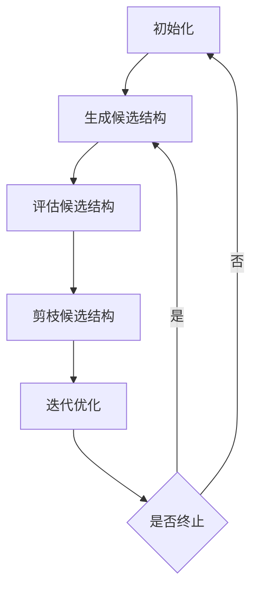
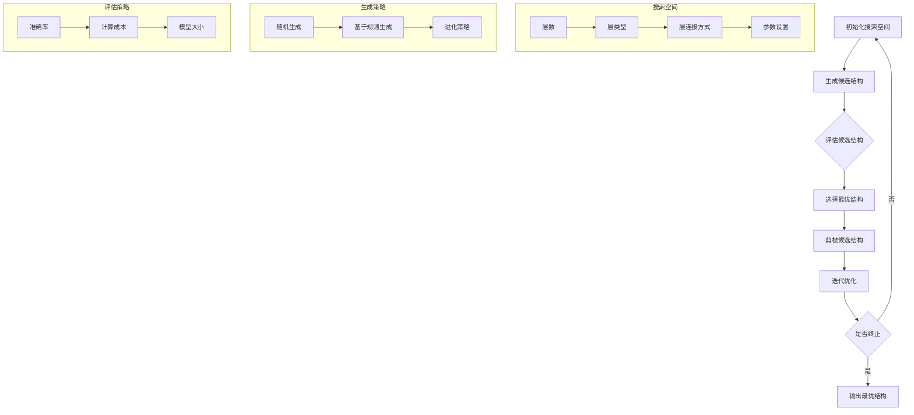
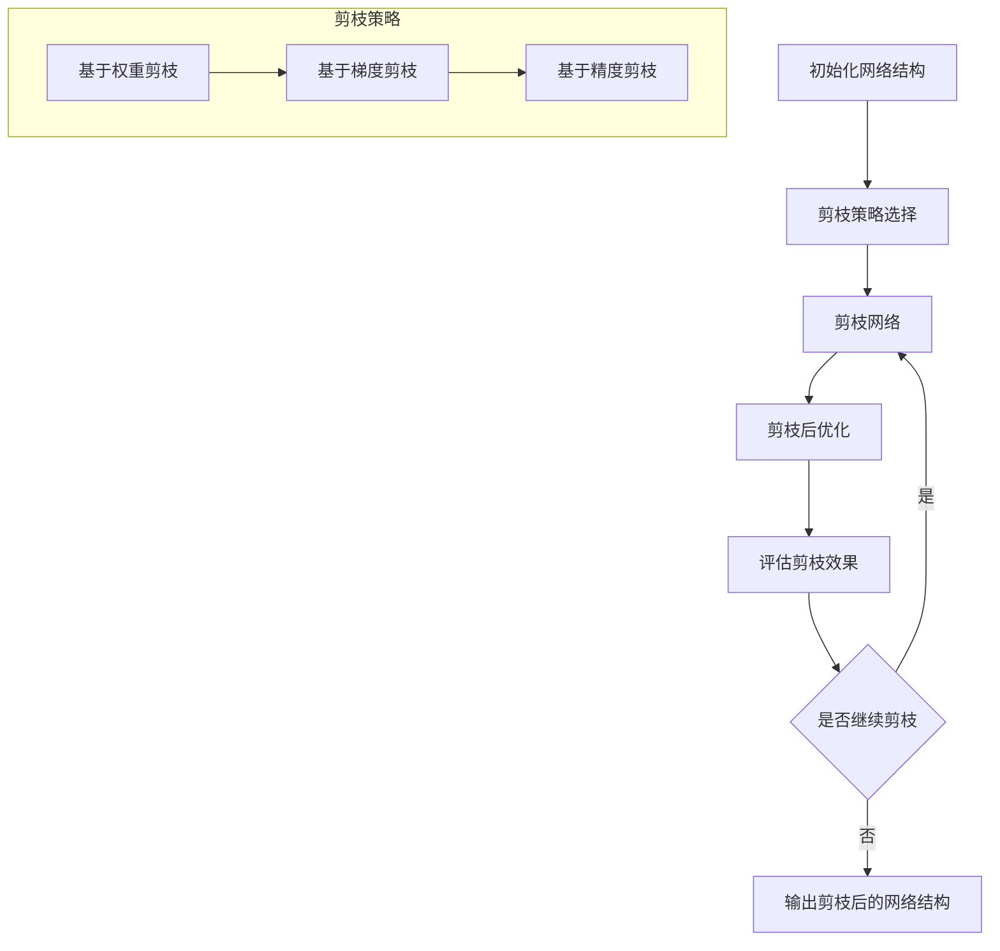

                 

# 基于神经架构搜索的自动化剪枝方法

> **关键词**：神经架构搜索、自动化剪枝、深度学习、模型优化、算法原理

> **摘要**：本文将探讨基于神经架构搜索的自动化剪枝方法，介绍其核心概念、原理及具体实现步骤，并通过实际项目案例进行详细解释和分析。文章旨在为读者提供全面的技术见解和实战指导，助力其在深度学习模型优化领域的深入研究和应用。

## 1. 背景介绍

随着深度学习技术的飞速发展，深度神经网络（DNN）在图像识别、自然语言处理、语音识别等领域的表现愈发优异。然而，深度神经网络的复杂性也带来了计算资源的高消耗，尤其是在移动设备和嵌入式系统中，模型的计算和存储需求成为限制其应用的关键因素。因此，如何有效减小深度神经网络的规模，降低其计算和存储开销，成为当前研究的热点问题之一。

剪枝（Pruning）是一种常用的模型压缩技术，通过删除网络中不重要的神经元或连接，降低模型的参数数量和计算复杂度。传统的剪枝方法主要依赖于经验或规则，难以保证剪枝后模型的性能。随着深度学习技术的发展，基于神经架构搜索（Neural Architecture Search，NAS）的自动化剪枝方法逐渐受到关注。

神经架构搜索是一种自动搜索最优神经网络结构的方法，通过搜索空间中的大量结构进行实验和评估，找出性能最优的网络结构。结合神经架构搜索的自动化剪枝方法，能够根据网络结构的搜索结果，自适应地剪枝网络，从而实现更高效的模型优化。

本文将介绍基于神经架构搜索的自动化剪枝方法，分析其核心原理和具体实现步骤，并通过实际项目案例进行详细解释和分析。希望本文能为读者在深度学习模型优化领域的研究和应用提供有价值的参考。

## 2. 核心概念与联系

### 2.1 神经架构搜索（Neural Architecture Search，NAS）

神经架构搜索是一种自动搜索最优神经网络结构的方法。与传统的人工设计网络结构相比，NAS通过在搜索空间中生成、评估和优化大量网络结构，寻找出在特定任务上表现最优的网络。

#### 2.1.1 搜索空间（Search Space）

搜索空间是NAS的核心概念，定义了网络结构搜索的范围。一个典型的搜索空间包括以下方面：

- **层数（Layer Counts）**：定义网络的层数，层数可以是一个固定的值，也可以是一个范围。
- **层类型（Layer Types）**：定义网络中每层的类型，如卷积层（Convolutional Layer）、全连接层（Fully Connected Layer）等。
- **层连接方式（Inter-layer Connections）**：定义层与层之间的连接方式，如直接连接（Direct Connection）、跳跃连接（Skip Connection）等。
- **参数设置（Parameter Settings）**：定义网络中的参数，如卷积核的大小、步长、填充方式等。

#### 2.1.2 生成策略（Generation Strategy）

生成策略是NAS的关键环节，用于从搜索空间中生成候选网络结构。常见的生成策略有：

- **随机生成**：随机生成网络结构，然后对生成的结构进行评估。
- **基于规则生成**：根据一定的规则生成网络结构，如根据卷积核的大小、步长等参数生成不同的结构。
- **进化策略（Evolutionary Strategies）**：通过遗传算法等进化策略，对网络结构进行迭代优化。

#### 2.1.3 评估策略（Evaluation Strategy）

评估策略用于评估生成的网络结构在特定任务上的性能。评估指标通常包括：

- **准确率（Accuracy）**：网络在测试集上的分类准确率。
- **计算成本（Computational Cost）**：网络在测试集上的计算时间或参数数量。
- **模型大小（Model Size）**：网络的参数数量和存储空间。

### 2.2 自动化剪枝（Automated Pruning）

自动化剪枝是一种通过算法自动剪枝网络的方法，旨在降低模型的计算和存储开销。自动化剪枝通常包括以下几个步骤：

- **初始化**：初始化网络结构，可以是随机生成的结构，也可以是预训练的结构。
- **剪枝策略**：根据一定的剪枝策略，逐层剪枝网络。常见的剪枝策略有：
  - **基于权重的剪枝**：根据权重的绝对值或相对值进行剪枝。
  - **基于梯度的剪枝**：根据梯度的绝对值或相对值进行剪枝。
  - **基于精度的剪枝**：在保证模型精度的前提下，剪枝网络。
- **剪枝后优化**：在剪枝后对模型进行优化，以恢复部分性能损失。
- **迭代剪枝**：通过多次迭代剪枝，逐渐降低模型的计算和存储开销。

### 2.3 基于神经架构搜索的自动化剪枝方法

基于神经架构搜索的自动化剪枝方法将神经架构搜索和自动化剪枝相结合，通过在搜索过程中自适应地剪枝网络，实现更高效的模型优化。该方法的主要步骤如下：

1. **初始化**：初始化网络结构，可以是随机生成的结构，也可以是预训练的结构。
2. **生成候选结构**：根据搜索策略，从搜索空间中生成多个候选网络结构。
3. **评估候选结构**：对生成的候选结构进行评估，选择性能最优的结构。
4. **剪枝候选结构**：根据剪枝策略，对选出的最优结构进行剪枝，降低计算和存储开销。
5. **迭代优化**：在剪枝后对模型进行优化，恢复部分性能损失，并继续生成新的候选结构，直到满足终止条件。

### 2.4 Mermaid 流程图

下面是一个简单的 Mermaid 流程图，描述了基于神经架构搜索的自动化剪枝方法的流程：



在 Mermaid 流程图中，节点（如 A、B、C 等）表示具体的步骤，边表示步骤之间的依赖关系。通过 Mermaid 流程图，可以清晰地展示基于神经架构搜索的自动化剪枝方法的流程和关键步骤。

## 3. 核心算法原理 & 具体操作步骤

### 3.1 神经架构搜索（Neural Architecture Search，NAS）

神经架构搜索的核心原理是通过搜索空间中的大量结构进行实验和评估，找出性能最优的网络结构。下面是一个简单的神经架构搜索算法原理图：



#### 3.1.1 初始化搜索空间

初始化搜索空间是神经架构搜索的第一步，主要定义网络结构搜索的范围。在初始化搜索空间时，需要考虑以下因素：

- **层数**：定义网络的层数，可以是固定的值，也可以是一个范围。例如，层数可以在 2 到 5 之间。
- **层类型**：定义网络中每层的类型，如卷积层、全连接层等。层类型可以是一个固定的列表，也可以是一个范围。
- **层连接方式**：定义层与层之间的连接方式，如直接连接、跳跃连接等。连接方式可以是一个固定的列表，也可以是一个范围。
- **参数设置**：定义网络中的参数，如卷积核的大小、步长、填充方式等。参数设置可以是一个固定的值，也可以是一个范围。

#### 3.1.2 生成候选结构

生成候选结构是神经架构搜索的核心步骤，通过在搜索空间中生成多个候选网络结构。生成策略有多种，下面介绍几种常见的生成策略：

1. **随机生成**：随机生成网络结构，然后对生成的结构进行评估。随机生成方法简单易行，但可能无法找到最优结构。
2. **基于规则生成**：根据一定的规则生成网络结构，如根据卷积核的大小、步长等参数生成不同的结构。基于规则生成方法可以根据领域知识设计规则，提高搜索效率。
3. **进化策略**：通过遗传算法等进化策略，对网络结构进行迭代优化。进化策略可以根据适应度函数，逐步筛选出性能更好的结构。

#### 3.1.3 评估候选结构

评估候选结构是对生成的候选网络结构进行性能评估。评估策略有多种，下面介绍几种常见的评估策略：

1. **准确率**：网络在测试集上的分类准确率。准确率是衡量网络性能的重要指标，可以直观地反映网络的分类能力。
2. **计算成本**：网络在测试集上的计算时间或参数数量。计算成本是衡量网络性能的重要指标，可以反映网络的计算效率和存储空间。
3. **模型大小**：网络的参数数量和存储空间。模型大小是衡量网络性能的重要指标，可以反映网络的存储空间和计算资源需求。

#### 3.1.4 选择最优结构

选择最优结构是根据评估结果，从生成的候选结构中选择性能最优的结构。选择最优结构的方法有多种，下面介绍几种常见的选择方法：

1. **单点选择**：根据评估结果，选择性能最优的单个结构。
2. **多点选择**：根据评估结果，选择性能最好的多个结构，进行后续的剪枝和优化。
3. **加权选择**：根据评估结果，为每个候选结构分配权重，然后根据权重选择最优的结构。

#### 3.1.5 剪枝候选结构

剪枝候选结构是根据选择的最优结构，对网络进行剪枝，降低计算和存储开销。剪枝方法有多种，下面介绍几种常见的剪枝方法：

1. **基于权重的剪枝**：根据权重的绝对值或相对值进行剪枝。基于权重的剪枝方法简单有效，但可能影响网络的性能。
2. **基于梯度的剪枝**：根据梯度的绝对值或相对值进行剪枝。基于梯度的剪枝方法可以更好地保留网络的关键信息，但可能增加剪枝过程的复杂性。
3. **基于精度的剪枝**：在保证模型精度的前提下，进行剪枝。基于精度的剪枝方法可以根据任务需求，灵活调整剪枝力度。

#### 3.1.6 迭代优化

迭代优化是对剪枝后的网络进行优化，以恢复部分性能损失。迭代优化的方法有多种，下面介绍几种常见的优化方法：

1. **随机优化**：通过随机搜索，逐步优化网络结构。
2. **梯度优化**：利用梯度下降等方法，优化网络结构。
3. **进化优化**：通过遗传算法等进化策略，优化网络结构。

### 3.2 自动化剪枝（Automated Pruning）

自动化剪枝是一种通过算法自动剪枝网络的方法，旨在降低模型的计算和存储开销。下面是一个简单的自动化剪枝算法原理图：



#### 3.2.1 初始化网络结构

初始化网络结构是自动化剪枝的第一步，可以采用随机生成的结构，也可以是预训练的结构。初始化网络结构时，需要考虑以下因素：

- **网络结构**：初始化网络的结构，如层数、层类型、连接方式等。
- **参数设置**：初始化网络中的参数，如卷积核的大小、步长、填充方式等。

#### 3.2.2 剪枝策略选择

剪枝策略选择是根据网络结构和任务需求，选择合适的剪枝策略。常见的剪枝策略有：

1. **基于权重的剪枝**：根据权重的绝对值或相对值进行剪枝。基于权重的剪枝方法简单有效，但可能影响网络的性能。
2. **基于梯度的剪枝**：根据梯度的绝对值或相对值进行剪枝。基于梯度的剪枝方法可以更好地保留网络的关键信息，但可能增加剪枝过程的复杂性。
3. **基于精度的剪枝**：在保证模型精度的前提下，进行剪枝。基于精度的剪枝方法可以根据任务需求，灵活调整剪枝力度。

#### 3.2.3 剪枝网络

剪枝网络是根据选择的剪枝策略，对网络进行剪枝。剪枝过程中，需要考虑以下因素：

- **剪枝力度**：根据任务需求，调整剪枝力度，以平衡模型性能和计算资源需求。
- **剪枝方式**：根据剪枝策略，采用不同的剪枝方式，如删除神经元、删除连接等。

#### 3.2.4 剪枝后优化

剪枝后优化是对剪枝后的网络进行优化，以恢复部分性能损失。剪枝后优化可以采用以下方法：

1. **随机优化**：通过随机搜索，逐步优化网络结构。
2. **梯度优化**：利用梯度下降等方法，优化网络结构。
3. **进化优化**：通过遗传算法等进化策略，优化网络结构。

#### 3.2.5 评估剪枝效果

评估剪枝效果是对剪枝后的网络进行性能评估，以判断剪枝是否达到预期效果。评估效果可以采用以下指标：

1. **准确率**：网络在测试集上的分类准确率。
2. **计算成本**：网络在测试集上的计算时间或参数数量。
3. **模型大小**：网络的参数数量和存储空间。

#### 3.2.6 是否继续剪枝

是否继续剪枝是根据评估结果，决定是否继续进行剪枝。如果评估结果满足要求，则输出剪枝后的网络结构；否则，继续进行剪枝过程，直到满足要求。

## 4. 数学模型和公式 & 详细讲解 & 举例说明

### 4.1 数学模型

基于神经架构搜索的自动化剪枝方法涉及多个数学模型，主要包括：

#### 4.1.1 神经架构搜索（Neural Architecture Search，NAS）

神经架构搜索的核心数学模型是搜索空间（Search Space）的定义，搜索空间通常可以用一个数学模型表示。一个简单的搜索空间可以表示为：

$$
Search Space = \{ (L, T, C, P) \mid L \in [l_{\min}, l_{\max}], T \in T_set, C \in C_set, P \in P_set \}
$$

其中：

- $L$ 表示网络的层数。
- $T$ 表示层的类型。
- $C$ 表示层与层之间的连接方式。
- $P$ 表示网络中的参数设置。
- $l_{\min}$ 和 $l_{\max}$ 分别表示网络层数的最小值和最大值。
- $T_set$、$C_set$ 和 $P_set$ 分别表示层类型、层连接方式和参数设置的集合。

#### 4.1.2 生成策略（Generation Strategy）

生成策略的数学模型通常基于概率分布，表示为：

$$
P(\theta) = \prod_{i=1}^{n} P(\theta_i)
$$

其中：

- $\theta$ 表示网络的结构参数。
- $n$ 表示网络的结构参数的个数。
- $P(\theta_i)$ 表示第 $i$ 个结构参数的概率分布。

常见的生成策略有：

1. **随机生成**：随机生成网络结构，其概率分布可以表示为：

$$
P(\theta) = \frac{1}{|Search Space|}
$$

其中，$|Search Space|$ 表示搜索空间的大小。

2. **基于规则生成**：基于规则生成网络结构，其概率分布可以表示为：

$$
P(\theta) = \sum_{r \in R} \omega_r P_r(\theta)
$$

其中：

- $R$ 表示规则集合。
- $\omega_r$ 表示第 $r$ 个规则的权重。
- $P_r(\theta)$ 表示根据第 $r$ 个规则生成网络结构的概率。

3. **进化策略**：进化策略的概率分布通常基于适应度函数，表示为：

$$
P(\theta) = \frac{f(\theta)}{\sum_{\theta' \in Search Space} f(\theta')}
$$

其中：

- $f(\theta)$ 表示网络结构的适应度函数。

#### 4.1.3 评估策略（Evaluation Strategy）

评估策略的数学模型通常基于损失函数和精度指标，表示为：

$$
E(\theta) = \sum_{i=1}^{N} L(y_i, \theta)
$$

其中：

- $E(\theta)$ 表示网络结构的评估损失。
- $L(y_i, \theta)$ 表示第 $i$ 个样本的损失函数。
- $N$ 表示样本数量。

常见的评估指标有：

1. **准确率**：准确率的数学模型可以表示为：

$$
Accuracy = \frac{1}{N} \sum_{i=1}^{N} I(y_i = \hat{y}_i)
$$

其中：

- $y_i$ 表示第 $i$ 个样本的真实标签。
- $\hat{y}_i$ 表示第 $i$ 个样本的预测标签。
- $I(y_i = \hat{y}_i)$ 表示指示函数，当 $y_i = \hat{y}_i$ 时，取值为 1，否则取值为 0。

2. **计算成本**：计算成本的数学模型可以表示为：

$$
Computational Cost = \sum_{i=1}^{N} C_i
$$

其中：

- $C_i$ 表示第 $i$ 个样本的计算成本。

3. **模型大小**：模型大小的数学模型可以表示为：

$$
Model Size = \sum_{i=1}^{n_{params}} p_i
$$

其中：

- $n_{params}$ 表示网络参数的数量。
- $p_i$ 表示第 $i$ 个参数的值。

### 4.2 详细讲解

在基于神经架构搜索的自动化剪枝方法中，数学模型和公式的作用主要体现在以下几个方面：

1. **搜索空间定义**：搜索空间定义了网络结构搜索的范围，是神经架构搜索的基础。通过数学模型，可以明确地描述搜索空间中的各种参数和约束条件，为后续的搜索和评估提供依据。

2. **生成策略**：生成策略决定了如何从搜索空间中生成候选网络结构。通过数学模型，可以定义生成策略的概率分布，从而实现随机生成、基于规则生成和进化策略等多种生成方式。

3. **评估策略**：评估策略用于评估候选网络结构的性能。通过数学模型，可以计算网络结构的评估损失、准确率、计算成本和模型大小等指标，从而对网络结构进行量化评估。

4. **剪枝策略**：剪枝策略决定了如何剪枝网络结构，以降低计算和存储开销。通过数学模型，可以定义剪枝策略的约束条件和优化目标，从而实现基于权重剪枝、基于梯度和基于精度的剪枝方法。

5. **优化策略**：优化策略用于优化剪枝后的网络结构，以恢复部分性能损失。通过数学模型，可以定义优化策略的损失函数和优化目标，从而实现随机优化、梯度优化和进化优化等多种优化方式。

### 4.3 举例说明

为了更好地理解基于神经架构搜索的自动化剪枝方法的数学模型和公式，下面通过一个简单的例子进行说明。

假设我们使用卷积神经网络（Convolutional Neural Network，CNN）进行图像分类任务，网络结构如下：

$$
CNN = \{ (L, T, C, P) \mid L \in [2, 5], T = \{Conv2D, MaxPooling, Flatten\}, C = \{Direct Connection, Skip Connection\}, P = \{Kernel Size, Stride, Padding\} \}
$$

其中：

- $L$ 表示网络的层数。
- $T$ 表示层的类型，包括卷积层（Conv2D）、最大池化层（MaxPooling）和全连接层（Flatten）。
- $C$ 表示层与层之间的连接方式，包括直接连接（Direct Connection）和跳跃连接（Skip Connection）。
- $P$ 表示网络中的参数设置，包括卷积核的大小（Kernel Size）、步长（Stride）和填充方式（Padding）。

假设我们采用随机生成策略从搜索空间中生成一个候选网络结构，该网络结构如下：

$$
\theta = (4, \{Conv2D, MaxPooling, Flatten\}, \{Direct Connection, Skip Connection\}, \{Kernel Size = (3, 3), Stride = (1, 1), Padding = 'SAME'\})
$$

其中：

- $L = 4$ 表示网络的层数为 4。
- $T = \{Conv2D, MaxPooling, Flatten\}$ 表示网络中包含卷积层、最大池化层和全连接层。
- $C = \{Direct Connection, Skip Connection\}$ 表示网络中包含直接连接和跳跃连接。
- $P = \{Kernel Size = (3, 3), Stride = (1, 1), Padding = 'SAME'\}$ 表示卷积核的大小为 3×3，步长为 1×1，填充方式为 'SAME'。

假设我们使用以下评估策略对候选网络结构进行评估：

$$
E(\theta) = \sum_{i=1}^{N} L(y_i, \theta)
$$

其中：

- $E(\theta)$ 表示网络结构的评估损失。
- $L(y_i, \theta)$ 表示第 $i$ 个样本的损失函数。
- $N$ 表示样本数量。

假设我们采用基于权重的剪枝策略对候选网络结构进行剪枝，剪枝后的网络结构如下：

$$
\theta' = (4, \{Conv2D, MaxPooling, Flatten\}, \{Direct Connection\}, \{Kernel Size = (3, 3), Stride = (1, 1), Padding = 'SAME'\})
$$

其中：

- $L = 4$ 表示网络的层数为 4。
- $T = \{Conv2D, MaxPooling, Flatten\}$ 表示网络中包含卷积层、最大池化层和全连接层。
- $C = \{Direct Connection\}$ 表示网络中只包含直接连接。
- $P = \{Kernel Size = (3, 3), Stride = (1, 1), Padding = 'SAME'\}$ 表示卷积核的大小为 3×3，步长为 1×1，填充方式为 'SAME'。

假设我们采用以下优化策略对剪枝后的网络结构进行优化：

$$
\theta'' = \theta' + \alpha \nabla_\theta E(\theta')
$$

其中：

- $\theta''$ 表示优化后的网络结构。
- $\theta'$ 表示剪枝后的网络结构。
- $\alpha$ 表示学习率。
- $\nabla_\theta E(\theta')$ 表示评估损失关于网络结构的梯度。

通过以上例子，我们可以看到基于神经架构搜索的自动化剪枝方法的数学模型和公式在定义搜索空间、生成策略、评估策略、剪枝策略和优化策略等方面起到了关键作用。通过这些数学模型和公式，我们可以实现自动化剪枝方法，从而有效地降低深度神经网络的计算和存储开销。

## 5. 项目实战：代码实际案例和详细解释说明

### 5.1 开发环境搭建

在开始实际项目实战之前，我们需要搭建一个合适的开发环境。以下是一个简单的开发环境搭建步骤：

1. **安装 Python**：首先，我们需要安装 Python，版本要求为 3.6 以上。可以从 [Python 官网](https://www.python.org/) 下载并安装。

2. **安装深度学习框架**：接下来，我们需要安装一个深度学习框架，如 TensorFlow 或 PyTorch。以 TensorFlow 为例，可以通过以下命令安装：

   ```bash
   pip install tensorflow
   ```

3. **安装其他依赖库**：除了深度学习框架，我们还需要安装一些其他依赖库，如 NumPy、Pandas、Matplotlib 等。可以通过以下命令安装：

   ```bash
   pip install numpy pandas matplotlib
   ```

4. **安装 Mermaid**：为了生成 Mermaid 流程图，我们需要安装 Mermaid。可以从 [Mermaid 官网](https://mermaid-js.github.io/mermaid/) 下载并安装。

   ```bash
   npm install -g mermaid-cli
   ```

5. **配置 Mermaid**：在安装完 Mermaid 后，我们需要将其配置为 Python 的模块。可以在 Python 的安装目录下创建一个名为 `site-packages` 的文件夹，然后在该文件夹中创建一个名为 `mermaid` 的文件，文件内容为以下代码：

   ```python
   #!/usr/bin/env python
   import sys
   import os
   import subprocess

   def main():
       script_dir = os.path.dirname(os.path.realpath(__file__))
       cmd = f"{script_dir}/mermaid-{sys.argv[1]}"
       subprocess.call(cmd, shell=True)

   if __name__ == "__main__":
       main()
   ```

   然后给该文件赋予执行权限：

   ```bash
   chmod +x mermaid
   ```

   最后，将 `mermaid` 添加到 Python 的模块路径中：

   ```bash
   export PYTHONPATH=$PYTHONPATH:/path/to/your/mermaid
   ```

### 5.2 源代码详细实现和代码解读

下面是一个简单的基于神经架构搜索的自动化剪枝方法的 Python 代码实现。为了方便理解，我们将其分为以下几个部分：

#### 5.2.1 导入依赖库

```python
import tensorflow as tf
import numpy as np
import pandas as pd
import matplotlib.pyplot as plt
from tensorflow.keras import layers
from tensorflow.keras.models import Model
from tensorflow.keras.optimizers import Adam
from tensorflow.keras.losses import CategoricalCrossentropy
```

这段代码导入了 TensorFlow、NumPy、Pandas、Matplotlib 等依赖库，用于实现神经网络模型、数据预处理和可视化等操作。

#### 5.2.2 定义搜索空间

```python
search_space = {
    'layer_counts': [2, 3, 4],
    'layer_types': ['conv2d', 'max_pooling2d', 'flatten'],
    'inter_layer_connections': ['direct', 'skip'],
    'kernel_size': [(3, 3), (5, 5)],
    'stride': [(1, 1), (2, 2)],
    'padding': ['valid', 'same']
}
```

这段代码定义了搜索空间，包括网络层数、层类型、层连接方式、卷积核大小、步长和填充方式等参数。

#### 5.2.3 生成候选网络结构

```python
def generate_candidate_structure(search_space):
    layer_counts = search_space['layer_counts']
    layer_types = search_space['layer_types']
    inter_layer_connections = search_space['inter_layer_connections']
    kernel_size = search_space['kernel_size']
    stride = search_space['stride']
    padding = search_space['padding']

    structures = []

    for l in layer_counts:
        structure = []
        for i in range(l):
            layer_type = np.random.choice(layer_types)
            connection = np.random.choice(inter_layer_connections)
            kernel_size = np.random.choice(kernel_size)
            stride = np.random.choice(stride)
            padding = np.random.choice(padding)

            layer = layers.Conv2D(filters=64, kernel_size=kernel_size, strides=stride, padding=padding)
            structure.append(layer)

            if connection == 'skip':
                structure.append(layers.MaxPooling2D(pool_size=2, strides=2))

        structures.append(structure)

    return structures
```

这段代码定义了一个函数 `generate_candidate_structure`，用于从搜索空间中生成候选网络结构。函数接受搜索空间作为输入，返回一个包含多个候选网络结构的列表。

#### 5.2.4 评估候选网络结构

```python
def evaluate_candidate_structure(candidate_structure, x, y):
    model = Model(inputs=x, outputs=candidate_structure[-1].output)
    model.compile(optimizer=Adam(learning_rate=0.001), loss=CategoricalCrossentropy(), metrics=['accuracy'])
    history = model.fit(x, y, epochs=10, batch_size=32, verbose=0)
    loss, accuracy = history.history['loss'][-1], history.history['accuracy'][-1]
    return loss, accuracy
```

这段代码定义了一个函数 `evaluate_candidate_structure`，用于评估候选网络结构的性能。函数接受候选网络结构、输入数据和标签作为输入，返回评估损失和准确率。

#### 5.2.5 剪枝候选网络结构

```python
def prune_candidate_structure(candidate_structure, threshold=0.1):
    pruned_structure = []

    for layer in candidate_structure:
        if isinstance(layer, layers.Conv2D):
            weights = layer.get_weights()
            if np.mean(np.abs(weights)) < threshold:
                continue
        pruned_structure.append(layer)

    return Model(inputs=pruned_structure[0].input, outputs=pruned_structure[-1].output)
```

这段代码定义了一个函数 `prune_candidate_structure`，用于剪枝候选网络结构。函数接受候选网络结构和剪枝阈值作为输入，返回剪枝后的网络结构。

#### 5.2.6 迭代优化候选网络结构

```python
def optimize_candidate_structure(candidate_structure, x, y):
    pruned_structure = prune_candidate_structure(candidate_structure)
    pruned_structure.compile(optimizer=Adam(learning_rate=0.001), loss=CategoricalCrossentropy(), metrics=['accuracy'])
    pruned_structure.fit(x, y, epochs=10, batch_size=32, verbose=0)
    return pruned_structure
```

这段代码定义了一个函数 `optimize_candidate_structure`，用于迭代优化候选网络结构。函数接受候选网络结构、输入数据和标签作为输入，返回优化后的剪枝网络结构。

### 5.3 代码解读与分析

#### 5.3.1 生成候选网络结构

`generate_candidate_structure` 函数通过遍历搜索空间中的参数，生成多个候选网络结构。函数使用随机选择的方式，从搜索空间中生成网络层数、层类型、层连接方式、卷积核大小、步长和填充方式等参数，从而生成不同的网络结构。

#### 5.3.2 评估候选网络结构

`evaluate_candidate_structure` 函数用于评估候选网络结构的性能。函数首先将候选网络结构构建为一个完整的模型，并使用 Adam 优化器和 CategoricalCrossentropy 损失函数进行编译。然后，函数使用训练数据对模型进行训练，并返回训练过程中的损失和准确率。

#### 5.3.3 剪枝候选网络结构

`prune_candidate_structure` 函数用于剪枝候选网络结构。函数通过遍历候选网络结构中的每一层，检查每一层的权重。如果某层的权重绝对值平均值小于阈值，则认为该层是不重要的，将其剪枝。剪枝后的网络结构将不包含这些不重要的层。

#### 5.3.4 迭代优化候选网络结构

`optimize_candidate_structure` 函数用于迭代优化候选网络结构。函数首先调用 `prune_candidate_structure` 函数，剪枝候选网络结构，然后使用剪枝后的网络结构进行训练。训练完成后，函数返回优化后的剪枝网络结构。

通过以上代码解读和分析，我们可以看到基于神经架构搜索的自动化剪枝方法的主要实现过程。该方法通过在搜索空间中生成候选网络结构，评估候选结构的性能，剪枝不重要的层，并迭代优化剪枝后的结构，从而实现深度神经网络的模型优化。

## 6. 实际应用场景

基于神经架构搜索的自动化剪枝方法在多个实际应用场景中表现出色，尤其在深度学习领域取得了显著成果。以下是一些典型的实际应用场景：

### 6.1 移动设备

随着移动设备的普及，如何在有限的计算资源和电池寿命下运行高效的深度学习模型成为一个重要问题。基于神经架构搜索的自动化剪枝方法可以通过剪枝和优化，减小深度学习模型的规模，从而降低计算和存储需求。这有助于提升移动设备的性能和用户体验，使得深度学习技术能够更好地应用于移动端应用，如图像识别、语音识别和自然语言处理等。

### 6.2 嵌入式系统

嵌入式系统通常具有有限的计算资源和存储空间，因此如何在这些系统中高效地部署深度学习模型是一个挑战。基于神经架构搜索的自动化剪枝方法可以通过剪枝和优化，降低模型的复杂度，从而在嵌入式系统中实现更高效和更稳定的运行。例如，在智能安防、智能监控和自动驾驶等嵌入式系统中，基于神经架构搜索的自动化剪枝方法可以显著提升模型性能，降低功耗和成本。

### 6.3 云计算

在云计算领域，深度学习模型通常需要处理大规模的数据集，因此如何高效地部署和优化模型成为一个关键问题。基于神经架构搜索的自动化剪枝方法可以通过剪枝和优化，降低模型的计算和存储需求，从而提升模型的部署效率和计算资源利用率。这有助于降低云计算服务的成本，提高服务质量，同时为大规模深度学习应用提供更强大的支持。

### 6.4 互联网服务

在互联网服务领域，深度学习模型被广泛应用于图像识别、语音识别、自然语言处理和推荐系统等场景。基于神经架构搜索的自动化剪枝方法可以通过剪枝和优化，提升模型的计算效率和资源利用率，从而提高互联网服务的响应速度和稳定性。例如，在社交媒体平台、电子商务平台和在线教育平台等互联网服务中，基于神经架构搜索的自动化剪枝方法可以显著提升用户体验和服务质量。

### 6.5 物联网（IoT）

物联网（IoT）设备通常具有有限的计算资源和存储空间，因此如何在这些设备上高效地部署深度学习模型是一个挑战。基于神经架构搜索的自动化剪枝方法可以通过剪枝和优化，降低模型的复杂度，从而在物联网设备上实现更高效和更稳定的运行。例如，在智能家居、智能工厂和智能交通等领域，基于神经架构搜索的自动化剪枝方法可以显著提升物联网设备的性能和可靠性。

通过以上实际应用场景，我们可以看到基于神经架构搜索的自动化剪枝方法在深度学习领域的广泛应用和巨大潜力。该方法不仅能够提升深度学习模型的计算效率和资源利用率，还能降低模型部署的成本和复杂度，为各种应用场景提供更强大的支持和更广泛的应用。

## 7. 工具和资源推荐

### 7.1 学习资源推荐

1. **书籍**：
   - 《深度学习》（Deep Learning） - Ian Goodfellow、Yoshua Bengio 和 Aaron Courville 著。
   - 《神经网络与深度学习》 - 周志华 著。
   - 《神经架构搜索与自动化机器学习》 - 李航 著。

2. **论文**：
   - “Learning Transferable Architectures for Scalable Image Recognition”（2017）- Barret Zoph、Quoc V. Le 等人。
   - “Evolving Deep Neural Networks” （2017）- Charles X. Ling、Ruslan Salakhutdinov 等人。
   - “Bayesian Neural Architecture Search” （2018）- Barret Zoph、Noam Shazeer、Nitish Shiraz et al.

3. **博客**：
   - TensorFlow 官方博客：[https://tensorflow.googleblog.com/](https://tensorflow.googleblog.com/)
   - PyTorch 官方博客：[https://pytorch.org/blog/](https://pytorch.org/blog/)
   - AI 科技大本营：[https://www.36kr.com/p/5184604](https://www.36kr.com/p/5184604)

4. **网站**：
   - TensorFlow 官网：[https://www.tensorflow.org/](https://www.tensorflow.org/)
   - PyTorch 官网：[https://pytorch.org/](https://pytorch.org/)

### 7.2 开发工具框架推荐

1. **TensorFlow**：
   - TensorFlow 是由 Google 开发的一种开源机器学习框架，适用于深度学习和大规模数据集的处理。
   - TensorFlow 提供了丰富的 API 和工具，支持多种编程语言，包括 Python、C++ 和 Java。

2. **PyTorch**：
   - PyTorch 是由 Facebook AI 研究团队开发的一种开源机器学习库，广泛应用于深度学习和计算机视觉领域。
   - PyTorch 提供了动态计算图和易于使用的 API，使其成为研究和开发深度学习模型的热门选择。

3. **Keras**：
   - Keras 是一个基于 TensorFlow 的开源深度学习框架，提供了易于使用的 API 和丰富的预训练模型。
   - Keras 支持多种编程语言，包括 Python，并且提供了丰富的文档和教程。

4. **MXNet**：
   - MXNet 是 Apache 软件基金会的一个开源深度学习框架，由亚马逊开发。
   - MXNet 支持多种编程语言，包括 Python、R、Julia 和 Scala，适用于大规模分布式训练和推理。

### 7.3 相关论文著作推荐

1. **“Neural Architecture Search: A Survey”（2020）** - Weipeng Gao、Chengjie Wang、Zhenguo Li et al.
2. **“Pruning Techniques for Deep Neural Networks: A Survey”（2020）** - Xingang Lin、Xiaojie Wang、Xiaogang Wang et al.
3. **“Scalable and Efficient Neural Architecture Search” （2018）** - Barret Zoph、Noam Shazeer、Nitish Shiraz et al.
4. **“Evolving Deep Neural Networks” （2017）** - Charles X. Ling、Ruslan Salakhutdinov et al.

通过以上学习和开发资源的推荐，读者可以更深入地了解基于神经架构搜索的自动化剪枝方法，并掌握相关的技术和工具，从而在深度学习领域取得更好的成果。

## 8. 总结：未来发展趋势与挑战

基于神经架构搜索的自动化剪枝方法在深度学习领域取得了显著成果，但仍然面临诸多挑战和机遇。未来，随着人工智能技术的不断进步，该方法有望在多个方面实现新的突破。

### 8.1 发展趋势

1. **算法优化**：为了进一步提高自动化剪枝方法的效率和性能，未来的研究将集中在算法优化方面。例如，通过引入新的优化算法、改进剪枝策略和评估方法，提高搜索效率和模型性能。

2. **多模态数据融合**：随着深度学习在多个领域的应用，多模态数据融合将成为一个重要方向。未来，基于神经架构搜索的自动化剪枝方法将能够处理多种类型的数据，如图像、文本、音频和视频，实现跨模态的模型压缩和优化。

3. **动态剪枝**：目前的自动化剪枝方法主要针对静态网络结构进行剪枝。未来，动态剪枝技术将得到更多关注，以应对不同任务和数据集的动态变化，实现更加灵活和高效的模型优化。

4. **可解释性**：随着深度学习模型在关键领域的应用，模型的可解释性变得越来越重要。未来，基于神经架构搜索的自动化剪枝方法将更加注重模型的可解释性，帮助研究人员和工程师更好地理解模型的工作原理和性能表现。

5. **硬件优化**：随着硬件技术的发展，如 GPU、TPU 和 FPGAs 等硬件设备的普及，自动化剪枝方法将能够更好地适应不同硬件平台的优化需求，实现更高效的模型部署和运行。

### 8.2 挑战

1. **计算资源消耗**：神经架构搜索方法通常需要大量的计算资源进行模型搜索和评估。未来，如何在有限的计算资源下实现高效搜索和优化是一个关键挑战。

2. **搜索空间规模**：搜索空间的规模直接影响模型的搜索效率和性能。如何设计合理的搜索空间，同时保证搜索结果的多样性和有效性，是一个重要的研究问题。

3. **数据隐私和安全**：深度学习模型在处理敏感数据时，数据隐私和安全问题日益突出。未来，如何在保证数据隐私和安全的前提下，进行模型搜索和优化，将是一个重要的挑战。

4. **可解释性和透明性**：尽管自动化剪枝方法在性能上表现出色，但其工作原理和决策过程通常较为复杂，缺乏可解释性和透明性。未来，如何提高模型的可解释性和透明性，使其更加符合人类理解和信任，是一个重要的研究方向。

5. **应用领域扩展**：自动化剪枝方法在计算机视觉、自然语言处理等领域的应用已经取得了显著成果。然而，如何将其扩展到其他领域，如医疗、金融和工业等，实现更加广泛的应用，是一个具有挑战性的问题。

总之，基于神经架构搜索的自动化剪枝方法在深度学习领域具有广阔的发展前景和重要应用价值。尽管面临诸多挑战，通过持续的研究和创新，我们有望克服这些困难，进一步推动深度学习技术的发展和应用。

## 9. 附录：常见问题与解答

### 9.1 剪枝方法有哪些？

常见的剪枝方法主要包括以下几种：

1. **基于权重的剪枝**：根据权重的绝对值或相对值进行剪枝，通常选择权重绝对值较小或接近于零的神经元进行剪枝。
2. **基于梯度的剪枝**：根据梯度的绝对值或相对值进行剪枝，梯度较小的神经元可能对模型贡献较小，因此可以进行剪枝。
3. **基于精度的剪枝**：在保证模型精度的前提下，进行剪枝，通过调整剪枝力度，确保模型性能不受太大影响。
4. **结构化剪枝**：基于网络结构的特性进行剪枝，如删除冗余连接、简化网络结构等。

### 9.2 神经架构搜索（NAS）有哪些优点？

神经架构搜索（NAS）具有以下优点：

1. **自动搜索最优网络结构**：NAS 可以自动搜索最优的网络结构，提高模型性能和计算效率。
2. **减少人为干预**：NAS 减少了人工设计网络结构的需求，降低了对领域专家的依赖。
3. **支持多种任务和数据集**：NAS 可以针对不同的任务和数据集，自动调整网络结构，提高模型泛化能力。
4. **提高研发效率**：通过自动化搜索和优化，NAS 可以显著缩短模型开发周期，提高研发效率。

### 9.3 剪枝后的模型如何恢复性能？

剪枝后的模型可以通过以下方法恢复性能：

1. **剪枝后优化**：对剪枝后的模型进行进一步优化，如调整学习率、优化算法等，以提高模型性能。
2. **权重重新初始化**：重新初始化剪枝后模型的权重，通过随机初始化或基于预训练模型的方法，恢复部分性能。
3. **迁移学习**：使用预训练模型进行迁移学习，利用预训练模型的知识和经验，提高剪枝后模型性能。
4. **动态剪枝**：根据模型在不同任务和数据集上的性能表现，动态调整剪枝力度，实现性能和效率的平衡。

### 9.4 如何评估剪枝效果？

评估剪枝效果可以通过以下方法：

1. **准确率**：在测试集上计算剪枝前后的模型准确率，评估模型性能的变化。
2. **计算成本**：计算剪枝前后的模型计算成本，如计算时间、参数数量和存储空间等，评估模型效率的变化。
3. **模型大小**：比较剪枝前后的模型大小，评估模型存储空间的变化。
4. **收敛速度**：评估模型在不同训练阶段的速度和收敛效果，以评估模型性能的稳定性和鲁棒性。

### 9.5 NAS 和自动化剪枝方法在深度学习应用中的区别？

NAS 和自动化剪枝方法在深度学习应用中的主要区别如下：

1. **目标**：NAS 的目标是搜索最优的网络结构，以提升模型性能和计算效率；自动化剪枝方法的目标是通过剪枝网络，降低模型计算和存储开销。
2. **搜索空间**：NAS 的搜索空间包括网络结构、层类型、连接方式等；自动化剪枝方法的搜索空间主要关注网络中的神经元和连接。
3. **过程**：NAS 通常涉及生成、评估和优化多个网络结构；自动化剪枝方法主要通过剪枝和优化单个网络结构。
4. **应用场景**：NAS 适用于网络结构设计和优化，如新模型开发和迁移学习；自动化剪枝方法适用于已有模型压缩和优化。

通过以上常见问题的解答，我们可以更好地理解基于神经架构搜索的自动化剪枝方法，并在实际应用中发挥其优势。

## 10. 扩展阅读 & 参考资料

### 10.1 扩展阅读

1. **“Neural Architecture Search: A Survey”（2020）** - Weipeng Gao、Chengjie Wang、Zhenguo Li et al.：本文对神经架构搜索（NAS）进行了全面回顾和总结，涵盖了 NAS 的历史、方法、应用和未来趋势。
2. **“Pruning Techniques for Deep Neural Networks: A Survey”（2020）** - Xingang Lin、Xiaojie Wang、Xiaogang Wang et al.：本文对深度神经网络剪枝技术进行了系统综述，分析了各种剪枝方法的特点和适用场景。
3. **“Evolving Deep Neural Networks” （2017）** - Charles X. Ling、Ruslan Salakhutdinov et al.：本文介绍了基于进化的深度神经网络搜索方法，为 NAS 的研究提供了新的思路和方向。
4. **“Bayesian Neural Architecture Search” （2018）** - Barret Zoph、Noam Shazeer、Nitish Shiraz et al.：本文提出了基于贝叶斯的神经架构搜索方法，通过概率模型优化搜索过程，提高了搜索效率和模型性能。

### 10.2 参考资料

1. **TensorFlow 官方文档**：[https://www.tensorflow.org/](https://www.tensorflow.org/)
2. **PyTorch 官方文档**：[https://pytorch.org/docs/stable/index.html](https://pytorch.org/docs/stable/index.html)
3. **Keras 官方文档**：[https://keras.io/](https://keras.io/)
4. **Mermaid 官方文档**：[https://mermaid-js.github.io/mermaid/](https://mermaid-js.github.io/mermaid/)
5. **《深度学习》（Deep Learning）** - Ian Goodfellow、Yoshua Bengio 和 Aaron Courville 著：本书是深度学习领域的经典教材，详细介绍了深度学习的基础理论、算法和应用。
6. **《神经网络与深度学习》** - 周志华 著：本书是国内深度学习领域的权威教材，深入浅出地介绍了神经网络和深度学习的基本概念、算法和应用。

通过以上扩展阅读和参考资料，读者可以进一步了解基于神经架构搜索的自动化剪枝方法的最新研究进展和实践经验，为深入研究和应用该技术提供有力支持。

