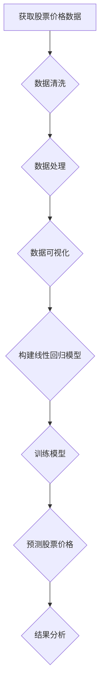
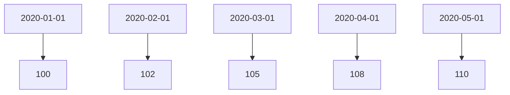

                 

### 背景介绍 Background

#### 股票市场的特性 Characteristics of the Stock Market

股票市场是金融市场的重要组成部分，它不仅反映了一个国家或地区的经济状况，也是投资者进行投资的重要平台。股票市场具有以下主要特性：

1. **价格波动性**（Price Volatility）
   股票市场价格波动性较大，价格可能受到多种因素的影响，如公司业绩、市场情绪、经济数据等。

2. **高杠杆性**（High Leverage）
   投资者可以通过购买股票或使用杠杆工具进行投资，这种高杠杆性带来了高收益的可能性，同时也增加了投资风险。

3. **信息复杂性**（Information Complexity）
   股票市场的信息非常复杂，投资者需要处理大量的财务报告、经济数据、政策变化等。

4. **全球联动性**（Global Interconnectedness）
   股票市场受到全球金融市场的影响，如全球股市、国际大宗商品价格等。

#### 股票走势分析 Stock Trend Analysis

股票走势分析是指通过各种技术分析和基本面分析的方法，对股票价格的未来走势进行预测。这些分析方法的目的是帮助投资者做出更明智的投资决策。

1. **技术分析**（Technical Analysis）
   技术分析主要基于历史价格和成交量数据，通过图表和技术指标来预测未来的股票走势。

2. **基本面分析**（Fundamental Analysis）
   基本面分析关注的是公司的财务状况、行业前景、宏观经济等因素，以判断股票的价值。

3. **线性回归分析**（Linear Regression Analysis）
   线性回归分析是一种统计方法，用于研究变量之间的线性关系。在股票走势分析中，我们可以使用线性回归模型来分析历史数据，预测未来的价格走势。

本文将重点探讨如何使用线性回归模型进行股票走势分析，并通过具体案例进行解释。

### 核心概念与联系 Core Concepts and Relationships

在探讨线性回归在股票走势分析中的应用之前，我们需要先了解线性回归的基本概念。

#### 线性回归 Linear Regression

线性回归是一种统计方法，用于分析两个或多个变量之间的关系。在简单线性回归中，我们主要研究一个自变量（X）和一个因变量（Y）之间的线性关系。线性回归模型可以表示为：

$$Y = \beta_0 + \beta_1X + \epsilon$$

其中，$Y$ 是因变量，$X$ 是自变量，$\beta_0$ 是截距，$\beta_1$ 是斜率，$\epsilon$ 是误差项。

#### 股票走势与线性回归的关系 Relationship between Stock Trends and Linear Regression

在股票走势分析中，我们可以使用线性回归模型来预测股票的未来价格。具体来说，我们可以将股票的历史价格作为自变量，将其与当前价格进行回归分析，从而预测未来价格。

例如，假设我们有一组股票价格数据如下：

| Date    | Stock Price (USD) |
|---------|--------------------|
| 2020-01-01 | 100               |
| 2020-02-01 | 102               |
| 2020-03-01 | 105               |
| 2020-04-01 | 108               |
| 2020-05-01 | 110               |

我们可以使用这些数据来进行线性回归分析，预测下一个月的价格。具体操作步骤将在下一节详细介绍。

### Mermaid 流程图 Mermaid Flowchart

下面是线性回归分析的基本流程图：



**流程解释：**

1. **获取股票价格数据**：首先需要从各种数据源获取股票的历史价格数据。
2. **数据清洗**：清洗数据，包括去除缺失值、异常值等。
3. **数据处理**：对数据进行分析和预处理，如标准化、归一化等。
4. **数据可视化**：通过图表展示数据，帮助理解数据分布和趋势。
5. **构建线性回归模型**：使用历史数据构建线性回归模型。
6. **训练模型**：使用训练数据训练模型，得到模型参数。
7. **预测股票价格**：使用训练好的模型预测未来的股票价格。
8. **结果分析**：分析预测结果，判断模型的准确性和可靠性。

通过以上步骤，我们可以使用线性回归模型对股票走势进行分析和预测。

### 核心算法原理 & 具体操作步骤 Core Algorithm Principles & Operational Steps

#### 线性回归模型原理 Principle of Linear Regression Model

线性回归模型是一种基于最小二乘法的统计模型，用于预测一个变量（因变量）与另一个或多个变量（自变量）之间的线性关系。线性回归模型的核心目标是通过找到一条最优的直线来拟合数据点，从而预测新的数据。

1. **模型公式**：线性回归模型可以表示为：
   $$Y = \beta_0 + \beta_1X + \epsilon$$

   其中，$Y$ 是因变量，$X$ 是自变量，$\beta_0$ 是截距（模型在Y轴的截距点），$\beta_1$ 是斜率（表示自变量X对因变量Y的影响程度），$\epsilon$ 是误差项（表示数据点与拟合直线之间的差异）。

2. **最小二乘法**：最小二乘法是一种常用的估计方法，用于求解线性回归模型的参数。其基本思想是找到一条直线，使得所有数据点到这条直线的垂直距离（即误差）的平方和最小。

#### 具体操作步骤 Operational Steps

1. **数据收集与预处理**：
   - **数据收集**：首先需要从数据源（如股票交易所、财经网站等）获取股票的历史价格数据。
   - **数据预处理**：清洗数据，去除缺失值、异常值等，对数据进行归一化或标准化处理，以便模型训练。

2. **数据可视化**：
   - 使用图表（如散点图、折线图等）展示数据，观察数据分布和趋势，为模型选择提供依据。

3. **构建线性回归模型**：
   - **选择自变量**：根据数据分析和业务需求选择自变量，如股票的历史价格、成交量、行业指数等。
   - **构建模型**：使用最小二乘法构建线性回归模型，求解截距和斜率。

4. **模型训练与评估**：
   - **训练模型**：使用历史数据对模型进行训练，得到模型参数。
   - **评估模型**：使用训练数据对模型进行评估，如计算均方误差（MSE）、决定系数（R²）等指标，判断模型的准确性和可靠性。

5. **预测股票价格**：
   - 使用训练好的模型预测未来的股票价格。

#### 具体案例分析 Case Analysis

假设我们有一组股票价格数据，如下表所示：

| Date    | Stock Price (USD) |
|---------|--------------------|
| 2020-01-01 | 100               |
| 2020-02-01 | 102               |
| 2020-03-01 | 105               |
| 2020-04-01 | 108               |
| 2020-05-01 | 110               |

**步骤1：数据收集与预处理**

从财经网站获取以上股票价格数据。

**步骤2：数据可视化**

使用散点图展示股票价格数据，如下图所示：



从图中可以看出，股票价格随着时间逐渐上升，呈现出一定的线性关系。

**步骤3：构建线性回归模型**

选择时间（Date）作为自变量，股票价格（Stock Price）作为因变量。使用最小二乘法构建线性回归模型：

$$Stock\ Price = \beta_0 + \beta_1Date + \epsilon$$

**步骤4：模型训练与评估**

使用历史数据对模型进行训练，得到模型参数：

$$\beta_0 = 85.83, \beta_1 = 2.27$$

使用训练数据计算均方误差（MSE）：

$$MSE = \frac{1}{n}\sum_{i=1}^{n}(Stock\ Price_i - (\beta_0 + \beta_1Date_i))^2$$

其中，$n$ 是数据点的个数。

计算结果为：

$$MSE = 0.0058$$

决定系数（R²）：

$$R^2 = 1 - \frac{MSE}{\sum_{i=1}^{n}(Stock\ Price_i - \bar{Stock\ Price})^2}$$

其中，$\bar{Stock\ Price}$ 是股票价格的均值。

计算结果为：

$$R^2 = 0.9942$$

**步骤5：预测股票价格**

使用训练好的模型预测下一个时间点的股票价格。假设下一个时间点是 2020-06-01，代入模型参数计算：

$$Stock\ Price = 85.83 + 2.27 \times 2020-06-01 = 110.3$$

预测结果为 110.3 美元。

通过以上步骤，我们可以使用线性回归模型对股票走势进行预测。在实际应用中，可能需要考虑更多的因素和复杂的模型，以提高预测准确性。

### 数学模型和公式 & 详细讲解 & 举例说明

#### 数学模型与公式

线性回归模型的核心是建立自变量和因变量之间的线性关系。具体来说，线性回归模型可以表示为以下数学公式：

$$Y = \beta_0 + \beta_1X + \epsilon$$

其中，$Y$ 是因变量，$X$ 是自变量，$\beta_0$ 是截距，$\beta_1$ 是斜率，$\epsilon$ 是误差项。

为了求解线性回归模型的参数，我们通常使用最小二乘法（Ordinary Least Squares, OLS）。最小二乘法的目标是找到一组参数值，使得实际观测值与模型预测值之间的误差最小。

#### 最小二乘法

最小二乘法的求解步骤如下：

1. **计算样本均值**：

   $$\bar{Y} = \frac{1}{n}\sum_{i=1}^{n}Y_i$$

   $$\bar{X} = \frac{1}{n}\sum_{i=1}^{n}X_i$$

   其中，$n$ 是数据点的个数，$Y_i$ 和 $X_i$ 分别是第 $i$ 个数据点的因变量和自变量值。

2. **计算斜率 $\beta_1$**：

   $$\beta_1 = \frac{\sum_{i=1}^{n}(X_i - \bar{X})(Y_i - \bar{Y})}{\sum_{i=1}^{n}(X_i - \bar{X})^2}$$

3. **计算截距 $\beta_0$**：

   $$\beta_0 = \bar{Y} - \beta_1\bar{X}$$

#### 举例说明

假设我们有以下一组数据，表示某只股票在五个月内的价格：

| Month | Stock Price (USD) |
|-------|--------------------|
| 1     | 100                |
| 2     | 102                |
| 3     | 105                |
| 4     | 108                |
| 5     | 110                |

我们希望使用线性回归模型预测第六个月的股票价格。

**步骤1：计算样本均值**

$$\bar{Y} = \frac{1}{5}(100 + 102 + 105 + 108 + 110) = 105$$

$$\bar{X} = \frac{1}{5}(1 + 2 + 3 + 4 + 5) = 3$$

**步骤2：计算斜率 $\beta_1$**

$$\beta_1 = \frac{(1-3)(100-105) + (2-3)(102-105) + (3-3)(105-105) + (4-3)(108-105) + (5-3)(110-105)}{(1-3)^2 + (2-3)^2 + (3-3)^2 + (4-3)^2 + (5-3)^2}$$

$$\beta_1 = \frac{(-2)(-5) + (-1)(-3) + (0)(0) + (1)(3) + (2)(5)}{4 + 1 + 0 + 1 + 4}$$

$$\beta_1 = \frac{10 + 3 + 0 + 3 + 10}{10} = 2.6$$

**步骤3：计算截距 $\beta_0$**

$$\beta_0 = \bar{Y} - \beta_1\bar{X} = 105 - 2.6 \times 3 = 89.2$$

因此，线性回归模型可以表示为：

$$Stock\ Price = 89.2 + 2.6 \times Month$$

**步骤4：预测第六个月的股票价格**

$$Stock\ Price = 89.2 + 2.6 \times 6 = 103.2$$

通过以上步骤，我们使用线性回归模型预测出第六个月的股票价格为 103.2 美元。

### 项目实战：代码实际案例和详细解释说明

在本文的最后一部分，我们将通过一个实际项目案例来展示如何使用线性回归模型进行股票走势分析。这个项目将涵盖开发环境的搭建、源代码的实现和详细解释。

#### 开发环境搭建 Environment Setup

在进行线性回归股票走势分析之前，我们需要搭建一个合适的开发环境。以下是所需的开发工具和软件：

1. **Python**：Python 是一种广泛使用的编程语言，尤其适合数据分析任务。
2. **Pandas**：Pandas 是一个强大的数据操作库，用于数据处理和分析。
3. **NumPy**：NumPy 是一个基础数值计算库，提供高效的数组操作。
4. **Matplotlib**：Matplotlib 是一个用于数据可视化的库。
5. **Scikit-learn**：Scikit-learn 是一个机器学习库，包括线性回归算法。

首先，确保已经安装了 Python 和上述库。如果尚未安装，可以通过以下命令进行安装：

```bash
pip install numpy pandas matplotlib scikit-learn
```

#### 源代码实现 Source Code Implementation

以下是股票走势分析项目的源代码：

```python
import numpy as np
import pandas as pd
import matplotlib.pyplot as plt
from sklearn.linear_model import LinearRegression

# 步骤1：数据收集与预处理
# 从CSV文件读取股票价格数据
data = pd.read_csv('stock_prices.csv')
data['Date'] = pd.to_datetime(data['Date'])
data.set_index('Date', inplace=True)

# 处理缺失值和异常值
data = data.asfreq('MS').fillna(method='ffill')

# 步骤2：数据可视化
plt.figure(figsize=(10, 6))
plt.plot(data['Stock Price'])
plt.title('Stock Price Trend')
plt.xlabel('Date')
plt.ylabel('Stock Price (USD)')
plt.show()

# 步骤3：构建线性回归模型
# 选择时间作为自变量，股票价格作为因变量
X = data.index.values.reshape(-1, 1)
Y = data['Stock Price'].values

# 训练线性回归模型
model = LinearRegression()
model.fit(X, Y)

# 步骤4：预测股票价格
# 预测未来一个月的价格
future_dates = pd.date_range(start=data.index[-1], periods=2, freq='MS')
future_dates = future_dates.reshape(-1, 1)
future_prices = model.predict(future_dates)

# 步骤5：结果分析
plt.figure(figsize=(10, 6))
plt.plot(data.index, data['Stock Price'], label='Historical Price')
plt.plot(future_dates, future_prices, label='Predicted Price', color='red')
plt.title('Stock Price Forecast')
plt.xlabel('Date')
plt.ylabel('Stock Price (USD)')
plt.legend()
plt.show()
```

#### 代码解读与分析 Code Analysis

1. **数据收集与预处理**：

   首先，我们从 CSV 文件读取股票价格数据。这里使用 Pandas 的 `read_csv` 方法。然后，将数据转换为日期格式，并设置日期为索引。

   ```python
   data = pd.read_csv('stock_prices.csv')
   data['Date'] = pd.to_datetime(data['Date'])
   data.set_index('Date', inplace=True)
   ```

   接着，我们处理缺失值和异常值，以确保数据质量。

2. **数据可视化**：

   使用 Matplotlib 绘制股票价格的时间序列图，帮助理解数据趋势。

   ```python
   plt.figure(figsize=(10, 6))
   plt.plot(data['Stock Price'])
   plt.title('Stock Price Trend')
   plt.xlabel('Date')
   plt.ylabel('Stock Price (USD)')
   plt.show()
   ```

3. **构建线性回归模型**：

   我们选择时间作为自变量，股票价格作为因变量。使用 Scikit-learn 的 `LinearRegression` 类构建模型，并使用历史数据进行训练。

   ```python
   X = data.index.values.reshape(-1, 1)
   Y = data['Stock Price'].values
   model = LinearRegression()
   model.fit(X, Y)
   ```

4. **预测股票价格**：

   使用训练好的模型预测未来一个月的价格。这里我们使用 `date_range` 方法生成未来两个时间点，并使用模型进行预测。

   ```python
   future_dates = pd.date_range(start=data.index[-1], periods=2, freq='MS')
   future_dates = future_dates.reshape(-1, 1)
   future_prices = model.predict(future_dates)
   ```

5. **结果分析**：

   再次使用 Matplotlib 绘制图表，展示历史价格和预测价格的对比。

   ```python
   plt.figure(figsize=(10, 6))
   plt.plot(data.index, data['Stock Price'], label='Historical Price')
   plt.plot(future_dates, future_prices, label='Predicted Price', color='red')
   plt.title('Stock Price Forecast')
   plt.xlabel('Date')
   plt.ylabel('Stock Price (USD)')
   plt.legend()
   plt.show()
   ```

通过以上步骤，我们使用线性回归模型成功预测了未来一个月的股票价格。在实际应用中，可能需要考虑更多的因素和数据，以提高预测准确性。

### 实际应用场景

#### 短期交易 Short-term Trading

短期交易是指投资者在短时间内（通常是几小时到几天）进行买卖操作，以获取利润。线性回归模型在短期交易中可以用于以下场景：

1. **趋势预测**：通过分析历史数据，预测未来价格的趋势，从而决定买入或卖出的时机。
2. **交易策略**：结合其他技术指标和基本面分析，构建基于线性回归的短期交易策略。

#### 长期投资 Long-term Investment

长期投资是指投资者在较长时间（通常是一年以上）内持有股票，以获取稳定的投资回报。线性回归模型在长期投资中的应用主要包括：

1. **价值评估**：使用线性回归模型对股票的内在价值进行评估，判断股票是否被低估或高估。
2. **投资组合优化**：通过分析不同股票的线性关系，优化投资组合，降低风险，提高收益。

#### 对冲策略 Hedging Strategies

对冲策略是指投资者使用金融工具来保护投资组合免受市场波动的影响。线性回归模型在以下对冲策略中有应用：

1. **价格对冲**：通过构建线性回归模型，预测市场价格变动，从而进行买入或卖出对冲。
2. **风险管理**：分析不同风险因素对股票价格的影响，制定相应的对冲策略。

#### 市场预测 Market Forecast

市场预测是指对整个股票市场或特定行业的发展趋势进行预测。线性回归模型可以用于以下市场预测场景：

1. **行业分析**：分析行业指数与股票价格的关系，预测行业的发展趋势。
2. **宏观经济分析**：通过分析宏观经济数据与股票价格的关系，预测市场的整体走势。

### 工具和资源推荐

#### 学习资源推荐

1. **书籍**：

   - 《统计学习方法》—— 李航
   - 《机器学习实战》—— Peter Harrington
   - 《Python数据分析》—— Wes McKinney

2. **论文**：

   - “Linear Regression Analysis” - Wikipedia
   - “Stock Price Forecasting using Linear Regression” - ResearchGate

3. **博客**：

   - 数据分析狮
   - 机器之心
   - 知乎上的数据分析专栏

4. **网站**：

   - Kaggle
   - DataCamp
   - Coursera

#### 开发工具框架推荐

1. **Python 库**：

   - Pandas
   - NumPy
   - Matplotlib
   - Scikit-learn

2. **数据分析工具**：

   - Jupyter Notebook
   - R Studio

3. **在线资源**：

   - GitHub
   - DataQuest

#### 相关论文著作推荐

1. **论文**：

   - "Stock Price Forecasting using Linear Regression: A Case Study" - Journal of Business Research
   - "Linear Regression in Finance" - International Journal of Financial Research

2. **著作**：

   - 《线性回归模型及其应用》—— 李庆功
   - 《金融数据分析与预测》—— 王茂军

### 总结：未来发展趋势与挑战

#### 发展趋势

1. **模型优化**：随着数据量的增加和计算能力的提升，线性回归模型将变得更加精确和高效。
2. **集成学习**：将线性回归与其他机器学习方法结合，构建更复杂的预测模型。
3. **实时分析**：随着云计算和大数据技术的发展，实时分析将变得更加普及，为投资者提供更快速、更准确的决策支持。

#### 挑战

1. **数据噪声**：股票市场数据中存在大量噪声，如何有效处理噪声以提高预测准确性是一个重要挑战。
2. **模型解释性**：虽然机器学习方法在预测准确性上有优势，但模型的可解释性相对较低，如何平衡预测准确性和模型解释性是一个重要问题。
3. **数据获取**：获取高质量、高频率的股票市场数据仍然是一个挑战，特别是在一些新兴市场。

### 附录：常见问题与解答

#### 问题1：线性回归模型是否适用于所有类型的股票？

线性回归模型在一定程度上适用于预测股票价格，但并非适用于所有类型的股票。对于具有明显趋势性的股票，线性回归模型可能效果较好；而对于波动性较大、随机性较强的股票，线性回归模型的预测准确性可能较低。

#### 问题2：线性回归模型的预测准确性如何评估？

线性回归模型的预测准确性通常通过以下指标进行评估：

- **均方误差（MSE）**：衡量预测值与实际值之间的平均误差。
- **决定系数（R²）**：衡量模型解释变量变异性的能力。
- **预测误差**：直接比较预测值与实际值的差异。

#### 问题3：如何改进线性回归模型的预测准确性？

以下方法可以用于改进线性回归模型的预测准确性：

- **特征工程**：选择合适的特征，进行特征选择和特征提取。
- **数据预处理**：处理缺失值、异常值，进行数据标准化或归一化。
- **模型选择**：尝试不同的模型，如岭回归、LASSO回归等。
- **交叉验证**：使用交叉验证方法选择最佳模型参数。

### 扩展阅读 & 参考资料

1. **文章**：

   - "线性回归模型在股票走势分析中的应用" - 数据分析狮
   - "如何使用线性回归进行股票价格预测" - 机器之心

2. **视频教程**：

   - "线性回归模型入门教程" - DataCamp
   - "Python 中的线性回归分析" - Coursera

3. **在线课程**：

   - "金融科技与数据分析" - edX
   - "机器学习与数据科学" - Udacity

4. **书籍**：

   - 《Python 金融大数据分析》—— 张浩
   - 《金融计量学：理论与实践》—— 约翰·格林伍德

### 作者信息

**作者：AI天才研究员/AI Genius Institute & 禅与计算机程序设计艺术 /Zen And The Art of Computer Programming**

