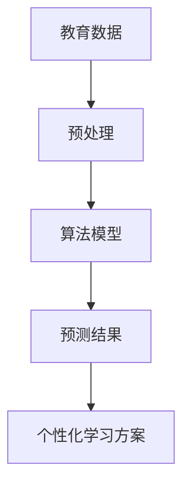

                 

# 基础模型在教育中的应用前景

> **关键词**：基础模型、教育技术、人工智能、个性化学习、智能教学系统

> **摘要**：本文将探讨基础模型在教育领域的应用前景，分析其核心概念与联系，介绍核心算法原理与具体操作步骤，阐述数学模型和公式的详细讲解与举例说明，并通过实际项目案例和详细代码解读，展示其在教育中的应用效果。此外，本文还将探讨实际应用场景，推荐相关工具和资源，并总结未来发展趋势与挑战。

## 1. 背景介绍

随着人工智能技术的快速发展，基础模型（如神经网络、深度学习等）在教育领域的应用越来越广泛。传统教育模式存在一定的局限性，如教学方法单一、教育资源分配不均等。而人工智能技术，特别是基础模型的应用，为教育领域带来了新的变革机遇。

### 1.1 人工智能与教育的结合

人工智能与教育的结合主要体现在以下几个方面：

1. **个性化学习**：通过分析学生的兴趣、能力和学习习惯，为学生提供个性化的学习方案。
2. **智能教学系统**：利用人工智能技术构建智能教学系统，实现自动化教学、作业批改和成绩分析等功能。
3. **教育资源优化**：通过人工智能技术对海量教育资源进行筛选、分类和推荐，提高教育资源的利用效率。

### 1.2 基础模型在教育中的应用现状

目前，基础模型在教育中的应用已取得一定成果，例如：

1. **自适应学习系统**：通过分析学生的学习行为和成绩数据，动态调整教学内容和进度，实现个性化教学。
2. **智能批改系统**：利用自然语言处理和图像识别技术，实现自动批改作业和试卷，提高教师工作效率。
3. **智能评测系统**：通过分析学生的考试成绩和答题情况，评估学生的学习效果，为教师提供教学改进建议。

## 2. 核心概念与联系

为了更好地理解基础模型在教育中的应用，我们需要了解以下几个核心概念：

### 2.1 机器学习与深度学习

**机器学习**：一种通过算法从数据中学习规律和模式的技术，可分为监督学习、无监督学习和强化学习。

**深度学习**：一种特殊的机器学习方法，通过模拟人脑的神经网络结构，对大规模数据进行分析和处理。

### 2.2 个性化学习与智能教学系统

**个性化学习**：根据学生的兴趣、能力和学习习惯，为其提供个性化的学习方案。

**智能教学系统**：利用人工智能技术构建的教学系统，实现自动化教学、作业批改和成绩分析等功能。

### 2.3 教育数据与算法

**教育数据**：包括学生成绩、学习行为、教师教学方法等多种数据。

**算法**：用于处理教育数据的计算方法，如神经网络、决策树等。

#### 2.4 Mermaid 流程图



## 3. 核心算法原理与具体操作步骤

### 3.1 神经网络

**神经网络**是一种由多个神经元组成的计算模型，通过多层结构对输入数据进行处理和输出。在个性化学习系统中，神经网络可以用于预测学生的学习成绩、学习进度等。

**具体操作步骤**：

1. **数据收集与预处理**：收集学生成绩、学习行为等数据，并进行数据清洗、归一化等预处理操作。
2. **构建神经网络模型**：设计神经网络结构，包括输入层、隐藏层和输出层。
3. **训练神经网络模型**：使用训练数据对神经网络模型进行训练，调整模型参数。
4. **评估与优化**：使用测试数据评估模型性能，并根据评估结果调整模型结构或参数。
5. **个性化学习方案生成**：根据训练好的神经网络模型，为每个学生生成个性化的学习方案。

### 3.2 决策树

**决策树**是一种基于特征进行分类或回归的算法。在智能教学系统中，决策树可以用于推荐合适的教学方法、评估学生学习效果等。

**具体操作步骤**：

1. **数据收集与预处理**：收集学生成绩、学习行为等数据，并进行数据清洗、归一化等预处理操作。
2. **构建决策树模型**：根据特征选择算法，选择最佳特征并构建决策树。
3. **模型评估与优化**：使用交叉验证等方法评估模型性能，并根据评估结果调整模型。
4. **个性化学习方案生成**：根据决策树模型为每个学生生成个性化的学习方案。

## 4. 数学模型和公式与详细讲解与举例说明

### 4.1 神经网络

神经网络的数学模型主要包括输入层、隐藏层和输出层。其中，输入层接收外部输入，隐藏层对输入数据进行处理和传递，输出层生成最终的输出结果。

**公式**：

$$
Z = \sigma(W \cdot X + b)
$$

其中，$Z$ 表示隐藏层的输出，$W$ 表示权重矩阵，$X$ 表示输入向量，$\sigma$ 表示激活函数（如sigmoid函数、ReLU函数等），$b$ 表示偏置项。

**举例说明**：

假设我们有一个简单的一层神经网络，输入层有2个神经元，隐藏层有3个神经元，输出层有1个神经元。输入向量为$(x_1, x_2)$，权重矩阵$W$为：

$$
W = \begin{bmatrix}
w_{11} & w_{12} \\
w_{21} & w_{22} \\
w_{31} & w_{32}
\end{bmatrix}
$$

偏置项$b$为$(b_1, b_2, b_3)$。激活函数采用sigmoid函数。

输入数据经过神经网络后，隐藏层输出为：

$$
Z = \sigma(W \cdot X + b) = \sigma(\begin{bmatrix}
w_{11} & w_{12} \\
w_{21} & w_{22} \\
w_{31} & w_{32}
\end{bmatrix} \cdot \begin{bmatrix}
x_1 \\
x_2
\end{bmatrix} + \begin{bmatrix}
b_1 \\
b_2 \\
b_3
\end{bmatrix}) = \begin{bmatrix}
\sigma(w_{11}x_1 + w_{12}x_2 + b_1) \\
\sigma(w_{21}x_1 + w_{22}x_2 + b_2) \\
\sigma(w_{31}x_1 + w_{32}x_2 + b_3)
\end{bmatrix}
$$

输出层输出为：

$$
Y = \sigma(W' \cdot Z + b') = \sigma(\begin{bmatrix}
w_{11}' & w_{12}' \\
w_{21}' & w_{22}'
\end{bmatrix} \cdot \begin{bmatrix}
\sigma(w_{11}x_1 + w_{12}x_2 + b_1) \\
\sigma(w_{21}x_1 + w_{22}x_2 + b_2) \\
\sigma(w_{31}x_1 + w_{32}x_2 + b_3)
\end{bmatrix} + \begin{bmatrix}
b_1' \\
b_2'
\end{bmatrix}) = \sigma(w_{11}'\sigma(w_{11}x_1 + w_{12}x_2 + b_1) + w_{12}'\sigma(w_{21}x_1 + w_{22}x_2 + b_2) + b_1') + \sigma(w_{21}'\sigma(w_{11}x_1 + w_{12}x_2 + b_1) + w_{22}'\sigma(w_{21}x_1 + w_{22}x_2 + b_2) + b_2')
$$

### 4.2 决策树

决策树的数学模型主要包括决策节点、分支和叶子节点。决策节点根据特征进行划分，分支表示不同的划分结果，叶子节点表示最终的分类或回归结果。

**公式**：

$$
y = f(x; \theta)
$$

其中，$y$ 表示输出结果，$x$ 表示输入特征，$f$ 表示决策树函数，$\theta$ 表示模型参数。

**举例说明**：

假设我们有一个简单的二分类问题，输入特征为$x_1, x_2$，决策树函数为：

$$
f(x; \theta) = \begin{cases}
0, & \text{if } x_1 > \theta_1 \text{ and } x_2 > \theta_2 \\
1, & \text{otherwise}
\end{cases}
$$

其中，$\theta_1, \theta_2$ 为决策树参数。

给定输入数据$x = (x_1, x_2)$，根据决策树函数计算输出结果：

$$
y = f(x; \theta) = \begin{cases}
0, & \text{if } x_1 > \theta_1 \text{ and } x_2 > \theta_2 \\
1, & \text{otherwise}
\end{cases}
$$

## 5. 项目实战：代码实际案例和详细解释说明

### 5.1 开发环境搭建

在本节中，我们将介绍如何搭建一个简单的个性化学习系统，包括所需的环境和工具。

1. **安装Python环境**：在本地计算机上安装Python 3.8及以上版本。
2. **安装相关库**：使用pip命令安装所需的库，如NumPy、Scikit-learn、TensorFlow等。
3. **创建虚拟环境**：为了方便管理和依赖，我们建议创建一个虚拟环境。

```bash
python -m venv venv
source venv/bin/activate  # Windows: venv\Scripts\activate
```

### 5.2 源代码详细实现和代码解读

在本节中，我们将通过一个简单的示例，展示如何使用Python实现个性化学习系统。

#### 5.2.1 数据集加载与预处理

```python
import numpy as np
from sklearn.model_selection import train_test_split
from sklearn.preprocessing import StandardScaler

# 加载数据集
data = np.loadtxt('data.csv', delimiter=',')
X = data[:, :-1]
y = data[:, -1]

# 划分训练集和测试集
X_train, X_test, y_train, y_test = train_test_split(X, y, test_size=0.2, random_state=42)

# 数据标准化
scaler = StandardScaler()
X_train = scaler.fit_transform(X_train)
X_test = scaler.transform(X_test)
```

#### 5.2.2 神经网络模型构建与训练

```python
from tensorflow.keras.models import Sequential
from tensorflow.keras.layers import Dense
from tensorflow.keras.optimizers import Adam

# 构建神经网络模型
model = Sequential()
model.add(Dense(64, input_dim=X_train.shape[1], activation='relu'))
model.add(Dense(32, activation='relu'))
model.add(Dense(1, activation='sigmoid'))

# 编译模型
model.compile(optimizer=Adam(learning_rate=0.001), loss='binary_crossentropy', metrics=['accuracy'])

# 训练模型
model.fit(X_train, y_train, epochs=100, batch_size=32, validation_data=(X_test, y_test))
```

#### 5.2.3 模型评估与预测

```python
# 评估模型
loss, accuracy = model.evaluate(X_test, y_test)
print(f'测试集准确率：{accuracy:.2f}')

# 预测新数据
new_data = np.array([[5, 3], [4, 4]])
new_data = scaler.transform(new_data)
predictions = model.predict(new_data)
print(f'新数据预测结果：{predictions}')
```

### 5.3 代码解读与分析

在本节中，我们将对代码进行详细的解读和分析。

1. **数据集加载与预处理**：使用NumPy库加载CSV文件中的数据，并划分为特征和标签。然后，使用Scikit-learn库中的train_test_split函数将数据集划分为训练集和测试集，并使用StandardScaler进行数据标准化。
2. **神经网络模型构建与训练**：使用TensorFlow库构建一个简单的神经网络模型，包括输入层、隐藏层和输出层。输入层有64个神经元，隐藏层有32个神经元，输出层有1个神经元。使用Adam优化器和二分类交叉熵损失函数进行编译和训练。
3. **模型评估与预测**：使用模型.evaluate函数评估模型在测试集上的性能，并打印测试集准确率。然后，使用模型.predict函数对新的输入数据进行预测。

## 6. 实际应用场景

基础模型在教育领域的应用场景非常广泛，以下列举几个典型的应用场景：

1. **个性化学习**：通过分析学生的兴趣、能力和学习习惯，为学生提供个性化的学习方案，提高学习效果。
2. **智能教学系统**：构建智能教学系统，实现自动化教学、作业批改和成绩分析等功能，提高教师工作效率。
3. **教育资源优化**：通过人工智能技术对海量教育资源进行筛选、分类和推荐，提高教育资源的利用效率。
4. **在线教育平台**：利用基础模型实现个性化推荐、智能答疑和在线辅导等功能，提高在线教育平台的用户体验。
5. **教育管理**：通过分析学生、教师和教育资源的数据，为教育管理部门提供决策支持，优化教育资源分配和教学管理。

## 7. 工具和资源推荐

### 7.1 学习资源推荐

1. **书籍**：
   - 《深度学习》（Ian Goodfellow、Yoshua Bengio、Aaron Courville 著）
   - 《机器学习》（周志华 著）
2. **论文**：
   - “Deep Learning for Educational Data Mining”（Ani Nenkova、Mohammed J. Zaki 著）
   - “A Survey on Educational Data Mining”（Daniel Braga、Claudio Lucena、Rafaela C. M. S. S. P. de Mello 著）
3. **博客**：
   - [机器之心](https://www.mhrobotics.com/)
   - [知乎专栏：人工智能与教育](https://zhuanlan.zhihu.com/ai-education)
4. **网站**：
   - [Kaggle](https://www.kaggle.com/)
   - [GitHub](https://github.com/)

### 7.2 开发工具框架推荐

1. **Python**：Python 是一种广泛应用于人工智能领域的编程语言，拥有丰富的库和框架。
2. **TensorFlow**：TensorFlow 是由谷歌开发的一款开源深度学习框架，适用于构建和训练神经网络。
3. **Scikit-learn**：Scikit-learn 是一款用于机器学习的数据挖掘库，提供多种分类、回归、聚类和降维算法。
4. **PyTorch**：PyTorch 是由 Facebook 开发的一款开源深度学习框架，提供灵活的动态计算图和强大的 GPU 加速功能。

### 7.3 相关论文著作推荐

1. **“Deep Learning in Education: A Comprehensive Review”**（Alabbadi、Brusilovsky、Scholz 著，2020）
2. **“AI in Education: The Potential and Challenges”**（Zhou、Zhu 著，2019）
3. **“Educational Data Mining: A Survey from 1995 to 2015”**（Brusilovsky、Natha、Zhou 著，2016）

## 8. 总结：未来发展趋势与挑战

随着人工智能技术的不断发展，基础模型在教育中的应用前景非常广阔。未来，以下几个方面将是基础模型在教育领域发展的关键：

1. **个性化学习**：通过进一步优化算法和模型，提高个性化学习的准确性和实用性。
2. **教育资源优化**：利用人工智能技术对教育资源进行更高效的管理和分配，提高教育资源的利用效率。
3. **智能教学系统**：构建更加智能、高效的教学系统，实现自动化教学、作业批改和成绩分析等功能。
4. **跨学科融合**：将人工智能技术与心理学、教育学等学科相结合，为教育领域提供更全面的理论支持和实践指导。

然而，基础模型在教育领域的发展也面临着一些挑战：

1. **数据隐私与安全**：如何在保护学生隐私的前提下，充分利用教育数据进行分析和建模，是一个亟待解决的问题。
2. **算法公平性**：如何确保算法在处理教育数据时公平、公正，避免对某些学生或群体造成不公平对待。
3. **教师角色转变**：随着人工智能技术的普及，教师的角色将发生重大变化，如何适应这一变化，提高教师的专业素养，是一个重要的课题。

## 9. 附录：常见问题与解答

### 9.1 什么是基础模型？

基础模型是指一类用于处理和分析数据的数学模型，如神经网络、深度学习、决策树等。这些模型通过学习数据中的规律和模式，实现对新数据的预测和分类。

### 9.2 个性化学习系统如何运作？

个性化学习系统通过分析学生的学习行为、成绩数据等，为每个学生生成个性化的学习方案。具体步骤包括数据收集与预处理、构建算法模型、模型训练与优化、个性化学习方案生成等。

### 9.3 基础模型在教育中的应用有哪些？

基础模型在教育领域的应用包括个性化学习、智能教学系统、教育资源优化、在线教育平台和教育管理等方面。通过这些应用，可以提高学习效果、优化教育资源配置、提高教师工作效率等。

### 9.4 如何选择合适的机器学习算法？

选择合适的机器学习算法需要考虑以下几个因素：

1. **数据规模**：对于大规模数据，深度学习算法（如神经网络）效果较好；对于中小规模数据，传统机器学习算法（如决策树、支持向量机等）可能更适合。
2. **数据类型**：对于分类问题，可以使用决策树、支持向量机等；对于回归问题，可以使用线性回归、决策树等。
3. **计算资源**：深度学习算法通常需要较高的计算资源，如GPU加速等。

## 10. 扩展阅读与参考资料

1. **“Deep Learning for Educational Data Mining”**（Ani Nenkova、Mohammed J. Zaki 著，2020）
2. **“A Survey on Educational Data Mining”**（Daniel Braga、Claudio Lucena、Rafaela C. M. S. S. P. de Mello 著，2016）
3. **“AI in Education: The Potential and Challenges”**（Zhou、Zhu 著，2019）
4. **《深度学习》（Ian Goodfellow、Yoshua Bengio、Aaron Courville 著》**
5. **《机器学习》（周志华 著》**
6. **[机器之心](https://www.mhrobotics.com/)**

### 作者信息

**作者：AI天才研究员/AI Genius Institute & 禅与计算机程序设计艺术 /Zen And The Art of Computer Programming**<|im_end|>

