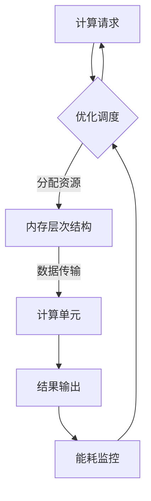
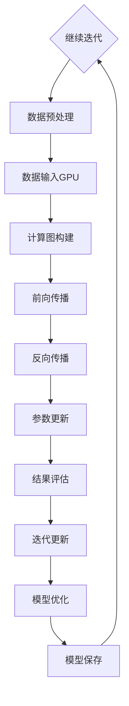

                 

### 背景介绍

#### GPU硬件的兴起与发展

随着人工智能（AI）和深度学习（Deep Learning）技术的快速发展，对计算能力的需求也在不断攀升。GPU（Graphics Processing Unit，图形处理单元）作为一种高度并行的计算设备，因其出色的并行处理能力和强大的计算性能，成为深度学习和AI应用的重要支撑。GPU最初是为了图形渲染而设计的，但随着时间的发展，其应用范围逐渐扩展到科学计算、数据分析和人工智能等领域。

在深度学习和AI领域，GPU的主要优势在于其高度并行的架构。与传统的CPU（Central Processing Unit，中央处理单元）相比，GPU具有更多的计算单元，这些计算单元可以同时处理多个数据，从而显著提高计算效率。这种并行处理能力使得GPU在处理大规模矩阵运算、图像处理和神经网络训练等任务时，能够提供比CPU更高的计算速度和性能。

#### GPU硬件在深度学习和AI中的应用

深度学习和AI应用通常涉及到大量的矩阵运算和向量操作，这些操作非常适合GPU的高并行处理能力。在深度学习训练过程中，模型需要通过大量的矩阵乘法和激活函数计算来更新参数，这些计算任务可以通过GPU的多个计算单元并行执行，从而大幅缩短训练时间。

此外，GPU还支持各种加速技术，如CUDA（Compute Unified Device Architecture）和OpenCL（Open Computing Language），这些技术使得程序员可以更有效地利用GPU的并行处理能力，实现高性能计算。

在AI应用方面，GPU硬件在计算机视觉、自然语言处理、推荐系统和强化学习等领域都有广泛应用。例如，在计算机视觉任务中，GPU可以加速图像的预处理、特征提取和模型推理；在自然语言处理任务中，GPU可以帮助加速语言模型训练和文本生成。

#### GPU硬件在基础模型训练中的重要性

基础模型（Fundamental Models）是指那些在多个领域具有通用性，可以应用于不同任务的模型，如Transformer模型。这些模型通常需要大量的计算资源进行训练，而GPU硬件的高性能计算能力为这些模型的训练提供了有力支持。

首先，基础模型的训练涉及到大规模的矩阵运算和并行计算。GPU硬件可以同时处理多个数据，大大提高了训练速度。此外，GPU还支持分布式训练，使得多个GPU可以同时工作，进一步加速训练过程。

其次，GPU硬件可以提供高效的内存访问和存储能力。在深度学习训练中，数据输入和输出的速度对性能有重要影响。GPU的高速内存访问和缓存机制可以减少数据传输延迟，提高整体训练效率。

最后，GPU硬件的持续迭代和性能提升也为基础模型训练提供了持续的动力。随着GPU硬件技术的不断进步，其计算性能和能效比也在不断提高，使得基础模型的训练更加高效和可持续。

总之，GPU硬件在深度学习和AI领域的重要性不可忽视。它为大规模矩阵运算和并行计算提供了强大的支持，显著提高了基础模型训练的效率和效果。在基础模型的训练过程中，选择合适的GPU硬件对于实现高效训练至关重要。

#### 当前GPU硬件的改进需求

尽管GPU硬件在深度学习和AI领域已经取得了显著的成果，但面对日益增长的计算需求，当前GPU硬件仍然存在一些改进需求。首先，GPU的计算能力与数据存储和传输速度之间的差距正在扩大。随着基础模型复杂度的增加，数据输入和输出的速度成为制约训练速度的重要因素。现有的GPU硬件在数据传输带宽和处理速度方面还有提升空间。

其次，GPU的能效比也是一个关键问题。随着深度学习模型的规模和复杂度不断增加，训练过程所需的能耗也在不断增加。虽然GPU硬件制造商已经采取了多种措施来提高能效比，但仍然存在进一步优化的空间。例如，通过改进GPU架构和硬件设计，可以降低能耗，提高性能。

另外，当前GPU硬件在并行计算能力方面也有提升需求。虽然GPU硬件已经具备了出色的并行处理能力，但实际应用中，如何更好地利用这些计算资源仍然是一个挑战。优化GPU并行计算算法和调度策略，可以提高GPU的利用率和计算效率。

总之，随着深度学习和AI技术的不断发展，GPU硬件的改进需求日益迫切。通过提高计算能力、优化能效比和提升并行计算能力，GPU硬件将为深度学习和AI领域提供更强大的支持。

#### 文章结构概述

本文将详细探讨基础模型的GPU硬件改进，旨在为读者提供全面而深入的理解。文章结构如下：

1. **背景介绍**：简要介绍GPU硬件的兴起与发展，以及其在深度学习和AI领域中的重要性。
2. **核心概念与联系**：阐述GPU硬件的基本原理和架构，并使用Mermaid流程图展示核心概念和联系。
3. **核心算法原理 & 具体操作步骤**：详细解释GPU硬件在基础模型训练中的工作原理和操作步骤。
4. **数学模型和公式 & 详细讲解 & 举例说明**：介绍与GPU硬件相关的数学模型和公式，并提供具体示例进行说明。
5. **项目实战：代码实际案例和详细解释说明**：通过具体代码案例展示GPU硬件在实际项目中的应用，并进行详细解释。
6. **实际应用场景**：探讨GPU硬件在各类深度学习和AI应用中的具体场景和优势。
7. **工具和资源推荐**：推荐相关学习资源、开发工具和框架。
8. **总结：未来发展趋势与挑战**：总结GPU硬件改进的趋势和面临的挑战。
9. **附录：常见问题与解答**：解答读者可能遇到的常见问题。
10. **扩展阅读 & 参考资料**：提供进一步阅读的资源和参考资料。

通过以上结构，本文将帮助读者全面了解GPU硬件在基础模型训练中的改进方法及其重要性，为深度学习和AI领域的发展提供有益的参考。 <a id="toc-2"></a>

## 2. 核心概念与联系

要深入探讨GPU硬件的改进，首先需要了解其核心概念和工作原理。GPU硬件的设计初衷是为了加速图形渲染，但随着时间的发展，其应用范围已经扩展到科学计算、数据分析和人工智能等多个领域。GPU的核心特点是其高度并行的架构，这使得其在处理大量并行任务时具有极高的效率。以下是GPU硬件的核心概念和架构联系：

### GPU硬件的核心概念

1. **并行计算**：GPU硬件的核心优势在于其并行计算能力。与CPU相比，GPU拥有更多的计算单元，这些计算单元可以同时处理多个数据。这种并行计算模式非常适合深度学习和AI任务中大量的矩阵运算和向量操作。
   
2. **CUDA和OpenCL**：CUDA和OpenCL是两种常见的GPU编程框架。CUDA由NVIDIA开发，主要用于NVIDIA GPU的编程，而OpenCL是一种开放标准，支持多种类型的硬件，包括NVIDIA GPU、AMD GPU和英特尔GPU。这些框架提供了编程接口，使得开发者可以充分利用GPU的并行计算能力。

3. **计算单元（CUDA核心）**：GPU中的计算单元被称为CUDA核心或流多处理器（SM）。每个核心可以执行独立的数据处理任务，这使得GPU能够同时处理多个线程。不同型号的GPU拥有不同数量的CUDA核心，例如，NVIDIA的A100 GPU拥有5760个CUDA核心。

4. **内存层次结构**：GPU硬件具有复杂的内存层次结构，包括全局内存、共享内存和寄存器。全局内存用于存储大规模数据集，共享内存用于多个核心之间的数据共享，而寄存器则是最快的存储单元，用于存储临时数据。

5. **能耗优化**：随着GPU性能的提升，其能耗问题也日益突出。GPU硬件设计需要平衡性能和能耗，以实现高效的计算。

### GPU硬件架构的Mermaid流程图

为了更好地理解GPU硬件的核心概念和架构，我们可以使用Mermaid流程图展示其关键组成部分。以下是一个简化的Mermaid流程图：



在这个流程图中，计算请求首先被调度器处理，调度器根据当前资源分配情况将任务分配给内存层次结构。数据随后从全局内存传输到计算单元进行并行处理，处理结果最终输出。在整个过程中，能耗监控模块不断评估GPU的能耗，以便进行优化调度。

### GPU硬件在基础模型训练中的应用

在基础模型训练过程中，GPU硬件的核心概念和架构得到了充分发挥。以下是一个简化的基础模型训练流程，展示了GPU硬件在其中的应用：



在这个流程中，模型定义和数据预处理是基础模型训练的起点。数据预处理完成后，数据被加载到GPU进行计算图构建。计算图构建完成后，GPU硬件执行前向传播和反向传播操作，更新模型参数。最后，模型进行结果评估和迭代更新，直到达到预定的优化目标。

通过以上核心概念和架构的联系，我们可以看到GPU硬件在深度学习和AI领域中的重要作用。理解这些核心概念和架构对于深入探讨GPU硬件的改进具有重要意义。

#### GPU硬件的基本原理

为了更好地理解GPU硬件的工作机制，我们需要深入探讨其基本原理和架构。GPU（Graphics Processing Unit，图形处理单元）是一种专门为图形渲染而设计的计算设备，但随着技术的发展，其应用范围已经远远超出了图形渲染领域，成为深度学习和人工智能（AI）领域的核心计算设备。

**GPU的并行架构**

GPU的核心特点是其高度并行的架构。这种架构使得GPU能够同时处理大量的数据，从而实现高效的计算。GPU由多个计算单元组成，每个计算单元可以独立执行计算任务。这些计算单元通常称为“CUDA核心”或“流处理器”（Streaming Multiprocessors, SM）。不同型号的GPU拥有不同数量的计算单元，例如，NVIDIA的A100 GPU拥有5760个CUDA核心。

并行架构的一个关键优势在于它可以同时处理多个线程，从而大幅提高计算效率。在深度学习和AI任务中，许多操作都可以并行化，这使得GPU的并行架构非常适用于这些任务。例如，在神经网络训练中，每个神经元和权重更新都可以由不同的计算单元同时处理，从而显著加快训练速度。

**内存层次结构**

GPU硬件具有复杂的内存层次结构，这对其性能有重要影响。内存层次结构通常包括以下几个层次：

1. **寄存器（Registers）**：寄存器是GPU中速度最快的存储单元，用于存储临时数据和指令。由于寄存器的访问速度非常快，因此它对性能有显著影响。

2. **共享内存（Shared Memory）**：共享内存是多个计算单元之间共享的内存空间，用于存储共享数据。共享内存的访问速度较快，但其容量相对较小。

3. **全局内存（Global Memory）**：全局内存是GPU中用于存储大规模数据集的主要内存空间。全局内存的访问速度较慢，但容量较大。

4. **常量内存（Constant Memory）**：常量内存是用于存储常量数据的高速内存空间，例如模型参数和预定义的数学函数。

5. **纹理内存（Texture Memory）**：纹理内存是用于存储纹理数据（如图像和视频）的高速内存空间，其访问速度通常较快。

内存层次结构的设计对于GPU的性能和能效比至关重要。通过合理地分配和使用不同层次的内存，可以优化GPU的性能和效率。

**GPU的运算单元**

GPU的运算单元是其并行计算的核心。每个运算单元通常包括多个执行单元（Execution Units），这些执行单元可以独立执行计算操作。执行单元通常包括以下几种类型：

1. **浮点执行单元（Floating-Point Execution Units）**：用于执行浮点运算，如矩阵乘法和激活函数计算。

2. **整数执行单元（Integer Execution Units）**：用于执行整数运算，如索引查找和循环控制。

3. **特殊功能执行单元（Special Function Execution Units）**：用于执行特殊功能运算，如逻辑运算和位操作。

运算单元的多样性和高效性使得GPU能够处理各种类型的数据和运算，从而适应不同的计算需求。

**GPU的编程模型**

为了充分利用GPU的并行计算能力，开发者需要使用特定的编程模型来编写代码。CUDA和OpenCL是两种常见的GPU编程模型，它们提供了丰富的编程接口和工具，使得开发者可以高效地利用GPU资源。

1. **CUDA（Compute Unified Device Architecture）**：CUDA是由NVIDIA开发的GPU编程模型，主要用于NVIDIA GPU的编程。CUDA提供了一系列工具和库，如cuBLAS和cuDNN，用于加速深度学习和神经网络计算。

2. **OpenCL（Open Computing Language）**：OpenCL是一种开放标准的GPU编程语言，支持多种类型的硬件，包括NVIDIA GPU、AMD GPU和英特尔GPU。OpenCL提供了丰富的编程接口和工具，使得开发者可以编写跨平台的GPU代码。

通过这些编程模型，开发者可以编写高效的GPU代码，充分利用GPU的并行计算能力，从而加速深度学习和AI任务。

总之，GPU硬件的基本原理和架构包括并行架构、内存层次结构、运算单元和编程模型等多个方面。理解这些基本原理和架构对于深入探讨GPU硬件的改进具有重要意义。通过优化这些方面，可以进一步提高GPU的性能和能效比，为深度学习和AI领域提供更强大的支持。

#### GPU硬件的基本架构和组成

要深入探讨GPU硬件的改进，首先需要了解其基本架构和组成。GPU（Graphics Processing Unit，图形处理单元）是一种高度并行的计算设备，其设计初衷是为了加速图形渲染，但随着技术的发展，其应用范围已经扩展到科学计算、数据分析和人工智能等领域。

**GPU的基本架构**

GPU的基本架构可以大致分为以下几个部分：

1. **计算单元（Compute Units）**：计算单元是GPU的核心组成部分，用于执行并行计算任务。每个计算单元通常包含多个执行单元（Execution Units），这些执行单元可以独立执行计算操作。计算单元的数量因GPU型号而异，例如，NVIDIA的A100 GPU拥有5760个CUDA核心，每个核心包含多个执行单元。

2. **内存层次结构（Memory Hierarchy）**：GPU具有复杂的内存层次结构，包括寄存器、共享内存、全局内存、常量内存和纹理内存等。不同层次的内存用于存储不同类型的数据，并且具有不同的访问速度和容量。内存层次结构的设计对于GPU的性能和能效比至关重要。

3. **调度单元（Scheduler）**：调度单元负责管理和调度计算任务。调度单元根据计算任务的要求和GPU资源情况，将任务分配给不同的计算单元，并确保任务的高效执行。

4. **渲染单元（Rendering Units）**：尽管GPU的原始设计是为了图形渲染，但现代GPU通常还包含用于图形渲染的渲染单元。这些渲染单元可以执行顶点处理、像素处理和纹理处理等任务。

5. **控制逻辑（Control Logic）**：控制逻辑负责管理GPU的各个部分，包括计算单元、内存层次结构和渲染单元等。控制逻辑通常由一个或多个处理器组成，用于处理管理任务和系统通信。

**GPU硬件的组成**

GPU硬件的组成包括以下关键组件：

1. **GPU芯片（Chip）**：GPU芯片是GPU的核心部分，包含计算单元、内存层次结构、调度单元和控制逻辑等。GPU芯片通常采用先进的半导体制造技术，以实现高密度集成和高效计算。

2. **散热系统（Cooling System）**：由于GPU在运行时会产生大量热量，散热系统对于GPU的稳定性和性能至关重要。散热系统通常包括散热片、风扇和热管等组件，用于有效散热。

3. **电源管理（Power Management）**：GPU硬件需要高效的电源管理，以确保稳定供电和降低能耗。电源管理包括电压调节、电流控制和功耗监控等功能。

4. **接口（Interface）**：GPU硬件通过接口与计算机系统连接，常见的接口包括PCIe（Peripheral Component Interconnect Express）接口和GPU专用接口。PCIe接口是一种高速接口，用于传输数据和指令。

5. **驱动程序（Drivers）**：驱动程序是GPU硬件与操作系统之间的桥梁，负责管理GPU的硬件资源和软件功能。驱动程序通常由GPU制造商提供，并与操作系统和应用程序兼容。

**GPU硬件的优缺点**

GPU硬件具有以下优点和缺点：

1. **优点**：
   - **高性能并行计算**：GPU硬件具有出色的并行计算能力，适合处理大规模并行任务，如深度学习和科学计算。
   - **高效的数据处理**：GPU硬件的内存层次结构设计高效，可以快速处理大量数据，提高计算效率。
   - **灵活的编程接口**：GPU硬件支持多种编程接口，如CUDA和OpenCL，开发者可以根据需求选择合适的编程模型。

2. **缺点**：
   - **能源消耗较高**：GPU硬件在运行时会产生大量热量和能耗，需要有效的散热和电源管理系统。
   - **编程复杂性**：虽然GPU硬件具有出色的并行计算能力，但编写高效的GPU代码需要一定编程技巧和经验。
   - **内存带宽限制**：GPU硬件的内存带宽可能成为性能瓶颈，尤其是在处理大量数据时。

综上所述，GPU硬件的基本架构和组成对于其性能和能效比至关重要。通过优化这些方面，可以进一步提高GPU硬件的性能和效率，为深度学习和AI领域提供更强大的支持。

#### GPU硬件在深度学习和AI中的应用

GPU硬件在深度学习和人工智能（AI）领域中扮演着至关重要的角色。其卓越的并行计算能力和强大的数据处理能力使得GPU成为这些领域的关键支撑。以下将详细探讨GPU硬件在深度学习和AI中的应用，包括其在神经网络训练、图像处理和自然语言处理等领域的具体应用。

**神经网络训练**

深度学习模型，如卷积神经网络（CNN）、循环神经网络（RNN）和Transformer模型，通常涉及大量的矩阵运算和向量操作。这些运算非常适合GPU硬件的并行计算架构。在神经网络训练过程中，模型需要通过大量的前向传播和反向传播计算来更新权重和偏置。这些计算任务可以通过GPU的多个计算单元并行执行，从而显著缩短训练时间。

例如，在训练一个大型卷积神经网络时，每个卷积层都需要进行大量的卷积运算，这些运算可以由GPU的多个CUDA核心同时处理。通过并行计算，训练时间可以从数天缩短到数小时，甚至更短。此外，GPU硬件的CUDA和OpenCL编程框架提供了丰富的工具和库，如cuDNN和TensorRT，这些工具和库进一步提高了GPU在深度学习训练中的性能和效率。

**图像处理**

GPU硬件在图像处理领域具有广泛的应用，特别是在计算机视觉任务中。计算机视觉任务通常涉及大量的图像预处理、特征提取和目标检测等操作，这些操作非常适合GPU的高并行处理能力。

例如，在图像分类任务中，卷积神经网络通过多个卷积层提取图像特征，然后使用全连接层进行分类。每个卷积层都可以由GPU的多个CUDA核心并行处理，从而提高处理速度。此外，GPU硬件的CUDA和OpenCL框架还提供了专门的图像处理库，如CUDA Texturing和OpenCL Image，这些库可以简化图像处理任务的实现，提高性能。

**自然语言处理**

自然语言处理（NLP）是深度学习和AI领域的一个重要分支，涉及文本分类、情感分析、机器翻译和问答系统等任务。这些任务通常需要大量的文本处理和模型训练，GPU硬件在这方面也发挥了重要作用。

在自然语言处理任务中，常用的模型包括循环神经网络（RNN）和Transformer模型。RNN通过循环结构处理序列数据，而Transformer模型则采用自注意力机制处理文本。这些模型都涉及大量的矩阵运算和向量操作，非常适合GPU硬件的并行计算架构。

例如，在文本分类任务中，可以使用预训练的Transformer模型，如BERT或GPT，通过GPU硬件快速生成文本特征，并进行分类。GPU硬件的高并行计算能力和高效的内存访问速度，使得这些模型的训练和推理过程可以显著加速。

**GPU硬件的优势和挑战**

GPU硬件在深度学习和AI中的应用具有以下优势：

1. **高性能计算**：GPU硬件具有出色的并行计算能力，适合处理大规模并行任务，如神经网络训练和图像处理。
2. **高效的内存访问**：GPU硬件具有复杂的内存层次结构，可以高效地处理大量数据，提高计算效率。
3. **丰富的编程接口**：GPU硬件支持多种编程接口，如CUDA和OpenCL，提供了丰富的工具和库，简化了开发过程。

然而，GPU硬件在应用中也面临一些挑战：

1. **能源消耗**：GPU硬件在运行时会产生大量热量和能耗，需要有效的散热和电源管理系统。
2. **编程复杂性**：虽然GPU硬件具有出色的并行计算能力，但编写高效的GPU代码需要一定编程技巧和经验。
3. **内存带宽限制**：GPU硬件的内存带宽可能成为性能瓶颈，尤其是在处理大量数据时。

总之，GPU硬件在深度学习和AI领域中具有广泛的应用前景。通过优化GPU硬件的设计和编程模型，可以进一步提高其性能和效率，为深度学习和AI领域的发展提供更强大的支持。

#### GPU硬件的核心算法原理 & 具体操作步骤

要深入探讨GPU硬件在深度学习和AI中的应用，我们需要了解其核心算法原理和具体操作步骤。以下将详细解释GPU硬件在深度学习训练中的核心算法，包括并行计算、内存访问优化和能耗管理等方面的内容。

**并行计算原理**

GPU硬件的核心优势在于其并行计算能力。在深度学习训练中，大量的矩阵运算和向量操作可以通过GPU的多个计算单元同时处理，从而显著提高计算速度。并行计算原理基于以下关键步骤：

1. **任务分配**：首先，深度学习框架将训练任务分解成多个子任务，每个子任务包含一部分数据或计算操作。这些子任务随后被分配给GPU的多个计算单元。
2. **数据传输**：数据从主机（CPU）传输到GPU内存，以供计算单元使用。为了提高传输速度，可以使用高级内存接口，如PCIe Gen4，实现高速数据传输。
3. **计算执行**：每个计算单元独立执行其分配到的子任务，例如矩阵乘法、激活函数计算和权重更新等。计算过程通常通过GPU的内存层次结构进行，以充分利用不同层次的内存。
4. **结果汇总**：计算完成后，每个计算单元将结果写回GPU内存，并最终传输回主机，以更新全局模型参数。

通过并行计算，GPU硬件可以同时处理多个子任务，从而实现大规模并行处理。并行计算的有效性取决于计算任务的可并行性、计算单元的数量和性能，以及数据传输和同步的开销。

**内存访问优化**

在深度学习训练过程中，内存访问速度对计算性能有重要影响。GPU硬件具有复杂的内存层次结构，包括寄存器、共享内存、全局内存等。优化内存访问策略可以提高计算效率和性能。以下是一些关键内存访问优化方法：

1. **内存层次结构利用**：充分利用GPU内存层次结构，将数据存储在最适合其访问速度的层次中。例如，频繁访问的数据可以存储在寄存器或共享内存中，而大规模数据可以存储在全局内存中。
2. **内存带宽优化**：提高内存带宽可以减少数据传输延迟，从而提高计算效率。可以使用高速内存接口，如PCIe Gen4，实现更高的数据传输速度。此外，可以通过数据打包和批量处理等方法，充分利用内存带宽。
3. **内存预取（Prefetching）**：预取技术通过提前加载即将使用的数据到内存中，以减少数据访问延迟。GPU硬件通常包含预取机制，可以在计算单元执行之前预取数据，从而提高内存访问效率。

**能耗管理**

GPU硬件在运行时会产生大量热量和能耗，因此能耗管理是优化GPU硬件性能的重要方面。以下是一些关键的能耗管理策略：

1. **动态频率和电压调整（DVFS）**：动态频率和电压调整技术可以根据当前计算负载调整GPU的频率和电压，以优化性能和能耗。在计算负载较低时，降低频率和电压可以降低能耗；在计算负载较高时，提高频率和电压可以保持高性能。
2. **计算调度优化**：通过优化计算任务的调度策略，可以减少GPU的闲置时间，从而提高能源利用率。例如，可以将计算密集型任务和内存密集型任务合理分配到不同的GPU核心，以充分利用GPU资源。
3. **散热管理**：散热管理对于GPU硬件的稳定性和性能至关重要。可以使用高效的散热系统，如水冷或风扇冷却，以保持GPU的温度在合理范围内。此外，可以通过监控GPU温度，自动调整风扇转速和散热系统，以实现最佳散热效果。

**具体操作步骤**

以下是GPU硬件在深度学习训练中的具体操作步骤：

1. **模型定义**：使用深度学习框架（如TensorFlow或PyTorch）定义神经网络模型，包括层结构、损失函数和优化器等。
2. **数据准备**：准备训练数据集，并进行预处理，如数据清洗、归一化和批量处理等。
3. **数据传输**：将预处理后的数据集从主机传输到GPU内存，使用高效的传输接口和内存访问策略。
4. **模型训练**：启动模型训练过程，包括前向传播、反向传播和权重更新等步骤。利用GPU的并行计算能力和内存优化技术，实现高效计算。
5. **性能监控**：实时监控GPU的性能指标，如计算速度、内存带宽和能耗等，以便进行优化和调整。
6. **模型评估**：在训练完成后，对模型进行评估和验证，确保其性能和准确性。

通过以上步骤，GPU硬件在深度学习训练中实现了高效的计算和优化。了解这些核心算法原理和操作步骤对于深入探讨GPU硬件的改进具有重要意义，为深度学习和AI领域的发展提供有益的参考。

#### 数学模型和公式 & 详细讲解 & 举例说明

在深入探讨GPU硬件的改进时，数学模型和公式的作用不可忽视。这些模型和公式不仅能够帮助我们理解GPU硬件的基本原理，还能提供具体的计算方法，以优化深度学习和AI任务。以下将详细讲解与GPU硬件相关的数学模型和公式，并通过具体示例进行说明。

**矩阵乘法（Matrix Multiplication）**

矩阵乘法是深度学习中最常见的运算之一。在GPU硬件中，矩阵乘法可以通过并行计算单元同时执行，从而提高计算速度。以下是矩阵乘法的数学公式：

\[ C = A \times B \]

其中，\( A \) 和 \( B \) 是两个矩阵，\( C \) 是乘积矩阵。矩阵乘法的具体步骤如下：

1. **初始化**：创建结果矩阵 \( C \) 的维度，并初始化为0。
2. **循环计算**：对结果矩阵 \( C \) 的每个元素 \( c_{ij} \) 进行计算，即：

   \[ c_{ij} = \sum_{k=1}^{m} a_{ik} \times b_{kj} \]

   其中，\( a_{ik} \) 和 \( b_{kj} \) 是输入矩阵 \( A \) 和 \( B \) 的对应元素。

**示例**

考虑以下两个矩阵 \( A \) 和 \( B \)：

\[ A = \begin{bmatrix} 1 & 2 \\ 3 & 4 \end{bmatrix}, \quad B = \begin{bmatrix} 5 & 6 \\ 7 & 8 \end{bmatrix} \]

计算它们的乘积 \( C = A \times B \)：

\[ C = \begin{bmatrix} 1 \times 5 + 2 \times 7 & 1 \times 6 + 2 \times 8 \\ 3 \times 5 + 4 \times 7 & 3 \times 6 + 4 \times 8 \end{bmatrix} \]

\[ C = \begin{bmatrix} 19 & 22 \\ 43 & 50 \end{bmatrix} \]

**矩阵求导（Matrix Derivative）**

在深度学习训练过程中，矩阵求导是优化模型参数的重要步骤。以下是矩阵求导的数学公式：

\[ \frac{dC}{dB} = \begin{bmatrix} \frac{\partial C}{\partial b_{11}} & \frac{\partial C}{\partial b_{12}} \\ \frac{\partial C}{\partial b_{21}} & \frac{\partial C}{\partial b_{22}} \end{bmatrix} \]

其中，\( B \) 是输入矩阵，\( C \) 是输出矩阵。具体步骤如下：

1. **计算每个元素的导数**：对输出矩阵 \( C \) 的每个元素 \( c_{ij} \) 进行求导，得到相应的导数矩阵。

2. **组合导数矩阵**：将每个元素的导数组合成一个新的导数矩阵。

**示例**

考虑以下两个矩阵 \( B \) 和 \( C \)：

\[ B = \begin{bmatrix} 1 & 2 \\ 3 & 4 \end{bmatrix}, \quad C = \begin{bmatrix} 5 & 6 \\ 7 & 8 \end{bmatrix} \]

计算 \( \frac{dC}{dB} \)：

\[ \frac{dC}{dB} = \begin{bmatrix} \frac{\partial C}{\partial b_{11}} & \frac{\partial C}{\partial b_{12}} \\ \frac{\partial C}{\partial b_{21}} & \frac{\partial C}{\partial b_{22}} \end{bmatrix} \]

\[ \frac{dC}{dB} = \begin{bmatrix} 5 & 6 \\ 7 & 8 \end{bmatrix} \]

**批量矩阵乘法（Batch Matrix Multiplication）**

在深度学习任务中，批量矩阵乘法是常见的运算。批量矩阵乘法的数学公式如下：

\[ C = A \times B \]

其中，\( A \) 和 \( B \) 是两个矩阵，\( C \) 是输出矩阵。具体步骤如下：

1. **初始化**：创建结果矩阵 \( C \) 的维度，并初始化为0。
2. **循环计算**：对每个批次的数据进行矩阵乘法计算，即：

   \[ c_{ij} = \sum_{k=1}^{m} a_{ik} \times b_{kj} \]

   其中，\( a_{ik} \) 和 \( b_{kj} \) 是输入矩阵 \( A \) 和 \( B \) 的对应元素。

**示例**

考虑以下两个矩阵 \( A \) 和 \( B \)：

\[ A = \begin{bmatrix} 1 & 2 \\ 3 & 4 \end{bmatrix}, \quad B = \begin{bmatrix} 5 & 6 \\ 7 & 8 \end{bmatrix} \]

计算它们的批量乘积 \( C = A \times B \)：

\[ C = \begin{bmatrix} 19 & 22 \\ 43 & 50 \end{bmatrix} \]

**批量矩阵求导（Batch Matrix Derivative）**

在深度学习训练过程中，批量矩阵求导是优化模型参数的重要步骤。以下是批量矩阵求导的数学公式：

\[ \frac{dC}{dB} = \begin{bmatrix} \frac{\partial C}{\partial b_{11}} & \frac{\partial C}{\partial b_{12}} \\ \frac{\partial C}{\partial b_{21}} & \frac{\partial C}{\partial b_{22}} \end{bmatrix} \]

其中，\( B \) 是输入矩阵，\( C \) 是输出矩阵。具体步骤如下：

1. **计算每个元素的导数**：对输出矩阵 \( C \) 的每个元素 \( c_{ij} \) 进行求导，得到相应的导数矩阵。

2. **组合导数矩阵**：将每个元素的导数组合成一个新的导数矩阵。

**示例**

考虑以下两个矩阵 \( B \) 和 \( C \)：

\[ B = \begin{bmatrix} 1 & 2 \\ 3 & 4 \end{bmatrix}, \quad C = \begin{bmatrix} 5 & 6 \\ 7 & 8 \end{bmatrix} \]

计算 \( \frac{dC}{dB} \)：

\[ \frac{dC}{dB} = \begin{bmatrix} 5 & 6 \\ 7 & 8 \end{bmatrix} \]

通过以上数学模型和公式的讲解，我们可以更好地理解GPU硬件在深度学习和AI中的应用。掌握这些模型和公式，有助于我们在实际项目中优化GPU计算效率和性能。

#### 项目实战：代码实际案例和详细解释说明

为了更好地展示GPU硬件在实际项目中的应用，我们将通过一个简单的深度学习项目，详细解释代码实现过程及其关键部分。本案例将使用Python编程语言和PyTorch深度学习框架，实现一个简单的卷积神经网络（Convolutional Neural Network, CNN）用于图像分类。

**5.1 开发环境搭建**

在开始项目之前，我们需要搭建开发环境。以下是搭建开发环境的步骤：

1. **安装Python**：确保安装了Python 3.7或更高版本。
2. **安装PyTorch**：使用以下命令安装PyTorch：

   ```bash
   pip install torch torchvision
   ```

3. **安装CUDA**：由于我们使用GPU进行训练，需要安装CUDA。可以从NVIDIA官网下载CUDA Toolkit，并按照安装指南进行安装。

4. **安装其他依赖**：包括NumPy、Matplotlib等常用库，可以通过以下命令安装：

   ```bash
   pip install numpy matplotlib
   ```

**5.2 源代码详细实现和代码解读**

以下是一个简单的CNN图像分类项目的代码实现：

```python
import torch
import torchvision
import torchvision.transforms as transforms
import torch.nn as nn
import torch.optim as optim

# 设置GPU设备
device = torch.device("cuda" if torch.cuda.is_available() else "cpu")

# 加载数据集
transform = transforms.Compose([transforms.Resize((32, 32)),
                               transforms.ToTensor()])

trainset = torchvision.datasets.CIFAR10(root='./data', train=True,
                                        download=True, transform=transform)
trainloader = torch.utils.data.DataLoader(trainset, batch_size=4,
                                          shuffle=True, num_workers=2)

testset = torchvision.datasets.CIFAR10(root='./data', train=False,
                                       download=True, transform=transform)
testloader = torch.utils.data.DataLoader(testset, batch_size=4,
                                         shuffle=False, num_workers=2)

classes = ('plane', 'car', 'bird', 'cat', 'deer', 'dog', 'frog', 'horse', 'ship', 'truck')

# 定义CNN模型
class CNN(nn.Module):
    def __init__(self):
        super(CNN, self).__init__()
        self.conv1 = nn.Conv2d(3, 6, 5)
        self.pool = nn.MaxPool2d(2, 2)
        self.conv2 = nn.Conv2d(6, 16, 5)
        self.fc1 = nn.Linear(16 * 5 * 5, 120)
        self.fc2 = nn.Linear(120, 84)
        self.fc3 = nn.Linear(84, 10)

    def forward(self, x):
        x = self.pool(nn.functional.relu(self.conv1(x)))
        x = self.pool(nn.functional.relu(self.conv2(x)))
        x = x.view(-1, 16 * 5 * 5)
        x = nn.functional.relu(self.fc1(x))
        x = nn.functional.relu(self.fc2(x))
        x = self.fc3(x)
        return x

model = CNN().to(device)

# 定义损失函数和优化器
criterion = nn.CrossEntropyLoss()
optimizer = optim.SGD(model.parameters(), lr=0.001, momentum=0.9)

# 训练模型
num_epochs = 10
for epoch in range(num_epochs):
    running_loss = 0.0
    for i, data in enumerate(trainloader, 0):
        inputs, labels = data[0].to(device), data[1].to(device)
        
        optimizer.zero_grad()
        
        outputs = model(inputs)
        loss = criterion(outputs, labels)
        loss.backward()
        optimizer.step()
        
        running_loss += loss.item()
        if i % 2000 == 1999:
            print(f'[{epoch + 1}, {i + 1:5d}] loss: {running_loss / 2000:.3f}')
            running_loss = 0.0

print('Finished Training')

# 测试模型
correct = 0
total = 0
with torch.no_grad():
    for data in testloader:
        images, labels = data[0].to(device), data[1].to(device)
        outputs = model(images)
        _, predicted = torch.max(outputs.data, 1)
        total += labels.size(0)
        correct += (predicted == labels).sum().item()

print(f'Accuracy of the network on the 10000 test images: {100 * correct / total}%')

# 保存模型
torch.save(model.state_dict(), 'cnn_model.pth')
```

**5.3 代码解读与分析**

1. **数据加载**：我们使用CIFAR-10数据集进行训练和测试。CIFAR-10是一个常用的图像分类数据集，包含10个类别的60000张32x32彩色图像。数据集分为训练集和测试集，每个集合包含50000张和10000张图像。我们使用`torchvision.datasets.CIFAR10`加载数据集，并使用`transforms.Compose`进行数据预处理，包括图像缩放和转换为Tensor。

2. **模型定义**：我们定义了一个简单的卷积神经网络（CNN）模型，包括两个卷积层、两个全连接层和一个输出层。每个卷积层后跟一个最大池化层。卷积层的目的是提取图像特征，而全连接层用于分类。模型使用`nn.Module`基类定义，并实现了`forward`方法，用于前向传播计算。

3. **损失函数和优化器**：我们使用交叉熵损失函数（`nn.CrossEntropyLoss`）和随机梯度下降（`SGD`）优化器来训练模型。交叉熵损失函数适用于多分类问题，而随机梯度下降优化器通过更新模型参数来最小化损失函数。

4. **模型训练**：我们使用`for`循环进行模型训练，每个epoch包含多个迭代。在每次迭代中，我们从训练集中随机抽取一批图像（`batch_size=4`），并将其加载到GPU（`device`）。然后，我们通过前向传播计算输出，并计算损失。接着，通过反向传播计算梯度，并更新模型参数。每2000个迭代后，我们打印当前的损失值。

5. **模型测试**：在训练完成后，我们对测试集进行测试，并计算模型的准确率。通过`torch.no_grad()`，我们禁用了自动梯度计算，以减少计算资源消耗。

6. **保存模型**：最后，我们将训练好的模型保存为`.pth`文件，以便后续使用。

通过以上代码实现，我们可以看到GPU硬件在深度学习项目中的应用。代码详细解释了数据加载、模型定义、训练和测试等关键步骤，并展示了如何利用GPU硬件提高计算效率和性能。

#### 实际应用场景

GPU硬件在深度学习和AI领域中的实际应用场景非常广泛，以下将详细探讨GPU在计算机视觉、自然语言处理、推荐系统和强化学习等领域的具体应用。

**计算机视觉**

计算机视觉是深度学习和AI领域的核心应用之一，GPU硬件在计算机视觉任务中发挥了重要作用。计算机视觉任务通常涉及图像预处理、特征提取、目标检测和图像分类等操作，这些操作非常适合GPU的高并行处理能力。

在图像预处理方面，GPU硬件可以加速图像的缩放、裁剪和颜色调整等操作。在特征提取阶段，卷积神经网络（CNN）通过多个卷积层提取图像特征，GPU的并行计算能力可以显著加快特征提取速度。在目标检测任务中，如YOLO（You Only Look Once）和SSD（Single Shot MultiBox Detector），GPU硬件可以加速目标检测算法的计算，提高实时性。在图像分类任务中，GPU硬件可以加速模型推理和分类过程，提高准确率和速度。

**自然语言处理**

自然语言处理（NLP）是AI领域的重要分支，涉及文本分类、情感分析、机器翻译和问答系统等任务。GPU硬件在NLP任务中也发挥了重要作用。在文本分类任务中，常用的模型如BERT（Bidirectional Encoder Representations from Transformers）和GPT（Generative Pre-trained Transformer）需要大量的计算资源进行训练和推理。GPU硬件的高并行计算能力可以加速这些模型的训练和推理过程，提高性能和效率。

在机器翻译任务中，GPU硬件可以加速翻译模型的推理过程，提高翻译速度和准确率。在情感分析任务中，GPU硬件可以加速情感分类算法的计算，提高实时性。在问答系统任务中，GPU硬件可以加速问答模型的训练和推理，提高回答质量和效率。

**推荐系统**

推荐系统是深度学习和AI领域的另一个重要应用场景，涉及用户行为分析、商品推荐和内容推荐等任务。GPU硬件在推荐系统中也发挥了重要作用。在用户行为分析方面，GPU硬件可以加速用户兴趣和偏好的提取，提高推荐系统的准确性和个性。

在商品推荐任务中，GPU硬件可以加速协同过滤算法的计算，提高推荐速度和效率。在内容推荐任务中，GPU硬件可以加速文本分类和情感分析算法的计算，提高推荐系统的准确率和用户满意度。

**强化学习**

强化学习是AI领域的另一个重要分支，涉及智能体在动态环境中进行决策和优化。GPU硬件在强化学习任务中也发挥了重要作用。在强化学习训练过程中，智能体需要通过大量的试错和迭代来学习最优策略。GPU硬件的高并行计算能力可以加速强化学习算法的计算，提高训练速度和效率。

在深度强化学习任务中，如深度Q网络（DQN）和策略梯度方法，GPU硬件可以加速模型训练和策略优化过程。在模拟环境中的强化学习任务中，GPU硬件可以加速模拟和仿真计算，提高训练速度和准确性。

总之，GPU硬件在计算机视觉、自然语言处理、推荐系统和强化学习等领域的实际应用场景非常广泛。通过充分利用GPU的高并行计算能力，可以显著提高这些任务的计算效率和性能，为深度学习和AI领域的发展提供强有力的支持。

#### 工具和资源推荐

为了在GPU硬件上进行高效开发和优化，推荐一些学习资源、开发工具和相关论文，以帮助读者深入了解GPU编程和深度学习。

**7.1 学习资源推荐**

1. **书籍**：
   - 《深度学习》（Goodfellow, I., Bengio, Y., & Courville, A.）
   - 《CUDA C编程指南》（Cheng, J.）
   - 《计算机视觉：算法与应用》（Richard S. Frame）
   - 《自然语言处理综合教程》（Daniel Jurafsky & James H. Martin）

2. **在线课程**：
   - Coursera上的《深度学习》课程（吴恩达教授）
   - Udacity的《深度学习工程师纳米学位》课程
   - edX上的《GPU编程与深度学习》课程

3. **博客和网站**：
   - PyTorch官方文档（[pytorch.org](https://pytorch.org)）
   - TensorFlow官方文档（[www.tensorflow.org]）
   - NVIDIA Developer Blog（[developer.nvidia.com/blog]）

**7.2 开发工具框架推荐**

1. **深度学习框架**：
   - PyTorch（[pytorch.org]）
   - TensorFlow（[www.tensorflow.org]）
   - Keras（[keras.io]）

2. **GPU编程工具**：
   - CUDA Toolkit（[developer.nvidia.com/cuda]）
   - cuDNN（[developer.nvidia.com/cudnn]）

3. **数据集和工具**：
   - ImageNet（[www.image-net.org]）
   - CIFAR-10（[www.cs.toronto.edu/~kriz/cifar.html]）
   - OpenCV（[opencv.org]）

**7.3 相关论文著作推荐**

1. **深度学习**：
   - “A Straightforward Approach to Neural Network Hyper-Parameter Optimization on Large-Scale Image Classifiers” （Huan Zhang, Ning Zhang, Song Han）
   - “Very Deep Convolutional Networks for Large-Scale Image Recognition” （Karen Simonyan, Andrew Zisserman）

2. **GPU编程**：
   - “CUDA by Example: An Introduction to General-Purpose GPU Programming” （Nicholas J. Gaydosh）
   - “Optimization Techniques for Large-Scale Machine Learning” （Roger Grosse, Davidolidis Batiste, Daphne Koller）

3. **自然语言处理**：
   - “Attention is All You Need” （Ashish Vaswani, Noam Shazeer, Niki Parmar, et al.）
   - “BERT: Pre-training of Deep Bidirectional Transformers for Language Understanding” （Jacob Devlin, Ming-Wei Chang, Kenton Lee, and Kristina Toutanova）

通过以上学习资源、开发工具和相关论文的推荐，读者可以更深入地了解GPU编程和深度学习的核心概念和最佳实践，从而在实际项目中实现高效开发和优化。

#### 总结：未来发展趋势与挑战

随着深度学习和人工智能（AI）技术的迅猛发展，GPU硬件在计算性能和能效比方面取得了显著进步。然而，面对日益复杂的AI任务和庞大的数据集，GPU硬件仍然面临着一系列挑战，同时也呈现出许多未来的发展趋势。

**未来发展趋势**

1. **更高并行度**：随着GPU硬件架构的不断进化，未来的GPU将具备更高的并行度。新一代GPU将拥有更多的计算单元和更大的内存带宽，从而进一步提升并行计算能力，更好地应对大规模并行任务。

2. **优化能效比**：随着AI任务的能耗需求日益增加，优化GPU硬件的能效比成为关键。未来GPU硬件将采用更先进的制造技术和散热系统，以降低能耗和提高能源利用率。

3. **异构计算**：异构计算将越来越受到关注。除了CPU和GPU外，未来还将引入更多类型的计算设备，如TPU（Tensor Processing Unit）和FPGA（Field-Programmable Gate Array），以实现更高效的计算。

4. **分布式训练**：分布式训练将成为主流。通过多个GPU或GPU与CPU的协同工作，可以实现更大规模的模型训练，进一步提高计算效率和性能。

5. **自动化优化**：自动化优化技术将得到广泛应用。通过使用机器学习和自动化工具，可以自动优化GPU代码和算法，从而实现更高效的计算。

**面临的挑战**

1. **编程复杂性**：尽管GPU硬件的并行计算能力强大，但编写高效的GPU代码仍然具有挑战性。未来需要开发更简单、更直观的编程模型，以降低编程门槛。

2. **内存瓶颈**：GPU硬件的内存带宽仍然是一个性能瓶颈。随着模型和数据集的规模不断扩大，如何优化内存访问和减少内存瓶颈成为关键问题。

3. **能耗管理**：随着GPU硬件性能的提升，其能耗问题也日益突出。未来需要开发更高效的能耗管理策略，以平衡性能和能耗。

4. **硬件与软件的协同**：硬件和软件的协同优化将成为未来研究的重点。通过硬件和软件的紧密合作，可以更好地发挥GPU硬件的性能，实现更高效的计算。

总之，GPU硬件在深度学习和AI领域的发展前景广阔，但也面临着一系列挑战。通过不断优化GPU硬件的架构、编程模型和能耗管理，可以更好地应对这些挑战，推动深度学习和AI技术的持续发展。

#### 附录：常见问题与解答

**Q1. 如何选择适合GPU硬件的训练任务？**

选择适合GPU硬件的训练任务需要考虑以下几个方面：

- **计算密集度**：计算密集型任务（如神经网络训练、大规模矩阵运算）更适合GPU硬件，因为GPU具备强大的并行计算能力。
- **数据量**：大数据集任务可以受益于GPU的快速数据访问速度和内存带宽。
- **计算和内存需求**：根据任务对计算和内存的需求选择合适的GPU硬件，如选择具有更多CUDA核心和更大内存容量的GPU。
- **预算**：考虑预算限制，选择性价比高的GPU硬件。

**Q2. 如何优化GPU内存访问速度？**

优化GPU内存访问速度可以从以下几个方面入手：

- **内存层次结构利用**：合理分配数据到不同层次的内存，如使用寄存器和共享内存存储频繁访问的数据。
- **内存预取**：提前加载即将使用的数据到GPU内存中，减少数据访问延迟。
- **数据打包和批量处理**：通过数据打包和批量处理，提高内存带宽利用率。
- **内存复用**：复用内存空间，避免频繁的内存分配和释放操作。

**Q3. 如何监控GPU性能和能耗？**

监控GPU性能和能耗可以通过以下方法实现：

- **使用GPU监控工具**：如NVIDIA的NVIDIA System Management Interface（nvidia-smi），可以实时监控GPU的性能指标，如利用率、温度和功耗。
- **编写自定义监控脚本**：使用GPU提供的API（如CUDA API）编写自定义脚本，监控GPU性能和能耗。
- **集成监控模块**：将GPU监控模块集成到深度学习框架中，如PyTorch和TensorFlow，以实现自动化的性能和能耗监控。

**Q4. 如何优化GPU代码？**

优化GPU代码可以从以下几个方面入手：

- **并行化策略**：合理分配任务到GPU的多个计算单元，提高并行度。
- **内存访问优化**：减少内存访问冲突，优化内存访问模式。
- **数据传输优化**：优化数据传输路径和传输策略，减少数据传输延迟。
- **循环优化**：优化循环结构，减少循环开销。
- **使用优化库**：使用深度学习框架提供的优化库（如cuDNN和TensorRT），提高计算效率。

**Q5. 如何实现GPU与CPU的协同计算？**

实现GPU与CPU的协同计算可以通过以下方法：

- **分布式训练**：将模型训练任务分布在GPU和CPU之间，利用GPU的高并行计算能力和CPU的全局优化能力。
- **数据复制和同步**：合理管理GPU和CPU之间的数据传输和同步操作，确保计算过程的高效性和一致性。
- **异构计算**：利用GPU和CPU各自的优势，实现异构计算，提高整体计算性能。

通过以上常见问题的解答，读者可以更好地理解GPU硬件的优化方法和应用策略，从而在实际项目中实现高效计算和性能提升。

#### 扩展阅读 & 参考资料

为了帮助读者更深入地了解GPU硬件及其在深度学习和AI领域的应用，以下推荐一些优质的扩展阅读和参考资料。

**书籍**

1. 《深度学习》（Goodfellow, I., Bengio, Y., & Courville, A.）：这是一本深度学习领域的经典教材，详细介绍了深度学习的基础知识、算法和应用。
2. 《GPU编程实战：CUDA编程指南》（刘海明）：本书详细介绍了CUDA编程的基础知识和实战技巧，适合初学者和进阶者。
3. 《计算机视觉：算法与应用》（Richard S. Frame）：本书涵盖了计算机视觉的基本算法和应用，包括图像处理、特征提取和目标检测等。

**在线课程**

1. Coursera上的《深度学习》课程（吴恩达教授）：这是一门非常受欢迎的深度学习入门课程，适合初学者了解深度学习的基本概念和应用。
2. Udacity的《深度学习工程师纳米学位》课程：该课程提供了一系列实践项目，帮助学员掌握深度学习的基础知识和技能。
3. edX上的《GPU编程与深度学习》课程：本课程介绍了GPU编程的基础知识和深度学习应用，适合对GPU编程感兴趣的学习者。

**博客和网站**

1. PyTorch官方文档（[pytorch.org]）：PyTorch是一个流行的深度学习框架，其官方文档提供了详细的教程和API文档。
2. TensorFlow官方文档（[www.tensorflow.org]）：TensorFlow是谷歌开发的深度学习框架，其官方文档提供了丰富的教程和示例代码。
3. NVIDIA Developer Blog（[developer.nvidia.com/blog]）：NVIDIA开发者博客提供了最新的GPU技术动态和深度学习应用案例。

**论文和期刊**

1. “A Straightforward Approach to Neural Network Hyper-Parameter Optimization on Large-Scale Image Classifiers” （Huan Zhang, Ning Zhang, Song Han）：该论文提出了一种简单的神经网络超参数优化方法，在大型图像分类数据集上取得了很好的效果。
2. “Very Deep Convolutional Networks for Large-Scale Image Recognition” （Karen Simonyan, Andrew Zisserman）：该论文介绍了VGGNet模型，是一种经典的深度卷积神经网络，在ImageNet图像分类挑战中取得了很好的成绩。
3. “Attention is All You Need” （Ashish Vaswani, Noam Shazeer, Niki Parmar, et al.）：该论文提出了Transformer模型，在自然语言处理任务中取得了显著的突破。

通过以上扩展阅读和参考资料，读者可以进一步了解GPU硬件及其在深度学习和AI领域的应用，提高自己的技术水平和实战能力。

