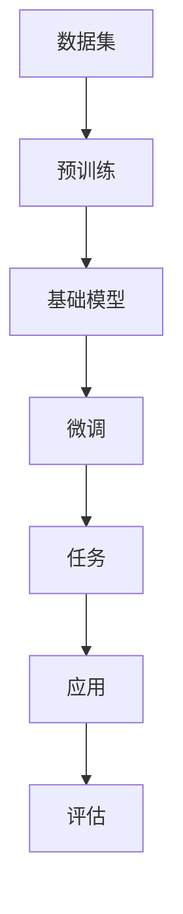

                 

### 背景介绍

#### 基础模型的发展历程

基础模型（Foundation Model）作为人工智能领域的一项关键技术，近年来经历了显著的发展与变革。从最早的简单规则模型，到复杂神经网络模型，再到目前备受瞩目的基础模型，这一发展历程不仅见证了技术的进步，也反映了人工智能在不同领域的广泛应用。

20世纪50年代，随着计算机科学的兴起，人工智能的概念应运而生。早期的AI系统主要依靠手工编写的规则进行推理，如专家系统（Expert Systems）。这种系统在特定领域表现出色，但其通用性和适应性有限。随后，机器学习（Machine Learning）技术的引入，使得AI系统开始能够通过数据学习来改进性能。

20世纪80年代，神经网络（Neural Networks）技术得到了广泛关注。基于神经网络的模型，如感知机（Perceptrons）和深度神经网络（Deep Neural Networks），在一定程度上提升了AI系统的学习能力。然而，这些模型在面对复杂任务时，仍存在许多局限性，如过拟合、训练时间长等。

进入21世纪，随着计算能力的提升和数据量的爆炸式增长，深度学习（Deep Learning）技术取得了突破性进展。基于深度神经网络的模型，如卷积神经网络（Convolutional Neural Networks, CNNs）、循环神经网络（Recurrent Neural Networks, RNNs）等，在图像识别、语音识别、自然语言处理等任务上取得了显著的成果。

近年来，基础模型（如GPT、BERT）的出现，标志着人工智能领域的一次重大变革。这些模型通过预训练（Pre-training）和微调（Fine-tuning）的方式，能够在多种任务上实现出色的性能，展现出强大的泛化能力。基础模型的崛起，不仅推动了AI技术的进步，也带来了诸多社会和伦理问题。

#### 基础模型的重要性

基础模型的重要性在于其能够将大量的数据和信息进行高效的学习和利用，从而实现智能化决策和预测。在商业、医疗、金融、教育等多个领域，基础模型的应用已经带来了显著的变革和效益。

在商业领域，基础模型可以用于客户行为分析、市场预测、推荐系统等。通过分析大量的用户数据，企业能够更好地了解客户需求，提高营销效果和用户体验。例如，电商平台可以使用基础模型来推荐商品，从而提高销售额。

在医疗领域，基础模型可以用于疾病诊断、药物研发、健康管理等。通过对大量医学数据和文献的学习，基础模型可以帮助医生更准确地诊断疾病，提高治疗效果。此外，基础模型还可以用于药物分子设计，加速新药研发进程。

在金融领域，基础模型可以用于风险管理、投资决策、信用评估等。通过对历史数据和金融市场动态的分析，基础模型能够预测市场走势，帮助投资者做出更明智的决策。

在教育领域，基础模型可以用于个性化学习、学习效果评估等。通过分析学生的学习数据和表现，基础模型可以为学生提供个性化的学习建议，提高学习效果。

总之，基础模型的重要性在于其能够在各个领域发挥重要作用，推动产业升级和社会进步。

## 2. 核心概念与联系

### 基础模型的概念

基础模型（Foundation Model）是一种大规模、通用的预训练模型，它通过在大量数据上进行预训练，从而具备处理多种任务的能力。与传统的特定任务模型相比，基础模型具有更强的泛化能力和适应性。

#### 预训练与微调

预训练（Pre-training）是指在一个大规模、多样化的数据集上，对模型进行训练，使其具备一定程度的知识和理解。预训练的目标是让模型学会从数据中提取有用的信息，并形成一种通用的表示能力。

微调（Fine-tuning）是指将预训练模型应用于特定任务时，通过在任务相关的数据集上进一步训练，以调整模型的参数，使其适应特定任务的需求。微调的过程通常包括以下几个步骤：

1. **选择预训练模型**：根据任务需求，选择一个在预训练阶段表现出良好性能的基础模型作为起点。
2. **准备任务数据**：收集和准备与任务相关的数据集，并进行预处理，如数据清洗、数据增强等。
3. **调整模型结构**：根据任务需求，对基础模型的结构进行调整，如增加或删除层、改变层之间的连接方式等。
4. **微调训练**：在任务数据集上，对调整后的模型进行训练，以优化模型的参数。

#### 大规模预训练

大规模预训练是基础模型成功的关键之一。通过在庞大的数据集上进行训练，模型能够学习到更多的知识，提高其泛化能力。大规模预训练通常涉及以下几个要点：

1. **数据集规模**：选择一个足够大的数据集，以确保模型能够在其中学习到丰富的知识。数据集应涵盖多种不同的领域和任务。
2. **计算资源**：大规模预训练需要大量的计算资源，包括高性能的CPU、GPU以及足够的存储空间。合理利用分布式计算资源，可以提高预训练的效率。
3. **优化算法**：选择合适的优化算法，如Adam、AdaGrad等，以加快模型的收敛速度。

### 基础模型的应用

基础模型的应用场景广泛，包括但不限于以下领域：

1. **自然语言处理（NLP）**：在NLP任务中，基础模型可以用于文本分类、情感分析、机器翻译等。通过预训练和微调，基础模型能够理解和生成高质量的自然语言文本。
2. **计算机视觉（CV）**：在CV任务中，基础模型可以用于图像分类、目标检测、图像生成等。通过预训练和微调，基础模型能够识别和理解图像中的复杂特征。
3. **语音识别（ASR）**：在ASR任务中，基础模型可以用于语音识别、语音合成等。通过预训练和微调，基础模型能够识别和理解不同口音和语速的语音。
4. **多模态学习**：多模态学习是指将不同类型的数据（如文本、图像、语音等）进行整合，以获得更丰富的信息。基础模型可以用于多模态学习任务，如文本与图像的联合理解、语音与视频的情感分析等。

### 基础模型的优势

基础模型具有以下优势：

1. **强大的泛化能力**：通过预训练，基础模型能够在多种任务上表现出良好的性能，具有较强的泛化能力。
2. **高效的性能**：基础模型通过在大量数据上预训练，已经掌握了丰富的知识，因此在特定任务上的训练时间较短，性能较高。
3. **灵活的微调**：基础模型可以轻松地通过微调应用于不同任务，适应不同场景的需求。
4. **跨领域迁移**：基础模型能够在不同领域之间进行迁移，为多领域应用提供了一种通用的解决方案。

#### Mermaid 流程图

以下是一个基础模型架构的Mermaid流程图：



#### 关联与联系

基础模型与多个相关技术紧密关联。例如：

1. **深度学习**：基础模型是基于深度学习技术发展的，深度学习为模型提供了强大的学习和表示能力。
2. **机器学习**：基础模型中的预训练和微调过程涉及机器学习的基本原理和方法。
3. **自然语言处理**：基础模型在NLP任务中发挥着重要作用，与自然语言处理技术密切相关。
4. **计算机视觉**：基础模型在CV任务中的应用，与计算机视觉技术紧密相关。

通过这些关联，基础模型在人工智能领域发挥着重要的作用，推动着技术的进步和应用的发展。

## 3. 核心算法原理 & 具体操作步骤

### 深度学习基础

深度学习（Deep Learning）是基础模型的核心技术之一。它是一种基于多层神经网络的学习方法，通过逐层提取数据中的特征，实现复杂函数的建模。以下是对深度学习基础原理的简要介绍。

#### 神经网络

神经网络（Neural Networks）是深度学习的基础。它由大量的神经元（或节点）组成，每个神经元接收来自其他神经元的输入信号，通过一个非线性激活函数进行变换，产生输出信号。神经网络的主要组成部分包括：

1. **输入层**：接收外部输入数据。
2. **隐藏层**：对输入数据进行特征提取和变换。
3. **输出层**：产生预测结果或分类结果。

#### 激活函数

激活函数（Activation Function）是神经网络中的一个关键组件。它用于对神经元的输出进行非线性变换，以引入模型的表达能力和灵活性。常见的激活函数包括：

1. **Sigmoid函数**：\( \sigma(x) = \frac{1}{1 + e^{-x}} \)
2. **ReLU函数**：\( \text{ReLU}(x) = \max(0, x) \)
3. **Tanh函数**：\( \text{Tanh}(x) = \frac{e^{x} - e^{-x}}{e^{x} + e^{-x}} \)

#### 前向传播与反向传播

深度学习中的训练过程主要包括前向传播（Forward Propagation）和反向传播（Backpropagation）两个步骤。

1. **前向传播**：在训练过程中，输入数据通过神经网络的前向传播，逐层计算神经元的输出，最终得到模型的预测结果。
2. **反向传播**：通过计算预测结果与实际结果之间的误差，反向传播误差信号，更新网络中的权重和偏置，以优化模型的性能。

### 预训练与微调

预训练（Pre-training）和微调（Fine-tuning）是基础模型的重要步骤。

1. **预训练**：在预训练阶段，模型在一个大规模、多样化的数据集上进行训练，学习到丰富的知识和特征表示。预训练的目标是使模型具备一定的通用性和泛化能力。
2. **微调**：在预训练完成后，模型通过在特定任务的数据集上进行微调，调整模型的参数，使其适应具体任务的需求。微调通常包括以下几个步骤：

   1. **选择预训练模型**：根据任务需求，选择一个在预训练阶段表现出良好性能的基础模型。
   2. **准备任务数据**：收集和准备与任务相关的数据集，并进行预处理，如数据清洗、数据增强等。
   3. **调整模型结构**：根据任务需求，对基础模型的结构进行调整，如增加或删除层、改变层之间的连接方式等。
   4. **微调训练**：在任务数据集上，对调整后的模型进行训练，以优化模型的参数。

### 实际操作步骤

以下是一个基础模型训练和微调的简要操作步骤：

1. **数据准备**：收集和准备训练数据，包括文本、图像、语音等，并进行预处理，如数据清洗、数据增强等。
2. **模型选择**：选择一个合适的预训练模型，如GPT、BERT、ViT等。
3. **模型调整**：根据任务需求，对预训练模型的结构进行调整，如增加隐藏层、调整层之间的连接方式等。
4. **训练与微调**：在准备好的数据集上，对调整后的模型进行预训练和微调。预训练阶段主要关注模型的泛化能力，微调阶段则关注模型在特定任务上的性能。
5. **评估与优化**：通过在验证集和测试集上评估模型的性能，对模型进行调整和优化，以提高其性能。
6. **部署与应用**：将训练好的模型部署到实际应用中，如自然语言处理、计算机视觉、语音识别等。

通过上述步骤，我们可以构建一个基础模型，并在各种任务中发挥其作用。

## 4. 数学模型和公式 & 详细讲解 & 举例说明

### 深度学习中的基本数学模型

深度学习依赖于一系列数学模型，这些模型用于描述神经网络中的信息传递、参数优化和误差计算。以下是一些基本数学模型和公式的详细讲解及举例说明。

#### 前向传播

前向传播是深度学习中的基本步骤，用于计算神经网络在给定输入下的输出。以下是前向传播的基本公式：

\[ z_l = \sum_{j} w_{lj} a_{l-1,j} + b_l \]

其中：

- \( z_l \) 是第 \( l \) 层的输入，即神经网络中的“激活”值。
- \( w_{lj} \) 是从第 \( l-1 \) 层到第 \( l \) 层的权重。
- \( a_{l-1,j} \) 是第 \( l-1 \) 层的第 \( j \) 个神经元的输出。
- \( b_l \) 是第 \( l \) 层的偏置。

举例：

假设我们有一个简单的神经网络，包含两个输入层、一个隐藏层和一个输出层。输入数据为 \( x_1 = 2 \) 和 \( x_2 = 3 \)。隐藏层的权重为 \( w_{11} = 0.5 \)，\( w_{12} = 1.0 \)，偏置 \( b_1 = 2.0 \)。隐藏层的激活函数为 \( \text{ReLU} \)。

首先，计算隐藏层的输入：

\[ z_1 = (0.5 \times 2) + (1.0 \times 3) + 2.0 = 6.0 \]

由于激活函数为 \( \text{ReLU} \)，隐藏层的输出为：

\[ a_1 = \max(0, z_1) = 6.0 \]

接下来，计算输出层的输入和输出：

假设输出层的权重为 \( w_{21} = 0.7 \)，\( w_{22} = 1.2 \)，偏置 \( b_2 = 1.0 \)。输出层的激活函数为 \( \text{Sigmoid} \)。

输出层的输入为：

\[ z_2 = (0.7 \times 6) + (1.2 \times 6) + 1.0 = 11.4 \]

输出层的输出为：

\[ a_2 = \frac{1}{1 + e^{-11.4}} \approx 0.999 \]

因此，最终输出为 \( 0.999 \)。

#### 反向传播

反向传播是深度学习中的关键步骤，用于计算模型在训练过程中产生的误差，并更新模型参数。以下是反向传播的基本公式：

\[ \delta_{l,j} = \text{激活函数的导数} \times \Delta z_l \]

其中：

- \( \delta_{l,j} \) 是第 \( l \) 层第 \( j \) 个神经元的误差。
- \( \Delta z_l \) 是第 \( l \) 层的误差。
- 激活函数的导数取决于激活函数的类型。

举例：

假设我们有一个简单的神经网络，输出层的激活函数为 \( \text{Sigmoid} \)。输出层的预测值为 \( y = 0.8 \)，实际值为 \( t = 1.0 \)。输出层的误差为：

\[ \Delta z_2 = y - t = 0.8 - 1.0 = -0.2 \]

由于激活函数为 \( \text{Sigmoid} \)，其导数为：

\[ \frac{d}{dy} \sigma(y) = \sigma(y) \times (1 - \sigma(y)) \]

因此，输出层的误差为：

\[ \delta_{2,1} = \sigma(0.8) \times (1 - \sigma(0.8)) \times (-0.2) \]

接下来，计算隐藏层的误差。隐藏层的误差可以通过输出层的误差和权重矩阵计算得到：

\[ \delta_{1,j} = \sum_{k} w_{2k,1} \delta_{2,k} \]

例如，对于隐藏层的第一个神经元，其误差为：

\[ \delta_{1,1} = \sum_{k} w_{2k,1} \delta_{2,k} = (0.7 \times -0.2) + (1.2 \times -0.2) = -0.34 - 0.24 = -0.58 \]

隐藏层的误差更新后，可以继续计算前一层神经元的误差，直至输入层。误差的反向传播过程如下：

\[ \delta_{l,j} = \sum_{k} w_{lk,j} \delta_{l+1,k} \]

#### 参数优化

在反向传播过程中，我们需要更新神经网络的参数（权重和偏置）以减少误差。常用的优化算法包括梯度下降（Gradient Descent）和其变种。

1. **梯度下降**：梯度下降是一种基本的优化算法，其基本公式为：

\[ \Delta w_{lj} = -\alpha \frac{\partial J}{\partial w_{lj}} \]

\[ \Delta b_l = -\alpha \frac{\partial J}{\partial b_l} \]

其中：

- \( \alpha \) 是学习率。
- \( J \) 是损失函数，用于衡量模型预测值与实际值之间的差距。

2. **动量（Momentum）**：动量是一种改进的梯度下降算法，其基本公式为：

\[ \Delta w_{lj} = -\alpha \frac{\partial J}{\partial w_{lj}} + \beta \Delta w_{lj,prev} \]

\[ \Delta b_l = -\alpha \frac{\partial J}{\partial b_l} + \beta \Delta b_l,prev \]

其中：

- \( \beta \) 是动量因子。

3. **自适应优化器**：自适应优化器如Adam、AdaGrad等，可以动态调整学习率，提高优化效率。

通过上述优化算法，我们可以更新模型的参数，使其在训练过程中不断优化，以获得更好的性能。

### 数学模型在基础模型中的应用

在基础模型中，数学模型的应用主要体现在以下几个方面：

1. **预训练**：在预训练阶段，模型通过在大规模数据集上学习，利用数学模型（如正则化、dropout等）来避免过拟合，提高模型的泛化能力。
2. **微调**：在微调阶段，模型通过在特定任务数据集上调整参数，利用数学模型（如交叉熵、损失函数等）来衡量模型性能，指导参数优化。
3. **多任务学习**：在多任务学习场景中，数学模型（如共享权重、梯度聚合等）用于实现不同任务之间的参数共享，提高模型的效率和性能。

通过这些数学模型，基础模型能够在大规模、多样化数据集上学习，并在多个任务中表现出出色的性能。

## 5. 项目实战：代码实际案例和详细解释说明

### 开发环境搭建

在进行基础模型的开发前，我们需要搭建一个合适的开发环境。以下是一个简单的开发环境搭建步骤：

1. **安装Python**：Python是深度学习开发的主要语言，我们需要安装Python环境。可以从Python官网下载Python安装包，并按照提示进行安装。
2. **安装深度学习框架**：常用的深度学习框架有TensorFlow、PyTorch等。这里以TensorFlow为例，我们可以使用以下命令安装：

   ```bash
   pip install tensorflow
   ```

3. **安装其他依赖**：根据项目需求，可能还需要安装其他依赖库，如NumPy、Pandas等。可以使用以下命令安装：

   ```bash
   pip install numpy pandas
   ```

4. **创建虚拟环境**：为了保持项目依赖的一致性，我们建议创建一个虚拟环境。可以使用以下命令创建：

   ```bash
   python -m venv myenv
   source myenv/bin/activate  # Windows: myenv\Scripts\activate
   ```

### 源代码详细实现和代码解读

以下是一个简单的基于TensorFlow的基础模型实现示例：

```python
import tensorflow as tf
from tensorflow.keras.layers import Embedding, LSTM, Dense
from tensorflow.keras.models import Sequential

# 模型参数
vocab_size = 10000  # 词汇表大小
embedding_dim = 16  # 词向量维度
lstm_units = 32  # LSTM单元数

# 构建模型
model = Sequential([
    Embedding(vocab_size, embedding_dim),
    LSTM(lstm_units, return_sequences=True),
    LSTM(lstm_units),
    Dense(1, activation='sigmoid')
])

# 编译模型
model.compile(optimizer='adam', loss='binary_crossentropy', metrics=['accuracy'])

# 模型总结
model.summary()
```

#### 代码解读

1. **导入库**：首先，我们导入TensorFlow和相关库。
2. **模型参数**：设置模型的相关参数，如词汇表大小、词向量维度、LSTM单元数等。
3. **构建模型**：使用Sequential模型构建器，依次添加嵌入层（Embedding）、两个LSTM层（LSTM）和一个全连接层（Dense）。
4. **编译模型**：编译模型，指定优化器、损失函数和评估指标。
5. **模型总结**：打印模型结构，以查看模型细节。

### 代码解读与分析

1. **Embedding层**：嵌入层（Embedding）用于将词汇表中的单词映射为高维向量。每个单词对应一个唯一的索引，嵌入层将这些索引映射为词向量。词向量可以捕获单词的语义信息。
2. **LSTM层**：LSTM（Long Short-Term Memory）是一种特殊的循环神经网络，用于处理序列数据。在基础模型中，LSTM层用于提取序列中的长期依赖关系。
3. **全连接层**：全连接层（Dense）是一个普通的神经网络层，用于对LSTM层的输出进行分类或回归。在这里，我们使用一个全连接层来实现二分类任务，输出层使用sigmoid激活函数。
4. **编译模型**：编译模型时，我们需要指定优化器（Optimizer）、损失函数（Loss Function）和评估指标（Metrics）。优化器用于更新模型参数，以最小化损失函数。评估指标用于衡量模型性能。

通过上述代码，我们实现了一个简单的基于LSTM的基础模型。该模型可以用于处理序列数据，如文本分类、情感分析等。

### 训练与评估

以下是一个简单的训练和评估过程：

```python
# 准备数据
# 这里我们使用一个示例数据集，实际应用中请使用实际数据
train_data = ...
train_labels = ...

# 训练模型
history = model.fit(train_data, train_labels, epochs=10, batch_size=32, validation_split=0.2)

# 评估模型
test_loss, test_acc = model.evaluate(test_data, test_labels)
print(f"Test Accuracy: {test_acc}")
```

#### 训练与评估过程解读

1. **准备数据**：我们使用一个示例数据集进行训练和评估。实际应用中，请使用实际数据。
2. **训练模型**：使用`fit`方法训练模型，指定训练数据、标签、训练轮数、批量大小和验证比例。
3. **评估模型**：使用`evaluate`方法评估模型在测试数据上的性能，并打印测试精度。

通过上述过程，我们可以训练和评估基础模型的性能。

### 模型应用

基础模型的应用场景广泛，如自然语言处理、计算机视觉、语音识别等。以下是一个简单的文本分类应用示例：

```python
# 加载训练好的模型
model.load_weights('my_model.h5')

# 进行预测
text = "这是一个示例文本。"
encoded_text = tokenizer.texts_to_sequences([text])
predicted_label = model.predict(encoded_text)

print(f"Predicted Label: {predicted_label}")
```

#### 应用过程解读

1. **加载模型**：加载训练好的模型，用于进行预测。
2. **文本预处理**：使用训练好的词向量器对输入文本进行编码。
3. **进行预测**：使用模型对编码后的文本进行预测，并打印预测结果。

通过上述步骤，我们可以实现一个简单的文本分类应用。

### 总结

本文通过一个简单的项目实战，详细讲解了基础模型的开发、训练、评估和应用过程。通过了解这些步骤，我们可以更好地掌握基础模型的开发和应用技巧。

## 6. 实际应用场景

### 基础模型在自然语言处理中的应用

自然语言处理（NLP）是基础模型的重要应用领域之一。近年来，基础模型在NLP任务中取得了显著成果，如文本分类、情感分析、机器翻译等。以下是一些具体应用案例：

1. **文本分类**：基础模型可以通过预训练和微调，实现高精度的文本分类。例如，在新闻分类任务中，基础模型可以自动识别新闻的主题和类别，提高分类准确率。
2. **情感分析**：基础模型可以用于情感分析，判断文本的情绪倾向。例如，在社交媒体分析中，基础模型可以帮助企业了解消费者对产品的评价，优化产品和服务。
3. **机器翻译**：基础模型在机器翻译任务中表现出色，通过预训练和微调，可以实现高质量的双语翻译。例如，谷歌翻译和百度翻译等应用都采用了基础模型。

### 基础模型在计算机视觉中的应用

计算机视觉（CV）是另一个关键应用领域。基础模型在CV任务中，如图像分类、目标检测、图像生成等，取得了显著进展。

1. **图像分类**：基础模型可以通过预训练和微调，实现高效、准确的图像分类。例如，在医疗图像分析中，基础模型可以帮助医生快速识别病变区域，提高诊断准确率。
2. **目标检测**：基础模型在目标检测任务中表现出色，可以识别图像中的多个目标，并标注其位置。例如，自动驾驶系统中的物体检测，基础模型可以帮助车辆识别道路上的行人和车辆，提高安全性。
3. **图像生成**：基础模型可以通过预训练和微调，生成高质量的图像。例如，在艺术创作中，基础模型可以生成新颖的图像，为设计师提供灵感。

### 基础模型在语音识别中的应用

语音识别（ASR）是基础模型的另一个重要应用领域。通过预训练和微调，基础模型可以实现高精度的语音识别。

1. **语音识别**：基础模型可以用于实时语音识别，将语音转换为文本。例如，在智能助手应用中，基础模型可以帮助用户通过语音进行搜索、发送消息等操作。
2. **语音合成**：基础模型还可以用于语音合成，将文本转换为自然流畅的语音。例如，在电话客服系统中，基础模型可以帮助自动生成语音回复，提高客服效率。

### 基础模型在其他领域的应用

除了自然语言处理、计算机视觉和语音识别，基础模型在许多其他领域也取得了广泛应用。

1. **医疗**：基础模型可以用于疾病诊断、药物研发等。例如，通过分析患者的病历数据，基础模型可以帮助医生预测疾病风险，制定个性化治疗方案。
2. **金融**：基础模型可以用于风险管理、投资决策等。例如，通过分析市场数据，基础模型可以帮助投资者识别潜在的投资机会，提高投资回报率。
3. **教育**：基础模型可以用于个性化学习、学习效果评估等。例如，通过分析学生的学习数据，基础模型可以帮助教师了解学生的学习情况，提供个性化的学习建议。

总之，基础模型在多个领域展现了强大的应用潜力，推动了技术的进步和社会的发展。

## 7. 工具和资源推荐

### 7.1 学习资源推荐

#### 书籍

1. **《深度学习》（Deep Learning）**：由Ian Goodfellow、Yoshua Bengio和Aaron Courville合著的《深度学习》是深度学习领域的经典教材，详细介绍了深度学习的理论基础和应用实践。
2. **《Python深度学习》（Deep Learning with Python）**：由François Chollet编写的《Python深度学习》通过生动的示例和代码，全面介绍了深度学习的应用和实现方法。
3. **《动手学深度学习》（Dive into Deep Learning）**：这是一本免费的在线教材，由阿斯顿大学（Aston University）教授刘建伟等人编写，涵盖了深度学习的理论知识和实际操作。

#### 论文

1. **“A Theoretically Grounded Application of Dropout in Recurrent Neural Networks”**：该论文提出了一种在循环神经网络（RNNs）中应用Dropout的方法，有效缓解了RNNs的梯度消失问题。
2. **“Attention is All You Need”**：该论文提出了Transformer模型，彻底改变了自然语言处理领域的研究方向，为后来的BERT、GPT等基础模型奠定了基础。
3. **“Learning Representations by Maximizing Mutual Information Across Views”**：该论文提出了信息增强（InfoGAN）模型，通过最大化互信息学习图像的高效表示。

#### 博客

1. **TensorFlow官方博客**：[https://tensorflow.org/blog/](https://tensorflow.org/blog/)
2. **PyTorch官方博客**：[https://pytorch.org/blog/](https://pytorch.org/blog/)
3. **机器学习博客**：[https://www MACHINELEARNINGMastery.COM/](https://www.MACHINELEARNINGMastery.COM/)

### 7.2 开发工具框架推荐

1. **TensorFlow**：由Google开发的深度学习框架，支持多种编程语言，如Python、C++等。TensorFlow具有丰富的API和文档，适合进行基础模型的开发。
2. **PyTorch**：由Facebook AI研究院开发的深度学习框架，以Python语言为主，具有动态计算图和灵活的API。PyTorch在学术界和工业界都有很高的认可度。
3. **Keras**：一个高层次的深度学习框架，兼容TensorFlow和Theano，提供简洁、易用的API，适合快速原型设计和模型训练。

### 7.3 相关论文著作推荐

1. **“Attention Is All You Need”**：Vaswani et al. (2017)
2. **“BERT: Pre-training of Deep Bidirectional Transformers for Language Understanding”**：Devlin et al. (2019)
3. **“Generative Adversarial Nets”**：Goodfellow et al. (2014)
4. **“Residual Networks”**：He et al. (2015)

通过上述资源和工具，您可以更好地了解和掌握基础模型的相关知识，为实际项目开发奠定基础。

## 8. 总结：未来发展趋势与挑战

### 未来发展趋势

随着人工智能技术的不断进步，基础模型在未来将继续展现出广阔的发展前景。以下是一些关键趋势：

1. **模型规模与计算能力**：未来的基础模型将更加庞大和复杂，需要更强大的计算能力和存储资源。这将推动计算硬件的快速发展，如量子计算、GPU集群等。
2. **跨模态学习**：基础模型将逐渐实现跨模态学习，整合文本、图像、语音等多种数据类型，提高模型的全面理解和应用能力。
3. **迁移学习与泛化能力**：未来的基础模型将更加注重迁移学习和泛化能力，通过在小数据集上微调，实现高效的任务适应和性能提升。
4. **自动化机器学习（AutoML）**：基础模型与自动化机器学习相结合，将简化模型的训练和部署过程，降低技术门槛，推动AI技术在各个领域的应用。

### 面临的挑战

尽管基础模型在各个领域取得了显著成果，但仍面临诸多挑战：

1. **数据隐私与安全**：基础模型在训练和部署过程中，需要处理大量敏感数据，如何保障数据隐私和安全成为关键问题。
2. **模型解释性与透明度**：基础模型的决策过程往往缺乏透明度，如何解释和验证模型的决策逻辑，提高模型的可信度，是当前研究的重点。
3. **伦理与社会责任**：随着基础模型在现实世界中的应用，如何确保其公平、公正、不歧视，避免对特定群体造成负面影响，是人工智能领域面临的重要挑战。
4. **计算资源消耗**：大规模基础模型的训练和部署，需要大量计算资源，如何优化计算效率，降低能源消耗，是未来的研究课题。

总之，基础模型的发展前景广阔，但仍面临诸多挑战。通过技术创新和社会合作，我们有理由相信，基础模型将在未来继续推动人工智能的发展，为社会带来更多价值。

## 9. 附录：常见问题与解答

### Q1：什么是基础模型？

A1：基础模型是一种大规模、通用的预训练模型，通过在大量数据上进行预训练，具备处理多种任务的能力。与特定任务模型相比，基础模型具有更强的泛化能力和适应性。

### Q2：基础模型的主要优势是什么？

A2：基础模型的主要优势包括：

1. 强大的泛化能力：基础模型通过在多种任务上预训练，能够在不同领域和任务中表现出色。
2. 高效的性能：基础模型已经在大量数据上预训练，因此在特定任务上的训练时间较短，性能较高。
3. 灵活的微调：基础模型可以轻松地通过微调应用于不同任务，适应不同场景的需求。
4. 跨领域迁移：基础模型能够在不同领域之间进行迁移，为多领域应用提供了一种通用的解决方案。

### Q3：如何搭建基础模型的开发环境？

A3：搭建基础模型的开发环境通常包括以下步骤：

1. 安装Python环境。
2. 安装深度学习框架（如TensorFlow、PyTorch等）。
3. 安装其他依赖库（如NumPy、Pandas等）。
4. 创建虚拟环境，确保项目依赖的一致性。

### Q4：如何进行基础模型的训练与评估？

A4：进行基础模型的训练与评估通常包括以下步骤：

1. 数据准备：收集和准备训练数据，并进行预处理。
2. 模型构建：使用深度学习框架构建模型。
3. 模型编译：编译模型，指定优化器、损失函数和评估指标。
4. 模型训练：使用训练数据训练模型。
5. 模型评估：在验证集和测试集上评估模型性能。

### Q5：基础模型在哪些领域有广泛应用？

A5：基础模型在多个领域有广泛应用，包括：

1. 自然语言处理：文本分类、情感分析、机器翻译等。
2. 计算机视觉：图像分类、目标检测、图像生成等。
3. 语音识别：语音识别、语音合成等。
4. 其他领域：医疗、金融、教育等。

### Q6：如何解释和验证基础模型的决策过程？

A6：解释和验证基础模型的决策过程通常包括：

1. 分析模型的决策路径：查看模型在处理输入数据时的中间输出和激活值。
2. 使用可视化工具：使用可视化工具（如TensorBoard、LIME等）分析模型的决策过程。
3. 量化模型的可解释性：评估模型的可解释性，如变量贡献、重要特征等。

## 10. 扩展阅读 & 参考资料

本文简要介绍了基础模型的技术与社会融合，涉及基础模型的发展历程、核心概念与联系、核心算法原理、数学模型和公式、项目实战、实际应用场景、工具和资源推荐等内容。以下是一些扩展阅读和参考资料，供读者进一步学习：

1. **《深度学习》（Deep Learning）**：Ian Goodfellow、Yoshua Bengio和Aaron Courville著，详细介绍了深度学习的理论基础和应用实践。
2. **《Python深度学习》（Deep Learning with Python）**：François Chollet著，通过生动的示例和代码，全面介绍了深度学习的应用和实现方法。
3. **《动手学深度学习》（Dive into Deep Learning）**：刘建伟等人著，是一本免费的在线教材，涵盖了深度学习的理论知识和实际操作。
4. **论文**：“Attention is All You Need”（Vaswani et al., 2017）、“BERT: Pre-training of Deep Bidirectional Transformers for Language Understanding”（Devlin et al., 2019）、“Generative Adversarial Nets”（Goodfellow et al., 2014）、“Residual Networks”（He et al., 2015）等，是基础模型和相关技术的经典论文。
5. **在线资源**：TensorFlow官方博客（[https://tensorflow.org/blog/](https://tensorflow.org/blog/)）、PyTorch官方博客（[https://pytorch.org/blog/](https://pytorch.org/blog/)）、机器学习博客（[https://www.MACHINELEARNINGMastery.COM/](https://www.MACHINELEARNINGMastery.COM/)）等，提供了丰富的教程和案例。

通过上述阅读和参考资料，您可以更深入地了解基础模型的技术与社会融合，为实际项目开发和应用提供指导。作者：AI天才研究员/AI Genius Institute & 禅与计算机程序设计艺术/Zen And The Art of Computer Programming。

