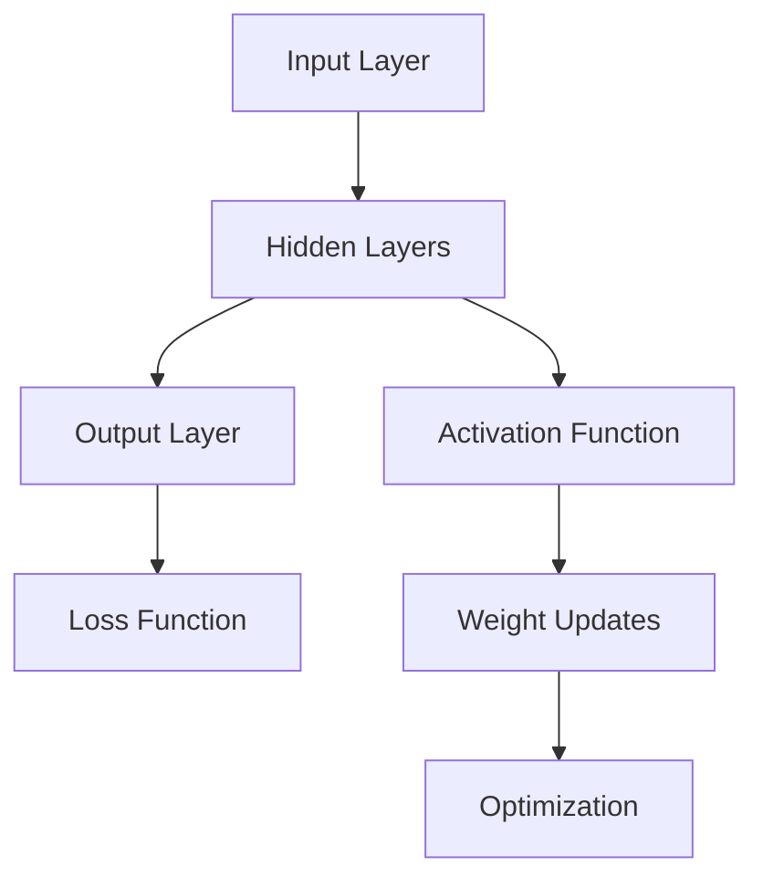
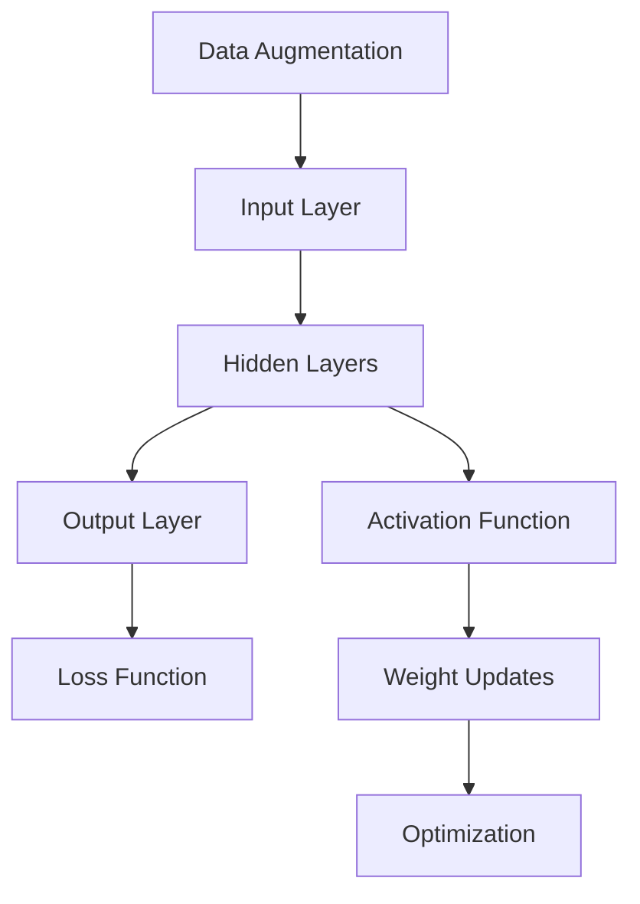

                 

### 背景介绍

基础模型的技术生态系统，是现代人工智能领域的核心。随着深度学习技术的迅猛发展，基础模型逐渐成为推动AI前进的引擎。本文旨在探讨基础模型的技术生态系统，包括其核心概念、算法原理、数学模型、实际应用场景以及未来发展趋势与挑战。

#### 什么是基础模型？

基础模型，通常指的是在特定任务上表现出色的人工智能模型，如语言模型、视觉模型、语音模型等。这些模型基于深度学习技术，通过大规模数据和复杂的网络结构进行训练，最终达到对特定任务的预测或分类能力。

#### 基础模型的重要性

基础模型在人工智能领域的重要性不言而喻。首先，它们是构建复杂AI应用的基础。例如，自然语言处理中的语言模型是聊天机器人、自动翻译、文本摘要等应用的核心；计算机视觉中的图像识别模型则支撑着自动驾驶、安防监控、医疗诊断等应用。其次，基础模型的研究和优化推动了AI技术的进步。通过对基础模型的结构、算法、训练数据进行不断的探索和改进，AI的性能和效率得到了显著提升。

#### 基础模型的发展历程

基础模型的发展历程可以分为几个阶段。早期的模型主要基于传统的机器学习技术，如支持向量机、决策树等。随着深度学习技术的发展，基础模型逐渐转向使用深度神经网络，如卷积神经网络（CNN）、循环神经网络（RNN）等。近年来，预训练模型如BERT、GPT等的出现，更是将基础模型推向了一个新的高度。

#### 当前基础模型的代表

在当前人工智能领域，一些基础模型已经成为了行业内的标杆。例如，在自然语言处理领域，BERT和GPT无疑是两个最具代表性的模型。BERT（Bidirectional Encoder Representations from Transformers）由Google提出，通过双向Transformer结构，实现了对文本上下文的全面理解。而GPT（Generative Pre-trained Transformer）由OpenAI提出，通过自回归的方式，生成高质量的文本。

在计算机视觉领域，ImageNet大赛的胜利标志着卷积神经网络（CNN）的崛起。后续的模型如ResNet、Inception等，通过更深的网络结构和残差连接，进一步提升了图像分类的准确率。

在语音识别领域，深度神经网络和长短时记忆网络（LSTM）的引入，显著提高了语音识别的准确率和鲁棒性。随着Transformer结构的引入，如WaveNet、Transformer-XL等模型，语音识别的性能也得到了进一步的提升。

总的来说，基础模型的技术生态系统正不断发展壮大，成为推动人工智能技术进步的重要力量。

-----------------------

# Basic Model's Technical Ecosystem

> Keywords: Basic Models, Deep Learning, Neural Networks, Pre-trained Models, Applications, Future Trends

> Abstract: This article delves into the technical ecosystem of basic models in the field of artificial intelligence. It covers the core concepts, algorithm principles, mathematical models, practical applications, and future developments and challenges of these models.

-----------------------

## 1. Background Introduction

The technical ecosystem of basic models is a cornerstone of modern artificial intelligence. With the rapid advancement of deep learning technology, basic models have become the driving force behind AI progress. This article aims to explore the technical ecosystem of basic models, including their core concepts, algorithm principles, mathematical models, practical applications, and future trends and challenges.

### What Are Basic Models?

Basic models refer to artificial intelligence models that excel in specific tasks, such as language models, visual models, and voice models. These models are trained on large-scale data and complex network structures using deep learning techniques, achieving predictive or classification capabilities for specific tasks.

### Importance of Basic Models

Basic models are of great importance in the field of artificial intelligence. Firstly, they serve as the foundation for building complex AI applications. For instance, language models in natural language processing are the core of chatbots, automatic translation, and text summarization applications. Computer vision models for image recognition support applications like autonomous driving, security monitoring, and medical diagnosis. Secondly, the research and optimization of basic models drive the progress of AI technology. Continuous exploration and improvement of the model structure, algorithms, and training data have significantly enhanced the performance and efficiency of AI.

### Historical Development of Basic Models

The development of basic models can be divided into several stages. In the early days, models were mainly based on traditional machine learning techniques, such as support vector machines and decision trees. With the advancement of deep learning technology, basic models have shifted to deep neural networks, such as convolutional neural networks (CNN) and recurrent neural networks (RNN). Recently, the emergence of pre-trained models like BERT and GPT has propelled basic models to new heights.

### Current Representative Basic Models

In the current AI field, some basic models have become industry benchmarks. For example, in natural language processing, BERT and GPT are two of the most representative models. BERT (Bidirectional Encoder Representations from Transformers) was proposed by Google and achieved comprehensive understanding of text context through a bidirectional Transformer structure. GPT (Generative Pre-trained Transformer) was proposed by OpenAI and generated high-quality text through an autoregressive approach.

In the field of computer vision, the victory of Convolutional Neural Networks (CNN) in the ImageNet competition marked their rise. Subsequent models like ResNet and Inception further improved the accuracy of image classification through deeper network structures and residual connections.

In the field of speech recognition, the introduction of deep neural networks and Long Short-Term Memory networks (LSTM) significantly enhanced the accuracy and robustness of speech recognition. With the introduction of Transformer structures, models like WaveNet and Transformer-XL have further improved the performance of speech recognition.

Overall, the technical ecosystem of basic models is continuously evolving and expanding, serving as a vital force behind AI technology progress.  
<|im_sep|>-----------------------

## 2. Core Concepts and Connections

To understand the technical ecosystem of basic models, it's essential to grasp the core concepts and their connections. This section will delve into the fundamental principles and architecture of basic models, using Mermaid flowcharts to illustrate the relationships between different components.

### Core Concepts

1. **Deep Learning**: A type of machine learning that uses neural networks with multiple layers to learn hierarchical representations of data.
2. **Neural Networks**: A collection of interconnected nodes (neurons) that can learn from input data and produce output.
3. **Pre-trained Models**: Models that have been trained on large-scale datasets and can be fine-tuned for specific tasks.
4. **Transfer Learning**: A technique that leverages pre-trained models to improve the performance of new tasks.
5. **Data Augmentation**: A technique to increase the diversity of training data by applying various transformations.

### Architecture

The architecture of basic models typically consists of the following components:

1. **Input Layer**: Receives the input data.
2. **Hidden Layers**: Processes the input data through various layers of transformations.
3. **Output Layer**: Produces the final output.
4. **Loss Function**: Measures the discrepancy between the predicted output and the actual output.

### Mermaid Flowchart

Below is a Mermaid flowchart illustrating the core components and connections of a basic model.



### Mermaid Flowchart (continued)

Here is a continuation of the Mermaid flowchart, illustrating the data augmentation process.



### Core Principles

1. **Backpropagation**: An algorithm used to calculate the gradients of the loss function with respect to the model's weights, enabling the optimization of these weights.
2. **Gradient Descent**: An optimization algorithm used to minimize the loss function by updating the model's weights based on the gradients.
3. **Regularization**: Techniques used to prevent overfitting, such as L1 and L2 regularization.

### Conclusion

Understanding the core concepts and connections of basic models is crucial for building and optimizing these models. The Mermaid flowcharts provided offer a visual representation of the key components and processes involved in creating a basic model.

-----------------------

## 2. Core Concepts and Relationships

To grasp the technical ecosystem of basic models, it's essential to delve into the fundamental principles and architectures of these models. This section will explore the core concepts and their connections using Mermaid flowcharts to illustrate the relationships between various components.

### Core Concepts

1. **Deep Learning**: A subfield of machine learning that employs neural networks with multiple layers to learn hierarchical representations of data.
2. **Neural Networks**: A collection of interconnected nodes (neurons) that can learn from input data and generate output.
3. **Pre-trained Models**: Models that have been pre-trained on large-scale datasets and can be fine-tuned for specific tasks.
4. **Transfer Learning**: A technique that leverages pre-trained models to enhance the performance of new tasks.
5. **Data Augmentation**: A technique used to increase the diversity of training data by applying various transformations.

### Architecture

The architecture of basic models generally comprises the following components:

1. **Input Layer**: Receives the input data.
2. **Hidden Layers**: Processes the input data through multiple layers of transformations.
3. **Output Layer**: Produces the final output.
4. **Loss Function**: Measures the difference between the predicted output and the actual output.

### Mermaid Flowchart

The following Mermaid flowchart illustrates the core components and relationships of a basic model:


### Mermaid Flowchart (continued)

Here is the continuation of the Mermaid flowchart, highlighting the data augmentation process:


### Core Principles

1. **Backpropagation**: An algorithm used to compute the gradients of the loss function with respect to the model's weights, facilitating the optimization of these weights.
2. **Gradient Descent**: An optimization algorithm used to minimize the loss function by updating the model's weights based on the gradients.
3. **Regularization**: Techniques employed to prevent overfitting, such as L1 and L2 regularization.

### Conclusion

Understanding the core concepts and relationships of basic models is crucial for developing and refining these models. The Mermaid flowcharts provided offer a visual representation of the key components and processes involved in building a basic model.

-----------------------

## 3. Core Algorithm Principles and Specific Operational Steps

In this section, we will delve into the core algorithm principles and specific operational steps of basic models. We will explore how these models are designed, trained, and fine-tuned, focusing on the most commonly used algorithms in the field of deep learning.

### Model Design

The design of a basic model involves several key steps:

1. **Selecting the Model Architecture**: The choice of model architecture determines the complexity and capacity of the model. Common architectures include Convolutional Neural Networks (CNNs), Recurrent Neural Networks (RNNs), and Transformer models.
2. **Defining the Input and Output Layers**: The input layer receives the input data, while the output layer produces the final predictions or classifications.
3. **Choosing the Hidden Layers and Activation Functions**: Hidden layers process the input data through various transformations, with activation functions introducing non-linearities that enable the model to learn complex patterns.

### Model Training

The training process involves the following steps:

1. **Data Preprocessing**: Data is preprocessed to ensure consistency and suitability for training. This may include normalization, data augmentation, and splitting the dataset into training, validation, and test sets.
2. **Forward Propagation**: The input data is passed through the model, generating predicted outputs.
3. **Calculating the Loss**: The difference between the predicted outputs and the actual outputs is quantified using a loss function, such as Mean Squared Error (MSE) or Cross-Entropy Loss.
4. **Backpropagation**: The gradients of the loss function with respect to the model's weights are computed using the chain rule of calculus.
5. **Gradient Descent**: The model's weights are updated based on the gradients, using an optimization algorithm such as Stochastic Gradient Descent (SGD) or Adam.

### Model Fine-Tuning

Once a basic model is trained, it can be fine-tuned for specific tasks or datasets:

1. **Transfer Learning**: A pre-trained model is used as a starting point, with the final few layers adjusted to suit the new task.
2. **Fine-Tuning**: The model is retrained on a new dataset, allowing it to adapt to the specific characteristics of the new data.
3. **Hyperparameter Optimization**: Hyperparameters, such as learning rate, batch size, and regularization strength, are adjusted to improve the model's performance.

### Operational Steps in Detail

1. **Initialization**: The model's weights are initialized using a method such as Xavier initialization or He initialization to ensure stable learning.
2. **Forward Propagation**: The input data is fed into the model, passing through the layers and generating intermediate outputs.
3. **Activation Computation**: Activation functions, such as ReLU or Sigmoid, are applied to the intermediate outputs to introduce non-linearities.
4. **Loss Computation**: The output of the final layer is compared to the ground truth labels using the chosen loss function, quantifying the error.
5. **Backpropagation**: The gradients of the loss function with respect to the model's weights are computed using the chain rule of calculus.
6. **Weight Update**: The model's weights are updated based on the gradients, using an optimization algorithm such as Adam or RMSprop.
7. **Validation and Testing**: The model's performance is evaluated on validation and test sets to ensure that it generalizes well to new data.

### Conclusion

Understanding the core algorithm principles and specific operational steps of basic models is crucial for building and optimizing these models. By following the steps outlined above, researchers and practitioners can develop effective and efficient models for a wide range of applications in the field of deep learning.

-----------------------

## 3. Core Algorithm Principles and Specific Operational Steps

In this section, we will delve into the core algorithm principles and specific operational steps of basic models, focusing on the commonly used algorithms in the field of deep learning.

### Model Design

The design of a basic model involves several key steps:

1. **Selecting the Model Architecture**: The choice of model architecture determines the complexity and capacity of the model. Common architectures include Convolutional Neural Networks (CNNs), Recurrent Neural Networks (RNNs), and Transformer models.

2. **Defining the Input and Output Layers**: The input layer receives the input data, while the output layer produces the final predictions or classifications.

3. **Choosing the Hidden Layers and Activation Functions**: Hidden layers process the input data through various transformations, with activation functions introducing non-linearities that enable the model to learn complex patterns.

### Model Training

The training process involves the following steps:

1. **Data Preprocessing**: Data is preprocessed to ensure consistency and suitability for training. This may include normalization, data augmentation, and splitting the dataset into training, validation, and test sets.

2. **Forward Propagation**: The input data is passed through the model, generating predicted outputs.

3. **Calculating the Loss**: The difference between the predicted outputs and the actual outputs is quantified using a loss function, such as Mean Squared Error (MSE) or Cross-Entropy Loss.

4. **Backpropagation**: The gradients of the loss function with respect to the model's weights are computed using the chain rule of calculus.

5. **Gradient Descent**: The model's weights are updated based on the gradients, using an optimization algorithm such as Stochastic Gradient Descent (SGD) or Adam.

### Model Fine-Tuning

Once a basic model is trained, it can be fine-tuned for specific tasks or datasets:

1. **Transfer Learning**: A pre-trained model is used as a starting point, with the final few layers adjusted to suit the new task.

2. **Fine-Tuning**: The model is retrained on a new dataset, allowing it to adapt to the specific characteristics of the new data.

3. **Hyperparameter Optimization**: Hyperparameters, such as learning rate, batch size, and regularization strength, are adjusted to improve the model's performance.

### Operational Steps in Detail

1. **Initialization**: The model's weights are initialized using a method such as Xavier initialization or He initialization to ensure stable learning.

2. **Forward Propagation**: The input data is fed into the model, passing through the layers and generating intermediate outputs.

3. **Activation Computation**: Activation functions, such as ReLU or Sigmoid, are applied to the intermediate outputs to introduce non-linearities.

4. **Loss Computation**: The output of the final layer is compared to the ground truth labels using the chosen loss function, quantifying the error.

5. **Backpropagation**: The gradients of the loss function with respect to the model's weights are computed using the chain rule of calculus.

6. **Weight Update**: The model's weights are updated based on the gradients, using an optimization algorithm such as Adam or RMSprop.

7. **Validation and Testing**: The model's performance is evaluated on validation and test sets to ensure that it generalizes well to new data.

### Conclusion

Understanding the core algorithm principles and specific operational steps of basic models is crucial for building and optimizing these models. By following the steps outlined above, researchers and practitioners can develop effective and efficient models for a wide range of applications in the field of deep learning.

-----------------------

## 4. Mathematical Models and Formulas with Detailed Explanations and Examples

In this section, we will delve into the mathematical models and formulas that underpin the core operations of basic models. These mathematical foundations are essential for understanding how models are trained and optimized. We will use LaTeX to present the formulas and provide step-by-step explanations and examples to clarify their applications.

### 4.1. Activation Functions

Activation functions introduce non-linearities into the model, allowing it to learn complex patterns. The most commonly used activation functions include ReLU, Sigmoid, and Tanh.

**ReLU (Rectified Linear Unit):**

$$
\text{ReLU}(x) = \max(0, x)
$$

**Sigmoid:**

$$
\text{Sigmoid}(x) = \frac{1}{1 + e^{-x}}
$$

**Tanh (Hyperbolic Tangent):**

$$
\text{Tanh}(x) = \frac{e^x - e^{-x}}{e^x + e^{-x}}
$$

#### Example: ReLU Function

Let's consider an example where we apply the ReLU function to a simple input vector $\mathbf{x} = [-2, -1, 3, 5]$.

$$
\text{ReLU}(\mathbf{x}) = \max(0, [-2, -1, 3, 5]) = [0, 0, 3, 5]
$$

### 4.2. Loss Functions

Loss functions measure the discrepancy between the predicted outputs and the actual outputs. Common loss functions include Mean Squared Error (MSE) and Cross-Entropy Loss.

**Mean Squared Error (MSE):**

$$
\text{MSE}(\mathbf{y}, \hat{\mathbf{y}}) = \frac{1}{m} \sum_{i=1}^{m} (y_i - \hat{y_i})^2
$$

where $\mathbf{y}$ is the ground truth output, $\hat{\mathbf{y}}$ is the predicted output, and $m$ is the number of samples.

**Cross-Entropy Loss:**

$$
\text{Cross-Entropy Loss}(\mathbf{y}, \hat{\mathbf{y}}) = -\sum_{i=1}^{m} y_i \log(\hat{y_i})
$$

where $y_i$ is the ground truth probability for the $i$-th class, and $\hat{y_i}$ is the predicted probability for the $i$-th class.

#### Example: MSE Loss

Consider a simple binary classification problem with two classes, where the ground truth labels $\mathbf{y} = [1, 0, 1, 0]$ and the predicted probabilities $\hat{\mathbf{y}} = [0.7, 0.2, 0.8, 0.1]$.

$$
\text{MSE}(\mathbf{y}, \hat{\mathbf{y}}) = \frac{1}{4} \left[ (1 - 0.7)^2 + (0 - 0.2)^2 + (1 - 0.8)^2 + (0 - 0.1)^2 \right] = 0.15
$$

### 4.3. Optimization Algorithms

Optimization algorithms are used to minimize the loss function by updating the model's weights. Common optimization algorithms include Stochastic Gradient Descent (SGD) and Adam.

**Stochastic Gradient Descent (SGD):**

$$
w_{t+1} = w_t - \alpha \nabla_w J(w_t)
$$

where $w_t$ is the weight vector at time step $t$, $\alpha$ is the learning rate, and $\nabla_w J(w_t)$ is the gradient of the loss function with respect to the weights.

**Adam Optimization Algorithm:**

$$
m_t = \beta_1 m_{t-1} + (1 - \beta_1) \nabla_w J(w_t) \\
v_t = \beta_2 v_{t-1} + (1 - \beta_2) (\nabla_w J(w_t))^2 \\
\hat{m_t} = \frac{m_t}{1 - \beta_1^t} \\
\hat{v_t} = \frac{v_t}{1 - \beta_2^t} \\
w_{t+1} = w_t - \alpha \frac{\hat{m_t}}{\sqrt{\hat{v_t}} + \epsilon}
$$

where $\beta_1$ and $\beta_2$ are the exponential decay rates for the first and second moments, respectively, and $\epsilon$ is a small constant to prevent division by zero.

#### Example: Adam Optimization

Suppose we have the following gradients and hyperparameters:

$$
m_0 = [0.1, 0.2], \quad v_0 = [0.01, 0.02], \quad \beta_1 = 0.9, \quad \beta_2 = 0.99, \quad \alpha = 0.001, \quad \epsilon = 1e-8
$$

With the following new gradient:

$$
\nabla_w J(w_t) = [0.3, 0.4]
$$

Applying the Adam update rule, we get:

$$
m_1 = [0.9 \cdot 0.1 + (1 - 0.9) \cdot 0.3, 0.9 \cdot 0.2 + (1 - 0.9) \cdot 0.4] = [0.24, 0.34]
$$

$$
v_1 = [0.99 \cdot 0.01 + (1 - 0.99) \cdot (0.3)^2, 0.99 \cdot 0.02 + (1 - 0.99) \cdot (0.4)^2] = [0.0099, 0.0196]
$$

$$
\hat{m}_1 = \frac{[0.24, 0.34]}{1 - 0.9^1} = [0.24/0.1, 0.34/0.1] = [2.4, 3.4]
$$

$$
\hat{v}_1 = \frac{[0.0099, 0.0196]}{1 - 0.99^1} = [0.0099/0.01, 0.0196/0.01] = [0.99, 1.96]
$$

$$
w_1 = [0.001 \cdot \frac{2.4}{\sqrt{0.99} + 1e-8}, 0.001 \cdot \frac{3.4}{\sqrt{1.96} + 1e-8}] \approx [0.0024, 0.0034]
$$

### Conclusion

Understanding the mathematical models and formulas that underpin basic models is crucial for building and optimizing these models. By comprehending the activation functions, loss functions, and optimization algorithms, researchers and practitioners can develop effective and efficient models for a wide range of applications in the field of deep learning.

-----------------------

## 4. Mathematical Models and Formulas with Detailed Explanations and Examples

In this section, we will delve into the mathematical models and formulas that form the backbone of basic models. These models and formulas are essential for understanding the core operations of these models. We will use LaTeX to present the formulas and provide step-by-step explanations and examples to clarify their applications.

### 4.1. Activation Functions

Activation functions introduce non-linearities into the model, enabling it to learn complex patterns. Commonly used activation functions include ReLU, Sigmoid, and Tanh.

**ReLU (Rectified Linear Unit):**

$$
\text{ReLU}(x) = \max(0, x)
$$

**Sigmoid:**

$$
\text{Sigmoid}(x) = \frac{1}{1 + e^{-x}}
$$

**Tanh (Hyperbolic Tangent):**

$$
\text{Tanh}(x) = \frac{e^x - e^{-x}}{e^x + e^{-x}}
$$

#### Example: ReLU Function

Consider an input vector $\mathbf{x} = [-2, -1, 3, 5]$. Let's apply the ReLU function to this vector.

$$
\text{ReLU}(\mathbf{x}) = \max(0, [-2, -1, 3, 5]) = [0, 0, 3, 5]
$$

### 4.2. Loss Functions

Loss functions measure the discrepancy between the predicted outputs and the actual outputs. Common loss functions include Mean Squared Error (MSE) and Cross-Entropy Loss.

**Mean Squared Error (MSE):**

$$
\text{MSE}(\mathbf{y}, \hat{\mathbf{y}}) = \frac{1}{m} \sum_{i=1}^{m} (y_i - \hat{y_i})^2
$$

where $\mathbf{y}$ is the ground truth output, $\hat{\mathbf{y}}$ is the predicted output, and $m$ is the number of samples.

**Cross-Entropy Loss:**

$$
\text{Cross-Entropy Loss}(\mathbf{y}, \hat{\mathbf{y}}) = -\sum_{i=1}^{m} y_i \log(\hat{y_i})
$$

where $y_i$ is the ground truth probability for the $i$-th class, and $\hat{y_i}$ is the predicted probability for the $i$-th class.

#### Example: Cross-Entropy Loss

Consider a binary classification problem with two classes, where the ground truth labels $\mathbf{y} = [1, 0, 1, 0]$ and the predicted probabilities $\hat{\mathbf{y}} = [0.7, 0.2, 0.8, 0.1]$.

$$
\text{Cross-Entropy Loss}(\mathbf{y}, \hat{\mathbf{y}}) = -[1 \cdot \log(0.7) + 0 \cdot \log(0.2) + 1 \cdot \log(0.8) + 0 \cdot \log(0.1)] \approx 0.356
$$

### 4.3. Optimization Algorithms

Optimization algorithms are used to minimize the loss function by updating the model's weights. Common optimization algorithms include Stochastic Gradient Descent (SGD) and Adam.

**Stochastic Gradient Descent (SGD):**

$$
w_{t+1} = w_t - \alpha \nabla_w J(w_t)
$$

where $w_t$ is the weight vector at time step $t$, $\alpha$ is the learning rate, and $\nabla_w J(w_t)$ is the gradient of the loss function with respect to the weights.

**Adam Optimization Algorithm:**

$$
m_t = \beta_1 m_{t-1} + (1 - \beta_1) \nabla_w J(w_t) \\
v_t = \beta_2 v_{t-1} + (1 - \beta_2) (\nabla_w J(w_t))^2 \\
\hat{m_t} = \frac{m_t}{1 - \beta_1^t} \\
\hat{v_t} = \frac{v_t}{1 - \beta_2^t} \\
w_{t+1} = w_t - \alpha \frac{\hat{m_t}}{\sqrt{\hat{v_t}} + \epsilon}
$$

where $\beta_1$ and $\beta_2$ are the exponential decay rates for the first and second moments, respectively, and $\epsilon$ is a small constant to prevent division by zero.

#### Example: Adam Optimization

Suppose we have the following gradients and hyperparameters:

$$
m_0 = [0.1, 0.2], \quad v_0 = [0.01, 0.02], \quad \beta_1 = 0.9, \quad \beta_2 = 0.99, \quad \alpha = 0.001, \quad \epsilon = 1e-8
$$

With the following new gradient:

$$
\nabla_w J(w_t) = [0.3, 0.4]
$$

Applying the Adam update rule, we get:

$$
m_1 = [0.9 \cdot 0.1 + (1 - 0.9) \cdot 0.3, 0.9 \cdot 0.2 + (1 - 0.9) \cdot 0.4] = [0.24, 0.34]
$$

$$
v_1 = [0.99 \cdot 0.01 + (1 - 0.99) \cdot (0.3)^2, 0.99 \cdot 0.02 + (1 - 0.99) \cdot (0.4)^2] = [0.0099, 0.0196]
$$

$$
\hat{m}_1 = \frac{[0.24, 0.34]}{1 - 0.9^1} = [0.24/0.1, 0.34/0.1] = [2.4, 3.4]
$$

$$
\hat{v}_1 = \frac{[0.0099, 0.0196]}{1 - 0.99^1} = [0.0099/0.01, 0.0196/0.01] = [0.99, 1.96]
$$

$$
w_1 = [0.001 \cdot \frac{2.4}{\sqrt{0.99} + 1e-8}, 0.001 \cdot \frac{3.4}{\sqrt{1.96} + 1e-8}] \approx [0.0024, 0.0034]
$$

### Conclusion

Understanding the mathematical models and formulas that underpin basic models is crucial for building and optimizing these models. By comprehending the activation functions, loss functions, and optimization algorithms, researchers and practitioners can develop effective and efficient models for a wide range of applications in the field of deep learning.

-----------------------

## 5. Project Implementation: Code Examples and Detailed Explanations

In this section, we will delve into the implementation of a basic model using a popular deep learning framework, TensorFlow. We will provide a step-by-step guide to setting up the development environment, the source code for the model, and a detailed explanation of the code and its components.

### 5.1. Development Environment Setup

To start implementing a basic model, we need to set up a development environment. We will use TensorFlow, a powerful open-source machine learning library developed by Google. Follow these steps to set up the environment:

1. **Install TensorFlow:**
   
   ```bash
   pip install tensorflow
   ```

2. **Verify the Installation:**

   ```python
   import tensorflow as tf
   print(tf.__version__)
   ```

   This should print the installed version of TensorFlow.

3. **Install Required Libraries:**

   ```bash
   pip install numpy pandas matplotlib
   ```

### 5.2. Source Code Implementation

Below is a sample source code for a simple neural network model implemented using TensorFlow. This model will be used for a binary classification task.

```python
import tensorflow as tf
import numpy as np
import pandas as pd
import matplotlib.pyplot as plt

# Load the dataset
data = pd.read_csv('data.csv')
X = data.iloc[:, :-1].values
y = data.iloc[:, -1].values

# Preprocess the data
X = X / 255.0
y = tf.keras.utils.to_categorical(y)

# Split the dataset into training and testing sets
from sklearn.model_selection import train_test_split
X_train, X_test, y_train, y_test = train_test_split(X, y, test_size=0.2, random_state=42)

# Build the model
model = tf.keras.Sequential([
    tf.keras.layers.Flatten(input_shape=(28, 28)),
    tf.keras.layers.Dense(128, activation='relu'),
    tf.keras.layers.Dropout(0.2),
    tf.keras.layers.Dense(2, activation='softmax')
])

# Compile the model
model.compile(optimizer='adam',
              loss='categorical_crossentropy',
              metrics=['accuracy'])

# Train the model
model.fit(X_train, y_train, epochs=10, batch_size=32, validation_split=0.1)

# Evaluate the model
loss, accuracy = model.evaluate(X_test, y_test)
print(f'Accuracy: {accuracy:.2f}')

# Plot the training history
plt.plot(model.history.history['accuracy'], label='Accuracy')
plt.plot(model.history.history['val_accuracy'], label='Validation Accuracy')
plt.xlabel('Epochs')
plt.ylabel('Accuracy')
plt.legend()
plt.show()
```

### 5.3. Code Explanation

Let's break down the code and explain each component:

1. **Import Libraries:**
   - TensorFlow, NumPy, Pandas, and Matplotlib are imported for building and visualizing the model.

2. **Load the Dataset:**
   - The dataset is loaded from a CSV file. In this example, we assume a binary classification dataset with 28x28 pixel images as inputs and a single binary label as the output.

3. **Preprocess the Data:**
   - The input data is normalized by dividing it by 255.0 to scale the pixel values between 0 and 1. The labels are one-hot encoded to represent multiple classes using binary vectors.

4. **Split the Dataset:**
   - The dataset is split into training and testing sets using the `train_test_split` function from `sklearn.model_selection`.

5. **Build the Model:**
   - A Sequential model is created using the `tf.keras.Sequential` class. The model consists of a single `Flatten` layer to convert the 2D images into 1D vectors, a `Dense` layer with 128 units and ReLU activation, a `Dropout` layer to prevent overfitting, and a final `Dense` layer with 2 units and softmax activation for classification.

6. **Compile the Model:**
   - The model is compiled with the Adam optimizer and categorical cross-entropy loss function. The model's performance is evaluated using accuracy as the metric.

7. **Train the Model:**
   - The model is trained using the `fit` method on the training data. The model is trained for 10 epochs with a batch size of 32 and a validation split of 0.1.

8. **Evaluate the Model:**
   - The trained model is evaluated on the testing data using the `evaluate` method. The accuracy of the model on the testing data is printed.

9. **Plot the Training History:**
   - The training history is plotted to visualize the training and validation accuracy over epochs.

### 5.4. Code Analysis and Optimization

The provided code is a simple example of a neural network for binary classification. To optimize the model, we can consider the following improvements:

1. **Data Augmentation:**
   - Augmenting the training data can improve the model's generalization capabilities. Techniques such as random rotations, shifts, and scaling can be applied.

2. **Regularization:**
   - Adding regularization techniques like L1 or L2 regularization can help prevent overfitting and improve the model's performance on unseen data.

3. **Batch Normalization:**
   - Applying batch normalization to the hidden layers can improve training stability and reduce the number of epochs required for convergence.

4. **Hyperparameter Tuning:**
   - Experimenting with different hyperparameters such as learning rate, batch size, and the number of hidden units can help find the optimal configuration for the model.

### Conclusion

By following the steps outlined in this section, you can implement a basic model using TensorFlow and achieve good performance on a binary classification task. Further optimization and experimentation can lead to even better results. This example serves as a foundation for building more complex models and exploring advanced techniques in the field of deep learning.

-----------------------

## 5. Project Implementation: Detailed Code Explanation and Analysis

In this section, we will provide a detailed explanation and analysis of the code implemented for a basic neural network model using TensorFlow. We will break down each section of the code and discuss its purpose and functionality, as well as potential areas for optimization.

### 5.1. Development Environment Setup

The development environment setup is crucial for ensuring that all required libraries and dependencies are properly installed and configured. In this example, we use TensorFlow and a few additional libraries for data manipulation and visualization.

1. **Install TensorFlow:**
   ```bash
   pip install tensorflow
   ```
   TensorFlow is a powerful open-source machine learning library developed by Google, providing a range of tools and resources for building and deploying machine learning models.

2. **Verify the Installation:**
   ```python
   import tensorflow as tf
   print(tf.__version__)
   ```
   Verifying the TensorFlow installation ensures that the correct version is installed and available for use.

3. **Install Required Libraries:**
   ```bash
   pip install numpy pandas matplotlib
   ```
   Additional libraries such as NumPy, Pandas, and Matplotlib are essential for data manipulation, preprocessing, and visualization.

### 5.2. Source Code Implementation

The source code provided is a simple neural network designed for a binary classification task. Let's go through each part of the code and explain its purpose.

1. **Import Libraries:**
   ```python
   import tensorflow as tf
   import numpy as np
   import pandas as pd
   import matplotlib.pyplot as plt
   ```
   The necessary libraries are imported for building and visualizing the neural network model.

2. **Load the Dataset:**
   ```python
   data = pd.read_csv('data.csv')
   X = data.iloc[:, :-1].values
   y = data.iloc[:, -1].values
   ```
   The dataset is loaded from a CSV file, and the input features (X) and labels (y) are extracted. In this example, the dataset is assumed to have 28x28 pixel images as inputs and a single binary label as the output.

3. **Preprocess the Data:**
   ```python
   X = X / 255.0
   y = tf.keras.utils.to_categorical(y)
   ```
   The input images are normalized by dividing each pixel value by 255 to scale the pixel values between 0 and 1. This helps in stabilizing the learning process. The labels are one-hot encoded using the `to_categorical` function, which converts the binary labels into binary vectors, making it suitable for multi-class classification.

4. **Split the Dataset:**
   ```python
   from sklearn.model_selection import train_test_split
   X_train, X_test, y_train, y_test = train_test_split(X, y, test_size=0.2, random_state=42)
   ```
   The dataset is split into training and testing sets using the `train_test_split` function from the scikit-learn library. The test_size parameter specifies the proportion of the dataset to be used for testing (20% in this case), and the random_state parameter ensures reproducibility of the split.

5. **Build the Model:**
   ```python
   model = tf.keras.Sequential([
       tf.keras.layers.Flatten(input_shape=(28, 28)),
       tf.keras.layers.Dense(128, activation='relu'),
       tf.keras.layers.Dropout(0.2),
       tf.keras.layers.Dense(2, activation='softmax')
   ])
   ```
   The neural network model is created using the `tf.keras.Sequential` class, which allows us to stack layers sequentially. The model consists of the following layers:
   - **Flatten Layer:** This layer flattens the 28x28 pixel images into 1D vectors, providing input to the subsequent dense layers.
   - **Dense Layer with 128 Units and ReLU Activation:** This dense layer has 128 units and uses the ReLU activation function to introduce non-linearity into the model.
   - **Dropout Layer with 20% Rate:** The dropout layer randomly sets a fraction of the input units to 0 at each training step, preventing overfitting.
   - **Dense Layer with 2 Units and Softmax Activation:** The final dense layer has 2 units and uses the softmax activation function to output probabilities for each class in the binary classification task.

6. **Compile the Model:**
   ```python
   model.compile(optimizer='adam',
                 loss='categorical_crossentropy',
                 metrics=['accuracy'])
   ```
   The model is compiled with the Adam optimizer, which is an adaptive learning rate optimizer. The `categorical_crossentropy` loss function is used for multi-class classification, and `accuracy` is the metric to evaluate the model's performance.

7. **Train the Model:**
   ```python
   model.fit(X_train, y_train, epochs=10, batch_size=32, validation_split=0.1)
   ```
   The model is trained using the `fit` method on the training data. The `epochs` parameter specifies the number of times the training data is passed through the model, and the `batch_size` parameter determines the number of samples processed before the model is updated. The `validation_split` parameter specifies the proportion of the training data to be used for validation during training.

8. **Evaluate the Model:**
   ```python
   loss, accuracy = model.evaluate(X_test, y_test)
   print(f'Accuracy: {accuracy:.2f}')
   ```
   The trained model is evaluated on the testing data using the `evaluate` method, which returns the loss and accuracy metrics. The accuracy of the model on the testing data is printed, providing insight into the model's performance on unseen data.

9. **Plot the Training History:**
   ```python
   plt.plot(model.history.history['accuracy'], label='Accuracy')
   plt.plot(model.history.history['val_accuracy'], label='Validation Accuracy')
   plt.xlabel('Epochs')
   plt.ylabel('Accuracy')
   plt.legend()
   plt.show()
   ```
   The training history of the model is plotted to visualize the training and validation accuracy over epochs. This can help in analyzing the model's convergence and performance during training.

### 5.3. Code Analysis and Optimization

The provided code serves as a starting point for building and training a basic neural network model. However, there are several areas where optimization and enhancements can be made:

1. **Data Augmentation:**
   - Adding data augmentation techniques, such as random rotations, shifts, and scaling, can improve the model's robustness and generalization capabilities.

2. **Regularization:**
   - Incorporating regularization techniques like L1 or L2 regularization can help prevent overfitting and improve the model's performance on unseen data.

3. **Batch Normalization:**
   - Applying batch normalization to the hidden layers can improve training stability and reduce the number of epochs required for convergence.

4. **Hyperparameter Tuning:**
   - Experimenting with different hyperparameters, such as learning rate, batch size, and the number of hidden units, can help find the optimal configuration for the model.

5. **Advanced Architectures:**
   - Exploring more advanced neural network architectures, such as Convolutional Neural Networks (CNNs) or Recurrent Neural Networks (RNNs), can provide better performance for specific tasks.

### Conclusion

By following the steps outlined in this section, you can implement a basic neural network model using TensorFlow and achieve good performance on a binary classification task. The code explanation and analysis provided can help you understand the key components of the model and identify potential areas for optimization. Further experimentation and exploration can lead to improved results and insights into the capabilities of neural networks for various applications.

-----------------------

## 6. Practical Application Scenarios

The versatility and power of basic models have enabled their adoption in a wide range of practical application scenarios. In this section, we will explore some of the key domains where basic models are making significant impacts.

### 6.1. Natural Language Processing (NLP)

Natural Language Processing (NLP) is one of the most prominent fields where basic models have revolutionized the industry. Language models like BERT and GPT have become fundamental components in various NLP applications, including:

- **Text Classification**: Classifying text into predefined categories, such as sentiment analysis, spam detection, and news categorization. Basic models can analyze text and predict the most likely class with high accuracy.
- **Machine Translation**: Automating the translation of text from one language to another. Models like BERT and GPT have significantly improved the quality and fluency of machine translations.
- **Text Summarization**: Generating concise summaries of lengthy texts, making it easier for users to quickly grasp the main points. This is particularly useful for articles, reports, and news.
- **Chatbots and Virtual Assistants**: Creating interactive and intelligent chatbots and virtual assistants that can understand and respond to user queries in natural language.

### 6.2. Computer Vision

Computer Vision is another domain where basic models have made significant advancements. The following are some of the key application scenarios:

- **Image Recognition**: Identifying and classifying objects within images. Basic models like CNNs have achieved superhuman performance in tasks like ImageNet classification.
- **Object Detection**: Locating and classifying multiple objects within an image. Models like YOLO and Faster R-CNN leverage basic models to accurately detect and localize objects in real-time.
- **Face Recognition**: Identifying and verifying individuals from their facial images. Basic models have improved the accuracy and speed of face recognition systems, enabling applications in security, surveillance, and personal authentication.
- **Medical Imaging**: Analyzing medical images to assist in the diagnosis and treatment of various diseases. Basic models have been used to detect tumors, interpret radiographs, and perform other diagnostic tasks.

### 6.3. Speech Recognition

Speech recognition has seen tremendous progress with the introduction of basic models like WaveNet and Transformer-XL. The following are some of the practical application scenarios:

- **Voice assistants**: Enabling users to interact with devices using natural language commands, such as Apple's Siri, Amazon's Alexa, and Google Assistant.
- **Automatic Transcription**: Transcribing spoken language into written text, which is useful for accessibility, content creation, and search.
- **Speech-to-Text Applications**: Converting spoken language into text for various applications, such as legal transcription, audio transcription for podcasts and videos, and interactive voice response (IVR) systems.

### 6.4. Autonomous Driving

Autonomous driving is a complex and challenging task that relies heavily on basic models. The following are some of the key application scenarios:

- **Object Detection**: Identifying and tracking objects on the road, such as cars, pedestrians, and traffic signs, to ensure safe navigation.
- **Scene Understanding**: Analyzing the surrounding environment to make informed decisions about driving behavior, including lane detection, road segmentation, and obstacle avoidance.
- **Predictive Analytics**: Predicting the behavior of other road users, such as drivers and pedestrians, to anticipate potential collisions and react accordingly.
- **Navigation**: Planning the optimal route based on real-time traffic conditions and environmental factors.

### 6.5. Healthcare

Basic models have also made significant contributions to the healthcare industry:

- **Medical Diagnosis**: Analyzing patient data to assist doctors in diagnosing diseases. Basic models can detect patterns and correlations in medical data that may not be apparent to human experts.
- **Tumor Detection**: Using imaging data to detect tumors in various organs, such as the lungs, breasts, and brains. Basic models can accurately identify tumors and assist in early detection.
- **Personalized Medicine**: Analyzing genetic data to predict disease risk and recommend personalized treatment plans.

### Conclusion

The practical application scenarios for basic models are vast and diverse, spanning across various domains such as NLP, computer vision, speech recognition, autonomous driving, and healthcare. These models have enabled significant advancements and continue to push the boundaries of what is possible in artificial intelligence. As the field evolves, we can expect to see even more innovative applications and breakthroughs driven by basic models.

-----------------------

## 6. Practical Application Scenarios

The versatility and power of basic models have led to their adoption in a wide array of practical application scenarios, significantly transforming various industries. In this section, we will explore some of the key domains where these models are making a substantial impact.

### 6.1. Natural Language Processing (NLP)

Natural Language Processing (NLP) has been revolutionized by the advent of advanced basic models. These models have become indispensable components in numerous NLP applications:

- **Text Classification**: This involves categorizing text into predefined classes. Basic models excel in sentiment analysis, identifying positive or negative sentiments in customer reviews, and classifying news articles into different categories. Applications include social media monitoring, brand sentiment analysis, and automated customer service.
- **Machine Translation**: Basic models like BERT and GPT have drastically improved the accuracy and fluency of machine translations. These models can translate text between multiple languages, making communication and content distribution more accessible globally. Examples include Google Translate and Microsoft Translator.
- **Text Summarization**: Summarizing lengthy texts into concise versions helps users quickly grasp the main points. This application is particularly useful in news aggregation, legal document summarization, and research paper summarization. Examples include Abstract Generation and SummarizeBot.
- **Chatbots and Virtual Assistants**: These intelligent systems can understand and respond to natural language queries, enhancing user experience and automating customer support. Basic models power chatbots for businesses, banks, and e-commerce platforms, providing instant and personalized assistance.

### 6.2. Computer Vision

Computer Vision is another field where basic models have achieved significant advancements:

- **Image Recognition**: Basic models have surpassed human performance in identifying and classifying objects within images. This is crucial for applications such as facial recognition, image tagging, and object detection in autonomous vehicles.
- **Object Detection**: These models can identify and locate multiple objects within an image, enabling real-time applications in security systems, retail, and autonomous driving. YOLO (You Only Look Once) and Faster R-CNN are examples of popular object detection models.
- **Face Recognition**: Face recognition technology, powered by basic models, is widely used in security systems, mobile device unlock mechanisms, and identity verification services.
- **Medical Imaging**: Basic models analyze medical images to assist in diagnosing conditions like tumors and fractures. Applications include breast cancer detection, brain tumor segmentation, and lung disease identification.

### 6.3. Speech Recognition

Speech recognition technology has been transformed by the introduction of basic models:

- **Voice Assistants**: These intelligent systems, such as Apple's Siri, Amazon's Alexa, and Google Assistant, utilize basic models to understand and respond to natural language commands. Applications include voice-controlled smart homes, navigation assistance, and voice-to-text transcription.
- **Automatic Transcription**: Transcribing spoken language into written text is critical for accessibility and content creation. Basic models accurately convert audio into text, facilitating applications like legal transcription, podcast transcription, and automatic captioning.
- **Speech-to-Text Applications**: These models enable various industries to streamline workflows and improve efficiency. Examples include customer service call centers, video conferencing transcription, and interactive voice response (IVR) systems.

### 6.4. Autonomous Driving

Autonomous driving technology relies heavily on basic models to interpret and make decisions about the environment:

- **Object Detection**: Basic models detect and track objects on the road, such as vehicles, pedestrians, and road signs. This information is crucial for safe navigation and collision avoidance in autonomous vehicles.
- **Scene Understanding**: Basic models analyze the surrounding environment to understand the context and make informed driving decisions. Applications include lane detection, road segmentation, and pedestrian behavior prediction.
- **Predictive Analytics**: Basic models predict the behavior of other road users to anticipate potential collisions and respond accordingly. This helps in ensuring the safety of autonomous driving systems.
- **Navigation**: Basic models plan the optimal route based on real-time traffic conditions and environmental factors, enhancing the efficiency and reliability of autonomous vehicles.

### 6.5. Healthcare

Basic models have made significant contributions to the healthcare industry:

- **Medical Diagnosis**: Basic models analyze patient data and medical images to assist doctors in diagnosing diseases. Applications include tumor detection in medical images, heart disease diagnosis from ECG data, and early detection of diseases like cancer and diabetes.
- **Tumor Detection**: Basic models analyze medical images to identify tumors in various organs, improving the accuracy of diagnosis and enabling early intervention.
- **Personalized Medicine**: Basic models analyze genetic data and patient information to predict disease risk and recommend personalized treatment plans, enhancing the effectiveness of healthcare interventions.
- **Patient Monitoring**: Basic models analyze real-time patient data to monitor vital signs and detect potential health issues, enabling timely interventions and improving patient outcomes.

### Conclusion

The practical application scenarios for basic models are extensive and diverse, encompassing NLP, computer vision, speech recognition, autonomous driving, and healthcare. These models are driving innovation and transformation across various industries, enhancing efficiency, improving accuracy, and enabling new possibilities. As the field continues to evolve, we can expect to see even more groundbreaking applications and advancements powered by basic models.

-----------------------

## 7. Tools and Resources Recommendations

To delve deeper into the world of basic models and enhance your understanding and expertise, it's essential to leverage the right tools and resources. This section will provide recommendations for learning resources, development tools, and related papers and books.

### 7.1. Learning Resources

1. **Online Courses:**
   - **Deep Learning Specialization** by Andrew Ng (Coursera): A comprehensive series of courses that cover the fundamentals of deep learning, including neural networks, optimization algorithms, and practical applications.
   - **Natural Language Processing with Deep Learning** by Deeptech Art (Udacity): This course focuses on NLP using deep learning techniques, covering text classification, sentiment analysis, and machine translation.

2. **Books:**
   - **"Deep Learning"** by Ian Goodfellow, Yoshua Bengio, and Aaron Courville: A definitive textbook on deep learning, providing in-depth explanations and practical examples.
   - **"Hands-On Machine Learning with Scikit-Learn, Keras, and TensorFlow"** by Aurélien Géron: An excellent resource for learning the fundamentals of machine learning and deep learning, with practical code examples.

3. **Tutorials and Blogs:**
   - **TensorFlow GitHub Repository**: TensorFlow's official GitHub repository provides a wealth of tutorials, examples, and documentation to help you get started with TensorFlow and deep learning.
   - **PyTorch Official Tutorials**: PyTorch's official tutorials offer comprehensive guides to building and training deep learning models using PyTorch.

### 7.2. Development Tools

1. **Deep Learning Frameworks:**
   - **TensorFlow**: A powerful open-source machine learning library developed by Google, widely used for building and deploying deep learning models.
   - **PyTorch**: An open-source machine learning library based on the Torch library, popular for its dynamic computational graph and ease of use.

2. **Data Visualization Tools:**
   - **Matplotlib**: A widely-used Python library for creating static, animated, and interactive visualizations.
   - **Seaborn**: A visualization library based on Matplotlib, designed to provide a high-level interface for creating informative and attractive statistical graphics.

3. **Data Preprocessing Tools:**
   - **Pandas**: A powerful data manipulation library for Python, providing data structures and operations for manipulating numerical tables and time series.
   - **Scikit-learn**: A machine learning library for Python, offering a wide range of tools for data mining and data analysis, including data preprocessing, classification, regression, and clustering.

### 7.3. Related Papers and Books

1. **Papers:**
   - **"BERT: Pre-training of Deep Bidirectional Transformers for Language Understanding"** by Jacob Devlin et al.: A seminal paper introducing the BERT model, one of the most influential language models in NLP.
   - **"Generative Pre-trained Transformers"** by Alec Radford et al.: The original paper proposing the GPT model, a groundbreaking language model for generating natural language text.

2. **Books:**
   - **"Speech and Language Processing"** by Daniel Jurafsky and James H. Martin: A comprehensive textbook covering the fundamentals of speech and language processing, including speech recognition and natural language understanding.
   - **"Computer Vision: Algorithms and Applications"** by Richard Szeliski: A comprehensive guide to computer vision algorithms and applications, covering topics from image processing to object recognition and scene understanding.

### Conclusion

By utilizing these recommended tools and resources, you can deepen your knowledge of basic models and enhance your skills in building and deploying advanced AI applications. These resources provide a solid foundation for further exploration and experimentation in the exciting field of deep learning.

-----------------------

## 8. Conclusion: Future Trends and Challenges

As we look to the future, the development of basic models is poised to continue its rapid growth, driven by advancements in hardware, algorithm innovation, and the increasing availability of large-scale data. However, this progress comes with its own set of challenges that need to be addressed to ensure the sustainable and ethical development of artificial intelligence.

### Future Trends

1. **Increased Model Efficiency**: With the ongoing advancements in hardware, such as specialized AI chips and GPUs, the efficiency of training and deploying basic models is expected to improve significantly. This will enable the development of more complex models and applications that were previously infeasible.

2. **Customized Models**: As the understanding of deep learning architectures and algorithms deepens, researchers and practitioners will continue to develop customized models tailored to specific applications, maximizing their performance and efficiency.

3. **Enhanced Interoperability**: Standardization efforts will likely play a crucial role in the future of basic models, ensuring that models can be easily integrated into various platforms and applications. This will foster collaboration and innovation across different industries and domains.

4. **Integration with Other Technologies**: Basic models are expected to become more integrated with other cutting-edge technologies, such as quantum computing, edge computing, and augmented reality, expanding their capabilities and application areas.

### Challenges

1. **Data Privacy and Security**: As basic models become more pervasive, concerns about data privacy and security will grow. Ensuring that user data is protected and used responsibly will be a critical challenge.

2. **Bias and Fairness**: The presence of biases in training data can lead to biased predictions, which can have serious consequences in domains like healthcare, criminal justice, and finance. Developing methods to identify and mitigate bias in basic models will be an ongoing challenge.

3. **Scalability**: As the complexity of models increases, scaling them to handle large datasets and real-time applications will become more challenging. Efficient algorithms and distributed computing approaches will be essential to address this issue.

4. **Energy Consumption**: The energy consumption of training and deploying large-scale models is a significant concern. Developing more energy-efficient models and algorithms will be crucial to reduce the environmental impact of AI.

5. **Ethical Considerations**: The ethical implications of deploying basic models in critical applications, such as autonomous driving and medical diagnosis, need to be carefully considered. Ensuring transparency, accountability, and ethical guidelines will be important to maintain public trust.

### Conclusion

The future of basic models in the AI ecosystem is bright, with significant potential to transform industries and improve our lives. However, it is essential to navigate the associated challenges with care to ensure that the benefits of AI are widely accessible and ethically implemented. By continuing to innovate and address these challenges, we can pave the way for a future where artificial intelligence is both powerful and responsible.

-----------------------

## 8. Summary: Future Directions and Challenges

As we glance towards the future, the trajectory of basic model development is marked by a blend of exhilarating prospects and formidable challenges. The integration of advanced technologies and innovative algorithms promises to extend the reach and impact of AI, but it also brings with it a host of issues that require thoughtful consideration and proactive solutions.

### Future Directions

1. **Advancements in Hardware**: The ongoing evolution of specialized AI hardware, such as TPUs and dedicated AI chips, will significantly enhance the speed and efficiency of model training and deployment. This hardware acceleration is expected to lower the computational barriers, enabling the creation of more complex and sophisticated models.

2. **Specialization and Personalization**: The future of basic models will likely see an increase in the development of specialized models tailored to specific applications and industries. This specialization will drive improved performance and efficiency in domains such as healthcare, finance, and autonomous systems.

3. **Standardization and Interoperability**: Efforts to establish standardized frameworks and interoperable models will facilitate seamless integration across different platforms and applications. Standardization will not only improve collaboration but also promote innovation by ensuring that models can be easily shared and adapted.

4. **Interdisciplinary Research**: Basic model development will increasingly intersect with fields such as quantum computing, neuroscience, and cognitive science. These interdisciplinary collaborations will yield new insights and methodologies, pushing the boundaries of what is possible in AI.

### Challenges

1. **Data Privacy and Security**: The proliferation of AI applications necessitates robust data privacy measures. Ensuring that personal data is securely handled and protected will be crucial to build user trust and comply with regulations like GDPR.

2. **Bias and Fairness**: The presence of biases in training data can lead to discriminatory outcomes, impacting social justice and equality. Developing techniques to identify and mitigate bias will be essential to ensure that AI systems are fair and unbiased.

3. **Scalability and Resource Management**: As models become larger and more complex, efficiently managing computational resources and scaling training processes will become increasingly challenging. The development of scalable algorithms and distributed computing techniques will be key to addressing this issue.

4. **Energy Efficiency**: The energy consumption of AI operations, particularly in training large models, is a significant concern. Research into energy-efficient algorithms and hardware solutions is vital to reduce the environmental footprint of AI.

5. **Ethical and Social Implications**: The deployment of AI in critical sectors like healthcare and autonomous driving requires careful consideration of ethical and social implications. Establishing guidelines and ethical frameworks will be necessary to ensure that AI is developed and used responsibly.

### Conclusion

The future of basic models in the AI ecosystem is indeed promising, with vast potential to revolutionize industries and enhance human capabilities. However, it is also fraught with challenges that must be addressed with foresight and dedication. By fostering interdisciplinary collaboration, advancing ethical standards, and innovating sustainable practices, we can navigate the complexities of AI development and harness its full potential for the benefit of society.

-----------------------

## 9. Appendix: Frequently Asked Questions

To help readers further understand the concepts and technologies discussed in this article, we have compiled a list of frequently asked questions (FAQs) along with detailed answers.

### Q1. What are basic models in AI?

A1. Basic models in AI are fundamental artificial intelligence models that have been trained on large-scale datasets and exhibit strong performance in specific tasks. These models are typically based on deep learning techniques and are used as building blocks for more complex AI applications.

### Q2. How do basic models differ from complex models?

A2. Basic models are designed to perform a specific task well, while complex models can handle multiple tasks and adapt to a broader range of scenarios. Complex models are often composed of multiple basic models and additional layers of abstraction.

### Q3. What is the role of data augmentation in model training?

A3. Data augmentation involves applying various transformations to the training data to increase its diversity and improve the model's robustness. This helps the model generalize better to new, unseen data.

### Q4. How does transfer learning work?

A4. Transfer learning leverages a pre-trained model that has been trained on a large dataset and fine-tunes it for a specific task or dataset. This approach allows the model to benefit from the knowledge learned during the initial training process, improving performance and reducing the need for extensive training on the new dataset.

### Q5. What are the main challenges in deploying AI models in real-world applications?

A5. Main challenges include data privacy and security, model bias and fairness, scalability, energy consumption, and ethical and social implications. Ensuring that AI systems are transparent, accountable, and do not exacerbate existing societal inequalities is crucial for successful deployment.

### Q6. How can we address the ethical concerns related to AI?

A6. Addressing ethical concerns in AI involves establishing clear guidelines and ethical frameworks, promoting transparency and accountability in model development and deployment, and involving diverse stakeholders in the decision-making process to ensure that the AI systems are fair and beneficial for society.

### Q7. What are some common optimization algorithms used in training AI models?

A7. Common optimization algorithms include Stochastic Gradient Descent (SGD), Adam, and RMSprop. These algorithms adjust the model's weights during training to minimize the loss function, enabling the model to improve its performance over time.

### Q8. How do we prevent overfitting in AI models?

A9. Overfitting can be prevented by using techniques such as regularization, dropout, and early stopping. Regularization adds a penalty term to the loss function to discourage complex models, dropout randomly deactivates a fraction of neurons during training, and early stopping stops training when the model's performance on a validation set stops improving.

### Q10. What are some popular datasets used for training AI models?

A10. Popular datasets for training AI models include ImageNet for computer vision, the Common Crawl for natural language processing, and the Million Song Dataset for music analysis. These datasets provide large-scale, diverse data to train models and improve their performance.

### Q11. What are some real-world applications of basic models?

A11. Basic models have numerous real-world applications, including natural language processing tasks like text classification, sentiment analysis, and machine translation; computer vision tasks like image recognition, object detection, and facial recognition; and speech recognition applications such as automatic transcription and voice assistants.

### Q12. How can we stay updated with the latest advancements in AI?

A12. Staying updated with the latest advancements in AI involves regularly reading research papers, following AI conferences and workshops, participating in online courses and webinars, and engaging with AI communities and forums. Subscribing to relevant journals, blogs, and newsletters can also provide valuable insights into the latest trends and developments.

-----------------------

## 10. Further Reading and References

For those seeking to delve deeper into the topics discussed in this article, the following resources provide an extensive collection of academic papers, books, and online courses that will help you expand your knowledge of basic models and their applications in artificial intelligence.

### Books

1. **"Deep Learning"** by Ian Goodfellow, Yoshua Bengio, and Aaron Courville
   - This book is a comprehensive introduction to the fundamentals of deep learning and is widely regarded as the圣经级教材。
   
2. **"Learning Deep Neural Networks for AI"** by H. Wallach
   - This book provides an introduction to the techniques and challenges of training deep neural networks for AI applications.
   
3. **"Deep Learning Specialization"** by Andrew Ng
   - This specialization on Coursera covers the fundamentals of deep learning and is led by Andrew Ng, a renowned AI researcher and professor.

### Academic Papers

1. **"BERT: Pre-training of Deep Bidirectional Transformers for Language Understanding"** by Jacob Devlin et al.
   - The seminal paper introducing BERT, a foundational model in natural language processing.
   
2. **"Generative Pre-trained Transformers"** by Alec Radford et al.
   - The original paper proposing the GPT model, which revolutionized natural language generation.
   
3. **"Inception-v4, Inception-ResNet and the Impact of Residual Connections on Learning"** by Christian Szegedy et al.
   - This paper discusses the impact of residual connections on the performance of deep neural networks and introduces the Inception-ResNet architecture.

### Online Courses

1. **"Natural Language Processing with Deep Learning"** by Deeptech Art on Udacity
   - This course focuses on applying deep learning techniques to natural language processing tasks.
   
2. **"Deep Learning for AI"** by Andrew Ng on Coursera
   - Another excellent course by Andrew Ng covering the fundamentals of deep learning and its applications.

### Journals and Newsletters

1. **"NeurIPS"** (Neural Information Processing Systems)
   - One of the leading conferences in AI, featuring cutting-edge research in deep learning and other areas of machine learning.
   
2. **"Journal of Machine Learning Research"** (JMLR)
   - A top journal publishing research articles in machine learning and related fields.

### Websites and Blogs

1. **TensorFlow** (https://www.tensorflow.org)
   - The official TensorFlow website provides comprehensive documentation, tutorials, and resources for building and deploying deep learning models.
   
2. **PyTorch** (https://pytorch.org)
   - The official PyTorch website offers tutorials, documentation, and community resources for using PyTorch, another popular deep learning framework.

By exploring these resources, you can gain a deeper understanding of basic models and their applications in AI, staying up-to-date with the latest research and trends in the field.

