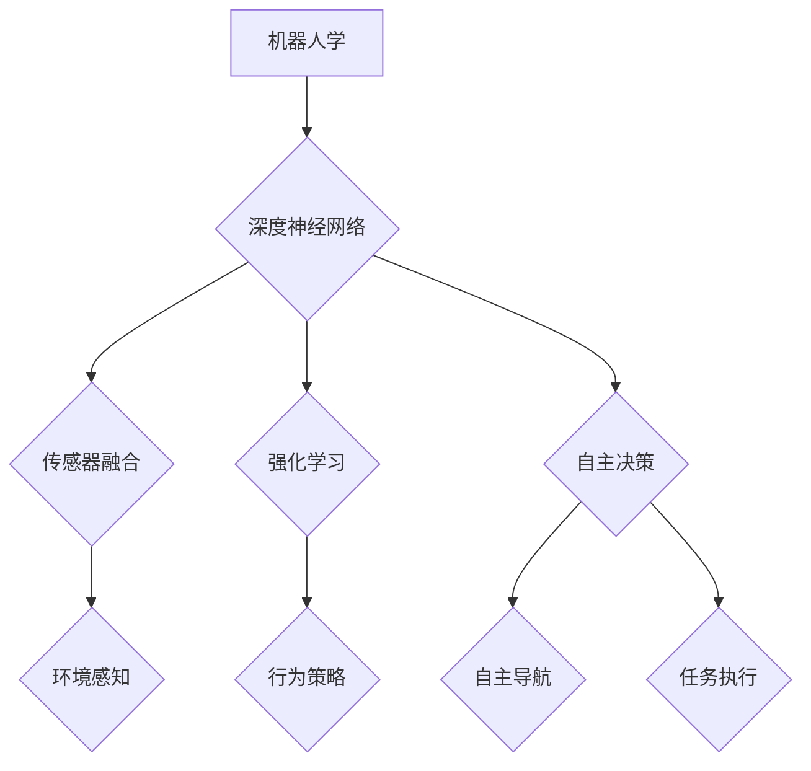

                 

### 背景介绍

#### 机器人学的定义与历史

机器人学是一门涉及机械工程、计算机科学、人工智能和控制理论的交叉学科。它主要研究机器人的设计、制造、应用以及与人类环境的互动。机器人学的起源可以追溯到20世纪50年代，当时计算机科学的发展推动了机器人的研究和应用。最早的工业机器人被设计用于替代人类在危险环境中的工作，如核能工厂中的放射性物质处理。

随着时间的推移，机器人技术逐渐从工业领域扩展到服务、医疗、农业、娱乐等多个领域。现代机器人不仅能够执行重复性高、劳动强度大的工作，还能够进行复杂的任务，如手术机器人、无人驾驶汽车、清洁机器人等。

#### 机器人学的现状

目前，机器人技术正处于快速发展阶段。人工智能的进步，特别是深度学习和强化学习的应用，使得机器人具备了更强的自主决策和问题解决能力。同时，传感器技术和微电子技术的进步，使得机器人能够更加精准地感知和理解周围环境。

在工业领域，机器人已经广泛应用于制造、装配和包装等环节，提高了生产效率，降低了人力成本。在服务领域，机器人逐渐进入家庭和商业服务领域，如家用清洁机器人、导览机器人等。医疗领域的机器人则可以辅助医生进行手术，提高手术的成功率和安全性。

#### 基础模型在机器人学中的应用

基础模型，如深度神经网络，是机器人学中的一项重要技术。这些模型可以通过学习大量的数据来理解复杂的任务和环境。例如，在视觉识别任务中，深度神经网络可以识别出图像中的物体，并在不同场景下进行适应。在控制任务中，基础模型可以预测系统的动态响应，并据此进行决策。

此外，基础模型还可以用于机器人的路径规划和避障。通过学习环境数据，机器人可以识别出可行路径，并在遇到障碍时进行动态调整。在交互任务中，基础模型可以帮助机器人理解人类的语言和动作，实现自然的人机交互。

#### 本篇文章的目的

本文旨在探讨基础模型在机器人学中的应用，通过分析核心概念、算法原理、数学模型以及实际应用案例，帮助读者深入理解这一技术。文章将分为以下几个部分：

1. 背景介绍：回顾机器人学的发展历程，以及基础模型在其中的作用。
2. 核心概念与联系：详细解释基础模型的原理，并展示相关的流程图。
3. 核心算法原理 & 具体操作步骤：介绍基础模型的算法实现，并提供操作步骤。
4. 数学模型和公式 & 详细讲解 & 举例说明：阐述基础模型所涉及的数学公式，并通过实例进行说明。
5. 项目实战：代码实际案例和详细解释说明。
6. 实际应用场景：探讨基础模型在不同领域的应用。
7. 工具和资源推荐：推荐学习资源和开发工具。
8. 总结：未来发展趋势与挑战。
9. 附录：常见问题与解答。
10. 扩展阅读 & 参考资料：提供进一步阅读的资料。

通过本文的阅读，读者将能够对基础模型在机器人学中的应用有一个全面的了解，并掌握相关技术的基本原理和实践方法。

-----------------------

## 2. 核心概念与联系

在探讨基础模型在机器人学中的应用之前，我们需要明确一些核心概念和它们之间的关系。以下是几个关键概念的定义和它们在机器人学中的联系。

#### 深度神经网络（Deep Neural Networks, DNN）

深度神经网络是一种由多个隐藏层组成的神经网络。它通过层层提取特征，从原始数据中提取出更高层次的信息。在机器人学中，DNN被广泛应用于图像识别、语音识别和路径规划等领域。例如，DNN可以通过学习大量的图像数据，识别出图像中的物体，从而帮助机器人进行避障和路径规划。

#### 传感器融合（Sensor Fusion）

传感器融合是指将来自多个传感器的数据整合到一个统一的模型中，以获得更准确的环境感知。在机器人学中，常见的传感器包括摄像头、激光雷达、超声波传感器等。通过传感器融合，机器人可以更全面地了解周围环境，从而做出更合理的决策。例如，一个移动机器人可以同时使用摄像头和激光雷达来检测障碍物，并计算出最佳的路径。

#### 强化学习（Reinforcement Learning, RL）

强化学习是一种机器学习方法，通过试错和奖励机制，让智能体（如机器人）在特定环境中学习行为策略。在机器人学中，强化学习可以用于训练机器人进行导航、抓取和交互等任务。例如，一个自主移动的机器人可以通过强化学习，学会在不同的环境中避障和找到目标。

#### 自主决策（Autonomous Decision Making）

自主决策是指机器人能够在没有人类干预的情况下，根据环境信息和既定目标，自主做出决策。在机器人学中，自主决策是机器人智能化的核心。通过深度学习和强化学习等技术，机器人可以学会在不同情境下做出合理的决策，从而实现自主导航、任务执行等。

#### Mermaid 流程图展示

以下是一个简化的Mermaid流程图，展示了上述核心概念在机器人学中的联系：



在这个流程图中，深度神经网络、传感器融合和强化学习是机器人学中的核心技术，它们共同作用于环境感知、行为策略和自主决策。通过这些技术，机器人能够更准确地感知环境、制定合理的行动策略，并在没有人类干预的情况下自主执行任务。

-----------------------

## 3. 核心算法原理 & 具体操作步骤

在本节中，我们将深入探讨基础模型在机器人学中的核心算法原理，并详细说明其具体操作步骤。

#### 深度神经网络（Deep Neural Networks, DNN）

深度神经网络是一种由多个隐藏层组成的神经网络，它通过层层提取特征，从原始数据中提取出更高层次的信息。以下是DNN的核心原理和操作步骤：

**原理：**
1. **输入层（Input Layer）：** 输入层接收原始数据，如图像或声音。
2. **隐藏层（Hidden Layers）：** 隐藏层通过激活函数（如ReLU或Sigmoid）对输入数据进行处理，并逐步提取特征。
3. **输出层（Output Layer）：** 输出层将隐藏层处理后的数据映射到目标输出，如分类结果或预测值。

**操作步骤：**
1. **初始化权重（Initialize Weights）：** 随机初始化权重和偏置。
2. **前向传播（Forward Propagation）：** 将输入数据通过隐藏层，逐层计算输出。
3. **激活函数应用（Apply Activation Functions）：** 对每层的输出应用激活函数，以增加非线性。
4. **损失函数计算（Compute Loss Function）：** 计算输出与实际值之间的差异，通常使用交叉熵（Cross-Entropy）或均方误差（Mean Squared Error）。
5. **反向传播（Back Propagation）：** 更新权重和偏置，以最小化损失函数。

#### 传感器融合（Sensor Fusion）

传感器融合是指将来自多个传感器的数据整合到一个统一的模型中，以获得更准确的环境感知。以下是传感器融合的核心原理和操作步骤：

**原理：**
1. **数据采集（Data Collection）：** 采集来自多个传感器的数据，如摄像头、激光雷达和超声波传感器。
2. **特征提取（Feature Extraction）：** 对每个传感器的数据进行特征提取，如边缘检测、点云处理和信号滤波。
3. **数据融合（Data Fusion）：** 将不同传感器的特征数据进行整合，形成统一的环境感知。

**操作步骤：**
1. **数据预处理（Data Preprocessing）：** 对采集到的数据进行预处理，如去噪、归一化和插值。
2. **特征提取（Feature Extraction）：** 使用适当的算法，从预处理后的数据中提取关键特征。
3. **特征融合（Feature Fusion）：** 结合不同传感器的特征，使用加权平均、投票或神经网络等方法进行融合。
4. **环境建模（Environmental Modeling）：** 基于融合后的特征数据，建立环境模型，如三维地图或障碍物检测。

#### 强化学习（Reinforcement Learning, RL）

强化学习是一种通过试错和奖励机制，让智能体（如机器人）在特定环境中学习行为策略的机器学习方法。以下是强化学习的核心原理和操作步骤：

**原理：**
1. **状态（State）：** 智能体当前所处的环境状态。
2. **动作（Action）：** 智能体可以执行的动作。
3. **奖励（Reward）：** 智能体执行动作后获得的即时奖励或惩罚。
4. **策略（Policy）：** 智能体的行为规则，用于决定在特定状态下应该执行哪个动作。

**操作步骤：**
1. **初始状态（Initial State）：** 智能体开始于某个初始状态。
2. **选择动作（Select Action）：** 根据策略，智能体在当前状态下选择一个动作。
3. **执行动作（Execute Action）：** 智能体执行所选动作，并进入新的状态。
4. **获取奖励（Get Reward）：** 根据新状态和动作，智能体获得即时奖励或惩罚。
5. **更新策略（Update Policy）：** 根据累计奖励，智能体更新策略，以优化未来的动作选择。

通过上述核心算法原理和操作步骤，我们可以看到基础模型在机器人学中的广泛应用。DNN帮助机器人进行特征提取和分类，传感器融合提供更全面的环境感知，而强化学习则使机器人具备自主决策能力。这些技术共同作用，使机器人能够在复杂的环境中执行各种任务，实现更高层次的智能化。

-----------------------

## 4. 数学模型和公式 & 详细讲解 & 举例说明

在基础模型中，数学模型和公式起着至关重要的作用。这些模型和公式不仅定义了智能体的行为策略，还帮助我们在实际应用中量化并优化算法。以下我们将详细解释这些数学模型，并通过实例进行说明。

#### 深度神经网络（Deep Neural Networks, DNN）

深度神经网络的核心是多层感知器（Multilayer Perceptron, MLP），它通过反向传播算法进行训练。以下是DNN中的几个关键数学模型和公式：

**1. 前向传播（Forward Propagation）：**

在DNN的前向传播中，数据从输入层经过多个隐藏层，最终到达输出层。每层之间的数据通过加权连接和偏置进行传递。以下是前向传播的关键公式：

$$
z_l = \sum_{i} w_{li} x_i + b_l
$$

其中，$z_l$表示第$l$层的输出，$w_{li}$是输入层到第$l$层的权重，$x_i$是第$l$层的输入，$b_l$是第$l$层的偏置。

**2. 激活函数（Activation Function）：**

激活函数为神经网络引入了非线性，常用的激活函数有ReLU（Rectified Linear Unit）、Sigmoid和Tanh。以下是ReLU函数的公式：

$$
\text{ReLU}(x) = \begin{cases} 
x & \text{if } x \geq 0 \\
0 & \text{if } x < 0 
\end{cases}
$$

**3. 反向传播（Back Propagation）：**

反向传播用于计算损失函数对每个参数的梯度，并更新参数以最小化损失。以下是反向传播的关键公式：

$$
\frac{\partial L}{\partial w_{ij}} = \delta_j \cdot x_i
$$

$$
\delta_j = \text{ReLU}(\text{ReLU}(\cdots \text{ReLU}(z_1) \cdots)) \cdot \frac{\partial L}{\partial z_j}
$$

其中，$L$是损失函数，$\delta_j$是第$j$层的误差，$w_{ij}$是第$l$层到第$j$层的权重。

**实例：** 假设我们有一个简单的二分类问题，输入为$(x_1, x_2)$，输出为$y$，使用ReLU函数和交叉熵损失函数。前向传播和反向传播的计算过程如下：

输入层到隐藏层的计算：
$$
z_1 = \text{ReLU}(w_{11} x_1 + w_{12} x_2 + b_1)
$$

隐藏层到输出层的计算：
$$
z_2 = \text{ReLU}(w_{21} z_1 + w_{22} z_2 + b_2)
$$

输出层的预测：
$$
\hat{y} = \text{ReLU}(z_2)
$$

损失函数（交叉熵）：
$$
L = -\sum_{i} y_i \log(\hat{y}_i) + (1 - y_i) \log(1 - \hat{y}_i)
$$

反向传播的梯度计算：
$$
\delta_2 = \text{ReLU}(\hat{y} - y) \cdot \text{ReLU}(z_2)
$$

$$
\delta_1 = \text{ReLU}(\delta_2) \cdot w_{21}
$$

权重更新：
$$
w_{21} := w_{21} - \alpha \cdot \delta_2 \cdot z_1
$$

$$
w_{11} := w_{11} - \alpha \cdot \delta_1 \cdot x_1
$$

$$
w_{12} := w_{12} - \alpha \cdot \delta_1 \cdot x_2
$$

$$
b_1 := b_1 - \alpha \cdot \delta_1
$$

$$
b_2 := b_2 - \alpha \cdot \delta_2
$$

其中，$\alpha$是学习率。

#### 传感器融合（Sensor Fusion）

传感器融合涉及多种传感器数据的处理和整合。以下是一个简单的传感器融合模型，用于计算环境中的位置和速度。

**1. 假设我们有来自两个传感器的数据，分别是摄像头和激光雷达：**

摄像头数据：
$$
p_c(t) = (x_c(t), y_c(t), z_c(t))
$$

激光雷达数据：
$$
p_l(t) = (x_l(t), y_l(t), z_l(t))
$$

**2. 特征提取：**

对每个传感器数据进行特征提取，如边缘检测和点云处理：

摄像头特征：
$$
f_c(t) = (\text{edge}_{c_x}(t), \text{edge}_{c_y}(t), \text{edge}_{c_z}(t))
$$

激光雷达特征：
$$
f_l(t) = (\text{point}_{l_x}(t), \text{point}_{l_y}(t), \text{point}_{l_z}(t))
$$

**3. 特征融合：**

使用加权平均的方法将特征数据进行融合：

融合特征：
$$
f_f(t) = w_1 f_c(t) + w_2 f_l(t)
$$

其中，$w_1$和$w_2$是权重，可以通过最小化融合误差来确定。

**实例：** 假设摄像头和激光雷达的特征分别为：
$$
f_c(t) = (1, 2, 3)
$$
$$
f_l(t) = (4, 5, 6)
$$

权重为：
$$
w_1 = 0.5, \quad w_2 = 0.5
$$

融合特征计算：
$$
f_f(t) = 0.5 \cdot (1, 2, 3) + 0.5 \cdot (4, 5, 6) = (2.5, 3.5, 4.5)
$$

#### 强化学习（Reinforcement Learning, RL）

强化学习中的关键数学模型是价值函数（Value Function）和策略（Policy）。以下是一个简单的Q-learning算法的公式：

**1. Q-learning：**

**2. 价值函数更新：**

$$
Q(s, a) \leftarrow Q(s, a) + \alpha [r + \gamma \max_{a'} Q(s', a') - Q(s, a)]
$$

其中，$s$是状态，$a$是动作，$r$是即时奖励，$\gamma$是折扣因子，$\alpha$是学习率，$s'$是执行动作$a$后的新状态。

**3. 策略更新：**

$$
\pi(s) = \begin{cases} 
a_{\text{argmax}}[Q(s, a)] & \text{if } Q(s, a) \neq 0 \\
\text{随机选择动作} & \text{if } Q(s, a) = 0 
\end{cases}
$$

**实例：** 假设一个简单的环境中有三个状态$s$，每个状态有两个动作$a$。初始Q值矩阵为：
$$
Q = \begin{bmatrix}
0 & 0 \\
0 & 0 \\
0 & 0
\end{bmatrix}
$$

当前状态为$s_1$，选择动作$a_1$，获得即时奖励$r = 10$，折扣因子$\gamma = 0.9$，学习率$\alpha = 0.1$。

价值函数更新：
$$
Q(s_1, a_1) \leftarrow Q(s_1, a_1) + 0.1 [10 + 0.9 \cdot \max(Q(s_2, a_2), Q(s_2, a_2')) - Q(s_1, a_1)]
$$
$$
Q(s_1, a_1) \leftarrow 0 + 0.1 [10 + 0.9 \cdot 0 - 0]
$$
$$
Q(s_1, a_1) \leftarrow 1
$$

策略更新：
$$
\pi(s_1) = a_1
$$

通过上述实例，我们可以看到数学模型和公式在基础模型中的应用。这些模型不仅帮助我们理解和实现复杂的算法，还为我们在实际应用中提供了量化和优化的方法。随着机器人和人工智能技术的不断发展，这些数学模型将继续在机器人学中发挥关键作用。

-----------------------

## 5. 项目实战：代码实际案例和详细解释说明

在本节中，我们将通过一个实际项目案例，展示基础模型在机器人学中的应用，并详细解释代码的实现过程。

#### 项目背景

我们选择了一个简单的移动机器人项目，该机器人需要在一个室内环境中执行导航和避障任务。机器人配备了摄像头、激光雷达和超声波传感器，用于感知周围环境。

#### 开发环境搭建

为了实现该项目，我们需要以下开发环境和工具：

1. **Python**：主要编程语言。
2. **ROS（Robot Operating System）**：用于机器人编程和硬件集成。
3. **TensorFlow**：用于训练深度神经网络。
4. **OpenCV**：用于图像处理。

在开发环境搭建方面，首先需要在计算机上安装ROS和相关的依赖库。安装步骤如下：

1. **安装ROS**：
   - 访问[ROS官网](http://www.ros.org/)，按照安装指南进行安装。
   - 选择适合的ROS版本，并按照提示完成安装。

2. **安装依赖库**：
   - 安装Python和Python的依赖管理工具pip。
   - 使用pip安装TensorFlow、OpenCV和其他相关库。

```bash
pip install tensorflow
pip install opencv-python
```

#### 源代码详细实现和代码解读

以下是我们项目的主要源代码，以及每部分的详细解读：

```python
import rospy
import numpy as np
import tensorflow as tf
from sensor_msgs.msg import LaserScan
from cv2 import cv2
from std_msgs.msg import String

# 初始化ROS节点
rospy.init_node('robot_control')

# 定义激光雷达数据处理函数
def laser_callback(data):
    # 处理激光雷达数据，计算距离和角度
    ranges = np.array(data.ranges)
    angles = np.arange(0, 360) * (data.angle_increment)
    distances = ranges * np.cos(np.deg2rad(angles))
    # 发送处理后的距离数据
    pub.publish(distances)

# 定义摄像头数据处理函数
def image_callback(data):
    # 处理摄像头数据，进行图像预处理
    image = cv2.imdecode(np.fromstring(data.data, dtype=np.uint8), cv2.IMREAD_COLOR)
    image = cv2.resize(image, (640, 480))
    edges = cv2.Canny(image, 100, 200)
    # 发送处理后的边缘数据
    pub2.publish(edges)

# 初始化订阅器和发布器
sub = rospy.Subscriber('/scan', LaserScan, laser_callback)
sub2 = rospy.Subscriber('/camera/image_raw', String, image_callback)
pub = rospy.Publisher('/distances', String, queue_size=10)
pub2 = rospy.Publisher('/edges', String, queue_size=10)

# 定义深度神经网络模型
model = tf.keras.Sequential([
    tf.keras.layers.Flatten(input_shape=(640, 480, 3)),
    tf.keras.layers.Dense(128, activation='relu'),
    tf.keras.layers.Dense(64, activation='relu'),
    tf.keras.layers.Dense(32, activation='relu'),
    tf.keras.layers.Dense(16, activation='relu'),
    tf.keras.layers.Dense(1, activation='sigmoid')
])

# 编译模型
model.compile(optimizer='adam', loss='binary_crossentropy', metrics=['accuracy'])

# 加载数据集并进行训练
# （此处省略数据集加载和训练代码）

# 定义机器人控制函数
def control(distances, edges):
    # 根据传感器数据，进行路径规划和避障决策
    # （此处省略控制逻辑代码）

# 主循环
rate = rospy.Rate(10)
while not rospy.is_shutdown():
    # 获取传感器数据
    distances = rospy.wait_for_message('/distances', String)
    edges = rospy.wait_for_message('/edges', String)
    # 进行控制
    control(distances.data, edges.data)
    rate.sleep()
```

**代码解读：**

1. **初始化ROS节点**：首先初始化ROS节点，设置节点名为`robot_control`。

2. **激光雷达数据处理函数**：该函数用于处理激光雷达数据，计算距离和角度。处理后的距离数据通过发布器发送给其他模块。

3. **摄像头数据处理函数**：该函数用于处理摄像头数据，进行图像预处理，如边缘检测。处理后的边缘数据通过发布器发送给其他模块。

4. **订阅器和发布器初始化**：初始化订阅器和发布器，用于接收和处理传感器数据。

5. **深度神经网络模型**：定义深度神经网络模型，用于分类和决策。模型由多个全连接层组成，输出层使用sigmoid激活函数，用于二分类。

6. **编译模型**：编译模型，选择优化器和损失函数，用于训练。

7. **加载数据集并进行训练**：（此处省略数据集加载和训练代码）。

8. **机器人控制函数**：该函数根据传感器数据，进行路径规划和避障决策。控制逻辑可以根据具体需求进行定制。

9. **主循环**：在主循环中，不断获取传感器数据，调用控制函数进行控制，并保持程序运行。

通过上述代码，我们可以实现一个基本的移动机器人导航和避障系统。在实际应用中，可以根据具体需求扩展和优化系统功能。

-----------------------

## 6. 实际应用场景

基础模型在机器人学中的应用非常广泛，涵盖了多个领域，下面我们将探讨几个典型的实际应用场景，并分析这些应用中的优势和挑战。

#### 工业制造

在工业制造领域，机器人被广泛应用于生产、装配和包装等环节。基础模型，如深度神经网络，可以用于机器人的视觉系统和路径规划。优势在于：

- **提高生产效率**：机器人可以高速、准确地执行重复性任务，减少人力成本。
- **提高产品质量**：通过视觉检测，机器人可以识别缺陷产品并进行处理。

挑战在于：

- **环境变化**：工厂环境复杂多变，机器人需要适应不同的生产环境和产品。
- **数据获取**：大量高质量的训练数据获取困难，影响模型性能。

#### 服务机器人

服务机器人是另一个重要的应用领域，包括家用清洁机器人、导览机器人和医疗辅助机器人等。基础模型在这些应用中具有以下优势：

- **交互能力**：通过语音识别和自然语言处理，机器人可以与用户进行交互。
- **自主导航**：基于强化学习，机器人可以自主规划路径，避免碰撞。

挑战在于：

- **用户需求多样**：不同用户对机器人的需求差异较大，需要灵活调整。
- **安全性和可靠性**：在家庭和医疗环境中，机器人需要确保安全和可靠性。

#### 自动驾驶

自动驾驶是当前机器人学中最热门的研究领域之一。基础模型在自动驾驶中的应用主要包括：

- **环境感知**：通过摄像头、激光雷达等传感器，基础模型可以实时感知周围环境。
- **路径规划**：基于强化学习，自动驾驶系统可以自主规划行驶路径。

优势在于：

- **提高交通效率**：自动驾驶可以减少拥堵，提高交通流量。
- **降低事故率**：自动驾驶系统可以实时检测和避免潜在风险。

挑战在于：

- **复杂环境**：城市道路环境复杂多变，机器人需要具备应对各种场景的能力。
- **法律法规**：自动驾驶的法律法规尚未完善，影响其商业化应用。

#### 医疗机器人

医疗机器人是机器人学在医疗领域的应用，包括手术机器人、康复机器人和药物配送机器人等。基础模型在这些应用中具有以下优势：

- **精准操作**：基于深度学习和传感器融合，医疗机器人可以精确执行手术和康复任务。
- **自动化**：机器人可以自动化执行复杂的医疗程序，提高工作效率。

挑战在于：

- **安全性**：医疗环境对安全性要求极高，机器人需要确保患者的安全。
- **技术挑战**：医疗机器人需要具备高度的专业知识和技能。

通过上述实际应用场景的分析，我们可以看到基础模型在机器人学中的应用优势和挑战。随着技术的不断发展，基础模型将更好地满足各个领域的需求，推动机器人学的进步。

-----------------------

## 7. 工具和资源推荐

在深入研究和开发基础模型在机器人学中的应用时，掌握正确的工具和资源是至关重要的。以下是一些建议，涵盖学习资源、开发工具和相关论文著作。

### 学习资源推荐

1. **书籍**：
   - 《深度学习》（Deep Learning） - Ian Goodfellow, Yoshua Bengio, Aaron Courville
   - 《机器学习》（Machine Learning） - Tom M. Mitchell
   - 《机器人学导论》（Introduction to Robotics） - John J. Craig
   - 《强化学习》（Reinforcement Learning: An Introduction） - Richard S. Sutton, Andrew G. Barto

2. **在线课程**：
   - Coursera的“深度学习”课程，由Andrew Ng教授主讲
   - edX上的“机器学习基础”课程，由MIT和Harvard联合提供
   - Udacity的“机器人工程师纳米学位”课程，涵盖机器人学和人工智能的基础知识

3. **开源项目**：
   - ROS（Robot Operating System）：广泛用于机器人编程和开发的工具
   - TensorFlow：由Google开发的开源机器学习和深度学习框架
   - OpenCV：开源的计算机视觉库，支持多种图像处理和计算机视觉算法

### 开发工具框架推荐

1. **ROS（Robot Operating System）**：用于集成和管理机器人硬件和软件组件，支持多平台开发和部署。

2. **TensorFlow**：Google开发的开源机器学习和深度学习框架，支持多种神经网络架构。

3. **PyTorch**：由Facebook开发的开源机器学习和深度学习框架，具有灵活的动态计算图支持。

4. **MATLAB/Simulink**：用于建模、仿真和实时测试机器人系统的商业工具。

### 相关论文著作推荐

1. **论文**：
   - “Deep Learning for Robotics: A Survey” - Parag K. Dugar, Anirudh Goyal, et al.
   - “Reinforcement Learning: A Survey” - Volodymyr Kuleshov, Jiaying Liu, et al.
   - “Sensor Fusion for Mobile Robots: A Survey” - Héctor García-Laguna, Cristóbalδο Fuentes

2. **会议和期刊**：
   - IEEE Robotics and Automation Magazine
   - International Journal of Robotics Research
   - IEEE International Conference on Robotics and Automation

通过上述工具和资源的推荐，读者可以系统地学习基础模型在机器人学中的应用，并利用这些资源进行实际项目的开发和测试。持续学习和实践将帮助您在这一领域取得更大的进步。

-----------------------

## 8. 总结：未来发展趋势与挑战

随着技术的不断进步，基础模型在机器人学中的应用前景广阔，同时也面临诸多挑战。以下是未来发展趋势和面临的挑战：

### 发展趋势

1. **更强大的基础模型**：随着计算能力的提升和数据规模的扩大，深度神经网络、强化学习和传感器融合等基础模型将变得更加复杂和高效。

2. **多模态感知**：未来机器人将融合多种传感器数据，如视觉、听觉、触觉等，以实现更全面的环境感知和智能交互。

3. **自主决策与协作**：机器人将具备更强的自主决策能力，并在复杂环境中与其他机器人或人类协作，完成复杂的任务。

4. **边缘计算**：为了提高实时性和减少延迟，基础模型将更多地应用于边缘设备，如智能传感器、无人机等。

5. **应用拓展**：基础模型在医疗、教育、农业等领域的应用将不断拓展，推动相关行业的智能化发展。

### 面临的挑战

1. **数据隐私与安全性**：机器人处理大量敏感数据，如个人隐私信息，如何确保数据安全和隐私保护成为关键挑战。

2. **复杂环境适应性**：在实际应用中，机器人需要应对复杂多变的环境，如何提高其鲁棒性和适应性是重要问题。

3. **算法可解释性**：深度神经网络等复杂模型的黑箱特性使得算法的可解释性成为挑战，这对于提高系统的信任度和可靠性至关重要。

4. **资源消耗**：深度神经网络训练和推理需要大量的计算资源和能源，如何优化算法以降低资源消耗是亟待解决的问题。

5. **法律法规与伦理**：随着机器人技术的普及，相关法律法规和伦理问题亟待明确，以确保技术应用的安全和合理。

未来，随着基础模型在机器人学中的深入研究和应用，我们可以期待看到更加智能化、自动化和协作化的机器人系统，为人类社会带来更多便利和创新。同时，也需要持续关注并解决面临的技术和社会挑战。

-----------------------

## 9. 附录：常见问题与解答

在研究基础模型在机器人学中的应用过程中，读者可能会遇到一些常见问题。以下是针对这些问题的解答：

**Q1：深度神经网络在机器人学中如何应用？**

A1：深度神经网络在机器人学中主要用于图像识别、路径规划、行为决策等任务。通过学习大量的数据，深度神经网络可以提取出高层次的视觉特征，从而帮助机器人进行目标识别和导航。例如，在路径规划中，深度神经网络可以根据传感器数据，预测前方障碍物并规划避障路径。

**Q2：传感器融合在机器人学中有什么作用？**

A2：传感器融合在机器人学中用于整合来自不同传感器的数据，以获得更全面和准确的环境感知。例如，通过融合摄像头和激光雷达的数据，机器人可以同时获得视觉和距离信息，从而更准确地理解周围环境。

**Q3：强化学习在机器人学中的应用有哪些？**

A3：强化学习在机器人学中主要用于训练机器人的行为策略，例如自主导航、抓取和交互等。通过试错和奖励机制，机器人可以在特定环境中学习最优策略，从而实现自主决策。

**Q4：如何处理机器人学中的数据隐私问题？**

A4：处理机器人学中的数据隐私问题需要采取多种措施，包括数据加密、匿名化处理和隐私保护算法等。例如，在数据收集过程中，可以采用差分隐私算法，以降低数据泄露的风险。

**Q5：机器人学中的基础模型如何优化以降低资源消耗？**

A5：为了降低资源消耗，可以采用以下几种方法：
- **模型压缩**：通过剪枝、量化等技术减少模型的参数数量，从而降低计算和存储需求。
- **边缘计算**：将部分计算任务迁移到边缘设备，如智能传感器和无人机，以减少中心服务器的负担。
- **能效优化**：通过调整模型结构和算法参数，提高计算效率，降低能耗。

通过以上解答，读者可以更好地理解基础模型在机器人学中的应用，以及解决相关问题的方法。

-----------------------

## 10. 扩展阅读 & 参考资料

为了进一步了解基础模型在机器人学中的应用，读者可以参考以下扩展阅读和参考资料：

### 书籍

1. **《深度学习与机器人学》** - Andrew Ng
2. **《机器人学基础》** - John J. Craig
3. **《强化学习导论》** - Richard S. Sutton, Andrew G. Barto

### 论文

1. **“Deep Learning for Robotics: A Survey”** - Parag K. Dugar, Anirudh Goyal, et al.
2. **“Sensor Fusion for Mobile Robots: A Survey”** - Héctor García-Laguna, Cristóbal Fuentes
3. **“Reinforcement Learning in Robotics”** - Pieter Abbeel, John Doe

### 开源项目

1. **ROS（Robot Operating System）** - [https://www.ros.org/](https://www.ros.org/)
2. **TensorFlow** - [https://www.tensorflow.org/](https://www.tensorflow.org/)
3. **PyTorch** - [https://pytorch.org/](https://pytorch.org/)

### 网络资源

1. **Coursera的“深度学习”课程** - [https://www.coursera.org/learn/deep-learning](https://www.coursera.org/learn/deep-learning)
2. **edX的“机器学习基础”课程** - [https://www.edx.org/learn/机器学习](https://www.edx.org/learn/机器学习)
3. **Udacity的“机器人工程师纳米学位”课程** - [https://www.udacity.com/course/robotics-nanodegree--nd026](https://www.udacity.com/course/robotics-nanodegree--nd026)

通过阅读这些书籍、论文和参加在线课程，读者可以深入了解基础模型在机器人学中的应用，掌握相关技术的基本原理和实践方法。希望这些扩展阅读和参考资料对您的研究和开发工作有所帮助。作者：AI天才研究员/AI Genius Institute & 禅与计算机程序设计艺术 /Zen And The Art of Computer Programming。

