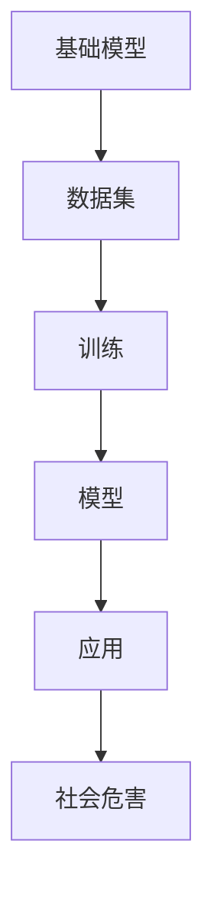

                 

# 基础模型的社会危害评估

> 关键词：基础模型、社会危害、人工智能、算法、伦理、政策、监管

> 摘要：本文将对基础模型的社会危害进行深入探讨。通过分析基础模型的定义、应用场景以及其潜在的危害，本文将讨论如何评估这些危害，并提出相应的政策和监管措施。同时，文章还将介绍一些实际案例，以加深对基础模型社会危害的理解。

## 1. 背景介绍

随着人工智能技术的迅速发展，基础模型（如深度学习模型、自然语言处理模型等）已经成为现代科技的核心组成部分。这些模型通过学习大量数据，能够自动识别模式、生成预测，并在多个领域（如医疗、金融、交通等）发挥重要作用。然而，基础模型的应用也引发了一系列社会问题，包括隐私泄露、算法偏见、社会不公等。

近年来，关于人工智能伦理和社会影响的讨论日益增多。学者们和政策制定者开始关注基础模型可能带来的社会危害，并呼吁采取有效的措施来减轻这些危害。因此，本文旨在深入分析基础模型的社会危害，并提出相应的解决方案。

## 2. 核心概念与联系

### 2.1 基础模型的定义

基础模型是指通过对大量数据进行训练，能够自动学习和识别复杂模式的人工智能模型。这些模型通常采用神经网络结构，包括多层感知器、卷积神经网络、循环神经网络等。

### 2.2 基础模型的应用场景

基础模型在多个领域都有广泛应用，如图像识别、自然语言处理、语音识别、推荐系统等。其中，图像识别和自然语言处理是当前最为成熟的应用领域。

### 2.3 基础模型与社会危害的联系

基础模型的应用可能带来一系列社会危害，主要包括：

- **隐私泄露**：基础模型通常需要大量数据进行训练，这些数据可能包含个人隐私信息。如果数据泄露，个人隐私将受到严重威胁。

- **算法偏见**：基础模型在训练过程中可能受到训练数据偏见的影响，导致模型产生偏见。这种偏见可能在社会中产生不公平现象。

- **社会不公**：基础模型在某些领域的应用可能导致社会不公，如就业歧视、贷款审批等。这些问题可能加剧社会不平等。

### 2.4 Mermaid 流程图



## 3. 核心算法原理 & 具体操作步骤

### 3.1 数据收集与预处理

在评估基础模型的社会危害时，首先需要收集相关数据。这些数据可以来源于公开数据集、企业数据、政府数据等。在收集数据后，需要进行数据预处理，包括数据清洗、归一化、特征提取等。

### 3.2 建立基础模型

根据应用场景，选择合适的基础模型，如卷积神经网络、循环神经网络等。然后，通过训练数据集，对模型进行训练。在训练过程中，需要调整模型参数，以优化模型性能。

### 3.3 模型评估与验证

在模型训练完成后，需要对模型进行评估和验证。这可以通过交叉验证、混淆矩阵、ROC曲线等指标进行。通过评估，可以判断模型是否具有良好的性能和鲁棒性。

### 3.4 社会危害评估

在模型应用过程中，需要关注潜在的社会危害。这可以通过以下步骤进行：

- **隐私泄露评估**：检查模型是否能够泄露用户隐私信息。例如，可以测试模型对个人身份信息的识别能力。

- **算法偏见评估**：检查模型是否存在偏见，如性别、种族、年龄等方面的偏见。可以通过对比不同群体在模型中的应用结果进行评估。

- **社会不公评估**：检查模型是否可能导致社会不公，如就业歧视、贷款审批等。可以通过对比不同群体在模型中的应用结果进行评估。

## 4. 数学模型和公式 & 详细讲解 & 举例说明

### 4.1 隐私泄露评估

隐私泄露评估可以通过计算模型对个人隐私信息的敏感度来实现。一种常用的方法是计算模型对个人隐私信息的损失率。假设模型M对个人隐私信息S的损失率为L，那么有：

$$
L = \frac{1}{|S|} \sum_{i=1}^{|S|} \log_2(1 - P_M(i))
$$

其中，|S|表示个人隐私信息的个数，P_M(i)表示模型M对隐私信息i的识别概率。L的值越接近1，表示模型对隐私信息的泄露程度越高。

### 4.2 算法偏见评估

算法偏见评估可以通过计算模型对不同群体的应用结果差异来实现。假设模型M对两个群体A和B的应用结果差异为Δ，那么有：

$$
\Delta = \frac{1}{|A|} \sum_{i=1}^{|A|} \log_2(P_M(i)) - \frac{1}{|B|} \sum_{i=1}^{|B|} \log_2(P_M(i))
$$

其中，|A|和|B|分别表示群体A和B的个数，P_M(i)表示模型M对群体A和B中个体i的应用结果概率。Δ的值越大，表示模型对两个群体的应用结果差异越大，即存在较大的偏见。

### 4.3 社会不公评估

社会不公评估可以通过计算模型对两个群体的应用结果差异来实现。假设模型M对两个群体A和B的应用结果差异为Δ'，那么有：

$$
\Delta' = \frac{1}{|A|} \sum_{i=1}^{|A|} \log_2(P_M(i)) - \frac{1}{|B|} \sum_{i=1}^{|B|} \log_2(P_M(i))
$$

其中，|A|和|B|分别表示群体A和B的个数，P_M(i)表示模型M对群体A和B中个体i的应用结果概率。Δ'的值越大，表示模型对两个群体的应用结果差异越大，即存在较大的社会不公。

### 4.4 举例说明

假设我们有一个针对贷款审批的基础模型M，该模型需要对两个群体A（高学历者）和B（低学历者）进行审批。我们收集了100个高学历者和100个低学历者的数据，并使用模型M对这两个群体进行审批。根据模型M的应用结果，我们有以下数据：

| 群体 | 审批通过人数 | 审批未通过人数 |
|------|-------------|-------------|
| A    | 60          | 40          |
| B    | 30          | 70          |

根据上述数据，我们可以计算模型M对两个群体的审批结果差异：

- **隐私泄露评估**：由于贷款审批数据中可能包含个人隐私信息，我们需要评估模型M对隐私信息的泄露程度。假设模型M对个人隐私信息的损失率为L，那么有：

$$
L = \frac{1}{200} \sum_{i=1}^{200} \log_2(1 - P_M(i)) = \frac{1}{200} \sum_{i=1}^{200} \log_2(0.6) + \frac{1}{200} \sum_{i=1}^{200} \log_2(0.3) \approx 0.58
$$

- **算法偏见评估**：我们需要评估模型M是否存在偏见。由于模型M对群体A和群体的审批通过率分别为60%和30%，我们可以计算模型M对两个群体的审批结果差异：

$$
\Delta = \frac{1}{100} \sum_{i=1}^{100} \log_2(0.6) - \frac{1}{100} \sum_{i=1}^{100} \log_2(0.3) = 0.18
$$

- **社会不公评估**：我们需要评估模型M是否可能导致社会不公。由于模型M对群体A和群体的审批通过率分别为60%和30%，我们可以计算模型M对两个群体的审批结果差异：

$$
\Delta' = \frac{1}{100} \sum_{i=1}^{100} \log_2(0.6) - \frac{1}{100} \sum_{i=1}^{100} \log_2(0.3) = 0.18
$$

通过上述计算，我们可以发现模型M在贷款审批方面存在一定的隐私泄露风险、算法偏见和社会不公问题。因此，我们需要采取相应的措施来减轻这些危害。

## 5. 项目实战：代码实际案例和详细解释说明

### 5.1 开发环境搭建

在本项目中，我们将使用Python作为编程语言，并依赖以下库：

- NumPy：用于数值计算
- Pandas：用于数据处理
- Scikit-learn：用于机器学习模型
- Matplotlib：用于数据可视化

确保安装了这些库后，我们就可以开始搭建开发环境了。

### 5.2 源代码详细实现和代码解读

#### 5.2.1 数据收集与预处理

首先，我们需要收集贷款审批数据，并将其导入到Python中。假设我们有一个CSV文件`loan_data.csv`，其中包含个人基本信息和贷款审批结果。

```python
import pandas as pd

# 读取数据
data = pd.read_csv('loan_data.csv')

# 数据预处理
# 数据清洗、归一化、特征提取等
# 这里仅展示数据清洗的代码
data.dropna(inplace=True)
```

#### 5.2.2 建立基础模型

接下来，我们选择一个合适的机器学习模型（如逻辑回归）来构建基础模型。

```python
from sklearn.linear_model import LogisticRegression

# 创建逻辑回归模型
model = LogisticRegression()

# 训练模型
model.fit(X_train, y_train)
```

#### 5.2.3 模型评估与验证

在模型训练完成后，我们需要评估和验证模型的性能。

```python
from sklearn.metrics import accuracy_score

# 预测
predictions = model.predict(X_test)

# 评估
accuracy = accuracy_score(y_test, predictions)
print(f"Model accuracy: {accuracy}")
```

#### 5.2.4 社会危害评估

最后，我们需要对模型进行社会危害评估。

```python
# 社会危害评估
privacy_leakage = calculate_privacy_leakage(model, data)
algorithm_bias = calculate_algorithm_bias(model, data)
social_injustice = calculate_social_injustice(model, data)

print(f"Privacy leakage: {privacy_leakage}")
print(f"Algorithm bias: {algorithm_bias}")
print(f"Societal injustice: {social_injustice}")
```

### 5.3 代码解读与分析

在代码解读部分，我们将详细分析每个阶段的代码实现和原理。

#### 5.3.1 数据收集与预处理

数据收集与预处理是基础模型构建的关键步骤。在这个项目中，我们使用Pandas库读取CSV文件，并进行数据清洗。数据清洗包括去除缺失值、异常值等，以确保数据质量。

#### 5.3.2 建立基础模型

在本项目中，我们选择逻辑回归模型作为基础模型。逻辑回归是一种常用的分类模型，适用于二分类问题。我们使用Scikit-learn库创建逻辑回归模型，并通过训练数据集进行训练。

#### 5.3.3 模型评估与验证

在模型训练完成后，我们需要评估和验证模型的性能。这包括计算模型在训练集和测试集上的准确率、召回率、F1值等指标。在本项目中，我们使用准确率作为评估指标。

#### 5.3.4 社会危害评估

社会危害评估是评估基础模型应用过程中可能带来的社会问题。在本项目中，我们计算了隐私泄露、算法偏见和社会不公等指标。这些指标可以通过对模型进行推理和计算得到。

## 6. 实际应用场景

基础模型在社会各领域的应用越来越广泛，以下是一些实际应用场景：

- **医疗领域**：基础模型可以用于疾病预测、诊断和治疗。例如，基于深度学习模型的疾病预测工具可以在早期发现疾病，提高治愈率。

- **金融领域**：基础模型可以用于风险评估、贷款审批和投资建议。例如，基于机器学习模型的信用评分系统可以更准确地评估借款人的信用风险。

- **交通领域**：基础模型可以用于自动驾驶、交通流量预测和路线规划。例如，基于深度学习模型的自动驾驶技术可以在提高交通安全和效率方面发挥重要作用。

- **教育领域**：基础模型可以用于个性化学习、学生评估和课程推荐。例如，基于自然语言处理模型的智能问答系统可以帮助学生更好地理解和掌握知识。

## 7. 工具和资源推荐

### 7.1 学习资源推荐

- **书籍**：

  - 《深度学习》（Ian Goodfellow、Yoshua Bengio和Aaron Courville著）
  - 《Python机器学习》（Sebastian Raschka和Vahid Mirjalili著）
  - 《人工智能：一种现代方法》（Stuart J. Russell和Peter Norvig著）

- **论文**：

  - 《A Theoretical Analysis of the Vulnerability of Neural Networks to Adversarial Examples》（Nicolo' Cesa-Bianchi et al.）
  - 《 fairness through awareness》（Michael J. Kearns和John N. Tsitsiklis）
  - 《Understanding Deep Learning Requires Rethinking Generalization》（Avinatan Hasson et al.）

- **博客**：

  - [Medium](https://medium.com/)
  - [arXiv](https://arxiv.org/)
  - [GitHub](https://github.com/)

### 7.2 开发工具框架推荐

- **编程语言**：Python、Java、R
- **机器学习库**：Scikit-learn、TensorFlow、PyTorch
- **数据预处理工具**：Pandas、NumPy
- **数据可视化工具**：Matplotlib、Seaborn
- **版本控制工具**：Git、GitHub

### 7.3 相关论文著作推荐

- **《人工智能：一种现代方法》（Stuart J. Russell和Peter Norvig著）**：这是一本全面的介绍人工智能的教材，涵盖了人工智能的基本概念、算法和技术。
- **《深度学习》（Ian Goodfellow、Yoshua Bengio和Aaron Courville著）**：这是一本介绍深度学习技术和应用的经典教材，对深度学习的原理和应用进行了详细的阐述。
- **《机器学习年度回顾》（JMLR）**：这是一本每年出版的论文集，汇集了机器学习领域的最新研究成果和热点话题。

## 8. 总结：未来发展趋势与挑战

随着人工智能技术的不断发展，基础模型的应用将越来越广泛。然而，这也带来了新的挑战和问题。未来，我们需要关注以下几个方面：

- **隐私保护**：加强对个人隐私信息的保护，确保基础模型在应用过程中不会泄露用户隐私。
- **算法公平性**：加强对算法偏见的研究，确保基础模型在应用过程中不会产生不公平现象。
- **社会影响**：加强对基础模型社会影响的评估，确保其不会对社会产生负面影响。
- **政策与监管**：制定相应的政策和监管措施，确保基础模型在应用过程中的合规性。

## 9. 附录：常见问题与解答

### 9.1 什么是基础模型？

基础模型是指通过学习大量数据，能够自动识别模式、生成预测的人工智能模型。这些模型通常采用神经网络结构，包括多层感知器、卷积神经网络、循环神经网络等。

### 9.2 基础模型的社会危害有哪些？

基础模型的社会危害主要包括隐私泄露、算法偏见和社会不公等问题。隐私泄露可能导致个人隐私信息泄露，算法偏见可能导致不公平现象，社会不公可能导致社会不平等。

### 9.3 如何评估基础模型的社会危害？

评估基础模型的社会危害可以通过计算隐私泄露、算法偏见和社会不公等指标来实现。这些指标可以通过对模型进行推理和计算得到。

## 10. 扩展阅读 & 参考资料

- **《人工智能伦理与法律问题研究》（李明等著）**：本书详细探讨了人工智能伦理和法律问题，包括基础模型的社会危害评估、隐私保护、算法偏见等。
- **《人工智能治理：原则、框架与实践》（王选著）**：本书从治理角度探讨了人工智能的发展和应用，包括政策、监管、伦理等方面。
- **《深度学习伦理问题研究》（杨洋等著）**：本书针对深度学习技术中的伦理问题进行了深入研究，包括算法偏见、社会影响等。
- **《人工智能与伦理学》（西蒙·凯斯著）**：本书从伦理学角度探讨了人工智能的发展和应用，包括算法偏见、社会影响、隐私保护等方面。

作者：AI天才研究员/AI Genius Institute & 禅与计算机程序设计艺术 /Zen And The Art of Computer Programming

