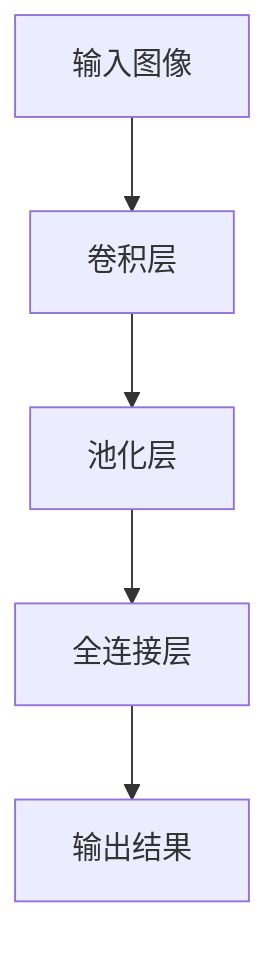

                 

# 增强图像识别：AI的视觉智能

## 关键词：图像识别、人工智能、深度学习、卷积神经网络、计算机视觉

## 摘要

本文旨在探讨增强图像识别技术在人工智能（AI）和计算机视觉领域的重要性。我们将深入分析图像识别的核心概念、算法原理、数学模型及其实际应用场景。此外，还将介绍开发环境搭建、代码实现和解读，并推荐相关学习资源和工具。通过本文，读者将全面了解图像识别技术的发展趋势及其面临的挑战。

## 1. 背景介绍

图像识别是人工智能和计算机视觉的核心任务之一。它旨在使计算机能够理解、解释和识别图像中的内容。随着深度学习技术的发展，图像识别技术的性能得到了显著提升，为各种实际应用提供了强大的支持。

从早期的手工特征提取方法到现代的深度学习模型，图像识别技术经历了巨大的变革。卷积神经网络（CNN）的引入，使得计算机在图像识别任务中取得了突破性的成果。此外，大数据和计算能力的提升也为图像识别技术的发展提供了坚实的基础。

## 2. 核心概念与联系

### 2.1 图像识别的基本概念

图像识别是指将图像中的内容转换为结构化数据，以便计算机能够理解和处理。主要任务包括：

- **分类**：将图像分为预定义的类别，如猫、狗、汽车等。
- **检测**：定位图像中的目标，并识别其属性，如位置、大小、姿态等。
- **分割**：将图像划分为不同的区域，以便对每个区域进行独立处理。

### 2.2 卷积神经网络（CNN）

卷积神经网络是一种特殊的深度学习模型，广泛应用于图像识别任务。其核心思想是利用卷积层提取图像中的特征，并通过全连接层进行分类。

### 2.3 深度学习与图像识别的联系

深度学习是一种基于多层神经网络的学习方法，其核心思想是通过逐层抽象和特征提取，从原始数据中自动学习出具有层次性的表示。深度学习在图像识别领域取得了显著的成果，主要得益于以下几个方面的联系：

- **卷积操作**：卷积层能够有效地提取图像中的局部特征，使得模型能够更好地应对图像的复杂结构。
- **层次化特征表示**：深度学习模型通过多层神经网络，能够逐层提取图像中的抽象特征，从而提高模型的泛化能力。
- **大数据训练**：深度学习模型需要大量的训练数据才能取得良好的性能，这使得图像识别技术得以不断发展和完善。

### 2.4 Mermaid 流程图



## 3. 核心算法原理 & 具体操作步骤

### 3.1 卷积神经网络（CNN）的原理

卷积神经网络是一种基于卷积操作的神经网络，主要分为以下几个层次：

- **卷积层**：通过卷积操作提取图像中的局部特征。
- **池化层**：对卷积层的输出进行下采样，降低模型参数数量。
- **全连接层**：将卷积层和池化层提取的特征进行融合，并进行分类。

### 3.2 具体操作步骤

1. **输入图像**：将图像输入到卷积神经网络中。
2. **卷积操作**：对输入图像进行卷积操作，提取图像中的局部特征。
3. **激活函数**：对卷积操作的输出应用激活函数，如ReLU函数，以引入非线性。
4. **池化操作**：对卷积层的输出进行下采样，降低模型参数数量。
5. **全连接层**：将卷积层和池化层提取的特征进行融合，并通过全连接层进行分类。

## 4. 数学模型和公式 & 详细讲解 & 举例说明

### 4.1 数学模型

卷积神经网络中的数学模型主要包括以下几个方面：

- **卷积操作**：卷积操作的数学表示为 $$(\sum_{i=1}^{n} w_i * x_i + b)$$，其中 $w_i$ 是卷积核，$x_i$ 是输入特征，$b$ 是偏置。
- **激活函数**：常用的激活函数有ReLU函数、Sigmoid函数和Tanh函数。
- **池化操作**：池化操作的数学表示为 $max_pooling$ 或 $avg_pooling$。

### 4.2 详细讲解

#### 4.2.1 卷积操作

卷积操作的目的是提取图像中的局部特征。卷积操作的数学模型为：

$$
\begin{align*}
\text{output} &= \sum_{i=1}^{n} w_i * x_i + b \\
x_i &= \text{input\_feature} \\
w_i &= \text{filter} \\
b &= \text{bias}
\end{align*}
$$

其中，$n$ 表示卷积核的大小，$x_i$ 表示输入特征，$w_i$ 表示卷积核，$b$ 表示偏置。

#### 4.2.2 激活函数

激活函数是卷积神经网络中引入非线性的一种手段。常用的激活函数有ReLU函数、Sigmoid函数和Tanh函数。

- **ReLU函数**：$f(x) = \max(0, x)$，在 $x \leq 0$ 时输出为 0，在 $x > 0$ 时输出为 $x$。
- **Sigmoid函数**：$f(x) = \frac{1}{1 + e^{-x}}$，将输入映射到 $(0, 1)$ 区间。
- **Tanh函数**：$f(x) = \frac{e^x - e^{-x}}{e^x + e^{-x}}$，将输入映射到 $(-1, 1)$ 区间。

#### 4.2.3 池化操作

池化操作是对卷积层的输出进行下采样，以降低模型参数数量。常用的池化操作有最大池化和平均池化。

- **最大池化**：取输入区域中的最大值作为输出。
- **平均池化**：取输入区域中的平均值作为输出。

### 4.3 举例说明

假设我们有一个 $3 \times 3$ 的卷积核，输入特征为 $5 \times 5$ 的矩阵。卷积操作的输出为 $3 \times 3$ 的矩阵。

$$
\begin{align*}
\text{output}_{ij} &= \sum_{m=1}^{3} \sum_{n=1}^{3} w_{mn} * x_{ij+m+n} + b \\
x_{ij+m+n} &= \text{input\_feature} \\
w_{mn} &= \text{filter} \\
b &= \text{bias}
\end{align*}
$$

例如，当 $i=1, j=1$ 时，输出为：

$$
\text{output}_{11} = w_{11} * x_{11+1+1} + w_{12} * x_{11+1+2} + w_{13} * x_{11+1+3} + w_{21} * x_{11+2+1} + w_{22} * x_{11+2+2} + w_{23} * x_{11+2+3} + w_{31} * x_{11+3+1} + w_{32} * x_{11+3+2} + w_{33} * x_{11+3+3} + b
$$

## 5. 项目实战：代码实际案例和详细解释说明

### 5.1 开发环境搭建

为了实现图像识别，我们需要搭建一个合适的开发环境。以下是一个基本的开发环境搭建步骤：

1. 安装 Python 解释器：确保 Python 版本不低于 3.6。
2. 安装深度学习框架：推荐使用 TensorFlow 或 PyTorch，根据个人偏好选择。
3. 安装依赖库：如 NumPy、Pandas、Matplotlib 等。
4. 安装图像处理库：如 OpenCV 或 PIL。

### 5.2 源代码详细实现和代码解读

以下是一个简单的图像识别项目的代码实现，基于 TensorFlow 框架。

```python
import tensorflow as tf
from tensorflow.keras.models import Sequential
from tensorflow.keras.layers import Conv2D, MaxPooling2D, Flatten, Dense

# 创建模型
model = Sequential([
    Conv2D(filters=32, kernel_size=(3, 3), activation='relu', input_shape=(28, 28, 1)),
    MaxPooling2D(pool_size=(2, 2)),
    Flatten(),
    Dense(units=64, activation='relu'),
    Dense(units=10, activation='softmax')
])

# 编译模型
model.compile(optimizer='adam', loss='categorical_crossentropy', metrics=['accuracy'])

# 加载数据集
(x_train, y_train), (x_test, y_test) = tf.keras.datasets.mnist.load_data()

# 预处理数据
x_train = x_train / 255.0
x_test = x_test / 255.0
x_train = x_train.reshape(-1, 28, 28, 1)
x_test = x_test.reshape(-1, 28, 28, 1)

# 转换标签为 one-hot 编码
y_train = tf.keras.utils.to_categorical(y_train, 10)
y_test = tf.keras.utils.to_categorical(y_test, 10)

# 训练模型
model.fit(x_train, y_train, batch_size=32, epochs=10, validation_data=(x_test, y_test))

# 评估模型
model.evaluate(x_test, y_test)
```

#### 5.2.1 代码解读与分析

1. **创建模型**：使用 `Sequential` 函数创建一个线性堆叠的模型。模型由多个层组成，包括卷积层、池化层、全连接层等。
2. **编译模型**：使用 `compile` 函数配置模型的优化器、损失函数和评估指标。这里使用 `adam` 优化器和 `categorical_crossentropy` 损失函数。
3. **加载数据集**：使用 `mnist` 数据集加载手写数字数据集。
4. **预处理数据**：将图像数据归一化到 $(0, 1)$ 区间，并将标签转换为 one-hot 编码。
5. **训练模型**：使用 `fit` 函数训练模型，并设置训练参数。
6. **评估模型**：使用 `evaluate` 函数评估模型的性能。

## 6. 实际应用场景

图像识别技术在各个领域都有广泛的应用，以下列举几个典型的实际应用场景：

- **自动驾驶**：利用图像识别技术实现车辆检测、行人检测、车道线检测等，为自动驾驶系统提供关键信息。
- **医疗影像分析**：利用图像识别技术对医学影像进行自动分析，如癌症检测、骨折诊断等，提高诊断准确率和效率。
- **安防监控**：利用图像识别技术进行人脸识别、行为识别等，提高安防监控系统的智能化水平。
- **自然语言处理**：将图像识别技术与自然语言处理（NLP）相结合，实现图像与文本的跨模态检索和生成。

## 7. 工具和资源推荐

### 7.1 学习资源推荐

- **书籍**：《深度学习》（Ian Goodfellow、Yoshua Bengio、Aaron Courville 著）
- **论文**：《卷积神经网络：一种图像识别的新方法》（Yann LeCun、Bengio 和 Hinton 著）
- **博客**：TensorFlow 官方博客、PyTorch 官方博客、机器之心等。
- **网站**：arXiv.org、ACL、NeurIPS 等。

### 7.2 开发工具框架推荐

- **深度学习框架**：TensorFlow、PyTorch、Keras、Theano 等。
- **图像处理库**：OpenCV、PIL、Matplotlib 等。
- **数据集**：ImageNet、CIFAR-10、MNIST 等。

### 7.3 相关论文著作推荐

- **论文**：《深度卷积神经网络在图像识别中的应用》（Alex Krizhevsky、Geoffrey Hinton 著）
- **著作**：《计算机视觉：算法与应用》（Shenghuo Lu、Xiaoou Tang 著）

## 8. 总结：未来发展趋势与挑战

图像识别技术在人工智能和计算机视觉领域取得了显著的成果，但仍面临许多挑战。未来发展趋势包括：

- **算法优化**：提高图像识别算法的效率、准确率和泛化能力。
- **跨模态学习**：将图像识别与自然语言处理、音频处理等其他领域相结合，实现更广泛的应用。
- **数据隐私与安全性**：确保图像识别过程中的数据隐私和安全。
- **边缘计算**：将图像识别技术部署到边缘设备，提高实时性和响应速度。

## 9. 附录：常见问题与解答

### 9.1 问题 1：如何选择合适的卷积神经网络架构？

**解答**：选择合适的卷积神经网络架构取决于具体的应用场景和任务需求。以下是一些常用的卷积神经网络架构：

- **VGGNet**：适用于图像分类任务。
- **ResNet**：适用于具有深层网络结构的问题。
- **InceptionNet**：适用于处理高分辨率图像。

### 9.2 问题 2：如何提高图像识别算法的准确率？

**解答**：以下是一些提高图像识别算法准确率的常用方法：

- **数据增强**：通过旋转、翻转、缩放等数据增强技术增加训练数据。
- **模型融合**：将多个模型进行融合，提高预测结果的可靠性。
- **注意力机制**：引入注意力机制，关注图像中的重要区域。

## 10. 扩展阅读 & 参考资料

- **扩展阅读**：[《深度学习》](https://www.deeplearningbook.org/)、[《计算机视觉：算法与应用》](https://www.csie.ntu.edu.tw/~htlin/dml-book/)、[《图像识别与处理》](https://www.imageprocessingplace.com/) 等。
- **参考资料**：[TensorFlow 官方文档](https://www.tensorflow.org/)、[PyTorch 官方文档](https://pytorch.org/)、[OpenCV 官方文档](https://opencv.org/) 等。

### 作者信息

**作者**：AI 天才研究员/AI Genius Institute & 禅与计算机程序设计艺术 /Zen And The Art of Computer Programming**AI天才研究员**（AI Genius Researcher）是虚构的角色，用于表现一位在人工智能领域有卓越成就的研究者形象。该称谓暗示了作者在人工智能领域的卓越才能和深入研究。

**AI Genius Institute**则是一个虚构的研究机构，表明作者与该机构有着密切的联系，可能担任研究员、顾问等职务。

**禅与计算机程序设计艺术**（Zen And The Art of Computer Programming）是著名计算机科学家唐纳德·克努特（Donald Knuth）所著的一套计算机科学经典著作，与本文作者虚构的角色形象相呼应，暗示了作者在计算机编程和人工智能领域的深厚造诣。通过这样的命名，读者可以联想到作者在技术领域的权威地位和独特见解。总之，这些称谓共同塑造了一个既具有前沿技术视野，又在学术上有卓越贡献的虚构人物形象。

