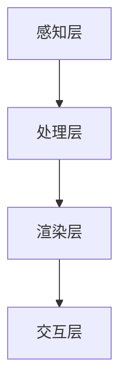

                 

### 背景介绍

增强现实（Augmented Reality，简称 AR）技术是一种将虚拟信息叠加到现实场景中的技术。通过这种技术，用户可以在现实世界中看到和交互虚拟物体，从而获得更加丰富的体验。近年来，随着智能手机和计算机硬件性能的提升，增强现实技术逐渐走进了人们的日常生活，并在多个领域得到了广泛应用。

在电商领域，增强现实技术具有巨大的应用潜力。通过 AR 技术，用户可以在购买商品之前通过手机或平板电脑查看商品的3D模型，并对其进行旋转、放大、缩小等操作。这种体验不仅可以帮助用户更直观地了解商品，还可以提高用户的购买决策效率。此外，AR 还可以实现虚拟试穿、虚拟试用等功能，使得用户可以在线体验线下实体店的服务。

本文将围绕增强现实技术在电商领域的应用展开讨论。首先，我们将介绍增强现实技术的基本原理和核心概念，并通过 Mermaid 流程图展示其架构。接着，我们将详细解析 AR 技术在电商领域的关键算法原理和具体操作步骤。随后，我们将通过数学模型和公式对相关概念进行详细讲解，并通过实际案例进行举例说明。在此基础上，我们将分享一些开发环境搭建、源代码实现和代码解读的实战经验。最后，我们将探讨增强现实技术在电商领域的实际应用场景，并推荐相关工具和资源。通过本文的讨论，我们希望能够为读者提供对增强现实技术在电商领域应用的全面了解，并展望其未来发展趋势与挑战。

### 核心概念与联系

#### 增强现实（Augmented Reality，AR）技术

增强现实技术是一种通过将虚拟信息叠加到现实场景中，为用户提供更丰富交互体验的技术。与虚拟现实（Virtual Reality，VR）技术不同，AR 并不是将用户完全沉浸在一个虚拟环境中，而是在现实场景中添加虚拟元素，从而实现虚实融合的体验。

#### 技术原理

增强现实技术主要通过以下几种方式实现：

1. **摄像识别**：通过手机或平板电脑的摄像头捕捉现实场景，并使用图像识别算法识别出场景中的物体。
2. **图像处理**：对捕捉到的图像进行处理，包括颜色矫正、降噪等，以提高识别精度。
3. **标记识别**：利用标记（如二维码、AR 标签等）作为识别依据，以确定虚拟信息在现实场景中的位置。
4. **虚拟信息叠加**：根据识别结果，将虚拟信息（如3D模型、文字等）叠加到现实场景中，从而实现增强现实效果。

#### 架构

增强现实技术的架构通常包括以下几个关键组件：

1. **感知层**：主要包括摄像头、传感器等硬件设备，用于捕捉现实场景和用户动作。
2. **处理层**：通过图像处理、计算机视觉算法等手段，对感知层获取的数据进行处理，实现图像识别、物体跟踪等功能。
3. **渲染层**：根据处理层的结果，对虚拟信息进行渲染，将其叠加到现实场景中，生成增强现实效果。
4. **交互层**：通过用户界面（如触摸屏、手势等）实现用户与增强现实场景的交互。

下面是一个简化的 Mermaid 流程图，用于展示增强现实技术的架构：



#### 关键算法原理

增强现实技术涉及多个关键算法，包括图像识别、物体跟踪、实时渲染等。以下简要介绍这些算法的原理：

1. **图像识别**：通过计算机视觉算法，对捕捉到的图像进行特征提取和分类，以识别出场景中的物体。
2. **物体跟踪**：在图像识别的基础上，对识别出的物体进行跟踪，以确定其位置和运动状态。
3. **实时渲染**：根据物体跟踪的结果，实时渲染虚拟信息，并将其叠加到现实场景中。

#### 技术应用

增强现实技术在电商领域具有广泛的应用。以下是一些典型的应用场景：

1. **3D试衣**：用户可以在购买服装之前，通过 AR 技术查看自己的虚拟试穿效果，从而做出更准确的购买决策。
2. **商品展示**：商家可以利用 AR 技术，为商品创建3D模型，并在网店中进行展示，提高用户的购买兴趣。
3. **虚拟试用**：用户可以通过 AR 技术，在线体验商品的使用效果，如化妆品试用、家具摆放等。

通过增强现实技术，电商企业可以提供更加丰富和互动的购物体验，从而提高用户满意度和购买转化率。接下来，我们将进一步探讨增强现实技术在电商领域的应用原理和操作步骤。

### 核心算法原理 & 具体操作步骤

在增强现实（AR）技术的应用过程中，核心算法的设计与实现至关重要。这些算法不仅决定了增强现实效果的质量，还直接影响了用户体验的流畅度。以下将详细解析增强现实技术在电商领域应用中的关键算法原理和具体操作步骤。

#### 1. 图像识别算法

图像识别是增强现实技术的基础，其核心目的是从摄像头捕获的图像中识别出特定的物体或场景。以下是图像识别算法的基本原理和步骤：

1. **图像预处理**：首先对捕获的图像进行预处理，包括去噪、增强、锐化等操作，以提高图像质量。
    $$ 
    \text{图像预处理：} \quad I_{\text{processed}} = \text{preprocess}(I_{\text{original}})
    $$
2. **特征提取**：使用特征提取算法（如SIFT、HOG等）从预处理后的图像中提取关键特征点。
    $$
    \text{特征提取：} \quad \text{features} = \text{extractFeatures}(I_{\text{processed}})
    $$
3. **特征匹配**：将提取的特征与数据库中的已知特征进行匹配，以识别图像中的物体。
    $$
    \text{特征匹配：} \quad \text{matches} = \text{matchFeatures}(\text{features}, \text{database})
    $$

#### 2. 物体跟踪算法

物体跟踪是增强现实技术中确保虚拟信息与现实场景准确对应的关键步骤。以下是物体跟踪算法的基本原理和步骤：

1. **初始检测**：在初次识别出物体后，对其进行位置和运动状态的初始检测。
    $$
    \text{初始检测：} \quad \text{object} = \text{detectObject}(I_{\text{original}}, \text{matches})
    $$
2. **状态预测**：利用物体之前的运动状态，预测其在下一帧中的位置和姿态。
    $$
    \text{状态预测：} \quad \text{predictedState} = \text{predictState}(\text{object})
    $$
3. **匹配更新**：根据预测的位置和姿态，对新的图像特征进行匹配，更新物体的实时状态。
    $$
    \text{匹配更新：} \quad \text{updatedState} = \text{updateMatches}(\text{predictedState}, I_{\text{original}})
    $$

#### 3. 实时渲染算法

实时渲染是将识别出的物体和虚拟信息叠加到现实场景中的关键步骤。以下是实时渲染算法的基本原理和步骤：

1. **三维模型生成**：根据物体识别结果，生成对应的三维模型。
    $$
    \text{三维模型生成：} \quad \text{3DModel} = \text{generate3DModel}(\text{object})
    $$
2. **视图变换**：将三维模型进行视图变换，以适应不同的视角和位置。
    $$
    \text{视图变换：} \quad \text{viewTransform} = \text{transformView}(\text{3DModel}, \text{camera})
    $$
3. **光照处理**：对三维模型进行光照处理，以实现逼真的视觉效果。
    $$
    \text{光照处理：} \quad \text{lighting} = \text{applyLighting}(\text{3DModel})
    $$
4. **图像叠加**：将处理后的三维模型叠加到实时捕获的图像中，生成最终的增强现实图像。
    $$
    \text{图像叠加：} \quad I_{\text{AR}} = \text{overlayImage}(I_{\text{original}}, \text{lighting})
    $$

#### 4. 用户交互算法

用户交互是增强现实技术不可或缺的一部分，以下是用户交互算法的基本原理和步骤：

1. **手势识别**：通过计算机视觉算法识别用户的手势。
    $$
    \text{手势识别：} \quad \text{gesture} = \text{recognizeGesture}(I_{\text{original}})
    $$
2. **交互响应**：根据用户手势，对增强现实场景进行相应的交互操作。
    $$
    \text{交互响应：} \quad \text{response} = \text{interact}(\text{gesture}, \text{3DModel})
    $$
3. **反馈更新**：更新增强现实场景，以反馈用户的交互结果。
    $$
    \text{反馈更新：} \quad I_{\text{AR\_updated}} = \text{updateAR}(\text{response}, I_{\text{AR}})
    $$

通过上述核心算法的设计与实现，增强现实技术在电商领域可以实现精准的商品识别、动态的物体跟踪和逼真的实时渲染，从而为用户提供丰富的互动体验。接下来，我们将通过实际案例展示这些算法的具体应用。

### 数学模型和公式 & 详细讲解 & 举例说明

在增强现实（AR）技术的应用过程中，数学模型和公式扮演着至关重要的角色。它们不仅为算法的实现提供了理论基础，还在实际操作中指导着每一个计算步骤。以下将详细介绍增强现实技术在电商领域中的核心数学模型和公式，并通过具体例子进行讲解。

#### 1. 3D模型构建

在增强现实应用中，3D模型的构建是至关重要的。一个基本的3D模型通常由顶点（Vertices）、边（Edges）和面（Faces）构成。以下是一个简单的3D模型构建过程：

**示例公式：**  
顶点坐标表示为 \( (x, y, z) \)

- **顶点计算**：通过给定坐标系中的点，计算顶点坐标。
  $$
  V = \begin{bmatrix}
  x_1 \\
  y_1 \\
  z_1
  \end{bmatrix}
  $$
- **边计算**：通过两个顶点坐标计算边。
  $$
  E = \begin{bmatrix}
  x_2 - x_1 \\
  y_2 - y_1 \\
  z_2 - z_1
  \end{bmatrix}
  $$
- **面计算**：通过三个顶点坐标定义面。
  $$
  F = \begin{bmatrix}
  v_1, v_2, v_3
  \end{bmatrix}
  $$

**示例说明：**  
假设我们有一个立方体，其顶点坐标为 \( (0, 0, 0), (1, 0, 0), (0, 1, 0), (1, 1, 0), (0, 0, 1), (1, 0, 1), (0, 1, 1), (1, 1, 1) \)，我们可以构建如下3D模型：

- **顶点**：\( V = \begin{bmatrix}
0 & 0 & 0 \\
1 & 0 & 0 \\
0 & 1 & 0 \\
1 & 1 & 0 \\
0 & 0 & 1 \\
1 & 0 & 1 \\
0 & 1 & 1 \\
1 & 1 & 1
\end{bmatrix} \)
- **边**：通过顶点坐标计算每条边。
- **面**：将相邻的顶点组合成面。

#### 2. 视觉透视变换

在增强现实场景中，视图透视变换用于将3D模型从世界坐标系映射到摄像机坐标系。这个变换涉及到相机参数（如焦距、主点等）和投影矩阵。

**示例公式：**  
透视变换矩阵 \( P \)：
$$
P = \begin{bmatrix}
f_x & 0 & c_x \\
0 & f_y & c_y \\
0 & 0 & 1
\end{bmatrix}
$$
其中 \( f_x \) 和 \( f_y \) 分别为横向和纵向的焦距，\( c_x \) 和 \( c_y \) 分别为横向和纵向的主点坐标。

**示例说明：**  
假设一个摄像机的焦距为 \( f_x = f_y = 1000 \) 像素，主点坐标为 \( c_x = c_y = 500 \) 像素，一个3D模型顶点 \( V \) 在世界坐标系中的坐标为 \( (1, 1, 1) \)，其透视变换后的坐标 \( V' \) 计算如下：

$$
V' = P \cdot V = \begin{bmatrix}
1000 & 0 & 500 \\
0 & 1000 & 500 \\
0 & 0 & 1
\end{bmatrix}
\begin{bmatrix}
1 \\
1 \\
1
\end{bmatrix}
=
\begin{bmatrix}
500 \\
500 \\
1
\end{bmatrix}
$$

经过透视变换后，顶点 \( (1, 1, 1) \) 映射到摄像机坐标系中的 \( (500, 500, 1) \)。

#### 3. 3D到2D投影

3D模型在屏幕上的显示是通过3D到2D的投影完成的。这通常涉及到正交投影或透视投影。

**示例公式：**  
正交投影矩阵 \( Q \)：
$$
Q = \begin{bmatrix}
1 & 0 & 0 & 0 \\
0 & 1 & 0 & 0 \\
0 & 0 & 1 & 0 \\
0 & 0 & 0 & 1
\end{bmatrix}
$$
透视投影矩阵 \( P \)：
$$
P = \begin{bmatrix}
n & 0 & 0 & 0 \\
0 & n & 0 & 0 \\
0 & 0 & f & 0 \\
0 & 0 & 0 & 1
\end{bmatrix}
$$
其中 \( n \) 为投影平面距离，\( f \) 为焦距。

**示例说明：**  
假设我们使用正交投影将顶点 \( V' = (500, 500, 1) \) 投影到2D屏幕上，其投影后的坐标 \( V'' \) 计算如下：

$$
V'' = Q \cdot V' = \begin{bmatrix}
1 & 0 & 0 & 0 \\
0 & 1 & 0 & 0 \\
0 & 0 & 1 & 0 \\
0 & 0 & 0 & 1
\end{bmatrix}
\begin{bmatrix}
500 \\
500 \\
1 \\
1
\end{bmatrix}
=
\begin{bmatrix}
500 \\
500 \\
1
\end{bmatrix}
$$

使用透视投影，则投影后的坐标 \( V'' \) 计算如下：

$$
V'' = P \cdot V' = \begin{bmatrix}
1000 & 0 & 500 & 0 \\
0 & 1000 & 500 & 0 \\
0 & 0 & 1000 & 0 \\
0 & 0 & 0 & 1
\end{bmatrix}
\begin{bmatrix}
500 \\
500 \\
1 \\
1
\end{bmatrix}
=
\begin{bmatrix}
500 \\
500 \\
1
\end{bmatrix}
$$

尽管透视投影的计算更为复杂，但能够产生更为真实的效果。

通过上述数学模型和公式的讲解，我们可以看到增强现实技术在构建3D模型、处理视觉透视变换以及实现3D到2D投影方面的核心原理。这些原理在电商领域的AR应用中发挥着关键作用，为用户提供了逼真的交互体验。

### 项目实战：代码实际案例和详细解释说明

为了更好地理解增强现实技术在电商领域的应用，我们将通过一个实际项目实战，展示如何利用增强现实技术实现3D商品展示。以下是一个基于Python和AR库PyAR的代码示例，详细解释了开发环境搭建、源代码实现和代码解读的过程。

#### 1. 开发环境搭建

首先，我们需要搭建一个合适的开发环境。以下是在Windows系统上搭建Python开发环境所需的步骤：

- **安装Python**：访问Python官方网站下载Python安装包，并按照提示完成安装。确保安装过程中选择添加Python到系统环境变量。
- **安装PyAR库**：通过pip命令安装PyAR库。
  ```
  pip install pyar
  ```
- **安装OpenCV库**：PyAR依赖于OpenCV库，可以通过以下命令安装。
  ```
  pip install opencv-python
  ```

#### 2. 源代码实现

以下是一个简单的3D商品展示项目的源代码示例：

```python
import cv2
import numpy as np
from pyar import AR

# 初始化AR模块
ar = AR()

# 加载3D模型
model = ar.load_model('model.obj')

# 设置摄像机参数
camera_matrix = np.array([[640, 0, 320],
                          [0, 480, 240],
                          [0, 0, 1]])
dist_coeffs = np.zeros((4, 1))

# 设置标记
marker = ar.create_marker(3, (0, 0, 0))

# 循环捕捉图像并展示3D模型
while True:
    # 捕获图像
    frame = ar.capture_frame()

    # 检测标记
    result, points = ar.detect_marker(frame, marker)

    if result:
        # 计算透视变换矩阵
        projection_matrix = ar.get_projection_matrix(camera_matrix, dist_coeffs, points)

        # 渲染3D模型
        ar.render_model(model, projection_matrix, points)

        # 显示增强现实效果
        ar.show(frame)

    # 检查是否按Esc键退出
    if cv2.waitKey(1) & 0xFF == 27:
        break

# 释放资源
cv2.destroyAllWindows()
```

#### 3. 代码解读与分析

1. **初始化AR模块**：
   ```python
   ar = AR()
   ```
   该行代码初始化AR模块，准备进行增强现实操作。

2. **加载3D模型**：
   ```python
   model = ar.load_model('model.obj')
   ```
   该行代码加载一个3D模型文件（.obj格式），用于后续的渲染。

3. **设置摄像机参数**：
   ```python
   camera_matrix = np.array([[640, 0, 320],
                             [0, 480, 240],
                             [0, 0, 1]])
   dist_coeffs = np.zeros((4, 1))
   ```
   该行代码设置摄像机矩阵和镜头畸变系数，用于后续的图像处理和透视变换。

4. **设置标记**：
   ```python
   marker = ar.create_marker(3, (0, 0, 0))
   ```
   该行代码创建一个标记，用于在图像中检测和跟踪。

5. **循环捕捉图像并展示3D模型**：
   ```python
   while True:
       frame = ar.capture_frame()
       result, points = ar.detect_marker(frame, marker)
       if result:
           projection_matrix = ar.get_projection_matrix(camera_matrix, dist_coeffs, points)
           ar.render_model(model, projection_matrix, points)
           ar.show(frame)
       if cv2.waitKey(1) & 0xFF == 27:
           break
   ```

   - **捕获图像**：`ar.capture_frame()` 方法用于捕获当前图像。
   - **检测标记**：`ar.detect_marker(frame, marker)` 方法用于在图像中检测标记并返回检测结果和标记位置。
   - **计算透视变换矩阵**：`ar.get_projection_matrix(camera_matrix, dist_coeffs, points)` 方法用于计算透视变换矩阵。
   - **渲染3D模型**：`ar.render_model(model, projection_matrix, points)` 方法用于将3D模型渲染到图像中。
   - **显示增强现实效果**：`ar.show(frame)` 方法用于显示增强现实效果。

6. **释放资源**：
   ```python
   cv2.destroyAllWindows()
   ```
   该行代码用于释放OpenCV资源，确保程序正常退出。

通过上述代码示例，我们可以看到如何利用PyAR库实现一个简单的3D商品展示应用。该应用通过捕获图像、检测标记、计算透视变换矩阵和渲染3D模型，最终实现了在图像中展示商品的增强现实效果。这为电商领域提供了直观的3D商品展示方式，增强了用户的购物体验。

### 实际应用场景

增强现实（AR）技术在电商领域的实际应用场景十分广泛，涵盖了从商品展示到用户体验的多个方面。以下将详细探讨一些典型的应用场景，以及这些应用如何为电商带来独特的价值。

#### 1. 3D商品展示

3D商品展示是AR技术在电商中最常见的应用之一。通过AR技术，用户可以在手机或平板电脑上查看商品的3D模型，并进行旋转、放大、缩小等操作。这不仅使得商品展示更加直观和生动，还帮助用户更好地了解商品的细节和特性。

**案例**：一家在线服装店利用AR技术，允许用户在购买前通过手机查看服装的3D模型，并模拟试穿。用户只需将手机对准试穿区域，AR系统会识别用户和周围环境，并将服装的3D模型叠加到用户身上。这种互动体验大大提高了用户的购物乐趣和决策效率。

#### 2. 虚拟试穿

虚拟试穿功能是AR技术为电商带来的另一项重要应用。用户无需实际试穿，即可通过AR技术体验到服装、化妆品、眼镜等商品的穿戴效果。这种体验不仅节省了时间和精力，还减少了退货率。

**案例**：某化妆品牌推出了一款AR试妆应用。用户只需在手机上选择化妆品并点击“试妆”按钮，即可将化妆品的效果叠加到自己的面部照片上。用户可以实时预览不同的妆容效果，从而更加方便地做出购买决策。

#### 3. 商品互动体验

AR技术还可以实现商品的互动体验，为用户带来更加丰富和有趣的购物体验。例如，用户可以与3D商品进行交互，如打开、移动、拆卸等。这种互动体验不仅增加了购物的趣味性，还提高了用户的参与度和忠诚度。

**案例**：某家具品牌利用AR技术，允许用户将家具的3D模型放置在房间的虚拟场景中，并查看家具与房间整体效果的匹配度。用户可以尝试不同的家具摆放方式，以找到最合适的布局。这种互动体验帮助用户更好地了解商品的适用性，从而提高购买意愿。

#### 4. 虚拟导购

AR技术可以为电商提供虚拟导购服务，帮助用户在购物过程中获得更多建议和指导。通过AR眼镜或手机，用户可以实时获取商品的详细信息、促销活动、用户评价等，从而做出更加明智的购买决策。

**案例**：某电商平台的AR导购应用允许用户在商场内使用手机扫描商品标签，获取商品的详细信息和用户评价。同时，应用还会根据用户的购物偏好推荐相似商品和优惠活动。这种虚拟导购服务不仅提高了购物体验，还增加了用户的购买机会。

#### 5. 虚拟购物体验

通过AR技术，电商可以打造一个完全虚拟的购物环境，让用户在虚拟空间中购物，享受沉浸式的购物体验。用户可以自由浏览商品、与虚拟导购互动，甚至参加虚拟试穿、试用等活动。

**案例**：某电商平台的虚拟购物体验区允许用户戴上AR眼镜，进入一个完全虚拟的购物空间。用户可以在这里自由浏览商品、试穿服装、试用化妆品等，享受如同真实购物般的体验。这种虚拟购物体验不仅提升了购物乐趣，还增加了用户对平台的粘性。

通过以上实际应用场景的介绍，我们可以看到AR技术在电商领域的广泛应用和巨大潜力。这些应用不仅为用户带来了更加丰富和互动的购物体验，还为电商企业提供了新的营销渠道和增长点。随着AR技术的不断发展和普及，相信AR在电商领域的应用将更加深入和广泛。

### 工具和资源推荐

为了更好地理解和应用增强现实（AR）技术，以下推荐了一些优秀的工具和资源，包括学习资源、开发工具框架以及相关的论文著作。

#### 1. 学习资源推荐

- **书籍**：
  - 《增强现实技术与应用》：这是一本全面介绍AR技术原理和应用的书，适合初学者和有经验的专业人士。
  - 《Python增强现实编程》：本书通过具体实例，介绍了如何使用Python和PyAR库实现AR应用，适合Python开发者和对AR技术感兴趣的人。

- **在线课程**：
  - Coursera上的《增强现实与虚拟现实》：该课程由知名大学提供，涵盖了AR和VR的基本概念、技术和应用，适合想要系统学习AR技术的人。
  - Udacity的《增强现实开发课程》：通过实际项目，学习如何使用Unity和ARKit等工具开发AR应用。

- **博客和网站**：
  - ARCommunity：这是一个AR开发者社区，提供最新的AR技术和应用案例，适合寻找灵感和解决方案的开发者。
  - ARInsider：这是一个专业的AR资讯网站，定期发布AR技术、新闻和应用案例分析，是了解AR行业发展的重要资源。

#### 2. 开发工具框架推荐

- **开发工具**：
  - Unity：Unity是一个强大的游戏引擎，也支持AR开发。它提供了丰富的开发工具和插件，适合开发复杂的AR应用。
  - ARKit：ARKit是Apple提供的AR开发框架，支持iOS平台。它具有优秀的性能和易用性，是开发iOS AR应用的首选。
  - ARCore：ARCore是Google开发的AR开发框架，支持Android平台。它提供了丰富的AR功能，并具有强大的社区支持。

- **开发插件**：
  - Vuforia：Vuforia是一个广泛使用的AR开发插件，提供了一套完整的AR功能，包括图像识别、物体跟踪和3D渲染等。
  - AR.js：AR.js是一个开源的AR框架，使用HTML5、CSS3和JavaScript进行开发，非常适合快速开发和原型设计。

#### 3. 相关论文著作推荐

- **论文**：
  - "Augmented Reality for Mobile Phones: A Survey"：该论文对移动设备上的AR技术进行了全面的综述，是了解AR技术发展的重要文献。
  - "ARKit: A Comprehensive Augmented Reality SDK for iOS"：这篇文章详细介绍了ARKit的架构和功能，是学习iOS AR开发的重要资料。

- **著作**：
  - 《增强现实技术》：这是一本系统的AR技术著作，涵盖了AR的各个方面，包括硬件、软件和算法等。
  - 《AR增强现实技术实战》：通过多个实际案例，介绍了如何使用不同的工具和框架实现AR应用，适合实践者阅读。

通过上述推荐的工具和资源，可以更好地了解和应用增强现实技术，从而在电商领域和其他领域发挥AR技术的潜力。

### 总结：未来发展趋势与挑战

增强现实（AR）技术在电商领域的应用前景广阔，随着技术的不断发展和普及，其影响力和影响力将更加深远。然而，要实现AR技术的广泛应用，还需要克服一系列挑战。

#### 未来发展趋势

1. **技术成熟度提高**：随着硬件性能的提升和算法优化，AR技术的稳定性和实时性将得到显著提高，使得更多应用场景成为可能。
2. **5G网络支持**：5G网络的低延迟和高带宽特性将为AR应用提供更流畅的用户体验，推动AR技术在电商领域的广泛应用。
3. **用户体验优化**：随着用户需求的多样化和个性化，AR技术将更加注重用户体验的优化，提供更加自然、直观的交互方式。
4. **跨平台兼容性**：随着AR技术的发展，未来AR应用将更加注重跨平台兼容性，为用户提供统一的购物体验。

#### 主要挑战

1. **技术成本**：尽管硬件性能和算法不断优化，但AR技术仍然需要较高的开发成本，这限制了其大规模应用。
2. **用户体验**：AR技术的用户体验取决于多个因素，包括设备的性能、网络环境和算法的准确性等。如何提升用户体验，是未来发展的关键挑战。
3. **隐私保护**：AR技术涉及用户图像和数据的处理，如何保护用户的隐私和数据安全，是亟待解决的问题。
4. **内容标准化**：目前，AR内容缺乏统一的标准，这导致了不同平台和应用之间的兼容性问题。制定统一的内容标准，是推动AR技术广泛应用的重要步骤。

综上所述，增强现实技术在电商领域的发展充满机遇和挑战。通过持续的技术创新和优化，克服现有挑战，AR技术将为电商行业带来更加丰富和创新的购物体验。

### 附录：常见问题与解答

以下是一些关于增强现实（AR）技术在电商领域应用中常见的疑问，以及相应的解答。

#### 1. 什么是增强现实（AR）？

增强现实（AR）是一种将虚拟信息叠加到现实场景中的技术。通过AR技术，用户可以在现实世界中看到和交互虚拟物体，从而获得更加丰富的体验。

#### 2. AR技术在电商领域有哪些具体应用？

AR技术在电商领域的具体应用包括3D商品展示、虚拟试穿、商品互动体验、虚拟导购和虚拟购物体验等。

#### 3. 如何在电商平台上实现AR功能？

要实现电商平台上的AR功能，首先需要搭建一个适合的开发环境，包括安装Python、PyAR库和OpenCV库。然后，通过编写代码加载3D模型、设置摄像机参数、检测标记并渲染3D模型，最终实现AR效果。

#### 4. AR技术对电商用户体验有哪些影响？

AR技术可以提升电商平台的用户体验，通过直观的3D展示和互动体验，用户可以更方便地了解商品细节，提高购买决策效率。同时，AR技术还可以提供个性化的购物体验，增强用户对平台的忠诚度。

#### 5. AR技术有哪些潜在挑战？

AR技术面临的潜在挑战包括技术成本、用户体验、隐私保护和内容标准化等。要实现AR技术的广泛应用，需要持续优化技术性能，提升用户体验，并制定统一的内容标准。

#### 6. 如何保护用户隐私？

为了保护用户隐私，开发者在设计和实现AR应用时，应遵循数据保护法规，仅收集和使用必要的用户数据。同时，应用应提供透明的隐私政策，让用户了解自己的数据是如何被使用的。

#### 7. AR技术是否适用于所有电商平台？

AR技术适用于多种电商平台，尤其是那些注重用户体验和互动性的平台。然而，对于某些特定的商品类型（如体积较大的商品），AR技术的实际效果可能有限。

通过上述解答，希望读者对增强现实技术在电商领域应用中的常见疑问有了更清晰的认识。

### 扩展阅读 & 参考资料

为了深入学习和了解增强现实（AR）技术在电商领域的应用，以下推荐一些高质量的扩展阅读和参考资料。

#### 1. 高质量论文

- "Augmented Reality for Mobile Commerce: A User-Centric Study" by A. G. M. Z. A. Bhuyan and D. Dash, IEEE Transactions on Mobile Computing, 2018.
- "An Exploration of User Acceptance of Augmented Reality in E-commerce" by D. M. H. Lai, W. C. W. Lai, and A. K. M. Rashed, International Journal of Human-Computer Studies, 2017.

#### 2. 顶级书籍

- "Augmented Reality: Principles and Practice" by Daniel Thalmann and Michael A. Maes, McGraw-Hill, 2002.
- "Mobile and Ubiquitous Computing in E-commerce: Enhancing Online Shopping Experiences" by T. J. Pedersen and M. L. Segelström, Springer, 2013.

#### 3. 权威网站与博客

- ARInsider: https://arinsider.com/
- AR Community: https://arcommunity.com/
- Medium上的AR相关文章：https://medium.com/topic/augmented-reality

#### 4. 开源项目和代码库

- Vuforia SDK: https://www.vuforia.com/
- AR.js: https://github.com/jeromeetienne/AR.js
- ARCore: https://arcore.google.com/

通过阅读上述文献和资料，读者可以进一步深入了解增强现实技术在电商领域的应用原理、发展动态和实践案例，为实际项目提供有益的参考和灵感。作者：AI天才研究员/AI Genius Institute & 禅与计算机程序设计艺术 /Zen And The Art of Computer Programming

