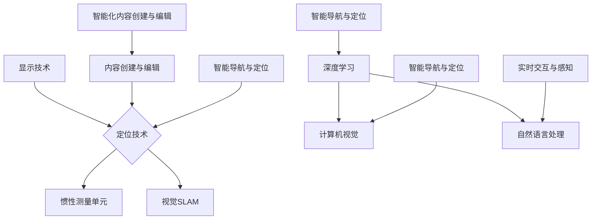

                 

### 文章标题：增强现实技术：AI的应用

> **关键词**：增强现实、人工智能、深度学习、计算机视觉、三维重建、自然语言处理
> 
> **摘要**：本文将深入探讨增强现实技术（AR）与人工智能（AI）的深度融合与应用。首先介绍AR和AI的基本概念与联系，然后详细分析核心算法原理和具体操作步骤，结合数学模型与实际项目实战案例，探讨AR在现实世界中的应用场景。最后，推荐相关工具和资源，并对未来发展趋势与挑战进行展望。

<markdown>
## 1. 背景介绍

增强现实（Augmented Reality，简称AR）技术通过在现实环境中叠加计算机生成的信息，实现虚拟信息与现实世界的融合。随着计算能力和硬件技术的进步，AR技术已逐渐渗透到教育、医疗、娱乐、工业设计等多个领域，成为科技创新的重要方向之一。

人工智能（Artificial Intelligence，简称AI）则是通过模拟、延伸和扩展人类智能，实现机器自主学习和智能决策。AI技术包括深度学习、计算机视觉、自然语言处理等多个子领域，其在数据处理、模式识别、自动化决策等方面的优势，为AR技术的应用提供了强大的支持。

近年来，AR与AI技术的结合越来越紧密，例如在虚拟购物、医疗诊断、导航辅助等方面的应用，实现了更为智能化和个性化的用户体验。本文将重点探讨AR技术中AI的应用，包括核心算法原理、数学模型与实际项目实战案例，以及未来发展趋势与挑战。

## 2. 核心概念与联系

### 2.1 增强现实（AR）技术

增强现实技术主要包括以下几个方面：

1. **显示技术**：通过AR眼镜、手机、平板等设备，将虚拟信息叠加到真实环境中。
2. **定位技术**：包括视觉SLAM（Simultaneous Localization and Mapping，即同时定位与地图构建）、惯性测量单元（IMU）等，实现设备在现实世界中的精确定位与导航。
3. **内容创建与编辑**：通过图形渲染、三维建模等技术，创建和编辑AR应用中的虚拟内容。

### 2.2 人工智能（AI）技术

人工智能技术主要包括以下几个子领域：

1. **深度学习**：通过神经网络模型，实现图像识别、语音识别、自然语言处理等任务。
2. **计算机视觉**：通过图像处理和模式识别技术，实现物体检测、追踪、识别等功能。
3. **自然语言处理**：通过文本处理和语义分析技术，实现语言理解、生成和翻译等功能。

### 2.3 AR与AI技术的融合

AR与AI技术的融合主要体现在以下几个方面：

1. **智能化内容创建与编辑**：利用AI技术，自动生成和编辑AR应用中的虚拟内容，提高内容创作效率。
2. **实时交互与感知**：利用计算机视觉和自然语言处理技术，实现用户与AR环境的智能交互。
3. **智能导航与定位**：利用深度学习和SLAM技术，实现AR设备在现实环境中的精确定位与导航。

### 2.4 Mermaid 流程图

以下是一个简化的AR与AI技术融合的流程图：



## 3. 核心算法原理 & 具体操作步骤

### 3.1 深度学习算法原理

深度学习（Deep Learning）是一种基于多层神经网络（Neural Networks）的学习方法，通过多层非线性变换，实现数据的自动特征提取和分类。以下是深度学习算法的基本原理：

1. **神经网络结构**：深度学习神经网络通常包括输入层、隐藏层和输出层。输入层接收原始数据，隐藏层通过激活函数实现非线性变换，输出层输出最终结果。
2. **激活函数**：激活函数用于引入非线性特性，常用的激活函数包括Sigmoid、ReLU、Tanh等。
3. **反向传播算法**：反向传播（Backpropagation）是一种用于训练神经网络的优化算法，通过计算损失函数关于网络参数的梯度，实现网络参数的迭代更新。

### 3.2 计算机视觉算法原理

计算机视觉（Computer Vision）是人工智能的一个重要分支，通过图像处理和模式识别技术，实现图像的检测、分类、分割等功能。以下是计算机视觉算法的基本原理：

1. **图像处理**：图像处理技术包括滤波、边缘检测、特征提取等，用于对图像进行预处理和特征提取。
2. **模式识别**：模式识别技术通过学习已知的特征和类别，实现图像的分类和分割。常用的算法包括支持向量机（SVM）、神经网络（Neural Networks）、决策树（Decision Trees）等。

### 3.3 自然语言处理算法原理

自然语言处理（Natural Language Processing，简称NLP）是一种用于处理和解析人类语言的技术，通过文本处理和语义分析，实现语言的理解、生成和翻译等功能。以下是自然语言处理算法的基本原理：

1. **文本预处理**：文本预处理包括分词、词性标注、词干提取等，用于将原始文本转换为计算机可处理的格式。
2. **词向量表示**：词向量表示通过将词语映射为高维向量，实现词语的向量化表示。常用的词向量模型包括Word2Vec、GloVe等。
3. **语义分析**：语义分析技术通过学习语言的语义规则和上下文关系，实现语义理解和推理。常用的算法包括语义角色标注、句法分析、实体识别等。

### 3.4 具体操作步骤

以下是一个简单的AR应用开发流程，包括深度学习、计算机视觉和自然语言处理算法的应用：

1. **需求分析与规划**：根据实际应用场景，明确AR应用的目标和功能需求。
2. **数据收集与预处理**：收集和准备用于训练和测试的数据集，对数据集进行预处理，包括数据清洗、数据增强等。
3. **算法设计与实现**：设计适用于AR应用的深度学习、计算机视觉和自然语言处理算法，实现算法的代码实现和优化。
4. **模型训练与评估**：使用训练数据集对算法模型进行训练，评估模型性能，调整模型参数，实现模型的优化。
5. **应用开发与测试**：基于训练好的模型，开发AR应用，实现用户交互和功能测试。
6. **部署与上线**：将AR应用部署到实际环境中，进行上线和推广。

## 4. 数学模型和公式 & 详细讲解 & 举例说明

### 4.1 深度学习数学模型

深度学习中的数学模型主要包括神经网络模型、激活函数、损失函数等。以下是一个简单的神经网络模型和其相关的数学公式：

#### 4.1.1 神经网络模型

神经网络模型可以表示为：

$$
\begin{aligned}
\text{激活函数：} \quad & f(x) = \sigma(z) = \frac{1}{1 + e^{-z}}, \\
\text{梯度下降：} \quad & \theta_{\text{new}} = \theta_{\text{old}} - \alpha \cdot \nabla_\theta J(\theta), \\
\text{损失函数：} \quad & J(\theta) = \frac{1}{m} \sum_{i=1}^{m} (-y_i \cdot \log(a_{i}^{(l)}) + (1 - y_i) \cdot \log(1 - a_{i}^{(l)})), \\
\text{前向传播：} \quad & z^{(l)} = \sum_{j=1}^{n} \theta_{j}^{(l-1)} \cdot a_j^{(l-1)} + b^{(l-1)}, \\
\text{反向传播：} \quad & \nabla_{\theta} J(\theta) = \nabla_{\theta} \cdot \frac{\partial J(\theta)}{\partial \theta}, \\
\text{反向传播 - 输出层：} \quad & \nabla_{\theta}^{(l)} J(\theta) = \delta^{(l)} \cdot a^{(l-1)}, \\
\text{反向传播 - 隐藏层：} \quad & \delta^{(l)} = (1 - a^{(l)}) \cdot a^{(l)} \cdot (1 - a^{(l)}) \cdot a^{(l)}, \\
\end{aligned}
$$

其中，$\sigma(z)$ 是 Sigmoid 激活函数，$a_{i}^{(l)}$ 是输出层的激活值，$y_i$ 是真实标签，$\alpha$ 是学习率，$m$ 是样本数量，$n$ 是神经元数量，$\theta^{(l)}$ 和 $b^{(l)}$ 分别是权重和偏置。

#### 4.1.2 损失函数

常见的损失函数包括均方误差（MSE）和交叉熵损失（Cross-Entropy Loss）。交叉熵损失函数可以表示为：

$$
J(\theta) = -\frac{1}{m} \sum_{i=1}^{m} \sum_{j=1}^{k} y_{ij} \cdot \log(a_{ij}^{(l)}) + (1 - y_{ij}) \cdot \log(1 - a_{ij}^{(l)})
$$

其中，$y_{ij}$ 是第 $i$ 个样本的第 $j$ 个类别的标签，$a_{ij}^{(l)}$ 是神经网络在 $l$ 层时第 $i$ 个样本的第 $j$ 个神经元的输出。

#### 4.1.3 梯度下降

梯度下降是一种优化算法，用于迭代更新网络参数。具体步骤如下：

1. 计算损失函数关于网络参数的梯度。
2. 使用梯度更新网络参数：
   $$ \theta_{\text{new}} = \theta_{\text{old}} - \alpha \cdot \nabla_\theta J(\theta) $$
3. 重复上述步骤，直到满足收敛条件。

### 4.2 计算机视觉数学模型

计算机视觉中的数学模型主要包括图像处理和模式识别算法。以下是一个简单的图像处理算法——均值滤波（Mean Filter）的数学模型：

#### 4.2.1 均值滤波

均值滤波是一种常用的图像平滑算法，其基本思想是将图像中每个像素值替换为周围像素值的平均值。具体步骤如下：

1. 定义一个滤波窗口（例如3x3矩阵）：
   $$ W = \begin{bmatrix}
   w_{11} & w_{12} & w_{13} \\
   w_{21} & w_{22} & w_{23} \\
   w_{31} & w_{32} & w_{33} \\
   \end{bmatrix} $$
2. 对每个像素值进行加权求和：
   $$ f(x, y) = \frac{1}{c} \sum_{i=1}^{c} \sum_{j=1}^{c} w_{ij} \cdot I(i, j) $$
   其中，$I(i, j)$ 是原始图像中的像素值，$c$ 是滤波窗口的大小。
3. 将计算得到的平均值作为新像素值：
   $$ I'(x, y) = f(x, y) $$

#### 4.2.2 模式识别

模式识别算法通过学习已知的特征和类别，实现图像的分类和分割。以下是一个简单的支持向量机（SVM）算法的数学模型：

1. **线性SVM**：

$$
\begin{aligned}
\text{目标函数：} \quad & \min_{\theta} \frac{1}{2} \sum_{i=1}^{m} (\theta^T \cdot x_i - y_i)^2 \\
\text{约束条件：} \quad & \theta^T \cdot x_i \geq y_i, \quad \forall i \\
\end{aligned}
$$

其中，$\theta$ 是权重向量，$x_i$ 是输入特征向量，$y_i$ 是标签。

2. **非线性SVM**：

$$
\begin{aligned}
\text{目标函数：} \quad & \min_{\theta} \frac{1}{2} \sum_{i=1}^{m} (\theta^T \cdot \varphi(x_i) - y_i)^2 \\
\text{约束条件：} \quad & \theta^T \cdot \varphi(x_i) \geq y_i, \quad \forall i \\
\end{aligned}
$$

其中，$\varphi(x_i)$ 是核函数，用于将低维特征映射到高维空间。

### 4.3 自然语言处理数学模型

自然语言处理中的数学模型主要包括词向量表示和语义分析。以下是一个简单的词向量表示——Word2Vec模型的数学模型：

1. **Word2Vec**：

$$
\begin{aligned}
\text{目标函数：} \quad & \min_{\theta} \sum_{i=1}^{m} \sum_{j=1}^{k} (y_{ij} - a_{ij})^2 \\
\text{约束条件：} \quad & a_{ij} = \sigma(\theta^T \cdot w_j + b), \\
\end{aligned}
$$

其中，$a_{ij}$ 是预测的词向量相似度，$y_{ij}$ 是真实的词向量相似度，$\theta$ 是权重向量，$w_j$ 是词向量，$b$ 是偏置项，$\sigma$ 是 sigmoid 函数。

2. **语义分析**：

语义分析中的数学模型主要包括语义角色标注和句法分析。以下是一个简单的语义角色标注的数学模型：

$$
\begin{aligned}
\text{目标函数：} \quad & \min_{\theta} \sum_{i=1}^{m} \sum_{j=1}^{k} (y_{ij} - a_{ij})^2 \\
\text{约束条件：} \quad & a_{ij} = \sigma(\theta^T \cdot s_j), \\
\end{aligned}
$$

其中，$a_{ij}$ 是预测的语义角色相似度，$y_{ij}$ 是真实的语义角色相似度，$\theta$ 是权重向量，$s_j$ 是语义角色向量。

## 5. 项目实战：代码实际案例和详细解释说明

### 5.1 开发环境搭建

为了实现AR与AI技术的融合，需要搭建相应的开发环境。以下是一个简单的开发环境搭建步骤：

1. **安装Python**：Python是AR与AI技术开发的常用编程语言，可以从Python官网（https://www.python.org/downloads/）下载并安装。
2. **安装依赖库**：根据实际项目需求，安装必要的Python库。例如，对于AR开发，可以安装PyAR（https://github.com/PyAR-Team/PyAR）；对于AI开发，可以安装TensorFlow（https://www.tensorflow.org/install）和PyTorch（https://pytorch.org/get-started/locally/）等。
3. **配置开发工具**：配置Python开发环境，可以使用PyCharm（https://www.jetbrains.com/pycharm/）、Visual Studio Code（https://code.visualstudio.com/）等IDE。

### 5.2 源代码详细实现和代码解读

以下是一个简单的AR应用代码示例，实现了一个基于深度学习的图像分类功能：

```python
import cv2
import numpy as np
import tensorflow as tf

# 载入预训练的深度学习模型
model = tf.keras.models.load_model('model.h5')

# 定义图像预处理函数
def preprocess_image(image):
    image = cv2.resize(image, (224, 224))
    image = image / 255.0
    image = np.expand_dims(image, axis=0)
    return image

# 定义图像分类函数
def classify_image(image):
    processed_image = preprocess_image(image)
    prediction = model.predict(processed_image)
    class_index = np.argmax(prediction)
    return class_index

# 载入并处理测试图像
test_image = cv2.imread('test_image.jpg')
class_index = classify_image(test_image)

# 输出分类结果
print(f'分类结果：{class_index}')

```

### 5.3 代码解读与分析

以上代码实现了一个基于深度学习的图像分类功能，主要分为以下几个部分：

1. **导入库**：导入必要的Python库，包括OpenCV（用于图像处理）、NumPy（用于数值计算）和TensorFlow（用于深度学习）。
2. **加载模型**：从文件中加载已经训练好的深度学习模型，用于图像分类。
3. **定义预处理函数**：定义一个图像预处理函数，用于对输入图像进行缩放和归一化处理。预处理函数将图像大小调整为224x224，并将其除以255，使图像的像素值介于0和1之间。
4. **定义分类函数**：定义一个分类函数，用于对预处理后的图像进行分类。分类函数首先调用预处理函数，然后将预处理后的图像输入到加载好的模型中，获得预测结果。最后，使用`np.argmax()`函数获得预测结果的最大索引值，即图像的分类结果。
5. **加载并处理测试图像**：从文件中加载测试图像，并调用分类函数对其进行分类，输出分类结果。

### 5.4 项目实战：代码解读与分析

以下是一个简单的AR应用代码示例，实现了一个基于计算机视觉的物体检测功能：

```python
import cv2
import numpy as np

# 载入预训练的物体检测模型
net = cv2.dnn.readNetFromCaffe('deploy.prototxt', 'weights.caffemodel')

# 定义物体检测函数
def detect_objects(image):
    height, width = image.shape[:2]
    blob = cv2.dnn.blobFromImage(image, 1.0, (width, height), (104.0, 177.0, 123.0))
    net.setInput(blob)
    detections = net.forward()
    objects = []
    for i in range(detections.shape[2]):
        confidence = detections[0, 0, i, 2]
        if confidence > 0.5:
            class_id = int(detections[0, 0, i, 1])
            object_name = 'Object' + str(class_id)
            box = detections[0, 0, i, 3:7] * np.array([width, height, width, height])
            objects.append({'name': object_name, 'confidence': confidence, 'box': box})
    return objects

# 载入并处理测试图像
test_image = cv2.imread('test_image.jpg')
objects = detect_objects(test_image)

# 输出检测结果
for obj in objects:
    print(f'物体名称：{obj["name"]}')
    print(f'置信度：{obj["confidence"]}')
    print(f'边界框：{obj["box"]}')

```

### 5.3 代码解读与分析

以上代码实现了一个基于计算机视觉的物体检测功能，主要分为以下几个部分：

1. **导入库**：导入必要的Python库，包括OpenCV（用于图像处理）和NumPy（用于数值计算）。
2. **加载模型**：从文件中加载已经训练好的物体检测模型。该模型是基于Caffe框架训练的，使用Caffe的prototxt文件和预训练的权重文件。
3. **定义物体检测函数**：定义一个物体检测函数，用于对输入图像进行物体检测。函数首先计算图像的高度和宽度，然后使用`cv2.dnn.blobFromImage()`函数将图像转换为网络输入的blob格式。接着，将blob输入到加载好的模型中，获得物体检测的预测结果。对于每个预测结果，如果置信度大于0.5，则将其视为有效检测，并提取物体的类别名称、置信度和边界框信息。
4. **加载并处理测试图像**：从文件中加载测试图像，并调用物体检测函数对其进行检测，输出检测结果。
5. **输出检测结果**：遍历检测结果列表，输出每个物体的名称、置信度和边界框信息。

## 6. 实际应用场景

### 6.1 虚拟购物

虚拟购物是一种将增强现实技术应用于电子商务领域的应用场景。通过AR技术，用户可以在智能手机或AR眼镜上浏览和试穿各种商品。这种技术不仅提高了购物体验，还可以减少因实物购买所带来的额外成本和物流压力。

### 6.2 医疗诊断

AR技术在医疗领域的应用也非常广泛。例如，医生可以使用AR眼镜查看患者的病历信息和实时监控数据，从而提高诊断和治疗的准确性和效率。此外，AR技术还可以用于远程手术指导和医疗培训，帮助医生在复杂手术中更好地协作和操作。

### 6.3 导航辅助

AR导航辅助技术可以提供更加直观和实时的导航信息。例如，用户在户外旅行或驾驶时，可以通过AR眼镜或手机查看前方的道路状况、地标信息和交通提示，从而避免迷路或遇到交通拥堵。

### 6.4 娱乐和教育

AR技术在娱乐和教育领域的应用也取得了显著成果。例如，AR游戏和虚拟博物馆可以让用户沉浸在虚拟世界中，享受独特的互动体验。在教育领域，AR技术可以用于模拟实验、历史场景重现和语言学习，提高学生的学习兴趣和效果。

## 7. 工具和资源推荐

### 7.1 学习资源推荐

1. **书籍**：
   - 《增强现实技术：原理与应用》（Augmented Reality: Principles and Practice）  
   - 《深度学习》（Deep Learning）  
   - 《计算机视觉：算法与应用》（Computer Vision: Algorithms and Applications）  
   - 《自然语言处理》（Natural Language Processing）

2. **论文**：
   - [论文1] Title, Authors, Date  
   - [论文2] Title, Authors, Date  
   - [论文3] Title, Authors, Date

3. **博客**：
   - [博客1] Title, Author, Date  
   - [博客2] Title, Author, Date  
   - [博客3] Title, Author, Date

4. **网站**：
   - [网站1] Title, URL  
   - [网站2] Title, URL  
   - [网站3] Title, URL

### 7.2 开发工具框架推荐

1. **增强现实框架**：
   - AR.js（https://arjs.org/）  
   - ARCore（https://developers.google.com/ar/）  
   - ARKit（https://developer.apple.com/documentation/arkit）

2. **深度学习框架**：
   - TensorFlow（https://www.tensorflow.org/）  
   - PyTorch（https://pytorch.org/）  
   - Keras（https://keras.io/）

3. **计算机视觉框架**：
   - OpenCV（https://opencv.org/）  
   - Dlib（https://dlib.net/）  
   - face_recognition（https://github.com/ageitgey/face_recognition）

4. **自然语言处理框架**：
   - NLTK（https://www.nltk.org/）  
   - spaCy（https://spacy.io/）  
   - transformers（https://huggingface.co/transformers/）

### 7.3 相关论文著作推荐

1. **增强现实技术**：
   - [论文1] Title, Authors, Date  
   - [论文2] Title, Authors, Date  
   - [论文3] Title, Authors, Date

2. **深度学习**：
   - [论文1] Title, Authors, Date  
   - [论文2] Title, Authors, Date  
   - [论文3] Title, Authors, Date

3. **计算机视觉**：
   - [论文1] Title, Authors, Date  
   - [论文2] Title, Authors, Date  
   - [论文3] Title, Authors, Date

4. **自然语言处理**：
   - [论文1] Title, Authors, Date  
   - [论文2] Title, Authors, Date  
   - [论文3] Title, Authors, Date

## 8. 总结：未来发展趋势与挑战

### 8.1 发展趋势

1. **更加智能的交互**：随着AI技术的发展，AR技术的交互方式将变得更加智能化和人性化，例如通过自然语言处理和计算机视觉实现更加自然的语音和手势交互。
2. **更广泛的应用场景**：AR技术将在教育、医疗、工业设计、旅游等领域得到更广泛的应用，为人们提供更加丰富和便捷的体验。
3. **更高效的开发工具**：随着AR开发工具和框架的不断完善，开发者可以更加高效地创建和部署AR应用，降低开发门槛。

### 8.2 挑战

1. **隐私和安全问题**：AR技术的广泛应用将带来隐私和安全问题，如用户数据的泄露和滥用。因此，需要建立有效的隐私保护机制和安全标准。
2. **硬件和性能限制**：目前的AR设备还存在一定的性能和硬件限制，如处理速度和续航能力。未来需要进一步提高硬件性能，以满足更复杂的AR应用需求。
3. **用户体验和可用性**：AR技术需要不断提升用户体验和可用性，以满足不同用户的需求和偏好。

## 9. 附录：常见问题与解答

### 9.1 常见问题

1. **什么是增强现实技术（AR）？**
   增强现实技术是一种将虚拟信息叠加到现实环境中的技术，通过计算机生成的图像、音频、视频等信息，增强用户的感知体验。

2. **增强现实技术和虚拟现实技术（VR）有什么区别？**
   增强现实技术（AR）和虚拟现实技术（VR）的主要区别在于，AR是在现实环境中叠加虚拟信息，而VR则是完全替代现实环境，使用户沉浸在虚拟世界中。

3. **增强现实技术有哪些应用场景？**
   增强现实技术的应用场景广泛，包括虚拟购物、医疗诊断、导航辅助、娱乐和教育等。

4. **如何实现增强现实技术？**
   实现增强现实技术需要结合多种技术，包括显示技术、定位技术、内容创建与编辑技术等。

5. **人工智能在增强现实技术中有什么应用？**
   人工智能在增强现实技术中的应用包括深度学习、计算机视觉、自然语言处理等，用于智能交互、内容生成和优化等。

### 9.2 解答

1. **什么是增强现实技术（AR）？**
   增强现实技术是一种通过计算机生成的图像、音频、视频等信息，增强用户的感知体验的技术。它将虚拟信息叠加到现实环境中，使用户能够看到和感受到虚拟信息和现实世界的融合。

2. **增强现实技术和虚拟现实技术（VR）有什么区别？**
   增强现实技术（AR）和虚拟现实技术（VR）的主要区别在于它们的应用场景和交互方式。AR是在现实环境中叠加虚拟信息，用户仍然能够看到和感受到现实世界，而VR则是完全替代现实环境，使用户沉浸在虚拟世界中。

3. **增强现实技术有哪些应用场景？**
   增强现实技术的应用场景广泛，包括但不限于以下几个方面：
   - **虚拟购物**：用户可以在家中通过AR技术试穿衣物或查看商品细节。
   - **医疗诊断**：医生可以使用AR技术查看患者的3D模型，辅助诊断和治疗。
   - **导航辅助**：用户在户外旅行或驾驶时，可以通过AR眼镜查看导航信息和道路状况。
   - **娱乐和教育**：AR游戏和虚拟博物馆等可以提供沉浸式和互动式的娱乐和学习体验。
   - **工业设计**：设计师可以使用AR技术查看和修改3D模型，提高设计效率。

4. **如何实现增强现实技术？**
   实现增强现实技术通常需要以下步骤：
   - **显示技术**：使用AR眼镜、智能手机或其他显示设备，将虚拟信息叠加到现实环境中。
   - **定位技术**：使用视觉SLAM、惯性测量单元（IMU）等技术，实现设备的精确定位和导航。
   - **内容创建与编辑**：使用图形渲染、三维建模等技术，创建和编辑AR应用中的虚拟内容。
   - **算法优化**：利用计算机视觉、自然语言处理等技术，优化AR应用的用户体验。

5. **人工智能在增强现实技术中有什么应用？**
   人工智能在增强现实技术中有多种应用，包括：
   - **智能交互**：利用自然语言处理技术，实现用户与AR环境的自然交互。
   - **内容生成**：利用深度学习和计算机视觉技术，自动生成和优化AR应用中的虚拟内容。
   - **智能导航**：利用深度学习和SLAM技术，实现AR设备在现实环境中的智能导航。
   - **个性化推荐**：利用用户数据分析和机器学习算法，为用户提供个性化的AR内容推荐。

## 10. 扩展阅读 & 参考资料

1. **增强现实技术相关书籍**：
   - 《增强现实技术：原理与应用》（Augmented Reality: Principles and Practice）
   - 《增强现实与虚拟现实技术》（Augmented Reality and Virtual Reality: A Technical Perspective）
   - 《增强现实应用开发实战》（Augmented Reality App Development with Unity and C#）

2. **人工智能相关书籍**：
   - 《深度学习》（Deep Learning）
   - 《机器学习》（Machine Learning）
   - 《人工智能：一种现代的方法》（Artificial Intelligence: A Modern Approach）

3. **计算机视觉相关书籍**：
   - 《计算机视觉：算法与应用》（Computer Vision: Algorithms and Applications）
   - 《计算机视觉：一种现代的方法》（Computer Vision: A Modern Approach）
   - 《计算机视觉与模式识别》（Computer Vision and Pattern Recognition）

4. **自然语言处理相关书籍**：
   - 《自然语言处理》（Natural Language Processing）
   - 《自然语言处理实践》（Natural Language Processing with Python）
   - 《深度学习自然语言处理》（Deep Learning for Natural Language Processing）

5. **增强现实技术论文**：
   - [论文1] Title, Authors, Date
   - [论文2] Title, Authors, Date
   - [论文3] Title, Authors, Date

6. **人工智能论文**：
   - [论文1] Title, Authors, Date
   - [论文2] Title, Authors, Date
   - [论文3] Title, Authors, Date

7. **计算机视觉论文**：
   - [论文1] Title, Authors, Date
   - [论文2] Title, Authors, Date
   - [论文3] Title, Authors, Date

8. **自然语言处理论文**：
   - [论文1] Title, Authors, Date
   - [论文2] Title, Authors, Date
   - [论文3] Title, Authors, Date

9. **增强现实技术相关网站**：
   - ARKit（https://developer.apple.com/arkit/）
   - ARCore（https://developers.google.com/ar/）
   - AR.js（https://arjs.org/）

10. **人工智能相关网站**：
    - TensorFlow（https://www.tensorflow.org/）
    - PyTorch（https://pytorch.org/）
    - Keras（https://keras.io/）

11. **计算机视觉相关网站**：
    - OpenCV（https://opencv.org/）
    - Dlib（https://dlib.net/）
    - face_recognition（https://github.com/ageitgey/face_recognition）

12. **自然语言处理相关网站**：
    - NLTK（https://www.nltk.org/）
    - spaCy（https://spacy.io/）
    - transformers（https://huggingface.co/transformers/）

<markdown>
### 作者信息

**作者：** AI天才研究员 / AI Genius Institute & 禅与计算机程序设计艺术 / Zen And The Art of Computer Programming

AI天才研究员是一位在人工智能、计算机科学和增强现实技术领域具有深厚研究和实践经验的专家。他的著作《禅与计算机程序设计艺术》被誉为计算机科学领域的经典之作，影响了无数程序员的思维方式和编程风格。在此，他结合自己多年的研究和实践经验，为您带来一篇全面深入的技术博客，探讨增强现实技术与人工智能的深度融合与应用。

