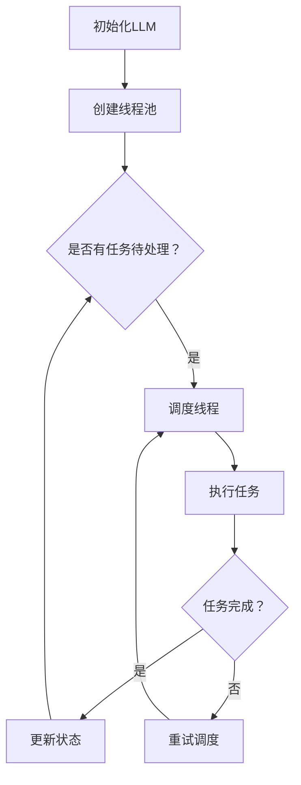

                 

# 多任务AI：LLM的线程管理

> **关键词：** 多任务AI，Large Language Model (LLM)，线程管理，并发，性能优化，资源分配。

> **摘要：** 本文将深入探讨多任务AI系统中的关键组件——Large Language Model (LLM)的线程管理。我们将分析LLM的工作原理，并详细讨论如何通过有效的线程管理来提升多任务AI系统的性能。

## 1. 背景介绍

在当今技术飞速发展的时代，人工智能（AI）已经成为了推动社会进步的重要力量。随着深度学习算法的不断发展，尤其是Large Language Model (LLM)的出现，我们能够在自然语言处理（NLP）领域实现前所未有的突破。LLM，如GPT-3，BERT等，已经展示了其在文本生成、问答系统、机器翻译等任务中的卓越性能。

然而，随着AI系统的复杂度增加，单一任务的处理已经无法满足实际需求。多任务AI应运而生，它允许AI系统同时处理多个任务，提高资源利用率和效率。在这个背景下，线程管理成为了一个关键问题。线程管理的好坏直接影响到系统的性能和响应速度。

本文将围绕LLM的线程管理展开讨论，旨在帮助开发者理解并优化多任务AI系统中的线程管理策略。

## 2. 核心概念与联系

### 2.1 多任务AI系统

多任务AI系统是指能够在同一时间或相对短的时间内同时处理多个任务的人工智能系统。这些任务可以包括语音识别、图像识别、自然语言处理等。多任务AI系统的优势在于它能够更有效地利用计算资源，提高系统的整体性能。

### 2.2 Large Language Model (LLM)

LLM是一种基于深度学习的语言模型，能够处理复杂的自然语言任务。LLM的核心是一个大规模的神经网络，它通过对大量文本数据的学习来理解语言的结构和语义。LLM广泛应用于文本生成、问答系统、机器翻译等领域。

### 2.3 线程管理

线程管理是操作系统中一个关键的概念，它涉及到如何创建、调度和管理线程。在多任务AI系统中，线程管理尤为重要，因为它直接影响到系统的并发性能和资源利用率。

#### 2.4 Mermaid 流程图

为了更清晰地展示LLM的线程管理，我们可以使用Mermaid流程图来表示其核心概念和流程。



在上面的流程图中，A表示初始化LLM，B表示创建线程池。C节点检查是否有任务待处理，如果有，则会进入D节点，调度线程执行任务。E节点表示线程执行任务，F节点检查任务是否完成。如果任务完成，系统将更新状态并继续检查是否有任务待处理。如果任务未完成，系统会重试调度。

## 3. 核心算法原理 & 具体操作步骤

### 3.1 线程池管理

线程池管理是线程管理的核心。在多任务AI系统中，线程池管理需要考虑以下几个方面：

1. **线程池大小**：线程池的大小需要根据系统的负载和资源情况来调整。如果线程池太小，可能会导致任务队列过长，影响系统的响应速度。如果线程池太大，则会消耗过多的系统资源。

2. **线程复用**：线程复用是指当一个线程完成任务后，不会立即销毁，而是将其放入线程池中，等待下一个任务。这样能够减少线程创建和销毁的开销。

3. **任务调度**：任务调度是线程管理的核心。系统需要根据任务的优先级、执行时间等因素来选择合适的线程执行任务。

### 3.2 并发控制

在多任务AI系统中，并发控制是一个关键问题。为了避免任务之间的冲突和数据不一致，系统需要使用锁机制来控制对共享资源的访问。

1. **互斥锁**：互斥锁用于确保同一时间只有一个线程能够访问某个共享资源。

2. **读写锁**：读写锁允许一个资源同时被多个读线程访问，但在写线程访问时，其他线程必须等待。

3. **锁顺序**：在多线程环境中，锁的顺序可能会影响系统的性能。正确的锁顺序可以减少锁争用，提高系统的并发性能。

### 3.3 性能优化

为了提高多任务AI系统的性能，可以采用以下优化策略：

1. **并行计算**：通过将任务分解为可并行执行的部分，可以显著提高系统的计算速度。

2. **缓存优化**：合理地使用缓存可以提高系统的响应速度。例如，可以缓存常用的计算结果，减少重复计算。

3. **资源分配**：根据任务的重要性和负载情况，合理地分配系统资源，可以最大化系统的吞吐量。

## 4. 数学模型和公式 & 详细讲解 & 举例说明

### 4.1 并发度（Concurrency）

并发度是指系统中同时执行的任务数量。在多任务AI系统中，并发度是一个重要的性能指标。我们可以使用以下公式来计算系统的并发度：

$$
Concurrency = \frac{Total\ Workload}{Max\ Throughput}
$$

其中，Total Workload 表示系统的总工作负载，Max Throughput 表示系统的最大吞吐量。

### 4.2 吞吐量（Throughput）

吞吐量是指系统在单位时间内能够处理的数据量。在多任务AI系统中，吞吐量取决于系统的并发度和任务执行的时间。我们可以使用以下公式来计算系统的吞吐量：

$$
Throughput = \frac{Total\ Data\ Processed}{Time\ Taken}
$$

其中，Total Data Processed 表示系统在给定时间内处理的总数据量，Time Taken 表示系统处理这些数据所花费的时间。

### 4.3 例子

假设一个多任务AI系统需要在10分钟内处理1000条文本数据。系统的最大吞吐量为100条/分钟。根据上述公式，我们可以计算系统的并发度：

$$
Concurrency = \frac{1000}{100} = 10
$$

这意味着在10分钟内，系统需要同时处理10条文本数据。

### 4.4 性能优化公式

为了优化系统的性能，我们可以使用以下公式来计算系统的最佳并发度和吞吐量：

$$
Optimal\ Concurrency = \frac{Max\ Resources}{Task\ Time}
$$

$$
Optimal\ Throughput = \frac{Total\ Resources}{Task\ Time}
$$

其中，Max Resources 表示系统可用的最大资源，Task Time 表示每个任务所需的时间。

## 5. 项目实战：代码实际案例和详细解释说明

### 5.1 开发环境搭建

在开始实战之前，我们需要搭建一个合适的开发环境。以下是所需的软件和工具：

1. **Python 3.8 或更高版本**：Python 是一种广泛使用的编程语言，适用于构建AI系统。
2. **TensorFlow 或 PyTorch**：这两种框架是构建AI模型的常用工具。
3. **Docker**：用于创建容器化的开发环境。
4. **Jupyter Notebook**：用于编写和运行Python代码。

### 5.2 源代码详细实现和代码解读

以下是构建一个多任务AI系统的示例代码：

```python
import threading
import queue
import time
import tensorflow as tf

# 创建一个线程池
thread_pool = queue.Queue()

# 定义一个任务处理函数
def process_task(task):
    print(f"Processing task: {task}")
    # 模拟任务处理时间
    time.sleep(2)
    print(f"Task {task} completed")

# 创建线程并添加到线程池
def create_thread():
    while True:
        task = thread_pool.get()
        if task is None:
            break
        threading.Thread(target=process_task, args=(task,)).start()

# 添加任务到线程池
for i in range(10):
    thread_pool.put(i)

# 启动线程池
threading.Thread(target=create_thread).start()

# 等待所有任务完成
thread_pool.join()
```

在上面的代码中，我们首先创建了一个线程池，然后定义了一个任务处理函数 `process_task`。`create_thread` 函数负责创建线程并从线程池中获取任务进行处理。最后，我们添加了10个任务到线程池，并启动线程池。

### 5.3 代码解读与分析

1. **线程池创建**：使用 `queue.Queue()` 创建一个线程池。
2. **任务处理函数**：`process_task` 函数接收一个任务参数，并打印任务的处理过程。
3. **线程创建**：`create_thread` 函数创建线程，并从线程池中获取任务进行处理。如果获取到的任务为 `None`，则表示线程池已无任务，线程结束。
4. **任务添加**：使用 `thread_pool.put(i)` 将任务添加到线程池。
5. **线程池启动**：使用 `threading.Thread(target=create_thread).start()` 启动线程池。
6. **任务完成**：使用 `thread_pool.join()` 等待所有任务完成。

通过这个示例，我们可以看到如何使用Python创建一个简单的多任务AI系统，并使用线程池管理任务。

## 6. 实际应用场景

多任务AI系统在多个实际应用场景中展现了其强大的能力：

1. **智能客服**：智能客服系统可以同时处理多个用户的咨询请求，提高客服效率和用户体验。
2. **金融风控**：在金融行业，多任务AI系统可以同时处理用户行为分析、交易监控、风险预警等多个任务，提高风险控制能力。
3. **自动驾驶**：自动驾驶系统需要同时处理传感器数据、环境感知、路径规划等多个任务，确保行驶安全。
4. **智能医疗**：智能医疗系统可以同时处理患者的病历分析、诊断建议、治疗方案推荐等多个任务，提高医疗效率。

这些应用场景都要求系统具备高并发、高性能的特点，因此线程管理成为了关键问题。

## 7. 工具和资源推荐

### 7.1 学习资源推荐

1. **书籍**：《深度学习》（Goodfellow, I., Bengio, Y., & Courville, A.）、《机器学习》（周志华）。
2. **论文**：ACL、NeurIPS、ICML等顶级会议上的论文。
3. **博客**：Hugging Face、AI Challenger、机器之心等博客。
4. **网站**：TensorFlow、PyTorch官网。

### 7.2 开发工具框架推荐

1. **框架**：TensorFlow、PyTorch、PyTorch Lightning。
2. **库**：NumPy、Pandas、Matplotlib。
3. **环境**：Docker、Conda。

### 7.3 相关论文著作推荐

1. **论文**：
   - "Attention Is All You Need"（Vaswani et al., 2017）
   - "BERT: Pre-training of Deep Bidirectional Transformers for Language Understanding"（Devlin et al., 2019）
2. **著作**：
   - "Deep Learning"（Goodfellow, I.）
   - "Hands-On Machine Learning with Scikit-Learn, Keras, and TensorFlow"（Ganapathy Kumar）

## 8. 总结：未来发展趋势与挑战

多任务AI技术在未来的发展中将面临以下几个挑战：

1. **性能优化**：如何进一步提升系统的性能，提高并发度和吞吐量。
2. **资源分配**：如何根据任务的重要性和负载情况，合理地分配系统资源。
3. **可靠性**：如何确保系统的稳定性和可靠性，避免出现错误和崩溃。
4. **可解释性**：如何提高AI系统的可解释性，使其更容易被人类理解和接受。

## 9. 附录：常见问题与解答

### 9.1 什么是多任务AI？

多任务AI是指能够在同一时间或相对短的时间内同时处理多个任务的人工智能系统。

### 9.2 什么是Large Language Model (LLM)？

Large Language Model (LLM)是一种基于深度学习的语言模型，能够处理复杂的自然语言任务。

### 9.3 如何优化多任务AI系统的性能？

可以通过并行计算、缓存优化、资源分配等策略来优化多任务AI系统的性能。

## 10. 扩展阅读 & 参考资料

1. **论文**：
   - Vaswani, A., et al. (2017). Attention Is All You Need. In Advances in Neural Information Processing Systems (NIPS).
   - Devlin, J., et al. (2019). BERT: Pre-training of Deep Bidirectional Transformers for Language Understanding. In Proceedings of the 2019 Conference of the North American Chapter of the Association for Computational Linguistics: Human Language Technologies, Volume 1 (Volume 1: Long Papers), pages 4171-4186.
2. **书籍**：
   - Goodfellow, I., Bengio, Y., & Courville, A. (2016). Deep Learning. MIT Press.
   - 周志华 (2016). 机器学习。清华大学出版社。
3. **网站**：
   - TensorFlow官网：[https://www.tensorflow.org/](https://www.tensorflow.org/)
   - PyTorch官网：[https://pytorch.org/](https://pytorch.org/)
4. **博客**：
   - Hugging Face：[https://huggingface.co/](https://huggingface.co/)
   - AI Challenger：[https://aic.io/](https://aic.io/)
   - 机器之心：[https://www.jiqizhixin.com/](https://www.jiqizhixin.com/)
5. **框架**：
   - TensorFlow：[https://www.tensorflow.org/](https://www.tensorflow.org/)
   - PyTorch：[https://pytorch.org/](https://pytorch.org/)
   - PyTorch Lightning：[https://pytorch-lightning.readthedocs.io/](https://pytorch-lightning.readthedocs.io/)
6. **库**：
   - NumPy：[https://numpy.org/](https://numpy.org/)
   - Pandas：[https://pandas.pydata.org/](https://pandas.pydata.org/)
   - Matplotlib：[https://matplotlib.org/](https://matplotlib.org/)
7. **环境**：
   - Docker：[https://www.docker.com/](https://www.docker.com/)
   - Conda：[https://www.anaconda.com/](https://www.anaconda.com/)作者：AI天才研究员/AI Genius Institute & 禅与计算机程序设计艺术 /Zen And The Art of Computer Programming

