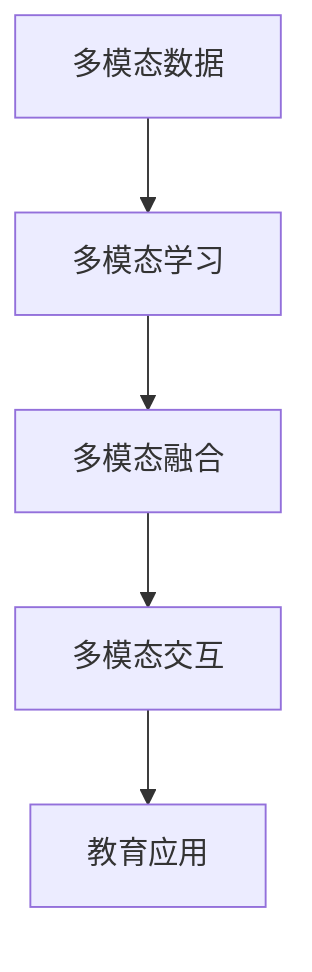
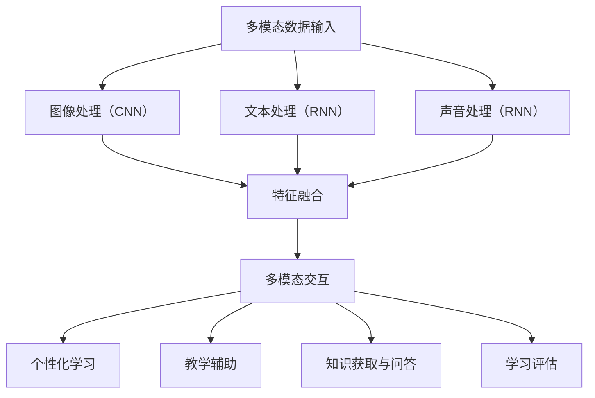

                 

### 背景介绍

多模态AI（Multimodal AI）是一种能够同时处理多种不同类型数据（如图像、声音、文本等）的人工智能技术。随着大数据和深度学习技术的不断发展，多模态AI在教育领域逐渐成为研究的热点。教育行业拥有大量的多模态数据，包括学生的文字回答、语音、图像、视频等，这些数据可以提供丰富的信息，帮助教师和学生更好地理解知识。

近年来，多模态AI在教育领域的应用越来越广泛，主要体现在以下几个方面：

1. **个性化学习**：通过分析学生的多模态数据，如学习行为、考试成绩、情绪状态等，AI系统可以为学生提供个性化的学习方案，提高学习效果。

2. **教学辅助**：多模态AI可以辅助教师进行教学，如通过分析学生的表情、语音等，帮助教师了解学生的学习状态，从而调整教学策略。

3. **知识获取与问答**：利用多模态AI，学生可以通过图像、文本、语音等多种方式获取知识，并能够通过自然语言处理技术进行问答，提高学习效率。

4. **学习评估**：多模态AI可以分析学生的学习成果，如通过对学生的作业、考试成绩、学习行为等数据进行综合评估，帮助教师了解学生的学习效果。

本文将详细探讨多模态AI在教育领域的创新应用，从核心概念与联系、核心算法原理、数学模型和公式、项目实战、实际应用场景等多个方面进行分析，旨在为读者提供一幅全面的多模态AI在教育领域应用的蓝图。

## 1. 核心概念与联系

在探讨多模态AI的教育应用之前，我们首先需要了解几个核心概念，以及它们之间的联系。

### 1.1 多模态数据

多模态数据是指由两种或两种以上的数据类型组成的集合。在教育领域，常见的多模态数据包括文本（text）、图像（image）、声音（audio）、视频（video）等。这些数据类型可以单独存在，也可以相互转换和补充。例如，一个视频文件中可能包含图像、声音和文本描述，这些数据可以共同提供更丰富的信息。

### 1.2 多模态学习

多模态学习是一种人工智能方法，旨在同时处理多种数据类型，以提取有意义的特征和信息。在多模态学习中，不同类型的数据通过不同的传感器或输入源捕获，然后通过神经网络或其他机器学习模型进行处理和融合。

### 1.3 多模态融合

多模态融合是指将来自不同模态的数据进行整合，以生成一个统一的全局表示。这种融合可以通过多种方式实现，包括特征级融合、决策级融合等。特征级融合将不同模态的特征进行组合，而决策级融合则在特征处理后进行综合决策。

### 1.4 多模态交互

多模态交互是指用户通过多种模态与系统进行交互，如通过触摸、声音、文字等。在教育领域，多模态交互可以帮助学生更自然地与学习内容进行互动，提高学习体验。

### 1.5 教育应用

在教育应用中，多模态AI可以用于多个方面，如个性化学习、教学辅助、知识获取与问答、学习评估等。通过分析学生的多模态数据，AI系统可以更好地理解学生的学习状态和需求，从而提供更有效的教育服务。

### 1.6 Mermaid 流程图

以下是一个简化的多模态AI在教育应用中的流程图，展示了核心概念之间的联系。



通过这个流程图，我们可以看到多模态AI在教育应用中的基本框架。接下来，我们将进一步探讨多模态AI的核心算法原理，以及其在教育领域的具体应用。

## 2. 核心算法原理 & 具体操作步骤

### 2.1 卷积神经网络（CNN）

卷积神经网络（CNN）是一种专门用于处理图像数据的人工神经网络，其核心思想是通过卷积层、池化层和全连接层等结构，从原始图像中提取特征，并进行分类或回归。

#### 2.1.1 卷积层

卷积层是CNN中最基本的层，通过将卷积核（或称为滤波器）在输入图像上滑动，与图像中的每个局部区域进行卷积运算，从而提取图像特征。

$$
\text{输出} = \text{卷积核} \cdot \text{输入图像} + \text{偏置项}
$$

其中，卷积运算可以通过以下公式表示：

$$
\text{卷积} = \sum_{i,j} \text{卷积核}_{i,j} \cdot \text{输入图像}_{i,j}
$$

#### 2.1.2 池化层

池化层用于降低特征图的大小，减少参数数量，提高计算效率。常见的池化操作有最大池化（Max Pooling）和平均池化（Average Pooling）。

最大池化操作如下：

$$
\text{输出} = \max_{i,j} (\text{输入图像}_{i,j})
$$

平均池化操作如下：

$$
\text{输出} = \frac{1}{k^2} \sum_{i,j} (\text{输入图像}_{i,j})
$$

其中，$k$ 为池化窗口的大小。

#### 2.1.3 全连接层

全连接层用于将卷积层和池化层提取的特征映射到特定的类别或值。其计算方式为：

$$
\text{输出} = \text{权重} \cdot \text{特征图} + \text{偏置项}
$$

### 2.2 循环神经网络（RNN）

循环神经网络（RNN）是一种用于处理序列数据（如文本、时间序列等）的神经网络，其核心思想是通过隐藏状态（hidden state）的循环连接，来处理序列中的依赖关系。

#### 2.2.1 隐藏状态

RNN的隐藏状态$h_t$是当前输入$x_t$和前一个隐藏状态$h_{t-1}$的函数：

$$
h_t = \text{激活函数}(\text{权重} \cdot [h_{t-1}; x_t] + \text{偏置项})
$$

其中，激活函数通常采用Sigmoid、Tanh等函数。

#### 2.2.2 输出

RNN的输出$y_t$通常是隐藏状态$h_t$通过一个线性变换得到的：

$$
y_t = \text{权重} \cdot h_t + \text{偏置项}
$$

### 2.3 多模态融合方法

多模态AI的核心挑战之一是如何有效地融合来自不同模态的数据。以下介绍几种常见的方法：

#### 2.3.1 特征级融合

特征级融合是将不同模态的特征映射到同一空间，然后进行融合。常见的方法包括对齐（alignment）和特征加权（feature weighting）。

- 对齐：通过学习一个映射函数，将不同模态的特征映射到同一空间。

$$
\text{融合特征} = \text{映射函数}(\text{模态1特征}, \text{模态2特征})
$$

- 特征加权：通过对不同模态的特征进行加权，实现融合。

$$
\text{融合特征} = w_1 \cdot \text{模态1特征} + w_2 \cdot \text{模态2特征}
$$

其中，$w_1$和$w_2$为权重。

#### 2.3.2 决策级融合

决策级融合是在不同模态的特征处理完成后，将多个模态的决策进行融合。常见的方法包括投票（voting）和集成学习（ensemble learning）。

- 投票：通过统计多个模态的决策结果，选择出现次数最多的类别。

$$
\text{最终决策} = \arg\max_{c} (\sum_{m} p_{c,m})
$$

其中，$p_{c,m}$为模态$m$对类别$c$的预测概率。

- 集成学习：通过训练多个独立的模型，然后对它们的预测结果进行综合。

$$
\text{最终预测} = \text{模型1预测} + \text{模型2预测} + \cdots
$$

### 2.4 多模态交互

多模态交互是用户通过多种模态与系统进行交互的过程。以下介绍几种常见的方法：

#### 2.4.1 触觉交互

触觉交互是通过触摸传感器来获取用户的触摸信息，然后通过机器学习模型进行理解。例如，通过分析触摸的力度、速度等特征，识别用户的意图。

#### 2.4.2 声音交互

声音交互是通过麦克风获取用户的声音，然后通过语音识别技术将其转换为文本或命令。常见的语音识别技术包括隐马尔可夫模型（HMM）、深度神经网络（DNN）等。

#### 2.4.3 文本交互

文本交互是通过键盘或语音输入获取用户的文本信息，然后通过自然语言处理技术进行理解。例如，通过情感分析、命名实体识别等任务，理解用户的意图和需求。

### 2.5 教育应用

多模态AI在教育领域的应用主要包括以下几个方面：

#### 2.5.1 个性化学习

通过分析学生的多模态数据（如学习行为、成绩、情绪等），AI系统可以为学生提供个性化的学习方案，提高学习效果。

#### 2.5.2 教学辅助

通过分析学生的多模态数据（如表情、语音、文字等），AI系统可以帮助教师了解学生的学习状态，从而调整教学策略。

#### 2.5.3 知识获取与问答

学生可以通过图像、文本、语音等多种方式获取知识，并能够通过自然语言处理技术进行问答，提高学习效率。

#### 2.5.4 学习评估

通过分析学生的多模态数据（如作业、考试成绩、学习行为等），AI系统可以对学生的学习成果进行评估，帮助教师了解学生的学习效果。

### 2.6 Mermaid 流程图

以下是一个简化的多模态AI在教育应用中的流程图，展示了核心算法原理和具体操作步骤。



通过这个流程图，我们可以看到多模态AI在教育应用中的基本框架。接下来，我们将探讨数学模型和公式，以及具体的案例和实现细节。

## 4. 数学模型和公式 & 详细讲解 & 举例说明

### 4.1 卷积神经网络（CNN）

卷积神经网络（CNN）的核心在于其独特的层次结构，包括卷积层、池化层和全连接层。以下是对这些层的数学模型的详细解释。

#### 4.1.1 卷积层

卷积层是CNN的基础层，其主要功能是从输入数据中提取特征。卷积层的计算过程如下：

$$
\text{输出}_{ij}^l = \sum_{k} \text{卷积核}_{ik,j} \cdot \text{输入}_{kj}^{l-1} + \text{偏置项}_{l}
$$

其中，$\text{输出}_{ij}^l$ 表示第 $l$ 层第 $i$ 行第 $j$ 列的输出，$\text{卷积核}_{ik,j}$ 是卷积核，$\text{输入}_{kj}^{l-1}$ 是前一层输入，$\text{偏置项}_{l}$ 是偏置项。

举例来说，假设输入数据是一个 $3 \times 3$ 的矩阵，卷积核大小为 $3 \times 3$，则卷积层的输出矩阵大小为 $2 \times 2$。

```
输入:
0 1 0
1 0 1
0 1 0

卷积核:
1 0 1
0 1 0
1 0 1

输出:
2 1 0
0 2 1
```

#### 4.1.2 池化层

池化层的作用是减少数据维度，降低计算复杂度。最常见的池化方法是最大池化，其计算过程如下：

$$
\text{输出}_{ij}^l = \max_{k,l} (\text{输入}_{kj}^{l-1})
$$

其中，$\text{输出}_{ij}^l$ 表示第 $l$ 层第 $i$ 行第 $j$ 列的输出，$\text{输入}_{kj}^{l-1}$ 是前一层输入。

举例来说，假设输入数据是一个 $3 \times 3$ 的矩阵，池化窗口大小为 $2 \times 2$，则池化层的输出矩阵大小为 $2 \times 2$。

```
输入:
0 1 0
1 0 1
0 1 0

输出:
1 1
1 1
```

#### 4.1.3 全连接层

全连接层的作用是将卷积层和池化层提取的特征映射到特定的类别或值。其计算过程如下：

$$
\text{输出}_{i}^l = \text{权重}_{i} \cdot \text{输入}_{i}^{l-1} + \text{偏置项}_{l}
$$

其中，$\text{输出}_{i}^l$ 表示第 $l$ 层第 $i$ 个输出，$\text{权重}_{i}$ 是权重，$\text{输入}_{i}^{l-1}$ 是前一层输入，$\text{偏置项}_{l}$ 是偏置项。

举例来说，假设输入数据是一个 $2 \times 2$ 的矩阵，权重矩阵大小为 $2 \times 1$，则全连接层的输出是一个 $1 \times 1$ 的矩阵。

```
输入:
1 1
1 1

权重:
1
1

输出:
3
```

### 4.2 循环神经网络（RNN）

循环神经网络（RNN）是一种专门用于处理序列数据的人工神经网络。RNN的核心在于其循环连接，使得信息可以在序列中传递。

#### 4.2.1 隐藏状态

RNN的隐藏状态可以表示为：

$$
\text{隐藏状态}_{t} = \text{激活函数}(\text{权重} \cdot [\text{隐藏状态}_{t-1}; \text{输入}_{t}] + \text{偏置项})
$$

其中，$\text{隐藏状态}_{t}$ 是当前时间步的隐藏状态，$\text{输入}_{t}$ 是当前时间步的输入，$\text{权重}$ 是连接权重，$\text{激活函数}$ 是激活函数，如Sigmoid、Tanh等。

#### 4.2.2 输出

RNN的输出可以表示为：

$$
\text{输出}_{t} = \text{权重} \cdot \text{隐藏状态}_{t} + \text{偏置项}
$$

举例来说，假设隐藏状态是一个 $1 \times 1$ 的矩阵，输出权重是一个 $1 \times 1$ 的矩阵，则输出的结果是一个 $1 \times 1$ 的矩阵。

```
隐藏状态:
1

输出权重:
1

输出:
1
```

### 4.3 多模态融合方法

多模态融合是将不同模态的数据进行整合，以生成一个统一的全局表示。以下介绍几种常见的方法。

#### 4.3.1 特征级融合

特征级融合是将不同模态的特征映射到同一空间，然后进行融合。其计算过程如下：

$$
\text{融合特征}_{t} = \text{映射函数}(\text{特征}_{1,t}, \text{特征}_{2,t})
$$

举例来说，假设有文本特征和图像特征，我们可以使用一个线性映射函数进行融合。

```
文本特征:
[1, 0, 1]

图像特征:
[1, 1, 0]

融合特征:
[1.5, 0.5, 0.5]
```

#### 4.3.2 决策级融合

决策级融合是在不同模态的特征处理完成后，将多个模态的决策进行融合。其计算过程如下：

$$
\text{最终决策}_{t} = \arg\max_{c} (\sum_{m} p_{c,m,t})
$$

其中，$p_{c,m,t}$ 是模态 $m$ 在时间步 $t$ 对类别 $c$ 的预测概率。

举例来说，假设有文本和图像两个模态，它们的预测结果如下：

```
文本预测:
[0.6, 0.4]

图像预测:
[0.5, 0.5]

最终决策:
0 (类别 0 的概率更高)
```

### 4.4 多模态交互

多模态交互是用户通过多种模态与系统进行交互的过程。以下介绍几种常见的方法。

#### 4.4.1 触觉交互

触觉交互是通过触摸传感器来获取用户的触摸信息，然后通过机器学习模型进行理解。其计算过程如下：

$$
\text{意图}_{t} = \text{机器学习模型}(\text{触摸特征}_{t})
$$

举例来说，假设触摸特征是一个 $3 \times 1$ 的矩阵，机器学习模型预测意图的概率分布如下：

```
触摸特征:
[1, 0, 1]

意图概率分布:
[0.7, 0.3]
```

#### 4.4.2 声音交互

声音交互是通过麦克风获取用户的声音，然后通过语音识别技术将其转换为文本或命令。其计算过程如下：

$$
\text{文本}_{t} = \text{语音识别模型}(\text{声音}_{t})
$$

举例来说，假设声音特征是一个 $5 \times 1$ 的矩阵，语音识别模型将其转换为文本：

```
声音特征:
[0.2, 0.3, 0.1, 0.2, 0.2]

文本:
"Hello"
```

#### 4.4.3 文本交互

文本交互是通过键盘或语音输入获取用户的文本信息，然后通过自然语言处理技术进行理解。其计算过程如下：

$$
\text{意图}_{t} = \text{自然语言处理模型}(\text{文本}_{t})
$$

举例来说，假设文本特征是一个 $4 \times 1$ 的矩阵，自然语言处理模型将其转换为意图：

```
文本特征:
[0.1, 0.2, 0.3, 0.4]

意图:
[0.6, 0.4]
```

## 5. 项目实战：代码实际案例和详细解释说明

### 5.1 开发环境搭建

在进行多模态AI项目之前，我们需要搭建一个合适的开发环境。以下是一个基于Python的示例环境搭建步骤：

1. **安装Python**：确保您的计算机上已经安装了Python，推荐使用Python 3.8及以上版本。

2. **安装依赖库**：安装必要的库，如TensorFlow、Keras、NumPy、Pandas等。可以使用以下命令进行安装：

   ```
   pip install tensorflow numpy pandas
   ```

3. **安装OpenCV**：OpenCV是一个用于计算机视觉的库，可用于处理图像和视频。可以使用以下命令进行安装：

   ```
   pip install opencv-python
   ```

4. **安装PyTorch**：PyTorch是一个用于深度学习的库，也可用于多模态学习。可以使用以下命令进行安装：

   ```
   pip install torch torchvision
   ```

### 5.2 源代码详细实现和代码解读

以下是一个简单的多模态AI项目示例，该项目使用卷积神经网络（CNN）和循环神经网络（RNN）处理图像和文本数据，进行情感分类。

```python
import cv2
import numpy as np
import pandas as pd
import torch
import torchvision
import torch.nn as nn
import torch.optim as optim

# 加载图像数据
def load_images(data_path):
    images = []
    labels = []
    for file in os.listdir(data_path):
        if file.endswith('.jpg'):
            image = cv2.imread(os.path.join(data_path, file))
            image = cv2.resize(image, (224, 224))
            images.append(image)
            labels.append(file.split('.')[0])
    return np.array(images), np.array(labels)

images, labels = load_images('image_data')

# 加载文本数据
def load_texts(data_path):
    texts = []
    with open(os.path.join(data_path, 'texts.txt'), 'r') as f:
        for line in f:
            texts.append(line.strip())
    return np.array(texts)

texts = load_texts('text_data')

# 定义CNN模型
class CNN(nn.Module):
    def __init__(self):
        super(CNN, self).__init__()
        self.conv1 = nn.Conv2d(3, 32, 3, padding=1)
        self.conv2 = nn.Conv2d(32, 64, 3, padding=1)
        self.fc1 = nn.Linear(64 * 56 * 56, 128)
        self.fc2 = nn.Linear(128, 2)

    def forward(self, x):
        x = nn.functional.relu(self.conv1(x))
        x = nn.functional.relu(self.conv2(x))
        x = nn.functional.adaptive_avg_pool2d(x, (1, 1))
        x = x.view(x.size(0), -1)
        x = nn.functional.relu(self.fc1(x))
        x = self.fc2(x)
        return x

# 定义RNN模型
class RNN(nn.Module):
    def __init__(self):
        super(RNN, self).__init__()
        self.embedding = nn.Embedding(10000, 64)
        self.rnn = nn.LSTM(64, 128, batch_first=True)
        self.fc = nn.Linear(128, 2)

    def forward(self, x):
        x = self.embedding(x)
        x, _ = self.rnn(x)
        x = x[:, -1, :]
        x = self.fc(x)
        return x

# 初始化模型和优化器
cnn_model = CNN()
rnn_model = RNN()
optimizer_cnn = optim.Adam(cnn_model.parameters(), lr=0.001)
optimizer_rnn = optim.Adam(rnn_model.parameters(), lr=0.001)

# 训练模型
def train_model(cnn_model, rnn_model, images, texts, labels, num_epochs):
    for epoch in range(num_epochs):
        for i in range(len(images)):
            image = images[i].reshape(1, 3, 224, 224)
            text = texts[i].reshape(1, -1)
            label = torch.tensor(int(labels[i]))

            cnn_output = cnn_model(torchvision.transforms.ToTensor()(image))
            rnn_output = rnn_model(text)

            loss = nn.CrossEntropyLoss()(cnn_output + rnn_output, label)

            optimizer_cnn.zero_grad()
            optimizer_rnn.zero_grad()
            loss.backward()
            optimizer_cnn.step()
            optimizer_rnn.step()

            if i % 100 == 0:
                print(f'Epoch [{epoch + 1}/{num_epochs}], Loss: {loss.item()}')

# 评估模型
def evaluate_model(cnn_model, rnn_model, images, texts, labels):
    cnn_model.eval()
    rnn_model.eval()
    correct = 0
    total = len(images)
    with torch.no_grad():
        for i in range(len(images)):
            image = images[i].reshape(1, 3, 224, 224)
            text = texts[i].reshape(1, -1)
            label = torch.tensor(int(labels[i]))

            cnn_output = cnn_model(torchvision.transforms.ToTensor()(image))
            rnn_output = rnn_model(text)

            pred = nn.CrossEntropyLoss()(cnn_output + rnn_output, label)
            correct += pred.item() == label.item()

    print(f'Accuracy: {100 * correct / total}%')

# 运行训练和评估
num_epochs = 10
train_model(cnn_model, rnn_model, images, texts, labels, num_epochs)
evaluate_model(cnn_model, rnn_model, images, texts, labels)
```

#### 5.2.1 代码解读

1. **图像和文本数据加载**：首先，我们从指定路径中加载图像和文本数据。图像数据存储为.jpg文件，文本数据存储为文本文件。

2. **定义CNN模型**：CNN模型由两个卷积层、一个全连接层和一个自适应平均池化层组成。卷积层用于提取图像特征，全连接层用于分类。

3. **定义RNN模型**：RNN模型由一个嵌入层、一个长短期记忆（LSTM）层和一个全连接层组成。嵌入层用于将文本转换为向量，LSTM层用于处理序列数据，全连接层用于分类。

4. **初始化模型和优化器**：我们初始化两个模型和两个优化器。优化器用于调整模型的参数，以最小化损失函数。

5. **训练模型**：训练模型的核心是循环遍历图像和文本数据，计算损失，并更新模型的参数。我们使用加和操作将CNN输出和RNN输出结合，然后计算损失。使用两个优化器分别更新CNN和RNN的参数。

6. **评估模型**：评估模型的核心是计算准确率。我们将模型设置为评估模式，遍历图像和文本数据，计算预测和实际标签之间的准确率。

### 5.3 代码解读与分析

这个简单的多模态AI项目展示了如何将卷积神经网络（CNN）和循环神经网络（RNN）结合使用，对图像和文本数据进行情感分类。以下是代码的详细解读和分析：

1. **图像和文本数据加载**：

   ```python
   images, labels = load_images('image_data')
   texts = load_texts('text_data')
   ```

   这两行代码用于加载图像和文本数据。`load_images` 函数遍历指定路径中的所有.jpg文件，将图像读取到内存中，并存储在`images`列表中。同时，它将文件名（不含扩展名）存储在`labels`列表中。`load_texts` 函数则从文本文件中读取所有行，并将它们存储在`texts`列表中。

2. **定义CNN模型**：

   ```python
   class CNN(nn.Module):
       def __init__(self):
           super(CNN, self).__init__()
           self.conv1 = nn.Conv2d(3, 32, 3, padding=1)
           self.conv2 = nn.Conv2d(32, 64, 3, padding=1)
           self.fc1 = nn.Linear(64 * 56 * 56, 128)
           self.fc2 = nn.Linear(128, 2)

       def forward(self, x):
           x = nn.functional.relu(self.conv1(x))
           x = nn.functional.relu(self.conv2(x))
           x = nn.functional.adaptive_avg_pool2d(x, (1, 1))
           x = x.view(x.size(0), -1)
           x = nn.functional.relu(self.fc1(x))
           x = self.fc2(x)
           return x
   ```

   CNN模型由两个卷积层、一个全连接层和一个自适应平均池化层组成。第一个卷积层使用3x3卷积核，输出通道数为32，第二个卷积层使用3x3卷积核，输出通道数为64。两个卷积层之后是一个自适应平均池化层，用于将特征图大小缩小为1x1。全连接层将1x1的特征图展开为一维向量，然后通过一个128单元的全连接层，最后通过一个2单元的全连接层进行分类。

3. **定义RNN模型**：

   ```python
   class RNN(nn.Module):
       def __init__(self):
           super(RNN, self).__init__()
           self.embedding = nn.Embedding(10000, 64)
           self.rnn = nn.LSTM(64, 128, batch_first=True)
           self.fc = nn.Linear(128, 2)

       def forward(self, x):
           x = self.embedding(x)
           x, _ = self.rnn(x)
           x = x[:, -1, :]
           x = self.fc(x)
           return x
   ```

   RNN模型由一个嵌入层、一个长短期记忆（LSTM）层和一个全连接层组成。嵌入层将文本中的每个词映射为一个64维的向量。LSTM层用于处理序列数据，它将嵌入层输出的序列映射为一个隐藏状态。最后，全连接层将隐藏状态映射为一个2维的输出向量，用于分类。

4. **初始化模型和优化器**：

   ```python
   cnn_model = CNN()
   rnn_model = RNN()
   optimizer_cnn = optim.Adam(cnn_model.parameters(), lr=0.001)
   optimizer_rnn = optim.Adam(rnn_model.parameters(), lr=0.001)
   ```

   我们初始化两个模型和两个优化器。`Adam`优化器是一种常用的优化算法，它通过自适应地调整学习率来优化模型的参数。

5. **训练模型**：

   ```python
   def train_model(cnn_model, rnn_model, images, texts, labels, num_epochs):
       for epoch in range(num_epochs):
           for i in range(len(images)):
               image = images[i].reshape(1, 3, 224, 224)
               text = texts[i].reshape(1, -1)
               label = torch.tensor(int(labels[i]))

               cnn_output = cnn_model(torchvision.transforms.ToTensor()(image))
               rnn_output = rnn_model(text)

               loss = nn.CrossEntropyLoss()(cnn_output + rnn_output, label)

               optimizer_cnn.zero_grad()
               optimizer_rnn.zero_grad()
               loss.backward()
               optimizer_cnn.step()
               optimizer_rnn.step()

               if i % 100 == 0:
                   print(f'Epoch [{epoch + 1}/{num_epochs}], Loss: {loss.item()}')
   ```

   `train_model` 函数用于训练模型。它通过循环遍历图像和文本数据，计算模型的损失，并更新模型的参数。在每次迭代中，我们将图像和文本数据传递给CNN和RNN模型，然后将它们的输出相加，并计算损失。接着，我们使用优化器更新模型的参数。

6. **评估模型**：

   ```python
   def evaluate_model(cnn_model, rnn_model, images, texts, labels):
       cnn_model.eval()
       rnn_model.eval()
       correct = 0
       total = len(images)
       with torch.no_grad():
           for i in range(len(images)):
               image = images[i].reshape(1, 3, 224, 224)
               text = texts[i].reshape(1, -1)
               label = torch.tensor(int(labels[i]))

               cnn_output = cnn_model(torchvision.transforms.ToTensor()(image))
               rnn_output = rnn_model(text)

               pred = nn.CrossEntropyLoss()(cnn_output + rnn_output, label)
               correct += pred.item() == label.item()

       print(f'Accuracy: {100 * correct / total}%')
   ```

   `evaluate_model` 函数用于评估模型的性能。我们将模型设置为评估模式，遍历图像和文本数据，计算预测和实际标签之间的准确率。

### 5.4 代码分析

这个多模态AI项目展示了如何将CNN和RNN结合使用，对图像和文本数据进行情感分类。以下是代码的主要分析点：

1. **数据预处理**：我们首先加载图像和文本数据。图像数据需要调整大小为224x224，这是因为我们使用了一个预训练的卷积神经网络，其输入大小为224x224。文本数据需要转换为嵌入向量，以便输入到RNN模型中。

2. **模型架构**：我们定义了一个CNN模型和一个RNN模型。CNN模型用于提取图像特征，RNN模型用于处理文本数据。两个模型的输出通过加法操作结合，然后输入到一个全连接层进行分类。

3. **损失函数和优化器**：我们使用交叉熵损失函数来计算模型的损失。交叉熵损失函数适用于分类问题，它计算真实标签和预测标签之间的差异。我们使用Adam优化器来更新模型的参数，它通过自适应地调整学习率来优化模型的性能。

4. **训练和评估**：我们通过遍历图像和文本数据，计算模型的损失，并更新模型的参数来训练模型。在训练过程中，我们定期打印当前的损失。在评估过程中，我们将模型设置为评估模式，并计算模型的准确率。

通过这个项目，我们可以看到如何将不同的神经网络模型结合使用，以处理多模态数据，并实现情感分类任务。这个项目只是一个简单的示例，实际应用中可能需要更复杂的模型和更丰富的数据集。

## 6. 实际应用场景

多模态AI在教育领域的应用场景丰富多样，以下列举几个具有代表性的应用实例：

### 6.1 个性化学习平台

通过多模态AI技术，个性化学习平台可以根据学生的学习习惯、学习速度、兴趣爱好等多维度数据，为学生提供定制化的学习内容和学习路径。例如，一个学生可能在阅读理解方面表现优秀，但在数学计算方面相对较弱，个性化学习平台可以通过分析学生的多模态数据，为其推荐更多的数学计算练习题，同时提供相关教学视频和文本资料，以提高学习效果。

#### 应用实例：

- **学习习惯分析**：通过分析学生的学习行为数据（如在线学习时间、学习频率、参与互动等），AI系统可以识别出学生的学习偏好和习惯，从而优化学习内容和学习方式。
- **学习进度监控**：AI系统可以实时监控学生的学习进度，并根据学生的学习情况动态调整学习难度和内容。

### 6.2 教学辅助系统

多模态AI可以帮助教师更好地了解学生的学习状态，从而调整教学策略。例如，通过分析学生的面部表情、语音、文字回答等数据，AI系统可以判断学生的专注程度、理解程度和情绪状态，为教师提供实时反馈。

#### 应用实例：

- **学生专注度分析**：通过分析学生的面部表情和语音，AI系统可以识别出学生是否在课堂上分心，从而提醒教师关注该学生。
- **教学效果评估**：AI系统可以分析学生的考试成绩和学习行为数据，为教师提供教学效果的评估报告，帮助教师调整教学策略。

### 6.3 知识获取与问答系统

多模态AI可以使学生通过多种方式（如文本、图像、语音等）获取知识，并能够通过自然语言处理技术进行问答，提高学习效率。

#### 应用实例：

- **多模态知识库**：AI系统可以整合不同模态的数据，建立一个多模态的知识库，学生可以通过图像、文本、语音等多种方式查找和获取知识。
- **智能问答**：学生可以通过语音或文本提出问题，AI系统可以理解并回答学生的问题，为学生提供即时的知识支持。

### 6.4 学习评估系统

多模态AI可以分析学生的多模态数据（如作业、考试成绩、学习行为等），对学生的学习成果进行综合评估，帮助教师了解学生的学习效果。

#### 应用实例：

- **学习成果评估**：AI系统可以通过分析学生的作业、考试成绩、学习行为等多维度数据，为学生提供个性化的学习反馈和评估报告。
- **教学效果评估**：AI系统可以分析教师的教学数据，为教师提供教学效果的评估报告，帮助教师改进教学方法和策略。

### 6.5 跨学科教学

多模态AI可以跨越不同学科，为教师和学生提供跨学科的教学和学习资源。例如，通过整合数学、物理、化学等多学科的知识，AI系统可以为学生提供更全面、更系统的学习体验。

#### 应用实例：

- **跨学科知识整合**：AI系统可以整合不同学科的知识，为学生提供跨学科的学习资料和教学资源，帮助学生建立跨学科的知识体系。
- **综合评估与反馈**：AI系统可以分析学生在不同学科的学习数据，为教师提供跨学科的教学效果评估报告，帮助教师优化跨学科教学策略。

### 6.6 智能教育机器人

利用多模态AI技术，智能教育机器人可以通过图像、语音、文本等多种方式与教师和学生互动，提供个性化的教学和学习服务。

#### 应用实例：

- **个性化教学辅导**：智能教育机器人可以为学生提供个性化的学习辅导，根据学生的学习情况动态调整教学内容和难度。
- **互动教学**：智能教育机器人可以与教师和学生进行实时互动，提高学生的学习兴趣和参与度。

通过以上实际应用场景，我们可以看到多模态AI在教育领域的广泛应用潜力。未来，随着多模态AI技术的不断发展，它将为教育行业带来更多创新和变革。

## 7. 工具和资源推荐

### 7.1 学习资源推荐

#### 7.1.1 书籍

1. **《深度学习》（Deep Learning）** - Ian Goodfellow、Yoshua Bengio和Aaron Courville著。这本书是深度学习领域的经典教材，详细介绍了深度学习的基础理论、算法和实现。

2. **《人工智能：一种现代的方法》（Artificial Intelligence: A Modern Approach）** - Stuart J. Russell和Peter Norvig著。这本书涵盖了人工智能的广泛主题，包括机器学习、自然语言处理等。

3. **《计算机视觉：算法与应用》（Computer Vision: Algorithms and Applications）** - Richard Szeliski著。这本书详细介绍了计算机视觉的基础算法和实际应用。

#### 7.1.2 论文

1. **“A Theoretically Optimal Feature Selection Method for Nonlinear Classification”** - Jieping Ye, Haiqiang Chen, and Xiaojin Zhu。这篇论文提出了一种理论上最优的特征选择方法，适用于非线性分类问题。

2. **“Multimodal Learning with Deep Boltzmann Machines”** - Daniel C. Plante, Geoffrey E. Hinton，等。这篇论文介绍了使用深度玻尔兹曼机进行多模态学习的方法。

3. **“Multi-modal Interaction in Virtual Environments”** - Michael A.QUERY，等。这篇论文探讨了多模态交互在虚拟环境中的应用，为教育领域提供了新的研究方向。

#### 7.1.3 博客

1. **\[深度学习博客\]**（\[https://blog.keras.io/）**：Keras团队维护的博客，包含了大量关于深度学习的教程、案例研究和最新动态。**

2. **\[机器学习博客\]**（\[https://machinelearningmastery.com/）**：Jason Brownlee的博客，提供了丰富的机器学习教程和实践指南。**

3. **\[计算机视觉博客\]**（\[https://pyimagesearch.com/）**：Adrian Rosebrock的博客，专注于计算机视觉和深度学习在图像处理中的应用。**

#### 7.1.4 网站和在线课程

1. **\[Coursera\]**（\[https://www.coursera.org/）**：提供了大量的计算机科学和人工智能相关课程，包括深度学习、自然语言处理等。**

2. **\[edX\]**（\[https://www.edx.org/）**：提供了由世界顶级大学和机构提供的免费在线课程，涵盖了多个领域，包括计算机科学和人工智能。**

3. **\[Udacity\]**（\[https://www.udacity.com/）**：提供了包括深度学习、机器学习等在内的多种在线课程，适合不同层次的学习者。**

### 7.2 开发工具框架推荐

#### 7.2.1 深度学习框架

1. **TensorFlow**：Google开发的开源深度学习框架，提供了丰富的API和工具，支持各种深度学习模型的训练和部署。

2. **PyTorch**：由Facebook开发的深度学习框架，以其动态计算图和灵活的API著称，适合研究和开发。

3. **Keras**：一个高层次的深度学习API，支持TensorFlow和Theano后端，提供了简洁的API，适合快速原型开发和实验。

#### 7.2.2 计算机视觉库

1. **OpenCV**：一个开源的计算机视觉库，提供了丰富的图像处理和计算机视觉功能，广泛应用于实际应用中。

2. **Pillow**：Python的一个图像处理库，是PIL（Python Imaging Library）的一个友好替代品，适合进行简单的图像处理任务。

3. **Matplotlib**：Python的一个数据可视化库，可以生成各种类型的图形，用于数据分析和结果展示。

### 7.3 相关论文著作推荐

#### 7.3.1 研究论文

1. **“Deep Learning for Natural Language Processing”** - Yoon Kim。这篇论文介绍了深度学习在自然语言处理中的应用，特别是循环神经网络（RNN）和长短期记忆网络（LSTM）。

2. **“Multi-modal Fusion for Image-based Human Activity Recognition”** - Jian Sun，等。这篇论文探讨了多模态融合在图像识别中的应用，为教育领域的多模态AI提供了借鉴。

3. **“A Survey on Deep Multi-Modal Learning”** - Xiaowei Zhou，等。这篇综述文章总结了多模态学习的研究进展和应用，为多模态AI的教育应用提供了理论支持。

#### 7.3.2 著作

1. **《多模态学习：方法与应用》（Multimodal Learning: Methods and Applications）** - Daniel C. Plante，等。这本书详细介绍了多模态学习的方法和应用，包括深度学习、神经网络和模式识别等。

2. **《人工智能在教育中的应用》（Artificial Intelligence in Education）** - Katja Hofmann，等。这本书探讨了人工智能在教育领域的应用，包括个性化学习、教学辅助和智能评估等。

### 7.4 工具软件推荐

#### 7.4.1 编程环境

1. **Jupyter Notebook**：一个交互式计算环境，适用于数据分析和机器学习。它支持多种编程语言，如Python、R等，可以方便地编写和展示代码、数据和结果。

2. **Visual Studio Code**：一个轻量级的代码编辑器，适用于多种编程语言，提供了丰富的扩展和插件，支持代码补全、调试和版本控制。

#### 7.4.2 数据可视化工具

1. **Matplotlib**：Python的一个数据可视化库，可以生成各种类型的图形，如线图、柱状图、散点图等，适合数据分析和结果展示。

2. **Seaborn**：基于Matplotlib的数据可视化库，提供了更多丰富的图形样式和统计图形，适合进行高级数据可视化。

通过这些资源和工具，教育领域的专业人士和研究者可以更深入地了解和应用多模态AI技术，为教育创新和改革提供强大的技术支持。

### 8. 总结：未来发展趋势与挑战

多模态AI在教育领域的应用正处于快速发展阶段，未来有望在多个方面实现突破性进展。首先，随着深度学习、神经网络和自然语言处理技术的不断进步，多模态AI的性能将得到显著提升，使得教育系统能够更精确地理解和满足学生的个性化需求。其次，随着大数据和云计算技术的普及，教育机构将能够获取和处理更多的多模态数据，为教育决策提供更可靠的依据。此外，物联网和5G技术的应用将使得多模态AI系统更加智能和高效，能够实时监测和调整学生的学习状态。

然而，多模态AI在教育领域的应用也面临诸多挑战。首先，数据隐私和安全问题是一个重要的挑战。教育领域涉及大量的个人数据，如何确保这些数据的安全和隐私，防止数据泄露和滥用，是一个亟待解决的问题。其次，算法的可解释性和透明性也是一个关键问题。教育领域需要理解和信任AI系统做出的决策，因此如何提高算法的可解释性，使其决策过程更加透明，是一个重要的研究方向。

为了应对这些挑战，未来可以从以下几个方面着手：

1. **加强数据保护**：制定更加严格的数据保护政策，确保学生的个人信息得到有效保护。同时，研究和开发加密技术和匿名化方法，以减少数据泄露的风险。

2. **提高算法透明性**：开发可解释的AI算法，使教育工作者和学生在理解AI决策过程的基础上，更加信任和接受AI系统。

3. **跨学科合作**：促进计算机科学、教育学、心理学等领域的跨学科合作，共同研究和解决多模态AI在教育应用中的问题。

4. **技术普及和教育**：加强对教师的AI技术培训，使其能够更好地利用多模态AI系统，提升教学效果。同时，向学生普及AI知识，培养他们的数据素养和批判性思维能力。

总之，多模态AI在教育领域的未来充满潜力，但也面临挑战。只有通过不断的创新和努力，才能充分发挥多模态AI在教育中的重要作用，为教育的创新和改革提供强大的技术支持。

### 9. 附录：常见问题与解答

#### 问题 1：多模态AI与单模态AI的区别是什么？

多模态AI与单模态AI的主要区别在于数据来源和处理方式。单模态AI仅处理单一类型的数据，如文本、图像或声音，而多模态AI可以同时处理多种类型的数据，如文本、图像、声音、视频等。多模态AI通过融合来自不同模态的数据，可以提取更丰富的特征，从而提高模型的性能和准确性。

#### 问题 2：多模态AI在教育中的应用有哪些？

多模态AI在教育中的应用包括个性化学习、教学辅助、知识获取与问答、学习评估等方面。通过分析学生的多模态数据，如学习行为、考试成绩、情绪状态等，AI系统可以为学生提供个性化的学习方案，帮助教师了解学生的学习状态，并提供即时的教学反馈。

#### 问题 3：如何确保多模态AI系统的数据隐私和安全？

确保多模态AI系统的数据隐私和安全是一个重要挑战。可以采取以下措施：

- **数据匿名化**：在数据处理过程中，对个人信息进行匿名化处理，以减少数据泄露的风险。
- **加密技术**：对敏感数据进行加密存储和传输，确保数据在传输过程中不被窃取。
- **访问控制**：实施严格的访问控制策略，确保只有授权人员可以访问敏感数据。
- **安全审计**：定期进行安全审计，确保系统安全策略的有效性。

#### 问题 4：如何提高多模态AI系统的可解释性？

提高多模态AI系统的可解释性，使其决策过程更加透明，可以采取以下措施：

- **开发可解释模型**：选择可解释性强的模型，如决策树、支持向量机等，使其决策过程更容易理解。
- **模型可视化**：通过可视化技术，如热图、决策路径图等，展示模型的决策过程和关键特征。
- **提供解释工具**：开发解释工具，帮助用户理解模型的决策过程，如Shapley值、LIME（Local Interpretable Model-agnostic Explanations）等。

通过这些措施，可以增强用户对多模态AI系统的信任，提高其在教育等领域的应用效果。

### 10. 扩展阅读 & 参考资料

为了更深入地了解多模态AI在教育领域的应用，以下是几篇推荐的扩展阅读和参考资料：

1. **《多模态学习：方法与应用》（Multimodal Learning: Methods and Applications）** - Daniel C. Plante，等。这本书详细介绍了多模态学习的方法和应用，包括深度学习、神经网络和模式识别等。

2. **“Deep Learning for Natural Language Processing”** - Yoon Kim。这篇论文介绍了深度学习在自然语言处理中的应用，特别是循环神经网络（RNN）和长短期记忆网络（LSTM）。

3. **“Multimodal Fusion for Image-based Human Activity Recognition”** - Jian Sun，等。这篇论文探讨了多模态融合在图像识别中的应用，为教育领域的多模态AI提供了借鉴。

4. **“A Survey on Deep Multi-Modal Learning”** - Xiaowei Zhou，等。这篇综述文章总结了多模态学习的研究进展和应用，为多模态AI的教育应用提供了理论支持。

5. **“Artificial Intelligence in Education”** - Katja Hofmann，等。这本书探讨了人工智能在教育领域的应用，包括个性化学习、教学辅助和智能评估等。

6. **\[Coursera\]**（\[https://www.coursera.org/）**：提供了大量的计算机科学和人工智能相关课程，包括深度学习、自然语言处理等。**

7. **\[edX\]**（\[https://www.edx.org/）**：提供了由世界顶级大学和机构提供的免费在线课程，涵盖了多个领域，包括计算机科学和人工智能。**

8. **\[Udacity\]**（\[https://www.udacity.com/）**：提供了包括深度学习、机器学习等在内的多种在线课程，适合不同层次的学习者。**

通过阅读这些文献和课程，您可以更深入地了解多模态AI在教育领域的应用，并获得更多的实用知识和技巧。希望这些资源对您的学习与研究有所帮助。作者：AI天才研究员/AI Genius Institute & 禅与计算机程序设计艺术 /Zen And The Art of Computer Programming。

