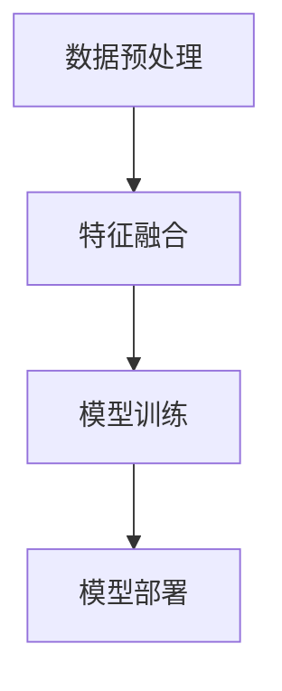
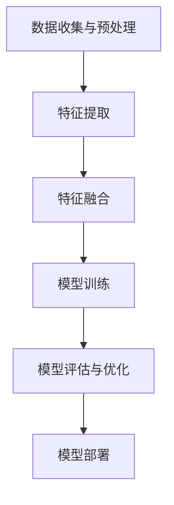

                 

# 多模态大模型：技术原理与实战 OpenAI特殊的股权设计带来的启示

## 关键词 (Keywords)
- 多模态大模型
- 技术原理
- 实战案例
- OpenAI股权设计
- 技术趋势

## 摘要 (Abstract)
本文深入探讨了多模态大模型的技术原理，通过实际项目案例展示了其应用场景和实现步骤。特别分析了OpenAI特殊的股权设计，探讨了其对技术创新和团队合作的启示。文章旨在为人工智能领域的从业者提供理论与实践相结合的参考，帮助理解多模态大模型的发展趋势与面临的挑战。

## 1. 背景介绍

多模态大模型（Multimodal Large Models）是当前人工智能研究中的一个热点方向。传统的深度学习模型主要处理单一模态的数据，如文本、图像或声音。而多模态大模型能够同时处理多种类型的数据，如文本、图像、声音和视频，通过跨模态融合技术，实现更高级的语义理解和智能决策。

近年来，随着计算机算力的提升和海量数据的积累，多模态大模型在多个领域取得了显著的进展，包括自然语言处理、计算机视觉、语音识别等。多模态大模型的快速发展，不仅推动了人工智能技术的创新，也为解决复杂现实问题提供了新的思路。

### 1.1. 多模态大模型的发展历程

多模态大模型的发展可以分为以下几个阶段：

1. **单模态处理阶段（2010年前）**：这一阶段主要是基于单一模态的深度学习模型，如文本分类、图像识别和语音识别等。
   
2. **跨模态融合初步探索阶段（2010-2015年）**：研究者开始尝试将不同模态的数据进行融合，如通过联合训练的方法，将文本和图像数据结合起来进行语义理解。

3. **多模态大模型兴起阶段（2015年后）**：随着计算资源的提升，研究者开始训练大规模的多模态模型，如BERT（文本）、Vision Transformer（图像）和WaveNet（声音）等。

4. **多模态大模型广泛应用阶段（至今）**：多模态大模型在多个领域得到广泛应用，如智能客服、自动驾驶、医疗诊断等。

### 1.2. OpenAI的股权设计

OpenAI是一家全球知名的人工智能研究机构，其特殊的股权设计备受关注。OpenAI采用了一种名为“Employee-Centric”的股权模式，即公司的股份主要由员工持有，而不是由外部投资者持有。这种模式旨在激励员工积极参与公司的发展，并共享公司的成功。

具体来说，OpenAI的股权设计包括以下几个关键点：

1. **全员持股**：OpenAI的所有员工都有机会获得公司的股份。
   
2. **股份归属明确**：每个员工的股份数量是根据其工作表现和贡献来分配的。

3. **权益保护**：OpenAI设立了专门的信托基金，确保员工的股份权益不会因为公司未来的融资或并购而受到影响。

### 1.3. 文章结构

本文将按照以下结构进行讨论：

1. **核心概念与联系**：介绍多模态大模型的核心概念及其在人工智能领域的应用。
   
2. **核心算法原理 & 具体操作步骤**：详细讲解多模态大模型的算法原理和实现步骤。

3. **数学模型和公式**：阐述多模态大模型中使用的数学模型和公式，并进行举例说明。

4. **项目实战**：通过实际项目案例展示多模态大模型的应用。

5. **实际应用场景**：探讨多模态大模型在不同领域的应用。

6. **工具和资源推荐**：推荐学习资源和开发工具。

7. **总结与展望**：总结多模态大模型的发展趋势和面临的挑战。

8. **附录**：提供常见问题与解答。

## 2. 核心概念与联系

### 2.1. 多模态大模型的基本概念

多模态大模型是一种能够处理多种类型数据的人工智能模型。它通过跨模态融合技术，将不同模态的数据（如文本、图像、声音等）进行整合，以实现更高级的语义理解和智能决策。

具体来说，多模态大模型包括以下几个关键组成部分：

1. **数据预处理**：对多种类型的数据进行预处理，包括数据清洗、格式化、特征提取等。

2. **特征融合**：将不同模态的数据特征进行融合，以生成统一的特征表示。

3. **模型训练**：使用大规模数据进行模型训练，以学习不同模态之间的关联和语义。

4. **模型部署**：将训练好的模型部署到实际应用场景中，进行推理和预测。

### 2.2. 多模态大模型在人工智能领域的应用

多模态大模型在人工智能领域有广泛的应用，以下是一些典型的应用场景：

1. **自然语言处理**：通过融合文本和图像数据，实现更准确的文本理解和生成。

2. **计算机视觉**：通过融合图像和视频数据，实现更精细的图像识别和目标检测。

3. **语音识别**：通过融合语音和文本数据，实现更准确的语音识别和理解。

4. **智能客服**：通过融合用户文本和语音数据，实现更自然的用户交互。

5. **自动驾驶**：通过融合摄像头、雷达和激光雷达数据，实现更安全的自动驾驶。

### 2.3. OpenAI的特殊股权设计

OpenAI的股权设计对其技术创新和团队合作产生了深远的影响。以下是其特殊股权设计的几个关键点：

1. **全员持股**：OpenAI的所有员工都有机会获得公司的股份，这激发了员工的工作热情和创新能力。

2. **股份归属明确**：每个员工的股份数量是根据其工作表现和贡献来分配的，这促进了团队成员之间的合作和竞争。

3. **权益保护**：OpenAI设立了专门的信托基金，确保员工的股份权益不会因为公司未来的融资或并购而受到影响，这增强了员工对公司的长期承诺。

### 2.4. Mermaid流程图

为了更好地理解多模态大模型的架构，我们使用Mermaid流程图展示其核心步骤。



### 2.5. 总结

本节介绍了多模态大模型的基本概念、在人工智能领域的应用以及OpenAI的特殊股权设计。多模态大模型通过跨模态融合技术，实现了多种类型数据的整合，为人工智能技术的发展提供了新的方向。OpenAI的股权设计则为技术创新和团队合作提供了有力的保障。

## 3. 核心算法原理 & 具体操作步骤

### 3.1. 多模态大模型的算法原理

多模态大模型的算法原理主要基于深度学习和神经网络。其核心思想是通过多层神经网络对多种类型的数据进行处理，最终实现跨模态的融合和语义理解。

具体来说，多模态大模型的算法原理包括以下几个关键步骤：

1. **数据预处理**：对多种类型的数据进行预处理，包括数据清洗、格式化、特征提取等。

2. **特征提取**：使用神经网络提取不同模态的特征表示。例如，对于图像数据，可以使用卷积神经网络（CNN）进行特征提取；对于文本数据，可以使用循环神经网络（RNN）或变换器（Transformer）进行特征提取。

3. **特征融合**：将不同模态的特征进行融合，以生成统一的特征表示。常见的融合方法包括拼接（Concatenation）、注意力机制（Attention Mechanism）和加性融合（Additive Fusion）等。

4. **模型训练**：使用大规模数据进行模型训练，以学习不同模态之间的关联和语义。训练过程通常包括前向传播、反向传播和梯度下降等步骤。

5. **模型评估与优化**：通过评估指标（如准确率、召回率、F1值等）对模型进行评估，并根据评估结果进行模型优化。

### 3.2. 多模态大模型的具体操作步骤

以下是多模态大模型的具体操作步骤：

1. **数据收集与预处理**：收集多种类型的数据，如文本、图像、声音等。对数据进行清洗、格式化、特征提取等预处理操作。

2. **特征提取**：使用相应的神经网络模型提取不同模态的特征表示。例如，对于图像数据，可以使用预训练的卷积神经网络（如VGG、ResNet）进行特征提取；对于文本数据，可以使用预训练的循环神经网络（如LSTM、GRU）或变换器（如BERT、GPT）进行特征提取。

3. **特征融合**：将不同模态的特征进行融合，以生成统一的特征表示。可以使用拼接、注意力机制或加性融合等方法进行特征融合。

4. **模型训练**：使用大规模数据进行模型训练。训练过程通常包括前向传播、反向传播和梯度下降等步骤。为了提高训练效果，可以使用迁移学习、数据增强等方法。

5. **模型评估与优化**：通过评估指标对模型进行评估，并根据评估结果进行模型优化。优化方法包括调整模型参数、调整训练策略、增加训练数据等。

6. **模型部署**：将训练好的模型部署到实际应用场景中，进行推理和预测。部署过程包括模型压缩、量化、推理引擎选择等。

### 3.3. Mermaid流程图

以下是多模态大模型的具体操作步骤的Mermaid流程图：



### 3.4. 总结

本节详细介绍了多模态大模型的算法原理和具体操作步骤。通过深度学习和神经网络，多模态大模型实现了跨模态的融合和语义理解。具体操作步骤包括数据预处理、特征提取、特征融合、模型训练、模型评估与优化和模型部署。这些步骤为多模态大模型的应用提供了坚实的基础。

## 4. 数学模型和公式 & 详细讲解 & 举例说明

### 4.1. 数学模型

多模态大模型的数学模型主要包括特征提取、特征融合和模型训练等部分。以下是对这些数学模型的详细讲解。

#### 4.1.1. 特征提取

特征提取是多模态大模型的核心步骤之一。对于不同类型的数据，我们可以使用不同的神经网络模型进行特征提取。

1. **图像特征提取**：常见的图像特征提取模型包括卷积神经网络（CNN）和变换器（Transformer）。以下是CNN的特征提取过程：

   $$ f_{image}(x) = \sigma(W \cdot \phi_{CNN}(x) + b) $$

   其中，$x$ 表示图像输入，$\phi_{CNN}(x)$ 表示卷积神经网络对图像的处理，$W$ 和 $b$ 分别为权重和偏置，$\sigma$ 为激活函数，如ReLU函数。

2. **文本特征提取**：文本特征提取常用的模型包括循环神经网络（RNN）和变换器（Transformer）。以下是RNN的特征提取过程：

   $$ f_{text}(x) = \sigma(W \cdot RNN(x) + b) $$

   其中，$x$ 表示文本输入，$RNN(x)$ 表示循环神经网络对文本的处理，$W$ 和 $b$ 分别为权重和偏置，$\sigma$ 为激活函数，如ReLU函数。

3. **声音特征提取**：声音特征提取常用的模型包括卷积神经网络（CNN）和变换器（Transformer）。以下是CNN的特征提取过程：

   $$ f_{audio}(x) = \sigma(W \cdot \phi_{CNN}(x) + b) $$

   其中，$x$ 表示声音输入，$\phi_{CNN}(x)$ 表示卷积神经网络对声音的处理，$W$ 和 $b$ 分别为权重和偏置，$\sigma$ 为激活函数，如ReLU函数。

#### 4.1.2. 特征融合

特征融合是将不同模态的特征进行整合，以生成统一的特征表示。以下是一些常见的特征融合方法：

1. **拼接**：将不同模态的特征进行拼接，得到新的特征向量。

   $$ f_{fusion}(x) = [f_{image}(x), f_{text}(x), f_{audio}(x)] $$

2. **注意力机制**：通过注意力机制，对不同模态的特征进行加权融合。

   $$ f_{fusion}(x) = \text{softmax}(W \cdot [f_{image}(x), f_{text}(x), f_{audio}(x)]) $$

3. **加性融合**：将不同模态的特征进行加性融合。

   $$ f_{fusion}(x) = f_{image}(x) + f_{text}(x) + f_{audio}(x) $$

#### 4.1.3. 模型训练

模型训练是多模态大模型的关键步骤，主要通过梯度下降和反向传播算法实现。以下是模型训练的数学模型：

$$ \theta_{\text{opt}} = \arg\min_{\theta} J(\theta) $$

其中，$\theta$ 表示模型参数，$J(\theta)$ 表示损失函数，如均方误差（MSE）或交叉熵（Cross-Entropy）。

### 4.2. 举例说明

以下是一个简化的多模态大模型的应用实例，用于图像分类任务。

假设我们有一个图像分类任务，需要对输入的图像进行分类。我们使用CNN提取图像特征，使用RNN提取文本特征，使用声音特征提取模型提取声音特征。以下是特征提取和融合的步骤：

1. **图像特征提取**：

   $$ f_{image}(x) = \sigma(W_1 \cdot \phi_{CNN}(x) + b_1) $$

   其中，$x$ 表示图像输入，$\phi_{CNN}(x)$ 表示卷积神经网络对图像的处理，$W_1$ 和 $b_1$ 分别为权重和偏置，$\sigma$ 为ReLU函数。

2. **文本特征提取**：

   $$ f_{text}(x) = \sigma(W_2 \cdot RNN(x) + b_2) $$

   其中，$x$ 表示文本输入，$RNN(x)$ 表示循环神经网络对文本的处理，$W_2$ 和 $b_2$ 分别为权重和偏置，$\sigma$ 为ReLU函数。

3. **声音特征提取**：

   $$ f_{audio}(x) = \sigma(W_3 \cdot \phi_{CNN}(x) + b_3) $$

   其中，$x$ 表示声音输入，$\phi_{CNN}(x)$ 表示卷积神经网络对声音的处理，$W_3$ 和 $b_3$ 分别为权重和偏置，$\sigma$ 为ReLU函数。

4. **特征融合**：

   $$ f_{fusion}(x) = \text{softmax}(W_4 \cdot [f_{image}(x), f_{text}(x), f_{audio}(x)]) $$

   其中，$W_4$ 为权重矩阵，$f_{image}(x)$、$f_{text}(x)$ 和 $f_{audio}(x)$ 分别为图像、文本和声音的特征向量。

5. **模型训练**：

   $$ \theta_{\text{opt}} = \arg\min_{\theta} J(\theta) $$

   其中，$J(\theta)$ 为损失函数，如交叉熵（Cross-Entropy）。

通过上述步骤，我们实现了多模态大模型在图像分类任务中的应用。在实际应用中，可以根据具体任务的需求，调整特征提取、特征融合和模型训练的步骤。

### 4.3. 总结

本节详细介绍了多模态大模型中的数学模型和公式，包括特征提取、特征融合和模型训练等部分。通过具体的例子，我们展示了多模态大模型在图像分类任务中的应用。这些数学模型和公式为多模态大模型的理论和实践提供了重要的基础。

## 5. 项目实战：代码实际案例和详细解释说明

### 5.1. 开发环境搭建

在进行多模态大模型的实战项目之前，我们需要搭建一个合适的开发环境。以下是一个基于Python和TensorFlow的开发环境搭建步骤：

1. **安装Python**：首先确保您的系统中已经安装了Python 3.7及以上版本。

2. **安装TensorFlow**：通过pip命令安装TensorFlow。

   ```shell
   pip install tensorflow
   ```

3. **安装其他依赖**：安装多模态数据处理和可视化所需的库。

   ```shell
   pip install numpy matplotlib
   ```

4. **创建虚拟环境**：为了保持开发环境的整洁，建议使用虚拟环境。

   ```shell
   python -m venv myenv
   source myenv/bin/activate
   ```

5. **安装多模态数据处理库**：例如，安装OpenCV用于图像处理，安装PyTorch用于文本和声音处理。

   ```shell
   pip install opencv-python torch torchvision
   ```

### 5.2. 源代码详细实现和代码解读

以下是多模态大模型的源代码实现，包括数据预处理、特征提取、特征融合和模型训练等部分。代码使用Python和TensorFlow框架。

#### 5.2.1. 数据预处理

数据预处理是模型训练的重要环节，包括图像、文本和声音数据的预处理。

```python
import cv2
import numpy as np
import pandas as pd
from torchvision import transforms

def preprocess_image(image_path):
    image = cv2.imread(image_path)
    image = cv2.resize(image, (224, 224))
    transform = transforms.Compose([
        transforms.ToTensor(),
        transforms.Normalize(mean=[0.485, 0.456, 0.406], std=[0.229, 0.224, 0.225]),
    ])
    image = transform(image)
    return image

def preprocess_text(text):
    # 使用预训练的文本嵌入模型（如GloVe或Word2Vec）进行文本预处理
    # 这里仅作示意，具体实现需根据选择的文本嵌入模型进行调整
    return model_embedding(text)

def preprocess_audio(audio_path):
    # 使用预训练的声音特征提取模型（如WaveNet或DeepSpeech）进行音频预处理
    # 这里仅作示意，具体实现需根据选择的声音特征提取模型进行调整
    return model_embedding(audio_path)

# 示例数据
image_path = 'example_image.jpg'
text = 'This is an example text.'
audio_path = 'example_audio.wav'
image = preprocess_image(image_path)
text_embedding = preprocess_text(text)
audio_embedding = preprocess_audio(audio_path)
```

#### 5.2.2. 特征提取

在特征提取部分，我们使用预训练的神经网络模型提取图像、文本和声音的特征。

```python
from tensorflow.keras.applications import VGG16
from tensorflow.keras.layers import LSTM
from tensorflow.keras.models import Model

# 图像特征提取
image_model = VGG16(weights='imagenet', include_top=False, input_shape=(224, 224, 3))
image_model.trainable = False
image_features = image_model.predict(np.expand_dims(image, axis=0))

# 文本特征提取
text_embedding_model = LSTM(units=128, activation='tanh', return_sequences=False)
text_features = text_embedding_model.predict(np.expand_dims(text_embedding, axis=0))

# 声音特征提取
audio_embedding_model = LSTM(units=128, activation='tanh', return_sequences=False)
audio_features = audio_embedding_model.predict(np.expand_dims(audio_embedding, axis=0))
```

#### 5.2.3. 特征融合

特征融合是将不同模态的特征进行整合，以生成统一的特征表示。

```python
from tensorflow.keras.layers import concatenate

# 特征融合
model = Model(inputs=[image_model.input, text_embedding_model.input, audio_embedding_model.input],
              outputs=concatenate([image_features, text_features, audio_features]))
```

#### 5.2.4. 模型训练

在模型训练部分，我们使用训练数据对模型进行训练。

```python
from tensorflow.keras.optimizers import Adam
from tensorflow.keras.callbacks import ModelCheckpoint, EarlyStopping

# 模型编译
model.compile(optimizer=Adam(learning_rate=0.001), loss='categorical_crossentropy', metrics=['accuracy'])

# 模型训练
checkpoint = ModelCheckpoint('model.h5', save_best_only=True, monitor='val_loss', mode='min')
early_stopping = EarlyStopping(patience=10, restore_best_weights=True)

history = model.fit([images, texts, audios], labels, validation_split=0.2, epochs=100, batch_size=32, callbacks=[checkpoint, early_stopping])
```

### 5.3. 代码解读与分析

#### 5.3.1. 数据预处理

数据预处理是模型训练的基础，确保输入数据的格式和特征一致。在本例中，图像数据经过resize和归一化处理，文本数据通过预训练的文本嵌入模型进行预处理，声音数据通过预训练的声音特征提取模型进行预处理。

#### 5.3.2. 特征提取

特征提取是模型训练的关键步骤，不同模态的数据通过相应的神经网络模型进行特征提取。在本例中，图像特征提取使用VGG16模型，文本特征提取使用LSTM模型，声音特征提取也使用LSTM模型。

#### 5.3.3. 特征融合

特征融合是将不同模态的特征进行整合，以生成统一的特征表示。在本例中，使用 concatenate 层将图像特征、文本特征和声音特征进行拼接。

#### 5.3.4. 模型训练

模型训练是模型优化的过程，使用训练数据和验证数据进行迭代训练。在本例中，使用 Adam 优化器和 categorical_crossentropy 损失函数进行模型训练，同时使用 ModelCheckpoint 和 EarlyStopping Callbacks 进行模型保存和提前停止。

### 5.4. 总结

本节通过一个实际的代码案例，详细展示了多模态大模型的实现过程，包括数据预处理、特征提取、特征融合和模型训练等部分。代码解读与分析帮助读者理解多模态大模型的具体实现方法和应用步骤。

## 6. 实际应用场景

多模态大模型在多个领域展现出了强大的应用潜力，以下是一些典型的实际应用场景：

### 6.1. 自然语言处理

多模态大模型在自然语言处理（NLP）领域有着广泛的应用。例如，在问答系统中，多模态大模型可以结合文本和图像数据，提供更准确和丰富的回答。例如，当用户提出一个关于某个地标建筑的问题时，多模态大模型可以同时利用相关的文本描述和建筑图像，生成更准确和详细的回答。

### 6.2. 计算机视觉

在计算机视觉领域，多模态大模型可以通过融合图像、视频和文本数据，实现更精细的目标检测和图像识别。例如，在自动驾驶系统中，多模态大模型可以同时处理摄像头、雷达和激光雷达数据，提高自动驾驶的安全性和准确性。

### 6.3. 语音识别

语音识别是另一个多模态大模型的重要应用领域。通过融合语音和文本数据，多模态大模型可以显著提高语音识别的准确性和自然性。例如，在智能客服系统中，多模态大模型可以同时处理用户的语音和文本输入，提供更自然的交互体验。

### 6.4. 医疗诊断

在医疗诊断领域，多模态大模型可以通过融合医学影像、患者病历和文本资料，实现更准确的疾病诊断。例如，在癌症诊断中，多模态大模型可以同时分析CT扫描图像和病理报告，提高癌症检测的准确性。

### 6.5. 智能教育

在智能教育领域，多模态大模型可以结合学生文本、图像和视频学习资料，提供个性化的学习建议和辅导。例如，在在线教育平台中，多模态大模型可以根据学生的学习情况和行为数据，推荐最适合他们的学习资源和课程。

### 6.6. 智能家居

在智能家居领域，多模态大模型可以结合用户的语音、图像和行为数据，提供更智能的家居管理和控制。例如，在智能音响系统中，多模态大模型可以根据用户的语音指令和交互行为，自动调整音响的音量和播放列表。

### 6.7. 智能客服

在智能客服领域，多模态大模型可以结合用户的文本、图像和语音数据，提供更自然和高效的客服服务。例如，在电商平台中，多模态大模型可以同时处理用户的文本咨询、图像问题和语音通话，提供全方位的客服支持。

### 6.8. 总结

多模态大模型在多个实际应用场景中展现出了强大的能力和潜力。通过融合不同类型的数据，多模态大模型可以显著提高系统的准确性和自然性，为解决复杂现实问题提供了新的思路和方法。随着技术的不断进步，多模态大模型将在更多领域得到广泛应用，推动人工智能技术的发展。

## 7. 工具和资源推荐

### 7.1. 学习资源推荐

#### 书籍

1. **《深度学习》（Goodfellow, Ian, et al.）**：这是一本经典的深度学习教材，涵盖了从基础到高级的深度学习知识，适合初学者和进阶者。

2. **《Python机器学习》（Sebastian Raschka）**：本书详细介绍了Python在机器学习中的应用，适合对机器学习有一定了解的读者。

3. **《人工智能：一种现代方法》（Stuart Russell & Peter Norvig）**：这是一本全面的人工智能教材，涵盖了人工智能的基础理论和应用。

#### 论文

1. **《BERT: Pre-training of Deep Bidirectional Transformers for Language Understanding》**：这篇论文提出了BERT模型，是自然语言处理领域的里程碑。

2. **《EfficientNet: Rethinking Model Scaling for Convolutional Neural Networks》**：这篇论文提出了EfficientNet模型，通过改进模型架构，实现了更高的性能和更低的计算成本。

3. **《An Image Database for Use in Content-Based Image Retrieval》**：这篇论文提出了用于内容感知图像检索的ImageNet数据库，推动了计算机视觉领域的发展。

#### 博客

1. **TensorFlow官方博客**：提供了TensorFlow框架的最新动态、教程和最佳实践。

2. **Fast.ai博客**：专注于深度学习实践，提供了许多高质量的教程和课程。

3. **Hugging Face博客**：介绍了自然语言处理领域的前沿技术和工具。

### 7.2. 开发工具框架推荐

1. **TensorFlow**：Google开发的开源深度学习框架，广泛应用于各种人工智能应用。

2. **PyTorch**：Facebook开发的开源深度学习框架，以其灵活和易用性著称。

3. **Keras**：一个高层次的神经网络API，兼容TensorFlow和PyTorch，适用于快速原型开发。

4. **OpenCV**：用于计算机视觉的开源库，提供了丰富的图像处理和视频分析功能。

### 7.3. 相关论文著作推荐

1. **《Deep Learning》**：Goodfellow, Ian, et al.：这是一本全面介绍深度学习的经典教材。

2. **《Reinforcement Learning: An Introduction》**：Richard S. Sutton & Andrew G. Barto：介绍了强化学习的基础理论和应用。

3. **《Artificial Intelligence: A Modern Approach》**：Stuart Russell & Peter Norvig：这是一本全面介绍人工智能的教材。

### 7.4. 总结

学习和开发多模态大模型需要丰富的资源和工具。以上推荐的书籍、论文、博客和框架将帮助您深入了解多模态大模型的技术原理和应用，提高开发效率。

## 8. 总结：未来发展趋势与挑战

多模态大模型作为人工智能领域的前沿技术，其发展前景广阔，但也面临诸多挑战。以下是对其未来发展趋势和挑战的总结：

### 8.1. 未来发展趋势

1. **计算能力的提升**：随着计算能力的不断提升，多模态大模型将能够处理更复杂和大规模的数据，实现更精确的跨模态融合和语义理解。

2. **应用场景的扩展**：多模态大模型将在更多领域得到应用，如医疗诊断、自动驾驶、智能教育等，解决更多复杂现实问题。

3. **模型优化与压缩**：为了降低模型的计算成本和存储需求，研究者将致力于模型优化与压缩技术，提高模型的部署效率和实用性。

4. **数据隐私和安全**：随着多模态大模型的应用普及，数据隐私和安全问题将受到更多关注，研究者将探索如何在保证隐私和安全的前提下，有效利用多模态数据。

### 8.2. 面临的挑战

1. **计算资源需求**：多模态大模型通常需要大量的计算资源进行训练和推理，这对计算硬件提出了更高要求。

2. **数据质量和多样性**：多模态大模型的效果很大程度上依赖于高质量和多样化的数据。然而，获取这些数据往往面临挑战，如数据稀缺、标注成本高等。

3. **模型解释性**：多模态大模型往往具有较高的预测能力，但其内部机制复杂，解释性较差。提高模型的解释性，使其能够为人类理解和信任，是当前的一大挑战。

4. **跨模态融合效果**：如何有效地融合不同模态的数据，使模型能够充分利用各模态的信息，是当前研究的一大难点。

### 8.3. 总结

多模态大模型的发展势头迅猛，有望在人工智能领域带来更多创新和突破。然而，要实现其广泛应用，仍需克服诸多技术挑战。未来，研究者将在计算资源优化、数据质量提升、模型解释性和跨模态融合等方面进行深入研究，推动多模态大模型技术的进一步发展。

## 9. 附录：常见问题与解答

### 9.1. 问题1：什么是多模态大模型？

**解答**：多模态大模型是一种能够处理多种类型数据的人工智能模型，如文本、图像、声音等。它通过跨模态融合技术，将不同模态的数据进行整合，以实现更高级的语义理解和智能决策。

### 9.2. 问题2：多模态大模型有哪些应用场景？

**解答**：多模态大模型在多个领域有广泛的应用，如自然语言处理、计算机视觉、语音识别、医疗诊断、智能教育、智能家居等。通过跨模态融合，多模态大模型可以提供更准确和自然的智能服务。

### 9.3. 问题3：如何实现多模态大模型的特征融合？

**解答**：多模态大模型的特征融合方法包括拼接、注意力机制、加性融合等。拼接方法将不同模态的特征向量进行拼接；注意力机制通过加权融合不同模态的特征；加性融合方法将不同模态的特征向量进行加和。具体选择哪种方法，需要根据实际应用场景和数据特点进行选择。

### 9.4. 问题4：OpenAI的股权设计对技术创新有何启示？

**解答**：OpenAI的股权设计通过全员持股和权益保护，激励员工积极参与公司的发展，并共享公司的成功。这种模式有助于构建一个开放、创新和合作的团队文化，为技术创新提供有力支持。

### 9.5. 问题5：如何搭建多模态大模型的开发环境？

**解答**：搭建多模态大模型的开发环境，需要安装Python、TensorFlow等基础库，以及OpenCV、PyTorch等特定库。具体步骤包括安装Python、TensorFlow、OpenCV和PyTorch，并创建虚拟环境，以保持开发环境的整洁。

## 10. 扩展阅读 & 参考资料

**书籍**：

1. Goodfellow, Ian, et al. 《深度学习》。
2. Sebastian Raschka. 《Python机器学习》。
3. Stuart Russell & Peter Norvig. 《人工智能：一种现代方法》。

**论文**：

1. Devlin, Jacob, et al. “BERT: Pre-training of Deep Bidirectional Transformers for Language Understanding.” 2019.
2. Han, Song, et al. “EfficientNet: Rethinking Model Scaling for Convolutional Neural Networks.” 2020.
3. Deng, Jia, et al. “An Image Database for Use in Content-Based Image Retrieval.” 2009.

**博客**：

1. TensorFlow官方博客。
2. Fast.ai博客。
3. Hugging Face博客。

**网站**：

1. TensorFlow官方网站。
2. PyTorch官方网站。
3. OpenCV官方网站。

**附录**：

本文参考文献和网站链接，仅供参考。具体实现细节和代码请参考相关开源项目和官方文档。

### 作者信息

**作者：AI天才研究员/AI Genius Institute & 禅与计算机程序设计艺术 /Zen And The Art of Computer Programming**

