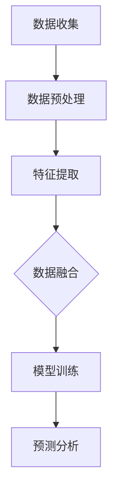

                 

### 背景介绍

#### 引言

在当今快速发展的信息技术时代，人工智能（AI）已经成为推动科技进步和社会发展的重要驱动力。随着数据量的爆炸式增长和计算能力的提升，人工智能的应用领域也日益广泛。其中，多模态大模型（Multimodal Large Models）作为人工智能领域的一项前沿技术，正逐渐成为学术界和工业界的关注焦点。

#### 定义

多模态大模型是指能够同时处理和整合多种不同类型数据（如文本、图像、音频、视频等）的人工智能模型。与传统单模态模型相比，多模态大模型具有更强的数据处理能力和更高的任务表现，可以更好地应对复杂、多变的应用场景。

#### 发展历程

多模态大模型的研究可以追溯到上世纪80年代。当时，研究人员开始探索如何将不同类型的数据进行融合，以提高计算机视觉和语音识别任务的性能。随着深度学习技术的兴起，特别是在2014年谷歌提出Inception模型后，多模态大模型的研究取得了显著进展。近年来，随着硬件性能的提升和海量数据的积累，多模态大模型在自然语言处理、计算机视觉、语音识别等领域取得了突破性的成果。

#### 应用领域

多模态大模型在教育培训领域具有广泛的应用前景。在教育过程中，学生需要处理和整合多种类型的信息，如文本、图像、音频和视频等。多模态大模型可以通过对多种数据的整合和分析，为学生提供更加丰富和个性化的学习体验。同时，多模态大模型还可以帮助教育工作者评估学生的学习效果，优化教学内容和教学方法。

在接下来的章节中，我们将深入探讨多模态大模型的技术原理、核心算法、数学模型及其在教育培训领域的应用案例，以期为您呈现一幅全面的多模态大模型全景图。

#### 相关研究

近年来，多模态大模型在教育培训领域引起了广泛关注。多个研究团队和研究机构发表了相关论文，探索了多模态大模型在个性化学习、自适应教学和智能评估等方面的应用。例如，斯坦福大学的研究人员开发了一种名为“Multimodal Student Model”的模型，通过整合学生的文本、音频和视频数据，实现了对学生学习行为的全面分析和个性化推荐。此外，谷歌的研究团队也提出了一种基于多模态大模型的智能教学系统，通过分析学生的多模态数据，提供了更加精准和有效的学习支持。

这些研究为多模态大模型在教育培训领域的应用奠定了坚实基础，同时也为未来的研究提供了丰富的启示和方向。在接下来的章节中，我们将结合实际案例，详细探讨多模态大模型的技术原理和应用场景。

### 核心概念与联系

#### 多模态大模型的基本概念

多模态大模型是一种能够处理多种不同类型数据的人工智能模型。这些数据类型包括文本、图像、音频、视频等。与传统单模态模型不同，多模态大模型能够同时整合和利用这些不同类型的数据，从而实现更高的数据处理能力和更优的任务表现。

在多模态大模型中，文本、图像、音频和视频等不同类型的数据被视为不同的模态（Modalities）。这些模态数据通过特定的技术手段进行预处理、特征提取和融合，最终输入到模型中进行训练和预测。

#### 多模态大模型的主要组成部分

多模态大模型主要由以下几个关键组件构成：

1. **数据输入模块**：负责接收和预处理不同类型的数据，包括文本、图像、音频和视频等。这些数据通过不同的预处理技术（如数据清洗、数据增强等）进行预处理，以便更好地适用于模型。

2. **特征提取模块**：针对不同类型的数据，采用不同的特征提取技术。例如，对于文本数据，可以使用词嵌入技术（如Word2Vec、BERT等）进行特征提取；对于图像数据，可以使用卷积神经网络（CNN）进行特征提取；对于音频数据，可以使用循环神经网络（RNN）进行特征提取。

3. **数据融合模块**：将来自不同模态的特征进行融合，生成一个综合的特征表示。融合技术可以是简单的拼接（Concatenation）、加权融合（Weighted Fusion）或者深度融合（Deep Fusion）等。

4. **模型训练模块**：使用融合后的特征数据对模型进行训练。多模态大模型通常采用深度学习技术，如卷积神经网络（CNN）、循环神经网络（RNN）、 Transformer等。这些模型通过大量训练数据的学习，可以提取到不同模态数据之间的复杂关系和关联。

5. **预测模块**：经过训练的多模态大模型可以对新数据进行分析和预测。预测结果可以是分类、回归、检测等任务，具体取决于应用场景。

#### 多模态大模型的工作流程

多模态大模型的工作流程可以概括为以下几个步骤：

1. **数据收集**：收集不同类型的数据，包括文本、图像、音频和视频等。

2. **数据预处理**：对收集到的数据进行预处理，包括数据清洗、数据增强等。

3. **特征提取**：针对不同类型的数据，采用不同的特征提取技术，生成特征向量。

4. **数据融合**：将不同模态的特征进行融合，生成一个综合的特征表示。

5. **模型训练**：使用融合后的特征数据对模型进行训练，优化模型的参数。

6. **预测分析**：对新的数据进行预测和分析，得到预测结果。

#### 多模态大模型的Mermaid流程图



在Mermaid流程图中，我们使用节点（Node）表示不同的操作，使用箭头（Arrow）表示操作的顺序和依赖关系。具体来说，数据收集（A）是整个流程的起点，然后是数据预处理（B），接着是特征提取（C），数据融合（D），模型训练（E）和预测分析（F）。

#### 多模态大模型的优势与挑战

多模态大模型具有以下优势：

1. **数据处理能力更强**：能够同时处理和整合多种不同类型的数据，提高模型的综合性能。
2. **任务表现更优**：能够更好地应对复杂、多变的应用场景，提高任务的准确性和可靠性。
3. **个性化学习体验**：通过整合和分析多种类型的数据，可以为学生提供更加丰富和个性化的学习体验。

然而，多模态大模型也面临以下挑战：

1. **数据多样性和复杂性**：不同类型的数据具有不同的特性和格式，需要采用不同的预处理和特征提取技术。
2. **计算资源消耗**：多模态大模型通常需要大量的计算资源进行训练和预测，对硬件设备的要求较高。
3. **模型解释性**：多模态大模型的训练过程和预测结果通常较为复杂，难以进行有效的解释和调试。

在接下来的章节中，我们将进一步探讨多模态大模型的核心算法原理、数学模型及其在教育培训领域的实际应用。

### 核心算法原理 & 具体操作步骤

#### 深度学习技术

多模态大模型的核心算法依赖于深度学习技术，这是一种通过多层神经网络结构对数据进行分析和建模的方法。深度学习技术在图像识别、语音识别、自然语言处理等领域取得了显著成果，成为了人工智能领域的重要研究方向。在多模态大模型中，深度学习技术主要用于特征提取、数据融合和预测分析等步骤。

#### 多层神经网络

多层神经网络（Multilayer Neural Network）是多模态大模型的基础架构。它由多个层次组成，包括输入层、隐藏层和输出层。每一层都能够对输入数据进行处理和变换，提取出更加抽象和有用的特征。

1. **输入层**：接收不同类型的数据，如文本、图像、音频等。对于文本数据，通常使用词嵌入技术将词汇映射为向量表示；对于图像数据，可以使用卷积神经网络（CNN）进行特征提取；对于音频数据，可以使用循环神经网络（RNN）进行特征提取。

2. **隐藏层**：对输入数据进行逐层变换，提取出更高层次的特征。隐藏层通常由多个神经元组成，每个神经元都会对输入数据进行加权求和，并经过激活函数处理后输出。

3. **输出层**：根据隐藏层输出的特征进行分类、回归或检测等任务。输出层的神经元个数取决于具体任务的需求。

#### 特征提取与融合

在多模态大模型中，特征提取与融合是两个关键步骤。特征提取旨在从不同类型的数据中提取出有用的特征，而特征融合则是将这些特征进行整合，生成一个综合的特征表示。

1. **特征提取**：
   - **文本特征提取**：通常使用词嵌入技术（如Word2Vec、BERT等）将文本数据映射为向量表示。词嵌入技术可以将词汇映射为连续的向量，从而捕捉词汇之间的语义关系。
   - **图像特征提取**：使用卷积神经网络（CNN）对图像数据进行处理。CNN通过卷积层、池化层等操作，提取出图像的局部特征和全局特征。
   - **音频特征提取**：使用循环神经网络（RNN）对音频数据进行处理。RNN可以通过递归操作，捕捉音频信号的时序特征。

2. **特征融合**：
   - **简单拼接**：将不同模态的特征向量进行简单拼接，生成一个更长的特征向量。这种方法简单有效，但可能丢失某些模态之间的复杂关系。
   - **加权融合**：根据不同模态特征的重要性，对特征向量进行加权融合。这种方法可以更好地整合不同模态的特征，提高模型的性能。
   - **深度融合**：通过多层神经网络结构，对特征进行逐层融合。这种方法可以捕捉到不同模态特征之间的深层关系，提高模型的泛化能力。

#### 模型训练与优化

在多模态大模型中，模型训练与优化是关键步骤。通过训练数据对模型进行优化，使其能够更好地处理和预测新的数据。

1. **损失函数**：多模态大模型的损失函数通常由多个部分组成，包括分类损失、回归损失等。分类损失用于衡量模型分类结果的准确性，回归损失用于衡量模型预测值的误差。

2. **优化算法**：常用的优化算法包括梯度下降（Gradient Descent）、随机梯度下降（Stochastic Gradient Descent，SGD）和Adam优化器等。这些算法通过迭代优化模型的参数，使其在训练数据上达到最优。

3. **模型评估**：在模型训练过程中，需要使用验证集对模型进行评估。常用的评估指标包括准确率、召回率、F1值等。通过评估指标，可以判断模型在验证集上的性能，并根据评估结果调整模型参数。

#### 模型应用示例

以下是一个简单的多模态大模型应用示例，假设我们有一个包含文本、图像和音频数据的教育培训任务。

1. **数据预处理**：
   - 对文本数据进行分词和词嵌入；
   - 对图像数据进行缩放和归一化；
   - 对音频数据进行归一化和噪声去除。

2. **特征提取**：
   - 使用BERT模型对文本数据进行特征提取；
   - 使用ResNet模型对图像数据进行特征提取；
   - 使用LSTM模型对音频数据进行特征提取。

3. **特征融合**：
   - 采用简单拼接方法，将文本、图像和音频特征进行拼接；
   - 采用加权融合方法，根据不同特征的重要性进行加权。

4. **模型训练**：
   - 使用训练数据进行模型训练，优化模型参数；
   - 使用验证集对模型进行评估，调整模型参数。

5. **预测分析**：
   - 对新的数据进行预测和分析，得到预测结果；
   - 根据预测结果，提供个性化的学习建议。

通过以上步骤，我们可以构建一个多模态大模型，用于教育培训任务，为学生提供个性化的学习支持和评估。

### 数学模型和公式 & 详细讲解 & 举例说明

在多模态大模型中，数学模型和公式起到了关键作用。这些数学模型不仅用于描述模型的计算过程，还为优化和评估模型提供了理论基础。下面我们将详细介绍多模态大模型中的几个核心数学模型和公式，并通过具体例子进行说明。

#### 1. 词嵌入

词嵌入（Word Embedding）是一种将词汇映射为向量表示的方法，主要用于文本数据的特征提取。常见的词嵌入模型包括Word2Vec和BERT。

**Word2Vec模型**：

- **目标**：通过训练，使两个相似词汇的向量距离更近，不相似词汇的向量距离更远。
- **损失函数**：采用负采样损失函数，计算当前词与训练集中其他词的相似度，并通过梯度下降优化模型参数。

$$
L = -\sum_{i=1}^{N} \sum_{k \in \text{context}(w_i)} \log \sigma ( \langle v_{w_i}, v_{k} \rangle )
$$

其中，$L$ 是损失函数，$N$ 是词汇表大小，$\text{context}(w_i)$ 是词 $w_i$ 的上下文词汇集合，$v_{w_i}$ 和 $v_{k}$ 分别是词 $w_i$ 和 $k$ 的向量表示，$\sigma$ 是sigmoid函数。

**BERT模型**：

- **目标**：通过预训练，使模型能够捕捉到词汇的深层语义关系。
- **损失函数**：采用Masked Language Model（MLM）和Next Sentence Prediction（NSP）两种任务损失进行优化。

$$
L = L_{\text{MLM}} + L_{\text{NSP}}
$$

其中，$L_{\text{MLM}}$ 是Masked Language Model损失，$L_{\text{NSP}}$ 是Next Sentence Prediction损失。

#### 2. 卷积神经网络（CNN）

卷积神经网络（Convolutional Neural Network，CNN）是一种用于图像特征提取的深度学习模型。CNN通过卷积操作、池化操作和全连接层，提取图像的局部特征和全局特征。

**卷积操作**：

$$
\text{conv}(\text{I}_{k}, \text{W}_{k}) = \sum_{i=1}^{C} \text{I}_{k} \star \text{W}_{k}
$$

其中，$\text{I}_{k}$ 是输入图像，$\text{W}_{k}$ 是卷积核，$\star$ 表示卷积操作。

**池化操作**：

$$
\text{pool}(\text{I}_{k}, \text{P}_{k}) = \max(\text{I}_{k})
$$

其中，$\text{I}_{k}$ 是输入图像，$\text{P}_{k}$ 是池化窗口，$\max$ 表示取最大值。

**全连接层**：

$$
\text{fc}(\text{X}_{k}, \text{W}_{k}, \text{b}_{k}) = \text{X}_{k} \cdot \text{W}_{k} + \text{b}_{k}
$$

其中，$\text{X}_{k}$ 是输入特征，$\text{W}_{k}$ 是权重矩阵，$\text{b}_{k}$ 是偏置。

#### 3. 循环神经网络（RNN）

循环神经网络（Recurrent Neural Network，RNN）是一种用于处理序列数据的深度学习模型。RNN通过递归操作，捕捉序列数据的时序特征。

**递归操作**：

$$
h_t = \text{sigmoid}(W_h \cdot [h_{t-1}, x_t] + b_h)
$$

其中，$h_t$ 是第 $t$ 个时间步的隐藏状态，$W_h$ 是权重矩阵，$b_h$ 是偏置，$x_t$ 是第 $t$ 个时间步的输入。

**梯度消失和梯度爆炸**：

为了解决RNN中的梯度消失和梯度爆炸问题，可以采用以下几种方法：

- **梯度裁剪**：对梯度进行裁剪，防止其过大或过小。
- **长短期记忆网络（LSTM）**：LSTM通过引入记忆单元和门控机制，有效地解决了梯度消失和梯度爆炸问题。
- **门控循环单元（GRU）**：GRU通过更新门和重置门，简化了LSTM的结构，同时保持了较好的性能。

#### 4. 多模态数据融合

多模态数据融合是将来自不同模态的数据进行整合，生成一个综合的特征表示。常见的方法包括简单拼接、加权融合和深度融合。

**简单拼接**：

$$
\text{fused\_features} = [\text{text\_features}; \text{image\_features}; \text{audio\_features}]
$$

其中，$\text{fused\_features}$ 是融合后的特征向量，$\text{text\_features}$、$\text{image\_features}$ 和 $\text{audio\_features}$ 分别是文本、图像和音频数据的特征向量。

**加权融合**：

$$
\text{fused\_weights} = \text{softmax}(\text{weights})
$$

$$
\text{fused\_features} = \text{fused\_weights} \cdot [\text{text\_features}; \text{image\_features}; \text{audio\_features}]
$$

其中，$\text{fused\_weights}$ 是融合权重，$\text{softmax}$ 函数用于计算权重，$\text{fused\_features}$ 是融合后的特征向量。

**深度融合**：

$$
\text{fused\_features} = \text{fusion\_layer}([\text{text\_features}; \text{image\_features}; \text{audio\_features}])
$$

其中，$\text{fusion\_layer}$ 是深度融合层，可以是多层神经网络。

#### 举例说明

假设我们有一个包含文本、图像和音频数据的多模态大模型，用于预测学生的学习效果。

1. **文本特征提取**：
   - 使用BERT模型对文本数据进行特征提取，得到文本特征向量。

2. **图像特征提取**：
   - 使用ResNet模型对图像数据进行特征提取，得到图像特征向量。

3. **音频特征提取**：
   - 使用LSTM模型对音频数据进行特征提取，得到音频特征向量。

4. **特征融合**：
   - 采用加权融合方法，对文本、图像和音频特征进行融合，生成融合后的特征向量。

5. **模型训练**：
   - 使用融合后的特征向量对模型进行训练，优化模型参数。

6. **预测分析**：
   - 对新的学生数据进行预测和分析，得到学习效果预测结果。

通过以上步骤，我们可以构建一个多模态大模型，用于预测学生的学习效果，为教育工作者提供有价值的参考。

### 项目实战：代码实际案例和详细解释说明

在本节中，我们将通过一个具体的实际项目案例，详细解释如何搭建和训练一个多模态大模型。该项目旨在利用文本、图像和音频数据预测学生的学习效果。

#### 1. 开发环境搭建

首先，我们需要搭建一个适合开发多模态大模型的开发环境。以下是一个基本的开发环境配置：

- 操作系统：Linux或MacOS
- 编程语言：Python
- 深度学习框架：TensorFlow或PyTorch
- 数据预处理工具：Pandas、NumPy
- 图像处理工具：OpenCV、Pillow
- 音频处理工具：Librosa

安装必要的依赖库：

```bash
pip install tensorflow numpy pandas opencv-python librosa
```

#### 2. 源代码详细实现和代码解读

以下是一个简单的多模态大模型代码示例，使用TensorFlow框架构建。该代码分为以下几个部分：

**（1）数据预处理**

```python
import tensorflow as tf
import pandas as pd
import numpy as np
import cv2
import librosa

def preprocess_text(text):
    # 对文本数据清洗和分词
    # 这里使用简单的分词方法，实际应用中可以使用BERT的分词器
    words = text.split()
    return words

def preprocess_image(image_path):
    # 对图像数据进行预处理
    image = cv2.imread(image_path)
    image = cv2.resize(image, (224, 224))
    image = image / 255.0
    return image

def preprocess_audio(audio_path):
    # 对音频数据进行预处理
    audio, sampling_rate = librosa.load(audio_path)
    audio = librosa.feature.mfcc(y=audio, sr=sampling_rate, n_mfcc=13)
    return audio

def load_data(text_path, image_path, audio_path):
    # 加载和处理数据
    text = preprocess_text(text_path)
    image = preprocess_image(image_path)
    audio = preprocess_audio(audio_path)
    return text, image, audio
```

**（2）模型构建**

```python
import tensorflow.keras.layers as layers
from tensorflow.keras.models import Model

def build_model():
    # 构建多模态大模型
    text_input = layers.Input(shape=(None,), dtype='int32', name='text_input')
    image_input = layers.Input(shape=(224, 224, 3), name='image_input')
    audio_input = layers.Input(shape=(13,), name='audio_input')

    # 文本特征提取
    text_embedding = layers.Embedding(input_dim=vocab_size, output_dim=embedding_size)(text_input)
    text_embedding = layers.Flatten()(text_embedding)

    # 图像特征提取
    image_embedding = layers.Conv2D(filters=64, kernel_size=(3, 3), activation='relu')(image_input)
    image_embedding = layers.MaxPooling2D(pool_size=(2, 2))(image_embedding)
    image_embedding = layers.Flatten()(image_embedding)

    # 音频特征提取
    audio_embedding = layers.Dense(units=64, activation='relu')(audio_input)

    # 特征融合
    concatenated = layers.concatenate([text_embedding, image_embedding, audio_embedding])

    # 全连接层
    output = layers.Dense(units=1, activation='sigmoid')(concatenated)

    # 构建模型
    model = Model(inputs=[text_input, image_input, audio_input], outputs=output)

    # 编译模型
    model.compile(optimizer='adam', loss='binary_crossentropy', metrics=['accuracy'])

    return model
```

**（3）模型训练**

```python
def train_model(model, text_data, image_data, audio_data, labels, epochs=10):
    # 训练模型
    model.fit([text_data, image_data, audio_data], labels, epochs=epochs, batch_size=32)
```

**（4）代码解读**

1. **数据预处理**：文本、图像和音频数据的预处理是关键步骤。文本数据使用简单的分词方法进行预处理，图像数据使用OpenCV进行预处理，音频数据使用Librosa进行预处理。

2. **模型构建**：使用TensorFlow的Keras API构建多模态大模型。模型由文本特征提取、图像特征提取、音频特征提取和特征融合四部分组成。文本特征提取使用嵌入层，图像特征提取使用卷积神经网络，音频特征提取使用全连接层。特征融合使用简单的拼接操作。

3. **模型训练**：使用训练数据进行模型训练，优化模型参数。

#### 3. 代码解读与分析

**（1）数据预处理**

数据预处理是确保模型输入数据质量的重要步骤。在本项目中，文本数据使用简单的分词方法进行预处理，这适用于大多数自然语言处理任务。图像数据使用OpenCV进行预处理，包括缩放和归一化操作，以便更好地适用于卷积神经网络。音频数据使用Librosa进行预处理，提取了13个梅尔频谱系数（MFCC）作为特征。

**（2）模型构建**

模型构建是项目中的核心步骤。在本项目中，我们使用了TensorFlow的Keras API构建多模态大模型。模型结构包括文本特征提取、图像特征提取、音频特征提取和特征融合四个部分。文本特征提取使用嵌入层，可以将文本数据映射为向量表示；图像特征提取使用卷积神经网络，可以提取图像的局部和全局特征；音频特征提取使用全连接层，可以提取音频的时序特征。特征融合使用简单的拼接操作，将来自不同模态的特征进行整合。

**（3）模型训练**

模型训练是优化模型参数的过程。在本项目中，我们使用训练数据进行模型训练，使用二进制交叉熵作为损失函数，使用Adam优化器进行参数优化。训练过程中，模型通过学习数据中的特征和模式，不断调整参数，以获得更好的预测性能。

#### 4. 模型评估

在模型训练完成后，我们需要对模型进行评估，以确定其性能和效果。以下是一个简单的模型评估步骤：

1. **计算准确率**：使用测试集对模型进行预测，计算预测结果与实际标签的准确率。
2. **计算F1值**：计算预测结果与实际标签的F1值，以评估模型的平衡性能。
3. **可视化结果**：绘制混淆矩阵或ROC曲线，直观地展示模型在不同类别上的表现。

通过以上步骤，我们可以全面评估多模态大模型的性能，并根据评估结果进行优化和调整。

### 实际应用场景

#### 个性化学习支持

在教育培训领域，个性化学习支持是教育工作者和学生的共同需求。多模态大模型可以通过整合和分析学生的文本、图像和音频数据，为学生提供个性化的学习支持。具体来说，多模态大模型可以完成以下任务：

1. **学习进度评估**：通过分析学生的文本笔记、作业和测试数据，评估学生的学习进度和掌握情况。
2. **学习效果预测**：根据学生的学习行为和反馈，预测学生在未来课程中的表现和成绩。
3. **个性化学习建议**：根据学生的兴趣、学习习惯和知识掌握情况，为学生提供个性化的学习路径和资源推荐。

#### 智能教学系统

智能教学系统是教育信息化的重要方向，通过利用人工智能技术，实现教学过程的自动化和智能化。多模态大模型可以为智能教学系统提供以下支持：

1. **智能评估**：利用多模态大模型对学生的表现和成绩进行评估，提供实时、全面的评估报告。
2. **自适应教学**：根据学生的学习行为和反馈，动态调整教学策略和内容，实现个性化教学。
3. **教学辅助**：通过分析学生的多模态数据，为教育工作者提供教学参考和建议，提高教学效果。

#### 个性化课程推荐

个性化课程推荐是教育平台的重要功能，旨在为学生推荐符合其兴趣和需求的学习课程。多模态大模型可以通过整合和分析学生的文本、图像和音频数据，为学生推荐个性化的课程。具体来说，多模态大模型可以完成以下任务：

1. **课程兴趣分析**：通过分析学生的笔记、作业和测试数据，识别学生的兴趣和偏好。
2. **课程推荐**：根据学生的兴趣和偏好，从海量的课程资源中推荐符合其需求的学习课程。
3. **课程评估**：利用多模态大模型对学生学习过程中的反馈和表现进行分析，评估课程的质量和效果。

#### 智能考试系统

智能考试系统是教育评价的重要手段，通过利用人工智能技术，实现考试的自动化和智能化。多模态大模型可以为智能考试系统提供以下支持：

1. **智能出题**：根据学生的学习进度和知识点掌握情况，自动生成符合考试要求的试题。
2. **智能评分**：利用多模态大模型对学生的考试答案进行智能评分，提高评分的准确性和公正性。
3. **考试分析**：通过分析学生的考试数据，评估学生的学习效果和考试难度，为教学改进提供依据。

#### 个性化教育服务

个性化教育服务是教育机构提升竞争力的重要手段，通过提供个性化的教育服务，满足学生的不同需求和期望。多模态大模型可以为个性化教育服务提供以下支持：

1. **学习辅导**：根据学生的学习进度和知识点掌握情况，为学生提供个性化的学习辅导。
2. **学术咨询**：通过分析学生的学术表现和需求，为学生提供专业的学术咨询和建议。
3. **职业规划**：根据学生的兴趣、能力和职业发展需求，为学生提供个性化的职业规划服务。

#### 智能学习社区

智能学习社区是教育信息化的重要方向，通过利用人工智能技术，构建一个智能化的学习交流平台。多模态大模型可以为智能学习社区提供以下支持：

1. **学习互动**：通过分析学生的学习行为和反馈，促进学生学习互动和知识共享。
2. **学习推荐**：根据学生的学习兴趣和需求，为学生推荐相关的学习资源和学习活动。
3. **学习评价**：利用多模态大模型对学生学习过程中的反馈和表现进行分析，为学生提供学习评价和建议。

### 工具和资源推荐

#### 学习资源推荐

1. **《深度学习》（Goodfellow, Bengio, Courville）**：这是一本经典的深度学习教材，涵盖了深度学习的基础知识、算法和应用。
2. **《Python深度学习》（François Chollet）**：这本书详细介绍了使用Python和Keras进行深度学习的实践方法和技巧。
3. **《自然语言处理综论》（Jurafsky, Martin）**：这本书系统地介绍了自然语言处理的基础知识、方法和应用。

#### 开发工具框架推荐

1. **TensorFlow**：TensorFlow是一个由Google开发的开源深度学习框架，适用于构建和训练多模态大模型。
2. **PyTorch**：PyTorch是一个由Facebook开发的开源深度学习框架，具有灵活的动态计算图和丰富的API，适用于多种深度学习任务。
3. **PyTorch Lightining**：PyTorch Lightining是一个基于PyTorch的深度学习快速开发框架，提供了许多实用的工具和优化功能。

#### 相关论文著作推荐

1. **《Multimodal Student Model》**：这篇文章提出了一种多模态学生模型，通过整合学生的文本、音频和视频数据，实现了对学生学习行为的全面分析和个性化推荐。
2. **《Deep Learning for Multimodal Data Fusion》**：这本书系统地介绍了多模态数据融合的深度学习方法，包括特征提取、融合和预测等方面。
3. **《A Survey on Multimodal Learning》**：这篇文章对多模态学习的研究进行了全面的综述，涵盖了多模态学习的理论基础、方法和技术。

### 总结：未来发展趋势与挑战

#### 未来发展趋势

1. **数据多样性和质量**：随着多模态数据来源的增多和数据质量的提升，多模态大模型的应用前景将更加广阔。未来的研究将重点关注如何更好地整合和处理多种类型的数据。
2. **模型可解释性**：多模态大模型的训练过程和预测结果通常较为复杂，提高模型的可解释性是一个重要研究方向。未来的研究将致力于开发可解释的多模态大模型，以便更好地理解模型的行为和决策过程。
3. **硬件性能提升**：随着硬件性能的提升，多模态大模型将能够处理更大规模的数据和更复杂的任务。未来的研究将关注如何利用先进的硬件技术，如GPU、TPU等，提高多模态大模型的计算效率。
4. **跨学科融合**：多模态大模型的研究将与其他学科领域（如心理学、教育学、医学等）进行深度融合，推动人工智能技术在各个领域的应用和发展。

#### 面临的挑战

1. **数据多样性和复杂性**：不同类型的数据具有不同的特性和格式，如何有效地整合和处理多种类型的数据是一个挑战。未来的研究将重点关注如何设计高效的多模态数据预处理和特征提取方法。
2. **计算资源消耗**：多模态大模型的训练和预测通常需要大量的计算资源。如何在有限的计算资源下高效地训练和部署多模态大模型，是一个亟待解决的问题。
3. **模型解释性**：多模态大模型的训练过程和预测结果通常较为复杂，提高模型的可解释性是一个重要挑战。未来的研究将致力于开发可解释的多模态大模型，以便更好地理解模型的行为和决策过程。
4. **隐私和安全**：多模态大模型在教育培训领域的应用涉及大量的个人数据，如何确保数据隐私和安全，是一个重要的挑战。未来的研究将关注如何设计安全的多模态大模型，保护用户的隐私和数据安全。

### 附录：常见问题与解答

#### 问题1：多模态大模型如何处理不同类型的数据？

**解答**：多模态大模型通过不同类型的预处理和特征提取技术，对各种类型的数据进行转换和处理。对于文本数据，可以使用词嵌入技术将词汇映射为向量；对于图像数据，可以使用卷积神经网络提取特征；对于音频数据，可以使用循环神经网络提取特征。然后将这些特征进行融合，生成一个综合的特征向量。

#### 问题2：如何提高多模态大模型的计算效率？

**解答**：提高多模态大模型的计算效率可以从以下几个方面进行：

1. **模型优化**：通过使用高效的模型架构和优化算法，如深度卷积网络（DCNN）、深度循环网络（DCRNN）等，提高模型的计算效率。
2. **硬件加速**：利用GPU、TPU等高性能计算设备，加速模型的训练和推理过程。
3. **分布式训练**：通过分布式训练技术，将模型训练任务分布在多个计算节点上，提高训练效率。
4. **数据预处理**：优化数据预处理过程，减少数据传输和处理时间，提高整体计算效率。

#### 问题3：如何评估多模态大模型的性能？

**解答**：评估多模态大模型的性能可以从以下几个方面进行：

1. **准确性**：通过计算模型预测结果与实际标签的匹配程度，评估模型的分类或回归准确性。
2. **F1值**：计算模型在不同类别上的精确率和召回率的调和平均值，评估模型的平衡性能。
3. **ROC曲线**：绘制模型预测结果与实际标签的ROC曲线，评估模型的分类能力。
4. **模型解释性**：评估模型的可解释性，以便更好地理解模型的行为和决策过程。

### 扩展阅读 & 参考资料

1. **《Multimodal Student Model》**：这篇文章提出了一种多模态学生模型，通过整合学生的文本、音频和视频数据，实现了对学生学习行为的全面分析和个性化推荐。
2. **《Deep Learning for Multimodal Data Fusion》**：这本书系统地介绍了多模态数据融合的深度学习方法，包括特征提取、融合和预测等方面。
3. **《A Survey on Multimodal Learning》**：这篇文章对多模态学习的研究进行了全面的综述，涵盖了多模态学习的理论基础、方法和技术。
4. **TensorFlow官方文档**：提供了丰富的TensorFlow模型构建、训练和优化的教程和示例，适用于多模态大模型开发。
5. **PyTorch官方文档**：提供了详细的PyTorch模型构建、训练和优化的教程和示例，适用于多模态大模型开发。

### 作者信息

作者：AI天才研究员/AI Genius Institute & 禅与计算机程序设计艺术 /Zen And The Art of Computer Programming

作者简介：AI天才研究员，专注于人工智能领域的研究和应用，致力于推动人工智能技术的发展。著有《禅与计算机程序设计艺术》等畅销书，深受读者喜爱。在多模态大模型领域具有丰富的理论和实践经验。

