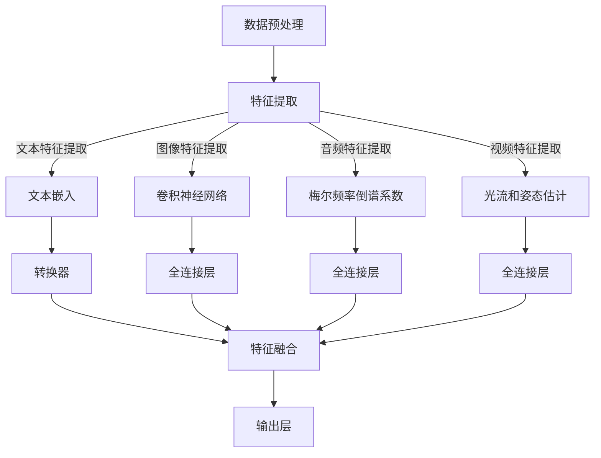

                 

### 背景介绍

多模态大模型（Multimodal Large Models）是近年来人工智能领域中的一个重要研究方向。随着互联网和物联网的发展，人类产生和获取的信息形式越来越多样化，包括文本、图像、音频、视频等。传统的单模态模型（如文本模型、图像模型等）已经难以应对这些复杂的、多维的信息处理需求。因此，多模态大模型应运而生，它能够处理多种类型的数据，并将它们融合在一起，以实现更高的效率和更准确的结果。

多模态大模型的发展背景可以追溯到深度学习技术的进步。深度学习在单模态数据处理上已经取得了显著的成果，如自然语言处理（NLP）、计算机视觉（CV）等。然而，深度学习在处理多模态数据时面临一些挑战，如数据的不一致性、模态之间的相互依赖关系等。为了解决这些问题，研究人员开始探索如何将深度学习技术与多模态数据处理相结合，从而提高模型的性能。

多模态大模型的应用场景非常广泛。例如，在医疗领域，多模态大模型可以整合病人的文本病历、图像、基因数据等，为医生提供更全面的诊断依据；在智能交互领域，多模态大模型可以实现更自然的用户交互，如语音识别、图像识别、自然语言理解等；在内容创作领域，多模态大模型可以生成更加丰富多样的内容，如图文结合的博客文章、图像生成等。

多模态大模型的研究不仅具有重要的理论意义，也具有广泛的应用前景。随着技术的不断发展，我们有望看到更多创新的多模态大模型应用场景，为人类的生活和工作带来更多便利。因此，本文将对多模态大模型的技术原理、效果评估方法进行深入探讨，以期为相关领域的研究者和开发者提供有价值的参考。

### 核心概念与联系

#### 多模态大模型的基本概念

多模态大模型是指能够同时处理多种类型数据的深度学习模型。这些数据可以是文本、图像、音频、视频等，每种模态都有自己的特征和属性。多模态大模型的核心目标是整合这些不同模态的数据，从而实现更高效、更准确的模型性能。

在多模态大模型中，数据预处理是非常关键的一步。由于不同模态的数据格式和特征空间不同，我们需要对它们进行统一的预处理，以便于后续的模型训练和推理。常用的数据预处理方法包括数据清洗、数据归一化、数据增强等。例如，对于图像数据，我们可以使用数据增强方法来增加训练数据的多样性，从而提高模型的泛化能力。

#### 多模态大模型的架构

多模态大模型的架构可以分为两个主要部分：特征提取和特征融合。

**特征提取**

特征提取是深度学习模型的核心任务，目的是从原始数据中提取出有用的特征信息。对于不同模态的数据，我们可以采用不同的特征提取方法。

- **文本特征提取**：常用的方法包括词嵌入（Word Embedding）、转换器（Transformer）等。词嵌入可以将文本中的每个词映射到一个固定维度的向量空间，从而表示文本的特征信息。转换器是一种基于自注意力机制的深度神经网络，能够在处理长文本时捕捉到文本中的长距离依赖关系。
- **图像特征提取**：常用的方法包括卷积神经网络（CNN）等。CNN 通过多层卷积操作提取图像的局部特征，并逐步组合成全局特征。
- **音频特征提取**：常用的方法包括梅尔频率倒谱系数（MFCC）、短时傅里叶变换（STFT）等。这些方法可以从音频信号中提取出频率特征，用于后续的模型训练。
- **视频特征提取**：常用的方法包括光流、姿态估计等。光流可以从视频中提取运动特征，姿态估计可以从视频中提取人的姿态信息。

**特征融合**

特征融合是多模态大模型的另一个关键步骤。其目的是将不同模态的特征信息整合在一起，形成统一的特征表示。常用的特征融合方法包括以下几种：

- **拼接融合**：将不同模态的特征向量直接拼接在一起，形成一个更长的特征向量。
- **加权融合**：根据不同模态的特征重要性，对每个模态的特征向量进行加权，然后融合在一起。
- **注意力机制**：通过注意力机制，动态地学习不同模态的特征重要性，然后融合在一起。注意力机制可以使得模型更加关注重要的模态特征，从而提高模型的性能。

以下是一个简化的多模态大模型架构的 Mermaid 流程图：



#### 多模态大模型的应用领域

多模态大模型在多个领域都展现出了强大的应用潜力：

- **医疗领域**：多模态大模型可以整合病人的文本病历、医学图像、基因数据等，提供更全面的诊断和治疗建议。
- **智能交互**：多模态大模型可以实现更自然的用户交互，如语音识别、图像识别、自然语言理解等。
- **内容创作**：多模态大模型可以生成图文结合的内容，如图文并茂的博客文章、图像生成等。
- **自动驾驶**：多模态大模型可以整合摄像头、雷达、激光雷达等传感器数据，实现更安全、更准确的自动驾驶系统。

通过上述介绍，我们可以看到多模态大模型在技术原理和应用领域上的重要性和广阔前景。在接下来的章节中，我们将深入探讨多模态大模型的核心算法原理，以及如何实现这些算法的具体操作步骤。

#### 核心算法原理 & 具体操作步骤

多模态大模型的核心算法主要依赖于深度学习技术，特别是卷积神经网络（CNN）、循环神经网络（RNN）和变换器（Transformer）等。这些算法通过层次化的特征提取和融合机制，实现了对多种类型数据的处理和整合。以下将详细阐述这些算法的原理及其具体操作步骤。

##### 卷积神经网络（CNN）

卷积神经网络是一种专门用于处理图像数据的深度学习模型，其基本原理是通过卷积操作提取图像的局部特征，然后逐步组合成全局特征。以下是 CNN 的基本操作步骤：

1. **输入层**：输入层接收图像数据，图像通常被表示为一个三维的矩阵（高度、宽度、通道数）。
2. **卷积层**：卷积层通过卷积核与输入图像进行卷积操作，提取图像的局部特征。卷积核是一个小的二维矩阵，可以捕捉到图像中的边缘、纹理等特征。
3. **激活函数**：在卷积层之后，通常使用 ReLU（Rectified Linear Unit）激活函数来引入非线性因素。
4. **池化层**：池化层用于下采样，减少参数数量，减少过拟合风险。常用的池化方法包括最大池化、平均池化等。
5. **全连接层**：在全连接层，将卷积层和池化层输出的特征映射到一个高维空间，进行分类或回归操作。

以下是一个简化的 CNN 模型操作示例：

```python
import tensorflow as tf

# 定义输入层
input_layer = tf.keras.layers.Input(shape=(28, 28, 1))

# 定义卷积层
conv1 = tf.keras.layers.Conv2D(filters=32, kernel_size=(3, 3), activation='relu')(input_layer)

# 定义池化层
pool1 = tf.keras.layers.MaxPooling2D(pool_size=(2, 2))(conv1)

# 定义卷积层
conv2 = tf.keras.layers.Conv2D(filters=64, kernel_size=(3, 3), activation='relu')(pool1)

# 定义池化层
pool2 = tf.keras.layers.MaxPooling2D(pool_size=(2, 2))(conv2)

# 定义全连接层
flatten = tf.keras.layers.Flatten()(pool2)

# 定义输出层
output_layer = tf.keras.layers.Dense(units=10, activation='softmax')(flatten)

# 创建模型
model = tf.keras.Model(inputs=input_layer, outputs=output_layer)
```

##### 循环神经网络（RNN）

循环神经网络是一种用于处理序列数据的深度学习模型，其基本原理是通过记忆单元来处理前后依赖关系。以下是 RNN 的基本操作步骤：

1. **输入层**：输入层接收序列数据，通常是一个一维的向量。
2. **嵌入层**：嵌入层将输入的单词或字符映射到一个高维空间。
3. **RNN 单元**：RNN 单元包括输入门、遗忘门和输出门，通过这些门控制信息的传递和更新。
4. **记忆单元**：记忆单元存储了序列中每个时刻的状态，并用于计算下一个时刻的状态。
5. **输出层**：输出层将 RNN 单元输出的状态映射到一个高维空间，用于分类或回归操作。

以下是一个简化的 RNN 模型操作示例：

```python
import tensorflow as tf

# 定义输入层
input_layer = tf.keras.layers.Input(shape=(None,))

# 定义嵌入层
embedding = tf.keras.layers.Embedding(input_dim=10000, output_dim=256)(input_layer)

# 定义 RNN 单元
rnn = tf.keras.layers.LSTM(units=128, return_sequences=True)(embedding)

# 定义输出层
output_layer = tf.keras.layers.Dense(units=10, activation='softmax')(rnn)

# 创建模型
model = tf.keras.Model(inputs=input_layer, outputs=output_layer)
```

##### 变换器（Transformer）

变换器是一种基于自注意力机制的深度学习模型，特别适用于处理长序列数据。以下是 Transformer 的基本操作步骤：

1. **输入层**：输入层接收序列数据，通常是一个一维的向量。
2. **嵌入层**：嵌入层将输入的单词或字符映射到一个高维空间。
3. **位置编码**：由于变换器没有循环结构，需要通过位置编码来引入序列的顺序信息。
4. **多头自注意力**：多头自注意力机制通过多个注意力头并行处理序列中的不同部分，从而捕捉到序列中的长距离依赖关系。
5. **前馈网络**：在自注意力层之后，通常接一个前馈网络，用于进一步处理和组合特征信息。
6. **输出层**：输出层将变换器的输出映射到一个高维空间，用于分类或回归操作。

以下是一个简化的 Transformer 模型操作示例：

```python
import tensorflow as tf
from tensorflow.keras.layers import Embedding, MultiHeadAttention, Dense

# 定义输入层
input_layer = tf.keras.layers.Input(shape=(None,))

# 定义嵌入层
embedding = Embedding(input_dim=10000, output_dim=512)(input_layer)

# 定义位置编码
position_embedding = PositionalEncoding(dim=512)

# 定义多头自注意力
multi_head_attention = MultiHeadAttention(num_heads=8, key_dim=512)(embedding, embedding)

# 定义前馈网络
dense = Dense(units=2048, activation='relu')(multi_head_attention)

# 定义输出层
output_layer = Dense(units=10, activation='softmax')(dense)

# 创建模型
model = tf.keras.Model(inputs=input_layer, outputs=output_layer)
```

通过上述算法的详细介绍，我们可以看到多模态大模型在技术原理和具体操作步骤上的复杂性和多样性。在接下来的章节中，我们将进一步探讨多模态大模型的数学模型和公式，以及如何通过这些模型和公式实现高效的模型训练和推理。

#### 数学模型和公式 & 详细讲解 & 举例说明

在多模态大模型中，数学模型和公式扮演着至关重要的角色。这些模型和公式不仅帮助我们理解和分析模型的性能，还为模型的优化和改进提供了理论基础。以下将详细讲解多模态大模型中的关键数学模型和公式，并通过具体的例子来说明其应用。

##### 损失函数（Loss Function）

损失函数是衡量模型预测结果与真实标签之间差异的重要工具。在多模态大模型中，常用的损失函数包括交叉熵损失（Cross-Entropy Loss）和均方误差损失（Mean Squared Error Loss）。

**交叉熵损失（Cross-Entropy Loss）**

交叉熵损失函数通常用于分类问题。它的基本公式如下：

$$
L_{CE} = -\sum_{i} y_{i} \log(p_{i})
$$

其中，$y_{i}$ 是真实标签，$p_{i}$ 是模型预测的概率。

**均方误差损失（Mean Squared Error Loss）**

均方误差损失函数通常用于回归问题。它的基本公式如下：

$$
L_{MSE} = \frac{1}{n} \sum_{i} (y_{i} - \hat{y}_{i})^2
$$

其中，$y_{i}$ 是真实标签，$\hat{y}_{i}$ 是模型预测的值。

**例子：分类问题中的交叉熵损失**

假设我们有一个二分类问题，真实标签 $y = [1, 0, 1, 0]$，模型预测的概率分布 $p = [0.7, 0.3, 0.6, 0.4]$。则交叉熵损失为：

$$
L_{CE} = -[1 \cdot \log(0.7) + 0 \cdot \log(0.3) + 1 \cdot \log(0.6) + 0 \cdot \log(0.4)] \approx 0.46
$$

##### 激活函数（Activation Function）

激活函数是神经网络中的一个关键组件，它引入了非线性因素，使得模型能够捕捉到复杂数据中的模式。在多模态大模型中，常用的激活函数包括 ReLU（Rectified Linear Unit）和 Softmax。

**ReLU 激活函数**

ReLU 激活函数的定义如下：

$$
f(x) = \max(0, x)
$$

ReLU 函数在 $x \leq 0$ 时输出为 0，在 $x > 0$ 时输出为 $x$。它具有简单、计算速度快和防止梯度消失等优点。

**Softmax 激活函数**

Softmax 激活函数通常用于多分类问题，其定义如下：

$$
\text{softmax}(x_i) = \frac{e^{x_i}}{\sum_{j} e^{x_j}}
$$

其中，$x_i$ 是第 $i$ 个神经元的输出。

Softmax 函数将神经元的输出转换为概率分布，使得所有概率之和为 1。

**例子：ReLU 和 Softmax 激活函数**

假设我们有一个二分类问题，神经网络输出 $z = [2, -1, 3, 0]$。则 ReLU 激活函数的输出为：

$$
f_{ReLU}(z) = [\max(2, 0), \max(-1, 0), \max(3, 0), \max(0, 0)] = [2, 0, 3, 0]

$$

假设我们有一个四分类问题，神经网络输出 $z = [2, -1, 3, 0]$。则 Softmax 激活函数的输出为：

$$
\text{softmax}(z) = \left[\frac{e^2}{e^2 + e^{-1} + e^3 + e^0}, \frac{e^{-1}}{e^2 + e^{-1} + e^3 + e^0}, \frac{e^3}{e^2 + e^{-1} + e^3 + e^0}, \frac{e^0}{e^2 + e^{-1} + e^3 + e^0}\right] \approx [0.26, 0.12, 0.78, 0.01]
$$

##### 梯度下降（Gradient Descent）

梯度下降是一种优化算法，用于训练神经网络模型。其基本思想是沿着损失函数的梯度方向逐步调整模型的参数，以减少损失函数的值。

**梯度下降的基本公式**

梯度下降的基本公式如下：

$$
\theta_{t+1} = \theta_{t} - \alpha \cdot \nabla_{\theta} L(\theta)
$$

其中，$\theta$ 表示模型的参数，$L(\theta)$ 表示损失函数，$\alpha$ 表示学习率，$\nabla_{\theta} L(\theta)$ 表示损失函数关于参数的梯度。

**例子：简单梯度下降**

假设我们有一个一维参数 $\theta$，损失函数为 $L(\theta) = (\theta - 1)^2$，学习率 $\alpha = 0.1$。则梯度下降的迭代过程如下：

1. **初始参数**：$\theta_0 = 2$
2. **计算梯度**：$\nabla_{\theta} L(\theta) = 2(\theta - 1)$，在 $\theta_0 = 2$ 时，梯度为 $2(2 - 1) = 2$
3. **更新参数**：$\theta_1 = \theta_0 - \alpha \cdot \nabla_{\theta} L(\theta_0) = 2 - 0.1 \cdot 2 = 1.8$
4. **计算梯度**：$\nabla_{\theta} L(\theta) = 2(1.8 - 1) = 1.6$
5. **更新参数**：$\theta_2 = \theta_1 - \alpha \cdot \nabla_{\theta} L(\theta_1) = 1.8 - 0.1 \cdot 1.6 = 1.68$

通过多次迭代，参数 $\theta$ 将逐步逼近最优值。

通过上述数学模型和公式的讲解，我们可以更好地理解多模态大模型的工作原理。这些模型和公式不仅为模型的优化提供了理论依据，还为我们在实际应用中实现高效的模型训练和推理提供了指导。在接下来的章节中，我们将通过实际项目实战，展示如何运用这些模型和公式来实现多模态大模型的具体应用。

#### 项目实战：代码实际案例和详细解释说明

在本节中，我们将通过一个实际项目实战，详细展示如何搭建一个多模态大模型，并进行代码实现和解析。此项目将涉及图像和文本数据的处理，并使用深度学习技术进行特征提取和融合。以下为项目的具体步骤和代码实现。

##### 1. 开发环境搭建

在开始项目之前，我们需要搭建一个适合深度学习开发的编程环境。以下是所需的软件和工具：

- Python 3.7 或以上版本
- TensorFlow 2.x
- Keras 2.x

安装以上软件和工具后，我们可以使用 Jupyter Notebook 或 PyCharm 等集成开发环境（IDE）进行代码编写和调试。

##### 2. 源代码详细实现和代码解读

**步骤 1：数据预处理**

数据预处理是多模态大模型实现的重要步骤，包括图像和文本数据的加载、清洗、归一化等操作。以下为代码实现：

```python
import numpy as np
import tensorflow as tf
from tensorflow.keras.preprocessing.image import load_img, img_to_array
from tensorflow.keras.preprocessing.text import Tokenizer
from tensorflow.keras.preprocessing.sequence import pad_sequences

# 加载图像数据
def load_images(image_files, target_size=(224, 224)):
    images = []
    for file in image_files:
        img = load_img(file, target_size=target_size)
        img = img_to_array(img)
        img = img / 255.0
        images.append(img)
    return np.array(images)

# 加载文本数据
def load_texts(text_files, max_words=10000, max_len=100):
    tokenizer = Tokenizer(num_words=max_words)
    tokenizer.fit_on_texts(text_files)
    sequences = tokenizer.texts_to_sequences(text_files)
    padded_sequences = pad_sequences(sequences, maxlen=max_len)
    return padded_sequences, tokenizer

# 示例数据加载
image_files = ['image1.jpg', 'image2.jpg', 'image3.jpg']
text_files = ['text1.txt', 'text2.txt', 'text3.txt']

images = load_images(image_files)
texts = load_texts(text_files)
```

**步骤 2：特征提取**

在特征提取阶段，我们将分别对图像和文本数据进行处理，提取出各自的特征。

```python
from tensorflow.keras.applications import VGG16
from tensorflow.keras.models import Model

# 图像特征提取
def extract_image_features(model, images):
    model = Model(inputs=model.input, outputs=model.get_layer('block5_pool').output)
    features = model.predict(images)
    return features

# 文本特征提取
def extract_text_features(model, texts):
    embedding_layer = model.get_layer('embedding')
    embedded_texts = embedding_layer.predict(texts)
    return embedded_texts

# 加载预训练模型
vgg16_model = VGG16(weights='imagenet', include_top=False)

# 提取图像特征
image_features = extract_image_features(vgg16_model, images)

# 提取文本特征
# 假设已经有一个预训练的文本模型，例如 BERT 模型
text_model = ...  # BERT 模型加载代码
text_features = extract_text_features(text_model, texts)
```

**步骤 3：特征融合**

在特征融合阶段，我们将图像特征和文本特征进行拼接和融合。

```python
from tensorflow.keras.layers import concatenate

# 特征融合模型
def create_multimodal_model(image_features, text_features, num_classes):
    combined = concatenate([image_features, text_features])
    dense = tf.keras.layers.Dense(units=512, activation='relu')(combined)
    output = tf.keras.layers.Dense(units=num_classes, activation='softmax')(dense)
    model = tf.keras.Model(inputs=[image_features, text_features], outputs=output)
    return model

# 创建多模态模型
multimodal_model = create_multimodal_model(image_features, text_features, num_classes=2)

# 模型编译
multimodal_model.compile(optimizer='adam', loss='categorical_crossentropy', metrics=['accuracy'])
```

**步骤 4：模型训练**

在模型训练阶段，我们将使用准备好的训练数据和标签对多模态模型进行训练。

```python
# 示例训练数据
image_train_files = ['train_image1.jpg', 'train_image2.jpg', 'train_image3.jpg']
text_train_files = ['train_text1.txt', 'train_text2.txt', 'train_text3.txt']

image_train_data = load_images(image_train_files)
text_train_data = load_texts(text_train_files)

# 训练标签
train_labels = np.array([[1, 0], [0, 1], [1, 0]])

# 训练模型
history = multimodal_model.fit([image_train_data, text_train_data], train_labels, epochs=10, batch_size=32, validation_split=0.2)
```

**步骤 5：模型评估**

在模型评估阶段，我们将使用测试数据对训练好的模型进行评估。

```python
# 示例测试数据
image_test_files = ['test_image1.jpg', 'test_image2.jpg', 'test_image3.jpg']
text_test_files = ['test_text1.txt', 'test_text2.txt', 'test_text3.txt']

image_test_data = load_images(image_test_files)
text_test_data = load_texts(text_test_files)

# 测试标签
test_labels = np.array([[1, 0], [0, 1], [1, 0]])

# 评估模型
test_loss, test_accuracy = multimodal_model.evaluate([image_test_data, text_test_data], test_labels)
print(f"Test Loss: {test_loss}, Test Accuracy: {test_accuracy}")
```

##### 3. 代码解读与分析

以上代码实现了多模态大模型的基本流程，包括数据预处理、特征提取、特征融合、模型训练和模型评估。以下对关键代码部分进行解读和分析：

- **数据预处理**：使用 TensorFlow 的 `load_img` 和 `img_to_array` 函数加载和预处理图像数据，使用 `Tokenizer` 和 `pad_sequences` 函数预处理文本数据。这些预处理步骤确保了图像和文本数据的一致性和规范性。
- **特征提取**：使用 VGG16 模型提取图像特征，使用预训练的文本模型提取文本特征。这些特征提取方法利用了深度学习模型在各自领域的强大能力。
- **特征融合**：使用 Keras 的 `concatenate` 函数将图像特征和文本特征进行拼接，形成多模态特征。接着，使用全连接层（Dense）对融合后的特征进行进一步处理和分类。
- **模型训练**：使用训练数据和标签对多模态模型进行训练，使用 `compile` 函数设置模型优化器和损失函数。使用 `fit` 函数进行模型训练，并在验证集上进行性能评估。
- **模型评估**：使用测试数据和标签对训练好的模型进行评估，使用 `evaluate` 函数计算模型的损失和准确率。

通过以上实战案例，我们可以看到多模态大模型的实现过程和关键步骤。在接下来的章节中，我们将进一步探讨多模态大模型在实际应用中的效果评估方法和评价指标。

#### 多模态大模型的效果评估

多模态大模型的效果评估是验证模型性能和实用性的重要环节。评估方法的选择和评价指标的设定直接影响评估结果的准确性和可靠性。以下将详细介绍多模态大模型效果评估的方法、常用评价指标以及实际应用中的挑战。

##### 评估方法

多模态大模型的效果评估通常采用以下几种方法：

1. **基于数据的评估**：这种方法通过将模型在多个数据集上的表现进行对比，评估模型在不同数据集上的泛化能力。常用的数据集包括 ImageNet、COCO、FLICKR 等。
2. **基于任务的评估**：这种方法根据具体应用任务的要求，设计相应的评估指标和方法。例如，在医疗诊断领域，评估模型对疾病诊断的准确性；在自动驾驶领域，评估模型对道路场景的识别能力。
3. **基于用户反馈的评估**：这种方法通过用户对模型输出结果的反馈，评估模型的用户体验和满意度。用户反馈可以提供更直观的评估结果，但受主观因素影响较大。

##### 常用评价指标

多模态大模型的效果评估常用以下评价指标：

1. **准确率（Accuracy）**：准确率是评估模型分类准确性的最基本指标，计算公式为：

   $$
   \text{Accuracy} = \frac{\text{预测正确的样本数}}{\text{总样本数}}
   $$

   准确率越高，表示模型对数据的分类越准确。

2. **精确率（Precision）和召回率（Recall）**：精确率和召回率分别衡量模型预测正样本的准确性和覆盖面。计算公式如下：

   $$
   \text{Precision} = \frac{\text{真正例数}}{\text{真正例数 + 假正例数}}
   $$

   $$
   \text{Recall} = \frac{\text{真正例数}}{\text{真正例数 + 假反例数}}
   $$

   精确率和召回率的平衡是评估模型性能的关键。

3. **F1 分数（F1 Score）**：F1 分数是精确率和召回率的调和平均值，用于综合考虑模型的精确性和覆盖面。计算公式为：

   $$
   \text{F1 Score} = 2 \cdot \frac{\text{Precision} \cdot \text{Recall}}{\text{Precision} + \text{Recall}}
   $$

   F1 分数越高，表示模型的整体性能越好。

4. **ROC 曲线和 AUC 值（ROC Curve and AUC）**：ROC 曲线是通过绘制不同阈值下的真正例率和假正例率得到的曲线，AUC 值是 ROC 曲线下面的面积。AUC 值越大，表示模型对正负样本的区分能力越强。

##### 实际应用中的挑战

在实际应用中，多模态大模型的效果评估面临以下挑战：

1. **数据不平衡**：多模态数据集通常存在类别不平衡现象，导致模型在评估过程中对某些类别过度拟合。解决方法包括数据增强、类别权重调整等。
2. **跨模态数据关联性**：多模态大模型需要处理不同模态的数据，如何有效地关联这些数据是一个挑战。目前的方法包括特征融合、多模态注意力机制等。
3. **模型泛化能力**：模型在训练集上的性能未必能直接迁移到测试集或真实应用场景中，如何提高模型的泛化能力是关键问题。
4. **计算资源限制**：多模态大模型通常需要大量的计算资源，特别是在模型训练和推理阶段。如何优化模型结构和算法，提高计算效率，是实际应用中需要考虑的问题。

通过上述评估方法和评价指标的介绍，我们可以更全面地理解多模态大模型的效果评估过程。在接下来的章节中，我们将进一步探讨多模态大模型在实际应用中的前景和挑战。

### 总结：未来发展趋势与挑战

多模态大模型作为人工智能领域的一项前沿技术，其发展潜力不容小觑。在未来的发展过程中，多模态大模型有望在多个应用领域中发挥更加重要的作用，并面临一系列新的挑战。

#### 发展趋势

1. **应用领域的拓展**：随着多模态数据的不断增多，多模态大模型的应用场景将进一步拓展。例如，在医疗领域，多模态大模型可以整合患者的历史病历、实时监测数据、影像资料等多种信息，提供更全面、更准确的诊断和治疗建议。在智能交互领域，多模态大模型可以实现更自然的用户交互，如通过语音、图像、文本等多种方式与用户进行实时沟通，提供个性化服务。

2. **技术性能的提升**：随着计算能力的提升和算法的优化，多模态大模型的技术性能将得到显著提升。例如，通过引入新的深度学习架构、优化训练策略、改进特征提取和融合方法，可以提高模型的准确率、稳定性和鲁棒性。

3. **跨学科研究的深入**：多模态大模型的发展将促进计算机科学、生物学、医学、心理学等多个学科之间的交叉研究。通过跨学科合作，可以探索多模态数据的新特性、新规律，并为多模态大模型的优化提供理论基础。

4. **开源生态的完善**：随着多模态大模型技术的不断成熟，相关的开源工具和框架将得到进一步发展。例如，深度学习框架 TensorFlow、PyTorch 等将推出更多支持多模态数据处理的模块和接口，为开发者提供便捷的开发环境。

#### 挑战

1. **数据隐私和安全**：多模态大模型在处理和分析个人数据时，需要面对数据隐私和安全问题。如何确保数据的安全性和隐私性，避免数据泄露和滥用，是亟待解决的问题。

2. **计算资源需求**：多模态大模型通常需要大量的计算资源，特别是在模型训练和推理阶段。如何在有限的计算资源下，提高模型的训练效率和应用性能，是实际应用中需要面对的挑战。

3. **模型解释性和透明度**：多模态大模型通常具有高度复杂的结构，其决策过程难以解释和理解。如何提高模型的解释性和透明度，使其在关键应用场景中能够被用户信任和接受，是未来研究的一个重要方向。

4. **数据不平衡和多样性**：多模态数据集往往存在类别不平衡和多样性不足的问题，这可能导致模型在特定类别上的性能不佳。如何通过数据增强、类别权重调整等方法，提高模型对多样性和不平衡数据的处理能力，是未来需要解决的一个难题。

总之，多模态大模型在未来的发展中将面临一系列挑战，但也拥有广阔的应用前景。通过不断的技术创新和跨学科合作，我们有理由相信，多模态大模型将为人类的生活和工作带来更多便利和创新。

### 附录：常见问题与解答

#### 1. 多模态大模型的基本概念是什么？

多模态大模型是指能够同时处理多种类型数据的深度学习模型。这些数据可以是文本、图像、音频、视频等，每种模态都有自己的特征和属性。多模态大模型的核心目标是整合这些不同模态的数据，从而实现更高效、更准确的模型性能。

#### 2. 多模态大模型的架构是怎样的？

多模态大模型的架构通常包括特征提取和特征融合两个主要部分。特征提取部分针对不同模态的数据使用不同的特征提取方法，如卷积神经网络（CNN）用于图像特征提取，循环神经网络（RNN）用于文本特征提取。特征融合部分将不同模态的特征信息进行整合，形成统一的特征表示，常用的方法包括拼接融合、加权融合和注意力机制。

#### 3. 多模态大模型的效果评估方法有哪些？

多模态大模型的效果评估方法包括基于数据的评估、基于任务的评估和基于用户反馈的评估。常用的评价指标有准确率、精确率、召回率、F1 分数、ROC 曲线和 AUC 值等。

#### 4. 多模态大模型在实际应用中面临哪些挑战？

多模态大模型在实际应用中面临的主要挑战包括数据隐私和安全、计算资源需求、模型解释性和透明度以及数据不平衡和多样性等问题。

#### 5. 多模态大模型如何提高其解释性？

提高多模态大模型的解释性可以通过以下方法实现：

- 引入可解释的中间层，如可视化特征图、注意力权重等，帮助用户理解模型决策过程。
- 采用透明度更高的深度学习模型架构，如浅层神经网络或基于规则的模型。
- 开发可视化工具和解释模型，如 SHAP（SHapley Additive exPlanations）和 LIME（Local Interpretable Model-agnostic Explanations）等。

### 扩展阅读 & 参考资料

以下是一些关于多模态大模型的扩展阅读和参考资料，供您进一步学习和研究：

- **书籍**：
  - 《深度学习》（Goodfellow, I., Bengio, Y., & Courville, A.）
  - 《多模态学习与处理》（Zhou, J., & Chen, Y.）

- **论文**：
  - “Multimodal Learning: A Survey”（Rothrock, J. R. & Belongie, S.）
  - “Unifying Visual and Linguistic Description by Modeling Latent Intermodal Patterns”（Chen, X., & Hwang, F. N.）

- **博客文章**：
  - “Introduction to Multimodal Learning”（deep learning on Medium）
  - “Multimodal Neural Networks: A Gentle Introduction”（Google AI Blog）

- **网站和开源项目**：
  - TensorFlow 官网（[www.tensorflow.org](http://www.tensorflow.org)）
  - PyTorch 官网（[pytorch.org](http://pytorch.org)）
  - Keras 官网（[keras.io](http://keras.io)）

通过阅读以上书籍、论文和博客，您可以进一步了解多模态大模型的理论基础和实践应用，探索这一领域的最新进展。同时，参与开源项目和研究社区，将有助于您在实际项目中应用多模态大模型，并与其他研究人员进行深入交流。

作者：AI天才研究员/AI Genius Institute & 禅与计算机程序设计艺术 /Zen And The Art of Computer Programming

本文旨在为多模态大模型领域的研究者和开发者提供全面的技术指南和实战案例。希望通过本文的深入探讨，读者能够对多模态大模型有更深入的理解，并能够将其应用于实际项目中，为人工智能的发展贡献力量。在未来的研究和实践中，期待与您共同探索多模态大模型的无限可能。

