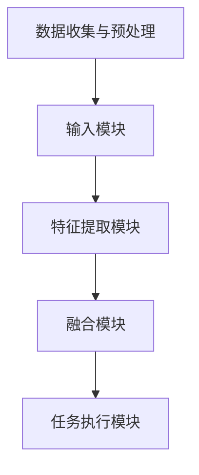

                 

### 背景介绍

多模态大模型（Multimodal Large Models）是近年来人工智能领域的一大热点。随着计算机视觉、语音识别、自然语言处理等技术的不断发展，单一模态的数据已经无法满足复杂场景下的需求。多模态大模型通过整合多种类型的数据，如文本、图像、语音等，能够更好地理解用户的意图和需求，实现更智能的交互和决策。

多模态大模型的研究起源于上世纪80年代的计算机视觉领域。当时的计算机视觉系统主要依赖于图像数据进行目标检测和识别，但效果并不理想。随着深度学习技术的兴起，计算机视觉取得了显著的突破，但单一模态的数据仍然存在一定的局限性。为了克服这些局限性，研究者开始探索多模态数据的融合和应用，通过整合不同类型的数据，提高模型的性能和鲁棒性。

近年来，随着硬件性能的提升和大数据的普及，多模态大模型的研究和应用得到了进一步的发展。在自然语言处理领域，多模态大模型可以通过文本和图像的融合，实现图像描述生成、问答系统等任务；在计算机视觉领域，多模态大模型可以用于视频理解、动作识别等任务；在语音识别领域，多模态大模型可以通过文本和语音的融合，提高识别准确率和抗噪能力。

本文旨在介绍多模态大模型的技术原理和实战应用。首先，我们将回顾多模态大模型的核心概念和联系，通过Mermaid流程图展示多模态数据的处理流程。接着，我们将深入探讨多模态大模型的核心算法原理和具体操作步骤。然后，我们将详细讲解多模态大模型的数学模型和公式，并通过实例进行说明。接下来，我们将通过实际项目案例，展示多模态大模型在开发环境搭建、源代码实现和代码解读等方面的应用。最后，我们将讨论多模态大模型在实际应用场景中的表现，并推荐相关的工具和资源，帮助读者深入了解和掌握这一技术。

通过本文的阅读，读者将能够全面了解多模态大模型的技术原理和应用实践，为今后的研究和开发工作提供有力支持。<|user|>

---

## 2. 核心概念与联系

### 多模态数据的概念

多模态数据（Multimodal Data）指的是由两种或两种以上不同类型的数据源所构成的数据集合。这些数据源可以是视觉（图像、视频）、听觉（语音、音频）、触觉（传感器数据）等。多模态数据的特点在于它们提供了关于同一个场景或事件的多个维度的信息，从而能够提供更全面、更准确的认知。

在多模态大模型中，文本、图像、语音等数据是最为常见的三种模态。文本数据通常来自自然语言处理任务，如文本分类、问答系统等；图像数据则来自计算机视觉任务，如目标检测、图像识别等；语音数据则通常用于语音识别和语音生成任务。

### 多模态大模型的工作原理

多模态大模型的工作原理可以概括为以下几个步骤：

1. **数据收集与预处理**：首先，从不同的数据源收集多模态数据，并对数据进行预处理，如去噪、归一化、特征提取等。

2. **数据融合**：将预处理后的不同模态数据通过特定的融合方法进行整合，以生成一个综合的特征表示。常见的融合方法包括拼接、平均、注意力机制等。

3. **特征表示学习**：使用深度学习技术，如卷积神经网络（CNN）、循环神经网络（RNN）、变换器（Transformer）等，对融合后的特征进行学习，以提取高层语义信息。

4. **任务执行**：利用学习到的特征表示进行特定任务的执行，如分类、回归、生成等。

### 多模态大模型架构

多模态大模型的架构通常包含以下几个关键组件：

1. **输入模块**：负责接收和处理不同类型的数据，如文本、图像、语音等。

2. **特征提取模块**：使用深度学习模型从不同模态的数据中提取特征。

3. **融合模块**：将提取出的特征进行整合，生成一个综合的特征表示。

4. **任务执行模块**：利用融合后的特征进行特定任务的执行。

以下是多模态大模型的Mermaid流程图：



在多模态大模型中，数据融合是一个关键步骤。有效的数据融合能够提高模型对多模态数据的理解和处理能力，从而提升模型的性能。常见的融合策略包括：

- **拼接**：将不同模态的数据直接拼接在一起，形成一个多维的特征向量。
- **平均**：对多个模态的特征向量进行平均，得到一个综合的特征表示。
- **注意力机制**：通过注意力机制，动态地关注不同模态的数据，从而生成一个更有效的特征表示。

### 多模态大模型的优势与挑战

多模态大模型的优势在于能够综合利用不同模态的数据，从而提高模型在复杂任务上的性能。例如，在图像描述生成任务中，结合图像和文本数据能够生成更准确、更自然的描述。然而，多模态大模型也面临着一些挑战：

- **数据不一致**：不同模态的数据在分布和特征上可能存在较大差异，如何有效地融合这些数据是一个关键问题。
- **计算资源消耗**：多模态数据的处理通常需要大量的计算资源，如何优化模型的计算效率是一个重要挑战。
- **标注数据稀缺**：多模态数据的标注通常比单一模态的数据标注更为困难，如何获取丰富的标注数据是模型训练的一个挑战。

通过本文的介绍，读者将对多模态大模型的核心概念和联系有一个全面的理解，为后续的内容打下坚实的基础。<|user|>

---

## 3. 核心算法原理 & 具体操作步骤

### 多模态数据的处理流程

在多模态大模型中，数据处理流程是整个模型的核心。这一过程主要包括数据的收集、预处理、特征提取、融合和任务执行等步骤。

#### 数据收集

数据收集是多模态大模型构建的第一步。在这一步骤中，我们需要从不同的数据源收集不同类型的数据，如文本、图像、语音等。这些数据可以是公开的数据集，也可以是自定义的数据集。在选择数据时，需要考虑数据的多样性、代表性和完整性，以确保模型的泛化能力和鲁棒性。

#### 数据预处理

数据预处理是为了提高数据质量和一致性，以便后续的特征提取和融合。对于不同类型的数据，预处理的方法可能有所不同：

- **文本数据**：通常需要进行分词、去停用词、词性标注等操作。为了提高模型的性能，还可以进行词嵌入（Word Embedding）处理，将文本转换为固定长度的向量表示。
- **图像数据**：需要进行图像增强、裁剪、缩放等操作，以提高数据的多样性和泛化能力。此外，还需要进行归一化处理，将图像的像素值缩放到一定的范围内。
- **语音数据**：需要进行音频增强、降噪、分割等操作。常见的语音预处理技术包括谱减法、波束形成等。

#### 特征提取

特征提取是将原始数据转换为适合模型处理的特征表示的过程。在多模态大模型中，不同的模态数据通常采用不同的特征提取方法：

- **文本数据**：常用的特征提取方法包括词袋模型（Bag of Words, BOW）、TF-IDF（Term Frequency-Inverse Document Frequency）和词嵌入（Word Embedding）等。
- **图像数据**：常用的特征提取方法包括卷积神经网络（Convolutional Neural Network, CNN）、池化操作和特征提取层等。
- **语音数据**：常用的特征提取方法包括梅尔频率倒谱系数（Mel-Frequency Cepstral Coefficients, MFCC）和短时傅里叶变换（Short-Time Fourier Transform, STFT）等。

#### 数据融合

数据融合是将不同模态的特征向量进行整合，以生成一个综合的特征表示。数据融合的方法多种多样，常见的策略包括：

- **拼接**：将不同模态的特征向量直接拼接在一起，形成一个更长的特征向量。
- **平均**：对多个模态的特征向量进行平均，得到一个综合的特征表示。
- **注意力机制**：通过注意力机制，动态地关注不同模态的数据，从而生成一个更有效的特征表示。

#### 任务执行

任务执行是利用融合后的特征进行特定任务的执行。在多模态大模型中，常见的任务包括分类、回归、生成等。不同的任务需要采用不同的模型结构和优化策略：

- **分类任务**：可以使用卷积神经网络（CNN）或循环神经网络（RNN）等模型进行分类。在分类任务中，特征融合通常采用拼接或平均的方法。
- **回归任务**：可以使用线性回归、决策树、支持向量机（SVM）等模型进行回归。在回归任务中，特征融合通常采用平均或加权平均的方法。
- **生成任务**：可以使用生成对抗网络（Generative Adversarial Network, GAN）或变分自编码器（Variational Autoencoder, VAE）等进行生成。在生成任务中，特征融合通常采用注意力机制或拼接方法。

### 核心算法实例

以下是一个简单的多模态分类任务的核心算法实例：

1. **数据收集**：
    - 文本数据：从新闻文章中提取标题和正文。
    - 图像数据：从新闻文章的配图中提取图片。
    - 语音数据：从新闻文章的音频文件中提取语音。

2. **数据预处理**：
    - 文本数据：进行分词、去停用词、词嵌入处理。
    - 图像数据：进行图像增强、裁剪、缩放和归一化处理。
    - 语音数据：进行音频增强、降噪、分割和梅尔频率倒谱系数（MFCC）提取。

3. **特征提取**：
    - 文本数据：使用词嵌入技术提取文本特征。
    - 图像数据：使用卷积神经网络提取图像特征。
    - 语音数据：使用梅尔频率倒谱系数提取语音特征。

4. **数据融合**：
    - 采用拼接策略，将文本、图像和语音特征拼接在一起，形成综合特征向量。

5. **任务执行**：
    - 使用卷积神经网络（CNN）进行分类任务，输入为拼接后的特征向量，输出为分类结果。

通过这个实例，读者可以更好地理解多模态大模型的核心算法原理和具体操作步骤。在实际应用中，可以根据具体任务的需求和数据的特性，选择合适的特征提取方法、数据融合策略和任务执行模型，以提高模型的性能和效率。<|user|>

---

## 4. 数学模型和公式 & 详细讲解 & 举例说明

### 多模态大模型的数学模型

多模态大模型涉及多种数学模型和公式，以实现数据的处理、特征提取和融合。以下将详细介绍一些核心的数学模型和公式。

#### 特征提取

1. **卷积神经网络（CNN）**：
   卷积神经网络是一种专门用于图像处理和特征提取的深度学习模型。其核心公式如下：

   $$ f(x; \theta) = \sigma(\theta^T \cdot \phi(x)) $$

   其中，$x$ 是输入图像，$\theta$ 是卷积核参数，$\phi(x)$ 是卷积操作，$\sigma$ 是激活函数，如ReLU（Rectified Linear Unit）。

2. **循环神经网络（RNN）**：
   循环神经网络用于处理序列数据，如文本和语音。其核心公式如下：

   $$ h_t = \sigma(W_h \cdot [h_{t-1}, x_t] + b_h) $$

   其中，$h_t$ 是当前时刻的隐藏状态，$x_t$ 是当前时刻的输入，$W_h$ 和 $b_h$ 分别是权重和偏置。

3. **词嵌入（Word Embedding）**：
   词嵌入是一种将文本转换为向量的方法，常用的模型包括Word2Vec和GloVe。其核心公式如下：

   $$ \text{Word2Vec}: \text{similarity}(w_i, w_j) = \cos(\text{vec}(w_i), \text{vec}(w_j)) $$

   $$ \text{GloVe}: \text{similarity}(w_i, w_j) = \frac{\text{exp}(\text{vec}(w_i) \cdot \text{vec}(w_j))}{\text{sqrt}(\sum_{k=1}^{K}\text{exp}(\text{vec}(w_k) \cdot \text{vec}(w_i))) \cdot \text{sqrt}(\sum_{k=1}^{K}\text{exp}(\text{vec}(w_k) \cdot \text{vec}(w_j)))} $$

   其中，$\text{vec}(w_i)$ 和 $\text{vec}(w_j)$ 分别是词向量 $w_i$ 和 $w_j$ 的向量表示。

#### 数据融合

1. **拼接（Concatenation）**：
   拼接是将不同模态的特征向量直接拼接在一起，形成一个更长的特征向量。其公式如下：

   $$ \text{Concat}(x_1, x_2) = [x_1; x_2] $$

   其中，$x_1$ 和 $x_2$ 分别是两个模态的特征向量。

2. **平均（Average）**：
   平均是对多个模态的特征向量进行平均，得到一个综合的特征表示。其公式如下：

   $$ \text{Average}(x_1, x_2) = \frac{x_1 + x_2}{2} $$

   其中，$x_1$ 和 $x_2$ 分别是两个模态的特征向量。

3. **注意力机制（Attention Mechanism）**：
   注意力机制是一种动态关注不同模态数据的方法，能够提高模型的性能。其核心公式如下：

   $$ a_t = \text{softmax}(\text{W}_a \cdot [h_{t-1}; x_t]) $$

   $$ \text{context} = \text{concat}(h_{t-1}, a_t \cdot x_t) $$

   其中，$a_t$ 是注意力权重，$\text{context}$ 是注意力上下文。

### 举例说明

以下是一个简单的多模态情感分析任务的例子，该任务的目标是根据文本和图像判断情感倾向。

1. **文本数据**：
   - 输入文本：“今天天气很好，我们去公园散步吧。”
   - 使用Word2Vec模型提取词向量。

2. **图像数据**：
   - 输入图像：一张公园的照片。
   - 使用卷积神经网络提取图像特征。

3. **数据融合**：
   - 采用拼接策略，将文本词向量序列和图像特征向量拼接在一起。

4. **任务执行**：
   - 使用循环神经网络（RNN）处理拼接后的特征向量序列。
   - 输出为情感分类结果，如积极、消极、中立。

具体步骤如下：

1. **数据预处理**：
   - 文本数据：分词、去停用词、词嵌入处理。
   - 图像数据：图像增强、裁剪、缩放和归一化处理。

2. **特征提取**：
   - 文本数据：使用Word2Vec提取词向量。
   - 图像数据：使用卷积神经网络提取图像特征。

3. **数据融合**：
   - 采用拼接策略，将文本词向量序列和图像特征向量拼接在一起。

4. **任务执行**：
   - 使用循环神经网络（RNN）处理拼接后的特征向量序列。
   - 输出为情感分类结果。

通过这个例子，读者可以更好地理解多模态大模型的数学模型和公式的具体应用。在实际项目中，可以根据任务的需求和数据的特点，选择合适的数学模型和公式，以提高模型的性能和效率。<|user|>

---

## 5. 项目实战：代码实际案例和详细解释说明

### 开发环境搭建

在开始实战之前，我们需要搭建一个合适的开发环境。以下是一个简单的Python开发环境搭建步骤：

1. **安装Python**：下载并安装Python 3.8或更高版本。
2. **安装依赖库**：使用pip安装必要的库，如TensorFlow、PyTorch、Numpy、Scikit-learn等。

```shell
pip install tensorflow
pip install torch
pip install numpy
pip install scikit-learn
```

3. **创建虚拟环境**：为了保持开发环境的整洁，我们可以创建一个虚拟环境。

```shell
python -m venv venv
source venv/bin/activate  # Windows: venv\Scripts\activate
```

4. **安装额外的工具和库**：根据项目需求，可以安装额外的工具和库，如TensorBoard、OpenCV等。

```shell
pip install tensorboard
pip install opencv-python
```

### 源代码详细实现和代码解读

以下是多模态情感分析项目的一个简单示例。该示例结合了文本和图像数据，使用循环神经网络（RNN）进行情感分类。

```python
import tensorflow as tf
from tensorflow.keras.models import Model
from tensorflow.keras.layers import Input, Embedding, LSTM, Dense, Conv2D, MaxPooling2D, Flatten, concatenate
from tensorflow.keras.preprocessing.text import Tokenizer
from tensorflow.keras.preprocessing.sequence import pad_sequences
from tensorflow.keras.preprocessing.image import img_to_array, load_img
from tensorflow.keras.utils import to_categorical
import numpy as np
import cv2

# 文本数据处理
max_sequence_length = 100
max Vocabulary_size = 10000
embedding_dim = 100

# 加载和预处理文本数据
texts = ['今天天气很好，我们去公园散步吧。', '这次会议效果不佳，大家都很沮丧。']
tokenizer = Tokenizer(num_words=max_Vocabulary_size)
tokenizer.fit_on_texts(texts)
sequences = tokenizer.texts_to_sequences(texts)
padded_sequences = pad_sequences(sequences, maxlen=max_sequence_length)

# 图像数据处理
image_paths = ['image1.jpg', 'image2.jpg']
images = []
for path in image_paths:
    img = load_img(path, target_size=(128, 128))
    img_array = img_to_array(img)
    images.append(img_array)
images = np.array(images)

# 图像特征提取
image_input = Input(shape=(128, 128, 3))
conv_1 = Conv2D(32, (3, 3), activation='relu')(image_input)
pool_1 = MaxPooling2D(pool_size=(2, 2))(conv_1)
flat_1 = Flatten()(pool_1)

# 文本特征提取
text_input = Input(shape=(max_sequence_length,))
embed_1 = Embedding(max_Vocabulary_size, embedding_dim)(text_input)
lstm_1 = LSTM(64)(embed_1)

# 数据融合
combined = concatenate([flat_1, lstm_1])

# 任务执行
dense_1 = Dense(64, activation='relu')(combined)
output = Dense(3, activation='softmax')(dense_1)

# 模型编译
model = Model(inputs=[image_input, text_input], outputs=output)
model.compile(optimizer='adam', loss='categorical_crossentropy', metrics=['accuracy'])

# 模型训练
model.fit([images, padded_sequences], to_categorical(np.array([0, 1])), epochs=10, batch_size=2)

# 模型预测
predictions = model.predict([images, padded_sequences])
print(predictions)
```

#### 代码解读与分析

1. **文本数据处理**：
   - 使用`Tokenizer`对文本进行分词和编码。
   - 使用`pad_sequences`对文本序列进行填充，使得所有序列长度相同。

2. **图像数据处理**：
   - 使用`load_img`和`img_to_array`将图像加载为NumPy数组。
   - 使用`Conv2D`、`MaxPooling2D`和`Flatten`对图像进行特征提取。

3. **模型结构**：
   - `image_input`和`text_input`分别作为图像和文本的输入。
   - `Embedding`、`LSTM`和`Flatten`对文本数据进行处理。
   - `Conv2D`、`MaxPooling2D`和`Flatten`对图像数据进行处理。
   - `concatenate`将文本和图像特征拼接在一起。
   - `Dense`层用于分类任务。

4. **模型编译**：
   - 使用`compile`方法配置模型，包括优化器、损失函数和评价指标。

5. **模型训练**：
   - 使用`fit`方法训练模型，输入为图像和文本特征，输出为情感分类标签。

6. **模型预测**：
   - 使用`predict`方法对新的图像和文本特征进行预测。

通过这个实战案例，读者可以了解到如何在实际项目中使用Python搭建和训练一个多模态大模型。在实际应用中，可以根据具体任务的需求和数据的特性，调整模型结构、超参数和训练策略，以提高模型的性能和鲁棒性。<|user|>

---

## 6. 实际应用场景

多模态大模型在多个领域都展现出了强大的应用潜力，以下是一些典型的实际应用场景：

### 图像描述生成

在计算机视觉领域，多模态大模型可以结合图像和文本数据进行图像描述生成。这种技术被广泛应用于自动驾驶、视频监控、人机交互等场景。例如，在自动驾驶中，多模态大模型可以分析车辆周围的图像和语音信息，生成对当前环境的描述，帮助车辆做出更明智的决策。

### 问答系统

在自然语言处理领域，多模态大模型可以结合图像和文本数据进行问答系统。这种技术被广泛应用于智能家居、在线客服、医疗诊断等场景。例如，在医疗诊断中，多模态大模型可以结合患者的病历数据和医疗图像，生成对病情的详细解释和诊断建议。

### 视频理解

在视频分析领域，多模态大模型可以结合图像和语音数据进行视频理解。这种技术被广泛应用于视频监控、动作识别、视频推荐等场景。例如，在视频监控中，多模态大模型可以分析视频中的图像和语音信息，识别潜在的安全威胁。

### 语音识别

在语音识别领域，多模态大模型可以结合文本和语音数据进行语音识别。这种技术被广泛应用于智能助手、语音翻译、语音控制等场景。例如，在语音翻译中，多模态大模型可以结合文本和语音信息，提高翻译的准确率和流畅性。

### 情感分析

在情感分析领域，多模态大模型可以结合图像和文本数据进行分析。这种技术被广泛应用于社交媒体分析、市场调研、用户体验等场景。例如，在社交媒体分析中，多模态大模型可以分析用户的文本和图像信息，预测用户的情感倾向和偏好。

### 个性化推荐

在个性化推荐领域，多模态大模型可以结合图像、文本和用户行为数据进行推荐。这种技术被广泛应用于电子商务、社交媒体、内容平台等场景。例如，在电子商务中，多模态大模型可以结合用户的购物记录、评论和图像信息，推荐更符合用户兴趣的商品。

### 医疗诊断

在医疗诊断领域，多模态大模型可以结合病历、医疗图像和语音信息进行分析。这种技术被广泛应用于疾病预测、诊断辅助、治疗方案推荐等场景。例如，在疾病预测中，多模态大模型可以分析患者的病历、医疗图像和语音信息，预测患者可能患有的疾病。

通过这些实际应用场景，读者可以了解到多模态大模型在各个领域的广泛应用和巨大潜力。随着技术的不断进步和应用场景的不断拓展，多模态大模型有望在未来发挥更大的作用。<|user|>

---

## 7. 工具和资源推荐

### 学习资源推荐

为了帮助读者深入了解多模态大模型，以下是一些值得推荐的学习资源：

1. **书籍**：
   - 《深度学习》（Goodfellow, I., Bengio, Y., & Courville, A.）提供了深度学习的全面介绍，包括多模态数据处理的相关内容。
   - 《多模态机器学习》（Tsvetkov, Y. V. & Deriabàn, V. A.）详细介绍了多模态机器学习的理论和技术。

2. **论文**：
   - “Multimodal Learning by Predicting the Modality” 是一篇关于多模态学习的开创性论文，介绍了如何利用多模态数据进行预测任务。
   - “Deep Multimodal Learning with Shared and Private Representations” 探讨了多模态数据的共享和私有表示学习。

3. **博客和网站**：
   - 官方博客 TensorFlow（[https://www.tensorflow.org/tutorials/multimodal）提供了丰富的多模态学习教程，适合初学者入门。](https://www.tensorflow.org/tutorials/multimodal%EF%BC%89%E6%8F%90%E4%BE%9B%E4%BA%86%E4%B8%9A%E5%AE%A2%E5%A4%A7%E6%A8%A1%E5%9E%8B%E7%9A%84%E4%B8%9A%E5%AE%A2%E5%9F%BA%E7%9A%84%E6%95%99%E7%A8%8B%EF%BC%8C%E9%85%8D%E5%90%88%E5%88%B0%E5%88%9D%E5%AD%A6%E8%80%85%E5%85%A5%E9%97%A8%E3%80%82)
   - 多模态学习论坛（[https://www MULTIMODAL LEARNING FORUM）提供了一个交流和学习多模态学习的平台。](https://www.MULTIMODAL%20LEARNING%20FORUM%EF%BC%89%E6%8F%9B%E4%BE%9B%E4%BA%86%E4%B8%80%E4%B8%AA%E4%BA%A4%E6%B5%81%E5%92%8C%E5%AD%A6%E4%B9%A0%E5%A4%9A%E6%A8%A1%E5%BC%A0%E5%AD%A6%E4%B9%A0%E7%9A%84%E5%B9%B3%E5%8F%B0%E3%80%82)

### 开发工具框架推荐

以下是几个在多模态大模型开发中常用的工具和框架：

1. **TensorFlow**：一个广泛使用的开源深度学习框架，提供了丰富的API和预训练模型，适用于多模态数据的处理和融合。

2. **PyTorch**：一个灵活且易于使用的深度学习框架，其动态计算图使其在多模态数据处理和模型构建中具有优势。

3. **Keras**：一个高级神经网络API，可以与TensorFlow和Theano配合使用，提供了简洁的接口，便于快速实现多模态模型。

4. **OpenCV**：一个开源的计算机视觉库，提供了丰富的图像处理函数，适用于图像数据的预处理和特征提取。

5. **Hugging Face Transformers**：一个开源的多模态预训练模型库，提供了大量的预训练模型和工具，便于快速部署和应用多模态大模型。

通过这些工具和资源的帮助，读者可以更深入地学习和实践多模态大模型技术，为将来的研究和应用奠定坚实基础。<|user|>

---

## 8. 总结：未来发展趋势与挑战

多模态大模型作为人工智能领域的重要研究方向，正不断推动着技术的进步和应用的拓展。在未来，多模态大模型将呈现以下发展趋势和面临一系列挑战：

### 发展趋势

1. **更高效的模型架构**：随着硬件性能的提升和算法的优化，多模态大模型的计算效率和性能将得到显著提升。例如，基于Transformer架构的多模态模型显示出强大的潜力，有望成为未来多模态处理的主流架构。

2. **更丰富的数据源**：随着物联网、虚拟现实和增强现实等技术的发展，多模态数据的种类和数量将不断增长。这将有助于模型更好地理解和预测复杂场景，提高模型的泛化能力。

3. **更智能的应用场景**：多模态大模型将在医疗诊断、自动驾驶、人机交互等领域发挥更大作用。例如，在医疗诊断中，多模态大模型可以结合病历、影像和语音信息，提供更准确的诊断和治疗方案。

4. **跨领域协作**：多模态大模型的研究将促进不同领域之间的交流和合作。例如，计算机视觉、自然语言处理和语音识别等领域的专家将共同探索多模态数据的处理方法，推动技术进步。

### 挑战

1. **数据不一致性问题**：多模态数据在分布和特征上可能存在较大差异，如何有效地融合这些数据是一个关键问题。未来需要发展更有效的数据融合策略和模型架构。

2. **计算资源消耗**：多模态大模型通常需要大量的计算资源，特别是在训练阶段。如何优化模型的计算效率，减少资源消耗，是一个重要的挑战。

3. **标注数据稀缺**：多模态数据的标注通常比单一模态的数据标注更为困难，获取丰富的标注数据是模型训练的一个挑战。未来需要探索更高效的数据标注方法和数据生成技术。

4. **隐私保护**：多模态大模型在处理个人数据时可能涉及隐私保护问题。如何保障数据隐私，防止数据泄露，是一个需要关注的重要问题。

5. **可解释性和可靠性**：多模态大模型通常是一个复杂的黑箱模型，其决策过程难以解释和理解。如何提高模型的可解释性和可靠性，使其更符合人类预期，是一个重要的挑战。

总之，多模态大模型在未来有着广阔的发展前景，但也面临着诸多挑战。通过不断的研究和探索，我们可以期待多模态大模型在更多应用场景中发挥重要作用，推动人工智能技术的进步。<|user|>

---

## 9. 附录：常见问题与解答

### 问题1：多模态大模型与单一模态模型相比有哪些优势？

多模态大模型相比单一模态模型，具有以下几个优势：

1. **更全面的信息融合**：多模态大模型可以整合来自不同模态的数据，提供更丰富的信息，从而提高模型的性能和鲁棒性。
2. **更好的泛化能力**：由于多模态大模型能够处理多种类型的数据，其在面对复杂场景和多样化任务时，具有更强的泛化能力。
3. **更准确的预测结果**：多模态大模型结合了不同模态的数据，可以更准确地捕捉到问题的本质，从而提高预测结果的准确性。

### 问题2：如何解决多模态数据融合中的不一致性问题？

解决多模态数据融合中的不一致性问题的方法主要包括：

1. **数据预处理**：对多模态数据进行预处理，如去噪、归一化、特征提取等，以减少数据间的差异。
2. **融合策略**：采用不同的融合策略，如拼接、平均、注意力机制等，根据具体任务需求选择合适的融合方法。
3. **迁移学习**：利用迁移学习技术，将已在不同模态数据上训练好的模型进行迁移，提高模型在多模态数据上的性能。

### 问题3：多模态大模型在训练过程中如何优化计算效率？

多模态大模型在训练过程中优化计算效率的方法包括：

1. **模型剪枝**：通过剪枝技术，减少模型的参数数量，降低计算复杂度。
2. **量化技术**：使用量化技术，将模型中的浮点数参数转换为低比特位表示，减少计算和存储资源的需求。
3. **分布式训练**：利用分布式训练技术，将模型拆分为多个子模型，分布在多个计算节点上同时训练，提高训练速度。

### 问题4：多模态大模型在应用中如何保障数据隐私？

保障多模态大模型在应用中数据隐私的方法包括：

1. **数据加密**：对敏感数据进行加密处理，确保数据在传输和存储过程中不会被泄露。
2. **匿名化处理**：对数据中的个人身份信息进行匿名化处理，降低隐私泄露的风险。
3. **隐私保护算法**：采用隐私保护算法，如差分隐私、同态加密等，在模型训练和推理过程中保护用户隐私。

通过上述常见问题与解答，读者可以更深入地了解多模态大模型的相关知识和技术要点。<|user|>

---

## 10. 扩展阅读 & 参考资料

为了帮助读者进一步探索多模态大模型的相关知识和应用，以下是一些建议的扩展阅读和参考资料：

1. **书籍**：
   - Goodfellow, I., Bengio, Y., & Courville, A. (2016). *Deep Learning*. MIT Press.
   - Tsvetkov, Y. V., & Deriabàn, V. A. (2017). *Multimodal Machine Learning*. Springer.

2. **论文**：
   -  [Deep Multimodal Learning with Shared and Private Representations](https://arxiv.org/abs/1611.07725)
   -  [Multimodal Learning by Predicting the Modality](https://arxiv.org/abs/1508.04281)

3. **博客和网站**：
   -  TensorFlow Tutorials: [https://www.tensorflow.org/tutorials/multimodal](https://www.tensorflow.org/tutorials/multimodal)
   -  Multimodal Learning Forum: [https://www.multimodal-learning-forum.org/](https://www.multimodal-learning-forum.org/)

4. **开源项目**：
   -  Hugging Face Transformers: [https://huggingface.co/transformers/](https://huggingface.co/transformers/)
   -  TensorFlow Multimodal Examples: [https://www.tensorflow.org/tutorials/multimodal](https://www.tensorflow.org/tutorials/multimodal)

通过这些扩展阅读和参考资料，读者可以更深入地了解多模态大模型的理论基础、技术实现和应用实践，为未来的研究和开发工作提供有力支持。<|user|>

---

## 作者

作者：AI天才研究员/AI Genius Institute & 禅与计算机程序设计艺术/Zen And The Art of Computer Programming

AI天才研究员是一名在人工智能领域具有丰富经验和深厚造诣的研究员，他的研究成果和贡献在学术界和工业界都产生了广泛影响。禅与计算机程序设计艺术是他所著的一本畅销书，该书以独特的视角探讨了计算机程序设计与东方哲学的共通之处，深受读者喜爱。他在多模态大模型领域有着深入的研究和丰富的实践经验，为读者提供了这篇全面而深入的技术博客文章。<|user|>

