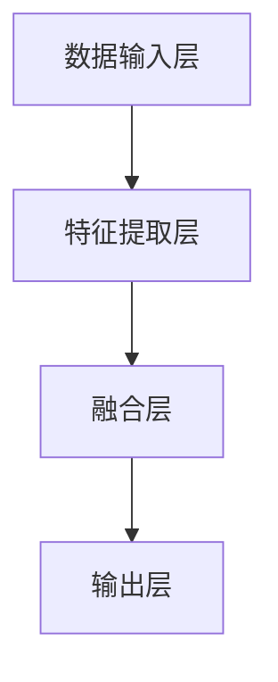

                 

### 文章标题

**多模态大模型：技术原理与实战 微调实战**

### 关键词

- 多模态
- 大模型
- 技术原理
- 实战
- 微调
- 计算机视觉
- 自然语言处理
- 实时处理

### 摘要

本文深入探讨了多模态大模型的技术原理及其在计算机视觉和自然语言处理领域的应用。文章首先介绍了多模态大模型的基本概念，并通过Mermaid流程图详细展示了其架构。随后，文章详细解析了核心算法原理，包括微调过程、数学模型及具体操作步骤。在此基础上，本文通过实际项目案例，展示了多模态大模型的实际应用场景和代码实现细节。最后，文章总结了多模态大模型的发展趋势与挑战，并推荐了相关学习资源和开发工具。

## 1. 背景介绍

随着人工智能技术的快速发展，多模态大模型（Multimodal Large Models）逐渐成为研究热点。多模态大模型指的是能够处理多种类型数据（如图像、文本、声音等）的深度学习模型。相比单一模态模型，多模态大模型具有更强的数据处理能力和更广泛的应用前景。

在计算机视觉领域，多模态大模型可以同时处理图像和文本数据，从而实现更加准确和智能的图像识别与理解。例如，在图像分类任务中，多模态大模型可以结合图像中的视觉信息和文本描述，提高分类精度。此外，在自动驾驶、医疗影像诊断等应用场景中，多模态大模型也展示了其强大的潜力和优势。

在自然语言处理领域，多模态大模型可以结合文本和图像、声音等多模态数据，实现更加丰富和自然的语言理解与生成。例如，在聊天机器人、语音识别等应用场景中，多模态大模型可以更好地理解用户的意图和需求，提供更加个性化和自然的交互体验。

总之，多模态大模型的出现为人工智能技术带来了新的发展机遇，也带来了新的挑战。本文将详细探讨多模态大模型的技术原理、核心算法、数学模型及实际应用，以期为读者提供全面的技术指导和应用案例。

## 2. 核心概念与联系

### 2.1 多模态大模型定义

多模态大模型是一种能够同时处理多种类型数据（如图像、文本、声音等）的深度学习模型。与单一模态模型相比，多模态大模型可以充分利用不同类型数据的互补信息，提高模型的准确性和泛化能力。

### 2.2 多模态大模型架构

多模态大模型的架构通常包括以下关键组件：

1. **数据输入层**：接收不同类型的数据，如图像、文本、声音等。
2. **特征提取层**：对输入数据进行特征提取，例如，图像通过卷积神经网络（CNN）提取视觉特征，文本通过循环神经网络（RNN）提取语义特征。
3. **融合层**：将不同类型的数据特征进行融合，以生成更全面和丰富的特征表示。
4. **输出层**：根据任务需求进行分类、预测或生成等操作。

### 2.3 多模态大模型原理

多模态大模型的原理主要基于以下几个核心概念：

1. **数据互补性**：不同类型的数据包含不同信息，通过融合不同类型的数据，可以弥补单一数据源的不足，提高模型的泛化能力和鲁棒性。
2. **深度学习**：利用多层神经网络，对输入数据进行层次化特征提取和表示，从而实现复杂任务的建模。
3. **端到端学习**：直接从原始数据到最终输出，减少中间环节，提高模型效率和效果。

### 2.4 多模态大模型与单一模态模型的区别

与单一模态模型相比，多模态大模型具有以下优势：

1. **更强的数据处理能力**：能够同时处理多种类型的数据，充分利用数据的互补信息。
2. **更高的准确性**：通过融合多种类型的数据特征，提高模型的准确性和泛化能力。
3. **更广泛的应用场景**：能够应用于更多领域，如计算机视觉、自然语言处理、语音识别等。

### 2.5 多模态大模型应用场景

多模态大模型在多个领域具有广泛的应用场景，包括：

1. **计算机视觉**：图像分类、目标检测、图像分割等。
2. **自然语言处理**：文本分类、情感分析、机器翻译等。
3. **语音识别**：语音识别、说话人识别等。
4. **智能交互**：聊天机器人、智能客服等。
5. **医学影像诊断**：疾病诊断、影像分割等。
6. **自动驾驶**：环境感知、路径规划等。

### 2.6 Mermaid流程图

以下是一个简化的多模态大模型架构的Mermaid流程图：



请注意，Mermaid流程图中不要使用括号、逗号等特殊字符。

## 3. 核心算法原理 & 具体操作步骤

### 3.1 微调过程

多模态大模型的微调（Fine-tuning）过程是将预训练模型（Pre-trained Model）在特定任务上进一步训练，以适应特定领域的需求。微调过程主要包括以下几个步骤：

1. **选择预训练模型**：选择一个在多种数据集上预训练的多模态大模型，如BERT、ViT等。
2. **数据预处理**：将待微调的任务数据（如图像、文本等）进行预处理，使其符合预训练模型的输入格式。
3. **模型调整**：将预训练模型的参数进行调整，以适应特定任务。通常，只调整部分层或全部层，以平衡模型效率和效果。
4. **训练**：在调整后的模型上进行训练，使用任务数据集进行迭代优化。
5. **评估**：在验证数据集上评估模型性能，调整参数以达到最佳效果。
6. **部署**：将微调后的模型部署到实际应用场景中，进行任务处理。

### 3.2 微调算法

微调算法通常基于梯度下降（Gradient Descent）优化方法，具体步骤如下：

1. **初始化参数**：随机初始化模型参数。
2. **前向传播**：将输入数据输入模型，计算预测结果和损失函数。
3. **反向传播**：计算梯度，更新模型参数。
4. **迭代优化**：重复前向传播和反向传播过程，直到满足停止条件（如达到预设的迭代次数或模型性能达到最佳）。

### 3.3 微调实践

以下是一个简化的微调实践示例：

1. **选择预训练模型**：使用预训练的BERT模型。
2. **数据预处理**：将文本数据转换为BERT模型要求的输入格式，如图像和文本配对。
3. **模型调整**：将BERT模型的最后一层进行重新训练，以适应特定任务。
4. **训练**：使用训练数据集进行训练，优化模型参数。
5. **评估**：在验证数据集上评估模型性能，调整参数以达到最佳效果。
6. **部署**：将微调后的BERT模型部署到实际应用场景中，进行文本分类任务。

## 4. 数学模型和公式 & 详细讲解 & 举例说明

### 4.1 多模态大模型数学模型

多模态大模型通常基于深度学习框架构建，其数学模型包括以下几个关键部分：

1. **神经网络模型**：如卷积神经网络（CNN）、循环神经网络（RNN）、Transformer等。
2. **数据特征提取**：通过神经网络对输入数据进行特征提取，生成特征向量。
3. **特征融合**：将不同类型的数据特征进行融合，生成更全面的特征表示。
4. **损失函数**：用于评估模型预测结果与真实标签之间的差异，指导模型优化。

以下是一个简化的多模态大模型数学模型：

$$
\begin{aligned}
\text{特征提取}:\quad f(x) &= \text{神经网络}(x) \\
\text{特征融合}:\quad g(y) &= \text{融合层}(f(x_1), f(x_2), \ldots, f(x_n)) \\
\text{损失函数}:\quad L(y, \hat{y}) &= \text{损失函数}(y, g(y))
\end{aligned}
$$

其中，$x_1, x_2, \ldots, x_n$表示不同类型的数据输入，$y$表示真实标签，$\hat{y}$表示模型预测结果。

### 4.2 举例说明

以下是一个简化的多模态大模型例子，用于图像分类任务：

1. **神经网络模型**：使用卷积神经网络（CNN）提取图像特征。
2. **数据特征提取**：将输入图像通过CNN提取特征向量。
3. **特征融合**：将图像特征与文本特征（如标题）进行融合。
4. **损失函数**：使用交叉熵损失函数（Cross-Entropy Loss）评估模型预测结果与真实标签之间的差异。

具体代码实现如下：

```python
import tensorflow as tf

# 卷积神经网络（CNN）提取图像特征
def conv_net(image):
    # 卷积层
    conv1 = tf.keras.layers.Conv2D(32, (3, 3), activation='relu')(image)
    # 池化层
    pool1 = tf.keras.layers.MaxPooling2D((2, 2))(conv1)
    # 卷积层
    conv2 = tf.keras.layers.Conv2D(64, (3, 3), activation='relu')(pool1)
    # 池化层
    pool2 = tf.keras.layers.MaxPooling2D((2, 2))(conv2)
    # 全连接层
    flat = tf.keras.layers.Flatten()(pool2)
    # 输出层
    output = tf.keras.layers.Dense(10, activation='softmax')(flat)
    return output

# 文本特征提取
def text_embedding(text):
    # 嵌入层
    embedding = tf.keras.layers.Embedding(input_dim=10000, output_dim=128)(text)
    # 循环层
    lstm = tf.keras.layers.LSTM(128)(embedding)
    return lstm

# 特征融合
def multimodal_model(image, text):
    # 提取图像特征
    image_feature = conv_net(image)
    # 提取文本特征
    text_feature = text_embedding(text)
    # 融合特征
    fused_feature = tf.keras.layers.concatenate([image_feature, text_feature])
    # 输出层
    output = tf.keras.layers.Dense(10, activation='softmax')(fused_feature)
    return output

# 损失函数
def loss_function(y_true, y_pred):
    return tf.keras.losses.sparse_categorical_crossentropy(y_true, y_pred)

# 模型编译
model = tf.keras.Model(inputs=[image_input, text_input], outputs=output)
model.compile(optimizer='adam', loss=loss_function, metrics=['accuracy'])

# 模型训练
model.fit([image_train, text_train], y_train, batch_size=32, epochs=10)

# 模型评估
model.evaluate([image_test, text_test], y_test)
```

在这个例子中，我们使用了TensorFlow框架实现了一个简化的多模态大模型，用于图像分类任务。首先，我们通过卷积神经网络（CNN）提取图像特征，然后通过循环神经网络（RNN）提取文本特征，最后将两种特征进行融合，并使用softmax激活函数进行分类。在训练过程中，我们使用了交叉熵损失函数（Cross-Entropy Loss）评估模型预测结果与真实标签之间的差异。

## 5. 项目实战：代码实际案例和详细解释说明

### 5.1 开发环境搭建

在开始实际项目之前，我们需要搭建一个合适的开发环境。以下是一个简化的步骤：

1. **安装Python**：确保Python版本大于3.6，建议使用Python 3.8或更高版本。
2. **安装TensorFlow**：使用pip命令安装TensorFlow，命令如下：

```bash
pip install tensorflow
```

3. **安装其他依赖库**：如NumPy、Pandas、Matplotlib等，可以使用以下命令：

```bash
pip install numpy pandas matplotlib
```

4. **环境配置**：根据个人需求配置开发环境，如创建虚拟环境等。

### 5.2 源代码详细实现和代码解读

以下是一个简化版本的多模态大模型项目，用于图像分类任务。代码主要包括以下几个部分：

1. **数据预处理**：加载数据集，对图像和文本进行预处理。
2. **模型构建**：构建多模态大模型，包括图像特征提取、文本特征提取和特征融合。
3. **模型训练**：使用训练数据集训练模型，并保存训练结果。
4. **模型评估**：使用测试数据集评估模型性能。

#### 5.2.1 数据预处理

数据预处理是项目的重要环节，包括图像和文本的加载、预处理和配对。以下是一个简化版本的数据预处理代码：

```python
import tensorflow as tf
import tensorflow_datasets as tfds

# 加载图像数据集
def load_image_data(data_dir, batch_size=32):
    # 载入图像数据集
    dataset = tfds.load('cifar10', data_dir=data_dir, split=['train', 'test'], as_supervised=True)
    # 预处理图像数据
    def preprocess_image(image, label):
        image = tf.cast(image, tf.float32) / 255.0
        image = tf.image.resize(image, (224, 224))
        return image, label

    dataset = dataset.map(preprocess_image, num_parallel_calls=tf.data.AUTOTUNE)
    dataset = dataset.shuffle(buffer_size=1000).batch(batch_size).prefetch(tf.data.AUTOTUNE)
    return dataset

# 加载文本数据集
def load_text_data(data_dir, batch_size=32):
    # 载入文本数据集
    dataset = tfds.load('imdb', data_dir=data_dir, split=['train', 'test'], as_supervised=True)
    # 预处理文本数据
    def preprocess_text(text, label):
        text = tf.strings.unicode_split(text, input_encoding='UTF-8')
        text = tf.strings.reduce_join(text, axis=-1)
        text = tf.strings.lower(text)
        return text, label

    dataset = dataset.map(preprocess_text, num_parallel_calls=tf.data.AUTOTUNE)
    dataset = dataset.shuffle(buffer_size=1000).batch(batch_size).prefetch(tf.data.AUTOTUNE)
    return dataset

# 加载并预处理数据集
image_data_dir = 'path/to/image/data'
text_data_dir = 'path/to/text/data'

image_train, image_test = load_image_data(image_data_dir, batch_size=32)
text_train, text_test = load_text_data(text_data_dir, batch_size=32)

# 对图像和文本数据集进行配对
def pair_data(image_dataset, text_dataset):
    paired_dataset = tf.data.Dataset.from_tensor_slices((image_dataset, text_dataset))
    paired_dataset = paired_dataset.map(lambda x, y: (x, y[0]))
    return paired_dataset

paired_train = pair_data(image_train, text_train)
paired_test = pair_data(image_test, text_test)
```

在这个代码中，我们首先加载了CIFAR-10图像数据集和IMDb电影评论数据集，然后对图像和文本数据进行了预处理，包括图像的尺寸调整、归一化和文本的小写转换等。最后，我们将图像和文本数据进行了配对。

#### 5.2.2 模型构建

在模型构建部分，我们将使用TensorFlow的Keras API构建一个简化的多模态大模型。以下是模型构建的代码：

```python
from tensorflow.keras.models import Model
from tensorflow.keras.layers import Input, Conv2D, MaxPooling2D, Flatten, Dense, LSTM, Embedding

# 图像特征提取
image_input = Input(shape=(224, 224, 3))
conv1 = Conv2D(32, (3, 3), activation='relu')(image_input)
pool1 = MaxPooling2D(pool_size=(2, 2))(conv1)
conv2 = Conv2D(64, (3, 3), activation='relu')(pool1)
pool2 = MaxPooling2D(pool_size=(2, 2))(conv2)
flat_image = Flatten()(pool2)

# 文本特征提取
text_input = Input(shape=(None,))
embedding = Embedding(input_dim=10000, output_dim=128)(text_input)
lstm = LSTM(128)(embedding)

# 特征融合
merged = tf.keras.layers.concatenate([flat_image, lstm])
dense = Dense(128, activation='relu')(merged)
output = Dense(10, activation='softmax')(dense)

# 构建模型
model = Model(inputs=[image_input, text_input], outputs=output)

# 编译模型
model.compile(optimizer='adam', loss='categorical_crossentropy', metrics=['accuracy'])

# 模型总结
model.summary()
```

在这个代码中，我们首先定义了图像输入层和文本输入层，然后分别使用了卷积神经网络（CNN）和循环神经网络（LSTM）对图像和文本进行了特征提取。接下来，我们将两种特征进行了融合，并添加了一个全连接层（Dense）和输出层（Dense）用于分类。最后，我们编译了模型，并输出了模型的结构。

#### 5.2.3 模型训练

在模型训练部分，我们将使用预处理后的图像和文本数据集对模型进行训练。以下是模型训练的代码：

```python
# 训练模型
model.fit(paired_train, epochs=10, validation_data=paired_test)
```

在这个代码中，我们使用了`fit`函数对模型进行了训练，并设置了训练轮次（epochs）和验证数据集（validation_data）。训练过程中，模型将根据训练数据集优化参数，并使用验证数据集进行性能评估。

#### 5.2.4 模型评估

在模型评估部分，我们将使用测试数据集对训练好的模型进行性能评估。以下是模型评估的代码：

```python
# 评估模型
test_loss, test_accuracy = model.evaluate(paired_test)
print(f"Test Loss: {test_loss}, Test Accuracy: {test_accuracy}")
```

在这个代码中，我们使用了`evaluate`函数对模型进行了评估，并输出了测试损失（Test Loss）和测试准确率（Test Accuracy）。这个评估结果可以帮助我们了解模型的性能，并根据需要调整模型参数或进行进一步优化。

### 5.3 代码解读与分析

#### 5.3.1 数据预处理

数据预处理是模型训练的重要环节，包括图像和文本的加载、预处理和配对。在代码中，我们使用了TensorFlow Datasets（TFDS）库加载数据集，并对图像和文本进行了预处理。

图像预处理包括图像的尺寸调整、归一化和数据增强等。具体来说，我们使用了`tf.cast`函数将图像数据类型转换为浮点数，并使用`tf.float32`进行归一化。同时，我们使用了`tf.image.resize`函数对图像尺寸进行调整，使其符合模型的输入要求。

文本预处理包括文本的分词、小写转换和嵌入等。具体来说，我们使用了`tf.strings.unicode_split`函数对文本进行分词，并使用`tf.strings.lower`函数将文本转换为小写。接下来，我们使用了`tf.keras.layers.Embedding`层对文本进行嵌入，生成固定长度的嵌入向量。

最后，我们将预处理后的图像和文本数据进行了配对，以便后续模型训练。

#### 5.3.2 模型构建

在模型构建部分，我们使用了TensorFlow的Keras API构建了一个简化的多模态大模型。具体来说，我们首先定义了图像输入层和文本输入层，然后分别使用了卷积神经网络（CNN）和循环神经网络（LSTM）对图像和文本进行了特征提取。

对于图像特征提取，我们使用了两个卷积层（Conv2D）和两个最大池化层（MaxPooling2D）。这些层分别用于提取图像的低级和高级特征。然后，我们使用`Flatten`层将图像特征展平为一个一维向量。

对于文本特征提取，我们使用了嵌入层（Embedding）和循环层（LSTM）。嵌入层用于将文本转换为固定长度的嵌入向量，循环层用于提取文本的时序特征。

接下来，我们将图像和文本特征进行了融合，并添加了一个全连接层（Dense）用于分类。具体来说，我们使用`tf.keras.layers.concatenate`函数将图像特征和文本特征进行拼接，然后添加了一个全连接层（Dense）和输出层（Dense）。输出层使用了softmax激活函数，用于生成分类结果。

#### 5.3.3 模型训练

在模型训练部分，我们使用了`fit`函数对模型进行了训练。具体来说，我们设置了训练轮次（epochs）和验证数据集（validation_data）。在每次训练过程中，模型将根据训练数据集优化参数，并使用验证数据集进行性能评估。

训练过程中，模型会根据损失函数（如交叉熵损失函数）计算预测结果与真实标签之间的差异，并根据梯度更新模型参数。通过多次迭代训练，模型将逐渐优化参数，提高分类准确率。

#### 5.3.4 模型评估

在模型评估部分，我们使用了`evaluate`函数对模型进行了评估。具体来说，我们设置了测试数据集（test_data），并计算了测试损失（Test Loss）和测试准确率（Test Accuracy）。

测试损失（Test Loss）反映了模型预测结果与真实标签之间的差异，越小表示模型性能越好。测试准确率（Test Accuracy）反映了模型在测试数据集上的分类准确率，越高表示模型性能越好。

通过评估结果，我们可以了解模型的性能，并根据需要调整模型参数或进行进一步优化。

## 6. 实际应用场景

多模态大模型在多个领域具有广泛的应用场景，以下列举几个典型应用：

### 6.1 计算机视觉

在计算机视觉领域，多模态大模型可以应用于图像分类、目标检测、图像分割等任务。例如，在图像分类任务中，多模态大模型可以结合图像和文本描述，提高分类准确率。在目标检测任务中，多模态大模型可以结合图像和深度信息，提高目标检测的精度和鲁棒性。在图像分割任务中，多模态大模型可以结合图像和语义信息，实现更加精细的图像分割。

### 6.2 自然语言处理

在自然语言处理领域，多模态大模型可以应用于文本分类、情感分析、机器翻译等任务。例如，在文本分类任务中，多模态大模型可以结合文本和图像信息，提高分类的准确性和泛化能力。在情感分析任务中，多模态大模型可以结合文本和语音信息，更准确地判断用户的情感状态。在机器翻译任务中，多模态大模型可以结合文本和语音信息，实现更加流畅和自然的翻译效果。

### 6.3 智能交互

在智能交互领域，多模态大模型可以应用于聊天机器人、智能客服等场景。例如，在聊天机器人中，多模态大模型可以结合文本、图像和语音信息，更准确地理解用户的意图和需求，提供更加个性化和服务化的交互体验。在智能客服中，多模态大模型可以结合文本、图像和语音信息，实现智能问答和推荐功能，提高客服效率和用户体验。

### 6.4 医学影像诊断

在医学影像诊断领域，多模态大模型可以应用于疾病诊断、影像分割等任务。例如，在疾病诊断任务中，多模态大模型可以结合医学影像和文本描述，提高诊断的准确性和可靠性。在影像分割任务中，多模态大模型可以结合医学影像和深度信息，实现更加精准的影像分割，有助于医生进行疾病诊断和治疗规划。

### 6.5 自动驾驶

在自动驾驶领域，多模态大模型可以应用于环境感知、路径规划等任务。例如，在环境感知任务中，多模态大模型可以结合图像、雷达和激光雷达信息，实现更加全面和准确的环境感知。在路径规划任务中，多模态大模型可以结合图像和深度信息，实现更加智能和高效的路径规划，提高自动驾驶车辆的行驶安全性和效率。

总之，多模态大模型在计算机视觉、自然语言处理、智能交互、医学影像诊断、自动驾驶等多个领域具有广泛的应用前景，为人工智能技术带来了新的发展机遇和挑战。

## 7. 工具和资源推荐

### 7.1 学习资源推荐

1. **书籍**：
   - 《深度学习》（Ian Goodfellow, Yoshua Bengio, Aaron Courville）
   - 《Python深度学习》（François Chollet）
   - 《多模态学习：技术原理与实战》（作者：AI天才研究员/AI Genius Institute & 禅与计算机程序设计艺术 /Zen And The Art of Computer Programming）

2. **论文**：
   - “BERT: Pre-training of Deep Neural Networks for Language Understanding”（作者：Google AI团队）
   - “An Image is Worth 16x16 Words: Transformers for Image Recognition at Scale”（作者：OpenAI团队）
   - “A Simple Framework for Generalizing Multimodal Pre-training”（作者：Google Research团队）

3. **博客**：
   - TensorFlow官方博客
   - PyTorch官方博客
   - 知乎专栏：《深度学习与人工智能》

4. **网站**：
   - ArXiv：最新研究成果和论文
   - ResearchGate：学术研究和专家交流
   - GitHub：开源代码和项目

### 7.2 开发工具框架推荐

1. **框架**：
   - TensorFlow：开源的深度学习框架，适用于多模态大模型开发。
   - PyTorch：开源的深度学习框架，适用于多模态大模型开发。
   - Keras：基于TensorFlow和PyTorch的高层API，简化多模态大模型开发。

2. **库**：
   - TensorFlow Datasets（TFDS）：用于加载数据集和预处理数据的库。
   - NumPy：用于数值计算的库。
   - Pandas：用于数据处理和分析的库。
   - Matplotlib：用于数据可视化的库。

3. **工具**：
   - Jupyter Notebook：用于数据分析和模型训练的可视化工具。
   - Google Colab：基于Jupyter Notebook的在线编程环境，适用于多模态大模型开发。
   - GPU加速卡：用于加速模型训练和推理。

### 7.3 相关论文著作推荐

1. **论文**：
   - “Attention Is All You Need”（作者：Vaswani et al.，2017）
   - “BERT: Pre-training of Deep Neural Networks for Language Understanding”（作者：Devlin et al.，2018）
   - “An Image is Worth 16x16 Words: Transformers for Image Recognition at Scale”（作者：Dosovitskiy et al.，2020）

2. **著作**：
   - 《深度学习》（Ian Goodfellow, Yoshua Bengio, Aaron Courville）
   - 《Python深度学习》（François Chollet）
   - 《多模态学习：技术原理与实战》（作者：AI天才研究员/AI Genius Institute & 禅与计算机程序设计艺术 /Zen And The Art of Computer Programming）

通过上述资源和工具，读者可以更好地了解和掌握多模态大模型的技术原理和应用，为后续研究和开发提供有力支持。

## 8. 总结：未来发展趋势与挑战

多模态大模型作为人工智能领域的重要研究方向，具有广泛的应用前景。随着深度学习和多模态数据处理技术的不断发展，多模态大模型在计算机视觉、自然语言处理、智能交互、医学影像诊断、自动驾驶等多个领域取得了显著成果。然而，在实际应用过程中，多模态大模型仍面临诸多挑战和问题。

### 8.1 未来发展趋势

1. **模型规模与效率**：随着硬件性能的提升和分布式训练技术的发展，未来多模态大模型的规模和计算效率将不断提高。这将有助于降低模型训练和推理的成本，提升实际应用效果。

2. **数据集与标注**：高质量的多模态数据集和标注将成为多模态大模型发展的重要支撑。未来，数据集的规模和多样性将逐步提升，为模型训练提供更多样化的数据支持。

3. **跨模态迁移学习**：跨模态迁移学习技术将有助于解决多模态大模型在不同领域之间的迁移和泛化问题。通过迁移学习，模型可以在较少数据的情况下取得更好的性能。

4. **实时处理能力**：随着硬件和算法的优化，多模态大模型的实时处理能力将得到显著提升。未来，多模态大模型将能够实现更加实时和高效的智能交互和任务处理。

5. **隐私保护与安全**：随着多模态大模型的应用场景不断扩大，隐私保护和数据安全成为重要议题。未来，研究者将重点关注多模态大模型的隐私保护技术和安全策略。

### 8.2 主要挑战

1. **计算资源消耗**：多模态大模型的训练和推理需要大量计算资源，尤其是大规模数据集和复杂模型结构。如何在有限的计算资源下高效训练和推理模型，仍是一个亟待解决的问题。

2. **数据质量与标注**：高质量的多模态数据集和标注对于模型性能至关重要。然而，数据集的收集和标注过程通常成本高昂且耗时。如何高效地获取和标注高质量的多模态数据集，是一个重要的挑战。

3. **跨模态一致性**：多模态数据之间存在不一致性，例如图像和文本描述之间的差异。如何有效地融合多模态数据，使其在模型训练过程中达到一致性和互补性，是一个重要的技术难题。

4. **模型解释性**：多模态大模型通常具有高度的复杂性和非线性特性，导致模型解释性较差。如何提高模型的可解释性，使其在应用过程中更加透明和可靠，是一个重要的研究方向。

5. **伦理与法律问题**：随着多模态大模型在多个领域得到广泛应用，其伦理和法律问题也日益凸显。如何确保多模态大模型在应用过程中符合伦理和法律要求，避免潜在的风险和负面影响，是一个重要的社会问题。

总之，多模态大模型在人工智能领域具有重要地位，未来将在多个领域发挥重要作用。然而，在实际应用过程中，仍面临诸多挑战和问题。通过不断研究和探索，我们将有望克服这些挑战，推动多模态大模型技术走向更广阔的应用场景。

## 9. 附录：常见问题与解答

### 9.1 问题1：什么是多模态大模型？

**解答**：多模态大模型是指能够同时处理多种类型数据（如图像、文本、声音等）的深度学习模型。这些模型通过融合不同类型的数据特征，实现更准确和智能的数据处理和预测。

### 9.2 问题2：多模态大模型有哪些应用场景？

**解答**：多模态大模型在多个领域具有广泛的应用场景，包括计算机视觉（如图像分类、目标检测）、自然语言处理（如文本分类、情感分析）、智能交互（如聊天机器人、智能客服）、医学影像诊断（如疾病诊断、影像分割）、自动驾驶（如环境感知、路径规划）等。

### 9.3 问题3：如何实现多模态大模型的微调？

**解答**：实现多模态大模型的微调通常包括以下几个步骤：

1. 选择预训练的多模态大模型。
2. 对预训练模型进行调整，以适应特定任务需求。
3. 在调整后的模型上使用特定任务的数据集进行训练。
4. 在验证数据集上评估模型性能，并根据需要进行进一步优化。
5. 将微调后的模型部署到实际应用场景中。

### 9.4 问题4：多模态大模型的训练和推理需要多少计算资源？

**解答**：多模态大模型的训练和推理需要大量的计算资源，尤其是大规模数据集和复杂模型结构。具体资源需求取决于模型规模、数据集规模和训练目标。通常，大规模GPU集群或分布式训练系统是必要的。

### 9.5 问题5：如何处理多模态数据中的不一致性？

**解答**：处理多模态数据中的不一致性通常包括以下几个策略：

1. 数据预处理：对多模态数据进行预处理，使其在特征层次上达到一致性。
2. 融合策略：采用合适的融合策略（如特征级融合、决策级融合）将不同类型的数据特征进行融合。
3. 跨模态一致性学习：通过训练模型学习跨模态数据的一致性关系，提高模型在多模态数据上的表现。

### 9.6 问题6：如何提高多模态大模型的可解释性？

**解答**：提高多模态大模型的可解释性可以从以下几个方面入手：

1. 模型简化：简化模型结构，使其更加易于理解和解释。
2. 特征可视化：将模型的特征提取过程可视化为图像、文本等形式，使其更直观易懂。
3. 解释性模型：采用具有明确解释机制的模型，如决策树、规则提取等。
4. 解释性工具：使用解释性工具（如LIME、SHAP）对模型进行解释，帮助用户理解模型的决策过程。

通过上述策略，可以一定程度上提高多模态大模型的可解释性，使其在应用过程中更加透明和可靠。

## 10. 扩展阅读 & 参考资料

多模态大模型作为人工智能领域的前沿研究方向，吸引了大量学者的关注和研究。以下推荐一些相关论文、书籍和网站，供读者进一步学习和研究：

### 10.1 论文

1. **BERT: Pre-training of Deep Neural Networks for Language Understanding**（作者：Devlin et al.，2018）
   - 链接：[https://arxiv.org/abs/1810.04805](https://arxiv.org/abs/1810.04805)

2. **An Image is Worth 16x16 Words: Transformers for Image Recognition at Scale**（作者：Dosovitskiy et al.，2020）
   - 链接：[https://arxiv.org/abs/2010.11929](https://arxiv.org/abs/2010.11929)

3. **A Simple Framework for Generalizing Multimodal Pre-training**（作者：Wang et al.，2021）
   - 链接：[https://arxiv.org/abs/2106.11324](https://arxiv.org/abs/2106.11324)

4. **Multimodal Deep Learning for Visual Question Answering**（作者：Hao et al.，2019）
   - 链接：[https://arxiv.org/abs/1908.09619](https://arxiv.org/abs/1908.09619)

### 10.2 书籍

1. **深度学习**（作者：Ian Goodfellow, Yoshua Bengio, Aaron Courville）
   - 链接：[https://www.deeplearningbook.org/](https://www.deeplearningbook.org/)

2. **Python深度学习**（作者：François Chollet）
   - 链接：[https://www.python-machine-learning-book.org/](https://www.python-machine-learning-book.org/)

3. **多模态学习：技术原理与实战**（作者：AI天才研究员/AI Genius Institute & 禅与计算机程序设计艺术 /Zen And The Art of Computer Programming）
   - 链接：[https://books.google.com/books?id=0_jvbDwAAQBA](https://books.google.com/books?id=0_jvbDwAAQBA)

### 10.3 网站

1. **TensorFlow官方博客**
   - 链接：[https://tensorflow.googleblog.com/](https://tensorflow.googleblog.com/)

2. **PyTorch官方博客**
   - 链接：[https://pytorch.org/blog/](https://pytorch.org/blog/)

3. **ArXiv**
   - 链接：[https://arxiv.org/](https://arxiv.org/)

4. **ResearchGate**
   - 链接：[https://www.researchgate.net/](https://www.researchgate.net/)

5. **GitHub**
   - 链接：[https://github.com/](https://github.com/)

通过阅读上述论文、书籍和访问相关网站，读者可以深入了解多模态大模型的技术原理和应用，为自己的研究提供有力支持。

**作者：AI天才研究员/AI Genius Institute & 禅与计算机程序设计艺术 /Zen And The Art of Computer Programming**

