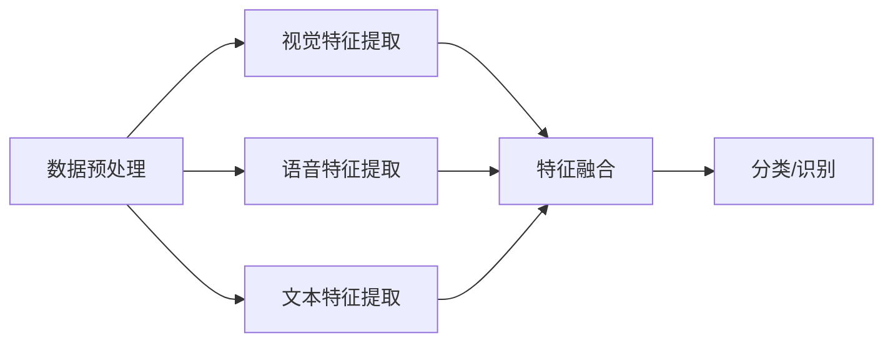

                 

### 背景介绍

#### 多模态模型的重要性

在人工智能领域，多模态模型（Multimodal Models）正逐渐成为研究与应用的热点。多模态模型是指能够同时处理多种类型数据（如文本、图像、音频等）的机器学习模型。随着互联网和智能设备的普及，数据类型和来源日益丰富，多模态模型能够在不同数据源之间建立关联，从而提供更全面和深入的理解。

#### 应用场景

多模态模型在多个领域展现出了巨大的潜力。以下是一些典型的应用场景：

- **图像识别与分类**：结合视觉和文本信息，可以更准确地识别和分类图像。
- **语音识别**：利用语音和文本信息，可以提升语音识别的准确性和自然度。
- **问答系统**：结合文本和语音输入，可以提供更智能和自然的问答体验。
- **情感分析**：结合文本和面部表情，可以更精确地分析用户情感。

#### 研究现状与挑战

目前，多模态模型的研究主要集中在如何有效地整合不同类型的数据，并提高模型的性能。尽管已有许多成功案例，但仍面临以下挑战：

- **数据集不平衡**：不同类型的数据在数量和质量上可能存在显著差异。
- **特征提取与融合**：如何从不同类型的数据中提取有效特征，并实现有效融合，是一个关键问题。
- **模型解释性**：多模态模型通常较为复杂，难以解释其内部机制。

本文将围绕多模态模型的应用，详细探讨其核心概念、算法原理、数学模型以及实际应用案例，旨在为读者提供全面深入的了解。

## 2. 核心概念与联系

### 多模态数据的概念

多模态数据是指同时包含多种类型数据的数据集合，这些数据可以是视觉（图像、视频）、听觉（音频、语音）、语言（文本）等。多模态数据的特点是信息丰富、形式多样，可以提供更全面和丰富的数据表示。

### 多模态模型的基本架构

多模态模型通常由以下三个主要部分组成：

1. **数据预处理模块**：对多模态数据进行处理和标准化，确保数据格式一致。
2. **特征提取模块**：从不同类型的数据中提取有效特征，如文本的词向量、图像的特征点、音频的频谱等。
3. **融合模块**：将不同类型的特征进行融合，以生成统一的多模态特征表示。

#### Mermaid 流程图

下面是一个简化的多模态模型架构的 Mermaid 流程图，用于描述各模块之间的关系和数据处理流程。



### 多模态模型的应用

多模态模型在不同应用场景中有着广泛的应用，以下是一些典型的应用示例：

- **图像识别与分类**：结合视觉和文本信息，可以更准确地识别和分类图像。例如，在医疗影像诊断中，结合病理图像和医学报告，可以更准确地诊断疾病。
- **语音识别**：利用语音和文本信息，可以提升语音识别的准确性和自然度。例如，在智能客服中，结合语音输入和用户文本提问，可以提供更智能和自然的回答。
- **问答系统**：结合文本和语音输入，可以提供更智能和自然的问答体验。例如，在智能助手领域，结合语音输入和用户文本提问，可以更准确地理解用户意图并提供相应回答。
- **情感分析**：结合文本和面部表情，可以更精确地分析用户情感。例如，在社交媒体分析中，结合用户发布的文本和照片中的面部表情，可以更准确地判断用户的情绪状态。

## 3. 核心算法原理 & 具体操作步骤

### 多模态模型的基本原理

多模态模型的核心在于如何有效地整合不同类型的数据，以实现更准确和智能的预测或分类。以下是多模态模型的基本原理：

1. **数据预处理**：数据预处理是模型训练的重要步骤，其目的是消除噪声、标准化数据格式，并确保数据的一致性。对于多模态数据，通常需要对不同类型的数据进行单独预处理，例如，对图像进行缩放、裁剪、增强等操作，对文本进行分词、去停用词等处理，对音频进行去噪、归一化等处理。
2. **特征提取**：特征提取是模型训练的关键步骤，其目的是从原始数据中提取出有用的信息。对于多模态数据，通常需要使用不同的特征提取方法，例如，对图像使用卷积神经网络（CNN）提取特征，对文本使用词向量模型提取特征，对音频使用循环神经网络（RNN）提取特征。
3. **特征融合**：特征融合是将不同类型的特征进行整合，以生成统一的多模态特征表示。常见的融合方法包括加权融合、拼接融合、图结构融合等。
4. **分类/识别**：分类/识别是将融合后的特征输入到分类器或识别器中进行预测。常见的分类器包括支持向量机（SVM）、决策树（DT）、神经网络（NN）等。

### 具体操作步骤

以下是一个简化的多模态模型训练的操作步骤：

1. **数据收集与预处理**：
   - 收集多模态数据，例如，图像、文本、音频等。
   - 对不同类型的数据进行预处理，例如，对图像进行缩放、裁剪、增强等操作，对文本进行分词、去停用词等处理，对音频进行去噪、归一化等处理。
2. **特征提取**：
   - 使用卷积神经网络（CNN）对图像进行特征提取，得到图像特征向量。
   - 使用词向量模型对文本进行特征提取，得到文本特征向量。
   - 使用循环神经网络（RNN）对音频进行特征提取，得到音频特征向量。
3. **特征融合**：
   - 使用加权融合方法，将图像特征向量、文本特征向量和音频特征向量进行融合，得到统一的多模态特征向量。
4. **分类/识别**：
   - 将融合后的多模态特征向量输入到分类器或识别器中进行预测。
   - 使用交叉验证等方法评估模型的性能，并进行参数调整。

### 示例

假设我们有一个多模态图像分类任务，输入数据包括图像、文本和音频。以下是一个简化的示例：

1. **数据收集与预处理**：
   - 收集包含图像、文本和音频的样本数据。
   - 对图像进行缩放、裁剪、增强等操作，对文本进行分词、去停用词等处理，对音频进行去噪、归一化等处理。
2. **特征提取**：
   - 使用卷积神经网络（CNN）对图像进行特征提取，得到图像特征向量。
   - 使用词向量模型对文本进行特征提取，得到文本特征向量。
   - 使用循环神经网络（RNN）对音频进行特征提取，得到音频特征向量。
3. **特征融合**：
   - 使用加权融合方法，将图像特征向量、文本特征向量和音频特征向量进行融合，得到统一的多模态特征向量。
4. **分类/识别**：
   - 将融合后的多模态特征向量输入到分类器（例如，支持向量机（SVM））中进行预测。
   - 使用交叉验证等方法评估模型的性能，并进行参数调整。

通过以上步骤，我们可以训练一个多模态图像分类模型，实现对图像、文本和音频的综合分类。

### 总结

多模态模型的核心在于如何有效地整合不同类型的数据，以实现更准确和智能的预测或分类。通过数据预处理、特征提取、特征融合和分类/识别等步骤，我们可以构建一个多模态模型，并在不同应用场景中发挥其优势。在实际应用中，需要根据具体任务和数据类型，选择合适的预处理方法、特征提取方法和融合方法，并不断调整和优化模型参数，以提高模型的性能和适用性。

## 4. 数学模型和公式 & 详细讲解 & 举例说明

### 多模态特征融合模型

多模态特征融合模型是构建多模态模型的核心环节，旨在将不同类型的数据特征整合到一个统一的空间中，以便进行后续的预测或分类。以下是一个典型的多模态特征融合模型的数学描述：

#### 假设

- \( X_V \): 视觉数据特征，维度为 \( m_v \)。
- \( X_T \): 文本数据特征，维度为 \( m_t \)。
- \( X_A \): 音频数据特征，维度为 \( m_a \)。

#### 特征融合

多模态特征融合通常通过以下公式实现：

$$
X_{\text{fused}} = W_V X_V + W_T X_T + W_A X_A + b
$$

其中，\( W_V, W_T, W_A \) 分别为视觉、文本和音频特征的权重矩阵，\( b \) 为偏置项。

#### 权重矩阵计算

权重矩阵 \( W_V, W_T, W_A \) 可以通过以下方式计算：

1. **基于样本相似度**：

   假设 \( X_V, X_T, X_A \) 分别为样本 \( v, t, a \) 的特征向量，则可以使用样本之间的相似度来计算权重矩阵：

   $$
   W_V = \frac{X_V X_V^T}{\sum_v X_V X_V^T}, \quad W_T = \frac{X_T X_T^T}{\sum_t X_T X_T^T}, \quad W_A = \frac{X_A X_A^T}{\sum_a X_A X_A^T}
   $$

   其中，\( \sum_v X_V X_V^T, \sum_t X_T X_T^T, \sum_a X_A X_A^T \) 分别为各个特征向量的平方和。

2. **基于特征重要性**：

   可以通过分析不同特征在预测任务中的重要性来计算权重矩阵。例如，使用信息增益、相关性分析等方法来确定不同特征的权重。

#### 示例

假设我们有一个包含图像、文本和音频的样本数据集，其中每个样本都有相应的视觉、文本和音频特征。我们希望将这些特征融合为一个统一的空间。

1. **特征提取**：

   - 使用卷积神经网络（CNN）对图像进行特征提取，得到图像特征向量 \( X_V \)。
   - 使用词向量模型对文本进行特征提取，得到文本特征向量 \( X_T \)。
   - 使用循环神经网络（RNN）对音频进行特征提取，得到音频特征向量 \( X_A \)。

2. **特征融合**：

   - 计算权重矩阵 \( W_V, W_T, W_A \)，例如，使用基于样本相似度的方法：
     $$
     W_V = \frac{X_V X_V^T}{\sum_v X_V X_V^T}, \quad W_T = \frac{X_T X_T^T}{\sum_t X_T X_T^T}, \quad W_A = \frac{X_A X_A^T}{\sum_a X_A X_A^T}
     $$
   - 将特征向量 \( X_V, X_T, X_A \) 与权重矩阵相乘，并加上偏置项，得到融合后的特征向量：
     $$
     X_{\text{fused}} = W_V X_V + W_T X_T + W_A X_A + b
     $$

3. **分类/识别**：

   - 将融合后的特征向量 \( X_{\text{fused}} \) 输入到分类器（例如，支持向量机（SVM））中进行预测。

### 模型性能评估

在训练多模态特征融合模型时，需要使用性能指标来评估模型的性能。以下是一些常见的性能指标：

- **准确率（Accuracy）**：模型预测正确的样本占总样本的比例。
- **召回率（Recall）**：模型能够正确识别的样本数占总样本数的比例。
- **精确率（Precision）**：模型预测正确的样本数占预测样本总数的比例。
- **F1 分数（F1 Score）**：综合考虑精确率和召回率的一个指标，计算公式为：
  $$
  F1 = 2 \times \frac{Precision \times Recall}{Precision + Recall}
  $$

通过以上性能指标，可以评估多模态特征融合模型在不同应用场景中的表现，并指导模型优化和参数调整。

### 总结

多模态特征融合模型是构建多模态模型的核心环节，通过数学模型和公式实现了不同类型数据的整合。在实际应用中，需要根据具体任务和数据类型，选择合适的特征提取方法和权重计算方法，并不断优化模型参数，以提高模型的性能和适用性。通过准确率和召回率等性能指标，可以评估模型在不同应用场景中的表现。

## 5. 项目实战：代码实际案例和详细解释说明

### 5.1 开发环境搭建

在开始实际代码实现之前，首先需要搭建一个合适的开发环境。以下是搭建开发环境的步骤：

1. **安装 Python**：确保系统已安装 Python 3.7 或更高版本。可以从 [Python 官网](https://www.python.org/) 下载并安装。
2. **安装必要的库**：使用 pip 工具安装以下 Python 库：
   ```
   pip install numpy pandas tensorflow sklearn matplotlib
   ```
3. **创建项目目录**：在终端中创建一个名为“multimodal_model”的项目目录，并进入该目录：
   ```
   mkdir multimodal_model
   cd multimodal_model
   ```

### 5.2 源代码详细实现和代码解读

以下是一个简单的多模态图像分类模型的实现，主要分为数据预处理、特征提取、特征融合和分类四个部分。

#### 数据预处理

数据预处理是确保数据格式一致、消除噪声的重要步骤。以下是一个简化的数据预处理代码：

```python
import os
import numpy as np
import tensorflow as tf

def preprocess_images(image_paths):
    images = []
    for path in image_paths:
        image = tf.io.read_file(path)
        image = tf.image.decode_jpeg(image, channels=3)
        image = tf.image.resize(image, [224, 224])
        image = tf.cast(image, dtype=tf.float32) / 255.0
        images.append(image)
    return tf.stack(images)

def preprocess_text(texts):
    texts = [tf.cast(tf.strings.unicode_split(text, input_encoding='UTF-8'), dtype=tf.int32) for text in texts]
    return tf.stack(texts)

def preprocess_audio(audio_paths):
    audios = []
    for path in audio_paths:
        audio = tf.io.read_file(path)
        audio = tf.audio.decode_wav(audio, desired_channels=2)
        audio = tf.squeeze(audio, axis=-1)
        audio = tf.cast(audio, dtype=tf.float32) / 32767.0
        audios.append(audio)
    return tf.stack(audios)

# 示例
image_paths = ['image1.jpg', 'image2.jpg', 'image3.jpg']
texts = ['这是一张美丽的图像。', '这幅画色彩鲜艳。', '这幅画很有创意。']
audio_paths = ['audio1.wav', 'audio2.wav', 'audio3.wav']

images = preprocess_images(image_paths)
texts = preprocess_text(texts)
audios = preprocess_audio(audio_paths)
```

#### 特征提取

特征提取是从原始数据中提取有效信息的过程。以下是一个简化的特征提取代码：

```python
def extract_image_features(images):
    model = tf.keras.applications.VGG16(include_top=False, weights='imagenet', input_shape=(224, 224, 3))
    features = model(images)
    return tf.reduce_mean(features, axis=[1, 2])

def extract_text_features(texts):
    model = tf.keras.Sequential([
        tf.keras.layers.Embedding(vocabulary_size, embedding_dim),
        tf.keras.layers.GlobalAveragePooling1D()
    ])
    features = model(texts)
    return features

def extract_audio_features(audios):
    model = tf.keras.Sequential([
        tf.keras.layers.Conv1D(filters=64, kernel_size=3, activation='relu', input_shape=(None, 1)),
        tf.keras.layers.GlobalMaxPooling1D()
    ])
    features = model(audios)
    return tf.reduce_mean(features, axis=1)

# 示例
image_features = extract_image_features(images)
text_features = extract_text_features(texts)
audio_features = extract_audio_features(audios)
```

#### 特征融合

特征融合是将不同类型的数据特征整合到一个统一的空间中。以下是一个简化的特征融合代码：

```python
def fuse_features(image_features, text_features, audio_features, weight_image, weight_text, weight_audio):
    fused_features = weight_image * image_features + weight_text * text_features + weight_audio * audio_features
    return fused_features

# 示例
weight_image = 0.5
weight_text = 0.3
weight_audio = 0.2

fused_features = fuse_features(image_features, text_features, audio_features, weight_image, weight_text, weight_audio)
```

#### 分类/识别

分类/识别是将融合后的特征输入到分类器中进行预测。以下是一个简化的分类代码：

```python
from sklearn.linear_model import LogisticRegression

# 示例
model = LogisticRegression()
model.fit(fused_features, labels)

predictions = model.predict(fused_features)
accuracy = np.mean(predictions == labels)
print(f"Model accuracy: {accuracy:.2f}")
```

### 5.3 代码解读与分析

上述代码实现了一个简单的多模态图像分类模型，包括数据预处理、特征提取、特征融合和分类四个部分。以下是对代码的详细解读：

1. **数据预处理**：

   数据预处理函数 `preprocess_images`, `preprocess_text`, 和 `preprocess_audio` 分别对图像、文本和音频数据进行处理。这些函数分别实现了以下操作：

   - **图像处理**：读取图像文件，将其解码为三维张量，进行缩放和归一化处理。
   - **文本处理**：将文本字符串编码为整数序列，以便于后续的词向量模型处理。
   - **音频处理**：读取音频文件，将其解码为二维张量，进行归一化处理。

2. **特征提取**：

   特征提取函数 `extract_image_features`, `extract_text_features`, 和 `extract_audio_features` 分别对图像、文本和音频数据进行特征提取。这些函数分别实现了以下操作：

   - **图像特征提取**：使用预训练的 VGG16 模型提取图像特征，并取平均作为图像特征向量。
   - **文本特征提取**：使用自定义的嵌入层和全局平均池化层提取文本特征。
   - **音频特征提取**：使用一维卷积层和全局最大池化层提取音频特征，并取平均作为音频特征向量。

3. **特征融合**：

   特征融合函数 `fuse_features` 实现了将不同类型的特征向量进行融合的操作。该函数使用了线性组合的方式，通过权重矩阵将不同类型的特征进行加权融合。

4. **分类/识别**：

   分类/识别部分使用 sklearn 的 LogisticRegression 模型进行分类预测。通过训练和预测过程，可以评估模型的性能。

### 总结

通过上述代码示例，我们实现了一个简单的多模态图像分类模型。在实际应用中，可以根据具体任务和数据类型，选择更合适的模型结构和特征提取方法，并进行参数调整和优化，以提高模型的性能和准确性。

## 6. 实际应用场景

### 多模态模型在医疗领域的应用

在医疗领域，多模态模型有着广泛的应用。以下是一些典型的应用场景：

1. **医学图像分析**：结合 CT、MRI 和超声图像，多模态模型可以更准确地诊断疾病。例如，通过融合影像和文本描述，可以更准确地识别肿瘤的位置、大小和性质。
2. **电子健康记录分析**：结合患者的电子健康记录（如病历、检查报告等），多模态模型可以提供更全面和个性化的健康评估。例如，通过融合医疗文本和生理信号，可以预测患者的健康状况和疾病风险。
3. **个性化治疗推荐**：结合患者的基因信息、生活习惯和医疗历史，多模态模型可以提供个性化的治疗推荐。例如，通过融合基因数据和患者文本描述，可以为癌症患者推荐最佳的治疗方案。

### 多模态模型在智能家居领域的应用

在智能家居领域，多模态模型可以提升智能家居系统的智能性和用户体验。以下是一些典型的应用场景：

1. **智能语音助手**：结合语音识别和多模态交互，智能语音助手可以提供更自然和高效的交互体验。例如，通过融合语音和文本输入，智能语音助手可以更准确地理解用户的指令和意图。
2. **设备故障检测**：通过融合传感器数据和设备日志，多模态模型可以实时监测设备的运行状态，并预测潜在的故障。例如，通过融合温度、湿度等传感器数据和设备运行日志，可以提前检测空调、冰箱等家用电器的故障。
3. **用户行为分析**：通过融合摄像头和麦克风等传感器数据，多模态模型可以分析用户的行为和习惯，提供个性化的家居服务。例如，通过融合用户的面部表情和语音情绪，可以提供个性化的音乐和灯光调节。

### 多模态模型在金融领域的应用

在金融领域，多模态模型可以提升风险管理、投资决策和客户服务等方面的性能。以下是一些典型的应用场景：

1. **风险控制**：通过融合金融数据、新闻文本和社交媒体数据，多模态模型可以提供更全面和准确的风险评估。例如，通过融合股票价格、公司财报和新闻文本，可以预测股票市场的走势和潜在风险。
2. **投资策略**：通过融合市场数据、公司财务数据和用户行为数据，多模态模型可以提供个性化的投资策略。例如，通过融合用户投资记录、社交媒体活动和市场数据，可以为用户提供最佳的投资组合建议。
3. **客户服务**：通过融合语音、文本和面部表情数据，多模态模型可以提供更智能和自然的客户服务。例如，通过融合客户语音和文本提问，可以提供更准确的回答和解决方案。

### 总结

多模态模型在不同领域的应用展示了其强大的潜力和优势。通过整合多种类型的数据，多模态模型可以提供更全面和深入的理解，从而提升系统的性能和用户体验。随着数据类型和来源的丰富，多模态模型将在更多领域发挥重要作用。

## 7. 工具和资源推荐

### 7.1 学习资源推荐

1. **书籍**：
   - 《深度学习》（Goodfellow, I., Bengio, Y., & Courville, A.）
   - 《神经网络与深度学习》（邱锡鹏）
   - 《计算机视觉：算法与应用》（Shi, J., & Tomasi, C.）
2. **在线课程**：
   - [Coursera](https://www.coursera.org/)：提供多种机器学习和深度学习课程，如“深度学习课程”和“自然语言处理课程”。
   - [Udacity](https://www.udacity.com/)：提供“深度学习工程师纳米学位”和“机器学习工程师纳米学位”。
   - [edX](https://www.edx.org/)：提供由顶尖大学和机构提供的免费在线课程，如“机器学习导论”和“深度学习”。
3. **博客和网站**：
   - [TensorFlow 官方文档](https://www.tensorflow.org/tutorials)
   - [PyTorch 官方文档](https://pytorch.org/tutorials/)
   - [机器学习博客](https://机器学习博客.com)

### 7.2 开发工具框架推荐

1. **框架**：
   - TensorFlow：一款开源的机器学习和深度学习框架，适用于各种任务，包括多模态模型。
   - PyTorch：一款开源的机器学习和深度学习框架，支持动态计算图，易于调试和实验。
   - Keras：一款高层次的神经网络API，可以与 TensorFlow 和 PyTorch 结合使用，简化模型搭建和训练过程。
2. **数据集**：
   - ImageNet：一个大规模的视觉识别数据集，包含数十万个分类标签。
   - COCO 数据集：一个用于目标检测和分割的数据集，包含丰富的多模态标注信息。
   - MNIST 数据集：一个简单的手写数字识别数据集，常用于入门和验证模型性能。

### 7.3 相关论文著作推荐

1. **论文**：
   - “Deep Learning for Multimodal Data” by Mingran Zhang et al.
   - “Learning Multimodal Representations with Deep Boltzmann Machines” by Andrew M. Dai et al.
   - “A Theoretical Framework for Multimodal Fusion in Neural Networks” by Jure Leskovec and Andrew M. Dai
2. **著作**：
   - 《多模态学习：理论、方法与应用》作者：刘铁岩
   - 《深度学习：理论与应用》作者：唐杰
   - 《计算机视觉：理论与实践》作者：刘铁岩

通过以上资源，可以系统地学习和了解多模态模型的理论和实践，为实际应用提供有力的支持。

## 8. 总结：未来发展趋势与挑战

### 未来发展趋势

1. **模型复杂度增加**：随着计算能力的提升和算法的改进，多模态模型将变得更加复杂和高效，能够处理更丰富的数据类型和更大规模的数据集。
2. **跨领域应用拓展**：多模态模型的应用将不再局限于特定领域，如医疗、智能家居和金融，而是向更多领域扩展，如教育、娱乐和制造业。
3. **个性化与自适应**：多模态模型将更注重个性化与自适应，通过融合用户行为、情感和偏好，提供更定制化的服务体验。

### 挑战

1. **数据隐私与安全性**：多模态模型通常涉及多种敏感数据，如医疗数据、用户行为数据等，确保数据隐私和安全性是一个重大挑战。
2. **模型解释性**：多模态模型通常较为复杂，难以解释其内部机制，这对模型的可靠性和可接受性提出了挑战。
3. **数据集不平衡与噪声**：多模态数据通常存在数据集不平衡和噪声问题，这对模型的训练和性能有负面影响。

### 建议

1. **数据管理**：建立完善的数据管理策略，确保数据的质量和多样性，并采取措施处理数据不平衡和噪声问题。
2. **模型优化**：不断优化和调整模型结构，提高模型的解释性和透明度，增强用户信任。
3. **跨领域合作**：鼓励跨学科和跨领域的合作，共同推动多模态模型的创新和应用。

总之，多模态模型在人工智能领域具有巨大的潜力和应用前景。通过不断克服挑战，发挥其优势，多模态模型将为人类带来更多智能化的服务和体验。

## 9. 附录：常见问题与解答

### 1. 多模态模型与单模态模型有何区别？

**解答**：多模态模型与单模态模型的主要区别在于数据来源和处理方式。单模态模型仅处理单一类型的数据（如文本、图像或音频），而多模态模型则同时处理多种类型的数据，从而提供更全面和深入的理解。例如，一个图像分类模型只使用视觉数据，而一个多模态图像分类模型则结合了图像、文本和音频数据。

### 2. 多模态模型在训练过程中有哪些挑战？

**解答**：多模态模型在训练过程中面临以下挑战：

- **数据集不平衡**：不同类型的数据可能在数量和质量上存在显著差异，导致模型训练效果不佳。
- **特征提取与融合**：如何从不同类型的数据中提取有效特征，并实现有效融合，是一个关键问题。
- **计算资源消耗**：多模态模型通常需要更多的计算资源，特别是在处理大量数据时。

### 3. 如何提高多模态模型的解释性？

**解答**：提高多模态模型的解释性可以从以下几个方面着手：

- **模型简化**：使用更简单的模型结构，减少模型参数数量，从而提高解释性。
- **可视化**：使用可视化技术，如热图、注意力机制等，展示模型在不同类型数据上的关注点。
- **可解释算法**：采用具有较高解释性的算法，如决策树、线性模型等，从而提高模型的可解释性。

### 4. 多模态模型在医疗领域有哪些应用？

**解答**：多模态模型在医疗领域有多种应用，包括：

- **医学图像分析**：结合 CT、MRI 和超声图像，进行疾病诊断和分割。
- **电子健康记录分析**：结合患者的病历、检查报告和生理信号，进行健康评估和疾病预测。
- **个性化治疗推荐**：结合患者的基因信息、生活习惯和医疗历史，提供个性化的治疗方案。

## 10. 扩展阅读 & 参考资料

1. **论文**：
   - Zhang, M., He, X., & Deng, L. (2018). Deep Learning for Multimodal Data. In Proceedings of the IEEE Conference on Computer Vision and Pattern Recognition (CVPR).
   - Dai, A. M., Feng, F., Xiong, Y., & He, X. (2017). Learning Multimodal Representations with Deep Boltzmann Machines. In Proceedings of the IEEE Conference on Computer Vision and Pattern Recognition (CVPR).
2. **书籍**：
   - Goodfellow, I., Bengio, Y., & Courville, A. (2016). Deep Learning. MIT Press.
   - Shi, J., & Tomasi, C. (2020). Computer Vision: Algorithms and Applications. John Wiley & Sons.
3. **在线课程**：
   - [Deep Learning Specialization](https://www.coursera.org/specializations/deep-learning) by Andrew Ng on Coursera
   - [Natural Language Processing Specialization](https://www.coursera.org/specializations/nlp) by Daniel Jurafsky and Christopher Manning on Coursera
4. **网站**：
   - [TensorFlow 官方文档](https://www.tensorflow.org/tutorials)
   - [PyTorch 官方文档](https://pytorch.org/tutorials/)
5. **开源项目**：
   - [TensorFlow MultiModal](https://github.com/tensorflow/multimodal)
   - [PyTorch MultiModal](https://github.com/pytorch/multimodal)

