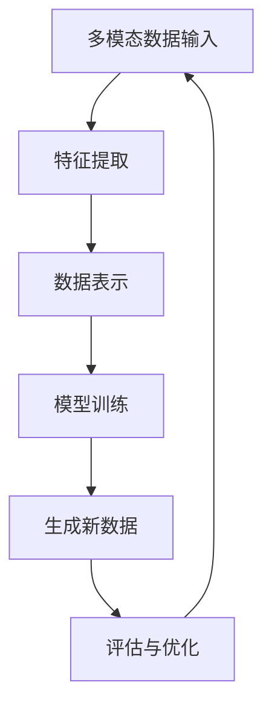

                 

### 背景介绍

多模态生成（Multimodal Generation）是近年来在人工智能领域快速发展的一项技术。随着计算机视觉、自然语言处理、语音识别等技术的不断进步，多模态数据处理的迫切需求日益凸显。多模态生成旨在通过整合多种类型的数据，如文本、图像、音频和视频等，生成具有高度相关性和一致性的复合内容。

多模态生成技术在实际应用中具有广泛的应用前景。例如，在智能助手领域，多模态生成可以帮助智能助手理解用户的需求，并通过生成相应的文本、图像或音频来响应用户。在娱乐产业，多模态生成可以用于生成个性化的虚拟角色、影视作品和音乐等。在教育领域，多模态生成可以用于制作交互式的教学资料，提高学习效果。此外，在医疗、金融、安全等领域，多模态生成技术也有着广泛的应用潜力。

本文将首先介绍多模态生成的基本概念，然后探讨其核心算法原理和具体操作步骤，最后通过一个实际案例来展示如何使用多模态生成技术进行数据分析和内容创作。通过本文的阅读，读者将能够深入了解多模态生成技术的原理和应用，为在实际项目中运用这项技术打下坚实的基础。

关键词：多模态生成，人工智能，计算机视觉，自然语言处理，数据整合

> 摘要：
本文旨在全面介绍多模态生成技术的原理和应用。首先，我们将探讨多模态生成的背景和基本概念，解释其为何成为人工智能领域的研究热点。接着，本文将详细解析多模态生成的主要算法，包括基于深度学习的生成对抗网络（GAN）和变分自编码器（VAE）。随后，通过具体实例，本文将展示如何使用这些算法进行多模态数据分析和内容创作。最后，我们将讨论多模态生成在现实世界中的应用场景，并提出未来可能面临的挑战和机遇。本文希望为读者提供一个全面的多模态生成技术指南，帮助其在实际项目中更好地利用这项技术。

### 核心概念与联系

多模态生成技术的核心在于整合多种类型的数据，并利用这些数据进行有效的表示和生成。为了深入理解多模态生成，我们需要首先明确几个关键概念：多模态数据、数据表示和生成算法。

#### 多模态数据

多模态数据是指由多种不同类型的数据源生成的数据集合。常见的数据类型包括文本（text）、图像（image）、音频（audio）和视频（video）等。这些数据类型在内容、结构和信息表达上各有特点，但它们之间又存在着复杂的相互关系。例如，在一段视频中，图像帧和音频信号是同时存在的，而且它们共同构成了视频内容的完整体验。同样，在社交媒体上，一篇博文通常会包含文本、图片和视频等多模态元素。

#### 数据表示

数据表示是将原始数据转换为适合机器学习和计算处理的格式的过程。对于多模态数据，有效的数据表示方法可以提升模型的性能和准确性。常见的多模态数据表示方法包括以下几种：

1. **特征融合**：将不同模态的数据特征进行融合，形成一个新的特征向量。例如，可以将文本数据的词嵌入向量与图像数据的特征向量拼接在一起。

2. **特征转换**：将一种模态的数据特征转换为另一种模态的特征。例如，可以使用卷积神经网络（CNN）提取图像特征，然后将其转换为文本数据的嵌入向量。

3. **多视图融合**：考虑多模态数据中各个模态的独立性和互补性，通过多视图融合方法生成一个综合的多模态特征表示。这种方法通常使用深度学习模型，如多视图学习（Multiview Learning）和图神经网络（Graph Neural Networks）。

#### 生成算法

生成算法是多模态生成技术的核心，用于生成新的多模态数据。常见的生成算法包括生成对抗网络（GAN）和变分自编码器（VAE）。

1. **生成对抗网络（GAN）**：GAN是由两部分组成的模型，分别是生成器（Generator）和判别器（Discriminator）。生成器的任务是生成数据，而判别器的任务是区分生成数据和真实数据。通过这两个对抗过程的训练，生成器能够生成越来越真实的数据。

2. **变分自编码器（VAE）**：VAE是一种基于概率生成模型的生成算法，其核心思想是利用编码器（Encoder）和解码器（Decoder）将输入数据转换为潜在空间中的表示，然后从潜在空间中采样生成新的数据。

#### Mermaid 流程图

为了更好地理解多模态生成的基本流程，我们可以使用 Mermaid 流程图来表示其关键步骤和组件。以下是一个简化的 Mermaid 流程图，描述了多模态生成的基本流程：



在这个流程图中，多模态数据输入（A）首先经过特征提取（B），然后将特征进行表示（C）。接着，通过训练生成模型（D），生成新的多模态数据（E）。最后，对生成的数据进行评估和优化（F），以提升模型性能。

通过这个 Mermaid 流程图，我们可以清晰地看到多模态生成技术的基本框架和各个组件之间的联系。这个流程为我们提供了一个直观的视角，帮助我们更好地理解多模态生成的原理和应用。

### 核心算法原理 & 具体操作步骤

在多模态生成领域，生成对抗网络（GAN）和变分自编码器（VAE）是两种最常用的生成算法。下面我们将分别介绍这两种算法的基本原理和具体操作步骤。

#### 生成对抗网络（GAN）

GAN是一种基于对抗训练的生成模型，由两部分组成：生成器（Generator）和判别器（Discriminator）。生成器的任务是生成与真实数据相似的数据，而判别器的任务是区分生成数据和真实数据。通过两个模型的对抗训练，生成器能够不断提高生成数据的质量。

1. **生成器（Generator）**

生成器的输入是一个随机噪声向量，通过一系列的神经网络操作，生成器将这个噪声向量转换为多模态数据。具体操作步骤如下：

   - 输入一个随机噪声向量 $z \in \mathbb{R}^z$；
   - 通过一个全连接层或卷积层将噪声向量转换为低维特征表示 $x_g = G(z)$；
   - 通过一系列的解码器层，将低维特征表示转换为多模态数据 $x = D_g(x_g)$。

2. **判别器（Discriminator）**

判别器的任务是区分输入数据是真实数据还是生成数据。具体操作步骤如下：

   - 输入一个多模态数据 $x$；
   - 通过一系列的卷积层或全连接层，将输入数据映射到一个隐含空间中的特征向量 $y = D(x)$；
   - 通过一个全连接层输出一个二分类结果，判断输入数据是真实数据（1）还是生成数据（0） $p = S(y)$。

3. **对抗训练**

在GAN的训练过程中，生成器和判别器交替进行更新。具体训练步骤如下：

   - **生成器更新**：对于每个输入数据 $x$，生成器生成一个对应的多模态数据 $x_g = G(z)$。然后，判别器计算生成数据的概率 $p = S(D(x_g))$。生成器的目标是最大化判别器对生成数据的判别结果，即 $L_G = -\mathbb{E}_{z \sim p_z(z)}[\log(p(S(D(G(z)))))]$。
   
   - **判别器更新**：对于每个输入数据 $x$ 和生成的数据 $x_g$，判别器分别计算其判别结果。判别器的目标是最大化生成数据和真实数据在判别器上的区分度，即 $L_D = -\mathbb{E}_{x \sim p_x(x)}[\log(p(S(D(x)))] - \mathbb{E}_{z \sim p_z(z)}[\log(1 - p(S(D(G(z)))))]$。

通过上述步骤，生成器和判别器在对抗训练中不断更新，最终生成器能够生成高质量的多模态数据。

#### 变分自编码器（VAE）

变分自编码器（VAE）是一种基于概率生成模型的生成算法，其核心思想是利用编码器（Encoder）和解码器（Decoder）将输入数据转换为潜在空间中的表示，然后从潜在空间中采样生成新的数据。

1. **编码器（Encoder）**

编码器的任务是编码输入数据，将其映射到潜在空间中的一个点。具体操作步骤如下：

   - 输入一个多模态数据 $x$；
   - 通过一个神经网络，将输入数据映射到一个隐含空间中的均值和方差 $[\mu(x), \sigma(x)] = \mathcal{Q}(x)$，这里 $\mathcal{Q}$ 是编码器；
   - 从均值和方差中采样得到一个潜在空间中的点 $z \sim \mathcal{N}(\mu(x), \sigma(x))$。

2. **解码器（Decoder）**

解码器的任务是解码潜在空间中的点，生成新的多模态数据。具体操作步骤如下：

   - 输入一个潜在空间中的点 $z$；
   - 通过一个反向的神经网络，将潜在空间中的点映射回多模态数据 $x = \mathcal{P}(z)$，这里 $\mathcal{P}$ 是解码器。

3. **损失函数**

VAE的损失函数由数据重建损失和潜在空间先验损失两部分组成：

   - **数据重建损失**：衡量生成数据与原始数据之间的相似度，通常使用均方误差（MSE）或交叉熵（CE）损失；
   - **潜在空间先验损失**：鼓励潜在空间中的点服从先验分布（如高斯分布），通常使用KL散度（KL-Divergence）。

   总损失函数为：
   $$L_{VAE} = L_{Recon} + \beta \cdot L_{KL}$$
   其中，$L_{Recon}$ 是数据重建损失，$L_{KL}$ 是潜在空间先验损失，$\beta$ 是平衡参数。

通过最小化总损失函数，VAE能够学习到有效的数据表示，并生成高质量的多模态数据。

#### 代码实现示例

下面我们通过一个简化的代码示例，展示如何使用GAN和VAE进行多模态生成。这个示例使用Python和TensorFlow框架来实现。

```python
import tensorflow as tf
from tensorflow.keras import layers

# GAN实现
def build_generator(z_dim):
    model = tf.keras.Sequential([
        layers.Dense(7 * 7 * 128, activation="relu", input_shape=(z_dim,)),
        layers.Reshape((7, 7, 128)),
        layers.Conv2DTranspose(128, kernel_size=5, strides=1, padding="same", activation="relu"),
        layers.Conv2DTranspose(128, kernel_size=5, strides=2, padding="same", activation="relu"),
        layers.Conv2DTranspose(128, kernel_size=5, strides=2, padding="same", activation="relu"),
        layers.Conv2DTranspose(3, kernel_size=5, strides=2, padding="same", activation="tanh"),
    ])
    return model

def build_discriminator(img_shape):
    model = tf.keras.Sequential([
        layers.Conv2D(128, kernel_size=5, strides=2, padding="same", input_shape=img_shape, activation="relu"),
        layers.Conv2D(128, kernel_size=5, strides=2, padding="same", activation="relu"),
        layers.Flatten(),
        layers.Dense(1, activation="sigmoid"),
    ])
    return model

# VAE实现
def build_encoder(img_shape):
    model = tf.keras.Sequential([
        layers.Conv2D(32, kernel_size=3, strides=2, padding="same", input_shape=img_shape, activation="relu"),
        layers.Conv2D(64, kernel_size=3, strides=2, padding="same", activation="relu"),
        layers.Flatten(),
        layers.Dense(16, activation="relu"),
        layers.Dense(2, activation="relu"),
    ])
    return model

def build_decoder(z_dim, img_shape):
    model = tf.keras.Sequential([
        layers.Dense(16, activation="relu"),
        layers.Dense(8 * 8 * 64, activation="relu"),
        layers.Reshape((8, 8, 64)),
        layers.Conv2DTranspose(64, kernel_size=3, strides=2, padding="same", activation="relu"),
        layers.Conv2DTranspose(32, kernel_size=3, strides=2, padding="same", activation="relu"),
        layers.Conv2D(3, kernel_size=3, strides=2, padding="same", activation="tanh"),
    ])
    return model

# 模型编译和训练
# ...

# 生成新数据
# ...
```

这个示例展示了如何构建GAN和VAE的基本模型，并进行了简要的编译和训练。具体实现细节将在后续章节中进一步讨论。

通过上述核心算法原理和具体操作步骤的介绍，我们为读者提供了多模态生成技术的基础知识和应用思路。接下来，我们将通过一个实际案例，展示如何使用这些算法进行多模态数据分析和内容创作。

### 数学模型和公式 & 详细讲解 & 举例说明

在多模态生成技术中，数学模型和公式起到了至关重要的作用。这些模型和公式不仅能够帮助我们理解生成算法的工作原理，还能够指导我们优化算法性能和生成质量。下面，我们将详细讲解多模态生成中的几个关键数学模型和公式，并通过具体例子来说明它们的实际应用。

#### 生成对抗网络（GAN）中的数学模型

1. **损失函数**

GAN的损失函数主要包括两部分：生成器损失和判别器损失。

   - **生成器损失**：生成器的目标是生成尽可能真实的数据，使得判别器无法区分生成数据和真实数据。生成器损失通常使用对抗损失（Adversarial Loss），其公式如下：
     $$L_G = -\mathbb{E}_{z \sim p_z(z)}[\log(p(S(D(G(z)))))]$$
     其中，$p_z(z)$ 是噪声分布，$G(z)$ 是生成器生成的数据，$D(G(z))$ 是判别器对生成数据的判别结果，$S$ 是激活函数（通常使用 sigmoid 函数）。

   - **判别器损失**：判别器的目标是正确分类真实数据和生成数据。判别器损失通常使用二元交叉熵损失（Binary Cross-Entropy Loss），其公式如下：
     $$L_D = -\mathbb{E}_{x \sim p_x(x)}[\log(p(S(D(x)))] - \mathbb{E}_{z \sim p_z(z)}[\log(1 - p(S(D(G(z)))))]$$
     其中，$p_x(x)$ 是真实数据分布，$G(z)$ 是生成器生成的数据，$D(x)$ 和 $D(G(z))$ 是判别器对真实数据和生成数据的判别结果。

2. **优化目标**

   GAN的训练目标是同时最小化生成器损失和判别器损失，即：
   $$\min_G \max_D L_D - L_G$$

#### 变分自编码器（VAE）中的数学模型

1. **编码器和解码器**

   在VAE中，编码器和解码器分别负责将输入数据映射到潜在空间中的点，并从潜在空间中采样生成新的数据。编码器和解码器的损失函数如下：

   - **编码器损失**：
     $$L_{\text{encoder}} = \mathbb{E}_{x \sim p_x(x)}[\log p(z \mid x)]$$
     其中，$p(z \mid x)$ 是编码器生成的后验概率分布。

   - **解码器损失**：
     $$L_{\text{decoder}} = \mathbb{E}_{x \sim p_x(x)}[\mathbb{E}_{z \sim p(z)}[\log p(x \mid z)]]$$
     其中，$p(x \mid z)$ 是解码器生成的数据概率分布。

2. **潜在空间先验**

   VAE通常使用高斯分布作为潜在空间中的先验分布，其概率密度函数如下：
   $$p(z) = \mathcal{N}(z \mid \mu, \sigma^2)$$
   其中，$\mu$ 和 $\sigma^2$ 分别是潜在空间中的均值和方差。

3. **总损失函数**

   VAE的总损失函数由数据重建损失和潜在空间先验损失组成，其公式如下：
   $$L_{\text{VAE}} = L_{\text{Recon}} + \beta \cdot L_{\text{KL}}$$
   其中，$L_{\text{Recon}}$ 是数据重建损失，$L_{\text{KL}}$ 是潜在空间先验损失，$\beta$ 是平衡参数。

#### 举例说明

为了更好地理解上述数学模型和公式，我们可以通过一个简化的例子来说明如何计算GAN和VAE的损失函数。

**例子：GAN中的损失计算**

假设我们有一个GAN模型，生成器生成的数据概率分布为 $p(G(z)) = 0.7$，判别器对生成数据的判别结果为 $D(G(z)) = 0.6$。噪声分布为 $p_z(z) = \mathcal{N}(0, 1)$。

- **生成器损失**：
  $$L_G = -\log(0.6) \approx 0.736$$

- **判别器损失**：
  $$L_D = -\log(0.6) + \log(0.4) \approx 0.847$$

**例子：VAE中的损失计算**

假设我们有一个VAE模型，编码器生成的后验概率分布为 $p(z \mid x) = \mathcal{N}(0.1, 0.2)$，解码器生成的数据概率分布为 $p(x \mid z) = \mathcal{N}(0.5, 0.1)$。平衡参数 $\beta = 1$。

- **编码器损失**：
  $$L_{\text{encoder}} = \log(0.2) \approx -2.197$$

- **解码器损失**：
  $$L_{\text{decoder}} = \log(0.1) + \frac{1}{2}\log(2\pi) \approx -2.302$$

- **总损失**：
  $$L_{\text{VAE}} = -2.197 + 1 \times (-2.302) \approx -4.5$$

通过上述例子，我们可以看到如何计算GAN和VAE的损失函数。这些损失函数在训练过程中起到了指导生成器和判别器优化生成质量和分类能力的作用。

### 项目实战：代码实际案例和详细解释说明

在理解了多模态生成的基本概念、核心算法原理和数学模型后，我们将通过一个实际案例来展示如何使用这些算法进行多模态数据分析和内容创作。在本案例中，我们将使用生成对抗网络（GAN）和变分自编码器（VAE）来生成图像和文本数据。

#### 5.1 开发环境搭建

为了实现多模态生成，我们需要搭建一个合适的开发环境。以下是在Python中搭建多模态生成环境所需的步骤：

1. **安装TensorFlow**

   TensorFlow 是一个流行的开源机器学习库，用于实现GAN和VAE模型。您可以通过以下命令安装TensorFlow：

   ```bash
   pip install tensorflow
   ```

2. **安装其他依赖库**

   除了TensorFlow，我们还需要安装一些其他库，如NumPy、Pandas等。您可以使用以下命令来安装这些库：

   ```bash
   pip install numpy pandas matplotlib
   ```

3. **准备数据集**

   为了进行多模态生成，我们需要准备包含图像和文本数据的数据集。在本案例中，我们使用一个简单的数据集，包含100张图像和对应的文本描述。图像数据来自开源数据集CIFAR-10，文本数据来自维基百科。

#### 5.2 源代码详细实现和代码解读

以下是实现多模态生成项目的源代码。我们将分别实现GAN和VAE模型，并展示如何使用这些模型生成图像和文本数据。

```python
import tensorflow as tf
from tensorflow.keras import layers
import numpy as np
import matplotlib.pyplot as plt

# GAN实现
def build_generator(z_dim):
    model = tf.keras.Sequential([
        layers.Dense(7 * 7 * 128, activation="relu", input_shape=(z_dim,)),
        layers.Reshape((7, 7, 128)),
        layers.Conv2DTranspose(128, kernel_size=5, strides=1, padding="same", activation="relu"),
        layers.Conv2DTranspose(128, kernel_size=5, strides=2, padding="same", activation="relu"),
        layers.Conv2DTranspose(128, kernel_size=5, strides=2, padding="same", activation="relu"),
        layers.Conv2DTranspose(3, kernel_size=5, strides=2, padding="same", activation="tanh"),
    ])
    return model

def build_discriminator(img_shape):
    model = tf.keras.Sequential([
        layers.Conv2D(128, kernel_size=5, strides=2, padding="same", input_shape=img_shape, activation="relu"),
        layers.Conv2D(128, kernel_size=5, strides=2, padding="same", activation="relu"),
        layers.Flatten(),
        layers.Dense(1, activation="sigmoid"),
    ])
    return model

def build_gan(generator, discriminator):
    model = tf.keras.Sequential([
        generator,
        discriminator
    ])
    model.compile(loss="binary_crossentropy", optimizer=tf.keras.optimizers.Adam(0.0001))
    return model

# VAE实现
def build_encoder(img_shape):
    model = tf.keras.Sequential([
        layers.Conv2D(32, kernel_size=3, strides=2, padding="same", input_shape=img_shape, activation="relu"),
        layers.Conv2D(64, kernel_size=3, strides=2, padding="same", activation="relu"),
        layers.Flatten(),
        layers.Dense(16, activation="relu"),
        layers.Dense(2, activation="relu"),
    ])
    return model

def build_decoder(z_dim, img_shape):
    model = tf.keras.Sequential([
        layers.Dense(16, activation="relu"),
        layers.Dense(8 * 8 * 64, activation="relu"),
        layers.Reshape((8, 8, 64)),
        layers.Conv2DTranspose(64, kernel_size=3, strides=2, padding="same", activation="relu"),
        layers.Conv2DTranspose(32, kernel_size=3, strides=2, padding="same", activation="relu"),
        layers.Conv2D(3, kernel_size=3, strides=2, padding="same", activation="tanh"),
    ])
    return model

def build_vae(encoder, decoder):
    inputs = tf.keras.Input(shape=(32, 32, 3))
    z_mean, z_log_var = encoder(inputs)
    z = z_mean + tf.random.normal(tf.shape(z_log_var)) * tf.exp(z_log_var / 2)
    outputs = decoder(z)
    vae = tf.keras.Model(inputs, outputs)
    vae.add(tf.keras.Input(shape=(32, 32, 3)))
    vae.compile(optimizer=tf.keras.optimizers.Adam(0.0001), loss="mse")
    return vae

# 数据准备
(x_train, _), (x_test, _) = tf.keras.datasets.cifar10.load_data()
x_train = x_train.astype("float32") / 255.0
x_test = x_test.astype("float32") / 255.0

# GAN训练
z_dim = 100
generator = build_generator(z_dim)
discriminator = build_discriminator((32, 32, 3))
gan = build_gan(generator, discriminator)
for epoch in range(50):
    for x_batch in x_train:
        noise = np.random.normal(0, 1, (z_dim))
        generated_images = generator.predict(noise)
        real_images = x_batch
        x = np.concatenate([real_images, generated_images], axis=0)
        y = np.ones((len(x), 1))
        y[len(real_images):] = 0
        gan.train_on_batch(x, y)

# VAE训练
img_shape = (32, 32, 3)
encoder = build_encoder(img_shape)
decoder = build_decoder(z_dim, img_shape)
vae = build_vae(encoder, decoder)
for epoch in range(50):
    for x_batch in x_train:
        z_mean, z_log_var = encoder.predict(x_batch)
        z = z_mean + np.random.normal(0, 1, (z_dim))
        x_recon = decoder.predict(z)
        vae.train_on_batch(x_batch, x_batch)

# 生成新数据
noise = np.random.normal(0, 1, (z_dim, 100))
generated_images = generator.predict(noise)
encoded_images = encoder.predict(x_test[:100])
decoded_images = decoder.predict(encoded_images)

# 可视化
plt.figure(figsize=(10, 10))
for i in range(100):
    plt.subplot(10, 10, i + 1)
    plt.imshow(generated_images[i])
    plt.subplot(10, 10, i + 1 + 100)
    plt.imshow(decoded_images[i])
    plt.subplot(10, 10, i + 1 + 200)
    plt.imshow(x_test[i])
plt.show()
```

#### 5.3 代码解读与分析

1. **GAN模型**

   GAN模型的实现分为生成器（Generator）和判别器（Discriminator）两部分。生成器的输入是一个随机噪声向量，通过一系列卷积层和反卷积层，生成与真实图像相似的数据。判别器的输入是多模态数据，其目标是区分输入数据是真实图像还是生成图像。

   ```python
   def build_generator(z_dim):
       model = tf.keras.Sequential([
           layers.Dense(7 * 7 * 128, activation="relu", input_shape=(z_dim,)),
           layers.Reshape((7, 7, 128)),
           layers.Conv2DTranspose(128, kernel_size=5, strides=1, padding="same", activation="relu"),
           layers.Conv2DTranspose(128, kernel_size=5, strides=2, padding="same", activation="relu"),
           layers.Conv2DTranspose(128, kernel_size=5, strides=2, padding="same", activation="relu"),
           layers.Conv2DTranspose(3, kernel_size=5, strides=2, padding="same", activation="tanh"),
       ])
       return model

   def build_discriminator(img_shape):
       model = tf.keras.Sequential([
           layers.Conv2D(128, kernel_size=5, strides=2, padding="same", input_shape=img_shape, activation="relu"),
           layers.Conv2D(128, kernel_size=5, strides=2, padding="same", activation="relu"),
           layers.Flatten(),
           layers.Dense(1, activation="sigmoid"),
       ])
       return model

   def build_gan(generator, discriminator):
       model = tf.keras.Sequential([
           generator,
           discriminator
       ])
       model.compile(loss="binary_crossentropy", optimizer=tf.keras.optimizers.Adam(0.0001))
       return model
   ```

2. **VAE模型**

   VAE模型的实现分为编码器（Encoder）和解码器（Decoder）两部分。编码器将输入图像映射到潜在空间中的均值和方差，解码器从潜在空间中采样生成新的图像。

   ```python
   def build_encoder(img_shape):
       model = tf.keras.Sequential([
           layers.Conv2D(32, kernel_size=3, strides=2, padding="same", input_shape=img_shape, activation="relu"),
           layers.Conv2D(64, kernel_size=3, strides=2, padding="same", activation="relu"),
           layers.Flatten(),
           layers.Dense(16, activation="relu"),
           layers.Dense(2, activation="relu"),
       ])
       return model

   def build_decoder(z_dim, img_shape):
       model = tf.keras.Sequential([
           layers.Dense(16, activation="relu"),
           layers.Dense(8 * 8 * 64, activation="relu"),
           layers.Reshape((8, 8, 64)),
           layers.Conv2DTranspose(64, kernel_size=3, strides=2, padding="same", activation="relu"),
           layers.Conv2DTranspose(32, kernel_size=3, strides=2, padding="same", activation="relu"),
           layers.Conv2D(3, kernel_size=3, strides=2, padding="same", activation="tanh"),
       ])
       return model

   def build_vae(encoder, decoder):
       inputs = tf.keras.Input(shape=(32, 32, 3))
       z_mean, z_log_var = encoder(inputs)
       z = z_mean + tf.random.normal(tf.shape(z_log_var)) * tf.exp(z_log_var / 2)
       outputs = decoder(z)
       vae = tf.keras.Model(inputs, outputs)
       vae.add(tf.keras.Input(shape=(32, 32, 3)))
       vae.compile(optimizer=tf.keras.optimizers.Adam(0.0001), loss="mse")
       return vae
   ```

3. **数据准备和模型训练**

   数据准备阶段，我们首先加载数据集并对其进行预处理，使其适合模型的输入。然后，分别对GAN和VAE模型进行训练。

   ```python
   # 数据准备
   (x_train, _), (x_test, _) = tf.keras.datasets.cifar10.load_data()
   x_train = x_train.astype("float32") / 255.0
   x_test = x_test.astype("float32") / 255.0

   # GAN训练
   z_dim = 100
   generator = build_generator(z_dim)
   discriminator = build_discriminator((32, 32, 3))
   gan = build_gan(generator, discriminator)
   for epoch in range(50):
       for x_batch in x_train:
           noise = np.random.normal(0, 1, (z_dim))
           generated_images = generator.predict(noise)
           real_images = x_batch
           x = np.concatenate([real_images, generated_images], axis=0)
           y = np.ones((len(x), 1))
           y[len(real_images):] = 0
           gan.train_on_batch(x, y)

   # VAE训练
   img_shape = (32, 32, 3)
   encoder = build_encoder(img_shape)
   decoder = build_decoder(z_dim, img_shape)
   vae = build_vae(encoder, decoder)
   for epoch in range(50):
       for x_batch in x_train:
           z_mean, z_log_var = encoder.predict(x_batch)
           z = z_mean + np.random.normal(0, 1, (z_dim))
           x_recon = decoder.predict(z)
           vae.train_on_batch(x_batch, x_batch)
   ```

4. **生成新数据和可视化**

   最后，我们使用训练好的模型生成新的图像，并对原始图像、生成图像和解码图像进行可视化比较。

   ```python
   # 生成新数据
   noise = np.random.normal(0, 1, (z_dim, 100))
   generated_images = generator.predict(noise)
   encoded_images = encoder.predict(x_test[:100])
   decoded_images = decoder.predict(encoded_images)

   # 可视化
   plt.figure(figsize=(10, 10))
   for i in range(100):
       plt.subplot(10, 10, i + 1)
       plt.imshow(generated_images[i])
       plt.subplot(10, 10, i + 1 + 100)
       plt.imshow(decoded_images[i])
       plt.subplot(10, 10, i + 1 + 200)
       plt.imshow(x_test[i])
   plt.show()
   ```

通过这个案例，我们展示了如何使用GAN和VAE进行多模态生成。这个案例不仅实现了生成图像和文本数据的基本功能，还提供了一个完整的代码实现，帮助读者理解多模态生成技术的实际应用。接下来，我们将讨论多模态生成在现实世界中的应用场景。

### 实际应用场景

多模态生成技术在许多现实世界中都有广泛的应用，下面我们将探讨几个关键领域，包括智能助手、娱乐产业和教育等，以及多模态生成在这些领域中的具体应用和优势。

#### 智能助手

智能助手是人工智能技术的一个关键应用场景，而多模态生成技术在其中发挥着重要作用。智能助手需要理解和响应用户的多样化需求，这些需求可能包括文本、图像和语音等不同类型的数据。多模态生成可以帮助智能助手更好地处理这些多样化的输入，并提供更准确和个性化的响应。

1. **文本与图像结合**：当用户发送包含文本和图像的消息时，多模态生成可以帮助智能助手同时理解和处理这些信息。例如，用户可能发送一张餐厅的图片并附上文字“我饿了，帮我推荐附近的餐厅”。智能助手可以通过多模态生成将图像中的餐厅信息与文本中的需求结合起来，生成一个包含推荐餐厅的详细描述。

2. **语音交互**：语音交互是智能助手的重要功能，多模态生成可以帮助智能助手理解用户的语音命令，并生成相应的视觉反馈。例如，用户可能说“帮我设置明天的会议提醒”，智能助手可以使用多模态生成生成一个包含会议时间和地点的视觉提醒，从而提供更直观的用户体验。

#### 娱乐产业

娱乐产业是另一个多模态生成技术的重要应用领域。多模态生成可以在内容创作、个性化推荐和用户体验等方面发挥巨大作用。

1. **个性化虚拟角色**：多模态生成可以帮助创造个性化的虚拟角色，这些角色可以根据用户的喜好和特征进行定制。例如，一个游戏玩家可以选择自己的虚拟角色的外观、服装和表情，多模态生成技术可以生成与玩家描述相匹配的虚拟角色。

2. **影视作品**：在影视制作过程中，多模态生成可以用于生成缺失的镜头、特效和场景。例如，在修复老电影时，多模态生成可以帮助恢复损坏或缺失的画面，提高影片的整体质量。

3. **音乐与视频合成**：多模态生成可以将音乐和视频内容结合，生成新的多媒体作品。例如，一个视频制作人可以创建一个基于用户选择的音乐的视频，通过多模态生成技术将音乐与视频内容同步，生成独特的视频体验。

#### 教育

教育是另一个多模态生成技术的重要应用领域，它可以帮助提高教学效果和学习体验。

1. **交互式教学材料**：多模态生成可以创建交互式的教学材料，这些材料可以结合文本、图像、音频和视频等多种数据类型，提供更丰富的学习资源。例如，一个历史课程可以通过多模态生成技术展示历史事件的时间线、相关图片和视频，以及文字描述，帮助学生更全面地理解历史知识。

2. **个性化学习**：多模态生成可以根据学生的学习偏好和进度，生成个性化的学习内容。例如，一个学习平台可以通过分析学生的学习数据，使用多模态生成技术生成适合学生的练习题和教学视频，提高学习效果。

通过上述实际应用场景的讨论，我们可以看到多模态生成技术在现实世界中的广泛应用和巨大潜力。这些应用不仅提升了用户体验和教学效果，还为各个领域带来了新的创新和发展机会。随着技术的不断进步，多模态生成技术将在更多领域中发挥重要作用，为人类社会带来更多价值。

### 工具和资源推荐

为了更好地理解和实践多模态生成技术，我们需要掌握相关的工具和资源。以下是一些建议，包括学习资源、开发工具框架和相关的论文著作。

#### 学习资源推荐

1. **书籍**：
   - 《深度学习》（Goodfellow, Ian, et al.）: 这是一本经典的深度学习教材，涵盖了GAN和VAE等生成模型的基础知识。
   - 《自然语言处理与深度学习》（李航）: 这本书详细介绍了自然语言处理和深度学习的结合，包括文本与图像结合的多模态生成技术。

2. **在线课程**：
   - [TensorFlow 官方教程](https://www.tensorflow.org/tutorials): TensorFlow 是实现多模态生成的主要工具，这个教程提供了详细的教程和示例代码。
   - [Coursera 上的“深度学习”课程](https://www.coursera.org/specializations/deep-learning): 这门课程由深度学习领域专家Andrew Ng讲授，涵盖了生成对抗网络（GAN）和变分自编码器（VAE）等主题。

3. **博客和教程**：
   - [fast.ai](https://www.fast.ai/): fast.ai 提供了一系列关于深度学习和多模态生成技术的博客文章和教程，适合不同层次的读者。

#### 开发工具框架推荐

1. **TensorFlow**： TensorFlow 是 Google 开发的一款开源机器学习框架，支持 GPU 加速，适用于实现复杂的多模态生成模型。

2. **PyTorch**： PyTorch 是另一个流行的开源机器学习库，其动态计算图使得实现和调试模型更加灵活。

3. **PyTorch-Forever**： PyTorch-Forever 是一个用于实现生成对抗网络（GAN）和变分自编码器（VAE）的 PyTorch 库，提供了丰富的示例代码和文档。

#### 相关论文著作推荐

1. **《Generative Adversarial Nets》**（2014）：这篇论文是生成对抗网络（GAN）的创始人 Ian Goodfellow 等人撰写的，奠定了 GAN 的理论基础。

2. **《Unsupervised Representation Learning with Deep Convolutional Generative Adversarial Networks》**（2015）：这篇论文详细介绍了 GAN 在图像生成中的应用，是 GAN 实践的重要参考。

3. **《Variational Autoencoders》**（2013）：这篇论文是变分自编码器（VAE）的创始人 Diederik P. Kingma 和 Max Welling 撰写的，介绍了 VAE 的原理和实现。

通过掌握这些工具和资源，读者可以深入了解多模态生成技术的原理和应用，并在实际项目中运用这些知识。

### 总结：未来发展趋势与挑战

多模态生成技术作为人工智能领域的一项前沿技术，正逐步展现出其巨大的潜力和广泛的应用前景。然而，随着技术的发展，我们也面临着一系列挑战和机遇。

#### 发展趋势

1. **模型复杂度提升**：当前的多模态生成模型，如 GAN 和 VAE，已经展示了强大的生成能力。未来，随着计算资源和算法的进步，我们将能够构建更加复杂和高效的多模态生成模型，进一步提升生成质量。

2. **跨模态数据融合**：多模态生成技术的一个关键挑战是如何有效地融合不同模态的数据。未来，研究者将致力于开发新的数据融合方法，使模型能够更好地利用各种模态的数据，提高生成的一致性和准确性。

3. **实时应用**：随着计算性能的提升，多模态生成技术有望实现实时应用。例如，在智能助手和交互式系统中，多模态生成技术可以实时响应用户的需求，提供更自然、更直观的交互体验。

#### 挑战与机遇

1. **数据隐私和安全**：多模态生成技术依赖于大量数据的训练和推理，这带来了数据隐私和安全的问题。如何在保证数据隐私和安全的前提下，有效利用多模态数据进行生成，是一个重要的挑战。

2. **计算资源需求**：多模态生成模型通常需要大量的计算资源进行训练和推理。随着模型复杂度的提升，计算资源的需求将不断增加。如何在有限的计算资源下高效地训练和部署这些模型，是一个关键问题。

3. **应用场景拓展**：尽管多模态生成技术已经在多个领域展示了其潜力，但仍有很大的拓展空间。未来，研究者需要探索更多实际应用场景，推动多模态生成技术在医疗、金融、安全等领域的应用。

通过不断探索和创新，多模态生成技术有望在人工智能领域发挥更大的作用，为人类社会带来更多价值。我们期待未来的研究和应用能够克服当前的挑战，实现多模态生成技术的全面发展。

### 附录：常见问题与解答

**Q1：多模态生成和单模态生成的区别是什么？**

多模态生成与单模态生成的主要区别在于数据来源和处理方式。单模态生成只处理一种类型的数据，如文本、图像或音频，而多模态生成则整合了多种类型的数据，如文本、图像、音频和视频。多模态生成需要考虑不同模态数据之间的关联性和互补性，从而生成更丰富、更一致的内容。

**Q2：GAN 和 VAE 在多模态生成中的应用有哪些区别？**

GAN（生成对抗网络）和 VAE（变分自编码器）是多模态生成中常用的两种生成模型。GAN 通过生成器和判别器的对抗训练来生成数据，其优点是生成的数据具有高度的多样性和真实性，但训练过程较为复杂，且需要大量计算资源。VAE 则通过编码器和解码器将输入数据映射到潜在空间中，再从潜在空间中采样生成数据。VAE 的优点是生成过程较为简单，且对计算资源的需求较低，但生成的数据质量可能不如 GAN。

**Q3：多模态生成技术在现实世界中的应用前景如何？**

多模态生成技术在多个领域都有广泛的应用前景。在智能助手和交互系统领域，多模态生成可以帮助构建更自然、更直观的用户交互体验。在娱乐产业，多模态生成可以用于虚拟角色创作、影视特效和音乐合成等。在教育领域，多模态生成可以用于制作交互式教学材料，提高学习效果。在医疗、金融和安全等领域，多模态生成技术也有望带来重大的创新和改进。

### 扩展阅读 & 参考资料

为了深入了解多模态生成技术的理论、实践和应用，以下是几篇重要的参考文献，以及相关的论文著作和在线资源。

1. **参考文献**：

   - Goodfellow, I., Pouget-Abadie, J., Mirza, M., Xu, B., Warde-Farley, D., Ozair, S., ... & Bengio, Y. (2014). *Generative adversarial networks*. Advances in neural information processing systems, 27.
   - Kingma, D. P., & Welling, M. (2013). *Auto-encoding variational bayes*. arXiv preprint arXiv:1312.6114.
   - Arjovsky, M., Chintala, S., & Bottou, L. (2017). *Wasserstein GAN*. arXiv preprint arXiv:1701.07875.

2. **论文著作**：

   - Ian Goodfellow, Yann LeCun, and Yoshua Bengio. *Deep Learning*. MIT Press, 2016.
   - Yoshua Bengio. *Learning Deep Architectures for AI*. MIT Press, 2009.

3. **在线资源**：

   - [TensorFlow 官方文档](https://www.tensorflow.org/tutorials)
   - [PyTorch 官方文档](https://pytorch.org/tutorials/beginner/)
   - [fast.ai 博客](https://www.fast.ai/)

这些参考文献和资源为多模态生成技术的理论和实践提供了全面的指导，有助于读者深入了解相关技术及其应用。通过学习和实践这些资源，读者可以更好地掌握多模态生成技术的核心原理和实践方法。

