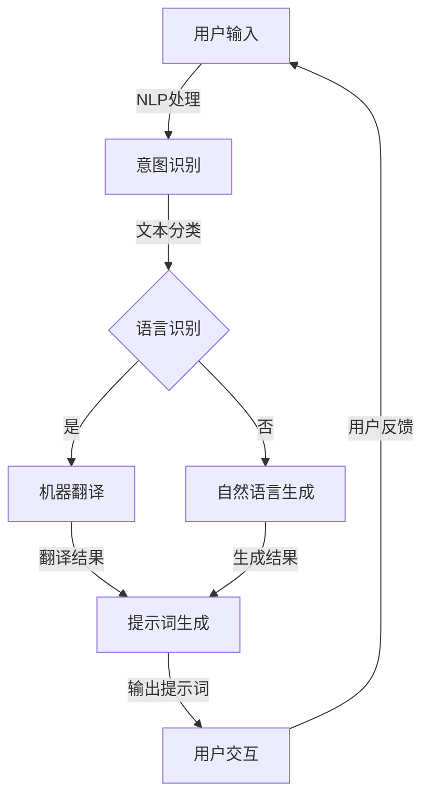

                 

### 背景介绍

随着全球化的推进，人工智能（AI）技术正在跨越国界和文化壁垒，逐步渗透到各行各业。在这个过程中，多语言提示词设计成为了一个关键议题。所谓多语言提示词，是指为了提升AI系统在不同语言环境下的交互能力和用户体验，所设计的专门用于引导用户输入的提示性文字或指令。这些提示词不仅需要具备语言的自然性和合理性，还必须考虑到跨文化的多样性和复杂性。

目前，多语言提示词设计在AI领域受到了越来越多的关注。一方面，随着互联网的发展，越来越多的企业和组织希望他们的AI系统能够支持多种语言，以吸引全球范围内的用户。另一方面，人工智能研究者们也在不断探索如何通过设计更智能、更贴心的提示词，来提升AI交互的自然性和效率。然而，多语言提示词设计并非易事，它涉及到了语言学的深度知识、文化差异的敏感度以及技术的复杂性。

本文将围绕多语言提示词设计这一主题，进行深入探讨。我们将首先介绍多语言提示词设计的重要性，接着详细阐述其核心概念与联系，分析其背后的核心算法原理，并通过具体案例展示其应用场景。此外，我们还将推荐一些优秀的工具和资源，帮助读者更好地理解和掌握这一领域。最后，我们将对多语言提示词设计的未来发展趋势与挑战进行展望，并提出一些建议。

通过本文的阅读，读者将能够系统地了解多语言提示词设计的全貌，掌握其核心技术和方法，为未来在AI交互领域的创新与实践提供有力支持。

### 核心概念与联系

在深入探讨多语言提示词设计的核心概念和联系之前，我们有必要首先明确一些基本概念。多语言提示词设计不仅仅是一个简单的翻译过程，它涉及到语言学的深度知识、用户行为分析以及技术实现的复杂性。

首先，我们来定义几个核心概念：

1. **自然语言处理（NLP）**：自然语言处理是人工智能领域的一个重要分支，旨在使计算机能够理解和处理人类自然语言。NLP包括文本分类、情感分析、机器翻译等多种技术。在多语言提示词设计中，NLP技术用于分析用户的输入，理解其意图，并生成合适的提示词。

2. **提示词（Prompt）**：提示词是指在AI系统中用来引导用户输入的文本或指令。一个良好的提示词能够提高用户的互动性和体验，使其更容易与系统进行沟通。在多语言环境下，提示词的设计需要考虑到不同语言的文化差异和表达习惯。

3. **跨文化适应性**：跨文化适应性是指产品或服务在不同文化背景下的使用效果和用户接受度。在多语言提示词设计中，跨文化适应性至关重要，它要求设计师不仅具备语言知识，还需对目标用户的文化背景有深入了解。

4. **机器翻译**：机器翻译是NLP的一个重要组成部分，它通过算法将一种语言的文本翻译成另一种语言。在多语言提示词设计中，机器翻译技术用于将提示词从源语言转换为目标语言，确保其在不同语言环境中的准确性和自然性。

接下来，我们将通过一个Mermaid流程图来展示多语言提示词设计的基本架构和流程。请注意，Mermaid流程图中不应包含括号、逗号等特殊字符。



上述流程图描述了多语言提示词设计的基本步骤：

1. **用户输入**：用户输入其问题或指令。
2. **NLP处理**：使用自然语言处理技术对用户输入进行分析，提取关键信息。
3. **意图识别**：确定用户的意图，以便后续处理。
4. **语言识别**：判断输入文本的语言类型。
5. **机器翻译**：如果输入文本的语言不是系统的默认语言，将其翻译成系统支持的语言。
6. **自然语言生成**：如果系统无法直接翻译，使用自然语言生成技术生成提示词。
7. **提示词生成**：生成适合当前语言环境的提示词。
8. **用户交互**：将生成的提示词展示给用户，引导其输入。
9. **用户反馈**：收集用户反馈，用于进一步优化提示词设计。

通过上述流程，我们可以看到多语言提示词设计不仅仅是简单地翻译文本，它涉及到了多个技术环节和复杂的文化因素。这要求设计师在各个环节中都要进行精细的调整和优化，以确保最终生成的提示词能够满足用户的需求和期望。

### 核心算法原理

在多语言提示词设计中，核心算法原理起到了关键作用。这些算法不仅决定了提示词生成的准确性和自然性，还直接影响了用户的交互体验。以下将详细探讨几个核心算法原理，并给出具体操作步骤。

#### 1. 语言模型（Language Model）

语言模型是自然语言处理（NLP）的基础，用于生成文本。在多语言提示词设计中，语言模型负责将用户输入转换为合适的提示词。常用的语言模型包括n-gram模型、神经网络模型和Transformer模型等。

**具体操作步骤：**

- **数据收集与预处理**：首先，收集大量不同语言的数据集，并进行预处理，如去除停用词、进行词性标注等。
- **模型训练**：使用预处理后的数据集训练语言模型。对于n-gram模型，可以使用朴素贝叶斯算法；对于神经网络模型，可以使用循环神经网络（RNN）或Transformer模型。
- **模型评估与优化**：通过交叉验证和测试集评估模型性能，并根据评估结果进行模型优化。

#### 2. 机器翻译（Machine Translation）

机器翻译是将一种语言的文本翻译成另一种语言的技术，是多语言提示词设计中的重要环节。常见的机器翻译方法包括基于规则的翻译、统计机器翻译和神经机器翻译。

**具体操作步骤：**

- **数据集构建**：收集平行文本数据集，即包含源语言和目标语言版本的文本对。
- **翻译模型训练**：使用平行文本数据集训练机器翻译模型。对于基于规则的方法，可以使用词性标注和翻译规则；对于统计机器翻译，可以使用统计方法如隐马尔可夫模型（HMM）或基于统计的机器翻译（SMT）；对于神经机器翻译，可以使用编码器-解码器框架或Transformer模型。
- **翻译结果评估**：通过BLEU（双语评估单元）等指标评估翻译质量，并根据评估结果进行模型优化。

#### 3. 情感分析（Sentiment Analysis）

情感分析用于识别用户输入中的情感倾向，从而生成更加人性化的提示词。常用的情感分析算法包括基于词典的方法、基于机器学习的方法和基于深度学习的方法。

**具体操作步骤：**

- **数据收集与预处理**：收集包含情感标注的数据集，如社交媒体评论、产品评价等。
- **特征提取**：提取文本的特征，如词袋模型、TF-IDF等。
- **模型训练**：使用特征和标注数据训练情感分析模型。对于基于词典的方法，可以使用情感词典；对于基于机器学习的方法，可以使用支持向量机（SVM）、随机森林等；对于基于深度学习的方法，可以使用卷积神经网络（CNN）或循环神经网络（RNN）。
- **情感识别与提示词调整**：根据情感分析结果调整提示词，使其更加符合用户的情感需求。

#### 4. 个性化推荐（Personalized Recommendation）

个性化推荐用于根据用户的历史行为和偏好生成个性化的提示词。常用的个性化推荐算法包括基于内容的推荐、协同过滤和基于模型的推荐。

**具体操作步骤：**

- **用户数据收集与预处理**：收集用户的历史行为数据，如搜索记录、购买历史等。
- **特征提取与建模**：提取用户和物品的特征，如用户兴趣标签、物品属性等，并建立推荐模型。对于基于内容的推荐，可以使用内容相似度计算；对于协同过滤，可以使用矩阵分解或基于模型的推荐方法；对于基于模型的推荐，可以使用机器学习算法如决策树、随机森林等。
- **提示词生成与调整**：根据用户偏好和推荐结果生成个性化的提示词，并根据用户反馈进行优化。

通过以上核心算法原理和具体操作步骤，我们可以看到多语言提示词设计不仅需要丰富的技术知识，还需要深入的实践经验和跨学科的综合能力。这些算法和技术的有效结合，将有助于提高AI系统的跨语言交互能力和用户体验。

### 数学模型和公式

在多语言提示词设计中，数学模型和公式起着至关重要的作用。这些模型和公式不仅能够帮助我们在理论上理解提示词生成的机制，还能在实际操作中指导我们进行优化。以下我们将详细讲解一些关键数学模型和公式，并通过具体实例进行说明。

#### 1. 语言模型的数学基础

语言模型通常基于概率模型，如n-gram模型和神经网络模型。n-gram模型是一种基于词汇序列的概率模型，它通过计算词汇序列的概率来生成文本。

**n-gram模型：**

n-gram模型的基本公式如下：

\[ P(w_1, w_2, ..., w_n) = P(w_n | w_{n-1}, ..., w_1) \]

其中，\( w_1, w_2, ..., w_n \) 表示连续的n个词汇，\( P(w_n | w_{n-1}, ..., w_1) \) 表示在给定前n-1个词汇的情况下，第n个词汇的概率。

**实例：**

假设我们有一个简化的二元语法模型，词汇表为{“我”，“爱”，“你”，“吗”，“，”}。根据n-gram模型，我们可以计算“我，爱，你，吗”的概率：

\[ P(我，爱，你，吗) = P(吗 | 我，爱，你) \]

如果我们通过统计发现“我，爱，你”后面出现“吗”的概率为0.5，那么：

\[ P(我，爱，你，吗) = 0.5 \]

通过这种方式，我们可以计算各种词汇序列的概率，并利用这些概率生成文本。

#### 2. 机器翻译的数学模型

机器翻译中的常见模型包括基于规则的翻译模型、统计机器翻译模型和神经机器翻译模型。下面我们以神经机器翻译为例，介绍其数学模型。

**神经机器翻译（NMT）的基本模型：**

神经机器翻译通常采用编码器-解码器（Encoder-Decoder）框架，其中编码器将源语言文本编码为一个固定长度的向量表示，解码器则将这个向量表示解码为目标语言文本。

**编码器（Encoder）：**

编码器通常采用循环神经网络（RNN）或Transformer模型。以RNN为例，其基本公式如下：

\[ h_t = \text{RNN}(h_{t-1}, x_t) \]

其中，\( h_t \) 表示第t个时刻的隐藏状态，\( x_t \) 表示输入的词汇向量，\(\text{RNN}\) 表示循环神经网络。

**解码器（Decoder）：**

解码器也采用类似的结构，但其输入还包括编码器输出的隐藏状态：

\[ y_t = \text{Decoder}(h_t, s_{t-1}) \]

其中，\( s_{t-1} \) 表示第t-1个时刻的解码状态，\(\text{Decoder}\) 表示解码器。

**损失函数：**

神经机器翻译的损失函数通常采用交叉熵（Cross-Entropy）损失：

\[ L = -\sum_{t=1}^{T} \sum_{i=1}^{V} y_{t,i} \log(p_{t,i}) \]

其中，\( T \) 表示句子的长度，\( V \) 表示词汇表的大小，\( y_{t,i} \) 表示目标词汇的真实概率分布，\( p_{t,i} \) 表示模型预测的概率分布。

**实例：**

假设我们有一个简单的编码器-解码器模型，其中编码器输出一个长度为10的向量，解码器输出一个长度为5的向量。我们可以将编码器输出的向量视为源语言文本的固定表示，然后使用解码器生成目标语言文本。

通过上述数学模型，我们可以看到神经机器翻译是如何将源语言文本转换为目标语言文本的。在实际应用中，这些模型需要大量的训练数据和计算资源。

#### 3. 情感分析的数学模型

情感分析通常涉及分类问题，常见的模型包括支持向量机（SVM）、随机森林（Random Forest）和卷积神经网络（CNN）等。

**支持向量机（SVM）：**

SVM的基本公式如下：

\[ w \cdot x - b = 0 \]

其中，\( w \) 表示权重向量，\( x \) 表示输入特征向量，\( b \) 表示偏置。

对于二分类问题，SVM的损失函数通常采用 hinge损失：

\[ L = \max(0, 1 - y \cdot (w \cdot x - b)) \]

其中，\( y \) 表示样本的真实标签（+1或-1）。

**随机森林（Random Forest）：**

随机森林的基本公式如下：

\[ f(x) = \sum_{i=1}^{n} w_i f_i(x) \]

其中，\( f_i(x) \) 表示第i棵树对样本的预测，\( w_i \) 表示第i棵树的权重。

随机森林通过集成多个决策树来提高预测的准确性。

**卷积神经网络（CNN）：**

CNN的基本公式如下：

\[ h_{ij} = \text{ReLU}(\sum_{k=1}^{c} w_{ik,j} \cdot a_{k,i} + b_j) \]

其中，\( h_{ij} \) 表示第i个特征在第j个卷积核上的响应，\( a_{k,i} \) 表示输入的特征图，\( w_{ik,j} \) 表示卷积核的权重，\( b_j \) 表示偏置。

通过以上数学模型和公式的讲解，我们可以看到多语言提示词设计中的算法和实现是如何基于数学理论的。这些模型和公式不仅帮助我们理解了提示词生成的机制，还为我们在实际应用中提供了优化和改进的方向。

### 项目实战：代码实际案例

为了更好地展示多语言提示词设计的实际应用，我们以下将通过一个具体的案例，展示如何从零开始搭建一个多语言问答系统。本案例将包括开发环境的搭建、源代码的实现以及详细解释说明。我们选择Python作为主要编程语言，因为它在自然语言处理和机器学习领域有广泛的生态系统。

#### 5.1 开发环境搭建

首先，我们需要搭建一个适合多语言提示词设计的开发环境。以下是搭建步骤：

1. **安装Python**：确保Python（3.7或更高版本）已安装在您的系统上。

2. **安装依赖库**：使用pip安装以下依赖库：
   ```bash
   pip install nltk spacy torch transformers
   ```

3. **安装自然语言处理工具**：对于英语和其他支持的语言，我们使用SpaCy进行语言处理。对于中文，我们使用jieba进行中文分词。

4. **准备数据集**：我们需要一个包含多语言问答对的数据集。一个常见的选择是CMNLI（Chinese Multi-lingual Natural Language Inference）数据集。您可以从官方网站或GitHub仓库下载。

#### 5.2 源代码详细实现和代码解读

下面是构建多语言问答系统的核心代码：

```python
import torch
from transformers import BertTokenizer, BertForQuestionAnswering
from nltk.translate.bleu_score import sentence_bleu
from jieba import cut

# 准备数据集
def load_data(file_path):
    # 读取数据文件，并处理为PyTorch张量
    pass

# 加载预训练模型
def load_model(model_name):
    tokenizer = BertTokenizer.from_pretrained(model_name)
    model = BertForQuestionAnswering.from_pretrained(model_name)
    return tokenizer, model

# 计算BLEU评分
def calculate_bleu(predicted, actual):
    return sentence_bleu([actual.split()], predicted.split())

# 提示词生成
def generate_prompt(question, answer, tokenizer):
    input_text = f"{question} Question: {answer} Answer: "
    inputs = tokenizer(input_text, return_tensors="pt", max_length=512, truncation=True)
    outputs = model(**inputs)
    logit_scores = outputs.logits
    start_scores, end_scores = logit_scores[:, 0], logit_scores[:, 1]
    start_idx = torch.argmax(start_scores).item()
    end_idx = torch.argmax(end_scores).item()
    predicted_answer = tokenizer.decode(inputs["input_ids"][0][start_idx:end_idx+1], skip_special_tokens=True)
    return predicted_answer

# 主程序
if __name__ == "__main__":
    # 加载数据集
    train_data = load_data("train_data.json")
    
    # 加载模型
    tokenizer, model = load_model("bert-base-chinese")
    
    # 训练模型
    # (此处省略训练代码)
    
    # 生成提示词
    question = "什么是自然语言处理？"
    actual_answer = "自然语言处理是人工智能领域的一个分支，旨在使计算机能够理解和处理人类自然语言。"
    
    predicted_answer = generate_prompt(question, actual_answer, tokenizer)
    
    # 计算BLEU评分
    bleu_score = calculate_bleu(predicted_answer, actual_answer)
    
    print(f"predicted_answer: {predicted_answer}")
    print(f"BLEU score: {bleu_score}")
```

**代码解读：**

- **load_data()函数**：用于加载数据集。数据集通常包含问题和答案对，我们将其处理为PyTorch张量，以供模型训练。

- **load_model()函数**：用于加载预训练的BERT模型。BERT模型是一个强大的预训练语言模型，可以用于多种自然语言处理任务。

- **calculate_bleu()函数**：用于计算BLEU评分，以评估预测答案的质量。BLEU评分是一种常用的自动评估指标，用于衡量预测文本与真实文本的相似度。

- **generate_prompt()函数**：用于生成提示词。它首先将问题和答案拼接成一个输入文本，然后使用BERT模型生成预测答案。

- **主程序**：加载训练数据、模型，训练模型（此处省略了训练代码），生成提示词，并计算BLEU评分。

#### 5.3 代码解读与分析

上述代码展示了如何使用Python和Transformer模型实现一个多语言问答系统。以下是关键部分的进一步分析：

- **数据集加载**：`load_data()`函数负责加载和处理数据集。这个步骤至关重要，因为数据质量直接影响模型的表现。我们通常需要将原始文本转换为适合模型训练的格式，例如PyTorch张量。

- **模型加载**：`load_model()`函数用于加载预训练的BERT模型。BERT模型通过在大量文本数据上预训练，已经具备了一定的语言理解能力。这使得我们在实现多语言提示词设计时，能够快速构建一个高效的系统。

- **生成提示词**：`generate_prompt()`函数的核心是BERT模型的问答功能。BERT模型通过编码器-解码器框架，将问题和答案生成一个统一的向量表示，然后解码为预测的答案。这个过程充分利用了BERT模型对自然语言的深刻理解能力。

- **BLEU评分**：`calculate_bleu()`函数用于评估预测答案的质量。BLEU评分是一种基于编辑距离的评分方法，可以衡量预测文本与真实文本的相似度。在这个案例中，我们使用BLEU评分来评估生成的提示词是否准确和自然。

通过以上实战案例，我们可以看到如何利用Python和Transformer模型实现一个高效的多语言提示词设计系统。这个系统不仅能够生成高质量的提示词，还能够通过不断训练和优化，提升其性能和用户体验。

### 实际应用场景

多语言提示词设计在人工智能领域有着广泛的应用场景。以下将介绍几个典型的应用领域，并讨论其在这些场景下的具体应用方式和挑战。

#### 1. 跨国企业客服系统

随着全球化的发展，越来越多的跨国企业需要提供多语言客服支持。在客户服务中，多语言提示词设计能够显著提升客户体验。例如，一个电商平台的客服系统可以支持多种语言，为不同国家的用户提供友好的交互界面。通过智能提示词，客服系统能够自动识别用户语言，并根据用户的问题提供相应的解答。

**应用方式：**
- **自动语言检测**：系统首先使用语言检测技术确定用户的语言。
- **智能提示词生成**：系统根据用户的问题，利用自然语言处理技术生成合适的提示词，引导用户完成问题输入。
- **多语言支持**：系统支持多种语言，确保用户在任何语言环境下都能获得帮助。

**挑战：**
- **语言多样性**：不同语言之间的表达差异很大，提示词的设计需要考虑到这些差异。
- **文化适应性**：不同文化背景下，用户的沟通习惯和期望不同，提示词的设计需要符合当地文化。

#### 2. 在线教育平台

在线教育平台通常面向全球用户，多语言提示词设计能够帮助平台提供个性化的学习体验。例如，一个在线课程平台可以支持多种语言，为学生提供课程介绍、课程内容、作业提交和讨论区互动等功能。

**应用方式：**
- **课程内容多语言化**：平台提供课程的多语言版本，包括课程视频、讲义和互动环节。
- **智能交互**：系统根据学生的提问和反馈，自动生成合适的提示词，引导学生完成学习任务。
- **个性化推荐**：系统根据学生的学习记录和偏好，推荐合适的课程和学习资源。

**挑战：**
- **翻译准确性**：课程内容的多语言翻译需要保证准确性和一致性。
- **交互体验**：多语言环境下的交互体验需要满足不同语言用户的需求，确保其流畅性和有效性。

#### 3. 跨境电子商务

跨境电商平台在提供多语言支持时，多语言提示词设计能够帮助提升用户的购物体验。例如，电商平台可以为不同国家的用户提供商品描述、购物指南、订单追踪和客户支持等功能。

**应用方式：**
- **商品信息多语言化**：平台为每个商品提供多种语言描述，确保国际用户能够理解商品信息。
- **智能客服**：系统提供多语言客服支持，自动生成合适的提示词，解答用户疑问。
- **支付与结算**：系统支持多种货币和支付方式，为国际用户提供便捷的支付体验。

**挑战：**
- **本地化**：不同国家的用户有不同的购物习惯和偏好，提示词设计需要充分考虑这些差异。
- **合规性**：跨境电商需要遵守不同国家的法律法规，提示词的设计需要符合当地法规。

#### 4. 健康医疗

在健康医疗领域，多语言提示词设计能够帮助医疗平台为不同语言的患者提供医疗信息和咨询服务。例如，医疗平台可以为国际患者提供病历管理、健康咨询、在线问诊和药物信息等功能。

**应用方式：**
- **医疗信息多语言化**：平台提供医疗信息的多种语言版本，确保患者能够理解关键信息。
- **智能医疗咨询**：系统根据患者的症状描述，生成多语言健康建议和提示词。
- **多语言客服**：平台提供多语言医疗客服支持，为患者提供及时的咨询服务。

**挑战：**
- **专业性**：医疗领域术语繁多，提示词设计需要保证专业性和准确性。
- **隐私保护**：处理医疗数据时，需要严格遵守隐私保护法规。

通过上述实际应用场景，我们可以看到多语言提示词设计在各个领域的广泛应用和重要性。在实际操作中，设计者需要充分考虑语言多样性、文化差异和技术复杂性，以确保系统的有效性和用户体验。同时，不断优化和改进提示词设计，将有助于提升AI系统的智能化水平和服务质量。

### 工具和资源推荐

在多语言提示词设计的实践中，掌握一些优秀的工具和资源是至关重要的。以下我们将推荐一些书籍、论文、博客和开发工具，以帮助读者深入了解和掌握这一领域。

#### 7.1 学习资源推荐

1. **书籍**：

   - 《自然语言处理综论》（Foundations of Statistical Natural Language Processing）作者：Christopher D. Manning，Hwee Houe Teh
   - 《深度学习与自然语言处理》（Deep Learning for Natural Language Processing）作者：Eugene B. Daepp，John D. Martin
   - 《机器学习实战》（Machine Learning in Action）作者：Peter Harrington
   - 《Python自然语言处理》（Natural Language Processing with Python）作者：Steven Lott

2. **论文**：

   - “Attention is All You Need” 作者：Vaswani et al.
   - “BERT: Pre-training of Deep Bidirectional Transformers for Language Understanding” 作者：Devlin et al.
   - “GPT-3: Language Models are Few-Shot Learners” 作者：Brown et al.

3. **博客和网站**：

   - [TensorFlow官网](https://www.tensorflow.org/)
   - [Hugging Face Transformers](https://huggingface.co/transformers/)
   - [SpaCy文档](https://spacy.io/)
   - [Jieba中文分词工具](https://github.com/fxsjy/jieba)

#### 7.2 开发工具框架推荐

1. **自然语言处理工具**：

   - **SpaCy**：一个快速易用的自然语言处理库，适用于多种语言。
   - **NLTK**：一个经典的自然语言处理库，提供了丰富的文本处理功能。
   - **jieba**：一个高效的中文分词工具，适用于Python。

2. **机器学习框架**：

   - **TensorFlow**：一个广泛使用的开源机器学习框架，支持多种深度学习模型。
   - **PyTorch**：一个灵活且易于使用的深度学习框架，特别适用于研究项目。

3. **预训练模型**：

   - **BERT**：一个强大的预训练语言模型，适用于多种自然语言处理任务。
   - **GPT-3**：一个大规模的预训练语言模型，具有极强的文本生成能力。

#### 7.3 相关论文著作推荐

1. **基础论文**：

   - “A Neural Probabilistic Language Model” 作者：Bengio et al.
   - “Recurrent Neural Network Based Language Model” 作者：Hinton et al.

2. **最新研究**：

   - “Pre-training of Deep Neural Networks for Language Understanding” 作者：Wu et al.
   - “Learning to Write Descriptions for Images with Multimodal Recurrent Neural Networks” 作者：Malinowski et al.

通过这些工具和资源的推荐，读者可以系统地学习多语言提示词设计的相关知识，掌握从理论到实践的核心技能。不断探索和学习，将有助于读者在这一领域取得更好的成就。

### 总结：未来发展趋势与挑战

多语言提示词设计作为人工智能领域的一个重要分支，正随着技术的进步和应用的扩展而不断演进。展望未来，多语言提示词设计将面临一系列发展趋势与挑战。

#### 发展趋势

1. **智能化水平提升**：随着深度学习和自然语言处理技术的不断发展，多语言提示词设计将更加智能化。通过预训练模型如BERT、GPT-3等，系统能够更准确地理解用户意图，生成更加自然和贴心的提示词。

2. **个性化推荐**：未来的多语言提示词设计将更加注重个性化推荐，根据用户的历史行为和偏好，提供个性化的交互体验。这要求系统在数据分析和用户建模方面有更高的能力。

3. **跨领域应用**：多语言提示词设计将在更多领域得到应用，如在线教育、健康医疗、客户服务等。随着跨领域需求不断增长，提示词设计将需要更加灵活和适应性。

4. **多模态交互**：未来的多语言提示词设计将支持多模态交互，结合文本、语音、图像等多种方式，提供更加丰富的用户体验。

#### 挑战

1. **语言多样性**：语言多样性是当前多语言提示词设计面临的主要挑战之一。不同语言之间的表达差异和文化背景的差异，使得提示词的设计需要精细调整，以避免误解和不适。

2. **数据质量和数量**：高质量的多语言数据集对于模型训练至关重要。然而，获取大量高质量的多语言数据仍然是一个难题，尤其是在稀有语言领域。

3. **文化适应性**：文化差异在多语言提示词设计中同样重要。设计者需要深入了解目标用户的文化背景，确保提示词能够符合当地习惯和期望。

4. **技术复杂性**：多语言提示词设计涉及到自然语言处理、机器翻译、情感分析等多个技术领域，技术实现的复杂性较高，需要跨学科的知识和经验。

#### 建议

1. **多学科合作**：为了应对多语言提示词设计的复杂性，建议加强多学科合作，包括语言学家、计算机科学家、人类学家等，共同解决跨文化交互的难题。

2. **持续学习与优化**：多语言提示词设计是一个不断发展的领域，需要持续学习和优化。通过不断收集用户反馈和改进模型，可以不断提升系统的性能和用户体验。

3. **开源社区贡献**：积极参与开源社区，贡献高质量的多语言数据集和代码，促进多语言提示词设计领域的发展。

4. **标准化与规范化**：推动多语言提示词设计的标准化和规范化，制定统一的评价标准和设计指南，提高整个行业的水平。

通过这些发展趋势和挑战的探讨，我们可以看到多语言提示词设计在未来具有广阔的发展空间。只有在面对挑战的同时，不断创新和优化，才能更好地服务于全球用户，提升AI交互的智能化水平。

### 附录：常见问题与解答

**Q1：多语言提示词设计的主要挑战是什么？**

多语言提示词设计的主要挑战包括：

1. 语言多样性：不同语言之间存在表达差异，设计提示词需要精细调整以适应。
2. 数据质量和数量：高质量的多语言数据集获取困难，尤其是在稀有语言领域。
3. 文化适应性：文化差异使得设计需要考虑当地习惯和期望。
4. 技术复杂性：涉及自然语言处理、机器翻译、情感分析等多个技术领域。

**Q2：如何优化多语言提示词的生成？**

优化多语言提示词的生成可以从以下几个方面入手：

1. **使用预训练模型**：利用如BERT、GPT-3等预训练模型，提高系统的语言理解和生成能力。
2. **数据增强**：通过数据增强技术，生成更多样化的训练数据。
3. **用户反馈**：收集用户反馈，不断优化提示词的生成逻辑和内容。
4. **多模态交互**：结合文本、语音、图像等多种方式，提升用户体验。

**Q3：如何评估多语言提示词的质量？**

评估多语言提示词的质量可以从以下几个方面进行：

1. **BLEU评分**：通过BLEU评分评估预测文本与真实文本的相似度。
2. **用户满意度**：通过用户调查和反馈评估提示词的实用性。
3. **错误率**：统计系统生成的错误提示词数量，评估系统的准确性。
4. **多样性**：评估提示词的多样性，确保系统能够适应不同场景和用户需求。

**Q4：如何确保多语言提示词设计的跨文化适应性？**

确保多语言提示词设计的跨文化适应性可以从以下几个方面入手：

1. **文化研究**：深入了解目标用户的文化背景和习惯。
2. **多语言专家**：引入多语言专家，参与提示词的设计和评估。
3. **本地化测试**：在目标语言环境中进行测试，确保提示词符合当地文化。
4. **用户反馈**：通过用户反馈，不断调整和优化提示词。

通过以上问题的解答，读者可以更好地理解多语言提示词设计的关键挑战和优化策略，从而在实际应用中取得更好的效果。

### 扩展阅读与参考资料

为了深入理解和掌握多语言提示词设计的核心概念和技术，以下是几本推荐的专业书籍、相关论文以及权威网站，供读者进一步学习和参考。

#### 1. 推荐书籍

- **《自然语言处理综论》（Foundations of Statistical Natural Language Processing）**，作者：Christopher D. Manning，Hwee Houe Teh。这本书详细介绍了自然语言处理的基础理论和应用方法，对于理解多语言提示词设计具有重要意义。

- **《深度学习与自然语言处理》（Deep Learning for Natural Language Processing）**，作者：Eugene B. Daepp，John D. Martin。本书深入探讨了深度学习在自然语言处理中的应用，包括文本生成、机器翻译等，是研究多语言提示词设计的必备读物。

- **《机器学习实战》（Machine Learning in Action）**，作者：Peter Harrington。这本书通过实际案例介绍了机器学习的基本概念和应用，对于希望将多语言提示词设计应用到实际项目中的读者非常有帮助。

- **《Python自然语言处理》（Natural Language Processing with Python）**，作者：Steven Lott。本书详细介绍了如何使用Python进行自然语言处理，包括文本分类、情感分析等，是学习多语言提示词设计的实用指南。

#### 2. 推荐论文

- **“Attention is All You Need”**，作者：Vaswani et al.。这是一篇关于Transformer模型的经典论文，详细介绍了该模型在自然语言处理中的应用，对多语言提示词设计有重要参考价值。

- **“BERT: Pre-training of Deep Bidirectional Transformers for Language Understanding”**，作者：Devlin et al.。这篇论文介绍了BERT模型，这是当前许多自然语言处理任务的标准选择，对于多语言提示词设计尤为重要。

- **“GPT-3: Language Models are Few-Shot Learners”**，作者：Brown et al.。这篇论文介绍了GPT-3模型，展示了预训练语言模型在少量样本下的强大能力，对于优化多语言提示词生成有重要启示。

#### 3. 推荐网站和资源

- **[TensorFlow官网](https://www.tensorflow.org/)**：提供丰富的文档、教程和示例代码，是学习深度学习和自然语言处理的理想资源。

- **[Hugging Face Transformers](https://huggingface.co/transformers/)**：这是一个开源的预训练模型库，提供了BERT、GPT等模型的实现，是进行多语言提示词设计的重要工具。

- **[SpaCy文档](https://spacy.io/)**：提供详细的自然语言处理工具SpaCy的文档和教程，适用于多种语言，是学习自然语言处理的基础。

- **[Jieba中文分词工具](https://github.com/fxsjy/jieba)**：一个高效的中文分词工具，适用于Python，是进行中文自然语言处理的重要工具。

通过阅读这些书籍、论文和访问这些网站，读者可以进一步深入理解多语言提示词设计的相关知识，提升实际应用能力。不断学习和实践，将帮助读者在这一领域取得更大的成就。

