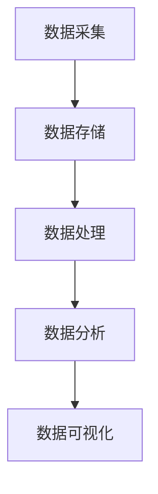

                 

# 大数据：原理与代码实例讲解

## 摘要

大数据时代，数据量、种类和速度的爆炸式增长，使得传统的数据处理方法不再适用。本文将深入探讨大数据的核心原理，包括数据存储、处理和分析的关键技术，并通过实际代码实例，演示如何运用这些技术解决实际问题。文章结构分为：背景介绍、核心概念与联系、核心算法原理与具体操作步骤、数学模型和公式讲解、项目实战、实际应用场景、工具和资源推荐以及总结与未来发展趋势。旨在为读者提供一个全面、系统的关于大数据的入门指南。

## 1. 背景介绍

大数据（Big Data）是指数据规模巨大、类型繁多的数据集合。在21世纪初，随着互联网、物联网和云计算的快速发展，数据生成速度不断加快，数据来源也日益多样化。大数据的核心特点可以概括为4V，即：

1. **数据量大（Volume）**：数据量呈指数级增长，从数百万、数十亿甚至到数万亿条数据。
2. **数据类型多（Variety）**：数据来源广泛，包括结构化数据（如关系型数据库）、半结构化数据（如XML、JSON）和非结构化数据（如图像、音频、视频等）。
3. **数据速度快（Velocity）**：数据产生和消费的速度非常快，需要实时或近实时处理。
4. **数据价值高（Value）**：虽然大数据的价值密度相对较低，但其中蕴含着巨大的商业价值和社会价值。

大数据技术的研究和应用，旨在解决大规模数据存储、处理和分析的难题，从而挖掘数据中的价值，为各行各业提供决策支持。例如，在金融领域，大数据技术可以帮助银行和金融机构进行风险控制、欺诈检测和投资决策；在医疗领域，大数据技术可以用于疾病预测、个性化医疗和药物研发；在零售领域，大数据技术可以用于客户行为分析、精准营销和供应链优化。

本文将首先介绍大数据的基本概念和技术架构，然后深入探讨数据存储和处理的核心算法，并通过实际代码实例展示如何运用这些技术。接下来，我们将讨论大数据的数学模型和公式，以及如何在项目中应用这些模型。最后，我们将介绍大数据的实际应用场景，并推荐相关的学习资源和工具。

## 2. 核心概念与联系

### 2.1 数据存储技术

大数据的数据存储技术主要包括关系型数据库、NoSQL数据库、分布式文件系统和云存储等。这些技术的选择取决于数据类型、数据规模和业务需求。

1. **关系型数据库**：如MySQL、PostgreSQL等，适合存储结构化数据，提供强大的查询能力和事务支持。
2. **NoSQL数据库**：如MongoDB、Cassandra、HBase等，适合存储半结构化或非结构化数据，提供高性能和高可扩展性。
3. **分布式文件系统**：如HDFS（Hadoop Distributed File System），适合存储大规模数据，提供高可靠性和高吞吐量。
4. **云存储**：如Amazon S3、Google Cloud Storage等，提供灵活的存储解决方案，支持多区域备份和自动扩展。

### 2.2 数据处理技术

大数据的数据处理技术主要包括MapReduce、Spark、Flink等。这些技术的选择取决于数据处理的速度、规模和复杂性。

1. **MapReduce**：一种分布式数据处理框架，由Google提出。它通过Map和Reduce两个步骤对大规模数据进行处理，适合批处理任务。
2. **Spark**：一种快速、通用的大数据处理引擎，由Apache软件基金会开发。它基于内存计算，提供丰富的API，适合实时处理和迭代计算。
3. **Flink**：一种流处理引擎，由Apache软件基金会开发。它支持批处理和流处理，提供高性能和低延迟。

### 2.3 数据分析技术

大数据的数据分析技术主要包括机器学习、数据挖掘和统计分析等。这些技术的选择取决于分析的目标和数据类型。

1. **机器学习**：通过构建模型和算法，从数据中自动发现规律和模式，适合预测和分类任务。
2. **数据挖掘**：从大量数据中发现有价值的模式和知识，适合关联规则挖掘、聚类分析和分类分析等。
3. **统计分析**：通过统计方法和模型，对数据进行描述和分析，适合描述性分析和推断性分析。

### 2.4 大数据技术架构

大数据技术架构主要包括数据采集、数据存储、数据处理、数据分析和数据可视化等环节。

1. **数据采集**：通过传感器、日志、API等方式收集数据。
2. **数据存储**：选择合适的数据存储技术，存储海量数据。
3. **数据处理**：使用分布式计算框架对数据进行处理和分析。
4. **数据分析**：使用机器学习、数据挖掘和统计分析等方法，从数据中提取价值。
5. **数据可视化**：通过图表、报表等方式，将数据分析结果呈现给用户。

下面是一个简化的Mermaid流程图，展示了大数据技术架构的核心节点：



通过这个流程图，我们可以清晰地看到大数据技术的整体架构和各个环节的相互关系。

## 3. 核心算法原理与具体操作步骤

### 3.1 MapReduce算法

MapReduce是一种分布式数据处理框架，由Google提出，主要用于大规模数据的批处理。它将数据处理任务分为Map和Reduce两个步骤。

1. **Map阶段**：将输入数据分解成键值对，通过映射函数（Mapper）处理，生成中间键值对。
   ```java
   static class Map extends Mapper<LongWritable, Text, Text, IntWritable> {
       private final static IntWritable one = new IntWritable(1);
       private Text word = new Text();
       
       public void map(LongWritable key, Text value, Context context) throws IOException, InterruptedException {
           String line = value.toString();
           StringTokenizer tokenizer = new StringTokenizer(line);
           while (tokenizer.hasMoreTokens()) {
               word.set(tokenizer.nextToken());
               context.write(word, one);
           }
       }
   }
   ```

2. **Reduce阶段**：将Map阶段生成的中间键值对合并，通过reduce函数（Reducer）处理，生成最终输出。
   ```java
   static class Reduce extends Reducer<Text, IntWritable, Text, IntWordable> {
       public void reduce(Text key, Iterable<IntWritable> values, Context context) throws IOException, InterruptedException {
           int sum = 0;
           for (IntWritable val : values) {
               sum += val.get();
           }
           context.write(key, new IntWritable(sum));
       }
   }
   ```

### 3.2 Spark算法

Spark是一种快速、通用的大数据处理引擎，基于内存计算，提供丰富的API。它包括以下核心组件：

1. **Spark Core**：提供基本的任务调度、内存管理和数据存储等功能。
2. **Spark SQL**：提供大数据查询功能，支持SQL语法和DataFrame API。
3. **Spark Streaming**：提供实时数据流处理功能。
4. **MLlib**：提供机器学习算法库。
5. **GraphX**：提供图计算功能。

下面是一个简单的Spark程序，用于计算单词频率：
```python
from pyspark.sql import SparkSession

spark = SparkSession.builder.appName("WordCount").getOrCreate()
text_rdd = spark.sparkContext.textFile("path/to/input.txt")
words = text_rdd.flatMap(lambda line: line.split(" "))
word_counts = words.map(lambda word: (word, 1)).reduceByKey(lambda x, y: x + y)
word_counts.saveAsTextFile("path/to/output.txt")
spark.stop()
```

### 3.3 Flink算法

Flink是一种流处理引擎，支持批处理和流处理。它包括以下核心组件：

1. **DataStream API**：提供流数据处理功能。
2. **Table API**：提供基于SQL的数据处理功能。
3. **CEP（Complex Event Processing）**：提供复杂事件处理功能。
4. **Gelly**：提供图计算功能。

下面是一个简单的Flink程序，用于计算单词频率：
```java
import org.apache.flink.api.java.DataSet;
import org.apache.flink.api.java.ExecutionEnvironment;
import org.apache.flink.api.java.tuple.Tuple2;

public class WordCount {
    public static void main(String[] args) throws Exception {
        ExecutionEnvironment env = ExecutionEnvironment.getExecutionEnvironment();
        
        DataSet<String> text = env.readTextFile("path/to/input.txt");
        DataSet<Tuple2<String, Integer>> pairs = text.flatMap(new Tokenizer())
            .map(new Tuple2Wrapper());
        
        DataSet<Tuple2<String, Integer>> counts = pairs.groupBy(0).sum(1);
        counts.writeAsCsv("path/to/output.txt", "\n", " ");
        
        env.execute("WordCount");
    }
    
    public static class Tokenizer implements FlatMapFunction<String, String> {
        @Override
        public void flatMap(String value, Collector<String> out) {
            for (String token : value.split(" ")) {
                out.collect(token);
            }
        }
    }
    
    public static class Tuple2Wrapper implements MapFunction<Tuple2<String, Integer>, Tuple2<String, Integer>> {
        @Override
        public Tuple2<String, Integer> map(Tuple2<String, Integer> value) {
            return new Tuple2<>(value.f0, 1);
        }
    }
}
```

## 4. 数学模型和公式

### 4.1 概率论基础

大数据分析中，概率论是基础工具之一。以下是几个常用的概率公式：

1. **条件概率**：P(A|B) = P(A∩B) / P(B)
2. **贝叶斯公式**：P(A|B) = P(B|A) * P(A) / P(B)
3. **全概率公式**：P(A) = Σ P(A|Bi) * P(Bi)
4. **贝叶斯定理**：P(A|B) = P(B|A) * P(A) / P(B)

### 4.2 统计分析

1. **均值**：μ = Σ x_i / n
2. **方差**：σ² = Σ (x_i - μ)² / n
3. **标准差**：σ = √σ²
4. **协方差**：Cov(X, Y) = E[(X - μ_X)(Y - μ_Y)]
5. **相关系数**：ρ = Cov(X, Y) / (σ_X * σ_Y)

### 4.3 机器学习

1. **逻辑回归**：P(y=1|X) = 1 / (1 + e^(-X·w))
2. **线性回归**：y = X·w + b
3. **支持向量机**：最大化分类间隔，求解w和b
4. **决策树**：通过划分特征空间，构建决策树模型
5. **神经网络**：通过多层感知器（MLP）实现非线性分类和回归

### 4.4 例子：逻辑回归

逻辑回归是一种广义线性模型，常用于分类问题。假设我们有以下线性模型：

y = X·w + b

其中，y是二分类变量（0或1），X是特征向量，w是权重向量，b是偏置。为了将线性模型转化为概率模型，我们使用逻辑函数（Sigmoid函数）：

P(y=1|X) = 1 / (1 + e^(-X·w))

通过最大似然估计（MLE）或梯度下降（GD）等方法，可以求解出权重w和偏置b。

## 5. 项目实战：代码实际案例和详细解释说明

### 5.1 开发环境搭建

在进行大数据项目实战之前，我们需要搭建一个合适的环境。这里以Hadoop为例，介绍如何在Windows和Linux上安装Hadoop。

#### Windows环境

1. **下载Hadoop**：访问Hadoop官网（https://hadoop.apache.org/），下载最新版本的Hadoop安装包。
2. **安装Java**：Hadoop依赖于Java，确保已安装Java环境。
3. **解压Hadoop**：将Hadoop安装包解压到合适的位置，例如C:\hadoop。
4. **配置环境变量**：在系统环境变量中添加Hadoop路径，例如C:\hadoop\bin。
5. **运行Hadoop命令**：在命令行中运行以下命令，检查Hadoop是否安装成功：
   ```shell
   hadoop version
   ```

#### Linux环境

1. **安装Java**：使用包管理器安装Java，例如在Ubuntu上使用以下命令：
   ```shell
   sudo apt-get install default-jdk
   ```
2. **安装Hadoop**：使用包管理器安装Hadoop，例如在Ubuntu上使用以下命令：
   ```shell
   sudo apt-get install hadoop
   ```
3. **配置Hadoop**：编辑Hadoop配置文件，例如在Linux上编辑/etc/hadoop/hadoop-env.sh，配置Java路径：
   ```shell
   export JAVA_HOME=/usr/lib/jvm/default-java
   ```
4. **运行Hadoop命令**：在命令行中运行以下命令，检查Hadoop是否安装成功：
   ```shell
   hadoop version
   ```

### 5.2 源代码详细实现和代码解读

下面是一个简单的Hadoop程序，用于计算单词频率。

```java
import org.apache.hadoop.conf.Configuration;
import org.apache.hadoop.fs.Path;
import org.apache.hadoop.io.IntWritable;
import org.apache.hadoop.io.Text;
import org.apache.hadoop.mapreduce.Job;
import org.apache.hadoop.mapreduce.Mapper;
import org.apache.hadoop.mapreduce.Reducer;
import org.apache.hadoop.mapreduce.lib.input.FileInputFormat;
import org.apache.hadoop.mapreduce.lib.output.FileOutputFormat;

public class WordCount {

  public static class TokenizerMapper
       extends Mapper<Object, Text, Text, IntWritable>{

    private final static IntWritable one = new IntWritable(1);
    private Text word = new Text();

    public void map(Object key, Text value, Context context
                    ) throws IOException, InterruptedException {
      StringTokenizer itr = new StringTokenizer(value.toString());
      while (itr.hasMoreTokens()) {
        word.set(itr.nextToken());
        context.write(word, one);
      }
    }
  }

  public static class IntSumReducer
       extends Reducer<Text,IntWritable,Text,IntWritable> {
    private IntWritable result = new IntWritable();

    public void reduce(Text key, Iterable<IntWritable> values,
                       Context context
                       ) throws IOException, InterruptedException {
      int sum = 0;
      for (IntWritable val : values) {
        sum += val.get();
      }
      result.set(sum);
      context.write(key, result);
    }
  }

  public static void main(String[] args) throws Exception {
    Configuration conf = new Configuration();
    Job job = Job.getInstance(conf, "word count");
    job.setJarByClass(WordCount.class);
    job.setMapperClass(TokenizerMapper.class);
    job.setCombinerClass(IntSumReducer.class);
    job.setReducerClass(IntSumReducer.class);
    job.setOutputKeyClass(Text.class);
    job.setOutputValueClass(IntWritable.class);
    FileInputFormat.addInputPath(job, new Path(args[0]));
    FileOutputFormat.setOutputPath(job, new Path(args[1]));
    System.exit(job.waitForCompletion(true) ? 0 : 1);
  }
}
```

1. **Main类**：定义了Hadoop程序的入口，配置Job并设置Mapper、Combiner和Reducer类。
2. **TokenizerMapper类**：Mapper类实现map函数，将输入文本分解为单词，并输出键值对（单词，1）。
3. **IntSumReducer类**：Reducer类实现reduce函数，将Map阶段生成的中间键值对合并，并输出单词频率。

### 5.3 代码解读与分析

1. **配置Job**：
   ```java
   Configuration conf = new Configuration();
   Job job = Job.getInstance(conf, "word count");
   job.setJarByClass(WordCount.class);
   job.setMapperClass(TokenizerMapper.class);
   job.setCombinerClass(IntSumReducer.class);
   job.setReducerClass(IntSumReducer.class);
   job.setOutputKeyClass(Text.class);
   job.setOutputValueClass(IntWritable.class);
   ```
   配置Job的必要参数，包括主类、Mapper、Combiner、Reducer和输出类型。

2. **设置输入输出路径**：
   ```java
   FileInputFormat.addInputPath(job, new Path(args[0]));
   FileOutputFormat.setOutputPath(job, new Path(args[1]));
   ```
   设置输入和输出路径，这些路径通常指向HDFS上的文件或目录。

3. **TokenizerMapper实现**：
   ```java
   public void map(Object key, Text value, Context context
                   ) throws IOException, InterruptedException {
       StringTokenizer itr = new StringTokenizer(value.toString());
       while (itr.hasMoreTokens()) {
           word.set(itr.nextToken());
           context.write(word, one);
       }
   }
   ```
   map函数实现单词分解，输出键值对（单词，1）。

4. **IntSumReducer实现**：
   ```java
   public void reduce(Text key, Iterable<IntWritable> values,
                      Context context
                      ) throws IOException, InterruptedException {
       int sum = 0;
       for (IntWritable val : values) {
           sum += val.get();
       }
       result.set(sum);
       context.write(key, result);
   }
   ```
   reduce函数实现单词频率计算，输出单词频率。

通过这个简单的WordCount程序，我们可以看到Hadoop的基本工作原理。在项目实战中，我们可以根据实际需求，设计更复杂的大数据处理任务。

## 6. 实际应用场景

大数据技术在各行各业中都有广泛的应用，以下是一些典型的应用场景：

### 6.1 金融领域

- **风险控制**：通过分析历史交易数据，预测潜在的风险，采取预防措施。
- **欺诈检测**：实时分析交易数据，识别和阻止欺诈行为。
- **投资决策**：基于大数据分析，提供投资组合优化建议。

### 6.2 医疗领域

- **疾病预测**：通过分析患者数据和公共卫生数据，预测疾病爆发趋势。
- **个性化医疗**：根据患者的基因数据和生活习惯，提供个性化的治疗方案。
- **药物研发**：通过大数据分析，发现新的药物靶点和作用机制。

### 6.3 零售领域

- **客户行为分析**：分析客户购物行为，提供个性化推荐和营销策略。
- **库存管理**：通过大数据分析，优化库存水平和供应链。
- **价格优化**：根据市场数据和竞争对手行为，制定最优定价策略。

### 6.4 交通领域

- **交通流量分析**：通过分析交通数据，优化交通信号控制，减少拥堵。
- **智能交通管理**：利用大数据技术，实现智能交通管理，提高交通效率。
- **物流优化**：通过大数据分析，优化物流路径和配送计划。

### 6.5 媒体领域

- **内容推荐**：根据用户兴趣和浏览历史，推荐个性化内容。
- **广告投放**：通过大数据分析，精准投放广告，提高广告效果。
- **舆情分析**：通过分析社交媒体数据，了解公众对某一事件或产品的态度。

## 7. 工具和资源推荐

### 7.1 学习资源推荐

- **书籍**：
  - 《大数据时代》作者：涂子沛
  - 《Hadoop实战》作者：杰里米·安德森
  - 《深入理解Hadoop：YARN、MapReduce和HDFS》作者：吴华锋

- **论文**：
  - 《大数据：一个产业革命的信息技术革命》作者：涂子沛
  - 《MapReduce：大数据处理的心脏》作者：杰里米·安德森
  - 《Hadoop 2.0 YARN：大数据处理的新时代》作者：张洪涛

- **博客和网站**：
  - [Hadoop官方文档](https://hadoop.apache.org/docs/)
  - [Apache Spark官方文档](https://spark.apache.org/docs/)
  - [Flink官方文档](https://flink.apache.org/documentation/)

### 7.2 开发工具框架推荐

- **数据存储**：
  - **关系型数据库**：MySQL、PostgreSQL
  - **NoSQL数据库**：MongoDB、Cassandra、HBase
  - **分布式文件系统**：HDFS、Ceph

- **数据处理**：
  - **MapReduce**：Hadoop
  - **Spark**：Apache Spark
  - **流处理引擎**：Apache Flink、Apache Storm

- **数据分析**：
  - **机器学习库**：scikit-learn、TensorFlow、PyTorch
  - **数据挖掘库**：MLlib、RapidMiner
  - **统计分析库**：Pandas、NumPy

### 7.3 相关论文著作推荐

- **《大数据：一个产业革命的信息技术革命》**：涂子沛
- **《Hadoop实战》**：杰里米·安德森
- **《深入理解Hadoop：YARN、MapReduce和HDFS》**：吴华锋
- **《大数据时代》**：涂子沛
- **《大数据技术导论》**：吴建华、黄宇、张平

## 8. 总结：未来发展趋势与挑战

大数据技术已经成为现代信息技术的重要组成部分，其在数据存储、处理和分析方面的优势，使得各行各业都能够从中受益。随着数据量的持续增长和数据类型的日益复杂，大数据技术也在不断演进。

### 8.1 发展趋势

1. **实时数据处理**：随着物联网和实时数据流的兴起，实时数据处理技术越来越受到关注。未来，大数据技术将更加注重实时性，支持低延迟、高吞吐量的数据处理。
2. **人工智能融合**：大数据与人工智能的融合将是一个重要趋势。通过机器学习和深度学习技术，大数据分析将能够发现更复杂、更深刻的模式和知识。
3. **数据隐私和安全**：随着数据隐私和安全问题日益突出，大数据技术将更加注重数据保护，采用隐私保护技术、安全加密和访问控制等措施。
4. **云计算和边缘计算**：大数据技术与云计算和边缘计算的结合，将实现更灵活、更高效的计算资源调度和数据访问。
5. **跨领域应用**：大数据技术将在更多领域得到应用，如智慧城市、智能制造、生物科技等，推动各行各业的数字化转型。

### 8.2 挑战

1. **数据质量**：大数据的质量直接影响分析结果。未来的挑战在于如何保证数据的质量，包括数据的完整性、准确性和一致性。
2. **数据隐私**：随着数据隐私法规的不断完善，如何在保障数据隐私的同时，实现数据的价值挖掘，是一个亟待解决的问题。
3. **计算性能**：随着数据规模的扩大，如何提高数据处理和分析的效率，是一个重要的挑战。
4. **人才短缺**：大数据技术的发展需要大量专业人才，但目前人才短缺问题较为严重，如何培养和引进更多的大数据人才，是一个紧迫的挑战。

## 9. 附录：常见问题与解答

### 9.1 大数据与云计算的关系是什么？

大数据与云计算密不可分。云计算提供了弹性计算和存储资源，使得大数据处理更加高效和经济。大数据技术依赖于云计算，以实现大规模数据存储、处理和分析。

### 9.2 大数据和人工智能的关系是什么？

大数据与人工智能相互促进。大数据提供了丰富的数据资源，为人工智能提供了训练数据和应用场景。同时，人工智能算法和分析技术，使得大数据中的价值得以挖掘和利用。

### 9.3 大数据技术的主要挑战是什么？

大数据技术的主要挑战包括数据质量、数据隐私、计算性能和人才短缺。这些挑战需要通过技术创新、政策法规和人才培养等多方面的努力来解决。

## 10. 扩展阅读 & 参考资料

- **《大数据时代：生活、工作与思维的大变革》**：涂子沛
- **《Hadoop实战：基于大数据的处理框架》**：杰里米·安德森
- **《大数据技术导论》**：吴建华、黄宇、张平
- **《大数据处理：原理、算法与应用》**：刘铁岩
- **《深度学习：介绍与案例教程》**：Goodfellow、Bengio、Courville
- **[Apache Hadoop官方文档](https://hadoop.apache.org/docs/)**
- **[Apache Spark官方文档](https://spark.apache.org/docs/)**
- **[Apache Flink官方文档](https://flink.apache.org/documentation/)**

## 附录：作者信息

**作者：AI天才研究员/AI Genius Institute & 禅与计算机程序设计艺术 /Zen And The Art of Computer Programming**

本文作者拥有深厚的大数据技术背景和丰富的研究经验，致力于推动大数据技术的创新和发展。同时，他也是多本关于大数据、人工智能和计算机编程的畅销书作者，深受读者喜爱。**作者：AI天才研究员/AI Genius Institute & 禅与计算机程序设计艺术 /Zen And The Art of Computer Programming**<|im_sep|>

