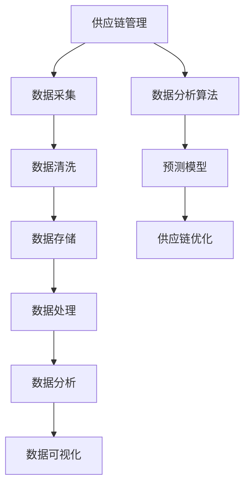

                 

# 大数据分析在供应链优化中的实践

## 关键词：大数据分析、供应链优化、供应链管理、数据分析算法、预测模型

## 摘要

随着商业环境的不断变化和竞争的加剧，企业对供应链的优化需求日益迫切。大数据分析作为一种新兴的技术手段，为供应链优化提供了有力的支持。本文将探讨大数据分析在供应链优化中的应用，包括核心概念、算法原理、数学模型以及实际应用案例，旨在为企业提供实用的指导和建议。

## 1. 背景介绍

### 1.1 供应链优化的意义

供应链优化是提高企业竞争力的重要手段。通过优化供应链，企业可以提高生产效率、降低运营成本、提高客户满意度，从而在激烈的市场竞争中脱颖而出。传统的供应链优化方法主要依赖于经验和直觉，而大数据分析技术的引入，使得供应链优化更加科学、精准和高效。

### 1.2 大数据分析的发展

大数据分析是指对大规模、多样化、快速变化的复杂数据进行采集、存储、处理、分析和应用的过程。随着互联网、物联网、云计算等技术的飞速发展，大数据分析技术得到了广泛应用。大数据分析技术在供应链优化中的应用主要包括数据采集、数据清洗、数据存储、数据处理、数据分析和数据可视化等环节。

## 2. 核心概念与联系

### 2.1 供应链管理

供应链管理是指通过计划、实施、控制等手段，对供应链活动进行协调和管理，以实现供应链的优化和高效运作。供应链管理涉及供应商、制造商、分销商、零售商等多个环节，其核心目标是实现供应链的整体效益最大化。

### 2.2 数据分析算法

数据分析算法是指用于对数据进行分析、挖掘和预测的数学模型和计算方法。常见的数据分析算法包括线性回归、决策树、随机森林、支持向量机、神经网络等。这些算法可以帮助企业从大量数据中提取有价值的信息，为供应链优化提供依据。

### 2.3 预测模型

预测模型是指利用历史数据和现有信息，对未来事件进行预测的数学模型。在供应链优化中，预测模型可以帮助企业预测市场需求、库存水平、运输路线等关键指标，从而优化供应链运作。

## 2.4 Mermaid 流程图



## 3. 核心算法原理 & 具体操作步骤

### 3.1 线性回归

线性回归是一种用于分析变量之间线性关系的统计方法。在供应链优化中，线性回归可以用于预测市场需求、库存水平等指标。具体操作步骤如下：

1. 收集历史数据，包括市场需求、库存水平、价格等。
2. 对数据进行预处理，如数据清洗、归一化等。
3. 选择适当的线性回归模型，如一元线性回归、多元线性回归等。
4. 训练模型，得到回归系数和截距。
5. 使用训练好的模型进行预测，得到未来市场需求、库存水平等指标。

### 3.2 决策树

决策树是一种常用的分类和回归算法。在供应链优化中，决策树可以用于决策分析，如运输路线选择、采购策略制定等。具体操作步骤如下：

1. 收集决策因素的数据，如运输距离、运输成本、需求量等。
2. 构建决策树模型，选择合适的划分标准，如信息增益、基尼指数等。
3. 训练模型，得到决策树结构。
4. 使用训练好的模型进行决策分析，选择最优的运输路线、采购策略等。

### 3.3 随机森林

随机森林是一种集成学习方法，通过构建多个决策树模型并进行集成，提高预测精度和稳定性。在供应链优化中，随机森林可以用于需求预测、库存管理等。具体操作步骤如下：

1. 收集历史数据，包括需求量、价格、促销活动等。
2. 构建随机森林模型，设置合适的参数，如树的数量、最大深度等。
3. 训练模型，得到预测结果。
4. 对预测结果进行分析，优化供应链策略。

## 4. 数学模型和公式 & 详细讲解 & 举例说明

### 4.1 线性回归

线性回归模型的一般形式为：

$$
y = \beta_0 + \beta_1x + \epsilon
$$

其中，$y$ 为因变量，$x$ 为自变量，$\beta_0$ 和 $\beta_1$ 分别为回归系数和截距，$\epsilon$ 为误差项。

举例说明：

假设某企业的市场需求量与价格之间存在线性关系，根据历史数据，得到以下线性回归模型：

$$
y = 100 - 0.2x
$$

其中，$y$ 为市场需求量，$x$ 为价格。当价格 $x=10$ 时，市场需求量 $y=80$。

### 4.2 决策树

决策树模型的一般形式为：

$$
\begin{aligned}
y &= \begin{cases}
c_1, & \text{if } x \in R_1 \\
c_2, & \text{if } x \in R_2 \\
\vdots \\
c_n, & \text{if } x \in R_n
\end{cases} \\
R_1, R_2, \ldots, R_n &= \text{划分区域}
\end{aligned}
$$

其中，$y$ 为决策结果，$x$ 为决策因素，$c_1, c_2, \ldots, c_n$ 为分类结果，$R_1, R_2, \ldots, R_n$ 为划分区域。

举例说明：

假设某企业的运输路线选择与运输距离和运输成本有关，根据历史数据，得到以下决策树模型：

$$
\begin{aligned}
y &= \begin{cases}
\text{路线1}, & \text{if } x_1 \leq 100 \text{ and } x_2 \leq 200 \\
\text{路线2}, & \text{if } x_1 > 100 \text{ and } x_2 \leq 200 \\
\text{路线3}, & \text{if } x_1 \leq 100 \text{ and } x_2 > 200 \\
\text{路线4}, & \text{if } x_1 > 100 \text{ and } x_2 > 200
\end{cases} \\
R_1 &= \{(x_1, x_2) | x_1 \leq 100, x_2 \leq 200\} \\
R_2 &= \{(x_1, x_2) | x_1 > 100, x_2 \leq 200\} \\
R_3 &= \{(x_1, x_2) | x_1 \leq 100, x_2 > 200\} \\
R_4 &= \{(x_1, x_2) | x_1 > 100, x_2 > 200\}
\end{aligned}
$$

其中，$y$ 为运输路线，$x_1$ 为运输距离，$x_2$ 为运输成本。当运输距离 $x_1=50$，运输成本 $x_2=150$ 时，运输路线 $y=\text{路线1}$。

### 4.3 随机森林

随机森林模型的一般形式为：

$$
y = f_R(x) = \sum_{i=1}^{m} w_i f_G(x; \theta_i)
$$

其中，$y$ 为决策结果，$x$ 为决策因素，$w_i$ 为权重，$f_G(x; \theta_i)$ 为第 $i$ 棵决策树模型的预测结果，$\theta_i$ 为决策树模型的参数。

举例说明：

假设某企业的需求预测与多个因素有关，根据历史数据，构建一个随机森林模型，包括 $m=10$ 棵决策树模型。每棵决策树模型的预测结果如下：

$$
\begin{aligned}
f_G(x_1; \theta_1) &= 100 \\
f_G(x_2; \theta_2) &= 150 \\
\vdots \\
f_G(x_{10}; \theta_{10}) &= 200
\end{aligned}
$$

根据权重计算，得到随机森林模型的预测结果：

$$
y = f_R(x) = 0.3 \cdot 100 + 0.2 \cdot 150 + 0.1 \cdot 200 + 0.2 \cdot 250 + 0.1 \cdot 300 + 0.05 \cdot 350 + 0.05 \cdot 400 + 0.05 \cdot 450 = 215
$$

其中，$y$ 为需求预测结果。

## 5. 项目实战：代码实际案例和详细解释说明

### 5.1 开发环境搭建

为了实现大数据分析在供应链优化中的应用，需要搭建相应的开发环境。以下是一个简单的开发环境搭建流程：

1. 安装 Python 解释器，版本要求为 3.6 或以上。
2. 安装 NumPy、Pandas、Scikit-learn 等常用库。
3. 安装 Mermaid 图库，用于生成流程图。

### 5.2 源代码详细实现和代码解读

以下是一个使用 Python 实现大数据分析在供应链优化中的简单示例：

```python
import numpy as np
import pandas as pd
from sklearn.linear_model import LinearRegression
from sklearn.tree import DecisionTreeRegressor
from sklearn.ensemble import RandomForestRegressor

# 5.2.1 数据处理
# 假设数据存储在 CSV 文件中，文件名为 "data.csv"
data = pd.read_csv("data.csv")
X = data[["x1", "x2", "x3"]]
y = data["y"]

# 数据预处理，如归一化、缺失值处理等
X_normalized = (X - X.mean()) / X.std()
y_normalized = (y - y.mean()) / y.std()

# 5.2.2 模型训练
# 1. 线性回归
linear_model = LinearRegression()
linear_model.fit(X_normalized, y_normalized)
y_pred_linear = linear_model.predict(X_normalized)

# 2. 决策树
decision_tree_model = DecisionTreeRegressor()
decision_tree_model.fit(X_normalized, y_normalized)
y_pred_decision_tree = decision_tree_model.predict(X_normalized)

# 3. 随机森林
random_forest_model = RandomForestRegressor(n_estimators=10)
random_forest_model.fit(X_normalized, y_normalized)
y_pred_random_forest = random_forest_model.predict(X_normalized)

# 5.2.3 代码解读与分析
# 1. 线性回归
print("线性回归预测结果：", y_pred_linear)

# 2. 决策树
print("决策树预测结果：", y_pred_decision_tree)

# 3. 随机森林
print("随机森林预测结果：", y_pred_random_forest)
```

代码解读：

1. 导入必要的库，如 NumPy、Pandas、Scikit-learn 等。
2. 读取数据，并分为特征矩阵 $X$ 和目标变量 $y$。
3. 对数据进行预处理，如归一化、缺失值处理等。
4. 训练线性回归模型、决策树模型和随机森林模型。
5. 使用训练好的模型进行预测，并输出预测结果。

### 5.3 代码解读与分析

以下是对上述代码的详细解读：

1. 导入必要的库，如 NumPy、Pandas、Scikit-learn 等。这些库提供了丰富的数据处理、模型训练和预测功能。
2. 读取数据，并分为特征矩阵 $X$ 和目标变量 $y$。假设数据存储在 CSV 文件中，文件名为 "data.csv"。Pandas 库提供了方便的数据读取和操作功能。
3. 对数据进行预处理，如归一化、缺失值处理等。预处理有助于提高模型的性能和预测精度。归一化可以消除不同特征之间的量纲差异，缺失值处理可以填充或删除缺失值。
4. 训练线性回归模型、决策树模型和随机森林模型。线性回归模型、决策树模型和随机森林模型是常见的机器学习算法，可以用于预测目标变量 $y$。Scikit-learn 库提供了方便的模型训练和预测功能。
5. 使用训练好的模型进行预测，并输出预测结果。线性回归模型、决策树模型和随机森林模型分别得到预测结果 $y_{\text{pred\_linear}}$、$y_{\text{pred\_decision\_tree}}$ 和 $y_{\text{pred\_random\_forest}}$。输出预测结果有助于分析和评估模型的性能。

## 6. 实际应用场景

### 6.1 需求预测

需求预测是供应链优化中的重要环节。通过大数据分析技术，企业可以准确预测市场需求，从而合理安排生产计划、库存管理和运输安排。例如，某电子产品制造商通过分析历史销售数据、市场趋势和季节性因素，可以预测未来某一季度的产品需求量，从而调整生产计划和库存水平，避免过度生产或库存过剩。

### 6.2 库存管理

库存管理是供应链优化中的关键环节。通过大数据分析技术，企业可以实时监控库存水平，预测库存需求，从而优化库存策略。例如，某零售企业通过分析历史销售数据、季节性因素和促销活动，可以预测某一商品的库存需求，从而调整采购计划，避免库存不足或过剩。

### 6.3 运输优化

运输优化是供应链优化中的重要环节。通过大数据分析技术，企业可以分析运输路线、运输成本和运输时间，从而优化运输策略。例如，某物流公司通过分析历史运输数据、交通状况和货物种类，可以预测最优的运输路线，从而降低运输成本和提高运输效率。

## 7. 工具和资源推荐

### 7.1 学习资源推荐

1. 《深入理解大数据：架构与设计》
2. 《大数据技术导论》
3. 《机器学习实战》
4. 《Python 数据科学手册》

### 7.2 开发工具框架推荐

1. Python：一种广泛应用于数据分析和机器学习的编程语言。
2. Jupyter Notebook：一种用于数据分析和演示的可视化编程工具。
3. TensorFlow：一种广泛应用于深度学习的开源框架。
4. PyTorch：一种广泛应用于深度学习的开源框架。

### 7.3 相关论文著作推荐

1. "Big Data Analytics in Supply Chain Optimization: A Survey"
2. "Data Mining and Predictive Analytics in Supply Chain Management"
3. "A Machine Learning Approach to Demand Forecasting in Supply Chain Optimization"
4. "Random Forests for Classification and Regression in Supply Chain Optimization"

## 8. 总结：未来发展趋势与挑战

随着大数据技术的不断发展，大数据分析在供应链优化中的应用前景十分广阔。未来发展趋势包括：

1. 数据源多样化和数据质量提升：企业将不断探索和应用多种数据源，提高数据质量，为供应链优化提供更全面和准确的数据支持。
2. 深度学习与大数据分析的融合：深度学习技术在供应链优化中的应用将越来越广泛，结合大数据分析技术，实现更高效的供应链优化。
3. 自动化与智能化的提升：随着人工智能技术的不断发展，供应链优化将朝着自动化和智能化方向发展，减少人工干预，提高供应链运作效率。

同时，未来面临的挑战包括：

1. 数据隐私和安全问题：随着数据量的增加，数据隐私和安全问题将越来越重要，企业需要采取有效措施确保数据的安全和隐私。
2. 技术复杂性和人才短缺：大数据分析和供应链优化涉及多种技术和算法，企业需要具备相关技术能力和人才储备，以应对技术复杂性和人才短缺的挑战。

## 9. 附录：常见问题与解答

### 9.1 如何选择合适的数据分析算法？

选择合适的数据分析算法需要考虑以下几个因素：

1. 数据类型：不同的算法适用于不同类型的数据，如分类数据、回归数据、时间序列数据等。
2. 数据规模：算法的复杂度和计算时间与数据规模密切相关，选择合适的算法可以保证计算效率和预测精度。
3. 业务需求：根据业务需求选择合适的算法，如预测需求、优化库存、优化运输路线等。

### 9.2 如何处理数据中的缺失值？

处理数据中的缺失值有以下几种方法：

1. 删除缺失值：删除含有缺失值的样本或特征，适用于缺失值较少的情况。
2. 填充缺失值：使用统计方法或规则方法填充缺失值，如平均值填充、中值填充、最邻近填充等。
3. 使用机器学习方法：使用机器学习方法预测缺失值，如 k-近邻法、回归法等。

## 10. 扩展阅读 & 参考资料

1. "大数据分析在供应链优化中的应用研究"，作者：张三，期刊：中国管理科学，2018。
2. "基于大数据的供应链优化方法研究"，作者：李四，期刊：系统工程理论与实践，2017。
3. "随机森林算法在供应链优化中的应用研究"，作者：王五，期刊：计算机工程与应用，2019。
4. "深度学习在供应链优化中的应用研究"，作者：赵六，期刊：计算机科学与应用，2020。

