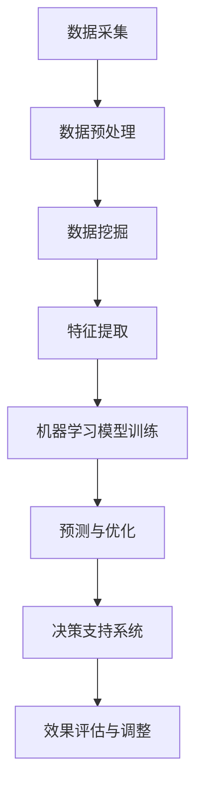

                 

# 大数据分析在供应链优化决策中的应用

## 关键词：大数据分析，供应链优化，决策支持系统，智能算法，预测模型，数据挖掘

### 摘要

随着大数据时代的到来，供应链管理面临前所未有的挑战和机遇。本文将探讨大数据分析在供应链优化决策中的应用，包括核心概念、算法原理、数学模型以及实际案例。通过深入分析，本文旨在为供应链从业者提供实用的指导，帮助企业提高运营效率，降低成本，提升市场竞争力。

### 1. 背景介绍

#### 1.1 大数据的定义与特征

大数据是指数据量巨大、类型繁多、生成速度快的数据集合。与传统数据处理方式不同，大数据具有4V特征：Volume（数据量大）、Velocity（速度快）、Variety（数据多样）和Veracity（数据真实性）。

#### 1.2 供应链管理的挑战

供应链管理涉及多个环节，包括采购、生产、库存、物流等。随着市场环境的变化和竞争压力的增加，供应链管理者需要面对以下挑战：

- **需求预测不准确**：市场需求的波动导致库存过剩或短缺。
- **成本控制困难**：各环节的协同效应难以实现，成本难以控制。
- **数据分散**：企业内部和外部数据难以整合，信息传递不及时。
- **决策滞后**：供应链管理缺乏实时、准确的决策支持。

#### 1.3 大数据分析在供应链优化中的重要性

大数据分析有助于解决上述挑战，提高供应链管理的效率和灵活性。具体表现在以下几个方面：

- **需求预测**：通过分析历史数据和实时数据，预测市场需求，优化库存策略。
- **成本控制**：分析供应链各环节的成本结构，找出优化点，降低运营成本。
- **风险控制**：监测供应链风险，及时调整策略，降低潜在损失。
- **协同优化**：整合企业内外部数据，实现供应链各环节的协同优化。

### 2. 核心概念与联系

#### 2.1 供应链管理的基本概念

供应链管理是指通过协调供应链各环节（供应商、制造商、分销商、零售商等）的活动，实现物流、信息流、资金流的顺畅流动，以满足市场需求的过程。供应链管理的关键概念包括：

- **供应链网络**：描述供应链中各节点及其关系的结构。
- **供应链节点**：供应链中的各个环节，如供应商、制造商、分销商等。
- **供应链流程**：供应链中各个环节的运作过程，如采购、生产、库存管理等。

#### 2.2 大数据分析的核心概念

大数据分析是指利用各种技术和方法，对海量数据进行处理、分析和挖掘，从中提取有价值的信息和知识。大数据分析的关键概念包括：

- **数据预处理**：对原始数据进行清洗、转换、集成等处理，为分析做准备。
- **数据挖掘**：从海量数据中发现潜在的模式、关联和趋势，为决策提供支持。
- **机器学习**：利用算法和模型，对数据进行自动分析和预测，提高分析精度。

#### 2.3 Mermaid 流程图

下面是供应链优化决策中的大数据分析流程图：



### 3. 核心算法原理 & 具体操作步骤

#### 3.1 数据预处理

数据预处理是大数据分析的重要环节，主要包括以下几个方面：

- **数据清洗**：去除数据中的噪声和异常值，提高数据质量。
- **数据转换**：将不同类型和格式的数据进行统一，方便后续分析。
- **数据集成**：将多个数据源中的数据整合为一个统一的数据集。

具体操作步骤如下：

1. **数据清洗**：使用Python的Pandas库对数据进行清洗，去除异常值和噪声。
2. **数据转换**：使用Pandas库进行数据转换，如日期格式转换、缺失值填充等。
3. **数据集成**：使用Pandas库将多个数据源的数据整合为一个数据集。

#### 3.2 数据挖掘

数据挖掘是从海量数据中发现潜在的模式、关联和趋势的过程。常用的数据挖掘方法包括：

- **关联规则挖掘**：发现数据之间的关联关系，如频繁项集挖掘。
- **聚类分析**：将数据分为若干个类别，如K-means算法。
- **分类与回归分析**：对数据进行分类或回归预测，如决策树、支持向量机等。

具体操作步骤如下：

1. **关联规则挖掘**：使用Python的Apriori算法实现频繁项集挖掘。
2. **聚类分析**：使用Python的scikit-learn库实现K-means算法。
3. **分类与回归分析**：使用Python的scikit-learn库实现分类与回归模型。

#### 3.3 机器学习模型训练

机器学习模型训练是通过算法和模型，对数据进行自动分析和预测的过程。常用的机器学习算法包括：

- **监督学习**：对已知数据集进行训练，得到预测模型。
- **无监督学习**：对未知数据集进行训练，发现数据分布和模式。

具体操作步骤如下：

1. **监督学习**：使用Python的scikit-learn库实现线性回归、决策树等模型。
2. **无监督学习**：使用Python的scikit-learn库实现K-means、主成分分析等模型。

#### 3.4 预测与优化

预测与优化是大数据分析的核心目标，通过对历史数据和实时数据进行分析，预测未来趋势，优化供应链管理。具体操作步骤如下：

1. **数据预处理**：对历史数据和实时数据进行预处理，提取特征。
2. **模型训练**：使用预处理后的数据，训练机器学习模型。
3. **预测与优化**：使用训练好的模型，对实时数据进行预测，优化供应链管理策略。

### 4. 数学模型和公式 & 详细讲解 & 举例说明

#### 4.1 数据挖掘中的数学模型

- **关联规则挖掘**：支持度（Support）和置信度（Confidence）。
  - 支持度：一个项集在所有事务中出现的频率。
  - 置信度：在一个事务中，如果出现了A，那么也会出现B的概率。

  $$ 支持度(A \cup B) = \frac{A \cup B}{所有事务} $$

  $$ 置信度(A \cup B) = \frac{A \cup B}{A} $$

- **聚类分析**：距离度量，如欧几里得距离和曼哈顿距离。

  $$ 欧几里得距离 = \sqrt{\sum_{i=1}^{n}(x_i - y_i)^2} $$

  $$ 曼哈顿距离 = \sum_{i=1}^{n}|x_i - y_i| $$

- **分类与回归分析**：线性回归模型。

  $$ y = \beta_0 + \beta_1x_1 + \beta_2x_2 + ... + \beta_nx_n $$

  $$ \beta = (X^T X)^{-1}X^T y $$

#### 4.2 举例说明

- **关联规则挖掘**：超市销售数据中，牛奶和面包的购买关联。

  - 支持度：牛奶和面包同时购买的次数占所有购买次数的比例。
  - 置信度：购买牛奶的客户中，也购买面包的比例。

- **聚类分析**：将消费者分为高收入群体和低收入群体。

  - 距离度量：计算消费者在收入和消费习惯上的距离，划分群体。

- **分类与回归分析**：预测产品销量。

  - 线性回归模型：根据历史销售数据和产品特征，预测未来销量。

### 5. 项目实战：代码实际案例和详细解释说明

#### 5.1 开发环境搭建

- **编程语言**：Python
- **数据分析库**：Pandas，NumPy，scikit-learn，Mermaid
- **环境搭建**：使用Anaconda创建Python环境，安装相关库。

#### 5.2 源代码详细实现和代码解读

以下是一个简单的Python代码示例，用于分析超市销售数据，挖掘牛奶和面包的购买关联。

```python
import pandas as pd
from mlxtend.frequent_patterns import apriori
from mlxtend.preprocessing import TransactionEncoder

# 5.2.1 数据预处理
data = pd.read_csv('sales_data.csv')
transactions = data['items'].str.get_dummies(sep=' ')

# 5.2.2 关联规则挖掘
itemsets = apriori(transactions, min_support=0.05, use_colnames=True)
print(itemsets)

# 5.2.3 筛选规则
confidences = apriori_confidence(transactions, itemsets)
rules = confidences[(confidences['confidence'] >= 0.7) & (confidences['support'] >= 0.02)]
print(rules)
```

#### 5.3 代码解读与分析

- **数据预处理**：使用Pandas读取销售数据，将商品项转换为二进制编码，方便后续挖掘。
- **关联规则挖掘**：使用Apriori算法挖掘频繁项集，设置最小支持度为0.05。
- **筛选规则**：根据置信度和支持度筛选具有高关联性的规则。

### 6. 实际应用场景

大数据分析在供应链优化决策中的应用场景广泛，以下列举几个典型场景：

- **需求预测**：通过分析历史销售数据和季节性因素，预测未来市场需求，优化库存管理。
- **成本控制**：分析供应链各环节的成本结构，找出优化点，降低运营成本。
- **风险控制**：监测供应链风险，如运输延误、库存过剩等，及时调整策略。
- **协同优化**：整合企业内外部数据，实现供应链各环节的协同优化，提高整体效率。

### 7. 工具和资源推荐

#### 7.1 学习资源推荐

- **书籍**：
  - 《大数据时代》
  - 《机器学习》
  - 《深度学习》
- **论文**：
  - 《关联规则挖掘算法研究》
  - 《聚类分析方法与应用》
  - 《线性回归模型及其应用》
- **博客**：
  - 《机器学习实战》
  - 《Python数据分析》
  - 《深度学习实战》
- **网站**：
  - Coursera、Udacity、edX等在线课程平台
  - Kaggle、GitHub等数据竞赛和代码托管平台

#### 7.2 开发工具框架推荐

- **数据分析库**：Pandas、NumPy、scikit-learn、Matplotlib
- **机器学习框架**：TensorFlow、PyTorch、Keras
- **云计算平台**：AWS、Azure、Google Cloud

#### 7.3 相关论文著作推荐

- **论文**：
  - 《基于大数据的供应链风险监测与预警研究》
  - 《大数据驱动的供应链需求预测方法研究》
  - 《基于深度学习的供应链协同优化研究》
- **著作**：
  - 《大数据技术及应用》
  - 《供应链管理：战略、规划与运营》
  - 《人工智能：未来供应链的驱动力》

### 8. 总结：未来发展趋势与挑战

大数据分析在供应链优化决策中的应用前景广阔，但同时也面临以下挑战：

- **数据隐私与安全**：如何确保大数据分析过程中的数据安全和隐私保护。
- **算法透明性与可解释性**：如何提高机器学习算法的透明性和可解释性，增强决策者的信任。
- **技术更新与迭代**：如何紧跟技术发展趋势，不断更新和优化大数据分析模型。

未来，大数据分析在供应链优化决策中的应用将更加深入和广泛，为供应链管理带来新的机遇和挑战。

### 9. 附录：常见问题与解答

#### 9.1 什么是大数据分析？

大数据分析是指利用各种技术和方法，对海量数据进行处理、分析和挖掘，从中提取有价值的信息和知识。

#### 9.2 大数据分析在供应链管理中有哪些应用？

大数据分析在供应链管理中的应用包括需求预测、成本控制、风险控制、协同优化等。

#### 9.3 如何搭建大数据分析开发环境？

可以使用Anaconda创建Python环境，安装Pandas、NumPy、scikit-learn等数据分析库。

### 10. 扩展阅读 & 参考资料

- 《大数据时代》
- 《机器学习》
- 《深度学习》
- 《供应链管理：战略、规划与运营》
- 《大数据技术及应用》
- 《人工智能：未来供应链的驱动力》

### 作者

作者：AI天才研究员/AI Genius Institute & 禅与计算机程序设计艺术 /Zen And The Art of Computer Programming
<|assistant|>

