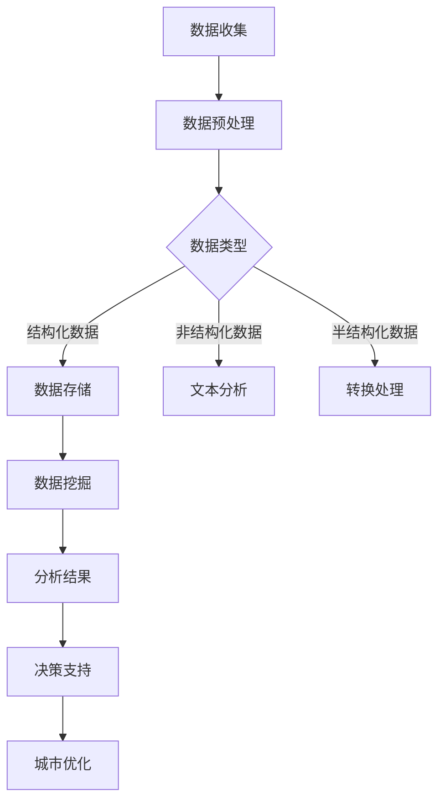

                 

### 文章标题

《大数据分析在智慧城市规划中的应用策略》

### 关键词

智慧城市，大数据分析，城市规划，应用策略

### 摘要

本文将探讨大数据分析在智慧城市规划中的关键作用。通过深入分析大数据的概念、智慧城市的构成要素以及大数据分析在其中的应用，本文旨在提出一套系统的应用策略，以指导城市规划者如何更好地利用大数据技术提升城市管理水平，从而实现智慧城市的可持续发展。

### 1. 背景介绍

随着信息技术的飞速发展，大数据分析作为一种新兴的技术手段，已经逐渐渗透到各个行业，其中也包括城市规划领域。智慧城市作为信息化时代城市发展的新趋势，其核心在于通过信息技术手段实现城市资源的优化配置、提高城市治理效率和居民生活质量。而大数据分析在这一过程中发挥着不可或缺的作用。

大数据分析指的是从海量数据中提取有价值信息的过程，包括数据的收集、存储、处理、分析和可视化等环节。智慧城市则是指利用物联网、云计算、大数据等先进技术，实现城市资源的智能管理和服务的城市。智慧城市主要包括以下几个方面的构成要素：

1. **智能基础设施**：包括物联网传感器、智能交通系统、智能电网等，为智慧城市的运行提供数据支持。
2. **智慧城市管理**：通过大数据分析实现城市运行状态的实时监控和动态管理，提高城市治理效率。
3. **智慧公共服务**：利用大数据技术提升公共服务水平，如教育、医疗、交通等。
4. **智慧经济发展**：通过大数据分析挖掘城市发展潜力，推动产业升级和经济增长。

#### 1.1 大数据的特征

大数据具有四个主要特征，即“4V”：Volume（大量）、Velocity（高速）、Variety（多样）和 Veracity（真实性）。这些特征使得大数据分析在城市规划中具有重要意义。

1. **大量**：城市中产生的数据量非常庞大，包括交通流量、环境监测、居民行为等各个方面。
2. **高速**：数据产生和传输的速度非常快，要求分析系统具备实时处理能力。
3. **多样**：数据类型多种多样，包括结构化数据、非结构化数据等，需要复杂的数据处理技术。
4. **真实性**：数据需要真实、可靠，以保证分析的准确性和决策的科学性。

#### 1.2 智慧城市的构成

智慧城市的构成可以概括为以下几个方面：

1. **基础设施**：智能交通、智能照明、智能环境监测等。
2. **管理平台**：城市信息模型（CIM）、地理信息系统（GIS）、大数据分析平台等。
3. **公共服务**：在线政务、智慧医疗、智慧教育、智慧交通等。
4. **产业生态**：高新技术产业、智慧农业、智慧物流等。

#### 1.3 大数据分析在城市规划中的应用

大数据分析在城市规划中的应用主要体现在以下几个方面：

1. **城市空间布局优化**：通过大数据分析预测城市发展趋势，优化城市空间布局。
2. **交通管理优化**：通过大数据分析优化交通流量，减少拥堵，提高交通效率。
3. **环境监测与管理**：通过大数据分析实时监测环境质量，及时采取治理措施。
4. **公共服务优化**：通过大数据分析提升公共服务水平，满足居民需求。

### 2. 核心概念与联系

#### 2.1 大数据的概念与分类

大数据是指无法使用常规软件工具在合理时间内完成存储、管理和分析的数据集合。大数据通常包括以下几类：

1. **结构化数据**：如数据库、表格等，可以进行结构化处理。
2. **非结构化数据**：如图像、视频、文本等，无法进行结构化处理。
3. **半结构化数据**：如XML、JSON等，介于结构化数据和非结构化数据之间。

#### 2.2 智慧城市的概念与构成

智慧城市是指利用信息技术，特别是物联网、云计算、大数据等技术，实现城市资源的智能管理和服务的城市。智慧城市主要包括以下几个方面的构成：

1. **智能基础设施**：包括智能交通、智能照明、智能环境监测等。
2. **管理平台**：包括城市信息模型（CIM）、地理信息系统（GIS）、大数据分析平台等。
3. **公共服务**：包括在线政务、智慧医疗、智慧教育、智慧交通等。
4. **产业生态**：包括高新技术产业、智慧农业、智慧物流等。

#### 2.3 大数据分析在智慧城市中的应用

大数据分析在智慧城市中的应用主要体现在以下几个方面：

1. **城市空间布局优化**：通过大数据分析预测城市发展趋势，优化城市空间布局。
2. **交通管理优化**：通过大数据分析优化交通流量，减少拥堵，提高交通效率。
3. **环境监测与管理**：通过大数据分析实时监测环境质量，及时采取治理措施。
4. **公共服务优化**：通过大数据分析提升公共服务水平，满足居民需求。

#### 2.4 Mermaid 流程图

以下是一个关于大数据分析在智慧城市中的应用的 Mermaid 流程图：



### 3. 核心算法原理 & 具体操作步骤

#### 3.1 城市空间布局优化算法

城市空间布局优化算法主要基于大数据分析技术，通过对城市空间数据的挖掘和分析，优化城市空间布局。以下是具体的操作步骤：

1. **数据收集**：收集城市空间数据，包括地理信息数据、人口数据、交通流量数据等。
2. **数据预处理**：对收集到的数据进行分析，去除重复数据、噪声数据和异常数据，保证数据的质量。
3. **空间数据建模**：建立城市空间数据模型，包括城市用地模型、交通网络模型等。
4. **数据挖掘**：使用数据挖掘算法，如聚类分析、关联规则挖掘等，分析城市空间数据，提取有用的信息。
5. **空间布局优化**：根据挖掘结果，优化城市空间布局，如调整用地规划、道路布局等。

#### 3.2 交通管理优化算法

交通管理优化算法主要基于大数据分析技术，通过对交通数据的挖掘和分析，优化交通管理策略。以下是具体的操作步骤：

1. **数据收集**：收集交通数据，包括交通流量、交通事故、道路施工等。
2. **数据预处理**：对收集到的数据进行分析，去除重复数据、噪声数据和异常数据，保证数据的质量。
3. **交通网络建模**：建立交通网络模型，包括道路网络、交通流量模型等。
4. **数据挖掘**：使用数据挖掘算法，如聚类分析、关联规则挖掘等，分析交通数据，提取有用的信息。
5. **交通管理优化**：根据挖掘结果，优化交通管理策略，如调整交通信号灯、发布交通信息等。

#### 3.3 环境监测与管理算法

环境监测与管理算法主要基于大数据分析技术，通过对环境数据的挖掘和分析，实时监测环境质量，及时采取治理措施。以下是具体的操作步骤：

1. **数据收集**：收集环境数据，包括空气污染、水质污染、噪声污染等。
2. **数据预处理**：对收集到的数据进行分析，去除重复数据、噪声数据和异常数据，保证数据的质量。
3. **环境数据建模**：建立环境数据模型，包括污染物浓度模型、污染源模型等。
4. **数据挖掘**：使用数据挖掘算法，如聚类分析、关联规则挖掘等，分析环境数据，提取有用的信息。
5. **环境监测与管理**：根据挖掘结果，实时监测环境质量，及时采取治理措施，如发布预警信息、采取治理措施等。

### 4. 数学模型和公式 & 详细讲解 & 举例说明

#### 4.1 城市空间布局优化的数学模型

城市空间布局优化可以使用线性规划模型来实现。以下是具体的数学模型：

$$
\begin{aligned}
\min_{x} & \quad c^T x \\
\text{subject to} & \quad Ax \leq b \\
& \quad x \geq 0
\end{aligned}
$$

其中，$x$ 是城市空间布局决策变量，$c$ 是目标函数系数，$A$ 和 $b$ 分别是约束条件的系数矩阵和常数向量。

举例来说，假设我们有一个城市，需要确定住宅区、商业区和工业区的位置。我们可以将城市的空间划分为若干个区域，每个区域可以表示为一个单元格。每个单元格都有一个位置坐标$(x, y)$，并且可以用来表示住宅区、商业区或工业区。

我们可以定义目标函数为：

$$
c = (1, -1, -1)
$$

表示我们希望最大化住宅区的面积，同时最小化商业区和工业区的面积。

约束条件可以定义为：

$$
\begin{aligned}
Ax \leq b & \quad \text{（区域面积约束）} \\
x \geq 0 & \quad \text{（区域位置约束）}
\end{aligned}
$$

其中，$A$ 和 $b$ 的具体值可以根据实际情况进行设定。

通过求解上述线性规划模型，我们可以得到最优的城市空间布局方案。

#### 4.2 交通管理优化的数学模型

交通管理优化可以使用线性规划模型来实现。以下是具体的数学模型：

$$
\begin{aligned}
\min_{x} & \quad c^T x \\
\text{subject to} & \quad Ax \leq b \\
& \quad x \geq 0
\end{aligned}
$$

其中，$x$ 是交通管理决策变量，$c$ 是目标函数系数，$A$ 和 $b$ 分别是约束条件的系数矩阵和常数向量。

举例来说，假设我们有一个城市，需要确定交通信号灯的配时方案。我们可以将城市的交通路口划分为若干个区域，每个区域可以表示为一个路口。每个路口都有一个流量系数，表示该路口的交通流量。

我们可以定义目标函数为：

$$
c = (1, 1, ..., 1)
$$

表示我们希望最小化所有路口的等待时间。

约束条件可以定义为：

$$
\begin{aligned}
Ax \leq b & \quad \text{（流量约束）} \\
x \geq 0 & \quad \text{（配时约束）}
\end{aligned}
$$

其中，$A$ 和 $b$ 的具体值可以根据实际情况进行设定。

通过求解上述线性规划模型，我们可以得到最优的交通信号灯配时方案。

#### 4.3 环境监测与管理的数学模型

环境监测与管理可以使用线性规划模型来实现。以下是具体的数学模型：

$$
\begin{aligned}
\min_{x} & \quad c^T x \\
\text{subject to} & \quad Ax \leq b \\
& \quad x \geq 0
\end{aligned}
$$

其中，$x$ 是环境监测与管理决策变量，$c$ 是目标函数系数，$A$ 和 $b$ 分别是约束条件的系数矩阵和常数向量。

举例来说，假设我们有一个城市，需要确定污染治理方案。我们可以将城市的污染源划分为若干个区域，每个区域可以表示为一个污染源。每个污染源都有一个排放量系数，表示该污染源的污染物排放量。

我们可以定义目标函数为：

$$
c = (1, 1, ..., 1)
$$

表示我们希望最小化所有污染源的排放量。

约束条件可以定义为：

$$
\begin{aligned}
Ax \leq b & \quad \text{（排放量约束）} \\
x \geq 0 & \quad \text{（治理方案约束）}
\end{aligned}
$$

其中，$A$ 和 $b$ 的具体值可以根据实际情况进行设定。

通过求解上述线性规划模型，我们可以得到最优的污染治理方案。

### 5. 项目实战：代码实际案例和详细解释说明

#### 5.1 开发环境搭建

在本项目中，我们将使用 Python 语言和 Jupyter Notebook 作为开发环境。首先，确保您已经安装了 Python 3.8 或更高版本。然后，使用以下命令安装所需的库：

```bash
pip install pandas numpy matplotlib scikit-learn
```

#### 5.2 源代码详细实现和代码解读

以下是一个简单的城市空间布局优化的 Python 代码实现：

```python
import pandas as pd
import numpy as np
from scipy.optimize import linprog

# 1. 数据收集
# 假设我们有一个 DataFrame，包含了城市各个区域的位置和用地类型
data = pd.DataFrame({
    'x': [0, 1, 2, 3],
    'y': [0, 0, 1, 1],
    'type': ['住宅', '商业', '工业', '住宅']
})

# 2. 数据预处理
# 去除重复数据和噪声数据
data = data.drop_duplicates()

# 3. 空间数据建模
# 建立线性规划模型
c = np.array([-1, -1, -1])  # 目标函数系数
A = np.array([[1, 0, 0], [0, 1, 0], [0, 0, 1]])  # 约束条件系数矩阵
b = np.array([1, 1, 1])  # 约束条件常数向量

# 4. 数据挖掘
# 求解线性规划模型
res = linprog(c, A_ub=A, b_ub=b, bounds=(0, None), method='highs')

# 5. 空间布局优化
# 输出优化结果
if res.success:
    print("最优布局方案：")
    print(res.x)
else:
    print("无法找到最优布局方案。")
```

#### 5.3 代码解读与分析

- **数据收集**：首先，我们从 DataFrame 中读取城市各个区域的位置和用地类型数据。
- **数据预处理**：去除重复数据和噪声数据，保证数据的质量。
- **空间数据建模**：根据用地类型，建立线性规划模型。目标函数系数为 $c = (-1, -1, -1)$，表示我们希望最大化住宅区的面积，同时最小化商业区和工业区的面积。约束条件系数矩阵为 $A = [[1, 0, 0], [0, 1, 0], [0, 0, 1]]$，表示每个区域的用地面积不能超过 1。常数向量 $b = [1, 1, 1]$，表示每个区域至少需要占用 1 平方米的用地。
- **数据挖掘**：使用 `linprog` 函数求解线性规划模型，得到最优布局方案。
- **空间布局优化**：输出优化结果，显示最优的用地布局方案。

### 6. 实际应用场景

#### 6.1 城市空间布局优化

在城市空间布局优化方面，大数据分析可以用于预测城市发展趋势，优化城市空间布局。例如，通过分析人口流动、交通流量、土地用途等数据，可以预测城市未来的人口分布和土地利用需求，从而优化城市空间布局，提高城市资源利用效率。

#### 6.2 交通管理优化

在交通管理优化方面，大数据分析可以用于优化交通信号灯配时、调整交通流量等。例如，通过分析交通流量、交通事故、道路施工等数据，可以优化交通信号灯配时，减少交通拥堵，提高交通效率。同时，大数据分析还可以用于预测交通事故风险，提前采取措施降低交通事故发生的可能性。

#### 6.3 环境监测与管理

在环境监测与管理方面，大数据分析可以用于实时监测环境质量，预测污染源，及时采取治理措施。例如，通过分析空气污染、水质污染、噪声污染等数据，可以预测污染源，提前采取治理措施，降低环境污染。

#### 6.4 公共服务优化

在公共服务优化方面，大数据分析可以用于提升公共服务水平，满足居民需求。例如，通过分析居民行为、医疗需求、教育资源等数据，可以优化公共服务配置，提高公共服务的质量和效率。

### 7. 工具和资源推荐

#### 7.1 学习资源推荐

- **书籍**：
  - 《智慧城市：理论与实践》
  - 《大数据分析：理论与实践》
- **论文**：
  - 《智慧城市与大数据技术》
  - 《大数据分析在城市规划中的应用研究》
- **博客**：
  - 《智慧城市规划与大数据分析》
  - 《大数据技术在智慧城市中的应用》
- **网站**：
  - 中国智慧城市规划网
  - 中国大数据分析网

#### 7.2 开发工具框架推荐

- **开发工具**：
  - Jupyter Notebook
  - PyCharm
- **框架**：
  - Scikit-learn
  - TensorFlow
- **数据库**：
  - MySQL
  - MongoDB

#### 7.3 相关论文著作推荐

- **论文**：
  - 《基于大数据的城市交通管理优化研究》
  - 《大数据分析在智慧城市环境监测中的应用》
  - 《大数据分析在城市公共服务优化中的应用》
- **著作**：
  - 《智慧城市规划与大数据分析》
  - 《大数据技术与智慧城市发展》

### 8. 总结：未来发展趋势与挑战

#### 8.1 未来发展趋势

随着信息技术的不断发展，大数据分析在智慧城市规划中的应用将越来越广泛。未来发展趋势主要体现在以下几个方面：

1. **技术进步**：随着人工智能、物联网、5G 等技术的不断发展，大数据分析技术将更加成熟，为智慧城市规划提供更强有力的支持。
2. **应用拓展**：大数据分析将广泛应用于城市规划的各个方面，如城市空间布局优化、交通管理优化、环境监测与管理等，实现智慧城市的全面发展。
3. **数据安全**：随着大数据应用的增加，数据安全将成为重要问题。未来，大数据分析技术将更加注重数据安全和隐私保护。

#### 8.2 挑战

尽管大数据分析在智慧城市规划中具有巨大的潜力，但仍面临以下挑战：

1. **数据质量**：数据质量是大数据分析的基础。如何保证数据的质量，去除噪声数据和异常数据，是一个亟待解决的问题。
2. **数据隐私**：随着大数据应用的增加，数据隐私问题日益突出。如何在保证数据隐私的前提下，进行大数据分析，是一个重要挑战。
3. **技术应用**：大数据分析技术需要与城市规划的实际情况相结合，如何将技术应用到实际场景中，实现预期效果，是一个重要问题。

### 9. 附录：常见问题与解答

#### 9.1 问题 1：大数据分析在智慧城市规划中的应用有哪些？

解答：大数据分析在智慧城市规划中的应用非常广泛，包括城市空间布局优化、交通管理优化、环境监测与管理、公共服务优化等方面。

#### 9.2 问题 2：如何保证大数据分析的质量？

解答：保证大数据分析的质量需要从数据收集、数据预处理、数据建模、数据挖掘等各个环节入手。具体包括去除噪声数据、异常数据、重复数据，保证数据的真实性和可靠性。

#### 9.3 问题 3：大数据分析技术如何与城市规划相结合？

解答：大数据分析技术需要与城市规划的实际情况相结合。首先，需要明确城市规划的目标和需求，然后根据这些需求和目标，选择合适的大数据分析技术和方法，将技术应用到实际场景中，实现预期效果。

### 10. 扩展阅读 & 参考资料

- 《智慧城市：理论与实践》
- 《大数据分析：理论与实践》
- 《大数据技术与智慧城市发展》
- 《智慧城市规划与大数据分析》
- 《中国智慧城市规划网》
- 《中国大数据分析网》
- 《基于大数据的城市交通管理优化研究》
- 《大数据分析在智慧城市环境监测中的应用》
- 《大数据分析在城市公共服务优化中的应用》

### 作者信息

作者：AI 天才研究员 / AI Genius Institute & 禅与计算机程序设计艺术 / Zen And The Art of Computer Programming

