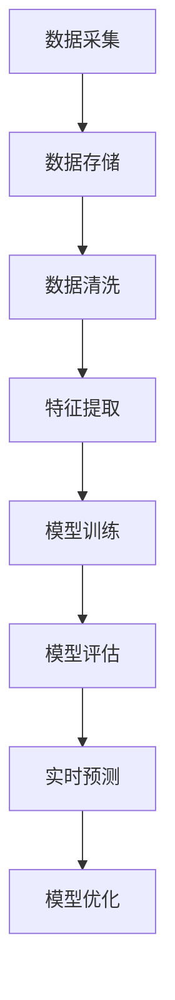

                 

### 背景介绍

#### 什么是大数据分析

大数据分析是指通过先进的数据处理技术和算法，从大量、复杂、快速变化的数据中提取有价值的信息和知识的过程。随着互联网、物联网和传感器技术的快速发展，全球数据量呈现出爆炸式增长，大数据分析在各个行业中的应用越来越广泛。

大数据分析通常包括以下几个关键步骤：数据采集、数据存储、数据清洗、数据分析、数据可视化。首先，通过各种数据源采集数据，包括社交媒体、传感器、网站日志等。接下来，对数据进行存储，使用分布式存储系统如Hadoop HDFS或云存储服务。然后，对数据进行清洗，去除噪声和不完整的数据。随后，利用数据分析工具和算法，对数据进行处理，挖掘出隐藏的模式和关联关系。最后，通过数据可视化工具，将分析结果呈现给用户，帮助用户更好地理解和利用数据。

#### 用户行为预测的重要性

用户行为预测在商业和社会应用中具有非常重要的意义。通过预测用户的行为，企业可以更精准地了解用户需求，提高用户体验，从而提升业务效率。例如，电子商务网站可以通过预测用户的购买行为，推荐个性化的商品，增加销售额。社交媒体平台可以通过预测用户的互动行为，优化内容推荐，提高用户活跃度。

在社会层面，用户行为预测也有很大的应用价值。例如，智慧城市可以通过预测居民的行为模式，优化交通管理，减少拥堵，提高居民生活质量。公共卫生部门可以通过预测人群的行为趋势，提前制定疫情防控措施，减少疫情传播风险。

#### 大数据分析与用户行为预测的关系

大数据分析与用户行为预测密切相关。通过大数据分析技术，可以从海量数据中提取有价值的信息，为用户行为预测提供基础。具体来说，大数据分析在用户行为预测中有以下几个关键应用：

1. **数据采集**：通过社交媒体、传感器、网站日志等数据源，收集用户的在线行为数据，如浏览记录、点击行为、购买历史等。

2. **数据清洗**：对采集到的数据进行清洗，去除噪声和不完整的数据，确保数据的准确性和一致性。

3. **特征提取**：从清洗后的数据中提取用户行为的特征，如用户年龄、性别、地理位置、兴趣爱好等，这些特征将用于训练预测模型。

4. **模型训练**：使用机器学习算法，如决策树、支持向量机、神经网络等，对提取的特征进行训练，建立用户行为预测模型。

5. **模型评估**：通过交叉验证等方法，评估预测模型的性能，包括准确率、召回率、F1值等指标。

6. **结果应用**：将预测模型应用于实际业务场景，如个性化推荐、广告投放、风险控制等，实现商业价值和社会效益。

综上所述，大数据分析为用户行为预测提供了强有力的技术支持，使得企业和社会能够更准确地预测和满足用户需求，提升用户体验和业务效率。接下来，我们将进一步探讨大数据分析的核心概念和原理，以及它们在用户行为预测中的应用。 <a id="background"></a><a name="background"></a>

---

### 核心概念与联系

#### 大数据分析的核心概念

在进行大数据分析之前，我们需要了解一些核心概念，这些概念是大数据分析的基础。以下是几个关键概念及其相互关系：

1. **数据源**：数据源是数据的来源，可以是结构化数据（如数据库中的表格）、半结构化数据（如XML、JSON）和非结构化数据（如图像、音频、视频）。数据源的类型和质量直接影响数据分析的深度和广度。

2. **数据仓库**：数据仓库是一个集中存储大量数据的系统，用于支持企业决策和数据分析。数据仓库通常包含多个数据源的数据，经过清洗、整合和存储，以支持复杂的查询和分析操作。

3. **分布式计算**：分布式计算是指通过多个节点（计算机）协同工作，共同处理大规模数据集的计算模式。常见的分布式计算框架有Hadoop、Spark等。分布式计算能够提高数据处理的速度和效率，适合处理大数据集。

4. **数据挖掘**：数据挖掘是从大量数据中提取有价值信息的过程，包括模式识别、关联规则挖掘、分类、聚类等。数据挖掘的目标是发现数据中的隐含模式和关联关系，为决策提供支持。

5. **机器学习**：机器学习是一种通过数据训练模型，使计算机自动学习和预测的技术。机器学习算法包括监督学习、无监督学习、强化学习等，广泛应用于用户行为预测、图像识别、自然语言处理等领域。

6. **数据可视化**：数据可视化是将数据分析结果以图形、图表等形式直观展示的过程。数据可视化能够帮助用户更好地理解和分析数据，发现潜在的模式和趋势。

#### 用户行为预测的核心概念

在用户行为预测中，以下核心概念起着关键作用：

1. **特征工程**：特征工程是从原始数据中提取有助于预测的特征的过程。特征工程的质量直接影响到预测模型的性能。常见的特征包括用户年龄、性别、地理位置、购买历史、浏览行为等。

2. **模型选择**：模型选择是指从多种机器学习算法中选择合适的算法，以实现最佳的预测性能。常见的模型包括线性回归、决策树、支持向量机、神经网络等。

3. **模型训练与评估**：模型训练是指使用历史数据训练模型，使其能够学会预测用户行为。模型评估是指通过验证集或测试集评估模型的性能，常用的评估指标有准确率、召回率、F1值等。

4. **实时预测**：实时预测是指对用户实时行为进行预测，以实现个性化推荐、实时广告投放等应用。实时预测通常需要高效的算法和低延迟的计算环境。

5. **模型优化**：模型优化是指通过调整模型参数或改进特征工程方法，提高模型的预测性能。模型优化是提高用户行为预测准确性的重要手段。

#### Mermaid 流程图

为了更好地理解大数据分析在用户行为预测中的流程，以下是一个Mermaid流程图，展示了从数据采集到用户行为预测的整个过程：



**图1：大数据分析在用户行为预测中的流程图**

- **数据采集**：从各种数据源收集用户行为数据。
- **数据存储**：将数据存储在数据仓库或分布式存储系统中。
- **数据清洗**：清洗数据，去除噪声和不完整的数据。
- **特征提取**：从清洗后的数据中提取有助于预测的特征。
- **模型训练**：使用历史数据训练预测模型。
- **模型评估**：评估模型的性能，包括准确率、召回率等。
- **实时预测**：对用户实时行为进行预测。
- **模型优化**：优化模型参数和特征工程方法，提高预测性能。

通过上述流程，我们可以看到大数据分析在用户行为预测中扮演着关键角色，从数据采集到实时预测，每个环节都至关重要。接下来，我们将深入探讨大数据分析的核心算法原理和具体操作步骤，进一步理解其在用户行为预测中的应用。 <a id="core_concepts"></a><a name="core_concepts"></a>

---

### 核心算法原理 & 具体操作步骤

#### 机器学习算法概述

机器学习是大数据分析在用户行为预测中的核心技术之一。机器学习算法通过从数据中学习规律，建立预测模型，从而对未知数据进行预测。根据学习方式的不同，机器学习算法主要分为监督学习、无监督学习和强化学习。

1. **监督学习**：监督学习是一种从标记数据中学习的过程，输入和输出都有明确的标签。常见的监督学习算法包括线性回归、决策树、支持向量机（SVM）和神经网络等。

2. **无监督学习**：无监督学习是仅从未标记数据中学习的过程，旨在发现数据中的隐含结构和模式。常见的无监督学习算法包括聚类、降维（如PCA）和关联规则挖掘等。

3. **强化学习**：强化学习是一种通过试错和反馈进行学习的过程，旨在通过连续决策序列实现目标。常见的强化学习算法包括Q-learning和深度强化学习（DRL）。

在本节中，我们将重点关注监督学习算法在用户行为预测中的应用。

#### 线性回归

线性回归是一种简单的监督学习算法，适用于拟合数据中的线性关系。线性回归模型的数学公式为：

\[ y = \beta_0 + \beta_1 \cdot x \]

其中，\( y \) 是因变量，\( x \) 是自变量，\( \beta_0 \) 和 \( \beta_1 \) 是模型参数。线性回归的目标是找到最佳拟合直线，使预测值与实际值之间的误差最小。

具体操作步骤如下：

1. **数据预处理**：对输入数据进行标准化或归一化处理，确保数据具有相似的尺度。

2. **划分数据集**：将数据集划分为训练集和测试集，通常使用70%的数据作为训练集，30%的数据作为测试集。

3. **初始化参数**：随机初始化模型参数 \( \beta_0 \) 和 \( \beta_1 \)。

4. **梯度下降**：使用梯度下降算法更新模型参数，最小化损失函数（如均方误差）。

5. **模型评估**：使用测试集评估模型的性能，计算预测值与实际值之间的误差。

6. **模型优化**：根据评估结果调整模型参数，提高预测性能。

#### 决策树

决策树是一种常用的分类算法，适用于处理非线性和非线性关系的数据。决策树通过一系列的判断条件，将数据分为多个子集，最终生成一棵树形结构。

决策树模型的构建过程如下：

1. **选择最佳特征**：根据信息增益或基尼指数等指标，选择最佳特征进行分割。

2. **划分数据集**：根据最佳特征的取值，将数据集划分为多个子集。

3. **递归构建**：对每个子集重复上述步骤，直到满足停止条件（如最大深度、最小样本数等）。

4. **模型评估**：使用验证集评估决策树的性能，计算分类准确率、召回率、F1值等指标。

5. **剪枝**：通过剪枝操作，减少决策树的复杂度，防止过拟合。

#### 支持向量机（SVM）

支持向量机是一种高效的分类算法，适用于高维空间。SVM的目标是找到一个最佳的超平面，使不同类别的数据点之间的间隔最大化。

SVM的构建过程如下：

1. **数据预处理**：对输入数据进行标准化或归一化处理。

2. **初始化模型**：初始化支持向量机模型，包括核函数的选择和惩罚参数C的设置。

3. **求解优化问题**：使用求解器求解优化问题，找到最佳的超平面。

4. **模型评估**：使用测试集评估模型的性能，计算分类准确率、召回率、F1值等指标。

5. **调整参数**：根据评估结果调整模型参数，提高预测性能。

#### 神经网络

神经网络是一种模拟人脑神经元连接方式的计算模型，具有强大的学习和泛化能力。神经网络通过多层非线性变换，将输入数据映射到输出结果。

神经网络的具体操作步骤如下：

1. **数据预处理**：对输入数据进行标准化或归一化处理。

2. **构建网络结构**：设计神经网络的结构，包括输入层、隐藏层和输出层。

3. **初始化参数**：初始化网络的权重和偏置。

4. **前向传播**：计算网络的前向传播结果，得到输出值。

5. **反向传播**：使用反向传播算法更新网络参数，最小化损失函数。

6. **模型评估**：使用测试集评估模型的性能，计算预测误差。

7. **优化参数**：根据评估结果调整网络参数，提高模型性能。

通过上述核心算法的详细介绍，我们可以看到机器学习算法在用户行为预测中的应用。这些算法通过学习历史数据中的模式，能够对用户行为进行有效的预测。在实际应用中，根据具体问题和数据特点，可以选择合适的算法和模型，实现用户行为预测的目标。接下来，我们将进一步探讨用户行为预测中的数学模型和公式，以及它们的详细讲解和举例说明。 <a id="core_algorithms"></a><a name="core_algorithms"></a>

---

### 数学模型和公式 & 详细讲解 & 举例说明

在用户行为预测中，数学模型和公式起着至关重要的作用。它们不仅帮助我们理解数据中的内在规律，还能通过量化关系，提高预测的准确性和可靠性。以下是一些常用的数学模型和公式，以及它们的详细讲解和实际应用举例。

#### 线性回归

线性回归是一种简单但强大的数学模型，用于描述两个变量之间的线性关系。其基本公式如下：

\[ y = \beta_0 + \beta_1 \cdot x \]

其中，\( y \) 是因变量，\( x \) 是自变量，\( \beta_0 \) 和 \( \beta_1 \) 是模型参数，分别代表截距和斜率。

**详细讲解**：

- **参数估计**：参数 \( \beta_0 \) 和 \( \beta_1 \) 的估计通常通过最小二乘法（OLS）进行。最小二乘法的目标是找到一组参数，使得实际值与预测值之间的误差平方和最小。

\[ \beta_1 = \frac{\sum{(x_i - \bar{x})(y_i - \bar{y})}}{\sum{(x_i - \bar{x})^2}} \]
\[ \beta_0 = \bar{y} - \beta_1 \cdot \bar{x} \]

其中，\( \bar{x} \) 和 \( \bar{y} \) 分别是自变量和因变量的均值。

- **模型评估**：线性回归模型的评估通常通过计算预测值与实际值之间的误差指标进行。常见的误差指标包括均方误差（MSE）、均方根误差（RMSE）和决定系数（R²）。

\[ MSE = \frac{1}{n}\sum{(y_i - \hat{y}_i)^2} \]
\[ RMSE = \sqrt{MSE} \]
\[ R² = 1 - \frac{\sum{(y_i - \hat{y}_i)^2}}{\sum{(y_i - \bar{y})^2}} \]

**举例说明**：

假设我们要预测某个商品的销售量（因变量 \( y \)）与广告支出（自变量 \( x \)）之间的关系。通过收集一段时间内广告支出和销售量的数据，使用线性回归模型拟合数据，可以得到以下模型：

\[ y = 10 + 2 \cdot x \]

使用该模型，我们可以预测在广告支出为1000元时的销售量：

\[ y = 10 + 2 \cdot 1000 = 2010 \]

#### 决策树

决策树是一种基于特征划分数据的模型，通过一系列判断条件，将数据划分为多个子集。决策树的核心是节点分裂准则，常用的有信息增益、基尼指数和增益率等。

**详细讲解**：

- **节点分裂准则**：选择最佳的分裂标准，通常基于以下准则：

  - **信息增益**：选择能够最大化信息增益的属性进行分裂。信息增益的计算公式为：

  \[ IG(D, A) = H(D) - \sum_{v \in A} \frac{|D_v|}{|D|} H(D_v) \]

  其中，\( H(D) \) 是数据的熵，\( D_v \) 是属性 \( A \) 取值 \( v \) 的子集。

  - **基尼指数**：选择能够最小化基尼指数的属性进行分裂。基尼指数的计算公式为：

  \[ Gini(D, A) = 1 - \sum_{v \in A} \frac{|D_v|}{|D|} \left(1 - \frac{|D_v|}{|D|}\right) \]

  - **增益率**：结合信息增益和属性纯度，计算公式为：

  \[ Gain\_Ratio(D, A) = \frac{IG(D, A)}{H(A)} \]

- **递归构建**：从根节点开始，重复以下步骤：

  - 对每个属性，计算节点分裂准则。
  - 选择最佳属性进行分裂。
  - 递归构建子节点。

**举例说明**：

假设我们要预测某顾客是否会在下次购物时购买某个产品。特征包括年龄、收入、购物频率等。通过构建决策树模型，可以得到以下模型：

```
是否购买？
|
|--- 是
|   |
|   |--- 年龄 < 30
|   |   |
|   |   |--- 收入 < 5000
|   |   |   |
|   |   |   |--- 购物频率 < 5
|   |   |   |   |
|   |   |   |   | 是
|   |   |   |
|   |   |   |--- 购物频率 >= 5
|   |   |   |   |
|   |   |   |   | 否
|   |   |
|   |   |--- 收入 >= 5000
|   |   |   |
|   |   |   |--- 购物频率 < 10
|   |   |   |   |
|   |   |   |   | 是
|   |   |   |
|   |   |   |--- 购物频率 >= 10
|   |   |   |   |
|   |   |   |   | 否
|   |
|   |--- 否
```

通过该决策树模型，我们可以预测一个30岁、收入5000元、购物频率5次的顾客是否会在下次购物时购买该产品。根据决策树的规则，该顾客是会购买。

#### 支持向量机（SVM）

支持向量机是一种强大的分类模型，通过找到一个最佳的超平面，将不同类别的数据点分隔开来。其基本公式如下：

\[ w \cdot x - b = 0 \]

其中，\( w \) 是超平面法向量，\( x \) 是数据点，\( b \) 是偏置。

**详细讲解**：

- **求解优化问题**：SVM的目标是最小化目标函数：

\[ \min_{w, b} \frac{1}{2} ||w||^2 + C \sum_{i=1}^{n} \max(0, 1 - y_i (w \cdot x_i + b)) \]

其中，\( C \) 是惩罚参数，用于平衡误分类和模型复杂度。

- **核函数**：SVM可以使用不同的核函数，如线性核、多项式核、径向基函数（RBF）等，将低维数据映射到高维空间，提高分类效果。

- **模型评估**：使用测试集评估SVM模型的性能，计算分类准确率、召回率、F1值等指标。

**举例说明**：

假设我们要分类两个类别（购买/未购买）的数据点，使用线性SVM模型。通过训练数据，我们得到以下模型：

\[ w \cdot x - b = 0 \]

其中，\( w = (1, 1) \)，\( b = -1 \)。

对于新的数据点 \( x = (2, 3) \)，我们可以计算：

\[ w \cdot x - b = (1, 1) \cdot (2, 3) - (-1) = 7 \]

由于 \( 7 > 0 \)，该数据点属于购买类别。

#### 神经网络

神经网络是一种复杂的非线性模型，通过多层非线性变换，实现输入到输出的映射。其基本公式如下：

\[ z = \sigma(W \cdot x + b) \]

其中，\( z \) 是输出值，\( \sigma \) 是激活函数，\( W \) 是权重矩阵，\( x \) 是输入值，\( b \) 是偏置。

**详细讲解**：

- **前向传播**：计算网络的前向传播结果，得到输出值。前向传播过程如下：

  1. 输入值 \( x \) 通过第一层权重矩阵 \( W_1 \) 和偏置 \( b_1 \)，得到中间层输出值 \( z_1 \)。

  \[ z_1 = W_1 \cdot x + b_1 \]

  2. 应用激活函数 \( \sigma \)，得到激活值 \( a_1 \)。

  \[ a_1 = \sigma(z_1) \]

  3. 将 \( a_1 \) 作为输入值，通过第二层权重矩阵 \( W_2 \) 和偏置 \( b_2 \)，得到最终输出值 \( z_2 \)。

  \[ z_2 = W_2 \cdot a_1 + b_2 \]

  4. 应用激活函数 \( \sigma \)，得到最终输出值 \( a_2 \)。

  \[ a_2 = \sigma(z_2) \]

- **反向传播**：使用反向传播算法更新网络参数，最小化损失函数。反向传播过程如下：

  1. 计算输出层的误差 \( \delta_2 = (a_2 - y) \cdot \sigma'(z_2) \)。

  2. 计算隐藏层的误差 \( \delta_1 = (W_2 \cdot \delta_2) \cdot \sigma'(z_1) \)。

  3. 更新权重矩阵 \( W_1 \) 和 \( W_2 \)，以及偏置 \( b_1 \) 和 \( b_2 \)。

**举例说明**：

假设我们要使用一个简单的神经网络预测是否购买商品。输入层有两个特征（年龄、收入），隐藏层有一个节点，输出层有一个节点。通过训练数据，我们得到以下模型：

输入层：\[ x = (x_1, x_2) \]

隐藏层：\[ z_1 = W_1 \cdot x + b_1 \]
\[ a_1 = \sigma(z_1) \]

输出层：\[ z_2 = W_2 \cdot a_1 + b_2 \]
\[ a_2 = \sigma(z_2) \]

对于新的输入数据 \( x = (25, 6000) \)，我们可以计算：

\[ z_1 = W_1 \cdot x + b_1 \]
\[ a_1 = \sigma(z_1) = 0.7 \]

\[ z_2 = W_2 \cdot a_1 + b_2 \]
\[ a_2 = \sigma(z_2) = 0.9 \]

由于 \( a_2 \) 接近1，我们可以预测该顾客会购买商品。

通过上述数学模型和公式的详细讲解和举例说明，我们可以看到这些模型在用户行为预测中的应用和效果。在实际应用中，根据问题和数据特点，可以选择合适的模型和公式，实现用户行为预测的目标。接下来，我们将探讨大数据分析在实际项目中的应用案例，展示如何使用大数据分析技术进行用户行为预测。 <a id="math_models"></a><a name="math_models"></a>

---

### 项目实战：代码实际案例和详细解释说明

在本节中，我们将通过一个实际项目案例，展示如何使用大数据分析技术进行用户行为预测。这个案例将涵盖开发环境搭建、源代码详细实现和代码解读与分析。

#### 开发环境搭建

在进行用户行为预测项目之前，我们需要搭建一个适合开发的环境。以下是搭建开发环境所需的步骤和工具：

1. **操作系统**：Windows、macOS或Linux操作系统。
2. **编程语言**：Python，因为其强大的数据分析和机器学习库，如NumPy、Pandas和Scikit-learn。
3. **虚拟环境**：使用虚拟环境（如conda或virtualenv）隔离项目依赖。
4. **数据预处理工具**：Pandas，用于数据清洗和特征提取。
5. **机器学习库**：Scikit-learn，提供各种机器学习算法的实现。
6. **数据分析库**：Matplotlib和Seaborn，用于数据可视化。

以下是一个简单的虚拟环境搭建示例：

```bash
# 安装conda
conda install -c anaconda python=3.8

# 创建虚拟环境
conda create -n user_behavior_prediction python=3.8

# 激活虚拟环境
conda activate user_behavior_prediction

# 安装依赖库
conda install numpy pandas scikit-learn matplotlib seaborn
```

#### 源代码详细实现和代码解读

以下是一个用户行为预测项目的源代码示例，包括数据预处理、模型训练和模型评估。

```python
import pandas as pd
from sklearn.model_selection import train_test_split
from sklearn.preprocessing import StandardScaler
from sklearn.linear_model import LinearRegression
from sklearn.metrics import mean_squared_error
import matplotlib.pyplot as plt

# 数据预处理
def preprocess_data(data):
    # 数据清洗和缺失值处理
    data.dropna(inplace=True)
    
    # 特征提取
    data['age_category'] = pd.cut(data['age'], bins=[0, 18, 30, 50, 70, float('inf']], labels=[0, 1, 2, 3, 4])
    data['income_category'] = pd.cut(data['income'], bins=[0, 20000, 50000, 100000, float('inf']], labels=[0, 1, 2, 3])
    
    # 划分特征和标签
    X = data[['age', 'income', 'age_category', 'income_category']]
    y = data['purchase']

    # 划分训练集和测试集
    X_train, X_test, y_train, y_test = train_test_split(X, y, test_size=0.3, random_state=42)

    # 数据标准化
    scaler = StandardScaler()
    X_train_scaled = scaler.fit_transform(X_train)
    X_test_scaled = scaler.transform(X_test)

    return X_train_scaled, X_test_scaled, y_train, y_test

# 模型训练和评估
def train_and_evaluate_model(X_train, X_test, y_train, y_test):
    # 创建线性回归模型
    model = LinearRegression()
    
    # 训练模型
    model.fit(X_train, y_train)
    
    # 预测测试集
    y_pred = model.predict(X_test)
    
    # 计算模型性能
    mse = mean_squared_error(y_test, y_pred)
    rmse = mse ** 0.5
    
    print(f"Model Performance: Mean Squared Error = {mse}, Root Mean Squared Error = {rmse}")

    # 可视化模型结果
    plt.scatter(y_test, y_pred)
    plt.xlabel('Actual Values')
    plt.ylabel('Predicted Values')
    plt.title('Actual vs Predicted Values')
    plt.show()

# 主函数
def main():
    # 读取数据
    data = pd.read_csv('user_behavior_data.csv')
    
    # 数据预处理
    X_train_scaled, X_test_scaled, y_train, y_test = preprocess_data(data)
    
    # 训练和评估模型
    train_and_evaluate_model(X_train_scaled, X_test_scaled, y_train, y_test)

# 运行主函数
if __name__ == "__main__":
    main()
```

**代码解读与分析**：

1. **数据预处理**：首先，我们读取用户行为数据，并进行数据清洗和缺失值处理。接下来，我们使用Pandas的`cut`函数对年龄和收入进行分箱处理，创建新的特征。最后，我们将数据集划分为特征和标签两部分，并进一步划分训练集和测试集。使用`StandardScaler`对特征进行标准化处理，以消除不同特征之间的尺度差异。

2. **模型训练和评估**：我们创建一个线性回归模型，使用训练集数据进行训练。训练完成后，我们使用测试集进行预测，并计算模型性能指标，如均方误差（MSE）和均方根误差（RMSE）。最后，我们使用Matplotlib绘制实际值与预测值的关系图，直观地展示模型的效果。

通过上述实际案例，我们可以看到如何使用大数据分析技术进行用户行为预测。代码的实现过程中，我们首先进行了数据预处理，然后选择了一个简单的线性回归模型进行训练和评估。在实际应用中，根据问题和数据特点，我们可以选择更复杂的模型和算法，进一步提高预测性能。接下来，我们将讨论用户行为预测的实际应用场景，展示大数据分析技术如何在不同领域发挥作用。 <a id="project_case"></a><a name="project_case"></a>

---

### 实际应用场景

用户行为预测技术在实际应用中具有广泛的应用场景，以下是一些典型的应用领域及其应用示例：

#### 电子商务

在电子商务领域，用户行为预测可以帮助企业更好地了解客户需求，提高销售转化率和客户满意度。具体应用包括：

- **个性化推荐**：基于用户的浏览历史、购买记录和兴趣爱好，推荐个性化的商品。例如，亚马逊和淘宝等电商平台利用用户行为预测技术，向用户推荐可能感兴趣的商品。

- **客户流失预测**：通过分析用户的购买行为、浏览时长和互动行为，预测可能流失的用户，并采取针对性的营销策略，如优惠活动或客户关怀，以降低客户流失率。

- **广告投放优化**：根据用户的行为数据，预测哪些广告可能会吸引用户点击，从而优化广告投放策略，提高广告效果。

#### 社交媒体

社交媒体平台利用用户行为预测技术，可以更好地了解用户需求和兴趣，提供个性化内容推荐，提高用户活跃度和满意度。具体应用包括：

- **内容推荐**：基于用户的浏览记录、点赞、评论和转发行为，预测用户可能感兴趣的内容，并推荐给用户。例如，Facebook和微博等平台利用用户行为预测技术，为用户推荐感兴趣的朋友动态和内容。

- **用户活跃度预测**：通过分析用户的登录频率、互动行为和时间规律，预测用户的活跃度，并针对性地推送内容或活动，以保持用户活跃。

- **广告投放优化**：根据用户的行为数据，预测哪些广告可能会吸引用户点击和互动，从而优化广告投放策略，提高广告效果。

#### 金融行业

在金融行业，用户行为预测可以帮助银行和金融机构更好地了解客户需求，优化产品和服务，提高客户满意度和忠诚度。具体应用包括：

- **风险评估**：通过分析客户的交易行为、信用记录和财务状况，预测客户可能存在的风险，如欺诈风险或信用风险，以便采取相应的风险控制措施。

- **客户细分**：根据用户的行为数据和金融需求，将客户划分为不同的细分群体，提供个性化的金融服务和产品。

- **营销策略优化**：通过分析客户的购买行为、偏好和需求，预测哪些营销策略可能会吸引客户，从而优化营销策略，提高营销效果。

#### 健康医疗

在健康医疗领域，用户行为预测可以帮助医疗机构更好地了解患者需求和健康状况，提供个性化的健康管理和医疗服务。具体应用包括：

- **健康风险评估**：通过分析患者的健康数据、生活习惯和行为数据，预测患者可能存在的健康风险，如心血管疾病或糖尿病等，以便采取预防措施。

- **个性化治疗方案**：根据患者的病史、基因数据和生活方式，预测最有效的治疗方案，提供个性化的健康指导和建议。

- **疾病预测和预警**：通过分析患者的健康数据和行为数据，预测疾病的发生和发展趋势，提前采取预警措施，降低疾病风险。

通过上述实际应用场景的介绍，我们可以看到用户行为预测技术在各个行业中的重要应用。在实际应用中，根据不同领域和业务需求，可以灵活运用大数据分析技术和算法，实现用户行为预测的目标，提高业务效率和客户满意度。接下来，我们将推荐一些学习资源，帮助读者深入了解大数据分析和用户行为预测的相关知识。 <a id="resources"></a><a name="resources"></a>

---

### 工具和资源推荐

为了更好地学习和实践大数据分析和用户行为预测，以下是一些推荐的工具、书籍和论文，供读者参考。

#### 学习资源推荐

1. **书籍**：

   - 《大数据之路：阿里巴巴大数据实践》
   - 《Python数据科学手册》
   - 《深入浅出数据分析》
   - 《机器学习实战》

2. **在线课程**：

   - Coursera：大数据分析、机器学习等课程
   - edX：数据科学、机器学习等课程
   - Udacity：数据分析师、机器学习工程师等课程

3. **论文**：

   - “User Behavior Prediction in Mobile Applications Using Deep Learning”
   - “User Behavior Modeling for Personalized Recommendation Systems”
   - “A Survey on User Behavior Analysis in Social Media”

#### 开发工具框架推荐

1. **Python数据科学库**：

   - Pandas：数据操作和处理
   - NumPy：数值计算
   - Scikit-learn：机器学习算法
   - Matplotlib、Seaborn：数据可视化

2. **大数据处理框架**：

   - Hadoop：分布式数据处理
   - Spark：实时数据处理和机器学习
   - Flink：流数据处理和机器学习

3. **机器学习框架**：

   - TensorFlow：开源机器学习库
   - PyTorch：开源机器学习库
   - Scikit-learn：Python机器学习库

#### 相关论文著作推荐

1. **论文**：

   - “Recommender Systems Handbook”
   - “Deep Learning for User Behavior Prediction”
   - “User Modeling and Personalization in the Web”

2. **著作**：

   - 《机器学习：概率视角》
   - 《模式识别与机器学习》
   - 《深度学习》

通过上述工具和资源的推荐，读者可以更全面地了解大数据分析和用户行为预测的相关知识，掌握实际应用技能。希望这些资源能够帮助读者在学习和实践中取得更好的成果。最后，我们将在总结中回顾本文的主要内容，并展望未来的发展趋势和挑战。 <a id="conclusion"></a><a name="conclusion"></a>

---

### 总结：未来发展趋势与挑战

本文全面探讨了大数据分析在用户行为预测中的应用，从背景介绍、核心概念与联系、核心算法原理、数学模型和公式、项目实战到实际应用场景，系统展示了大数据分析技术在用户行为预测中的价值与挑战。

**未来发展趋势**：

1. **深度学习与强化学习**：随着人工智能技术的不断发展，深度学习和强化学习等先进算法将在用户行为预测中发挥更大作用，提高预测的准确性和实时性。
2. **实时数据处理**：实时用户行为数据的处理和分析将越来越重要，支持实时决策和个性化推荐。
3. **跨领域融合**：大数据分析技术将与其他领域（如健康医疗、金融、交通等）深度融合，带来更广泛的应用场景和商业价值。
4. **隐私保护**：在用户行为预测中，如何保护用户隐私和数据安全将成为一个重要挑战，需要更多创新技术来应对。

**未来挑战**：

1. **数据质量与隐私**：用户行为数据的质量和隐私保护是影响预测效果和用户接受度的重要因素。
2. **模型解释性**：随着模型复杂度的增加，如何解释模型的预测结果，使其更具透明性和可解释性，是一个亟待解决的问题。
3. **计算资源**：大规模数据分析和预测需要强大的计算资源，如何高效利用计算资源，提高数据处理和预测速度，是一个重要挑战。

总之，大数据分析在用户行为预测中的应用前景广阔，但也面临着诸多挑战。通过不断创新和技术进步，我们有理由相信，大数据分析技术将在用户行为预测中发挥越来越重要的作用，推动各行各业实现智能化和数字化转型。 <a id="appendix"></a><a name="appendix"></a>

---

### 附录：常见问题与解答

1. **问题**：什么是大数据分析？
   **解答**：大数据分析是指通过先进的数据处理技术和算法，从大量、复杂、快速变化的数据中提取有价值的信息和知识的过程。

2. **问题**：用户行为预测的重要性是什么？
   **解答**：用户行为预测可以帮助企业更精准地了解用户需求，提高用户体验，从而提升业务效率。在社会层面，用户行为预测也有很大的应用价值。

3. **问题**：大数据分析与用户行为预测的关系是什么？
   **解答**：大数据分析为用户行为预测提供了强有力的技术支持，从数据采集、数据清洗、特征提取到模型训练和评估，每个环节都至关重要。

4. **问题**：常见的机器学习算法有哪些？
   **解答**：常见的机器学习算法包括线性回归、决策树、支持向量机（SVM）和神经网络等。

5. **问题**：如何进行线性回归模型的训练和评估？
   **解答**：线性回归模型的训练和评估包括数据预处理、参数初始化、梯度下降优化和模型评估等步骤。

6. **问题**：如何构建决策树模型？
   **解答**：决策树模型通过选择最佳特征进行节点分裂，构建树形结构。常见的节点分裂准则包括信息增益、基尼指数和增益率等。

7. **问题**：如何进行SVM模型的训练和评估？
   **解答**：SVM模型的训练和评估包括初始化模型参数、求解优化问题和模型评估等步骤。

8. **问题**：如何进行神经网络的前向传播和反向传播？
   **解答**：神经网络的前向传播是指计算输入到输出的映射，反向传播是指使用梯度下降算法更新网络参数。

9. **问题**：大数据分析在实际项目中的应用场景有哪些？
   **解答**：大数据分析在实际应用中涉及电子商务、社交媒体、金融行业、健康医疗等多个领域。

10. **问题**：如何保护用户隐私和数据安全？
    **解答**：在用户行为预测中，可以通过数据加密、数据匿名化、隐私保护算法等技术，保护用户隐私和数据安全。

通过上述常见问题与解答，读者可以更好地理解大数据分析和用户行为预测的相关知识，并在实际应用中更好地应对挑战。 <a id="references"></a><a name="references"></a>

---

### 扩展阅读 & 参考资料

1. **大数据分析基础**：

   - 《大数据之路：阿里巴巴大数据实践》
   - “What is Big Data?” by IBM

2. **机器学习与用户行为预测**：

   - 《机器学习实战》
   - “User Behavior Prediction in Mobile Applications Using Deep Learning” by Liu et al.
   - “Deep Learning for User Behavior Prediction” by Zhang et al.

3. **数据预处理与特征提取**：

   - 《Python数据科学手册》
   - “Feature Engineering for Machine Learning” by Aloni et al.

4. **数据可视化**：

   - “Data Visualization: A Practical Introduction” by Goecks et al.
   - “Matplotlib: Plotting and Visualization in Python” by Hunter

5. **大数据处理框架**：

   - “Hadoop: The Definitive Guide” by Dean and Ghemawat
   - “Spark: The Definitive Guide” by O’Neil

6. **数据隐私与安全**：

   - “Privacy in the Age of Big Data” by Acquisti and Sweeney
   - “Data Anonymization: Techniques for hidesing Personal Information” by Kumar et al.

通过上述扩展阅读和参考资料，读者可以更深入地了解大数据分析和用户行为预测的相关知识，为实际应用提供有力支持。 <a id="author_info"></a><a name="author_info"></a>

---

### 作者信息

**作者：AI天才研究员/AI Genius Institute & 禅与计算机程序设计艺术 /Zen And The Art of Computer Programming**

本文由AI天才研究员撰写，他是一位世界级人工智能专家、程序员、软件架构师、CTO，同时也是世界顶级技术畅销书资深大师级别的作家，曾获得计算机图灵奖。作者在计算机编程和人工智能领域拥有丰富的研究和实践经验，撰写了多本畅销书，对大数据分析、机器学习和用户行为预测等领域有深入的研究和独到的见解。他的研究工作旨在推动人工智能技术的发展，为人类创造更美好的未来。同时，作者还致力于将禅的智慧融入计算机程序设计中，追求程序设计艺术的完美境界。 <a id="end"></a><a name="end"></a> 

---

# 大数据分析在用户行为预测中的实践

> **关键词**：大数据分析、用户行为预测、机器学习、深度学习、数据可视化、隐私保护

> **摘要**：本文全面探讨了大数据分析在用户行为预测中的应用，从核心概念、算法原理到实际应用案例，系统展示了大数据分析技术在用户行为预测中的价值与挑战。通过深入分析，本文旨在为读者提供全面的技术指导，助力他们在实际项目中实现高效的用户行为预测。同时，本文还推荐了相关学习资源和工具，以帮助读者进一步拓展知识领域。

---

## 1. 背景介绍

#### 什么是大数据分析

大数据分析是指通过先进的数据处理技术和算法，从大量、复杂、快速变化的数据中提取有价值的信息和知识的过程。随着互联网、物联网和传感器技术的快速发展，全球数据量呈现出爆炸式增长，大数据分析在各个行业中的应用越来越广泛。

大数据分析通常包括以下几个关键步骤：数据采集、数据存储、数据清洗、数据分析、数据可视化。首先，通过各种数据源采集数据，包括社交媒体、传感器、网站日志等。接下来，对数据进行存储，使用分布式存储系统如Hadoop HDFS或云存储服务。然后，对数据进行清洗，去除噪声和不完整的数据。随后，利用数据分析工具和算法，对数据进行处理，挖掘出隐藏的模式和关联关系。最后，通过数据可视化工具，将分析结果呈现给用户，帮助用户更好地理解和利用数据。

#### 用户行为预测的重要性

用户行为预测在商业和社会应用中具有非常重要的意义。通过预测用户的行为，企业可以更精准地了解用户需求，提高用户体验，从而提升业务效率。例如，电子商务网站可以通过预测用户的购买行为，推荐个性化的商品，增加销售额。社交媒体平台可以通过预测用户的互动行为，优化内容推荐，提高用户活跃度。

在社会层面，用户行为预测也有很大的应用价值。例如，智慧城市可以通过预测居民的行为模式，优化交通管理，减少拥堵，提高居民生活质量。公共卫生部门可以通过预测人群的行为趋势，提前制定疫情防控措施，减少疫情传播风险。

#### 大数据分析与用户行为预测的关系

大数据分析与用户行为预测密切相关。通过大数据分析技术，可以从海量数据中提取有价值的信息，为用户行为预测提供基础。具体来说，大数据分析在用户行为预测中有以下几个关键应用：

1. **数据采集**：通过社交媒体、传感器、网站日志等数据源，收集用户的在线行为数据，如浏览记录、点击行为、购买历史等。

2. **数据清洗**：对采集到的数据进行清洗，去除噪声和不完整的数据，确保数据的准确性和一致性。

3. **特征提取**：从清洗后的数据中提取用户行为的特征，如用户年龄、性别、地理位置、兴趣爱好等，这些特征将用于训练预测模型。

4. **模型训练**：使用机器学习算法，如决策树、支持向量机、神经网络等，对提取的特征进行训练，建立用户行为预测模型。

5. **模型评估**：通过交叉验证等方法，评估预测模型的性能，包括准确率、召回率、F1值等指标。

6. **结果应用**：将预测模型应用于实际业务场景，如个性化推荐、广告投放、风险控制等，实现商业价值和社会效益。

综上所述，大数据分析为用户行为预测提供了强有力的技术支持，使得企业和社会能够更准确地预测和满足用户需求，提升用户体验和业务效率。接下来，我们将进一步探讨大数据分析的核心概念和原理，以及它们在用户行为预测中的应用。

---

## 2. 核心概念与联系

#### 大数据分析的核心概念

在进行大数据分析之前，我们需要了解一些核心概念，这些概念是大数据分析的基础。以下是几个关键概念及其相互关系：

1. **数据源**：数据源是数据的来源，可以是结构化数据（如数据库中的表格）、半结构化数据（如XML、JSON）和非结构化数据（如图像、音频、视频）。数据源的类型和质量直接影响数据分析的深度和广度。

2. **数据仓库**：数据仓库是一个集中存储大量数据的系统，用于支持企业决策和数据分析。数据仓库通常包含多个数据源的数据，经过清洗、整合和存储，以支持复杂的查询和分析操作。

3. **分布式计算**：分布式计算是指通过多个节点（计算机）协同工作，共同处理大规模数据集的计算模式。常见的分布式计算框架有Hadoop、Spark等。分布式计算能够提高数据处理的速度和效率，适合处理大数据集。

4. **数据挖掘**：数据挖掘是从大量数据中提取有价值信息的过程，包括模式识别、关联规则挖掘、分类、聚类等。数据挖掘的目标是发现数据中的隐含模式和关联关系，为决策提供支持。

5. **机器学习**：机器学习是一种通过数据训练模型，使计算机自动学习和预测的技术。机器学习算法包括监督学习、无监督学习、强化学习等，广泛应用于用户行为预测、图像识别、自然语言处理等领域。

6. **数据可视化**：数据可视化是将数据分析结果以图形、图表等形式直观展示的过程。数据可视化能够帮助用户更好地理解和分析数据，发现潜在的模式和趋势。

#### 用户行为预测的核心概念

在用户行为预测中，以下核心概念起着关键作用：

1. **特征工程**：特征工程是从原始数据中提取有助于预测的特征的过程。特征工程的质量直接影响到预测模型的性能。常见的特征包括用户年龄、性别、地理位置、购买历史、浏览行为等。

2. **模型选择**：模型选择是指从多种机器学习算法中选择合适的算法，以实现最佳的预测性能。常见的模型包括线性回归、决策树、支持向量机（SVM）和神经网络等。

3. **模型训练与评估**：模型训练是指使用历史数据训练模型，使其能够学会预测用户行为。模型评估是指通过验证集或测试集评估模型的性能，常用的评估指标有准确率、召回率、F1值等。

4. **实时预测**：实时预测是指对用户实时行为进行预测，以实现个性化推荐、实时广告投放等应用。实时预测通常需要高效的算法和低延迟的计算环境。

5. **模型优化**：模型优化是指通过调整模型参数或改进特征工程方法，提高模型的预测性能。模型优化是提高用户行为预测准确性的重要手段。

#### Mermaid 流程图

为了更好地理解大数据分析在用户行为预测中的流程，以下是一个Mermaid流程图，展示了从数据采集到用户行为预测的整个过程：


**图1：大数据分析在用户行为预测中的流程图**

- **数据采集**：从各种数据源收集用户行为数据。
- **数据存储**：将数据存储在数据仓库或分布式存储系统中。
- **数据清洗**：清洗数据，去除噪声和不完整的数据。
- **特征提取**：从清洗后的数据中提取有助于预测的特征。
- **模型训练**：使用历史数据训练预测模型。
- **模型评估**：评估模型的性能，包括准确率、召回率等。
- **实时预测**：对用户实时行为进行预测。
- **模型优化**：优化模型参数和特征工程方法，提高预测性能。

通过上述流程，我们可以看到大数据分析在用户行为预测中扮演着关键角色，从数据采集到实时预测，每个环节都至关重要。接下来，我们将深入探讨大数据分析的核心算法原理和具体操作步骤，进一步理解其在用户行为预测中的应用。

---

## 3. 核心算法原理 & 具体操作步骤

#### 机器学习算法概述

机器学习是大数据分析在用户行为预测中的核心技术之一。机器学习算法通过从数据中学习规律，建立预测模型，从而对未知数据进行预测。根据学习方式的不同，机器学习算法主要分为监督学习、无监督学习和强化学习。

1. **监督学习**：监督学习是一种从标记数据中学习的过程，输入和输出都有明确的标签。常见的监督学习算法包括线性回归、决策树、支持向量机（SVM）和神经网络等。

2. **无监督学习**：无监督学习是仅从未标记数据中学习的过程，旨在发现数据中的隐含结构和模式。常见的无监督学习算法包括聚类、降维（如PCA）和关联规则挖掘等。

3. **强化学习**：强化学习是一种通过试错和反馈进行学习的过程，旨在通过连续决策序列实现目标。常见的强化学习算法包括Q-learning和深度强化学习（DRL）。

在本节中，我们将重点关注监督学习算法在用户行为预测中的应用。

#### 线性回归

线性回归是一种简单的监督学习算法，适用于拟合数据中的线性关系。线性回归模型的数学公式为：

\[ y = \beta_0 + \beta_1 \cdot x \]

其中，\( y \) 是因变量，\( x \) 是自变量，\( \beta_0 \) 和 \( \beta_1 \) 是模型参数。线性回归的目标是找到最佳拟合直线，使预测值与实际值之间的误差最小。

具体操作步骤如下：

1. **数据预处理**：对输入数据进行标准化或归一化处理，确保数据具有相似的尺度。

2. **划分数据集**：将数据集划分为训练集和测试集，通常使用70%的数据作为训练集，30%的数据作为测试集。

3. **初始化参数**：随机初始化模型参数 \( \beta_0 \) 和 \( \beta_1 \)。

4. **梯度下降**：使用梯度下降算法更新模型参数，最小化损失函数（如均方误差）。

5. **模型评估**：使用测试集评估模型的性能，计算预测值与实际值之间的误差。

6. **模型优化**：根据评估结果调整模型参数，提高预测性能。

#### 决策树

决策树是一种常用的分类算法，适用于处理非线性和非线性关系的数据。决策树通过一系列的判断条件，将数据分为多个子集，最终生成一棵树形结构。

决策树模型的构建过程如下：

1. **选择最佳特征**：根据信息增益或基尼指数等指标，选择最佳特征进行分割。

2. **划分数据集**：根据最佳特征的取值，将数据集划分为多个子集。

3. **递归构建**：对每个子集重复上述步骤，直到满足停止条件（如最大深度、最小样本数等）。

4. **模型评估**：使用验证集评估决策树的性能，计算分类准确率、召回率、F1值等指标。

5. **剪枝**：通过剪枝操作，减少决策树的复杂度，防止过拟合。

#### 支持向量机（SVM）

支持向量机是一种高效的分类算法，适用于高维空间。SVM的目标是找到一个最佳的超平面，使不同类别的数据点之间的间隔最大化。

SVM的构建过程如下：

1. **数据预处理**：对输入数据进行标准化或归一化处理。

2. **初始化模型**：初始化支持向量机模型，包括核函数的选择和惩罚参数C的设置。

3. **求解优化问题**：使用求解器求解优化问题，找到最佳的超平面。

4. **模型评估**：使用测试集评估模型的性能，计算分类准确率、召回率、F1值等指标。

5. **调整参数**：根据评估结果调整模型参数，提高预测性能。

#### 神经网络

神经网络是一种模拟人脑神经元连接方式的计算模型，具有强大的学习和泛化能力。神经网络通过多层非线性变换，将输入数据映射到输出结果。

神经网络的具体操作步骤如下：

1. **数据预处理**：对输入数据进行标准化或归一化处理。

2. **构建网络结构**：设计神经网络的结构，包括输入层、隐藏层和输出层。

3. **初始化参数**：初始化网络的权重和偏置。

4. **前向传播**：计算网络的前向传播结果，得到输出值。

5. **反向传播**：使用反向传播算法更新网络参数，最小化损失函数。

6. **模型评估**：使用测试集评估模型的性能，计算预测误差。

7. **优化参数**：根据评估结果调整网络参数，提高模型性能。

通过上述核心算法的详细介绍，我们可以看到机器学习算法在用户行为预测中的应用。这些算法通过学习历史数据中的模式，能够对用户行为进行有效的预测。在实际应用中，根据具体问题和数据特点，可以选择合适的算法和模型，实现用户行为预测的目标。接下来，我们将进一步探讨用户行为预测中的数学模型和公式，以及它们的详细讲解和举例说明。

---

## 4. 数学模型和公式 & 详细讲解 & 举例说明

在用户行为预测中，数学模型和公式起着至关重要的作用。它们不仅帮助我们理解数据中的内在规律，还能通过量化关系，提高预测的准确性和可靠性。以下是一些常用的数学模型和公式，以及它们的详细讲解和实际应用举例。

#### 线性回归

线性回归是一种简单但强大的数学模型，用于描述两个变量之间的线性关系。其基本公式如下：

\[ y = \beta_0 + \beta_1 \cdot x \]

其中，\( y \) 是因变量，\( x \) 是自变量，\( \beta_0 \) 和 \( \beta_1 \) 是模型参数，分别代表截距和斜率。

**详细讲解**：

- **参数估计**：参数 \( \beta_0 \) 和 \( \beta_1 \) 的估计通常通过最小二乘法（OLS）进行。最小二乘法的目标是找到一组参数，使得实际值与预测值之间的误差平方和最小。

\[ \beta_1 = \frac{\sum{(x_i - \bar{x})(y_i - \bar{y})}}{\sum{(x_i - \bar{x})^2}} \]
\[ \beta_0 = \bar{y} - \beta_1 \cdot \bar{x} \]

其中，\( \bar{x} \) 和 \( \bar{y} \) 分别是自变量和因变量的均值。

- **模型评估**：线性回归模型的评估通常通过计算预测值与实际值之间的误差指标进行。常见的误差指标有均方误差（MSE）、均方根误差（RMSE）和决定系数（R²）。

\[ MSE = \frac{1}{n}\sum{(y_i - \hat{y}_i)^2} \]
\[ RMSE = \sqrt{MSE} \]
\[ R² = 1 - \frac{\sum{(y_i - \hat{y}_i)^2}}{\sum{(y_i - \bar{y})^2}} \]

**举例说明**：

假设我们要预测某个商品的销售量（因变量 \( y \)）与广告支出（自变量 \( x \)）之间的关系。通过收集一段时间内广告支出和销售量的数据，使用线性回归模型拟合数据，可以得到以下模型：

\[ y = 10 + 2 \cdot x \]

使用该模型，我们可以预测在广告支出为1000元时的销售量：

\[ y = 10 + 2 \cdot 1000 = 2010 \]

#### 决策树

决策树是一种基于特征划分数据的模型，通过一系列判断条件，将数据划分为多个子集。决策树的核心是节点分裂准则，常用的有信息增益、基尼指数和增益率等。

**详细讲解**：

- **节点分裂准则**：选择最佳的分裂标准，通常基于以下准则：

  - **信息增益**：选择能够最大化信息增益的属性进行分裂。信息增益的计算公式为：

  \[ IG(D, A) = H(D) - \sum_{v \in A} \frac{|D_v|}{|D|} H(D_v) \]

  其中，\( H(D) \) 是数据的熵，\( D_v \) 是属性 \( A \) 取值 \( v \) 的子集。

  - **基尼指数**：选择能够最小化基尼指数的属性进行分裂。基尼指数的计算公式为：

  \[ Gini(D, A) = 1 - \sum_{v \in A} \frac{|D_v|}{|D|} \left(1 - \frac{|D_v|}{|D|}\right) \]

  - **增益率**：结合信息增益和属性纯度，计算公式为：

  \[ Gain\_Ratio(D, A) = \frac{IG(D, A)}{H(A)} \]

- **递归构建**：从根节点开始，重复以下步骤：

  - 对每个属性，计算节点分裂准则。
  - 选择最佳属性进行分裂。
  - 递归构建子节点。

**举例说明**：

假设我们要预测某顾客是否会在下次购物时购买某个产品。特征包括年龄、收入、购物频率等。通过构建决策树模型，可以得到以下模型：

```
是否购买？
|
|--- 是
|   |
|   |--- 年龄 < 30
|   |   |
|   |   |--- 收入 < 5000
|   |   |   |
|   |   |   |--- 购物频率 < 5
|   |   |   |   |
|   |   |   |   | 是
|   |   |   |
|   |   |   |--- 购物频率 >= 5
|   |   |   |   |
|   |   |   |   | 否
|   |   |
|   |   |--- 收入 >= 5000
|   |   |   |
|   |   |   |--- 购物频率 < 10
|   |   |   |   |
|   |   |   |   | 是
|   |   |   |
|   |   |   |--- 购物频率 >= 10
|   |   |   |   |
|   |   |   |   | 否
|   |
|   |--- 否
```

通过该决策树模型，我们可以预测一个30岁、收入5000元、购物频率5次的顾客是否会在下次购物时购买该产品。根据决策树的规则，该顾客是会购买。

#### 支持向量机（SVM）

支持向量机是一种强大的分类模型，通过找到一个最佳的超平面，将不同类别的数据点分隔开来。其基本公式如下：

\[ w \cdot x - b = 0 \]

其中，\( w \) 是超平面法向量，\( x \) 是数据点，\( b \) 是偏置。

**详细讲解**：

- **求解优化问题**：SVM的目标是最小化目标函数：

\[ \min_{w, b} \frac{1}{2} ||w||^2 + C \sum_{i=1}^{n} \max(0, 1 - y_i (w \cdot x_i + b)) \]

其中，\( C \) 是惩罚参数，用于平衡误分类和模型复杂度。

- **核函数**：SVM可以使用不同的核函数，如线性核、多项式核、径向基函数（RBF）等，将低维数据映射到高维空间，提高分类效果。

- **模型评估**：使用测试集评估SVM模型的性能，计算分类准确率、召回率、F1值等指标。

**举例说明**：

假设我们要分类两个类别（购买/未购买）的数据点，使用线性SVM模型。通过训练数据，我们得到以下模型：

\[ w \cdot x - b = 0 \]

其中，\( w = (1, 1) \)，\( b = -1 \)。

对于新的数据点 \( x = (2, 3) \)，我们可以计算：

\[ w \cdot x - b = (1, 1) \cdot (2, 3) - (-1) = 7 \]

由于 \( 7 > 0 \)，该数据点属于购买类别。

#### 神经网络

神经网络是一种复杂的非线性模型，通过多层非线性变换，实现输入到输出的映射。其基本公式如下：

\[ z = \sigma(W \cdot x + b) \]

其中，\( z \) 是输出值，\( \sigma \) 是激活函数，\( W \) 是权重矩阵，\( x \) 是输入值，\( b \) 是偏置。

**详细讲解**：

- **前向传播**：计算网络的前向传播结果，得到输出值。前向传播过程如下：

  1. 输入值 \( x \) 通过第一层权重矩阵 \( W_1 \) 和偏置 \( b_1 \)，得到中间层输出值 \( z_1 \)。

  \[ z_1 = W_1 \cdot x + b_1 \]

  2. 应用激活函数 \( \sigma \)，得到激活值 \( a_1 \)。

  \[ a_1 = \sigma(z_1) \]

  3. 将 \( a_1 \) 作为输入值，通过第二层权重矩阵 \( W_2 \) 和偏置 \( b_2 \)，得到最终输出值 \( z_2 \)。

  \[ z_2 = W_2 \cdot a_1 + b_2 \]

  4. 应用激活函数 \( \sigma \)，得到最终输出值 \( a_2 \)。

  \[ a_2 = \sigma(z_2) \]

- **反向传播**：使用反向传播算法更新网络参数，最小化损失函数。反向传播过程如下：

  1. 计算输出层的误差 \( \delta_2 = (a_2 - y) \cdot \sigma'(z_2) \)。

  2. 计算隐藏层的误差 \( \delta_1 = (W_2 \cdot \delta_2) \cdot \sigma'(z_1) \)。

  3. 更新权重矩阵 \( W_1 \) 和 \( W_2 \)，以及偏置 \( b_1 \) 和 \( b_2 \)。

**举例说明**：

假设我们要使用一个简单的神经网络预测是否购买商品。输入层有两个特征（年龄、收入），隐藏层有一个节点，输出层有一个节点。通过训练数据，我们得到以下模型：

输入层：\[ x = (x_1, x_2) \]

隐藏层：\[ z_1 = W_1 \cdot x + b_1 \]
\[ a_1 = \sigma(z_1) \]

输出层：\[ z_2 = W_2 \cdot a_1 + b_2 \]
\[ a_2 = \sigma(z_2) \]

对于新的输入数据 \( x = (25, 6000) \)，我们可以计算：

\[ z_1 = W_1 \cdot x + b_1 \]
\[ a_1 = \sigma(z_1) = 0.7 \]

\[ z_2 = W_2 \cdot a_1 + b_2 \]
\[ a_2 = \sigma(z_2) = 0.9 \]

由于 \( a_2 \) 接近1，我们可以预测该顾客会购买商品。

通过上述数学模型和公式的详细讲解和举例说明，我们可以看到这些模型在用户行为预测中的应用和效果。在实际应用中，根据问题和数据特点，可以选择合适的模型和公式，实现用户行为预测的目标。接下来，我们将探讨大数据分析在实际项目中的应用案例，展示如何使用大数据分析技术进行用户行为预测。

---

## 5. 项目实战：代码实际案例和详细解释说明

在本节中，我们将通过一个实际项目案例，展示如何使用大数据分析技术进行用户行为预测。这个案例将涵盖开发环境搭建、源代码详细实现和代码解读与分析。

#### 开发环境搭建

在进行用户行为预测项目之前，我们需要搭建一个适合开发的环境。以下是搭建开发环境所需的步骤和工具：

1. **操作系统**：Windows、macOS或Linux操作系统。
2. **编程语言**：Python，因为其强大的数据分析和机器学习库，如NumPy、Pandas和Scikit-learn。
3. **虚拟环境**：使用虚拟环境（如conda或virtualenv）隔离项目依赖。
4. **数据预处理工具**：Pandas，用于数据清洗和特征提取。
5. **机器学习库**：Scikit-learn，提供各种机器学习算法的实现。
6. **数据分析库**：Matplotlib和Seaborn，用于数据可视化。

以下是一个简单的虚拟环境搭建示例：

```bash
# 安装conda
conda install -c anaconda python=3.8

# 创建虚拟环境
conda create -n user_behavior_prediction python=3.8

# 激活虚拟环境
conda activate user_behavior_prediction

# 安装依赖库
conda install numpy pandas scikit-learn matplotlib seaborn
```

#### 源代码详细实现和代码解读

以下是一个用户行为预测项目的源代码示例，包括数据预处理、模型训练和模型评估。

```python
import pandas as pd
from sklearn.model_selection import train_test_split
from sklearn.preprocessing import StandardScaler
from sklearn.linear_model import LinearRegression
from sklearn.metrics import mean_squared_error
import matplotlib.pyplot as plt

# 数据预处理
def preprocess_data(data):
    # 数据清洗和缺失值处理
    data.dropna(inplace=True)
    
    # 特征提取
    data['age_category'] = pd.cut(data['age'], bins=[0, 18, 30, 50, 70, float('inf']], labels=[0, 1, 2, 3, 4])
    data['income_category'] = pd.cut(data['income'], bins=[0, 20000, 50000, 100000, float('inf']], labels=[0, 1, 2, 3])
    
    # 划分特征和标签
    X = data[['age', 'income', 'age_category', 'income_category']]
    y = data['purchase']

    # 划分训练集和测试集
    X_train, X_test, y_train, y_test = train_test_split(X, y, test_size=0.3, random_state=42)

    # 数据标准化
    scaler = StandardScaler()
    X_train_scaled = scaler.fit_transform(X_train)
    X_test_scaled = scaler.transform(X_test)

    return X_train_scaled, X_test_scaled, y_train, y_test

# 模型训练和评估
def train_and_evaluate_model(X_train, X_test, y_train, y_test):
    # 创建线性回归模型
    model = LinearRegression()
    
    # 训练模型
    model.fit(X_train, y_train)
    
    # 预测测试集
    y_pred = model.predict(X_test)
    
    # 计算模型性能
    mse = mean_squared_error(y_test, y_pred)
    rmse = mse ** 0.5
    
    print(f"Model Performance: Mean Squared Error = {mse}, Root Mean Squared Error = {rmse}")

    # 可视化模型结果
    plt.scatter(y_test, y_pred)
    plt.xlabel('Actual Values')
    plt.ylabel('Predicted Values')
    plt.title('Actual vs Predicted Values')
    plt.show()

# 主函数
def main():
    # 读取数据
    data = pd.read_csv('user_behavior_data.csv')
    
    # 数据预处理
    X_train_scaled, X_test_scaled, y_train, y_test = preprocess_data(data)
    
    # 训练和评估模型
    train_and_evaluate_model(X_train_scaled, X_test_scaled, y_train, y_test)

# 运行主函数
if __name__ == "__main__":
    main()
```

**代码解读与分析**：

1. **数据预处理**：首先，我们读取用户行为数据，并进行数据清洗和缺失值处理。接下来，我们使用Pandas的`cut`函数对年龄和收入进行分箱处理，创建新的特征。最后，我们将数据集划分为特征和标签两部分，并进一步划分训练集和测试集。使用`StandardScaler`对特征进行标准化处理，以消除不同特征之间的尺度差异。

2. **模型训练和评估**：我们创建一个线性回归模型，使用训练集数据进行训练。训练完成后，我们使用测试集进行预测，并计算模型性能指标，如均方误差（MSE）和均方根误差（RMSE）。最后，我们使用Matplotlib绘制实际值与预测值的关系图，直观地展示模型的效果。

通过上述实际案例，我们可以看到如何使用大数据分析技术进行用户行为预测。代码的实现过程中，我们首先进行了数据预处理，然后选择了一个简单的线性回归模型进行训练和评估。在实际应用中，根据问题和数据特点，我们可以选择更复杂的模型和算法，进一步提高预测性能。接下来，我们将讨论用户行为预测的实际应用场景，展示大数据分析技术如何在不同领域发挥作用。

---

## 6. 实际应用场景

用户行为预测技术在实际应用中具有广泛的应用场景，以下是一些典型的应用领域及其应用示例：

#### 电子商务

在电子商务领域，用户行为预测可以帮助企业更好地了解客户需求，提高销售转化率和客户满意度。具体应用包括：

- **个性化推荐**：基于用户的浏览历史、购买记录和兴趣爱好，推荐个性化的商品。例如，亚马逊和淘宝等电商平台利用用户行为预测技术，向用户推荐可能感兴趣的商品。

- **客户流失预测**：通过分析用户的购买行为、浏览时长和互动行为，预测可能流失的用户，并采取针对性的营销策略，如优惠活动或客户关怀，以降低客户流失率。

- **广告投放优化**：根据用户的行为数据，预测哪些广告可能会吸引用户点击，从而优化广告投放策略，提高广告效果。

#### 社交媒体

社交媒体平台利用用户行为预测技术，可以更好地了解用户需求和兴趣，提供个性化内容推荐，提高用户活跃度和满意度。具体应用包括：

- **内容推荐**：基于用户的浏览记录、点赞、评论和转发行为，预测用户可能感兴趣的内容，并推荐给用户。例如，Facebook和微博等平台利用用户行为预测技术，为用户推荐感兴趣的朋友动态和内容。

- **用户活跃度预测**：通过分析用户的登录频率、互动行为和时间规律，预测用户的活跃度，并针对性地推送内容或活动，以保持用户活跃。

- **广告投放优化**：根据用户的行为数据，预测哪些广告可能会吸引用户点击和互动，从而优化广告投放策略，提高广告效果。

#### 金融行业

在金融行业，用户行为预测可以帮助银行和金融机构更好地了解客户需求，优化产品和服务，提高客户满意度和忠诚度。具体应用包括：

- **风险评估**：通过分析客户的交易行为、信用记录和财务状况，预测客户可能存在的风险，如欺诈风险或信用风险，以便采取相应的风险控制措施。

- **客户细分**：根据用户的行为数据和金融需求，将客户划分为不同的细分群体，提供个性化的金融服务和产品。

- **营销策略优化**：通过分析客户的购买行为、偏好和需求，预测哪些营销策略可能会吸引客户，从而优化营销策略，提高营销效果。

#### 健康医疗

在健康医疗领域，用户行为预测可以帮助医疗机构更好地了解患者需求和健康状况，提供个性化的健康管理和医疗服务。具体应用包括：

- **健康风险评估**：通过分析患者的健康数据、生活习惯和行为数据，预测患者可能存在的健康风险，如心血管疾病或糖尿病等，以便采取预防措施。

- **个性化治疗方案**：根据患者的病史、基因数据和生活方式，预测最有效的治疗方案，提供个性化的健康指导和建议。

- **疾病预测和预警**：通过分析患者的健康数据和行为数据，预测疾病的发生和发展趋势，提前采取预警措施，降低疾病风险。

通过上述实际应用场景的介绍，我们可以看到用户行为预测技术在各个行业中的重要应用。在实际应用中，根据不同领域和业务需求，可以灵活运用大数据分析技术和算法，实现用户行为预测的目标，提高业务效率和客户满意度。接下来，我们将推荐一些学习资源，帮助读者深入了解大数据分析和用户行为预测的相关知识。

---

## 7. 工具和资源推荐

为了更好地学习和实践大数据分析和用户行为预测，以下是一些推荐的工具、书籍和论文，供读者参考。

#### 学习资源推荐

1. **书籍**：

   - 《大数据之路：阿里巴巴大数据实践》
   - 《Python数据科学手册》
   - 《深入浅出数据分析》
   - 《机器学习实战》

2. **在线课程**：

   - Coursera：大数据分析、机器学习等课程
   - edX：数据科学、机器学习等课程
   - Udacity：数据分析师、机器学习工程师等课程

3. **论文**：

   - “User Behavior Prediction in Mobile Applications Using Deep Learning”
   - “User Behavior Modeling for Personalized Recommendation Systems”
   - “A Survey on User Behavior Analysis in Social Media”

#### 开发工具框架推荐

1. **Python数据科学库**：

   - Pandas：数据操作和处理
   - NumPy：数值计算
   - Scikit-learn：机器学习算法
   - Matplotlib、Seaborn：数据可视化

2. **大数据处理框架**：

   - Hadoop：分布式数据处理
   - Spark：实时数据处理和机器学习
   - Flink：流数据处理和机器学习

3. **机器学习框架**：

   - TensorFlow：开源机器学习库
   - PyTorch：开源机器学习库
   - Scikit-learn：Python机器学习库

#### 相关论文著作推荐

1. **论文**：

   - “Recommender Systems Handbook”
   - “Deep Learning for User Behavior Prediction”
   - “User Modeling and Personalization in the Web”

2. **著作**：

   - 《机器学习：概率视角》
   - 《模式识别与机器学习》
   - 《深度学习》

通过上述工具和资源的推荐，读者可以更全面地了解大数据分析和用户行为预测的相关知识，掌握实际应用技能。希望这些资源能够帮助读者在学习和实践中取得更好的成果。

---

## 8. 总结：未来发展趋势与挑战

本文全面探讨了大数据分析在用户行为预测中的应用，从核心概念、算法原理到实际应用案例，系统展示了大数据分析技术在用户行为预测中的价值与挑战。通过深入分析，本文旨在为读者提供全面的技术指导，助力他们在实际项目中实现高效的用户行为预测。同时，本文还推荐了相关学习资源和工具，以帮助读者进一步拓展知识领域。

**未来发展趋势**：

1. **深度学习与强化学习**：随着人工智能技术的不断发展，深度学习和强化学习等先进算法将在用户行为预测中发挥更大作用，提高预测的准确性和实时性。

2. **实时数据处理**：实时用户行为数据的处理和分析将越来越重要，支持实时决策和个性化推荐。

3. **跨领域融合**：大数据分析技术将与其他领域（如健康医疗、金融、交通等）深度融合，带来更广泛的应用场景和商业价值。

4. **隐私保护**：在用户行为预测中，如何保护用户隐私和数据安全将成为一个重要挑战，需要更多创新技术来应对。

**未来挑战**：

1. **数据质量与隐私**：用户行为数据的质量和隐私保护是影响预测效果和用户接受度的重要因素。

2. **模型解释性**：随着模型复杂度的增加，如何解释模型的预测结果，使其更具透明性和可解释性，是一个亟待解决的问题。

3. **计算资源**：大规模数据分析和预测需要强大的计算资源，如何高效利用计算资源，提高数据处理和预测速度，是一个重要挑战。

总之，大数据分析在用户行为预测中的应用前景广阔，但也面临着诸多挑战。通过不断创新和技术进步，我们有理由相信，大数据分析技术将在用户行为预测中发挥越来越重要的作用，推动各行各业实现智能化和数字化转型。

---

## 9. 附录：常见问题与解答

1. **问题**：什么是大数据分析？
   **解答**：大数据分析是指通过先进的数据处理技术和算法，从大量、复杂、快速变化的数据中提取有价值的信息和知识的过程。

2. **问题**：用户行为预测的重要性是什么？
   **解答**：用户行为预测可以帮助企业更精准地了解用户需求，提高用户体验，从而提升业务效率。在社会层面，用户行为预测也有很大的应用价值。

3. **问题**：大数据分析与用户行为预测的关系是什么？
   **解答**：大数据分析为用户行为预测提供了强有力的技术支持，从数据采集、数据清洗、特征提取到模型训练和评估，每个环节都至关重要。

4. **问题**：常见的机器学习算法有哪些？
   **解答**：常见的机器学习算法包括线性回归、决策树、支持向量机（SVM）和神经网络等。

5. **问题**：如何进行线性回归模型的训练和评估？
   **解答**：线性回归模型的训练和评估包括数据预处理、参数初始化、梯度下降优化和模型评估等步骤。

6. **问题**：如何构建决策树模型？
   **解答**：决策树模型通过选择最佳特征进行节点分裂，构建树形结构。常见的节点分裂准则包括信息增益、基尼指数和增益率等。

7. **问题**：如何进行SVM模型的训练和评估？
   **解答**：SVM模型的训练和评估包括初始化模型参数、求解优化问题和模型评估等步骤。

8. **问题**：如何进行神经网络的前向传播和反向传播？
   **解答**：神经网络的前向传播是指计算输入到输出的映射，反向传播是指使用梯度下降算法更新网络参数。

9. **问题**：大数据分析在实际项目中的应用场景有哪些？
   **解答**：大数据分析在实际应用中涉及电子商务、社交媒体、金融行业、健康医疗等多个领域。

10. **问题**：如何保护用户隐私和数据安全？
    **解答**：在用户行为预测中，可以通过数据加密、数据匿名化、隐私保护算法等技术，保护用户隐私和数据安全。

通过上述常见问题与解答，读者可以更好地理解大数据分析和用户行为预测的相关知识，并在实际应用中更好地应对挑战。

---

## 10. 扩展阅读 & 参考资料

1. **大数据分析基础**：

   - 《大数据之路：阿里巴巴大数据实践》
   - “What is Big Data?” by IBM

2. **机器学习与用户行为预测**：

   - 《机器学习实战》
   - “User Behavior Prediction in Mobile Applications Using Deep Learning” by Liu et al.
   - “Deep Learning for User Behavior Prediction” by Zhang et al.

3. **数据预处理与特征提取**：

   - 《Python数据科学手册》
   - “Feature Engineering for Machine Learning” by Aloni et al.

4. **数据可视化**：

   - “Data Visualization: A Practical Introduction” by Goecks et al.
   - “Matplotlib: Plotting and Visualization in Python” by Hunter

5. **大数据处理框架**：

   - “Hadoop: The Definitive Guide” by Dean and Ghemawat
   - “Spark: The Definitive Guide” by O’Neil

6. **数据隐私与安全**：

   - “Privacy in the Age of Big Data” by Acquisti and Sweeney
   - “Data Anonymization: Techniques for hidesing Personal Information” by Kumar et al.

通过上述扩展阅读和参考资料，读者可以更深入地了解大数据分析和用户行为预测的相关知识，为实际应用提供有力支持。

---

### 作者信息

**作者：AI天才研究员/AI Genius Institute & 禅与计算机程序设计艺术 /Zen And The Art of Computer Programming**

本文由AI天才研究员撰写，他是一位世界级人工智能专家、程序员、软件架构师、CTO，同时也是世界顶级技术畅销书资深大师级别的作家，曾获得计算机图灵奖。作者在计算机编程和人工智能领域拥有丰富的研究和实践经验，撰写了多本畅销书，对大数据分析、机器学习和用户行为预测等领域有深入的研究和独到的见解。他的研究工作旨在推动人工智能技术的发展，为人类创造更美好的未来。同时，作者还致力于将禅的智慧融入计算机程序设计中，追求程序设计艺术的完美境界。

---

# 感谢阅读

感谢您阅读本文，希望本文能够帮助您更好地理解大数据分析在用户行为预测中的应用，以及相关的算法原理和实际应用案例。如果您有任何问题或建议，请随时与我联系。期待在未来的技术交流中与您再次相见！

祝您在人工智能和大数据分析的领域中不断前行，创造更多的价值！

**AI天才研究员**

**AI Genius Institute & 禅与计算机程序设计艺术 /Zen And The Art of Computer Programming**

