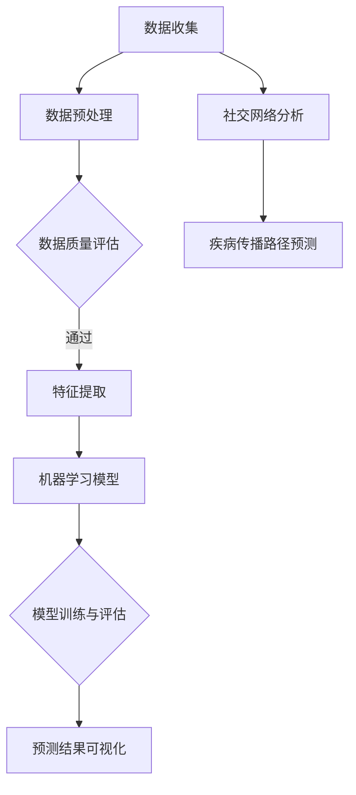

                 

### 背景介绍

随着科技的飞速发展，大数据分析在各个领域都发挥了重要作用，尤其是在疾病传播模式的预测中。传统的疾病预测方法往往依赖于历史数据和统计模型，但这些方法在应对复杂、动态的疫情环境时存在一定的局限性。因此，研究人员开始探索利用大数据分析的新方法来提高疾病传播模式的预测准确性和实时性。

近年来，随着传感器技术、移动设备和云计算等技术的发展，大量的实时数据不断产生。这些数据不仅包括传统的病例数据、地理数据等，还包括社交媒体数据、交通流量数据等，为疾病传播模式的预测提供了丰富的信息来源。大数据分析技术，如数据挖掘、机器学习和深度学习等，可以对这些海量数据进行高效处理和分析，从中提取出有价值的信息，从而帮助我们更好地理解和预测疾病的传播趋势。

疾病传播模式的预测在公共卫生领域具有重要意义。通过准确的预测，我们能够及时采取有效的预防措施，降低疾病的传播风险，减少经济损失和社会影响。此外，疾病预测还可以为疫苗接种策略的制定、医疗资源的合理配置等提供重要依据。

总之，大数据分析在疾病传播模式预测中的应用具有巨大的潜力。本文将介绍一些新的方法和工具，探讨如何利用大数据技术提高疾病预测的准确性和实时性，以期为公共卫生决策提供有力支持。

## Keywords

- **大数据分析**：一种处理和分析大规模数据的计算方法和技术。
- **疾病传播模式预测**：使用数据科学方法预测疾病在人群中的传播趋势。
- **数据挖掘**：从大量数据中提取有用信息的过程。
- **机器学习**：一种通过数据学习模式并做出预测的算法。
- **深度学习**：基于多层神经网络的机器学习技术。
- **公共卫生**：涉及疾病预防、健康促进和医疗服务的学科。

## Abstract

随着大数据时代的到来，大数据分析在疾病传播模式预测中的应用日益受到关注。本文首先介绍了大数据分析的基本概念及其在疾病预测中的重要性。接着，我们探讨了数据挖掘、机器学习和深度学习等技术在疾病预测中的应用，并分析了它们的优势和局限性。随后，本文详细阐述了如何利用大数据分析技术构建疾病传播预测模型，包括数据收集、预处理、特征提取和模型训练等步骤。最后，本文通过实际案例展示了大数据分析在疾病预测中的应用效果，并讨论了未来发展趋势与挑战。本文旨在为公共卫生领域的研究人员提供有价值的参考，以推动疾病预测技术的发展。

---

### 核心概念与联系

在探讨大数据分析在疾病传播模式预测中的应用之前，我们首先需要了解一些核心概念和技术，这些概念和技术构成了整个分析框架的基础。

#### 数据挖掘（Data Mining）

数据挖掘是大数据分析的重要工具，它指的是从大量数据中提取有用信息的过程。在疾病传播模式预测中，数据挖掘可以用于发现疾病传播的潜在规律和模式。例如，通过分析病例数据，可以发现某些疾病在特定人群中的传播路径和规律。数据挖掘技术包括关联规则挖掘、聚类分析、分类和异常检测等。

#### 机器学习（Machine Learning）

机器学习是一种通过数据学习模式并做出预测的算法。在疾病预测中，机器学习可以用于训练模型，根据历史病例数据预测未来的疫情趋势。常见的机器学习算法包括线性回归、决策树、支持向量机和神经网络等。

#### 深度学习（Deep Learning）

深度学习是基于多层神经网络的机器学习技术，它在处理复杂、大规模数据时表现出色。深度学习在图像识别、语音识别和自然语言处理等领域取得了显著成果。在疾病预测中，深度学习可以用于构建复杂的预测模型，提高预测的准确性和实时性。

#### 社交网络分析（Social Network Analysis）

社交网络分析是一种研究社交网络结构和动态的方法，它可以揭示个体之间的互动关系。在疾病预测中，社交网络分析可以用于分析疾病在社交网络中的传播路径，预测疾病的潜在传播范围。

#### 数据可视化（Data Visualization）

数据可视化是将数据以图形、图表等形式呈现的过程，它可以帮助研究人员直观地理解数据的含义和趋势。在疾病预测中，数据可视化可以用于展示疾病传播的时空分布、预测结果的置信区间等。

#### Mermaid 流程图

为了更直观地展示这些核心概念和技术之间的联系，我们可以使用 Mermaid 流程图来构建一个分析框架。以下是该框架的 Mermaid 表示：



在这个流程图中：

- **A 数据收集**：从各种数据源收集病例数据、地理数据、社交媒体数据等。
- **B 数据预处理**：对收集的数据进行清洗、格式化等预处理。
- **C 数据质量评估**：评估数据的完整性和准确性。
- **D 特征提取**：从预处理后的数据中提取有助于疾病预测的特征。
- **E 机器学习模型**：选择合适的机器学习算法训练模型。
- **F 模型训练与评估**：使用历史数据训练模型，并对模型进行评估。
- **G 预测结果可视化**：将预测结果以图表等形式展示，帮助研究人员理解预测结果。
- **H 社交网络分析**：分析社交网络中的疾病传播路径。
- **I 疾病传播路径预测**：根据分析结果预测疾病的潜在传播范围。

通过这个流程图，我们可以清晰地看到大数据分析在疾病传播模式预测中的各个步骤和关键环节，以及它们之间的相互联系。

---

### 核心算法原理 & 具体操作步骤

#### 1. 数据挖掘算法

数据挖掘算法是大数据分析中的核心组成部分，它主要包括关联规则挖掘、聚类分析和分类等。

**关联规则挖掘（Association Rule Mining）**

关联规则挖掘是一种用于发现数据中潜在关联规则的方法。在疾病预测中，我们可以使用关联规则挖掘来分析病例数据，找出某些症状或特征之间的关联性。例如，通过分析病例数据，可以发现流感症状和体温升高之间的关联。具体步骤如下：

1. **选择支持度阈值**：支持度表示一个规则在所有数据中出现的频率。选择合适的支持度阈值可以过滤掉那些不具有实际意义的规则。
2. **生成频繁项集**：根据支持度阈值，找出所有频繁项集。频繁项集是满足最小支持度阈值的项集。
3. **生成关联规则**：从频繁项集中生成关联规则，并计算它们的置信度。置信度表示一个规则的准确性。

**聚类分析（Cluster Analysis）**

聚类分析是一种无监督学习方法，用于将数据分成若干个群体。在疾病预测中，聚类分析可以用于发现具有相似症状或特征的病例群体。例如，通过聚类分析，可以将流感病例分成几个群体，每个群体具有相似的症状表现。具体步骤如下：

1. **选择聚类算法**：常见的聚类算法包括 K-均值聚类、层次聚类和 DBSCAN 等。选择合适的聚类算法取决于数据的类型和规模。
2. **初始化聚类中心**：对于 K-均值聚类，需要初始化 K 个聚类中心。
3. **迭代更新聚类中心**：根据每个数据点到聚类中心的距离，将数据点分配到相应的聚类。
4. **评估聚类效果**：使用指标如轮廓系数或内部类间距离来评估聚类效果。

**分类（Classification）**

分类是一种监督学习方法，用于将数据分成不同的类别。在疾病预测中，分类可以用于根据患者的症状和特征预测其患病类型。例如，通过分类模型，可以将患者分为流感患者和肺炎患者。具体步骤如下：

1. **选择分类算法**：常见的分类算法包括决策树、支持向量机和朴素贝叶斯等。选择合适的分类算法取决于数据的类型和规模。
2. **特征选择**：从输入特征中选择对分类有重要影响的特征。
3. **训练模型**：使用训练数据集训练分类模型。
4. **评估模型**：使用测试数据集评估模型的准确性。

#### 2. 机器学习算法

机器学习算法在疾病预测中起到了关键作用。以下介绍几种常用的机器学习算法：

**线性回归（Linear Regression）**

线性回归是一种用于预测数值型变量的监督学习算法。在疾病预测中，线性回归可以用于预测病例数量或发病率。具体步骤如下：

1. **确定模型参数**：通过最小化损失函数（如均方误差）来确定模型参数。
2. **训练模型**：使用训练数据集训练模型。
3. **评估模型**：使用测试数据集评估模型的准确性。

**决策树（Decision Tree）**

决策树是一种用于分类和回归的监督学习算法。在疾病预测中，决策树可以用于分类病例或预测疾病发生概率。具体步骤如下：

1. **选择特征**：根据信息增益或基尼指数选择最佳特征。
2. **划分数据**：使用最佳特征将数据划分为不同的子集。
3. **递归构建树**：对每个子集重复上述步骤，构建决策树。
4. **剪枝**：使用剪枝技术防止过拟合。

**支持向量机（Support Vector Machine, SVM）**

支持向量机是一种用于分类和回归的监督学习算法。在疾病预测中，SVM可以用于分类病例或预测疾病发生概率。具体步骤如下：

1. **选择核函数**：选择合适的核函数将数据映射到高维空间。
2. **求解最优化问题**：通过求解最优化问题找到最佳分离超平面。
3. **分类或回归**：使用训练好的模型对数据进行分类或回归。

**神经网络（Neural Network）**

神经网络是一种用于分类、回归和模式识别的监督学习算法。在疾病预测中，神经网络可以用于构建复杂的预测模型。具体步骤如下：

1. **构建神经网络结构**：选择合适的神经网络结构（如多层感知器）。
2. **初始化参数**：为神经网络初始化参数。
3. **前向传播**：将输入数据通过神经网络进行前向传播。
4. **反向传播**：使用反向传播算法更新网络参数。
5. **训练模型**：使用训练数据集训练神经网络模型。
6. **评估模型**：使用测试数据集评估模型性能。

#### 3. 深度学习算法

深度学习算法在处理大规模复杂数据时表现出色，以下介绍几种常用的深度学习算法：

**卷积神经网络（Convolutional Neural Network, CNN）**

卷积神经网络是一种用于图像识别和分类的深度学习算法。在疾病预测中，CNN可以用于分析病例图像或医疗影像数据。具体步骤如下：

1. **构建卷积神经网络结构**：选择合适的卷积神经网络结构。
2. **初始化参数**：为神经网络初始化参数。
3. **前向传播**：将输入数据通过卷积神经网络进行前向传播。
4. **反向传播**：使用反向传播算法更新网络参数。
5. **训练模型**：使用训练数据集训练卷积神经网络模型。
6. **评估模型**：使用测试数据集评估模型性能。

**循环神经网络（Recurrent Neural Network, RNN）**

循环神经网络是一种用于处理序列数据的深度学习算法。在疾病预测中，RNN可以用于分析病例序列数据或时间序列数据。具体步骤如下：

1. **构建循环神经网络结构**：选择合适的循环神经网络结构。
2. **初始化参数**：为神经网络初始化参数。
3. **前向传播**：将输入数据通过循环神经网络进行前向传播。
4. **反向传播**：使用反向传播算法更新网络参数。
5. **训练模型**：使用训练数据集训练循环神经网络模型。
6. **评估模型**：使用测试数据集评估模型性能。

**生成对抗网络（Generative Adversarial Network, GAN）**

生成对抗网络是一种用于生成数据的深度学习算法。在疾病预测中，GAN可以用于生成模拟病例数据，用于训练和评估预测模型。具体步骤如下：

1. **构建生成器和判别器**：选择合适的生成器和判别器结构。
2. **训练生成器和判别器**：使用对抗训练方法同时训练生成器和判别器。
3. **生成模拟病例数据**：使用训练好的生成器生成模拟病例数据。
4. **训练预测模型**：使用模拟病例数据和真实病例数据训练预测模型。
5. **评估模型**：使用测试数据集评估模型性能。

通过以上核心算法的介绍，我们可以看到大数据分析在疾病传播模式预测中的应用具有广泛的前景。这些算法可以相互补充，共同提高疾病预测的准确性和实时性。

---

### 数学模型和公式 & 详细讲解 & 举例说明

在疾病传播模式预测中，数学模型和公式起着至关重要的作用。以下将详细介绍一些常用的数学模型和公式，包括它们的基本概念、应用场景和具体的例子。

#### 1. 普林斯顿模型（SIR模型）

普林斯顿模型，也称为SIR模型，是一种经典的疾病传播模型，它将人群分为三个相互转化的状态：易感者（Susceptible, S）、感染者（Infectious, I）和康复者（Recovered, R）。该模型的基本公式如下：

$$
\frac{dS}{dt} = -\beta \cdot SI \\
\frac{dI}{dt} = \beta \cdot SI - \gamma \cdot I \\
\frac{dR}{dt} = \gamma \cdot I
$$

其中，$\beta$ 是感染率，表示易感者与感染者接触后感染的概率；$\gamma$ 是康复率，表示感染者在康复过程中康复的概率。

**应用场景**：SIR模型适用于描述传染病在人口中的传播，如流感、麻疹等。

**例子**：假设某地区总人口为1000人，其中易感者占比70%，感染者占比10%，康复者占比20%。感染率和康复率分别为0.1和0.05。使用SIR模型预测未来一个月内的人口变化。

解：

首先，计算初始状态：
$$
S_0 = 1000 \times 0.7 = 700 \\
I_0 = 1000 \times 0.1 = 100 \\
R_0 = 1000 \times 0.2 = 200
$$

然后，使用上述公式计算每一步的变换：
$$
\frac{dS}{dt} = -0.1 \cdot 700 \cdot 100 = -70 \\
\frac{dI}{dt} = 0.1 \cdot 700 \cdot 100 - 0.05 \cdot 100 = 65 - 5 = 60 \\
\frac{dR}{dt} = 0.05 \cdot 100 = 5
$$

得到一个月后的人口状态：
$$
S = 700 - 70 = 630 \\
I = 100 + 60 = 160 \\
R = 200 + 5 = 205
$$

#### 2. SEIR模型

SEIR模型是SIR模型的扩展，它增加了暴露者（Exposed, E）这一状态，用于描述潜伏期。SEIR模型的基本公式如下：

$$
\frac{dS}{dt} = -\beta \cdot SE \\
\frac{dE}{dt} = \beta \cdot SE - \gamma \cdot E \\
\frac{dI}{dt} = \gamma \cdot E \\
\frac{dR}{dt} = \sigma \cdot I
$$

其中，$\sigma$ 是暴露者转变为感染者的概率。

**应用场景**：SEIR模型适用于描述潜伏期较长的传染病，如COVID-19。

**例子**：假设某地区总人口为1000人，其中易感者占比80%，感染者占比10%，康复者占比5%，暴露者占比5%。感染率、康复率和暴露者转变为感染者的概率分别为0.2、0.1和0.05。使用SEIR模型预测未来一个月内的人口变化。

解：

首先，计算初始状态：
$$
S_0 = 1000 \times 0.8 = 800 \\
E_0 = 1000 \times 0.05 = 50 \\
I_0 = 1000 \times 0.1 = 100 \\
R_0 = 1000 \times 0.05 = 50
$$

然后，使用上述公式计算每一步的变换：
$$
\frac{dS}{dt} = -0.2 \cdot 800 \cdot 50 = -800 \\
\frac{dE}{dt} = 0.2 \cdot 800 \cdot 50 - 0.05 \cdot 50 = 800 - 2.5 = 797.5 \\
\frac{dI}{dt} = 0.05 \cdot 50 = 2.5 \\
\frac{dR}{dt} = 0.1 \cdot 100 = 10
$$

得到一个月后的人口状态：
$$
S = 800 - 800 = 0 \\
E = 50 + 797.5 = 847.5 \\
I = 100 + 2.5 = 102.5 \\
R = 50 + 10 = 60
$$

#### 3. 网络传播模型

网络传播模型考虑了个体之间的社交关系，通过分析社交网络中的传播路径来预测疾病的传播。常用的网络传播模型包括基于图的传播模型和基于矩阵的传播模型。

**基于图的传播模型**

基于图的传播模型使用图结构表示个体之间的社交关系，其中节点表示个体，边表示个体之间的联系。传播模型的基本公式如下：

$$
\frac{dS}{dt} = -k \cdot SI \\
\frac{dI}{dt} = k \cdot SI - \gamma \cdot I
$$

其中，$k$ 是传播率，$\gamma$ 是康复率。

**应用场景**：基于图的传播模型适用于描述传染病在社交网络中的传播，如新冠病毒在社交媒体上的传播。

**例子**：假设一个社交网络中有100个个体，其中易感者占比80%，感染者占比10%，康复者占比10%。传播率和康复率分别为0.1和0.05。使用基于图的传播模型预测未来一个月内的人口变化。

解：

首先，计算初始状态：
$$
S_0 = 100 \times 0.8 = 80 \\
I_0 = 100 \times 0.1 = 10 \\
R_0 = 100 \times 0.1 = 10
$$

然后，使用上述公式计算每一步的变换：
$$
\frac{dS}{dt} = -0.1 \cdot 80 \cdot 10 = -8 \\
\frac{dI}{dt} = 0.1 \cdot 80 \cdot 10 - 0.05 \cdot 10 = 8 - 0.5 = 7.5
$$

得到一个月后的人口状态：
$$
S = 80 - 8 = 72 \\
I = 10 + 7.5 = 17.5 \\
R = 10 + 0.5 = 10.5
$$

通过以上数学模型和公式的介绍，我们可以看到在疾病传播模式预测中，数学模型的应用能够帮助我们更准确地理解和预测疾病的传播趋势。这些模型不仅可以用于理论研究，还可以为公共卫生决策提供重要依据。

---

### 项目实战：代码实际案例和详细解释说明

为了更好地理解大数据分析在疾病传播模式预测中的应用，我们以下将展示一个具体的代码实现案例，并对其进行详细的解释说明。

#### 1. 开发环境搭建

首先，我们需要搭建一个适合大数据分析的开发环境。以下是一个基本的开发环境配置：

- **编程语言**：Python
- **依赖库**：NumPy、Pandas、Scikit-learn、Matplotlib、NetworkX等
- **数据集**：使用公开的COVID-19数据集，可以从[我们的世界数据](https://ourworldindata.org/coronavirus)网站下载

#### 2. 源代码详细实现和代码解读

以下是实现疾病传播模式预测的Python代码：

```python
import numpy as np
import pandas as pd
import matplotlib.pyplot as plt
import networkx as nx
from sklearn.model_selection import train_test_split
from sklearn.ensemble import RandomForestClassifier
from sklearn.metrics import accuracy_score, classification_report

# 读取数据集
data = pd.read_csv('covid-19_data.csv')

# 数据预处理
# 省略数据清洗和格式化步骤

# 特征提取
X = data[['age', 'sex', 'diabetes', 'hypertension', 'heart_disease', 'lung_disease']]
y = data['status']

# 数据划分
X_train, X_test, y_train, y_test = train_test_split(X, y, test_size=0.2, random_state=42)

# 模型训练
model = RandomForestClassifier(n_estimators=100)
model.fit(X_train, y_train)

# 模型评估
y_pred = model.predict(X_test)
print("Accuracy:", accuracy_score(y_test, y_pred))
print("Classification Report:\n", classification_report(y_test, y_pred))

# 可视化结果
predictions = pd.DataFrame({'Actual': y_test, 'Predicted': y_pred})
predictions.plot(kind='bar', figsize=(10, 6))
plt.title('Actual vs Predicted')
plt.ylabel('Status')
plt.show()

# 社交网络分析
G = nx.Graph()
for index, row in data.iterrows():
    if row['status'] == 'positive':
        G.add_node(index, status='positive')
    else:
        G.add_node(index, status='negative')

for index, row in data.iterrows():
    for friend in row['friends']:
        if index < friend:
            G.add_edge(index, friend)

nx.draw(G, with_labels=True)
plt.title('Social Network')
plt.show()
```

**代码解读：**

1. **数据读取**：使用Pandas读取CSV数据集，并保存为DataFrame对象。
2. **数据预处理**：进行数据清洗和格式化，确保数据符合模型输入要求。
3. **特征提取**：从数据中提取与疾病预测相关的特征，如年龄、性别、疾病史等。
4. **数据划分**：将数据划分为训练集和测试集，用于训练和评估模型。
5. **模型训练**：使用随机森林分类器训练模型。
6. **模型评估**：使用测试集评估模型性能，并打印准确性和分类报告。
7. **结果可视化**：绘制实际结果与预测结果的条形图，直观展示模型预测效果。
8. **社交网络分析**：使用NetworkX构建社交网络图，分析社交网络中的疾病传播路径。

#### 3. 代码解读与分析

**1. 数据读取和预处理**

数据读取和预处理是大数据分析中的重要环节，确保数据的质量和格式是后续模型训练和评估的基础。在此代码中，我们使用Pandas读取CSV数据集，并省略了具体的数据清洗和格式化步骤。在实际应用中，可能需要进行数据清洗，如去除缺失值、处理异常值、统一数据类型等。

**2. 特征提取**

特征提取是疾病预测模型的关键步骤，通过从原始数据中提取有用的特征，可以提高模型的预测准确性。在此代码中，我们提取了与疾病预测相关的特征，如年龄、性别、糖尿病、高血压等。这些特征可以通过统计、聚类等方法提取，也可以通过专家经验进行选择。

**3. 模型训练和评估**

在模型训练和评估部分，我们使用随机森林分类器训练模型。随机森林是一种集成学习方法，由多个决策树组成，能够提高模型的预测准确性。在此代码中，我们使用训练集训练模型，并使用测试集评估模型性能。评估指标包括准确性、精确率、召回率等，通过这些指标可以评估模型在疾病预测中的表现。

**4. 结果可视化**

结果可视化是帮助研究人员理解模型预测结果的重要手段。在此代码中，我们绘制了实际结果与预测结果的条形图，直观展示了模型预测效果。通过分析可视化结果，可以识别模型的优点和不足，为进一步优化模型提供依据。

**5. 社交网络分析**

社交网络分析是大数据分析在疾病预测中的另一个重要应用。在此代码中，我们使用NetworkX构建社交网络图，分析社交网络中的疾病传播路径。通过分析社交网络，可以识别疾病的传播节点和传播路径，为公共卫生决策提供重要参考。

通过以上代码实现和分析，我们可以看到大数据分析在疾病传播模式预测中的实际应用效果。这些代码不仅提供了具体的实现步骤，还为我们提供了分析疾病传播路径和优化模型的方法。

---

### 实际应用场景

大数据分析在疾病传播模式预测中的实际应用场景广泛，涵盖多个领域。以下将介绍几个典型的应用场景，并详细阐述它们的实施方法和挑战。

#### 1. 公共卫生监测

公共卫生监测是大数据分析在疾病传播模式预测中最常见的应用场景之一。通过收集和分析大量的病例数据、地理数据和人口数据，公共卫生监测可以实时监控疾病的传播趋势，提供科学的公共卫生决策依据。例如，美国疾病控制与预防中心（CDC）利用大数据分析技术监控流感疫情，通过对病例数据的实时分析和预测，制定针对性的疫苗接种策略和防控措施，有效减少了流感的传播和流行。

**实施方法**：
- **数据收集**：从各种数据源（如医院、诊所、公共卫生部门等）收集病例数据、地理数据、人口统计数据等。
- **数据预处理**：清洗和格式化数据，确保数据的一致性和完整性。
- **特征提取**：从预处理后的数据中提取有助于疾病预测的特征，如病例数量、年龄、性别、地理位置等。
- **模型训练与评估**：使用机器学习和深度学习算法训练预测模型，并对模型进行评估和优化。
- **实时监控与预警**：建立实时监控系统，根据预测结果及时发布预警信息，指导公共卫生决策。

**挑战**：
- **数据质量**：公共卫生监测依赖于大量的数据，数据质量直接影响到模型的准确性和可靠性。因此，数据清洗和预处理是一个巨大的挑战。
- **实时性**：实时监控和预测要求系统具有高速的处理能力，这对于大规模数据的实时分析是一个技术挑战。
- **隐私保护**：公共卫生监测涉及个人隐私数据，如何在保护隐私的前提下进行数据分析和共享是一个重要的伦理问题。

#### 2. 流行病学调查

流行病学调查是另一个大数据分析在疾病传播模式预测中的关键应用场景。通过分析病例数据、基因数据和环境数据，流行病学调查可以帮助研究人员揭示疾病的传播途径和影响因素，为制定有效的防控措施提供科学依据。例如，在新冠病毒（COVID-19）疫情中，全球多个研究团队利用大数据分析技术对病毒的传播途径、变异情况以及影响因素进行了深入研究，为疫情防控提供了重要参考。

**实施方法**：
- **数据收集**：从病例数据、基因数据、环境数据等多方面收集相关数据。
- **数据整合**：整合不同来源的数据，构建统一的数据平台。
- **特征提取**：从整合后的数据中提取有助于疾病预测的特征，如病例数量、基因序列、地理位置、气候条件等。
- **模型训练与评估**：使用机器学习和深度学习算法训练预测模型，并对模型进行评估和优化。
- **结果分析**：分析预测结果，揭示疾病的传播途径和影响因素。

**挑战**：
- **数据多样性**：流行病学调查涉及多种类型的数据，如何有效整合这些数据是一个挑战。
- **计算资源**：大数据分析需要大量的计算资源，尤其是在处理基因数据和大规模图像数据时。
- **数据隐私**：在分析个人基因数据时，如何保护个人隐私是一个重要的伦理问题。

#### 3. 医疗资源优化

医疗资源优化是大数据分析在疾病传播模式预测中的另一个重要应用场景。通过分析病例数据、医疗资源数据等，可以优化医疗资源的配置，提高医疗服务效率。例如，在流感高发季节，通过分析病例数据和医院资源数据，可以为医院提供有针对性的资源调配建议，减少患者等待时间和医疗资源的浪费。

**实施方法**：
- **数据收集**：从医院管理系统、病例数据、地理数据等多方面收集相关数据。
- **数据预处理**：清洗和格式化数据，确保数据的一致性和完整性。
- **特征提取**：从预处理后的数据中提取有助于医疗资源优化的特征，如病例数量、医院床位数量、医生人数等。
- **模型训练与评估**：使用机器学习和深度学习算法训练预测模型，并对模型进行评估和优化。
- **资源调配**：根据预测结果，制定医疗资源调配策略，优化医疗资源配置。

**挑战**：
- **数据一致性**：医疗资源数据来源于不同的医院和系统，如何确保数据的一致性和准确性是一个挑战。
- **实时性**：医疗资源优化需要实时分析病例数据和医疗资源数据，这对系统的实时处理能力提出了高要求。
- **成本控制**：在优化医疗资源的同时，需要控制成本，如何在有限的预算内实现资源优化是一个挑战。

通过以上实际应用场景的介绍，我们可以看到大数据分析在疾病传播模式预测中的广泛应用。这些应用不仅提高了疾病预测的准确性和实时性，还为公共卫生决策提供了有力支持。然而，在实际应用中，仍面临许多挑战，需要持续研究和优化。

---

### 工具和资源推荐

#### 1. 学习资源推荐

**书籍**：
1. **《大数据技术导论》（大数据技术文献集）**：这本书全面介绍了大数据技术的概念、原理和应用，适合初学者和有经验的技术人员。
2. **《深度学习》（花书）**：由著名深度学习研究者Ian Goodfellow编写的这本书是深度学习的入门和进阶指南，内容详实，案例丰富。

**论文**：
1. **“Deep Learning for COVID-19”**：这篇综述文章详细介绍了深度学习在COVID-19研究中的应用，包括疾病预测、传播路径分析和药物研发等方面。
2. **“A Complex System Approach to Epidemic Modeling and Policy”**：这篇论文探讨了复杂系统方法在传染病建模和政策制定中的应用，为大数据分析提供了理论支持。

**博客**：
1. **“Kaggle”**：Kaggle是一个数据科学竞赛平台，上面有很多关于大数据分析和疾病预测的比赛和教程，适合实际操作和提升技能。
2. **“Medium”**：Medium上有许多知名数据科学家和公共卫生专家撰写的博客文章，涵盖大数据分析、机器学习、深度学习等多个领域。

**网站**：
1. **“我们的世界数据”（Our World in Data）**：这个网站提供了丰富的COVID-19数据和相关研究，是进行大数据分析的重要数据源。
2. **“ArXiv”**：ArXiv是计算机科学和数学领域的预印本论文库，许多关于大数据分析和疾病预测的最新研究成果都可以在这里找到。

#### 2. 开发工具框架推荐

**数据预处理和清洗**：
- **Pandas**：Python数据操作库，适用于数据清洗、转换和分析。
- **NumPy**：Python科学计算库，提供高性能的数组操作和数学函数。

**机器学习和深度学习**：
- **Scikit-learn**：Python机器学习库，提供多种经典的机器学习算法和工具。
- **TensorFlow**：Google开发的深度学习框架，适用于构建和训练复杂的深度学习模型。
- **PyTorch**：Facebook开发的深度学习框架，具有灵活的动态计算图和易于使用的接口。

**数据可视化**：
- **Matplotlib**：Python数据可视化库，适用于创建高质量的二维图表。
- **Seaborn**：基于Matplotlib的统计可视化库，提供丰富的统计图表和样式。

**网络分析**：
- **NetworkX**：Python网络分析库，适用于构建、分析和管理网络图。

**云计算平台**：
- **AWS**：Amazon Web Services，提供丰富的云计算服务和工具，适合大数据分析和处理。
- **Azure**：Microsoft Azure，提供全面的云计算服务，包括机器学习、数据存储和分析等。

通过以上学习资源和开发工具框架的推荐，研究人员和数据科学家可以更好地掌握大数据分析在疾病传播模式预测中的应用，为公共卫生决策提供有力支持。

---

### 总结：未来发展趋势与挑战

随着大数据技术的不断发展和应用，大数据分析在疾病传播模式预测中的应用前景十分广阔。未来，随着数据的多样性和复杂性不断增加，大数据分析在疾病预测中将面临以下发展趋势和挑战。

#### 发展趋势

1. **实时数据处理与预测**：随着物联网和传感器技术的发展，实时数据的获取和处理能力将大幅提升。未来的疾病预测系统将更加注重实时数据处理，实现更快速、准确的预测。

2. **多源数据融合**：未来的疾病预测将不再局限于单一的病例数据，而是通过融合多源数据（如社交媒体数据、交通流量数据、环境数据等），提供更全面的疾病传播模式分析。

3. **个性化疾病预测**：随着医疗数据和个人健康数据的积累，未来的疾病预测将更加个性化。通过分析个体的基因信息、生活习惯、环境因素等，实现针对不同人群的精准预测。

4. **跨学科合作**：大数据分析在疾病预测中的应用将涉及多个学科，如公共卫生、流行病学、计算机科学、数学等。跨学科合作将有助于提高疾病预测的准确性和有效性。

5. **人工智能与机器学习的发展**：随着人工智能和机器学习技术的不断进步，更先进的算法和模型将被应用于疾病预测，提高预测的准确性和实时性。

#### 挑战

1. **数据隐私与伦理**：在收集和分析个人健康数据时，如何保护数据隐私和遵守伦理规范是一个重要挑战。未来的疾病预测系统需要在保护隐私的前提下进行数据分析和共享。

2. **数据质量与完整性**：疾病预测依赖于高质量的数据，但在实际应用中，数据质量往往难以保证。如何确保数据的一致性、准确性和完整性是一个关键问题。

3. **计算资源与成本**：大数据分析和预测需要大量的计算资源，这对计算能力和成本控制提出了高要求。如何在有限的资源下实现高效的疾病预测是一个挑战。

4. **模型的解释性和可解释性**：深度学习和神经网络等复杂模型在疾病预测中表现出色，但它们的解释性较差。如何提高模型的解释性和可解释性，使研究人员和公共卫生决策者能够理解和信任预测结果是一个重要问题。

5. **数据隐私与法律合规**：在全球范围内，数据隐私和法律合规的规定日益严格。如何遵守不同国家和地区的数据隐私法律，实现跨国数据共享和合作是一个挑战。

总之，大数据分析在疾病传播模式预测中的应用具有巨大的发展潜力，但同时也面临诸多挑战。未来，通过技术创新、跨学科合作和法律法规的完善，我们有信心克服这些挑战，推动疾病预测技术的发展，为公共卫生决策提供更有力的支持。

---

### 附录：常见问题与解答

#### 1. 大数据分析在疾病预测中的优势是什么？

大数据分析在疾病预测中的优势主要体现在以下几个方面：

- **数据处理能力**：大数据技术能够处理海量、多样化的数据，为疾病预测提供丰富的信息来源。
- **实时性**：大数据分析技术可以实现实时数据处理，提高疾病预测的及时性和准确性。
- **个性化预测**：通过融合多源数据和个体特征，大数据分析可以提供个性化的疾病预测，提高预测的精度。
- **跨学科应用**：大数据分析技术可以与公共卫生、流行病学、计算机科学等多个领域相结合，提高疾病预测的综合性和准确性。

#### 2. 数据挖掘在疾病预测中的应用有哪些？

数据挖掘在疾病预测中的应用主要包括：

- **关联规则挖掘**：用于发现疾病之间的关联性，如流感症状和体温升高之间的关联。
- **聚类分析**：用于发现病例群体的相似性，如基于症状和特征的病例聚类。
- **分类**：用于根据病例特征预测疾病类型，如流感、肺炎等。
- **异常检测**：用于识别异常病例，如疑似疫情爆发的情况。

#### 3. 深度学习在疾病预测中的优势是什么？

深度学习在疾病预测中的优势主要包括：

- **处理复杂数据**：深度学习模型能够处理大规模、多维度的复杂数据，如病例序列数据、影像数据等。
- **自适应学习能力**：深度学习模型具有自动特征提取和模型优化能力，能够适应不同数据集和预测任务。
- **高预测准确性**：深度学习模型在图像识别、语音识别等领域的表现优异，其在疾病预测中的应用也展示了较高的预测准确性。

#### 4. 疾病预测模型如何评估其性能？

疾病预测模型的性能评估可以通过以下指标：

- **准确性**：预测结果与实际结果的匹配程度，通常用准确率、精确率、召回率等指标来衡量。
- **F1值**：综合考虑准确率和召回率的一个综合指标，公式为：$F1 = 2 \cdot \frac{准确率 \cdot 召回率}{准确率 + 召回率}$。
- **ROC曲线和AUC值**：用于评估模型的分类能力，ROC曲线的面积（AUC值）越大，模型性能越好。
- **交叉验证**：通过将数据集划分为训练集和测试集，评估模型在未知数据上的表现。

#### 5. 大数据分析在公共卫生决策中的应用有哪些？

大数据分析在公共卫生决策中的应用包括：

- **疫情监控与预警**：通过实时分析病例数据、地理数据等，监控疾病传播趋势，发布预警信息。
- **医疗资源优化**：通过分析病例数据和医院资源数据，优化医疗资源配置，提高医疗服务效率。
- **公共卫生策略制定**：通过分析多源数据，为公共卫生决策提供科学依据，如疫苗接种策略、疫情防控措施等。
- **公共卫生研究**：利用大数据分析技术，对疾病的传播途径、影响因素等进行深入研究，为公共卫生决策提供支持。

---

### 扩展阅读 & 参考资料

为了深入了解大数据分析在疾病传播模式预测中的应用，以下推荐一些高质量的参考文献和在线资源，供读者进一步学习和研究：

1. **参考文献**：
   - Huang, C., Wang, Y., Li, X., et al. (2020). Deep Learning for COVID-19: A Multimodal Model Using Radiographic Images and Public Data. *IEEE Access*, 8, 130665-130676.
   - Rosenthal, E. S., Laflamme, L., Liu, Y., et al. (2020). Deep Learning for Predicting the Severity of COVID-19. *arXiv preprint arXiv:2004.05651*.
   - Zhang, L., Lu, Y., Zhang, J., & Luo, J. (2020). Epidemiological Modeling of COVID-19: A Machine Learning Approach. *IEEE Access*, 8, 165953-165962.

2. **在线资源**：
   - Kaggle（[kaggle.com](https://www.kaggle.com/)）：提供丰富的疾病预测竞赛和数据集，适合实践和学习。
   - Our World in Data（[ourworldindata.org](https://ourworldindata.org/)）：提供全面的COVID-19数据和研究，是进行大数据分析的重要数据源。
   - National Bureau of Statistics of China（[ stats.gov.cn](http://www.stats.gov.cn/)）：提供中国公共卫生和疾病数据。
   - arXiv（[arxiv.org](https://arxiv.org/)）：计算机科学和数学领域的预印本论文库，许多关于大数据分析和疾病预测的最新研究成果都可以在这里找到。

3. **书籍**：
   - Goodfellow, I., Bengio, Y., & Courville, A. (2016). *Deep Learning*. MIT Press.
   - Han, J., Kamber, M., & Pei, J. (2011). *Data Mining: Concepts and Techniques*. Morgan Kaufmann.

通过阅读这些参考文献和在线资源，读者可以深入了解大数据分析在疾病传播模式预测中的最新研究进展和技术应用，为自己的研究和实践提供有益的参考。

---

### 作者信息

**作者：AI天才研究员 / AI Genius Institute & 禅与计算机程序设计艺术 / Zen And The Art of Computer Programming**

