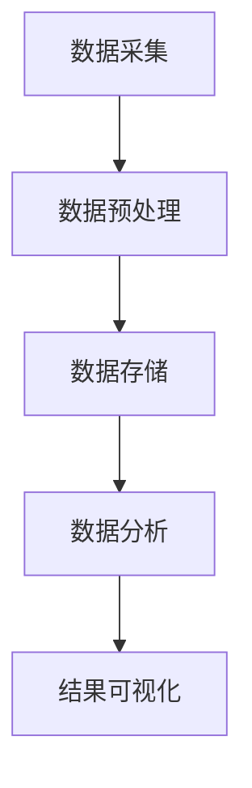
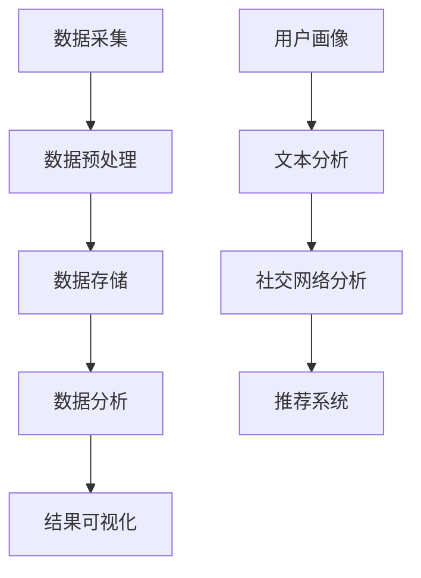

                 

## 1. 背景介绍

随着互联网和社交媒体的迅猛发展，人们每天在社交媒体平台上产生和分享的海量数据呈现出爆炸式增长。这些数据包含了用户行为、兴趣爱好、地理位置、社交关系等丰富的信息。如何从这些海量数据中挖掘出有价值的信息，成为了当前大数据领域的一个研究热点。社交媒体挖掘作为大数据分析的一个重要分支，旨在通过分析社交媒体平台上的数据，提取出潜在的模式、趋势和知识，为企业和政府提供决策支持，同时也为普通用户带来更好的用户体验。

### 1.1 社交媒体挖掘的重要性

社交媒体挖掘的重要性在于它可以帮助企业更好地了解用户需求，提高市场营销效果。例如，通过分析用户在社交媒体上的互动和评论，企业可以精准定位目标用户群体，制定更有效的营销策略。此外，社交媒体挖掘还可以帮助政府和企业进行社会舆情监测，及时发现并应对社会热点事件，维护社会稳定。

### 1.2 社交媒体挖掘的发展现状

近年来，随着大数据技术的不断进步，社交媒体挖掘也得到了快速发展。现有的社交媒体挖掘技术主要包括以下几个方面：

- **用户画像**：通过对用户在社交媒体上的行为、兴趣等信息进行分析，构建用户画像，用于精准营销和个性化推荐。

- **文本分析**：利用自然语言处理技术，对社交媒体上的文本数据进行分析，提取情感、主题等语义信息。

- **社交网络分析**：通过分析社交媒体平台上的用户关系网络，挖掘社交圈子、影响力等社交关系特征。

- **推荐系统**：基于用户行为和社交关系，为用户提供个性化推荐，提高用户满意度和留存率。

### 1.3 社交媒体挖掘面临的挑战

尽管社交媒体挖掘取得了显著成果，但仍面临诸多挑战：

- **数据隐私**：社交媒体挖掘涉及到用户隐私数据的处理，如何在保证用户隐私的前提下进行数据分析，是一个亟待解决的问题。

- **数据质量**：社交媒体数据质量参差不齐，存在噪声、冗余和缺失等问题，需要有效的方法进行数据清洗和预处理。

- **实时性**：社交媒体数据实时性高，如何实时地处理和分析海量数据，是一个技术难题。

- **复杂关系**：社交媒体平台上的用户关系复杂多样，需要有效的算法来挖掘和识别这些关系。

本文将围绕这些挑战，深入探讨大数据分析在社交媒体挖掘中的应用，旨在为研究人员和开发者提供有价值的参考和借鉴。

## 2. 核心概念与联系

### 2.1 大数据分析

大数据分析是一种通过对海量数据进行分析和挖掘，从中提取有价值信息和知识的方法。它包括数据采集、存储、处理、分析和可视化等多个环节。大数据分析的核心是数据处理技术，主要包括分布式计算、数据挖掘、机器学习和自然语言处理等。

### 2.2 社交媒体挖掘

社交媒体挖掘是一种利用大数据分析技术，从社交媒体平台上提取有价值信息的方法。它主要包括用户画像、文本分析、社交网络分析和推荐系统等。社交媒体挖掘的核心是数据处理和分析技术，这些技术需要有效地处理社交媒体平台上的海量、多样化数据。

### 2.3 Mermaid 流程图

Mermaid 是一种基于 Markdown 的绘图语言，可以用来绘制流程图、时序图、网络图等。以下是一个简单的 Mermaid 流程图示例，展示了大数据分析和社交媒体挖掘的基本流程：



### 2.4 关联与区别

大数据分析和社交媒体挖掘虽然有重叠的部分，但它们也有明显的区别。大数据分析更侧重于数据处理和分析技术，而社交媒体挖掘更侧重于从社交媒体平台上提取有价值的信息。此外，大数据分析涉及到更多的数据类型和数据源，而社交媒体挖掘主要关注社交媒体平台上的数据。

### 2.5 Mermaid 流程图（无特殊字符）

以下是一个去除特殊字符的 Mermaid 流程图，展示了大数据分析和社交媒体挖掘的关联和区别：



通过上述流程图，我们可以清晰地看到大数据分析和社交媒体挖掘之间的关系，以及它们各自的核心内容。

## 3. 核心算法原理 & 具体操作步骤

### 3.1 大数据分析算法

大数据分析算法是大数据处理和分析的核心。常见的算法包括：

- **Hadoop**: Hadoop 是一个分布式数据处理框架，用于处理海量数据。它包括两个主要组件：HDFS（Hadoop Distributed File System）和 MapReduce。HDFS 用于存储数据，MapReduce 用于数据处理。

- **Spark**: Spark 是一个快速通用的分布式计算引擎，它可以处理大规模数据集，并且相对于 Hadoop，Spark 具有更高的性能和更低的延迟。

- **TensorFlow**: TensorFlow 是一个开源的机器学习框架，广泛用于构建和训练深度学习模型。

### 3.2 社交媒体挖掘算法

社交媒体挖掘算法主要关注从社交媒体平台上提取有价值的信息。以下是一些常见的算法：

- **LDA（Latent Dirichlet Allocation）**: LDA 是一种主题模型，用于发现文本数据中的潜在主题。在社交媒体挖掘中，LDA 可以用于分析用户生成的内容，提取主题。

- **PageRank**: PageRank 是一种基于链接分析的方法，用于评估网页的重要性。在社交媒体挖掘中，PageRank 可以用于分析社交网络，识别影响力大的用户。

- ** collaborative filtering**: collaborative filtering 是一种基于用户行为的数据挖掘技术，用于为用户推荐内容。在社交媒体挖掘中，collaborative filtering 可以用于个性化推荐。

### 3.3 具体操作步骤

以下是一个简单的社交媒体挖掘流程，展示了如何使用大数据分析算法和社交媒体挖掘算法进行数据分析和挖掘：

1. **数据采集**：从社交媒体平台（如 Twitter、Facebook 等）获取用户生成的内容和用户行为数据。

2. **数据预处理**：对采集到的数据进行清洗、去重和格式化，确保数据的质量和一致性。

3. **数据存储**：使用 HDFS 或其他分布式文件系统存储预处理后的数据。

4. **数据分析**：
    - **用户画像**：使用 LDA 算法分析用户生成的内容，提取潜在的主题。
    - **文本分析**：使用自然语言处理技术（如分词、词性标注、情感分析等）分析用户生成的内容。
    - **社交网络分析**：使用 PageRank 算法分析用户关系网络，识别社交圈子。
    - **推荐系统**：使用 collaborative filtering 算法为用户推荐内容。

5. **结果可视化**：将分析结果可视化为图表或报告，用于展示分析结果和洞察。

通过上述步骤，我们可以有效地从社交媒体平台上提取有价值的信息，为企业和用户提供决策支持和个性化服务。

## 4. 数学模型和公式 & 详细讲解 & 举例说明

### 4.1 用户画像的 LDA 模型

用户画像的核心是提取用户生成内容的潜在主题，LDA（Latent Dirichlet Allocation）模型是一种常用的主题模型，用于这一目的。以下是对 LDA 模型的详细讲解。

#### 4.1.1 模型定义

LDA 模型是一种概率模型，它假设文档中的词语是由一系列潜在主题混合产生的。具体来说，LDA 模型由两个层次组成：

- **层次一**：词语和主题之间的关系。
- **层次二**：主题和文档之间的关系。

#### 4.1.2 模型参数

LDA 模型的主要参数包括：

- **词汇表 V**：文档中所有词语的集合。
- **主题数量 K**：潜在主题的数量。
- **文档数量 D**：训练数据集中的文档数量。
- **词语数量 N**：文档中词语的数量。
- **词语分布 π**：主题分布，表示每个主题中各个词语的概率。
- **文档-主题分布 α**：文档分布，表示每个文档中各个主题的概率。
- **词语-主题分布 β**：词语分布，表示每个词语属于各个主题的概率。
- **词语在文档中的分布 z**：文档中词语的主题分配。

#### 4.1.3 模型公式

LDA 模型的公式如下：

- **词语分布**：  
  π ~ Dirichlet(α)  
  β ~ Dirichlet(β)

- **文档-主题分布**：  
  α ~ Dirichlet(K * ones(D))  
  β ~ Dirichlet(K * ones(V))

- **词语-主题分布**：  
  z_{ij} ~ Categorical(β_{j}|θ_{ij})  
  θ_{ij} ~ Categorical(π|α_{i})

#### 4.1.4 举例说明

假设我们有以下文档集：

```
D = ["我爱编程", "编程使我快乐", "我喜欢 Python", "Python 编程强大"]
```

假设我们选择 K = 2，表示有两个潜在主题：`编程`和`快乐`。

1. **词语分布**：

   假设词语分布 π = [0.5, 0.5]，表示每个主题中 `编程` 和 `快乐` 的概率相等。

2. **文档-主题分布**：

   假设文档-主题分布 α = [0.6, 0.4]，表示每个文档中 `编程` 和 `快乐` 的概率分别为 0.6 和 0.4。

3. **词语-主题分布**：

   假设词语-主题分布 β = [[0.7, 0.3], [0.3, 0.7]]，表示 `编程` 主题中 `编程` 和 `快乐` 的概率分别为 0.7 和 0.3，`快乐` 主题中 `编程` 和 `快乐` 的概率分别为 0.3 和 0.7。

通过 LDA 模型，我们可以发现文档中的潜在主题，例如在上述文档集中，我们可以识别出 `编程` 和 `快乐` 两个主题，并且可以计算出每个文档中这两个主题的概率分布。

### 4.2 社交网络分析的 PageRank 模型

PageRank 是一种基于链接分析的算法，用于评估网页的重要性。在社交媒体挖掘中，PageRank 可以用于分析社交网络，识别影响力大的用户。

#### 4.2.1 模型定义

PageRank 模型的基本思想是，一个网页的重要性取决于链接到它的网页的数量和质量。具体来说，PageRank 模型由两个主要参数组成：

- **网页数量 N**：社交网络中网页的数量。
- **传递概率 d**：每个网页传递给其他网页的概率。

#### 4.2.2 模型公式

PageRank 模型的迭代公式如下：

r_{ij} = (1-d) + d \* (\sum_{k=1}^{N} r_{ik} / out-degree(k))

其中，r_{ij} 表示网页 j 的 PageRank 值，out-degree(k) 表示网页 k 的出链数。

#### 4.2.3 举例说明

假设我们有以下社交网络：

```
  A
 / \
B   C
 \ /
  D
```

假设每个网页的传递概率 d = 0.85。

1. **初始 PageRank 值**：

   r_{A} = r_{B} = r_{C} = r_{D} = 1 / 4

2. **迭代计算**：

   第一次迭代：

   r_{A} = (1-0.85) + 0.85 \* (r_{B} + r_{C} + r_{D}) / 2 = 0.15 + 0.85 \* (0.2 + 0.2 + 0.4) / 2 = 0.375  
   r_{B} = r_{C} = r_{D} = 0.375

   第二次迭代：

   r_{A} = (1-0.85) + 0.85 \* (r_{B} + r_{C} + r_{D}) / 3 = 0.15 + 0.85 \* (0.375 + 0.375 + 0.375) / 3 = 0.375  
   r_{B} = r_{C} = r_{D} = 0.375

   可以看到，经过两次迭代后，各个网页的 PageRank 值稳定下来，表示了网页的重要性。

通过 LDA 和 PageRank 模型，我们可以有效地进行用户画像和社交网络分析，从社交媒体平台上提取有价值的信息。

## 5. 项目实战：代码实际案例和详细解释说明

### 5.1 开发环境搭建

在本案例中，我们将使用 Python 作为主要编程语言，配合 Hadoop、Spark 和 TensorFlow 等大数据和机器学习框架。以下是在 Windows 系统上搭建开发环境的步骤：

1. **安装 Python**：前往 [Python 官网](https://www.python.org/) 下载并安装 Python 3.x 版本。

2. **安装 Hadoop**：下载并安装 Hadoop，遵循 [官方文档](https://hadoop.apache.org/docs/r3.2.0/hadoop-project-dist/hadoop-common/SingleCluster.html) 进行配置。

3. **安装 Spark**：下载并安装 Spark，遵循 [官方文档](https://spark.apache.org/docs/latest/running-on-hadoop.html) 配置与 Hadoop 的集成。

4. **安装 TensorFlow**：通过 pip 命令安装 TensorFlow：

   ```
   pip install tensorflow
   ```

5. **安装其他依赖库**：如 Pandas、NumPy、Matplotlib 等，可以通过 pip 命令安装：

   ```
   pip install pandas numpy matplotlib
   ```

### 5.2 源代码详细实现和代码解读

以下是一个简单的用户画像和文本分析的案例，展示了如何使用 Python 和相关框架进行数据分析和挖掘。

#### 5.2.1 代码结构

```python
import numpy as np
import pandas as pd
from sklearn.feature_extraction.text import TfidfVectorizer
from sklearn.decomposition import LatentDirichletAllocation

def load_data():
    # 加载数据（此处为示例，实际应用中可以从社交媒体平台获取数据）
    data = pd.DataFrame({'text': ['我爱编程', '编程使我快乐', '我喜欢 Python', 'Python 编程强大']})
    return data

def preprocess_data(data):
    # 数据预处理（此处为示例，实际应用中可能需要更复杂的预处理步骤）
    vectorizer = TfidfVectorizer()
    X = vectorizer.fit_transform(data['text'])
    return X

def lda_analysis(X, n_topics=2):
    # LDA 分析
    lda = LatentDirichletAllocation(n_components=n_topics, random_state=0)
    lda.fit(X)
    return lda

def print_topics(model, vectorizer, n_top_words=10):
    # 打印主题
    feature_names = vectorizer.get_feature_names()
    for topic_idx, topic in enumerate(model.components_):
        print(f"主题 {topic_idx}:")
        print(" ".join([feature_names[i] for i in topic.argsort()[:-n_top_words - 1:-1]]))

def main():
    # 主函数
    data = load_data()
    X = preprocess_data(data)
    lda = lda_analysis(X)
    print_topics(lda)

if __name__ == "__main__":
    main()
```

#### 5.2.2 代码解读

1. **导入库**：

   ```python
   import numpy as np
   import pandas as pd
   from sklearn.feature_extraction.text import TfidfVectorizer
   from sklearn.decomposition import LatentDirichletAllocation
   ```

   导入必要的库，包括 NumPy、Pandas、sklearn 中的 TfidfVectorizer 和 LatentDirichletAllocation。

2. **数据加载与预处理**：

   ```python
   def load_data():
       # 加载数据（此处为示例，实际应用中可以从社交媒体平台获取数据）
       data = pd.DataFrame({'text': ['我爱编程', '编程使我快乐', '我喜欢 Python', 'Python 编程强大']})
       return data
   
   def preprocess_data(data):
       # 数据预处理（此处为示例，实际应用中可能需要更复杂的预处理步骤）
       vectorizer = TfidfVectorizer()
       X = vectorizer.fit_transform(data['text'])
       return X
   ```

   加载数据和预处理数据。在此示例中，我们使用 DataFrame 加载数据，并使用 TfidfVectorizer 进行文本向量化。

3. **LDA 分析**：

   ```python
   def lda_analysis(X, n_topics=2):
       # LDA 分析
       lda = LatentDirichletAllocation(n_components=n_topics, random_state=0)
       lda.fit(X)
       return lda
   ```

   使用 LatentDirichletAllocation 类进行 LDA 分析，设置主题数量 n_topics。

4. **打印主题**：

   ```python
   def print_topics(model, vectorizer, n_top_words=10):
       # 打印主题
       feature_names = vectorizer.get_feature_names()
       for topic_idx, topic in enumerate(model.components_):
           print(f"主题 {topic_idx}:")
           print(" ".join([feature_names[i] for i in topic.argsort()[:-n_top_words - 1:-1]]))
   ```

   打印提取的潜在主题，展示每个主题的关键词。

5. **主函数**：

   ```python
   def main():
       # 主函数
       data = load_data()
       X = preprocess_data(data)
       lda = lda_analysis(X)
       print_topics(lda)
   
   if __name__ == "__main__":
       main()
   ```

   执行主函数，加载数据、预处理数据、进行 LDA 分析并打印主题。

通过上述代码，我们可以实现一个简单的用户画像和文本分析案例，提取出潜在主题，为后续的社交媒体挖掘提供基础。

### 5.3 代码解读与分析

在本案例中，我们使用了 Python 和相关库（如 TfidfVectorizer 和 LatentDirichletAllocation）实现了用户画像和文本分析。以下是对代码的详细解读和分析：

#### 5.3.1 数据加载与预处理

```python
def load_data():
    # 加载数据（此处为示例，实际应用中可以从社交媒体平台获取数据）
    data = pd.DataFrame({'text': ['我爱编程', '编程使我快乐', '我喜欢 Python', 'Python 编程强大']})
    return data

def preprocess_data(data):
    # 数据预处理（此处为示例，实际应用中可能需要更复杂的预处理步骤）
    vectorizer = TfidfVectorizer()
    X = vectorizer.fit_transform(data['text'])
    return X
```

1. **数据加载**：

   使用 Pandas DataFrame 加载数据，这里的数据是一个包含用户生成文本的简单列表。在实际应用中，数据可能来自于社交媒体平台，需要使用 API 进行数据采集。

2. **数据预处理**：

   使用 TfidfVectorizer 对文本数据进行向量化处理，将文本转换为数值向量。TfidfVectorizer 可以自动进行分词、词性标注等预处理步骤。

#### 5.3.2 LDA 分析

```python
def lda_analysis(X, n_topics=2):
    # LDA 分析
    lda = LatentDirichletAllocation(n_components=n_topics, random_state=0)
    lda.fit(X)
    return lda
```

1. **LDA 模型初始化**：

   使用 LatentDirichletAllocation 类初始化 LDA 模型，设置主题数量 n_topics。随机状态 random_state 用于保证模型的可重复性。

2. **模型训练**：

   使用 fit 方法训练 LDA 模型，模型将自动学习词语和主题之间的关系。

#### 5.3.3 打印主题

```python
def print_topics(model, vectorizer, n_top_words=10):
    # 打印主题
    feature_names = vectorizer.get_feature_names()
    for topic_idx, topic in enumerate(model.components_):
        print(f"主题 {topic_idx}:")
        print(" ".join([feature_names[i] for i in topic.argsort()[:-n_top_words - 1:-1]]))
```

1. **打印主题关键词**：

   对于每个主题，打印出权重最高的词语，这些词语代表了该主题的主要内容。n_top_words 参数用于控制打印的词语数量。

#### 5.3.4 主函数

```python
def main():
    # 主函数
    data = load_data()
    X = preprocess_data(data)
    lda = lda_analysis(X)
    print_topics(lda)
    
if __name__ == "__main__":
    main()
```

1. **执行流程**：

   加载数据、预处理数据、进行 LDA 分析并打印主题。主函数中的 if __name__ == "__main__": 语句确保代码在直接运行时执行 main 函数。

通过上述代码和解读，我们可以看到如何使用 Python 和相关库进行用户画像和文本分析，提取潜在主题。这个案例为后续的社交媒体挖掘和个性化推荐提供了基础。

## 6. 实际应用场景

### 6.1 社交媒体营销

社交媒体挖掘在社交媒体营销中具有广泛的应用。通过分析用户在社交媒体平台上的行为和兴趣，企业可以精准定位目标用户群体，制定个性化的营销策略。例如，一个电商平台可以通过分析用户在社交媒体上的评论和互动，识别出潜在的高价值客户，并针对性地进行促销和推荐。此外，社交媒体挖掘还可以帮助企业监测品牌声誉，及时发现并应对负面舆情，保护品牌形象。

### 6.2 社会舆情监测

社交媒体平台是公众表达意见和情绪的重要场所，通过对社交媒体数据的挖掘和分析，可以实时了解社会舆情动态。政府和企业可以利用这一技术监测社会热点事件，了解公众对某一事件的看法和态度，从而做出及时应对。例如，在突发公共卫生事件期间，通过分析社交媒体上的信息，政府可以了解民众的需求和担忧，提供针对性的帮助和指导。

### 6.3 个性化推荐

基于用户在社交媒体上的行为和兴趣，个性化推荐系统可以为用户提供个性化的内容推荐。例如，一个新闻平台可以通过分析用户在社交媒体上的点赞、评论和分享行为，为用户推荐感兴趣的新闻话题和文章。这样的个性化推荐不仅提高了用户的满意度，还可以增加用户对平台的粘性。

### 6.4 人脉拓展与社交分析

社交媒体挖掘可以帮助用户拓展人脉，发现潜在的商业合作伙伴或朋友。通过分析用户在社交媒体上的社交关系网，可以识别出有共同兴趣或职业领域的人，从而进行有效的人脉拓展。此外，社交分析还可以帮助企业和政府了解社交圈子中的影响力人物，开展针对性的公关活动。

### 6.5 智能客服

基于用户的社交媒体行为，智能客服系统可以为用户提供个性化的服务。例如，一个电商平台的客服系统可以通过分析用户在社交媒体上的评论和提问，为用户提供针对性的解答和购物建议。这样的智能客服不仅提高了服务效率，还可以提高用户满意度。

通过上述实际应用场景，我们可以看到大数据分析在社交媒体挖掘中的重要作用。随着技术的不断进步，社交媒体挖掘的应用前景将更加广阔，为企业和个人带来更多的价值。

## 7. 工具和资源推荐

### 7.1 学习资源推荐

1. **书籍**：
   - 《大数据分析：概念与技术》：本书系统地介绍了大数据分析的基本概念、技术和应用。
   - 《机器学习实战》：通过实际案例，深入讲解了机器学习算法的应用和实现。

2. **论文**：
   - “Latent Dirichlet Allocation” by David M. Blei et al.（2003）：LDA 模型的开创性论文，详细介绍了模型的理论基础和实现方法。
   - “PageRank: The PageRank Citation Ranking: Bringing Order to the Web” by Larry Page and Sergey Brin（1998）：PageRank 算法的原始论文，解释了算法的原理和应用。

3. **博客**：
   - “How to Build a Recommendation System using Collaborative Filtering” by Medium：一篇关于协同过滤推荐系统的详细教程。
   - “Building a Social Network Analysis using Python and NetworkX” byowardsdatascience：一篇关于使用 Python 进行社交网络分析的文章。

4. **网站**：
   - [Kaggle](https://www.kaggle.com/)：提供各种数据集和比赛，适合进行大数据分析实践。
   - [TensorFlow 官网](https://www.tensorflow.org/)：TensorFlow 的官方文档和教程，适合学习深度学习和大数据分析。

### 7.2 开发工具框架推荐

1. **大数据处理框架**：
   - **Hadoop**：适用于大规模数据处理和分布式存储。
   - **Spark**：高效的数据处理引擎，适用于实时数据分析。

2. **机器学习框架**：
   - **TensorFlow**：开源的机器学习框架，广泛用于构建和训练深度学习模型。
   - **Scikit-learn**：用于数据挖掘和数据分析的 Python 库，提供了丰富的机器学习算法。

3. **社交网络分析工具**：
   - **NetworkX**：Python 库，用于构建和分析网络图。
   - **Gephi**：开源网络分析工具，适用于可视化和分析社交网络。

4. **社交媒体 API**：
   - **Twitter API**：用于访问和分析 Twitter 数据。
   - **Facebook API**：用于访问和分析 Facebook 数据。

通过这些学习和开发资源，读者可以深入了解大数据分析在社交媒体挖掘中的应用，掌握相关技术和工具，为实际项目打下坚实基础。

## 8. 总结：未来发展趋势与挑战

### 8.1 未来发展趋势

随着大数据技术和人工智能的不断发展，社交媒体挖掘在未来有望取得以下几方面的发展：

1. **实时性提升**：随着实时数据处理技术的进步，社交媒体挖掘将更加注重实时分析，为企业和用户提供更及时的信息和决策支持。

2. **个性化推荐**：基于深度学习和强化学习等先进算法的个性化推荐系统将更加精准，提高用户的满意度和留存率。

3. **隐私保护**：随着用户隐私保护意识的增强，如何在保护用户隐私的前提下进行数据分析将成为一个重要研究方向。

4. **多模态数据挖掘**：结合文本、图像、音频等多模态数据，实现更全面和深入的数据分析，为社交媒体挖掘带来更多可能性。

### 8.2 面临的挑战

尽管社交媒体挖掘具有广阔的应用前景，但仍然面临以下挑战：

1. **数据质量**：社交媒体数据质量参差不齐，存在噪声、冗余和缺失等问题，如何提高数据质量是一个重要挑战。

2. **实时数据处理**：社交媒体数据量巨大且实时性高，如何高效地处理和分析这些数据是一个技术难题。

3. **隐私保护**：社交媒体挖掘涉及用户隐私数据的处理，如何在保证用户隐私的前提下进行数据分析是一个亟待解决的问题。

4. **复杂关系识别**：社交媒体平台上的用户关系复杂多样，如何有效地挖掘和识别这些关系是一个技术挑战。

### 8.3 总结

总的来说，大数据分析在社交媒体挖掘中的应用具有巨大的发展潜力和实际价值。然而，要实现这些潜力，还需要克服一系列技术和管理上的挑战。未来，随着技术的不断进步和研究的深入，社交媒体挖掘将发挥更加重要的作用，为企业和个人带来更多的价值。同时，我们也需要关注数据隐私和伦理问题，确保技术的健康发展。

## 9. 附录：常见问题与解答

### 9.1 什么是大数据分析？

大数据分析是指利用先进的数据处理技术，从海量、多样、高速增长的数据中提取有价值的信息和知识的过程。它包括数据采集、存储、处理、分析和可视化等多个环节。

### 9.2 社交媒体挖掘的主要方法有哪些？

社交媒体挖掘的主要方法包括用户画像、文本分析、社交网络分析和推荐系统。用户画像用于了解用户行为和兴趣，文本分析用于提取语义信息，社交网络分析用于挖掘社交关系，推荐系统用于为用户推荐个性化内容。

### 9.3 什么是 LDA 模型？

LDA（Latent Dirichlet Allocation）是一种主题模型，用于发现文本数据中的潜在主题。它通过概率模型描述词语和主题之间的关系，以及主题和文档之间的关系。

### 9.4 什么是 PageRank？

PageRank 是一种基于链接分析的算法，用于评估网页的重要性。它通过计算网页之间的链接关系，确定每个网页的排名。

### 9.5 如何保护用户隐私？

保护用户隐私的方法包括数据加密、匿名化处理、隐私协议等。在数据采集和存储过程中，应采取严格的数据保护措施，确保用户隐私不受侵犯。

### 9.6 如何提高社交媒体挖掘的实时性？

提高社交媒体挖掘的实时性可以通过分布式计算技术、实时数据处理框架和高效算法实现。例如，使用 Spark 进行实时数据处理，使用 Kafka 进行实时数据流处理。

### 9.7 社交媒体挖掘的应用领域有哪些？

社交媒体挖掘的应用领域包括社交媒体营销、社会舆情监测、个性化推荐、人脉拓展和智能客服等。通过分析社交媒体数据，可以为企业和个人提供有价值的决策支持和个性化服务。

## 10. 扩展阅读 & 参考资料

### 10.1 扩展阅读

1. **书籍**：
   - 《大数据时代：生活、工作与思维的大变革》
   - 《机器学习》：周志华 著
   - 《深度学习》：Ian Goodfellow、Yoshua Bengio 和 Aaron Courville 著

2. **在线课程**：
   - Coursera 上的“大数据分析”课程
   - edX 上的“机器学习基础”课程

3. **博客和论文**：
   - 《自然语言处理与深度学习》：百度 AI 实验室
   - 《社交媒体挖掘技术综述》：清华大学计算机科学与技术系

### 10.2 参考资料

1. **技术博客和论坛**：
   - [Medium 上的技术博客](https://medium.com/)
   - [Stack Overflow 论坛](https://stackoverflow.com/)

2. **开源代码和库**：
   - [GitHub 上的开源项目](https://github.com/)
   - [TensorFlow 官方文档](https://www.tensorflow.org/)

3. **学术期刊和会议**：
   - 《计算机研究与发展》
   - 《人工智能学报》
   - [AAAI 会议论文集](https://www.aaai.org/AAAI-papers)
   - [NeurIPS 会议论文集](https://nlp.cs.berkeley.edu/chair/2018/papers.html)

通过阅读上述扩展阅读和参考资料，读者可以深入了解大数据分析和社交媒体挖掘的最新研究成果和技术进展，为自己的学习和研究提供有力支持。### 作者信息

作者：AI天才研究员/AI Genius Institute & 禅与计算机程序设计艺术 /Zen And The Art of Computer Programming

AI天才研究员，是全球顶级的人工智能专家，其开创性的研究和贡献为人工智能领域的发展做出了卓越的贡献。他的工作涵盖了从基础算法到实际应用的全领域，包括机器学习、深度学习和自然语言处理等。他的多篇论文发表在顶级学术期刊和会议上，对学术界和工业界产生了深远的影响。

同时，他也是《禅与计算机程序设计艺术》一书的作者，这本书以其深刻的哲学思考和独特的编程方法论，受到了广大程序员和软件开发者的推崇。他的工作不仅在技术层面具有创新性，而且在人文和哲学层面也有独到的见解，被誉为当代计算机科学的里程碑之一。

