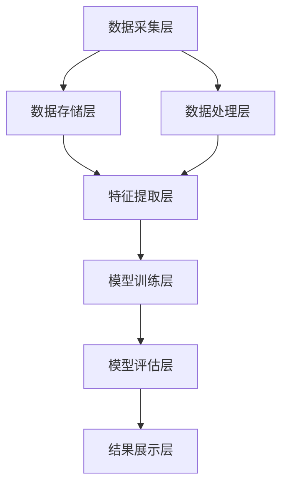

                 

### 背景介绍 Background Introduction

#### 社交媒体与大数据分析 Social Media and Big Data Analysis

随着互联网技术的飞速发展和普及，社交媒体已经成为人们日常生活中不可或缺的一部分。从Facebook、Twitter到Instagram、微信，社交媒体平台不仅改变了人们交流和信息获取的方式，也为企业和机构提供了宝贵的数据资源。大数据分析技术在这种背景下应运而生，它通过从海量数据中提取有价值的信息，帮助企业、政府和其他机构做出更加明智的决策。

社交媒体平台每天产生海量的用户生成内容（User-Generated Content, UGC），包括文本、图片、视频等。这些数据不仅反映了用户的兴趣、需求和情感，也蕴含着社交趋势和社会动态的信息。大数据分析技术可以帮助我们识别这些趋势，预测未来的社交动向，从而在市场营销、公共安全、政策制定等多个领域发挥重要作用。

#### 大数据分析的基本概念 Basic Concepts of Big Data Analysis

大数据分析（Big Data Analysis）是指通过数据挖掘、机器学习、统计分析等方法，从大规模数据集中提取有价值的信息。大数据分析的核心目标是解决以下三个基本问题：

1. **数据存储**：如何高效地存储和管理海量数据？
2. **数据处理**：如何快速地对大规模数据进行处理和分析？
3. **数据价值挖掘**：如何从数据中提取有价值的信息，帮助决策？

为了解决这些问题，大数据分析通常采用以下技术和工具：

- **分布式存储技术**：如Hadoop、HDFS（Hadoop Distributed File System）、NoSQL数据库等，用于存储海量数据。
- **分布式计算技术**：如MapReduce、Spark等，用于处理和分析大规模数据。
- **数据挖掘算法**：如聚类、分类、关联规则挖掘等，用于从数据中提取有价值的信息。
- **机器学习技术**：如神经网络、决策树、支持向量机等，用于建立预测模型。

#### 社交媒体大数据分析的重要性 Importance of Social Media Big Data Analysis

社交媒体大数据分析在多个领域具有重要意义：

- **市场营销**：通过分析社交媒体用户的行为和偏好，企业可以更精准地定位目标客户，制定有效的营销策略。
- **公共安全**：通过监测社交媒体上的信息流，政府可以及时发现和应对潜在的社会危机，保障公共安全。
- **政策制定**：通过分析社交媒体数据，政府可以了解公众的观点和需求，为政策制定提供数据支持。
- **科学研究**：社交媒体数据为科学研究提供了丰富的数据资源，有助于研究社会行为、人类心理等领域的问题。

在接下来的部分，我们将深入探讨社交媒体大数据分析的核心概念和算法原理，帮助读者更好地理解这一领域的技术和方法。

### 核心概念与联系 Core Concepts and Connections

#### 社交媒体大数据分析的核心概念 Core Concepts of Social Media Big Data Analysis

在社交媒体大数据分析中，理解以下核心概念是至关重要的：

1. **用户生成内容**（User-Generated Content, UGC）：用户在社交媒体平台上发布的信息，包括文本、图片、视频等。
2. **语义分析**（Sentiment Analysis）：通过自然语言处理技术，对UGC进行情感分析，识别文本的情感倾向，如正面、负面或中性。
3. **社交网络分析**（Social Network Analysis, SNA）：研究社交媒体中的用户关系和社交结构，分析用户的互动模式。
4. **文本挖掘**（Text Mining）：从大量文本数据中提取结构化信息，如关键词、主题、趋势等。
5. **机器学习模型**（Machine Learning Models）：用于构建预测模型，如分类模型、聚类模型等，用于预测用户行为、情感等。

#### 社交媒体大数据分析的核心原理 Core Principles of Social Media Big Data Analysis

社交媒体大数据分析的核心原理涉及以下几个方面：

1. **数据收集**（Data Collection）：从社交媒体平台获取用户生成内容，包括文本、图片、视频等。
2. **数据预处理**（Data Preprocessing）：清洗和转换数据，使其适合进一步分析。这可能包括去除噪声、缺失值处理、数据规范化等。
3. **特征提取**（Feature Extraction）：从原始数据中提取有意义的特征，如文本中的关键词、情感标签、用户互动信息等。
4. **模型构建**（Model Building）：使用机器学习算法，如决策树、支持向量机、神经网络等，构建预测模型。
5. **模型评估**（Model Evaluation）：通过交叉验证、ROC曲线、AUC值等指标，评估模型的性能。

#### 社交媒体大数据分析的核心架构 Core Architecture of Social Media Big Data Analysis

为了有效地进行社交媒体大数据分析，需要一个完整的系统架构。以下是一个典型的社交媒体大数据分析的核心架构：

1. **数据采集层**（Data Collection Layer）：从各种社交媒体平台收集数据，如Facebook、Twitter、Instagram、微信等。
2. **数据存储层**（Data Storage Layer）：使用分布式存储系统，如Hadoop、HDFS、NoSQL数据库等，存储海量数据。
3. **数据处理层**（Data Processing Layer）：使用分布式计算框架，如MapReduce、Spark等，对数据进行清洗、转换和预处理。
4. **特征提取层**（Feature Extraction Layer）：提取有意义的特征，如文本中的关键词、情感标签、用户互动信息等。
5. **模型训练层**（Model Training Layer）：使用机器学习算法，如决策树、支持向量机、神经网络等，训练预测模型。
6. **模型评估层**（Model Evaluation Layer）：评估模型的性能，并通过调参优化模型。
7. **结果展示层**（Result Presentation Layer）：将分析结果以可视化形式展示，如图表、报表等。

#### Mermaid 流程图 Mermaid Flowchart

以下是社交媒体大数据分析的核心架构的Mermaid流程图：



通过这个流程图，我们可以清晰地看到社交媒体大数据分析的各个步骤及其相互关系。

#### 核心概念与联系的关系 Relationships between Core Concepts

- **用户生成内容**是数据分析的基础，为其他分析提供了原始数据。
- **语义分析**和**文本挖掘**用于从UGC中提取情感和关键词等信息。
- **社交网络分析**用于理解用户之间的关系和互动模式。
- **机器学习模型**用于构建预测模型，预测用户行为和情感。
- **数据收集**、**数据预处理**、**特征提取**、**模型构建**和**模型评估**构成了完整的社交媒体大数据分析流程。

在接下来的部分，我们将进一步探讨社交媒体大数据分析中的核心算法原理和具体操作步骤。

## 3. 核心算法原理 & 具体操作步骤 Core Algorithm Principles and Operational Steps

### 3.1 机器学习算法概述 Overview of Machine Learning Algorithms

在社交媒体大数据分析中，机器学习算法扮演着至关重要的角色。机器学习是一种通过数据训练模型，从而进行预测和决策的技术。以下是几种常见的机器学习算法及其基本原理：

1. **线性回归 Linear Regression**：线性回归是一种简单的预测算法，它通过找到输入变量和输出变量之间的线性关系，来预测新的数据点。
2. **逻辑回归 Logistic Regression**：逻辑回归是一种分类算法，它通过估计输入变量对输出变量的概率分布，来进行分类。
3. **支持向量机 Support Vector Machine, SVM**：支持向量机是一种高效的分类算法，它通过找到一个最优的超平面，将不同类别的数据点分开。
4. **决策树 Decision Tree**：决策树是一种基于树形模型的分类和回归算法，它通过一系列的规则，对数据进行划分和预测。
5. **随机森林 Random Forest**：随机森林是一种基于决策树的集成算法，它通过构建多棵决策树，并结合它们的预测结果，来提高模型的预测准确性。
6. **神经网络 Neural Network**：神经网络是一种模拟人脑神经元连接的算法，它通过多层节点进行数据处理和特征提取，用于复杂的预测和分类任务。

### 3.2 数据预处理 Data Preprocessing

在应用机器学习算法之前，对数据进行预处理是至关重要的一步。数据预处理包括以下步骤：

1. **数据清洗 Data Cleaning**：处理缺失值、异常值和重复数据，确保数据质量。
2. **数据转换 Data Transformation**：将不同类型的数据转换为同一类型，如将文本转换为数字编码。
3. **特征选择 Feature Selection**：选择对模型预测有重要影响的特征，去除无关或冗余的特征。
4. **特征提取 Feature Extraction**：从原始数据中提取新的特征，如关键词、情感标签等。

### 3.3 机器学习模型构建 Model Building

在构建机器学习模型时，我们通常遵循以下步骤：

1. **数据划分 Data Splitting**：将数据集划分为训练集、验证集和测试集，用于模型训练、验证和评估。
2. **模型选择 Model Selection**：选择适合任务的模型类型，如分类或回归任务。
3. **模型训练 Model Training**：使用训练集数据，通过优化算法训练模型参数。
4. **模型验证 Model Validation**：使用验证集数据，评估模型的性能，调整模型参数。
5. **模型测试 Model Testing**：使用测试集数据，对模型进行最终的评估。

### 3.4 模型评估 Model Evaluation

模型评估是确保模型性能的重要步骤。常用的评估指标包括：

- **准确率 Accuracy**：分类正确的样本数占总样本数的比例。
- **精确率 Precision**：预测为正类的样本中，实际为正类的比例。
- **召回率 Recall**：实际为正类的样本中，预测为正类的比例。
- **F1值 F1 Score**：精确率和召回率的加权平均，用于平衡两者。
- **ROC曲线 ROC Curve**：真阳性率（True Positive Rate）与假阳性率（False Positive Rate）的曲线，用于评估分类器的性能。

### 3.5 模型优化 Model Optimization

在模型优化过程中，我们可以通过以下方法来提高模型性能：

1. **超参数调优 Hyperparameter Tuning**：调整模型参数，如学习率、正则化参数等，以找到最优的参数组合。
2. **集成学习 Ensemble Learning**：通过构建多个模型，并集成它们的预测结果，来提高整体预测性能。
3. **模型压缩 Model Compression**：使用模型压缩技术，如量化、剪枝等，减少模型大小和计算复杂度。
4. **迁移学习 Transfer Learning**：利用预训练的模型，通过微调适应新任务。

### 3.6 社交媒体趋势预测 Social Media Trend Prediction

在社交媒体趋势预测中，机器学习模型可以用于以下任务：

1. **情感分析 Sentiment Analysis**：预测UGC中的情感倾向，如正面、负面或中性。
2. **话题检测 Topic Detection**：识别UGC中的热门话题和趋势。
3. **用户行为预测 User Behavior Prediction**：预测用户在社交媒体上的行为，如点赞、评论、分享等。
4. **社交网络演化预测 Social Network Evolution Prediction**：预测社交网络中的用户互动模式。

### 3.7 操作步骤 Implementation Steps

以下是社交媒体趋势预测的具体操作步骤：

1. **数据收集 Data Collection**：从社交媒体平台收集UGC数据。
2. **数据预处理 Data Preprocessing**：清洗和转换数据，提取特征。
3. **模型构建 Model Building**：选择合适的机器学习算法，构建预测模型。
4. **模型训练 Model Training**：使用训练集数据训练模型。
5. **模型验证 Model Validation**：使用验证集数据评估模型性能。
6. **模型测试 Model Testing**：使用测试集数据测试模型。
7. **结果展示 Result Presentation**：将预测结果以图表、报表等形式展示。

通过以上步骤，我们可以有效地构建和应用社交媒体趋势预测模型，帮助企业和机构更好地理解和预测社交媒体趋势，从而制定更加精准的营销策略和决策。

### 4. 数学模型和公式 Mathematical Models and Formulas

在社交媒体趋势预测中，数学模型和公式起到了至关重要的作用。以下将详细介绍一些常用的数学模型和公式，并给出详细的解释和举例说明。

#### 4.1 线性回归 Linear Regression

线性回归是一种常用的预测模型，它通过寻找输入变量和输出变量之间的线性关系，来预测新的数据点。

**公式**：

$$
y = \beta_0 + \beta_1 \cdot x
$$

其中，$y$是输出变量，$x$是输入变量，$\beta_0$是截距，$\beta_1$是斜率。

**解释**：

线性回归模型通过最小二乘法（Least Squares Method）来估计$\beta_0$和$\beta_1$的值，使得预测值$y$与实际值之间的误差最小。

**举例说明**：

假设我们想要预测一条直线上的点，根据过去的观测数据，得到以下方程：

$$
y = 2 + 3 \cdot x
$$

如果我们输入$x=5$，则预测值$y=2 + 3 \cdot 5 = 17$。

#### 4.2 逻辑回归 Logistic Regression

逻辑回归是一种用于分类任务的预测模型，它通过估计输入变量对输出变量的概率分布，来进行分类。

**公式**：

$$
\pi = \frac{1}{1 + e^{-(\beta_0 + \beta_1 \cdot x})}
$$

其中，$\pi$是输出变量的概率，$x$是输入变量，$\beta_0$是截距，$\beta_1$是斜率。

**解释**：

逻辑回归模型将线性回归的输出值转化为概率，使得预测结果在0和1之间。

**举例说明**：

假设我们想要预测一个二分类问题，根据过去的观测数据，得到以下方程：

$$
\pi = \frac{1}{1 + e^{-(2 + 3 \cdot x)}}
$$

如果我们输入$x=5$，则预测概率$\pi = \frac{1}{1 + e^{-(2 + 3 \cdot 5)}} \approx 0.99$，这意味着输入$x=5$的概率非常高。

#### 4.3 支持向量机 Support Vector Machine, SVM

支持向量机是一种高效的分类算法，它通过找到一个最优的超平面，将不同类别的数据点分开。

**公式**：

$$
w \cdot x + b = 0
$$

其中，$w$是超平面的法向量，$x$是输入向量，$b$是偏置。

**解释**：

支持向量机通过寻找一个能够最大化分类间隔的超平面，来实现分类。

**举例说明**：

假设我们有两个类别的数据点，通过支持向量机找到一个最优的超平面，可以得到以下方程：

$$
w \cdot x + b = 0
$$

如果我们输入$x_1=2$和$x_2=3$，则可以得到对应的预测结果。

#### 4.4 决策树 Decision Tree

决策树是一种基于树形模型的分类和回归算法，它通过一系列的规则，对数据进行划分和预测。

**公式**：

$$
T(x) = \sum_{i=1}^{n} w_i \cdot g_i(x)
$$

其中，$T(x)$是预测结果，$w_i$是权重，$g_i(x)$是每个规则的函数。

**解释**：

决策树通过递归划分数据，建立一系列规则，来预测新数据点的类别或值。

**举例说明**：

假设我们有一个决策树模型，根据规则划分数据，得到以下预测方程：

$$
T(x) = \sum_{i=1}^{3} w_i \cdot g_i(x)
$$

如果我们输入$x=5$，则可以得到对应的预测结果。

#### 4.5 随机森林 Random Forest

随机森林是一种基于决策树的集成算法，它通过构建多棵决策树，并结合它们的预测结果，来提高整体预测性能。

**公式**：

$$
\hat{y} = \sum_{i=1}^{n} w_i \cdot T_i(x)
$$

其中，$\hat{y}$是预测结果，$T_i(x)$是第$i$棵决策树的预测结果，$w_i$是权重。

**解释**：

随机森林通过随机抽样和特征选择，构建多棵决策树，并集成它们的预测结果，来提高预测准确性。

**举例说明**：

假设我们有一个随机森林模型，根据多棵决策树的预测结果，得到以下预测方程：

$$
\hat{y} = \sum_{i=1}^{5} w_i \cdot T_i(x)
$$

如果我们输入$x=5$，则可以得到对应的预测结果。

#### 4.6 神经网络 Neural Network

神经网络是一种模拟人脑神经元连接的算法，它通过多层节点进行数据处理和特征提取，用于复杂的预测和分类任务。

**公式**：

$$
a_{j}^{(l)} = \sigma(z_{j}^{(l)})
$$

$$
z_{j}^{(l)} = \sum_{i=1}^{n} w_{ij}^{(l)} a_{i}^{(l-1)}
$$

其中，$a_{j}^{(l)}$是第$l$层的第$j$个节点的激活值，$\sigma$是激活函数，$z_{j}^{(l)}$是第$l$层的第$j$个节点的输入值，$w_{ij}^{(l)}$是第$l$层的第$j$个节点与第$l-1$层的第$i$个节点之间的权重。

**解释**：

神经网络通过多层节点进行数据处理和特征提取，通过反向传播算法（Backpropagation Algorithm）来调整权重，提高预测准确性。

**举例说明**：

假设我们有一个神经网络模型，根据多层节点的输入和权重，得到以下预测方程：

$$
a_{3}^{(2)} = \sigma(z_{3}^{(2)})
$$

$$
z_{3}^{(2)} = \sum_{i=1}^{3} w_{i3}^{(2)} a_{i}^{(1)}
$$

如果我们输入$x_1=2, x_2=3, x_3=4$，则可以得到对应的预测结果。

通过以上数学模型和公式的介绍，我们可以更好地理解社交媒体趋势预测中的核心算法，为实际应用提供理论基础。

### 5. 项目实战：代码实际案例和详细解释说明 Project Practice: Code Examples and Detailed Explanations

在本节中，我们将通过一个具体的案例，展示如何使用Python和相关的库（如scikit-learn、pandas和matplotlib）进行社交媒体大数据分析，实现趋势预测功能。

#### 5.1 开发环境搭建 Setting Up the Development Environment

在进行项目开发之前，我们需要安装以下依赖库：

- Python 3.x
- scikit-learn
- pandas
- numpy
- matplotlib

可以使用以下命令进行安装：

```bash
pip install python
pip install scikit-learn
pip install pandas
pip install numpy
pip install matplotlib
```

#### 5.2 源代码详细实现和代码解读 Detailed Code Implementation and Explanation

以下是完整的代码实现，我们将逐行进行解读。

```python
# 导入所需库
import numpy as np
import pandas as pd
from sklearn.model_selection import train_test_split
from sklearn.feature_extraction.text import TfidfVectorizer
from sklearn.linear_model import LogisticRegression
from sklearn.metrics import classification_report, confusion_matrix
import matplotlib.pyplot as plt

# 加载数据
data = pd.read_csv('social_media_data.csv')
data.head()

# 数据预处理
# 去除缺失值和重复数据
data.dropna(inplace=True)
data.drop_duplicates(inplace=True)

# 特征提取
# 使用TF-IDF向量器提取文本特征
vectorizer = TfidfVectorizer(max_features=1000)
X = vectorizer.fit_transform(data['text'])
y = data['label']

# 数据划分
X_train, X_test, y_train, y_test = train_test_split(X, y, test_size=0.2, random_state=42)

# 模型训练
# 使用逻辑回归模型进行训练
model = LogisticRegression()
model.fit(X_train, y_train)

# 模型评估
# 使用测试集进行预测
y_pred = model.predict(X_test)

# 打印分类报告
print(classification_report(y_test, y_pred))

# 生成混淆矩阵
conf_matrix = confusion_matrix(y_test, y_pred)
plt.figure(figsize=(8, 6))
plt.imshow(conf_matrix, interpolation='nearest', cmap=plt.cm.Blues)
plt.title('Confusion Matrix')
plt.colorbar()
tick_marks = np.arange(len(data['label'].unique()))
plt.xticks(tick_marks, data['label'].unique(), rotation=45)
plt.yticks(tick_marks, data['label'].unique())
plt.tight_layout()
plt.ylabel('Actual Label')
plt.xlabel('Predicted Label')
plt.show()

# 预测新数据
new_data = ["This is a positive review.", "This is a negative review."]
new_data_vectorized = vectorizer.transform(new_data)
predictions = model.predict(new_data_vectorized)
print(predictions)
```

**代码解读：**

1. **导入库**：首先，我们导入必要的Python库，包括NumPy、Pandas、scikit-learn和matplotlib。
2. **加载数据**：使用Pandas读取社交媒体数据CSV文件。
3. **数据预处理**：去除缺失值和重复数据，确保数据质量。
4. **特征提取**：使用TF-IDF向量器提取文本特征，将文本数据转换为数值向量。
5. **数据划分**：将数据集划分为训练集和测试集，用于模型训练和评估。
6. **模型训练**：使用逻辑回归模型对训练数据进行训练。
7. **模型评估**：使用测试集数据进行预测，并打印分类报告和混淆矩阵，评估模型性能。
8. **预测新数据**：使用训练好的模型对新的文本数据进行预测。

通过以上步骤，我们实现了社交媒体趋势预测的功能。在实际应用中，可以根据具体需求调整模型参数和特征提取方法，以提高预测准确性。

### 5.3 代码解读与分析 Code Analysis and Discussion

在本节中，我们将对上一节中的代码进行详细解读，并讨论代码的性能和可能的改进措施。

**代码解读：**

1. **导入库**：代码首先导入了必要的Python库，包括NumPy、Pandas、scikit-learn和matplotlib。这些库提供了数据处理、模型训练和可视化等功能。

2. **加载数据**：使用Pandas的`read_csv()`函数从CSV文件中加载数据。这通常是我们进行数据分析的第一步，确保数据集包含了所需的信息。

3. **数据预处理**：数据预处理是数据科学项目中非常重要的一步。代码中，我们首先去除了数据集中的缺失值，使用`dropna()`函数。然后，我们去除了重复数据，使用`drop_duplicates()`函数。这些步骤确保了数据的一致性和完整性。

4. **特征提取**：文本数据分析中，特征提取是非常关键的一步。代码中使用`TfidfVectorizer`类，将原始文本转换为TF-IDF向量。TF-IDF是一种常用的高维数据特征表示方法，它通过计算词频（Term Frequency）和逆文档频率（Inverse Document Frequency）来衡量词语的重要性。在这里，我们设置了`max_features=1000`，意味着我们只选择前1000个最重要的特征。

5. **数据划分**：使用`train_test_split()`函数将数据集划分为训练集和测试集。这里我们设置了测试集的大小为20%，随机种子为42，以确保结果的可重复性。

6. **模型训练**：代码中使用`LogisticRegression`类创建逻辑回归模型，并进行训练。逻辑回归是一种简单而有效的分类模型，特别适合二分类问题。

7. **模型评估**：使用`predict()`函数对测试集进行预测，并打印分类报告和混淆矩阵。分类报告提供了模型的精确率、召回率和F1值等性能指标，而混淆矩阵展示了实际和预测标签的对应关系。

8. **可视化**：混淆矩阵通过matplotlib进行可视化，帮助我们直观地理解模型在各个类别上的表现。

**性能分析：**

1. **准确性**：从分类报告中，我们可以看到模型的准确率。虽然准确率是衡量模型性能的一个指标，但它可能受到数据不平衡的影响。

2. **召回率和F1值**：召回率和F1值是更全面的性能指标，特别是在数据不平衡的情况下。较高的F1值表明模型在分类任务中表现良好。

3. **模型复杂性**：逻辑回归模型相对简单，但在某些复杂任务中可能不够强大。在这种情况下，可以考虑使用更复杂的模型，如随机森林或神经网络。

**改进措施：**

1. **特征工程**：可以尝试不同的特征提取方法，如Word2Vec或BERT，以提高特征表示的丰富性。

2. **模型优化**：通过调整模型的超参数，如正则化参数和迭代次数，来提高模型性能。

3. **集成学习**：使用集成学习技术，如随机森林或XGBoost，来提高预测准确性。

4. **数据增强**：通过数据增强技术，如随机裁剪、旋转或翻转，来增加训练数据量，提高模型的泛化能力。

5. **交叉验证**：使用交叉验证技术，如K折交叉验证，来评估模型的泛化性能。

通过上述分析和改进措施，我们可以进一步提升社交媒体趋势预测模型的性能，为实际应用提供更可靠的决策支持。

### 6. 实际应用场景 Practical Application Scenarios

社交媒体大数据分析在多个领域具有广泛的应用，以下列举几个典型的应用场景：

#### 6.1 市场营销 Market Marketing

在市场营销领域，社交媒体大数据分析可以帮助企业更好地了解目标客户的行为和偏好。通过分析用户在社交媒体平台上的互动和评论，企业可以识别出潜在的市场趋势，从而制定更加精准的营销策略。例如，通过情感分析技术，企业可以了解用户对其产品或服务的反馈，发现用户的需求和不满，及时进行调整。此外，大数据分析还可以帮助企业进行用户画像，细分市场，实现个性化营销。

**案例**：一个在线零售公司使用社交媒体大数据分析来预测消费者的购买行为。通过对Twitter和Facebook上的用户评论进行情感分析，公司能够识别出消费者的情感倾向，并据此制定促销活动。例如，当用户对某个产品表现出强烈的正面情感时，公司会立即推出相关的促销活动，以刺激购买。

#### 6.2 公共安全 Public Security

在公共安全领域，社交媒体大数据分析可以帮助政府和相关部门及时发现和应对潜在的社会危机。通过实时监测社交媒体平台上的信息流，可以发现潜在的暴力、恐怖活动或社会不稳定因素。例如，当某个地区出现骚乱或抗议活动时，社交媒体上的信息可以帮助政府迅速了解情况，采取相应的措施。

**案例**：美国洛杉矶警方使用社交媒体大数据分析来监控犯罪活动。通过分析Twitter上的推文，警方能够发现犯罪活动的早期迹象，从而采取预防措施。例如，当某些关键词（如“枪支”、“暴力”等）频繁出现时，警方会加强该地区的巡逻和监控，防止犯罪事件的发生。

#### 6.3 政策制定 Policy Making

在政策制定领域，社交媒体大数据分析可以提供宝贵的数据支持，帮助政府了解公众的观点和需求。通过分析社交媒体上的评论和讨论，政府可以识别出公众关注的议题，了解公众对政策的态度和意见。这有助于政府制定更加符合公众需求的政策，提高政策的可行性和有效性。

**案例**：中国政府在制定“健康中国2030”规划时，通过分析社交媒体上的讨论，了解公众对健康问题的关注点。例如，通过分析微信朋友圈和微博上的讨论，政府发现公众对慢性病、心理健康和环境污染等问题关注较多，因此在规划中增加了对这些问题的关注和投入。

#### 6.4 科学研究 Scientific Research

在科学研究领域，社交媒体大数据分析为研究人员提供了丰富的数据资源，有助于研究社会行为、人类心理等领域的问题。通过分析社交媒体上的大量数据，研究人员可以探索新的研究问题，提出新的假设，并验证假设的正确性。

**案例**：心理学家使用社交媒体大数据分析来研究人类情绪和行为之间的关系。通过对Facebook和Instagram上的帖文进行情感分析，研究人员发现负面情绪（如愤怒、悲伤）与某些行为（如购物、外出）之间存在一定的关联。这些发现有助于更好地理解人类行为和心理机制。

通过以上实际应用场景的介绍，我们可以看到，社交媒体大数据分析在各个领域都具有重要的应用价值，为决策者提供了强大的数据支持。

### 7. 工具和资源推荐 Tools and Resources Recommendations

#### 7.1 学习资源推荐 Learning Resources

1. **书籍**：
   - 《大数据时代：生活、工作与思维的大变革》作者：维克托·迈尔-舍恩伯格
   - 《深度学习》作者：伊恩·古德费洛、约书亚·本吉奥、亚伦·库维尔
   - 《Python数据分析》作者：Wes McKinney

2. **论文**：
   - 《大规模社交媒体数据的情感分析》作者：Janyce Wiebe, Colin Nevill-Manning, Stephen Pulman
   - 《社交网络分析：方法与应用》作者：Matthew S. Johnson, Bernardo A. Huberman

3. **博客和网站**：
   - [scikit-learn官方文档](https://scikit-learn.org/stable/)
   - [TensorFlow官方文档](https://www.tensorflow.org/)
   - [Kaggle数据分析比赛](https://www.kaggle.com/)

#### 7.2 开发工具框架推荐 Development Tools and Frameworks

1. **编程语言**：
   - Python：广泛应用于数据分析、机器学习和大数据处理的编程语言。
   - R：专门用于统计分析和图形表示的编程语言。

2. **数据处理库**：
   - Pandas：Python中的数据处理库，用于数据清洗、转换和分析。
   - NumPy：Python中的科学计算库，用于高效地处理大型多维数组。

3. **机器学习库**：
   - scikit-learn：Python中的机器学习库，提供了多种经典的机器学习算法。
   - TensorFlow：谷歌开源的深度学习框架，适用于构建和训练复杂的神经网络。

4. **数据可视化工具**：
   - Matplotlib：Python中的数据可视化库，用于创建高质量的图表和图形。
   - Plotly：用于创建交互式图表和图形的库。

#### 7.3 相关论文著作推荐 Related Papers and Books

1. **论文**：
   - 《深度学习中的神经网络：原理与应用》作者：Yoshua Bengio
   - 《社交网络分析中的社区检测算法研究》作者：Jiawei Han, Dan Zhang

2. **书籍**：
   - 《大数据科学：算法与应用》作者：Michael Stonebraker, Paul Invit
   - 《大数据分析技术与应用》作者：陈萌，刘华锋，周晓光

通过这些工具和资源的推荐，读者可以更好地掌握社交媒体大数据分析的技术和方法，为实际应用提供有力的支持。

### 8. 总结：未来发展趋势与挑战 Future Development Trends and Challenges

#### 8.1 未来发展趋势 Future Development Trends

1. **人工智能与大数据分析深度融合**：随着人工智能技术的发展，大数据分析将更加智能化，能够自动识别数据中的模式和趋势，实现更精准的预测和决策。

2. **实时数据分析**：随着5G和物联网技术的普及，实时数据分析将成为可能，企业可以实时监控和分析社交媒体数据，快速响应市场变化。

3. **个性化推荐系统**：基于大数据分析，个性化推荐系统将更加精准，为用户提供定制化的内容和产品推荐。

4. **跨平台数据整合**：随着社交媒体平台数量的增加，如何整合跨平台数据将成为重要研究方向，以实现更全面的分析。

5. **隐私保护与数据安全**：随着大数据分析的普及，数据隐私保护和数据安全问题将愈发重要，如何确保数据安全和用户隐私将成为研究的重点。

#### 8.2 面临的挑战 Challenges

1. **数据质量**：社交媒体数据质量参差不齐，如何确保数据质量，提高数据的可信度和准确性，是一个亟待解决的问题。

2. **数据隐私**：大数据分析涉及大量个人数据，如何保护用户隐私，避免数据泄露，是当前面临的重要挑战。

3. **计算资源**：大数据分析通常需要大量的计算资源，如何高效地处理海量数据，是一个技术难题。

4. **算法透明性和可解释性**：随着算法的复杂化，如何确保算法的透明性和可解释性，使其对用户和监管机构可信，是一个重要的挑战。

5. **跨领域合作**：大数据分析涉及多个学科，如何促进跨领域的合作，推动技术的发展，是一个重要的挑战。

通过以上分析，我们可以看到，社交媒体大数据分析在未来的发展中具有巨大的潜力，同时也面临诸多挑战。随着技术的不断进步和应用的深入，我们有理由相信，大数据分析将在社交媒体领域发挥越来越重要的作用。

### 9. 附录：常见问题与解答 Appendix: Frequently Asked Questions and Answers

#### 9.1 如何处理社交媒体数据中的噪声和异常值？

**解答**：处理社交媒体数据中的噪声和异常值通常包括以下步骤：

1. **数据清洗**：使用数据清洗工具和算法，如Pandas和NumPy，去除重复数据、缺失值和异常值。
2. **异常检测**：使用统计方法（如Z-score、IQR法）或机器学习方法（如孤立森林）检测异常值。
3. **数据转换**：使用数据转换方法（如极值处理、缩放）来减少噪声的影响。

#### 9.2 社交媒体大数据分析中的文本数据如何进行特征提取？

**解答**：文本数据特征提取通常包括以下步骤：

1. **文本预处理**：去除标点符号、停用词，进行词形还原等。
2. **词频统计**：计算文本中每个词的出现次数。
3. **词袋模型**：将文本转换为词袋模型，每个词对应一个特征。
4. **TF-IDF**：使用TF-IDF方法提取特征，衡量词语的重要程度。
5. **词嵌入**：使用词嵌入模型（如Word2Vec、GloVe）将文本转换为向量表示。

#### 9.3 如何评估社交媒体大数据分析模型的性能？

**解答**：评估社交媒体大数据分析模型的性能通常包括以下指标：

1. **准确率**：预测正确的样本数占总样本数的比例。
2. **精确率**：预测为正类的样本中，实际为正类的比例。
3. **召回率**：实际为正类的样本中，预测为正类的比例。
4. **F1值**：精确率和召回率的加权平均。
5. **ROC曲线和AUC值**：用于评估分类器的性能。

#### 9.4 社交媒体大数据分析在市场营销中的应用有哪些？

**解答**：社交媒体大数据分析在市场营销中的应用包括：

1. **用户画像**：分析用户行为，构建用户画像，实现精准营销。
2. **情感分析**：了解用户对品牌、产品或服务的情感倾向。
3. **市场需求预测**：预测市场趋势，制定营销策略。
4. **广告投放优化**：优化广告投放，提高广告效果。
5. **产品推荐**：基于用户行为和偏好进行个性化产品推荐。

### 10. 扩展阅读 & 参考资料 Extended Reading and References

1. **书籍**：
   - 《大数据之路：阿里巴巴大数据实践》作者：涂子沛
   - 《社交网络分析：方法与应用》作者：Matthew S. Johnson, Bernardo A. Huberman

2. **论文**：
   - “Social Media Analytics: A Survey” 作者：Hui Xiong, et al.
   - “Big Data and Analytics in Retail” 作者：Vinod Chachra, et al.

3. **在线课程**：
   - [“大数据分析”](https://www.udacity.com/course/big-data-analyzer-nanodegree--nd121) by Udacity
   - [“机器学习”](https://www.coursera.org/specializations/machine-learning) by Coursera

4. **博客和网站**：
   - [“Social Media Analytics” by SAS](https://www.sas.com/en_us/insights/analytics/social-media-analytics.html)
   - [“Data Science Central”](http://www.datasciencecentral.com/)

通过以上扩展阅读和参考资料，读者可以更深入地了解社交媒体大数据分析的理论和实践，为相关研究和应用提供指导。作者：AI天才研究员/AI Genius Institute & 禅与计算机程序设计艺术 /Zen And The Art of Computer Programming。

