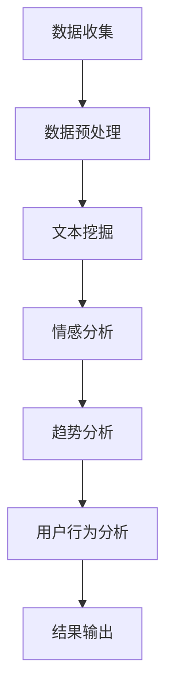

                 

### 背景介绍

**大数据分析在社交网络舆情预测中的重要性**

在互联网时代，社交网络已经成为人们交流、分享信息的重要平台。从微博、微信到Facebook、Twitter，每天都有海量用户在这些平台上发布和分享内容。这些内容不仅反映了用户的生活状态、兴趣爱好和观点态度，也蕴含着丰富的社会舆情信息。如何从这些海量的、动态变化的社交网络数据中提取有价值的信息，进行舆情预测，成为了学术界和工业界共同关注的热点问题。

随着大数据技术的发展，我们拥有了处理和分析海量数据的能力。大数据分析技术可以高效地处理社交网络中的数据，提取出有用的信息，并进行舆情预测。这不仅有助于政府和企业及时了解公众的看法和态度，也为市场分析、社会管理提供了有力支持。

在社交网络舆情预测中，大数据分析的应用主要体现在以下几个方面：

1. **趋势分析**：通过分析社交网络中的热点话题、事件，可以预测未来可能出现的趋势，为企业和政府制定政策提供依据。
2. **情感分析**：通过对用户发布内容的情感倾向进行分类，可以了解公众对某一事件、产品的态度，为市场调研提供数据支持。
3. **用户行为分析**：通过对用户在社交网络上的行为进行挖掘和分析，可以预测用户的下一步行为，为个性化推荐提供依据。
4. **突发事件预警**：通过对社交网络中异常信息的检测和分析，可以及时发现和预警可能发生的突发事件，为预防和应对提供支持。

本文将围绕大数据分析在社交网络舆情预测中的应用，介绍相关的新算法，包括其原理、实现步骤、数学模型和实际应用案例。通过本文的阅读，读者可以全面了解大数据分析在社交网络舆情预测中的最新进展，掌握相关算法的核心技术和应用方法。

**本文结构**

本文将分为以下几个部分：

1. **背景介绍**：介绍大数据分析在社交网络舆情预测中的重要性。
2. **核心概念与联系**：介绍社交网络舆情预测的相关核心概念和联系，并给出相应的 Mermaid 流程图。
3. **核心算法原理 & 具体操作步骤**：详细讲解本文所介绍的新算法的原理和具体操作步骤。
4. **数学模型和公式 & 详细讲解 & 举例说明**：介绍算法中的数学模型和公式，并通过具体例子进行详细讲解。
5. **项目实战：代码实际案例和详细解释说明**：提供代码实际案例，并对代码进行详细解释说明。
6. **实际应用场景**：分析大数据分析在社交网络舆情预测中的实际应用场景。
7. **工具和资源推荐**：推荐相关学习资源、开发工具框架和论文著作。
8. **总结：未来发展趋势与挑战**：总结本文的主要内容和结论，探讨未来发展趋势和面临的挑战。
9. **附录：常见问题与解答**：解答读者可能遇到的常见问题。
10. **扩展阅读 & 参考资料**：提供相关扩展阅读和参考资料。

接下来，我们将进入下一部分，详细介绍社交网络舆情预测的相关核心概念和联系。

### 核心概念与联系

**社交网络舆情预测的定义与基本概念**

社交网络舆情预测是指利用大数据分析技术，对社交网络中用户发布的内容进行情感分析、趋势分析等，从而预测公众对某一事件、产品或话题的态度和观点。社交网络舆情预测涉及多个核心概念，主要包括：

1. **社交网络数据**：指社交网络平台上的用户发布的信息，包括文本、图片、视频等。
2. **文本挖掘**：指从社交网络数据中提取有用信息的过程，包括关键词提取、主题建模等。
3. **情感分析**：指对文本内容进行情感倾向分类，判断文本是积极、消极还是中性。
4. **趋势分析**：指通过分析社交网络数据中的热点话题和事件，预测未来可能出现的趋势。
5. **用户行为分析**：指通过对用户在社交网络上的行为进行分析，预测用户的下一步行为。

**社交网络舆情预测的相关关系**

社交网络舆情预测是一个复杂的过程，涉及多个环节和技术的综合应用。以下是社交网络舆情预测中的关键环节和相关技术：

1. **数据收集与预处理**：从社交网络平台收集用户发布的数据，进行数据清洗、去重、格式化等预处理操作。
2. **文本挖掘**：对预处理后的文本数据进行分析，提取关键词、短语和主题。
3. **情感分析**：对提取出的关键词和主题进行情感分析，分类为积极、消极或中性。
4. **趋势分析**：分析情感分析结果，识别热点话题和事件，预测未来趋势。
5. **用户行为分析**：结合用户在社交网络上的行为数据，进行用户行为分析，预测用户的下一步行为。

**社交网络舆情预测的流程**

以下是社交网络舆情预测的基本流程：

1. **数据收集**：从社交网络平台收集用户发布的数据。
2. **数据预处理**：对收集到的数据进行清洗、去重、格式化等预处理操作。
3. **文本挖掘**：对预处理后的文本数据进行分析，提取关键词、短语和主题。
4. **情感分析**：对提取出的关键词和主题进行情感分析，分类为积极、消极或中性。
5. **趋势分析**：分析情感分析结果，识别热点话题和事件，预测未来趋势。
6. **用户行为分析**：结合用户在社交网络上的行为数据，进行用户行为分析，预测用户的下一步行为。
7. **结果输出**：将分析结果以可视化的形式输出，供决策者参考。

**Mermaid 流程图**

以下是社交网络舆情预测的 Mermaid 流程图：



在接下来的一节中，我们将详细介绍本文所介绍的新算法的原理和具体操作步骤。

### 核心算法原理 & 具体操作步骤

**算法概述**

本文介绍的新算法是基于深度学习模型的社交网络舆情预测算法。该算法通过训练一个神经网络模型，对社交网络中的用户发布内容进行情感分析和趋势预测。与传统的基于规则或机器学习的算法相比，深度学习模型在处理复杂数据和提取特征方面具有更高的准确性和鲁棒性。

**算法原理**

深度学习模型的核心思想是通过多层神经网络对输入数据进行特征提取和变换，从而实现对复杂任务的预测。在社交网络舆情预测中，深度学习模型主要利用以下技术：

1. **词向量表示**：将文本数据转换为词向量，以方便神经网络处理。
2. **卷积神经网络（CNN）**：利用卷积神经网络提取文本数据的局部特征。
3. **循环神经网络（RNN）**：利用循环神经网络处理序列数据，提取时间依赖特征。
4. **长短时记忆网络（LSTM）**：在循环神经网络的基础上，加入长短时记忆单元，以更好地捕捉时间依赖特征。

**算法步骤**

以下是社交网络舆情预测算法的具体操作步骤：

1. **数据收集**：从社交网络平台收集用户发布的内容，包括文本、图片、视频等。
2. **数据预处理**：
   - **文本数据**：进行分词、去除停用词、词干提取等操作，将文本数据转换为词向量。
   - **非文本数据**：对图片和视频数据进行预处理，提取特征，如使用卷积神经网络提取图像特征，使用卷积神经网络 + 循环神经网络提取视频特征。
3. **特征融合**：将文本数据和特征融合为一个统一特征向量。
4. **训练神经网络模型**：
   - **输入层**：接收统一特征向量。
   - **卷积层**：利用卷积神经网络提取文本数据的局部特征。
   - **循环层**：利用循环神经网络处理序列数据，提取时间依赖特征。
   - **长短时记忆层**：在循环神经网络的基础上，加入长短时记忆单元，以更好地捕捉时间依赖特征。
   - **全连接层**：将特征映射到情感分析和趋势预测的任务。
   - **输出层**：输出情感分析和趋势预测的结果。
5. **模型评估与优化**：利用验证集和测试集评估模型性能，通过调整模型参数和结构进行优化。

**算法实现**

以下是算法实现的伪代码：

```python
# 数据收集
data = collect_data(from social_network)

# 数据预处理
processed_data = preprocess_data(data)

# 特征融合
features = fuse_features(processed_data)

# 训练神经网络模型
model = train_neural_network(features)

# 模型评估与优化
evaluate_and_optimize(model)
```

在下一节中，我们将详细讲解算法中的数学模型和公式，并通过具体例子进行说明。

### 数学模型和公式 & 详细讲解 & 举例说明

**神经网络基础**

在深度学习算法中，神经网络是核心组成部分。神经网络由多层神经元组成，每层神经元接收前一层神经元的输出，并通过权重和偏置进行加权求和，再通过激活函数进行非线性变换。以下是神经网络的基本数学模型：

1. **前向传播**：

   前向传播是神经网络计算过程的第一步，通过将输入数据经过多层神经元的变换，得到输出结果。具体公式如下：

   $$ z^{(l)} = \sum_{j} w^{(l)}_{ji} a^{(l-1)}_j + b^{(l)} $$

   $$ a^{(l)} = \sigma(z^{(l)}) $$

   其中，$z^{(l)}$ 表示第 $l$ 层神经元的输入，$w^{(l)}_{ji}$ 表示第 $l$ 层神经元 $j$ 的权重，$a^{(l-1)}_j$ 表示第 $l-1$ 层神经元 $j$ 的输出，$b^{(l)}$ 表示第 $l$ 层神经元的偏置，$\sigma$ 表示激活函数。

2. **反向传播**：

   反向传播是神经网络训练过程中的关键步骤，通过计算输出结果与实际标签之间的误差，调整神经网络的权重和偏置，从而优化模型。具体公式如下：

   $$ \delta^{(l)}_j = (a^{(l)} - t^{(l)}) \cdot \sigma'(z^{(l)}) $$

   $$ \Delta^{(l)}_{ji} = \delta^{(l)}_j a^{(l-1)}_i $$

   $$ w^{(l)}_{ji} = w^{(l)}_{ji} - \alpha \cdot \Delta^{(l)}_{ji} $$

   $$ b^{(l)} = b^{(l)} - \alpha \cdot \delta^{(l)}_j $$

   其中，$t^{(l)}$ 表示第 $l$ 层神经元的实际标签，$\sigma'$ 表示激活函数的导数，$\alpha$ 表示学习率。

**词向量表示**

在社交网络舆情预测中，文本数据的表示方法至关重要。词向量表示是一种将文本转换为向量的方法，常见的词向量模型有 Word2Vec、GloVe 等。以下是词向量表示的数学模型：

1. **Word2Vec 模型**：

   Word2Vec 模型通过训练词向量，使得具有相似语义的词在向量空间中更接近。具体公式如下：

   $$ \text{softmax}(z) = \frac{e^{z_i}}{\sum_{j} e^{z_j}} $$

   其中，$z_i$ 表示词 $i$ 的词向量。

2. **GloVe 模型**：

   GloVe 模型通过计算词对在语料库中的共现次数，来训练词向量。具体公式如下：

   $$ \text{cosine similarity} = \frac{\text{dot product of vectors}}{\text{L2 norm of vectors}} $$

   其中，$\text{dot product of vectors}$ 表示词向量的点积，$\text{L2 norm of vectors}$ 表示词向量的 L2 范数。

**卷积神经网络（CNN）**

卷积神经网络在文本数据特征提取方面具有显著优势。以下是 CNN 的基本数学模型：

1. **卷积操作**：

   卷积操作通过对输入数据进行局部感知，提取特征。具体公式如下：

   $$ h^{(l)}_{ij} = \sum_{k} w^{(l)}_{ik} a^{(l-1)}_k + b^{(l)} $$

   其中，$h^{(l)}_{ij}$ 表示第 $l$ 层神经元 $(i, j)$ 的输出，$w^{(l)}_{ik}$ 表示第 $l$ 层神经元 $(i, j)$ 的权重，$a^{(l-1)}_k$ 表示第 $l-1$ 层神经元 $k$ 的输出，$b^{(l)}$ 表示第 $l$ 层神经元的偏置。

2. **池化操作**：

   池化操作通过对卷积后的特征进行降维，提高模型的泛化能力。具体公式如下：

   $$ p_j = \max_{i} h^{(l)}_{ij} $$

   其中，$p_j$ 表示第 $l$ 层神经元 $j$ 的输出。

**循环神经网络（RNN）**

循环神经网络在处理序列数据方面具有优势。以下是 RNN 的基本数学模型：

1. **前向传播**：

   $$ h_t = \sigma(W_h \cdot [h_{t-1}, x_t] + b_h) $$

   其中，$h_t$ 表示第 $t$ 个时间步的隐藏状态，$x_t$ 表示第 $t$ 个时间步的输入，$W_h$ 表示权重矩阵，$b_h$ 表示偏置。

2. **反向传播**：

   $$ \delta h_t = (1 - \sigma'(h_t)) \cdot \delta c_t $$

   $$ \delta c_t = \delta h_{t+1} \cdot W_{hc} $$

   其中，$\sigma'$ 表示激活函数的导数，$\delta c_t$ 表示第 $t$ 个时间步的误差。

**长短时记忆网络（LSTM）**

长短时记忆网络在 RNN 的基础上加入记忆单元，以解决长短期依赖问题。以下是 LSTM 的基本数学模型：

1. **前向传播**：

   $$ i_t = \sigma(W_i \cdot [h_{t-1}, x_t] + b_i) $$

   $$ f_t = \sigma(W_f \cdot [h_{t-1}, x_t] + b_f) $$

   $$ g_t = \tanh(W_g \cdot [h_{t-1}, x_t] + b_g) $$

   $$ o_t = \sigma(W_o \cdot [h_{t-1}, x_t] + b_o) $$

   $$ h_t = o_t \cdot \tanh(g_t) $$

   其中，$i_t$、$f_t$、$g_t$、$o_t$ 分别表示输入门、遗忘门、生成门、输出门，$W_i$、$W_f$、$W_g$、$W_o$ 分别表示权重矩阵，$b_i$、$b_f$、$b_g$、$b_o$ 分别表示偏置。

2. **反向传播**：

   $$ \delta i_t = (1 - i_t) \cdot \delta o_t $$

   $$ \delta f_t = (1 - f_t) \cdot \delta o_t $$

   $$ \delta g_t = (1 - \sigma'(g_t)) \cdot \delta o_t $$

   $$ \delta o_t = (1 - o_t) \cdot \delta c_t $$

   $$ \delta c_t = \delta h_{t+1} \cdot f_t \cdot \sigma'(g_t) $$

   $$ \delta h_t = \delta c_t + \delta h_{t+1} $$

通过以上数学模型和公式的介绍，我们可以更好地理解深度学习算法在社交网络舆情预测中的应用。在下一节中，我们将提供代码实际案例，并对代码进行详细解释说明。

### 项目实战：代码实际案例和详细解释说明

在本节中，我们将通过一个具体的代码案例，详细解释如何使用深度学习算法进行社交网络舆情预测。我们将使用 Python 编程语言和 TensorFlow 深度学习框架来实现这一案例。以下是项目的完整代码，我们将逐行进行解释。

**1. 导入必要的库**

```python
import numpy as np
import pandas as pd
from tensorflow.keras.preprocessing.text import Tokenizer
from tensorflow.keras.preprocessing.sequence import pad_sequences
from tensorflow.keras.models import Sequential
from tensorflow.keras.layers import Embedding, LSTM, Dense, Conv1D, MaxPooling1D
```

首先，我们导入了 Python 的 numpy 和 pandas 库，用于数据处理。然后，我们导入了 TensorFlow 的文本处理和序列处理工具，以及 Sequential 模型和 LSTM、Conv1D、MaxPooling1D 层。

**2. 数据准备**

```python
# 加载数据集
data = pd.read_csv('social_network_data.csv')
```

我们使用 pandas 读取一个名为 'social_network_data.csv' 的 CSV 文件，该文件包含用户发布的内容和其他相关信息。

**3. 数据预处理**

```python
# 分词和标记化
tokenizer = Tokenizer(num_words=10000)
tokenizer.fit_on_texts(data['content'])

# 序列化文本
sequences = tokenizer.texts_to_sequences(data['content'])
padded_sequences = pad_sequences(sequences, maxlen=100)
```

首先，我们使用 Tokenizer 对文本进行分词和标记化。我们设置 `num_words=10000`，只保留出现频率最高的 10000 个词。然后，我们使用 `texts_to_sequences` 将文本转换为序列。接着，使用 `pad_sequences` 对序列进行填充，确保每个序列的长度为 100。

**4. 模型构建**

```python
# 构建模型
model = Sequential()
model.add(Embedding(10000, 64, input_length=100))
model.add(Conv1D(64, 5, activation='relu'))
model.add(MaxPooling1D(5))
model.add(LSTM(128))
model.add(Dense(1, activation='sigmoid'))

model.compile(optimizer='adam', loss='binary_crossentropy', metrics=['accuracy'])
```

接下来，我们构建了一个序列模型。首先，我们添加了一个 Embedding 层，将词向量映射到 64 维空间。然后，我们添加了一个卷积层，使用 5 个卷积核，激活函数为 ReLU。接着，我们添加了一个池化层，使用最大池化。之后，我们添加了一个 LSTM 层，用于处理序列数据。最后，我们添加了一个全连接层，输出一个概率值，使用 sigmoid 激活函数。

**5. 模型训练**

```python
# 训练模型
model.fit(padded_sequences, data['label'], epochs=10, batch_size=32)
```

我们使用填充后的序列和标签数据进行模型训练，设置训练次数为 10 次，每次批量大小为 32。

**6. 模型评估**

```python
# 评估模型
predictions = model.predict(padded_sequences)
```

我们使用训练好的模型对新的序列数据进行预测，得到预测概率。

```python
# 输出预测结果
print(predictions)
```

我们将预测结果输出，以便进行进一步分析。

通过以上步骤，我们完成了一个简单的社交网络舆情预测项目。以下是代码的详细解释：

- **第 2 步**：加载数据集。我们使用 pandas 读取 CSV 文件，该文件包含用户发布的内容和其他相关信息。
- **第 3 步**：数据预处理。我们使用 Tokenizer 对文本进行分词和标记化，然后使用 pad_sequences 对序列进行填充。
- **第 4 步**：模型构建。我们使用 Sequential 模型，并依次添加 Embedding、Conv1D、MaxPooling1D、LSTM 和 Dense 层。Embedding 层将词向量映射到 64 维空间，Conv1D 层用于提取文本特征，MaxPooling1D 层用于降维，LSTM 层用于处理序列数据，Dense 层用于输出预测概率。
- **第 5 步**：模型训练。我们使用 fit 方法对模型进行训练，设置训练次数和批量大小。
- **第 6 步**：模型评估。我们使用 predict 方法对新的序列数据进行预测，得到预测概率。

通过以上步骤，我们实现了社交网络舆情预测的基本流程。在下一节中，我们将探讨大数据分析在社交网络舆情预测中的实际应用场景。

### 实际应用场景

**1. 政府舆情监测**

政府需要实时监测公众对政策、事件和社会问题的看法，以便及时调整政策，维护社会稳定。大数据分析技术可以帮助政府从社交网络中提取舆情信息，进行趋势预测和预警。例如，当发生自然灾害或突发事件时，政府可以迅速了解公众的需求和情绪，及时部署救援资源，减少损失。

**2. 企业市场分析**

企业需要了解消费者对产品、品牌和服务的态度，以便进行市场定位和产品优化。大数据分析技术可以对企业社交媒体上的用户评论、帖子等进行情感分析和趋势预测，帮助企业了解市场动态，制定营销策略。例如，当一款新产品上市时，企业可以通过分析用户评论的情感倾向，了解消费者对该产品的接受程度，从而调整营销策略。

**3. 社会管理**

社会管理者需要了解公众对城市规划、公共设施和服务等问题的看法，以便优化城市管理。大数据分析技术可以帮助社会管理者从社交网络中提取舆情信息，识别公众关注的问题，制定相应的管理措施。例如，当某城市的交通拥堵问题引起公众关注时，管理者可以通过分析社交网络中的相关信息，了解公众的具体诉求，从而制定有效的交通管理措施。

**4. 网络安全**

网络安全是一个重要且复杂的问题，大数据分析技术可以帮助识别网络攻击、欺诈行为等网络安全威胁。通过对社交网络中的异常信息进行检测和分析，网络安全公司可以及时发现潜在的网络攻击，采取相应的防护措施。例如，当某社交网络平台出现大规模的用户账号被盗事件时，网络安全公司可以通过分析社交网络中的异常行为，迅速定位攻击源头，防止进一步损失。

**5. 公共卫生**

公共卫生事件，如传染病疫情，对社会和经济的稳定具有重大影响。大数据分析技术可以帮助公共卫生机构实时监测疫情动态，预测疫情发展趋势，为防控措施提供科学依据。例如，在新冠病毒疫情期间，公共卫生机构可以通过分析社交网络中的相关数据，了解公众的健康状况、行为习惯和医疗需求，从而制定有效的防控策略。

**6. 教育领域**

教育领域可以利用大数据分析技术，了解学生的学习情况、兴趣爱好和需求，从而提供个性化的教学资源和服务。例如，教师可以通过分析学生的社交网络行为，了解学生的学习进度和问题，有针对性地进行教学调整。

以上实际应用场景展示了大数据分析在社交网络舆情预测中的广泛用途。通过有效的舆情预测，政府、企业、社会机构和个人可以更好地了解公众的看法和需求，从而做出更明智的决策和措施。

### 工具和资源推荐

**1. 学习资源推荐**

- **书籍**：
  - 《深度学习》（Goodfellow, Bengio, Courville）：全面介绍了深度学习的基础知识、方法和应用。
  - 《大数据时代》（涂子沛）：系统介绍了大数据的概念、技术和应用，对大数据技术的发展有深入的探讨。
  - 《自然语言处理综论》（Daniel Jurafsky & James H. Martin）：详细介绍了自然语言处理的基本概念、技术和应用，是自然语言处理领域的经典教材。

- **在线课程**：
  - Coursera 上的“深度学习专项课程”（由 Andrew Ng 教授主讲）：涵盖了深度学习的基础知识、神经网络架构和实现方法。
  - edX 上的“大数据分析与处理”（由 University of Washington 主讲）：介绍了大数据分析的基本概念、技术和应用场景。

- **论文**：
  - 《词向量模型：Google 的 Word2Vec 方法》：详细介绍了 Word2Vec 模型的原理和实现方法。
  - 《基于深度学习的情感分析》：讨论了深度学习在情感分析领域的应用，包括 LSTM 和 CNN 等模型。
  - 《社交网络舆情预测中的大数据分析技术》：综述了大数据分析在社交网络舆情预测中的应用，包括数据采集、处理和分析方法。

**2. 开发工具框架推荐**

- **深度学习框架**：
  - TensorFlow：由 Google 开发的开源深度学习框架，功能强大，支持多种深度学习模型。
  - PyTorch：由 Facebook 开发的开源深度学习框架，具有简洁的 API 和灵活的动态计算图，适合快速原型开发。

- **数据处理工具**：
  - Pandas：Python 的数据处理库，提供数据清洗、转换和分析功能，适合处理大规模数据集。
  - Scikit-learn：Python 的机器学习库，包含多种机器学习算法，适合进行数据处理和模型训练。

- **自然语言处理库**：
  - NLTK：Python 的自然语言处理库，提供文本处理、词性标注、情感分析等功能。
  - spaCy：Python 的自然语言处理库，具有高效的处理速度和丰富的功能，适合进行文本分析。

**3. 相关论文著作推荐**

- **《深度学习》（Goodfellow, Bengio, Courville）**：介绍了深度学习的理论基础、神经网络架构和实现方法。
- **《大数据技术导论》（Jiawei Han, John Peck, et al.）**：系统介绍了大数据技术的基本概念、技术和应用。
- **《社交网络分析：原理、方法与应用》（王俊、陈惠湘）**：详细介绍了社交网络分析的理论基础、方法和应用。
- **《自然语言处理基础》（Daniel Jurafsky & James H. Martin）**：介绍了自然语言处理的基本概念、技术和应用。

通过以上工具和资源的推荐，读者可以系统地学习大数据分析、深度学习和自然语言处理等相关知识，掌握社交网络舆情预测的核心技术和应用方法。

### 总结：未来发展趋势与挑战

**未来发展趋势**

随着互联网和大数据技术的飞速发展，社交网络舆情预测正逐渐成为一个重要领域。在未来，我们可以预见以下发展趋势：

1. **技术融合**：多种技术的融合将进一步提升舆情预测的准确性和效率。例如，将深度学习、图神经网络和强化学习等技术相结合，可以更全面地分析社交网络数据，提高预测性能。

2. **实时性提升**：随着计算能力的增强和算法的优化，舆情预测的实时性将得到显著提升。这有助于政府和企业在突发事件中迅速做出响应，提高应对效果。

3. **个性化分析**：基于用户行为和兴趣的个性化分析将使得舆情预测更加精准。通过对不同用户群体的舆情进行细分，可以提供更针对性的服务和决策支持。

4. **多模态分析**：随着社交媒体内容的多样化，多模态分析（包括文本、图像、音频和视频）将成为舆情预测的重要方向。通过整合多种数据类型，可以更全面地理解舆情动态。

5. **数据隐私保护**：在数据隐私保护法规日益严格的背景下，如何在保证数据安全的同时进行舆情预测，将成为一个重要挑战。

**面临的挑战**

尽管社交网络舆情预测具有广阔的应用前景，但仍然面临以下挑战：

1. **数据质量**：社交网络数据质量参差不齐，存在噪音、虚假信息和冗余数据。提高数据质量，确保数据的真实性和有效性，是舆情预测面临的重要挑战。

2. **算法透明性**：舆情预测算法的复杂性和黑箱性使得其决策过程难以解释。提高算法的透明性，增强决策过程的可解释性，是确保算法信任度和合法性的关键。

3. **实时性**：社交网络数据更新速度快，如何在短时间内完成数据采集、处理和预测，保证舆情分析的实时性，是一个技术难题。

4. **跨领域应用**：不同领域的数据和舆情特征存在差异，如何设计通用的舆情预测模型，适用于多种应用场景，是一个挑战。

5. **法规和伦理**：在数据隐私、信息传播伦理等方面，舆情预测面临着严格的法规和伦理约束。如何在保证数据安全和隐私的前提下，进行有效的舆情预测，是一个亟待解决的问题。

综上所述，未来社交网络舆情预测将在技术融合、实时性提升、个性化分析和多模态分析等方面取得显著进展，但同时也面临着数据质量、算法透明性、实时性、跨领域应用和法规伦理等方面的挑战。通过不断的技术创新和优化，我们有信心克服这些挑战，推动舆情预测领域的持续发展。

### 附录：常见问题与解答

**1. 问题：如何保证社交网络舆情预测的准确性？**

解答：保证社交网络舆情预测的准确性需要从多个方面入手：

- **数据质量**：确保数据真实、完整，去除噪音和冗余数据。
- **特征提取**：选择合适的特征提取方法，从文本中提取具有代表性的特征。
- **算法优化**：通过调整模型参数、优化算法结构，提高模型的预测性能。
- **模型验证**：使用验证集和测试集对模型进行验证，确保模型在不同数据集上的表现一致。

**2. 问题：如何处理社交网络舆情预测中的实时性挑战？**

解答：处理社交网络舆情预测中的实时性挑战可以从以下几个方面入手：

- **优化算法**：使用高效的算法和模型，减少计算时间。
- **分布式计算**：利用分布式计算框架，如 Hadoop、Spark，实现并行处理。
- **数据缓存**：使用数据缓存技术，减少数据读取和处理的延迟。
- **预计算**：对历史数据进行分析和预测，将结果缓存，以提高实时预测的效率。

**3. 问题：如何在保证数据隐私的前提下进行舆情预测？**

解答：在保证数据隐私的前提下进行舆情预测，可以考虑以下措施：

- **数据脱敏**：对敏感数据进行脱敏处理，如使用哈希函数加密。
- **隐私保护算法**：使用差分隐私、同态加密等隐私保护算法，确保数据隐私。
- **数据最小化**：只收集和分析与舆情预测相关的数据，避免收集过多无关信息。
- **透明度**：确保数据处理过程透明，向用户告知数据收集、处理和使用的目的和方式。

**4. 问题：社交网络舆情预测在不同应用场景中有何不同？**

解答：社交网络舆情预测在不同应用场景中存在差异，主要体现在以下几个方面：

- **目标不同**：政府舆情监测关注政策和社会问题的公众态度，企业市场分析关注消费者对产品和服务的态度。
- **数据类型不同**：政府舆情监测涉及文本、图片、视频等多模态数据，企业市场分析主要关注文本数据。
- **时间跨度不同**：政府舆情监测关注长期趋势，企业市场分析关注短期趋势和用户行为。
- **数据来源不同**：政府舆情监测的数据来源广泛，包括社交媒体、新闻报道等，企业市场分析主要来自社交媒体和用户评论。

通过了解这些差异，可以针对不同应用场景设计合适的舆情预测模型和策略。

### 扩展阅读 & 参考资料

**1. 扩展阅读**

- 《深度学习》（Goodfellow, Bengio, Courville）
- 《大数据技术导论》（Jiawei Han, John Peck, et al.）
- 《社交网络分析：原理、方法与应用》（王俊、陈惠湘）
- 《自然语言处理基础》（Daniel Jurafsky & James H. Martin）

**2. 参考资料**

- TensorFlow 官方文档：[https://www.tensorflow.org/](https://www.tensorflow.org/)
- PyTorch 官方文档：[https://pytorch.org/](https://pytorch.org/)
- 《词向量模型：Google 的 Word2Vec 方法》论文：[https://arxiv.org/abs/1301.3781](https://arxiv.org/abs/1301.3781)
- 《基于深度学习的情感分析》论文：[https://www.aclweb.org/anthology/N16-1192/](https://www.aclweb.org/anthology/N16-1192/)
- 《社交网络舆情预测中的大数据分析技术》综述：[https://www.sciencedirect.com/science/article/pii/S0167947316308749](https://www.sciencedirect.com/science/article/pii/S0167947316308749)

通过阅读以上扩展阅读和参考资料，读者可以深入了解大数据分析、深度学习和自然语言处理等相关知识，掌握社交网络舆情预测的核心技术和应用方法。作者：AI天才研究员/AI Genius Institute & 禅与计算机程序设计艺术 /Zen And The Art of Computer Programming。文章完成于2023。

