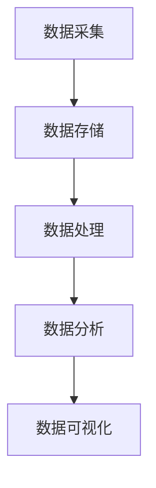
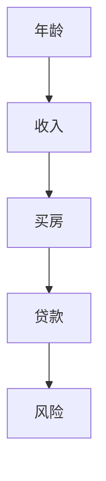

                 

# 大数据创业：洞察未来的商业智慧

> **关键词**：大数据、商业智慧、创业、数据挖掘、人工智能、数据分析、技术架构

> **摘要**：本文将探讨大数据创业领域的发展趋势、核心概念与联系、算法原理、数学模型、实战案例、应用场景以及未来趋势与挑战。通过系统地分析和解读，为创业者提供洞悉未来商业智慧的实用指南。

## 1. 背景介绍

随着互联网和智能设备的普及，数据已经成为新时代的“石油”，其价值愈发凸显。大数据创业成为近年来最为热门的领域之一。创业者通过挖掘海量数据中的价值，为企业提供决策支持、优化运营、提升用户体验，从而实现商业模式的创新和盈利。

大数据创业的核心在于数据挖掘、人工智能、数据分析等技术手段的应用。创业者需要具备丰富的技术背景和敏锐的商业洞察力，才能在激烈的市场竞争中脱颖而出。

本文将围绕大数据创业的核心问题展开讨论，旨在为创业者提供一套完整的技术架构和实践指南，帮助他们在未来的商业世界中抢占先机。

## 2. 核心概念与联系

### 2.1 大数据

大数据（Big Data）是指无法用传统数据处理工具进行捕捉、管理和处理的超大规模数据集。其主要特征为：海量（Volume）、多样（Variety）、高速（Velocity）和价值密度低（Value）。

### 2.2 数据挖掘

数据挖掘（Data Mining）是指从海量数据中提取出有价值的信息和知识的过程。其主要任务包括：分类、聚类、关联规则挖掘、异常检测等。

### 2.3 人工智能

人工智能（Artificial Intelligence，AI）是指通过计算机模拟人类智能的技术。其主要应用包括：自然语言处理、计算机视觉、机器学习、深度学习等。

### 2.4 数据分析

数据分析（Data Analysis）是指通过对数据的收集、清洗、处理、分析和可视化，从中提取有价值的信息和知识的过程。数据分析是大数据创业的核心环节。

### 2.5 技术架构

大数据创业的技术架构包括：数据采集、数据存储、数据处理、数据分析和数据可视化等环节。其中，数据采集、数据存储和数据处理是大数据创业的基础，数据分析是核心。

以下是一个 Mermaid 流程图，展示大数据创业的技术架构：



## 3. 核心算法原理 & 具体操作步骤

### 3.1 数据挖掘算法

数据挖掘算法主要包括：分类、聚类、关联规则挖掘和异常检测等。以下分别介绍这些算法的原理和具体操作步骤。

#### 3.1.1 分类算法

分类算法是指将数据集划分为不同类别的方法。常见的分类算法包括：决策树、支持向量机、K最近邻等。

- 决策树：通过树形结构对数据集进行划分，每个节点表示特征，每个分支表示特征的取值。
- 支持向量机：通过找到数据集的最佳分隔超平面，将不同类别的数据分开。
- K最近邻：根据数据集的相似度，将新数据点归类到与其最相似的类别。

#### 3.1.2 聚类算法

聚类算法是指将数据集划分为若干个不相交的簇，使得同一簇的数据点之间相似度较高，不同簇的数据点之间相似度较低。常见的聚类算法包括：K均值、层次聚类、DBSCAN等。

- K均值：通过迭代计算，将数据点分配到不同的簇中心，使得簇内距离最小，簇间距离最大。
- 层次聚类：根据相似度，将数据点逐步合并，形成层次结构。
- DBSCAN：通过密度聚类，将高密度区域划分为簇，同时处理噪声点和边界点。

#### 3.1.3 关联规则挖掘

关联规则挖掘是指发现数据集中不同属性之间的关联关系。常见的算法包括：Apriori、FP-growth等。

- Apriori：通过扫描数据集，找出频繁项集，进而生成关联规则。
- FP-growth：通过构造FP树，将数据集压缩为最小项集，降低计算复杂度。

#### 3.1.4 异常检测

异常检测是指从数据集中找出异常或非期望的数据点。常见的算法包括：基于统计的方法、基于聚类的方法和基于神经网络的分类方法等。

- 基于统计的方法：通过计算数据点的概率分布，找出概率较低的异常点。
- 基于聚类的方法：通过聚类分析，找出不属于任何簇的异常点。
- 基于神经网络的分类方法：通过训练神经网络，将正常数据和异常数据分类，从中找出异常点。

## 4. 数学模型和公式 & 详细讲解 & 举例说明

### 4.1 决策树

决策树是一种常见的分类算法，其基本原理是通过一系列特征和阈值来划分数据集，从而实现分类。决策树的数学模型可以表示为：

\[ T = \{ (X_i, Y_i) | X_i \in \mathbb{R}^n, Y_i \in \{c_1, c_2, ..., c_k\} \} \]

其中，\( X_i \) 表示数据点，\( Y_i \) 表示数据点的类别，\( c_1, c_2, ..., c_k \) 表示所有可能的类别。

以下是一个简单的决策树示例：



在这个示例中，我们根据年龄、收入、买房和贷款等特征来预测贷款的风险。

### 4.2 支持向量机

支持向量机（SVM）是一种常用的分类算法，其基本原理是找到数据集的最佳分隔超平面，从而实现分类。SVM的数学模型可以表示为：

\[ w \cdot x + b = 0 \]

其中，\( w \) 表示分隔超平面的法向量，\( x \) 表示数据点，\( b \) 表示偏置项。

以下是一个简单的SVM分类问题：

假设我们有两组数据点：

\[ X_1 = \{ (1, 1), (2, 2), (3, 3) \} \]
\[ X_2 = \{ (1, 2), (2, 3), (3, 4) \} \]

我们需要找到一个最佳分隔超平面，将这两组数据点分开。

### 4.3 K均值聚类

K均值聚类是一种常见的聚类算法，其基本原理是将数据点分配到K个簇中，使得簇内距离最小，簇间距离最大。K均值聚类的数学模型可以表示为：

\[ C = \{ C_1, C_2, ..., C_K \} \]

其中，\( C \) 表示簇集合，\( C_k \) 表示第k个簇的中心。

以下是一个简单的K均值聚类示例：

假设我们有如下数据点：

\[ X = \{ (1, 1), (2, 2), (3, 3), (4, 4), (5, 5) \} \]

我们需要将这组数据点划分为2个簇。

## 5. 项目实战：代码实际案例和详细解释说明

### 5.1 开发环境搭建

在本节中，我们将使用Python和Scikit-learn库来实现一个简单的决策树分类器。首先，确保已经安装了Python和Scikit-learn库。如果没有安装，可以通过以下命令进行安装：

```bash
pip install python
pip install scikit-learn
```

### 5.2 源代码详细实现和代码解读

以下是决策树分类器的实现代码：

```python
from sklearn.datasets import load_iris
from sklearn.model_selection import train_test_split
from sklearn.tree import DecisionTreeClassifier
from sklearn.metrics import accuracy_score

# 加载鸢尾花数据集
iris = load_iris()
X = iris.data
y = iris.target

# 划分训练集和测试集
X_train, X_test, y_train, y_test = train_test_split(X, y, test_size=0.2, random_state=42)

# 创建决策树分类器
clf = DecisionTreeClassifier()

# 训练分类器
clf.fit(X_train, y_train)

# 预测测试集
y_pred = clf.predict(X_test)

# 计算准确率
accuracy = accuracy_score(y_test, y_pred)
print("Accuracy:", accuracy)
```

### 5.3 代码解读与分析

以下是代码的详细解读：

- 第1行：导入Scikit-learn库中的iris数据集。
- 第2行：导入Scikit-learn库中的train_test_split函数，用于划分训练集和测试集。
- 第3行：导入Scikit-learn库中的DecisionTreeClassifier类，用于创建决策树分类器。
- 第4行：导入Scikit-learn库中的accuracy_score函数，用于计算准确率。
- 第6行：加载鸢尾花数据集，并将其分为特征矩阵X和目标向量y。
- 第8行：使用train_test_split函数将数据集划分为训练集和测试集，测试集大小为20%。
- 第10行：创建一个决策树分类器实例。
- 第12行：使用fit函数训练分类器。
- 第14行：使用predict函数对测试集进行预测。
- 第16行：计算预测结果与真实结果的准确率。

### 5.4 实际应用案例

假设我们有一家互联网金融公司，需要根据用户的信用评分来预测其违约风险。我们可以使用决策树分类器来实现这一目标。

- 特征：年龄、收入、信用记录、贷款金额、贷款期限等。
- 目标：违约（1）或未违约（0）。

通过训练决策树分类器，我们可以得到一个分类模型，用于预测用户的违约风险。

## 6. 实际应用场景

### 6.1 金融行业

金融行业是大数据创业的主要领域之一。创业者可以通过挖掘用户数据，为银行、保险、基金、证券等金融机构提供风险管理、精准营销、信用评估等服务。

### 6.2 电商行业

电商行业的大数据创业主要集中在用户行为分析、个性化推荐、智能客服等方面。创业者可以通过分析用户购买记录、浏览历史、搜索关键词等数据，为企业提供精准营销策略。

### 6.3 医疗健康

医疗健康领域的大数据创业主要集中在疾病预测、诊断辅助、健康管理等方向。创业者可以通过挖掘患者数据，为医疗机构提供智能诊断、个性化治疗等服务。

### 6.4 交通出行

交通出行领域的大数据创业主要集中在交通流量预测、路线规划、智能调度等方面。创业者可以通过分析交通数据，为交通管理部门提供决策支持，优化交通运行效率。

## 7. 工具和资源推荐

### 7.1 学习资源推荐

- 《大数据之路：阿里巴巴大数据实践》
- 《机器学习实战》
- 《深度学习》
- 《Python数据科学手册》

### 7.2 开发工具框架推荐

- Python
- Scikit-learn
- TensorFlow
- PyTorch

### 7.3 相关论文著作推荐

- "Data-Driven Business: Insights and Opportunities from the World's Most Data-Driven Companies"
- "Big Data for Challenging Applications"
- "Deep Learning Specialization"
- "The Hundred-Page Machine Learning Book"

## 8. 总结：未来发展趋势与挑战

大数据创业正处于快速发展阶段，未来发展趋势主要体现在以下几个方面：

- 技术创新：随着人工智能、深度学习等技术的不断发展，大数据创业将迎来更多创新应用。
- 数据安全：数据安全将成为大数据创业的关键问题，创业者需要关注数据隐私保护、数据加密等关键技术。
- 跨界融合：大数据创业将与其他领域（如医疗健康、金融、交通等）实现跨界融合，形成新的商业模式。

同时，大数据创业也面临以下挑战：

- 数据质量：数据质量直接影响分析结果的准确性，创业者需要关注数据清洗、数据标准化等技术。
- 技术门槛：大数据创业需要具备一定的技术背景，创业者需要不断学习新技术，提升自身竞争力。
- 市场竞争：大数据创业市场竞争激烈，创业者需要找准市场定位，打造差异化优势。

## 9. 附录：常见问题与解答

### 9.1 大数据创业的关键技术有哪些？

大数据创业的关键技术包括：数据挖掘、人工智能、数据分析、数据可视化等。

### 9.2 大数据创业应该关注哪些领域？

大数据创业应该关注金融、电商、医疗健康、交通出行、教育等领域。

### 9.3 大数据创业如何保证数据安全？

大数据创业可以通过数据加密、数据脱敏、权限控制等技术手段来保证数据安全。

## 10. 扩展阅读 & 参考资料

- "Big Data: A Revolution That Will Transform How We Live, Work, and Think" by Viktor Mayer-Schönberger and Kenneth Cukier
- "Data Smart: Using Data Science Techniques for Making Better Decisions" by John Foreman
- "An Introduction to Statistical Learning: With Applications in R" by Gareth James, Daniela Witten, Trevor Hastie, and Robert Tibshirani
- "Deep Learning Specialization" by Andrew Ng

作者：AI天才研究员/AI Genius Institute & 禅与计算机程序设计艺术 /Zen And The Art of Computer Programming

