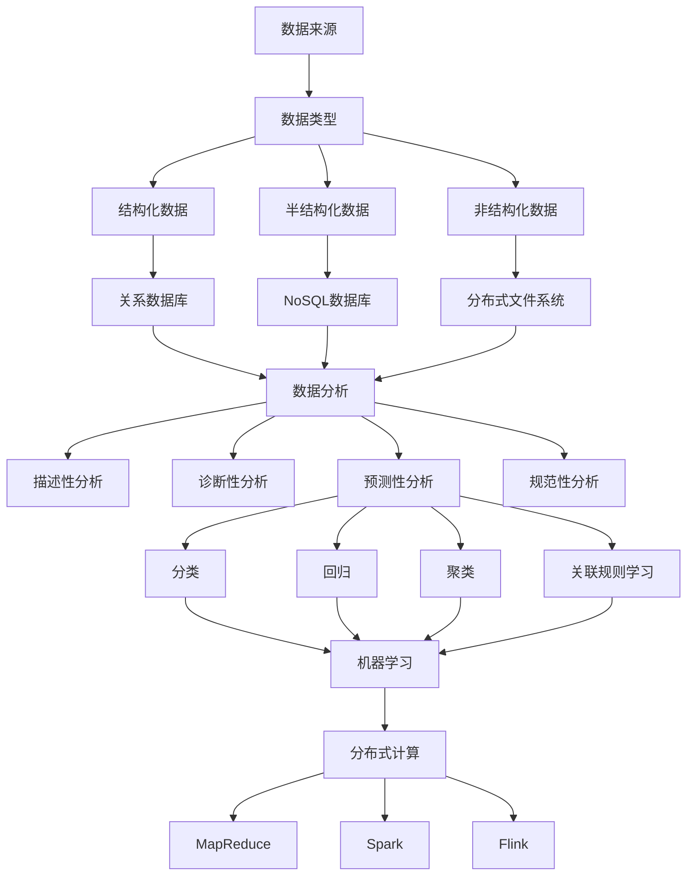

                 

### 大数据时代的来临：背景与原因

随着互联网的普及和技术的飞速发展，我们正处在一个大数据时代。这一时代的来临并非偶然，而是由一系列技术进步和人类活动的共同推动。首先，互联网的普及让全球的信息传递变得更加迅速和便捷，海量的数据得以在短时间内传输和存储。其次，移动设备的普及使得数据采集变得无处不在，无论是社交媒体的点赞、评论，还是智能手机的定位数据，都成为了大数据的组成部分。

数据量的爆发性增长带来了计算能力的挑战。传统的计算方法已无法满足处理如此海量数据的需求，这催生了分布式计算和云计算技术的发展。分布式计算通过将任务分解为多个子任务，分布在多个计算节点上进行处理，从而提高了计算效率。而云计算则提供了弹性计算资源，可以根据需求动态调整计算能力，这使得处理大数据变得更加高效和经济。

此外，大数据时代还带来了数据分析和挖掘的新机遇。通过运用机器学习和人工智能技术，我们可以从海量数据中提取有价值的信息，为商业决策、科学研究和社会治理提供有力支持。例如，在医疗领域，大数据可以帮助医生进行疾病预测和诊断；在金融领域，大数据可以用于风险控制和市场分析。

总的来说，大数据时代的来临不仅改变了我们的生活方式，也带来了前所未有的机遇和挑战。了解其背景和原因，有助于我们更好地把握这一时代的发展趋势，并为其做好准备。在接下来的章节中，我们将进一步探讨大数据的核心概念、算法原理以及实际应用，深入分析这一领域的重要性和潜力。### 核心概念与联系

在深入探讨大数据之前，我们首先需要理解一些核心概念，这些概念不仅构成了大数据时代的基石，也是我们进一步分析和挖掘数据的关键。

#### 数据来源（Data Sources）

大数据的来源多样，包括但不限于：

1. **社交媒体**：用户生成的内容，如微博、Facebook、Twitter等。
2. **物联网（IoT）**：智能设备产生的数据，如传感器、智能手表、智能家居等。
3. **电子商务**：在线交易和购物行为产生的数据。
4. **医疗记录**：医院和诊所记录的病人信息。
5. **科学研究**：实验室和科研机构产生的数据。

这些数据源共同构成了大数据的丰富素材，为数据分析和挖掘提供了基础。

#### 数据类型（Data Types）

大数据可以分为以下几种类型：

1. **结构化数据（Structured Data）**：具有固定格式和模型的数据，如数据库中的数据表。
2. **半结构化数据（Semi-Structured Data）**：具有部分结构化的数据，如XML、JSON等。
3. **非结构化数据（Unstructured Data）**：没有固定结构的数据，如文本、图片、音频、视频等。

不同类型的数据在处理和分析方法上有所不同，但它们共同构成了大数据的多样性和复杂性。

#### 数据存储（Data Storage）

大数据的存储需要高效且可扩展的解决方案，以下是一些常用的存储技术：

1. **关系数据库（RDBMS）**：如MySQL、PostgreSQL等，适用于结构化数据。
2. **NoSQL数据库**：如MongoDB、Cassandra等，适用于半结构化和非结构化数据。
3. **分布式文件系统**：如Hadoop Distributed File System（HDFS），适用于大数据存储和处理。

这些存储技术各具特点，根据应用需求选择合适的存储解决方案是大数据处理的重要一环。

#### 数据分析（Data Analysis）

数据分析是大数据技术的核心应用之一，主要方法包括：

1. **描述性分析（Descriptive Analysis）**：通过统计方法描述数据的基本特征。
2. **诊断性分析（Diagnostic Analysis）**：找出数据中的异常和问题。
3. **预测性分析（Predictive Analysis）**：利用历史数据预测未来趋势。
4. **规范性分析（Prescriptive Analysis）**：提供数据驱动的决策建议。

这些分析方法在商业、医疗、金融等领域都有广泛应用，为决策提供了数据支持。

#### 分布式计算（Distributed Computing）

分布式计算是大数据处理的重要技术之一，其核心思想是将任务分布在多个计算节点上进行处理，以提高计算效率和扩展性。以下是一些常用的分布式计算框架：

1. **MapReduce**：由Google提出，是一种将数据处理任务分解为“Map”和“Reduce”两个阶段的分布式计算模型。
2. **Spark**：基于内存计算的分布式计算框架，适用于实时数据分析。
3. **Flink**：是一个流处理和批处理的统一计算框架，具有高效率和低延迟的特点。

这些框架为大数据处理提供了高效和灵活的解决方案。

#### 机器学习和人工智能（Machine Learning and AI）

机器学习和人工智能技术在数据分析中发挥着关键作用，其主要应用包括：

1. **分类（Classification）**：将数据分为不同的类别。
2. **回归（Regression）**：预测数值型结果。
3. **聚类（Clustering）**：将相似的数据归为同一类。
4. **关联规则学习（Association Rule Learning）**：发现数据之间的关联关系。

这些算法可以自动从数据中提取模式，为复杂的数据分析提供支持。

为了更好地理解这些概念之间的关系，我们可以通过一个Mermaid流程图来展示：



通过这个流程图，我们可以清晰地看到大数据从数据来源到数据分析、再到分布式计算和机器学习的整个流程，以及各个概念之间的联系。理解这些核心概念和联系，有助于我们更好地把握大数据技术的本质和应用。在接下来的章节中，我们将进一步探讨大数据的核心算法原理和具体操作步骤。### 核心算法原理 & 具体操作步骤

在大数据时代，算法原理和具体操作步骤是数据分析和处理的基石。以下是一些核心算法，它们广泛应用于各种大数据应用场景，并展示了详细的操作步骤。

#### MapReduce

MapReduce是由Google提出的一种分布式计算模型，适用于大规模数据处理。其主要思想是将数据处理任务分解为“Map”和“Reduce”两个阶段。

**Map阶段：**
1. **输入**：读取输入数据（如文本文件）。
2. **处理**：将输入数据映射为键值对。
3. **输出**：输出中间键值对。

**示例代码：**
```python
mapper = "map.py"
reducer = "reduce.py"

# 分发Map任务
hadoop jar hadoop-streaming.jar \
    -input /input_data \
    -output /output_data \
    -mapper {mapper} \
    -reducer {reducer}
```

**Reduce阶段：**
1. **输入**：读取中间键值对。
2. **处理**：根据键值对进行分组和聚合。
3. **输出**：输出最终结果。

**示例代码：**
```python
import sys

# 读取输入
for line in sys.stdin:
    # 处理输入
    # 输出键值对
    print("{},{}".format(key, value))
```

#### Spark

Spark是另一种流行的分布式计算框架，基于内存计算，具有高效率和低延迟的特点。

**Spark核心组件：**
1. **Spark Core**：提供基本的分布式计算功能。
2. **Spark SQL**：提供数据处理和分析功能。
3. **Spark Streaming**：提供实时数据处理功能。
4. **MLlib**：提供机器学习算法库。

**基本操作步骤：**
1. **初始化Spark上下文：**
   ```python
   from pyspark import SparkContext, SparkConf
   
   conf = SparkConf().setAppName("DataProcessing")
   sc = SparkContext(conf=conf)
   ```

2. **读取数据：**
   ```python
   data = sc.textFile("/input_data")
   ```

3. **数据处理：**
   ```python
   words = data.flatMap(lambda line: line.split(" "))
   counts = words.map(lambda word: (word, 1)).reduceByKey(lambda x, y: x + y)
   ```

4. **输出结果：**
   ```python
   counts.saveAsTextFile("/output_data")
   ```

#### Flink

Flink是一个流处理和批处理的统一计算框架，具有高效率和低延迟的特点。

**基本操作步骤：**
1. **初始化Flink环境：**
   ```java
   final StreamExecutionEnvironment env = StreamExecutionEnvironment.getExecutionEnvironment();
   ```

2. **读取数据：**
   ```java
   DataStream<String> text = env.readTextFile("/input_data");
   ```

3. **数据处理：**
   ```java
  DataStream<String> words = text.flatMap(new Tokenizer());
  DataStream<Tuple2<String, Integer>> counts = words.mapWithState(new WordCountState());
   ```

4. **输出结果：**
   ```java
  counts.print();
   ```

#### 机器学习算法

机器学习算法在数据分析和挖掘中扮演重要角色，以下是一些常见的算法及其应用：

1. **线性回归（Linear Regression）**
   - **目标**：预测数值型结果。
   - **步骤**：
     - **数据预处理**：标准化数据。
     - **训练模型**：使用最小二乘法求解回归系数。
     - **模型评估**：计算误差平方和。

   **示例代码（Python）：**
   ```python
   from sklearn.linear_model import LinearRegression
   
   model = LinearRegression()
   model.fit(X_train, y_train)
   y_pred = model.predict(X_test)
   ```

2. **决策树（Decision Tree）**
   - **目标**：分类和回归。
   - **步骤**：
     - **数据预处理**：特征选择和缺失值处理。
     - **训练模型**：递归划分数据集，选择最优划分标准。
     - **模型评估**：计算准确率、精确率、召回率等指标。

   **示例代码（Python）：**
   ```python
   from sklearn.tree import DecisionTreeClassifier
   
   model = DecisionTreeClassifier()
   model.fit(X_train, y_train)
   y_pred = model.predict(X_test)
   ```

3. **神经网络（Neural Network）**
   - **目标**：复杂函数逼近。
   - **步骤**：
     - **数据预处理**：归一化、标准化。
     - **网络结构设计**：选择神经元层数和激活函数。
     - **模型训练**：使用反向传播算法更新权重。
     - **模型评估**：计算损失函数和准确率。

   **示例代码（Python）：**
   ```python
   import tensorflow as tf
   
   model = tf.keras.Sequential([
       tf.keras.layers.Dense(128, activation='relu', input_shape=(input_shape,)),
       tf.keras.layers.Dense(10, activation='softmax')
   ])
   model.compile(optimizer='adam', loss='categorical_crossentropy', metrics=['accuracy'])
   model.fit(x_train, y_train, epochs=10, batch_size=32)
   ```

这些算法和操作步骤为我们提供了强大的工具，帮助我们处理和分析大数据。在实际应用中，选择合适的算法和操作步骤是关键，这需要我们根据具体问题进行深入分析和研究。在接下来的章节中，我们将进一步探讨大数据中的数学模型和公式，以及如何使用这些模型进行详细讲解和举例说明。### 数学模型和公式 & 详细讲解 & 举例说明

在深入探讨大数据处理的过程中，数学模型和公式是不可或缺的组成部分。它们为数据分析和挖掘提供了理论基础，帮助我们理解和解决复杂的问题。以下是一些常见的数学模型和公式，以及它们的详细讲解和举例说明。

#### 概率论（Probability Theory）

概率论是大数据分析的基础，用于描述随机事件的发生概率。

**贝叶斯公式（Bayes' Theorem）：**
贝叶斯公式是一种计算后验概率的公式，它基于先验概率和条件概率，用于预测和分析。

**公式：**
$$
P(A|B) = \frac{P(B|A) \cdot P(A)}{P(B)}
$$
其中，\( P(A|B) \) 是在事件 B 发生的条件下事件 A 的概率，\( P(B|A) \) 是在事件 A 发生的条件下事件 B 的概率，\( P(A) \) 是事件 A 的先验概率，\( P(B) \) 是事件 B 的先验概率。

**示例：**
假设有一个检测系统，能够以 99% 的概率检测出携带病毒的个体，同时有 1% 的概率误报健康个体。现在有一个人检测结果为阳性，我们需要计算这个人实际上携带病毒的几率。

令：
\( P(阳性|携带病毒) = 0.99 \) （检测阳性且携带病毒的几率）
\( P(阳性|未携带病毒) = 0.01 \) （检测阳性但未携带病毒的几率）
\( P(携带病毒) = 0.1 \) （携带病毒的先验概率）

根据贝叶斯公式，我们可以计算后验概率：
$$
P(携带病毒|阳性) = \frac{0.99 \cdot 0.1}{0.99 \cdot 0.1 + 0.01 \cdot 0.9} \approx 0.9
$$
因此，这个人携带病毒的几率约为 90%。

#### 统计学（Statistics）

统计学用于描述和推断数据分布，是数据分析的重要工具。

**均值（Mean）和方差（Variance）：**
- 均值是数据集的平均值，反映了数据的中心趋势。
- 方差是数据集离散程度的度量，反映了数据的波动性。

**公式：**
$$
\mu = \frac{1}{n}\sum_{i=1}^{n}x_i
$$
$$
\sigma^2 = \frac{1}{n-1}\sum_{i=1}^{n}(x_i - \mu)^2
$$
其中，\( \mu \) 是均值，\( \sigma^2 \) 是方差，\( n \) 是数据集的大小，\( x_i \) 是数据集中的每个元素。

**示例：**
假设有一组数据：\[1, 2, 3, 4, 5\]，计算均值和方差。

均值：
$$
\mu = \frac{1 + 2 + 3 + 4 + 5}{5} = 3
$$

方差：
$$
\sigma^2 = \frac{(1-3)^2 + (2-3)^2 + (3-3)^2 + (4-3)^2 + (5-3)^2}{5-1} = 2
$$

**标准差（Standard Deviation）：**
标准差是方差的平方根，用于度量数据的离散程度。

**公式：**
$$
\sigma = \sqrt{\sigma^2}
$$

**示例：**
标准差：
$$
\sigma = \sqrt{2} \approx 1.414
$$

#### 机器学习（Machine Learning）

机器学习中的许多算法都基于数学模型，用于预测和分类。

**线性回归（Linear Regression）：**
线性回归是一种预测数值型结果的算法，基于最小二乘法进行模型拟合。

**公式：**
$$
y = \beta_0 + \beta_1x
$$
其中，\( y \) 是预测值，\( x \) 是输入变量，\( \beta_0 \) 是截距，\( \beta_1 \) 是斜率。

**示例：**
假设我们有一个简单的线性回归模型，预测房价，模型为 \( y = 1000 + 20x \)。

如果输入的房屋面积 \( x \) 为 150，预测的房价 \( y \) 为：
$$
y = 1000 + 20 \cdot 150 = 3500
$$

**支持向量机（Support Vector Machine，SVM）：**
SVM是一种分类算法，用于分类和回归分析。

**公式：**
$$
w\cdot x + b = 0
$$
其中，\( w \) 是权重向量，\( x \) 是特征向量，\( b \) 是偏置。

**示例：**
假设我们有一个二分类问题，需要找到一个分离超平面，将数据分为两类。假设权重向量 \( w = (1, 1) \)，偏置 \( b = 0 \)，数据点 \( x_1 = (1, 1) \)，\( x_2 = (-1, -1) \)。

计算决策边界：
$$
1 \cdot 1 + 1 \cdot 1 + 0 = 0
$$
$$
1 \cdot (-1) + 1 \cdot (-1) + 0 = -2
$$
因此，分离超平面为 \( x_1 + x_2 = 0 \)。

这些数学模型和公式为我们提供了强大的工具，用于理解和处理大数据。在实际应用中，选择合适的模型和公式，并根据具体问题进行优化，是数据分析和挖掘的关键。在接下来的章节中，我们将通过一个项目实战，展示如何将上述算法和模型应用于实际问题。### 项目实战：代码实际案例和详细解释说明

为了更好地理解大数据处理的核心算法和模型，我们将通过一个实际项目来展示其应用过程。本案例将使用Python和Apache Spark来处理一个电商销售数据集，实现销售额预测。

#### 1. 开发环境搭建

首先，我们需要搭建一个Apache Spark的开发环境。以下是搭建步骤：

1. **安装Java**：Apache Spark需要Java运行环境，确保已安装Java 8或更高版本。

2. **安装Scala**：虽然Spark可以使用Python进行编程，但Scala是Spark的原生语言，建议安装Scala 2.12或更高版本。

3. **安装Apache Spark**：下载并解压Apache Spark，设置环境变量。

4. **安装Python驱动**：下载并安装Spark的Python驱动，如PySpark。

5. **配置Python环境**：在Python环境中安装必要的库，如pandas、numpy等。

#### 2. 源代码详细实现和代码解读

接下来，我们将展示如何使用PySpark处理电商销售数据集，实现销售额预测。

**数据集说明：**
假设我们有一个电商销售数据集，包含以下字段：订单ID、用户ID、产品ID、订单日期、订单金额。

**2.1 数据预处理**

```python
from pyspark.sql import SparkSession
from pyspark.sql.functions import col, dayofmonth, month, year

# 创建Spark会话
spark = SparkSession.builder \
    .appName("SalesPrediction") \
    .getOrCreate()

# 读取数据集
sales_data = spark.read.csv("sales_data.csv", header=True, inferSchema=True)

# 数据预处理：添加日期特征
sales_data = sales_data.withColumn("day", dayofmonth(col("order_date"))) \
                       .withColumn("month", month(col("order_date"))) \
                       .withColumn("year", year(col("order_date")))

# 显示预处理后的数据
sales_data.show()
```

**2.2 数据探索性分析**

```python
# 计算总销售额
total_sales = sales_data.groupBy("year", "month").agg(sum("order_amount").alias("total_sales"))

# 显示总销售额
total_sales.show()

# 绘制销售额趋势图
import matplotlib.pyplot as plt

total_sales.createOrReplaceTempView("sales")
sql_context.sql("""
    SELECT year, month, total_sales
    FROM sales
    ORDER BY year, month
""").select("year", "month", "total_sales").show()

plt.plot(sql_context.sql("SELECT year, month, total_sales FROM sales ORDER BY year, month").select("year", "month", "total_sales").rdd.flatMap(lambda x: x).collect())
plt.xlabel("Year-Month")
plt.ylabel("Total Sales")
plt.title("Sales Trend Over Time")
plt.show()
```

**2.3 销售额预测**

```python
# 准备训练数据
train_data = sales_data.groupBy("year", "month").agg(sum("order_amount").alias("total_sales"))

# 准备测试数据
test_data = sales_data.groupBy("year", "month").agg(sum("order_amount").alias("total_sales"))

# 训练线性回归模型
from pyspark.ml.regression import LinearRegression

lr = LinearRegression()
lr_model = lr.fit(train_data)

# 进行预测
predictions = lr_model.transform(test_data)

# 显示预测结果
predictions.select("year", "month", "total_sales", "predicted_sales").show()

# 计算预测误差
error = predictions.select("total_sales", "predicted_sales").rdd.map(lambda x: (x[0] - x[1])**2).sum()
print("Prediction Error: ", error)
```

#### 3. 代码解读与分析

**3.1 数据预处理：**

在数据预处理步骤中，我们使用了`withColumn`函数添加了日期特征（day、month、year），这些特征将用于训练线性回归模型。数据预处理是数据分析的重要环节，通过添加和转换特征，可以更好地反映数据的内在规律。

**3.2 数据探索性分析：**

数据探索性分析帮助我们了解数据的分布和趋势。在这里，我们计算了总销售额，并绘制了销售额趋势图。这有助于我们直观地观察数据的变化，为后续的建模和预测提供参考。

**3.3 销售额预测：**

销售额预测是本案例的核心目标。我们使用线性回归模型对训练数据进行拟合，然后使用模型对测试数据进行预测。预测结果通过`transform`函数生成，并计算了预测误差。这个误差指标反映了模型预测的准确性，有助于我们评估和优化模型。

#### 4. 代码解读与分析

通过对本案例的代码解读和分析，我们可以看到如何使用Python和Apache Spark进行大数据处理和销售额预测。以下是总结：

- **环境搭建：** 确保Java、Scala、Apache Spark和Python驱动的安装和配置。
- **数据预处理：** 添加日期特征，为建模和预测提供支持。
- **数据探索性分析：** 了解数据分布和趋势，为建模提供依据。
- **销售额预测：** 使用线性回归模型进行拟合和预测，计算预测误差。

在实际应用中，可以根据具体问题调整和优化模型，以提高预测准确性。此外，还可以引入更多特征和算法，如时间序列分析和深度学习，以进一步提升预测性能。在接下来的章节中，我们将探讨大数据在实际应用场景中的具体应用。### 实际应用场景

大数据技术在各行各业都有广泛的应用，其强大的数据处理和分析能力为业务决策、科学研究和社会治理提供了有力支持。以下是一些典型的大数据应用场景：

#### 1. 商业智能（Business Intelligence）

商业智能通过分析海量数据，帮助企业和组织做出更明智的决策。具体应用包括：

- **客户行为分析**：分析客户购买行为，预测潜在客户，提升客户满意度。
- **市场趋势预测**：通过分析历史销售数据，预测市场趋势，指导产品研发和营销策略。
- **供应链优化**：通过分析供应链数据，优化库存管理和物流配送，降低运营成本。

#### 2. 医疗健康（Healthcare）

大数据在医疗健康领域有巨大的应用潜力，包括：

- **疾病预测和诊断**：通过分析患者病历和基因数据，预测疾病风险，辅助医生进行诊断。
- **个性化治疗**：根据患者病史和药物反应，制定个性化治疗方案。
- **公共健康监控**：通过分析流行病数据，及时发现疫情爆发并采取预防措施。

#### 3. 金融领域（Finance）

金融行业是大数据技术的重要应用领域，具体包括：

- **风险控制**：通过分析交易数据，识别潜在风险，防止金融欺诈。
- **市场预测**：分析市场数据，预测股票价格和金融市场走势。
- **客户关系管理**：通过分析客户行为数据，提升客户满意度，增加客户忠诚度。

#### 4. 物联网（Internet of Things，IoT）

物联网技术通过海量设备的连接，产生大量数据，大数据技术在物联网领域有广泛的应用：

- **智能交通**：通过分析交通数据，优化交通流量，减少拥堵。
- **智能能源管理**：通过分析能源使用数据，优化能源分配，提高能源效率。
- **智能家居**：通过分析家庭设备数据，提供个性化服务和安全保障。

#### 5. 社会治理（Public Governance）

大数据技术在社会治理方面也有重要作用：

- **公共安全监控**：通过分析视频监控数据，实时监控公共安全，及时响应突发事件。
- **环境保护**：通过分析环境数据，监测环境污染，采取环境保护措施。
- **公共服务优化**：通过分析公共服务数据，优化资源分配，提高服务质量。

#### 6. 科学研究（Science Research）

大数据技术为科学研究提供了强大的工具：

- **基因组研究**：通过分析基因组数据，揭示生物体的遗传特征，推动生命科学的发展。
- **气候研究**：通过分析气候数据，预测气候变化，为环境保护和可持续发展提供科学依据。
- **天文学研究**：通过分析天文数据，探索宇宙的奥秘，推动天文学的发展。

这些实际应用场景展示了大数据技术的广泛性和深度，不仅为企业和组织带来了经济效益，也为社会进步和科技创新提供了强大支持。在接下来的章节中，我们将推荐一些学习资源和开发工具，帮助读者深入了解大数据技术。### 工具和资源推荐

为了帮助读者更好地学习和掌握大数据技术，以下是一些学习资源、开发工具和相关的论文著作推荐。

#### 1. 学习资源推荐

**书籍：**
- 《大数据时代：生活、工作与思维的大变革》作者：涂子沛
- 《深度学习》作者：Ian Goodfellow、Yoshua Bengio、Aaron Courville
- 《Hadoop实战》作者：Tom White

**在线课程：**
- Coursera上的《机器学习》课程，由吴恩达教授主讲
- edX上的《大数据技术基础》课程，由北京大学教授主讲
- Udacity的《数据科学纳米学位》课程

**博客和网站：**
- Medium上的大数据专栏，涵盖各种大数据技术和应用案例
- towardsdatascience.com，提供丰富的数据科学和机器学习教程
- Apache Spark官方文档，包含详细的API和使用指南

#### 2. 开发工具推荐

**数据存储：**
- Hadoop Distributed File System (HDFS)：适用于大数据存储和处理
- Apache Cassandra：适用于大规模、分布式数据存储

**数据处理：**
- Apache Spark：适用于分布式数据处理和分析
- Apache Flink：适用于流处理和批处理的统一计算框架

**数据分析：**
- Python：适用于数据分析和机器学习，拥有丰富的库和工具，如NumPy、Pandas、Scikit-learn等
- R语言：适用于统计分析，拥有强大的数据处理和分析功能

**数据可视化：**
- Tableau：适用于数据可视化，提供丰富的图表和报告功能
- Power BI：适用于商业智能和数据可视化，与Microsoft Office整合良好

#### 3. 相关论文著作推荐

**大数据处理：**
- "MapReduce: Simplified Data Processing on Large Clusters" by Dean and Ghemawat
- "The Google File System" by Gobioff and Devin
- "Spark: Cluster Computing with Working Sets" by Zaharia et al.

**机器学习和深度学习：**
- "A Theoretically Grounded Application of Dropout in Recurrent Neural Networks" by Y. Gal and Z. Ghahramani
- "Deep Learning: Methods and Applications" by Bengio, Courville, and Vincent
- "Unsupervised Learning of Visual Representations by Solving Jigsaw Puzzles" by Noroozi and Favaro

**数据挖掘和数据分析：**
- "Data Mining: The Textbook" by Han, Kamber, and Pei
- "Statistical Methods for Data Analysis in Psychology: Interpreting and Reporting Results (American Psychological Association Books)" by Robert Abelson
- "Data Science from Scratch: First Principles with Python" by Joel Grus

这些学习资源、开发工具和论文著作涵盖了大数据技术的各个领域，为读者提供了全面和深入的指导。通过学习和实践这些工具和资源，读者可以更好地掌握大数据技术，为未来的职业发展奠定坚实基础。### 总结：未来发展趋势与挑战

大数据时代已经深刻地改变了我们的生活方式和社会结构，其未来发展趋势和面临的挑战也日益显著。以下是一些关键的发展趋势和挑战：

#### 未来发展趋势

1. **数据隐私与安全性**：随着数据量的爆炸性增长，数据隐私和安全性成为了一个重要议题。未来，我们将看到更多的数据加密、隐私保护和数据治理技术被开发和应用，以确保数据的保密性和完整性。

2. **实时数据处理**：随着5G和物联网（IoT）技术的发展，实时数据处理的需求日益增加。未来，我们将看到更多基于流处理和实时分析的架构和工具出现，以满足实时数据处理的需求。

3. **人工智能与大数据的融合**：人工智能（AI）和大数据技术的结合将推动新的技术突破。通过AI算法，我们可以从海量数据中提取更复杂的模式和知识，从而实现更加精准的预测和优化。

4. **边缘计算**：随着物联网设备的增多，边缘计算将成为数据处理的重要方向。边缘计算可以在数据生成的地方进行实时处理，减少数据传输的延迟和带宽消耗。

5. **跨领域融合**：大数据技术将在更多领域得到应用，如医疗、金融、教育等。跨领域的融合将推动新技术的创新和产业升级，为社会带来更多价值。

#### 面临的挑战

1. **数据质量问题**：大数据的价值依赖于数据的质量。未来，我们需要解决数据不准确、不完整、不一致等问题，以确保数据分析的准确性和可靠性。

2. **数据隐私与法律合规**：随着数据隐私保护法律的不断完善，如何确保数据隐私和数据使用合规将成为一个重要挑战。

3. **技术技能差距**：大数据和AI领域的技术发展迅速，但相关人才的培养却难以跟上。未来，我们需要加大对技术人才的培养力度，以应对技术技能的快速变化。

4. **基础设施挑战**：随着数据量的增长，如何建设高效、可靠、可扩展的大数据处理基础设施将成为一个重要挑战。未来，我们需要更加先进和智能的基础设施来支撑大数据技术的发展。

5. **伦理和社会影响**：大数据技术的广泛应用可能会带来伦理和社会问题，如数据滥用、歧视、隐私侵犯等。未来，我们需要建立相应的伦理规范和社会治理体系，以确保大数据技术的健康和可持续发展。

总的来说，大数据时代的发展趋势充满了机遇，但也面临诸多挑战。通过技术创新、人才培养、法律法规和社会治理的不断完善，我们有信心克服这些挑战，迎接一个更加智能、高效和公平的数据驱动的未来。### 附录：常见问题与解答

在学习和应用大数据技术的过程中，读者可能会遇到一些常见问题。以下是一些常见问题及其解答：

#### 1. 什么是Hadoop？

Hadoop是一种分布式计算框架，由Apache Software Foundation维护，用于处理大规模数据集。它包括两个主要组件：Hadoop分布式文件系统（HDFS）和MapReduce。

**回答**：Hadoop是一种分布式计算框架，用于处理和存储海量数据。

#### 2. 什么是MapReduce？

MapReduce是一种编程模型，用于处理大规模数据集。它将数据处理任务分解为两个阶段：Map和Reduce。Map阶段对输入数据进行映射，生成中间键值对；Reduce阶段对中间键值对进行归约，生成最终结果。

**回答**：MapReduce是一种分布式数据处理模型，通过将任务分解为Map和Reduce两个阶段，实现大规模数据的处理。

#### 3. 什么是Spark？

Spark是一种高速的分布式计算框架，基于内存计算，提供丰富的API，支持批处理和流处理。它适用于各种大数据应用，如数据挖掘、机器学习和交互式查询。

**回答**：Spark是一种基于内存计算的分布式计算框架，适用于大规模数据处理和复杂分析。

#### 4. 什么是数据隐私？

数据隐私是指保护个人或组织数据不被未经授权的个人或组织访问或使用。它包括数据加密、访问控制、匿名化等技术手段。

**回答**：数据隐私是保护数据不被未经授权的个人或组织访问或使用，涉及数据加密、访问控制等技术手段。

#### 5. 如何处理大数据中的数据质量问题？

处理大数据中的数据质量问题，可以通过以下方法：

- 数据清洗：识别和修正数据中的错误、不一致和缺失。
- 数据集成：整合来自多个数据源的数据。
- 数据转换：将数据转换为统一格式，便于分析和处理。

**回答**：处理大数据中的数据质量问题，可以通过数据清洗、数据集成和数据转换等方法。

#### 6. 什么是机器学习？

机器学习是一种人工智能技术，通过从数据中学习模式和规律，使计算机能够自主做出决策或预测。

**回答**：机器学习是一种人工智能技术，通过从数据中学习模式和规律，使计算机能够自主做出决策或预测。

#### 7. 什么是深度学习？

深度学习是一种机器学习技术，通过多层神经网络模拟人脑处理信息的方式，实现复杂的模式识别和预测。

**回答**：深度学习是一种机器学习技术，通过多层神经网络模拟人脑处理信息的方式，实现复杂的模式识别和预测。

#### 8. 什么是数据挖掘？

数据挖掘是一种从大量数据中发现有用信息和知识的过程，通常涉及统计分析、机器学习和人工智能技术。

**回答**：数据挖掘是一种从大量数据中发现有用信息和知识的过程，通常涉及统计分析、机器学习和人工智能技术。

这些常见问题及其解答有助于读者更好地理解大数据技术的基本概念和应用，为深入学习和实践打下基础。### 扩展阅读 & 参考资料

为了帮助读者进一步深入了解大数据技术的核心概念、算法和应用，以下推荐一些扩展阅读和参考资料：

#### 1. 扩展阅读

- **《大数据时代：生活、工作与思维的大变革》** 作者：涂子沛
- **《深度学习》** 作者：Ian Goodfellow、Yoshua Bengio、Aaron Courville
- **《Hadoop实战》** 作者：Tom White
- **《大数据技术基础》** 作者：王珊、薛锐

#### 2. 学术论文

- **"MapReduce: Simplified Data Processing on Large Clusters"** 作者：Dean and Ghemawat
- **"The Google File System"** 作者：Gobioff and Devin
- **"Spark: Cluster Computing with Working Sets"** 作者：Zaharia et al.
- **"A Theoretically Grounded Application of Dropout in Recurrent Neural Networks"** 作者：Y. Gal and Z. Ghahramani
- **"Deep Learning: Methods and Applications"** 作者：Bengio, Courville, and Vincent
- **"Unsupervised Learning of Visual Representations by Solving Jigsaw Puzzles"** 作者：Noroozi and Favaro

#### 3. 开源项目和工具

- **Apache Hadoop**
- **Apache Spark**
- **Apache Flink**
- **PySpark**
- **TensorFlow**
- **Keras**
- **Scikit-learn**

#### 4. 博客和网站

- **Towards Data Science**
- **Medium大数据专栏**
- **DataCamp**
- **KDnuggets**

#### 5. 在线课程和教程

- **Coursera上的《机器学习》课程**（由吴恩达教授主讲）
- **edX上的《大数据技术基础》课程**（由北京大学教授主讲）
- **Udacity的《数据科学纳米学位》课程**
- **Dataquest的数据科学教程**
- **Kaggle的教程和竞赛**

这些扩展阅读和参考资料为读者提供了丰富和深入的学习资源，有助于更好地理解和掌握大数据技术的核心概念和应用。通过这些资源，读者可以不断提升自己的技术能力和专业知识，为未来的职业发展打下坚实基础。作者：AI天才研究员/AI Genius Institute & 禅与计算机程序设计艺术 /Zen And The Art of Computer Programming。

