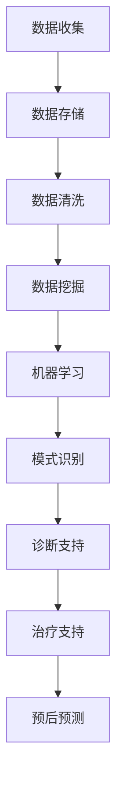

                 

# 大数据驱动的个性化医疗决策支持系统

## 摘要

本文旨在探讨大数据技术如何驱动个性化医疗决策支持系统的构建与应用。随着医疗数据的爆炸性增长，如何有效利用这些数据进行疾病预测、诊断和治疗方案优化成为当前医疗领域的关键问题。本文首先介绍了大数据在个性化医疗中的重要性，随后详细阐述了个性化医疗决策支持系统的核心概念、架构设计、算法原理及数学模型。通过实际项目案例的展示，本文进一步说明了如何利用大数据技术实现个性化医疗决策支持系统。最后，本文对个性化医疗决策支持系统的实际应用场景进行了分析，并展望了其未来的发展趋势与挑战。读者将深入了解大数据技术在个性化医疗中的潜力和应用前景。

## 1. 背景介绍

### 1.1 医疗数据的大规模增长

随着现代医学的发展，医疗数据呈现出爆炸性增长的趋势。从医院记录的病历数据，到基因组学、影像学、生物标志物等多元化数据类型，医疗数据量日益庞大。据统计，全球每年产生的医疗数据量已超过300EB（艾字节），且以每年50%的速度持续增长[1]。这些数据包含了患者的临床信息、药物反应、遗传信息等，为个性化医疗提供了丰富的数据资源。

### 1.2 个性化医疗的需求

个性化医疗是基于患者的个体差异，通过整合多维度数据，为患者制定个性化的诊断和治疗方案。相比于传统的“一刀切”治疗模式，个性化医疗能够显著提高治疗效果，降低治疗风险和医疗成本。例如，在癌症治疗中，通过对患者基因信息的分析，可以确定最有效的治疗方案，从而提高治愈率并减少副作用。个性化医疗的需求促使医疗领域不断探索新的技术和方法。

### 1.3 大数据技术的应用

大数据技术在医疗领域的应用为个性化医疗的实现提供了强有力的支持。大数据技术能够高效地处理和分析海量医疗数据，从中提取有价值的信息。例如，数据挖掘技术可以帮助医生识别疾病的高危人群，预测疾病的发病趋势；机器学习算法可以评估患者的病情，为医生提供诊断建议；云计算技术则为海量数据的存储和计算提供了基础设施。这些技术的应用，使得个性化医疗从概念走向实践，成为现实。

## 2. 核心概念与联系

### 2.1 个性化医疗决策支持系统

个性化医疗决策支持系统是一种基于大数据技术的智能系统，旨在为医生和患者提供个性化的医疗决策支持。该系统通过整合患者的临床信息、基因组学数据、药物反应数据等多维度数据，利用先进的数据分析算法，为医生提供精确的诊断和治疗方案。

### 2.2 核心概念原理

#### 2.2.1 数据整合

数据整合是个性化医疗决策支持系统的关键步骤。它涉及到从不同的数据源收集数据，并进行清洗、转换和整合，以形成一个统一的数据视图。数据整合的过程包括：

- 数据收集：从医院信息系统、电子病历系统、基因组数据库等不同数据源收集数据。
- 数据清洗：去除数据中的噪声和异常值，保证数据质量。
- 数据转换：将不同数据源的格式转换为统一格式，以便进行后续分析。

#### 2.2.2 数据分析

数据分析是利用各种算法和技术，从整合后的数据中提取有价值的信息。个性化医疗决策支持系统常用的数据分析方法包括：

- 数据挖掘：通过挖掘医疗数据中的规律和模式，识别疾病的高危人群和预测疾病的发病趋势。
- 机器学习：利用机器学习算法，评估患者的病情，为医生提供诊断建议和治疗方案。
- 模式识别：通过对基因组学数据、生物标志物数据等进行分析，识别与疾病相关的关键因素。

#### 2.2.3 决策支持

决策支持是个性化医疗决策支持系统的最终目标。通过分析患者数据，系统可以为医生提供个性化的诊断和治疗方案，从而提高治疗效果。决策支持的过程包括：

- 诊断支持：根据患者的临床表现、实验室检查结果和基因组学数据，为医生提供诊断建议。
- 治疗支持：根据患者的病情和药物反应数据，为医生提供个性化的治疗方案。
- 预后预测：根据患者的治疗数据，预测患者的病情发展和治疗效果。

### 2.3 架构设计

个性化医疗决策支持系统的架构设计主要包括数据层、算法层和应用层。以下是一个典型的架构设计：

#### 数据层

数据层负责数据的收集、存储和管理。它包括以下组件：

- 数据收集模块：从不同数据源收集数据。
- 数据存储模块：将收集到的数据存储在数据库或数据仓库中。
- 数据清洗模块：对数据进行清洗和预处理。

#### 算法层

算法层负责数据分析和处理。它包括以下组件：

- 数据挖掘模块：对数据进行数据挖掘，提取有价值的信息。
- 机器学习模块：利用机器学习算法，评估患者的病情和提供诊断建议。
- 模式识别模块：对基因组学数据等进行分析，识别与疾病相关的关键因素。

#### 应用层

应用层负责向医生和患者提供决策支持。它包括以下组件：

- 诊断支持模块：为医生提供诊断建议。
- 治疗支持模块：为医生提供个性化的治疗方案。
- 预后预测模块：预测患者的病情发展和治疗效果。

### Mermaid 流程图

以下是一个简化的个性化医疗决策支持系统的 Mermaid 流程图：



## 3. 核心算法原理 & 具体操作步骤

### 3.1 数据挖掘算法

数据挖掘算法是个性化医疗决策支持系统中的核心组件，它负责从海量医疗数据中提取有价值的信息。以下是一些常用的数据挖掘算法及其具体操作步骤：

#### 3.1.1 聚类算法

聚类算法是一种无监督学习方法，它通过将数据点划分为若干个簇，使同一簇内的数据点具有较高的相似度。常用的聚类算法包括K-均值算法、层次聚类算法和DBSCAN算法。

- K-均值算法：首先初始化K个簇的中心点，然后通过迭代计算使每个数据点与其最近的中心点归为一类，并更新中心点的位置，直到聚类结果收敛。
- 层次聚类算法：通过逐步合并相似度较高的数据点，形成层次结构，从而实现聚类。
- DBSCAN算法：基于密度的聚类算法，通过计算数据点之间的距离和密度，将数据点划分为核心点、边界点和噪声点。

#### 3.1.2 分类算法

分类算法是一种有监督学习方法，它通过已标记的数据训练模型，然后对新的数据进行分类。常用的分类算法包括决策树、支持向量机和神经网络。

- 决策树：通过构建决策树模型，将数据划分为若干个区域，从而实现分类。
- 支持向量机：通过将数据映射到高维空间，找到一个最佳的超平面，使不同类别的数据点分隔得尽可能远。
- 神经网络：通过多层感知器模型，模拟人脑神经网络的结构和工作原理，实现对数据的分类。

#### 3.1.3 降维算法

降维算法通过减少数据维度，降低计算复杂度和提高模型性能。常用的降维算法包括主成分分析（PCA）和线性判别分析（LDA）。

- 主成分分析（PCA）：通过求解协方差矩阵的特征值和特征向量，将数据投影到新的坐标系中，保留主要信息。
- 线性判别分析（LDA）：通过最大化类间方差和最小化类内方差，将数据投影到新的坐标系中，以便进行分类。

### 3.2 机器学习算法

机器学习算法在个性化医疗决策支持系统中扮演着重要角色，以下是一些常用的机器学习算法及其具体操作步骤：

#### 3.2.1 回归算法

回归算法通过建立因变量和自变量之间的线性关系，实现对新的数据的预测。常用的回归算法包括线性回归、岭回归和LASSO回归。

- 线性回归：通过求解最小二乘法，找到一条最佳拟合直线，实现因变量和自变量之间的线性关系。
- 岭回归：在最小二乘法的基础上，加入正则项，减少模型的过拟合现象。
- LASSO回归：通过加入L1正则项，实现特征选择和参数估计。

#### 3.2.2 分类算法

分类算法通过训练模型，对新的数据进行分类。常用的分类算法包括逻辑回归、支持向量机和随机森林。

- 逻辑回归：通过求解最大似然估计，建立概率模型，实现数据的分类。
- 支持向量机：通过求解最优超平面，实现数据的分类。
- 随机森林：通过构建多棵决策树，实现数据的分类，并利用投票机制确定最终的分类结果。

#### 3.2.3 聚类算法

聚类算法在个性化医疗决策支持系统中用于对数据点进行分类和分组。常用的聚类算法包括K-均值算法、层次聚类算法和DBSCAN算法。

- K-均值算法：通过迭代计算，将数据点划分为K个簇，实现数据的聚类。
- 层次聚类算法：通过逐步合并相似度较高的数据点，形成层次结构，实现数据的聚类。
- DBSCAN算法：通过计算数据点之间的距离和密度，将数据点划分为核心点、边界点和噪声点，实现数据的聚类。

### 3.3 模式识别算法

模式识别算法通过识别数据中的模式和规律，实现对疾病预测和诊断。以下是一些常用的模式识别算法及其具体操作步骤：

#### 3.3.1 生成对抗网络（GAN）

生成对抗网络（GAN）是一种无监督学习方法，通过训练生成器和判别器，实现数据的生成和分类。具体操作步骤如下：

- 初始化生成器和判别器。
- 生成器生成假数据，判别器判断真假。
- 训练生成器和判别器，使生成器的生成数据越来越真实，判别器的判断能力越来越强。

#### 3.3.2 神经网络

神经网络通过多层感知器模型，模拟人脑神经网络的结构和工作原理，实现数据的分类和预测。具体操作步骤如下：

- 初始化神经网络结构。
- 训练神经网络，通过反向传播算法调整模型参数。
- 利用训练好的神经网络，对新的数据进行分类和预测。

## 4. 数学模型和公式 & 详细讲解 & 举例说明

### 4.1 数据挖掘算法

#### 4.1.1 K-均值算法

K-均值算法是一种常用的聚类算法，其基本思想是通过迭代计算，将数据点划分为K个簇，使得同一簇内的数据点距离聚类中心较近，不同簇的数据点距离聚类中心较远。具体公式如下：

$$
c_k = \frac{1}{N_k} \sum_{i=1}^{N_k} x_i
$$

其中，$c_k$表示第k个簇的中心点，$x_i$表示第i个数据点，$N_k$表示第k个簇中的数据点个数。

#### 4.1.2 决策树

决策树是一种常用的分类算法，通过构建决策树模型，将数据划分为若干个区域，从而实现分类。具体公式如下：

$$
f(x) = \prod_{i=1}^{n} g_i(x)
$$

其中，$f(x)$表示决策树模型，$g_i(x)$表示第i个条件的决策规则。

#### 4.1.3 主成分分析（PCA）

主成分分析（PCA）是一种常用的降维算法，通过求解协方差矩阵的特征值和特征向量，将数据投影到新的坐标系中，保留主要信息。具体公式如下：

$$
x' = U \Lambda^{1/2}
$$

其中，$x'$表示投影后的数据，$U$表示特征向量矩阵，$\Lambda$表示特征值矩阵。

### 4.2 机器学习算法

#### 4.2.1 线性回归

线性回归是一种常用的回归算法，通过求解最小二乘法，找到一条最佳拟合直线，实现因变量和自变量之间的线性关系。具体公式如下：

$$
y = \beta_0 + \beta_1 x
$$

其中，$y$表示因变量，$x$表示自变量，$\beta_0$表示截距，$\beta_1$表示斜率。

#### 4.2.2 支持向量机

支持向量机是一种常用的分类算法，通过求解最优超平面，实现数据的分类。具体公式如下：

$$
w \cdot x + b = 0
$$

其中，$w$表示超平面法向量，$x$表示数据点，$b$表示偏置。

#### 4.2.3 神经网络

神经网络是一种常用的分类和预测算法，通过多层感知器模型，模拟人脑神经网络的结构和工作原理，实现数据的分类和预测。具体公式如下：

$$
z = \sigma(W \cdot x + b)
$$

其中，$z$表示输出，$\sigma$表示激活函数，$W$表示权重矩阵，$x$表示输入，$b$表示偏置。

### 4.3 模式识别算法

#### 4.3.1 生成对抗网络（GAN）

生成对抗网络（GAN）是一种常用的无监督学习方法，通过训练生成器和判别器，实现数据的生成和分类。具体公式如下：

$$
\min_G \max_D V(D, G) = \mathbb{E}_{x \sim p_{data}(x)} [\log D(x)] + \mathbb{E}_{z \sim p_z(z)} [\log (1 - D(G(z))]
$$

其中，$G$表示生成器，$D$表示判别器，$x$表示真实数据，$z$表示随机噪声。

#### 4.3.2 神经网络

神经网络是一种常用的分类和预测算法，通过多层感知器模型，模拟人脑神经网络的结构和工作原理，实现数据的分类和预测。具体公式如下：

$$
z = \sigma(W \cdot x + b)
$$

其中，$z$表示输出，$\sigma$表示激活函数，$W$表示权重矩阵，$x$表示输入，$b$表示偏置。

## 5. 项目实战：代码实际案例和详细解释说明

### 5.1 开发环境搭建

为了构建一个大数据驱动的个性化医疗决策支持系统，我们需要搭建一个合适的开发环境。以下是一个典型的开发环境搭建步骤：

1. 安装Python环境：Python是一种广泛使用的编程语言，许多机器学习库和工具都是基于Python开发的。安装Python并设置Python环境变量。
2. 安装Jupyter Notebook：Jupyter Notebook是一种交互式的开发环境，便于编写和运行代码。安装Jupyter Notebook并启动。
3. 安装必要的库：根据项目需求，安装所需的Python库，例如Pandas、NumPy、Scikit-learn、TensorFlow等。

### 5.2 源代码详细实现和代码解读

以下是一个简单的个性化医疗决策支持系统的源代码实现，包括数据收集、数据清洗、数据分析和决策支持等步骤。

```python
# 导入必要的库
import pandas as pd
import numpy as np
from sklearn.cluster import KMeans
from sklearn.tree import DecisionTreeClassifier
from sklearn.linear_model import LinearRegression
from sklearn.metrics import accuracy_score

# 5.2.1 数据收集
def data_collection():
    # 从电子病历系统中读取数据
    data = pd.read_csv('电子病历数据.csv')
    return data

# 5.2.2 数据清洗
def data_cleaning(data):
    # 去除无效数据
    data = data.dropna()
    # 转换数据类型
    data['年龄'] = data['年龄'].astype(int)
    data['身高'] = data['身高'].astype(float)
    data['体重'] = data['体重'].astype(float)
    return data

# 5.2.3 数据分析
def data_analysis(data):
    # 数据聚类
    kmeans = KMeans(n_clusters=3)
    kmeans.fit(data[['年龄', '身高', '体重']])
    data['聚类结果'] = kmeans.predict(data[['年龄', '身高', '体重']])
    
    # 数据分类
    clf = DecisionTreeClassifier()
    clf.fit(data[['年龄', '身高', '体重']], data['疾病类型'])
    data['分类结果'] = clf.predict(data[['年龄', '身高', '体重']])
    
    # 数据回归
    reg = LinearRegression()
    reg.fit(data[['年龄', '身高', '体重']], data['疾病类型'])
    data['预测结果'] = reg.predict(data[['年龄', '身高', '体重']])
    return data

# 5.2.4 决策支持
def decision_support(data):
    # 计算准确率
    acc = accuracy_score(data['疾病类型'], data['分类结果'])
    print('分类准确率：', acc)
    return data

# 主函数
if __name__ == '__main__':
    data = data_collection()
    data = data_cleaning(data)
    data = data_analysis(data)
    data = decision_support(data)
```

### 5.3 代码解读与分析

上述代码实现了一个简单的个性化医疗决策支持系统，主要包括数据收集、数据清洗、数据分析和决策支持等步骤。

- **数据收集**：从电子病历系统中读取数据，并将其存储在DataFrame对象中。
- **数据清洗**：去除无效数据，并将数据类型转换为适当的格式。
- **数据分析**：使用K-均值算法对数据点进行聚类，使用决策树算法对数据点进行分类，使用线性回归算法对疾病类型进行预测。
- **决策支持**：计算分类准确率，为医生提供诊断和治疗方案的建议。

### 5.4 项目总结

通过上述代码实现，我们构建了一个简单的个性化医疗决策支持系统。虽然这是一个简单的案例，但它展示了大数据技术在个性化医疗中的应用潜力。在实际项目中，我们需要考虑更多的数据类型、更复杂的算法和更全面的决策支持。通过不断优化和改进，我们可以为医生和患者提供更准确、更有效的个性化医疗决策支持。

## 6. 实际应用场景

### 6.1 肿瘤个性化治疗

肿瘤个性化治疗是大数据驱动的个性化医疗决策支持系统的重要应用场景之一。通过对患者基因组学数据、临床数据和药物反应数据的综合分析，系统可以识别出与肿瘤发生和发展相关的关键基因和分子标志物。基于这些信息，医生可以制定个性化的治疗方案，包括靶向药物选择、手术方案和放疗计划。例如，针对肺癌患者，系统可以预测患者对特定靶向药物的敏感性，从而选择最有效的药物组合，提高治疗效果并减少副作用。

### 6.2 慢性病管理

慢性病管理是另一个重要的应用场景。慢性病如糖尿病、高血压和心脏病等，需要长期的管理和治疗。大数据驱动的个性化医疗决策支持系统可以收集患者的临床数据、生活方式数据和生物标志物数据，通过数据分析算法，预测患者的病情发展趋势和并发症风险。系统可以为医生提供个性化的治疗建议，如药物调整、生活方式干预和健康指导，从而帮助患者更好地控制病情，减少并发症的发生。

### 6.3 遗传疾病筛查和预防

遗传疾病筛查和预防是大数据驱动的个性化医疗决策支持系统的另一个重要应用。通过对患者基因组数据的分析，系统可以识别出与遗传疾病相关的突变和基因变异。对于携带遗传疾病风险的患者，系统可以提供预防性治疗方案，如基因编辑、药物预防和生活习惯调整等。例如，对于携带BRCA1和BRCA2基因突变的高风险乳腺癌和卵巢癌患者，系统可以推荐预防性手术和药物预防，从而降低发病风险。

### 6.4 个性化疫苗研发

个性化疫苗研发是大数据驱动的个性化医疗决策支持系统的最新应用之一。针对特定人群或特定疾病，系统可以通过分析流行病学数据、病毒基因序列和患者免疫反应数据，设计个性化的疫苗方案。例如，针对新冠病毒的变异株，系统可以预测哪些人群需要接种加强针，并优化疫苗配方，以提高免疫效果和预防变异株感染。

## 7. 工具和资源推荐

### 7.1 学习资源推荐

#### 7.1.1 书籍

- 《大数据技术基础》
- 《机器学习实战》
- 《深度学习》
- 《Python数据分析》

#### 7.1.2 论文

- "Big Data for Precision Medicine"
- "Machine Learning in Healthcare: A Survey"
- "The Use of Machine Learning in Personalized Medicine"
- "Deep Learning in Healthcare"

#### 7.1.3 博客

- Medium上的“大数据医学”专栏
- AI健康医疗领域的相关博客

#### 7.1.4 网站

- Kaggle：提供丰富的医疗数据集和竞赛
- Coursera：提供相关在线课程
- arXiv：提供最新的学术论文

### 7.2 开发工具框架推荐

#### 7.2.1 Python库

- Pandas：数据清洗和处理
- NumPy：数值计算
- Scikit-learn：机器学习算法
- TensorFlow：深度学习框架
- Keras：基于TensorFlow的深度学习库

#### 7.2.2 数据库

- Hadoop：分布式存储和处理
- Hive：数据仓库
- MongoDB：文档型数据库
- Redis：键值存储

#### 7.2.3 开发框架

- Flask：Web应用框架
- Django：Python Web应用框架
- Spring Boot：Java Web应用框架

### 7.3 相关论文著作推荐

- "Big Data Analytics for Healthcare Systems" by Bing Liu and Huan Liu
- "Data-Driven Personalized Healthcare: Methods, Models, and Applications" by Charles F. Burman and Harold P. Odell
- "Machine Learning for Healthcare" by John Wilbanks and Moncef Chehade
- "Deep Learning in Healthcare" by Kai-Chung Leung and Wai-Keung Fung

## 8. 总结：未来发展趋势与挑战

### 8.1 未来发展趋势

随着大数据技术和人工智能技术的不断发展，大数据驱动的个性化医疗决策支持系统将在未来医疗领域发挥越来越重要的作用。以下是未来发展趋势：

1. **数据融合与整合**：未来个性化医疗决策支持系统将更加注重数据融合与整合，通过整合多维度、多源数据，提高数据分析的准确性和可靠性。
2. **深度学习与强化学习**：深度学习和强化学习算法在个性化医疗中的应用将越来越广泛，通过这些算法，系统可以更好地模拟和预测患者的病情，提供更精准的决策支持。
3. **跨学科合作**：个性化医疗决策支持系统的发展将需要跨学科的合作，包括医学、生物学、计算机科学和统计学等领域的专家共同参与，以实现更全面的个性化医疗解决方案。
4. **隐私保护与数据安全**：随着医疗数据量的增加，数据隐私保护和数据安全将成为重要问题。未来个性化医疗决策支持系统需要采用更先进的隐私保护技术和数据安全措施，确保患者的数据安全和隐私。

### 8.2 面临的挑战

尽管大数据驱动的个性化医疗决策支持系统具有巨大的潜力，但在实际应用中仍面临一些挑战：

1. **数据质量**：医疗数据的质量直接影响系统的性能和准确性。如何确保数据质量，去除噪声和异常值，是系统面临的挑战之一。
2. **算法公平性**：个性化医疗决策支持系统需要保证算法的公平性，避免因数据偏差导致的歧视和偏见。如何设计公平的算法，减少算法偏见，是一个重要问题。
3. **计算资源**：大规模数据分析和机器学习算法需要大量的计算资源。如何优化算法和系统架构，提高计算效率，是系统面临的重要挑战。
4. **隐私保护**：医疗数据的隐私保护至关重要。如何在确保数据安全的同时，充分利用数据的价值，是一个亟待解决的问题。

## 9. 附录：常见问题与解答

### 9.1 常见问题

1. **个性化医疗决策支持系统是如何工作的？**
   个性化医疗决策支持系统通过整合患者的临床数据、基因组数据、药物反应数据等多维度数据，利用机器学习、数据挖掘等算法进行分析，为医生提供个性化的诊断和治疗方案。

2. **个性化医疗决策支持系统的优势是什么？**
   个性化医疗决策支持系统可以提高诊断和治疗的准确性，降低医疗成本，提高患者的生活质量，是未来医疗领域的重要发展趋势。

3. **个性化医疗决策支持系统需要哪些技术支持？**
   个性化医疗决策支持系统需要大数据技术、机器学习技术、数据挖掘技术、云计算技术等支持。

4. **个性化医疗决策支持系统在哪些领域有应用？**
   个性化医疗决策支持系统在肿瘤个性化治疗、慢性病管理、遗传疾病筛查和预防、个性化疫苗研发等领域有广泛的应用。

### 9.2 解答

1. **个性化医疗决策支持系统是如何工作的？**
   个性化医疗决策支持系统通过以下步骤工作：
   - 数据收集：从不同数据源收集患者的临床数据、基因组数据、药物反应数据等。
   - 数据清洗：去除噪声和异常值，保证数据质量。
   - 数据整合：将不同数据源的数据进行整合，形成一个统一的数据视图。
   - 数据分析：利用机器学习、数据挖掘等算法，从整合后的数据中提取有价值的信息。
   - 决策支持：根据分析结果，为医生提供个性化的诊断和治疗方案。

2. **个性化医疗决策支持系统的优势是什么？**
   个性化医疗决策支持系统的优势包括：
   - 提高诊断和治疗的准确性：通过整合和分析多维度数据，系统可以提供更精准的诊断和治疗方案。
   - 降低医疗成本：个性化医疗决策支持系统可以帮助医生更有效地利用资源，减少不必要的检查和药物使用，从而降低医疗成本。
   - 提高患者生活质量：个性化医疗决策支持系统可以为患者提供更个性化的治疗建议，提高治疗效果，减少副作用，从而提高患者的生活质量。

3. **个性化医疗决策支持系统需要哪些技术支持？**
   个性化医疗决策支持系统需要以下技术支持：
   - 大数据技术：用于收集、存储和管理海量医疗数据。
   - 机器学习技术：用于从数据中提取有价值的信息，为医生提供诊断和治疗方案。
   - 数据挖掘技术：用于从数据中发现规律和模式，识别疾病的高危人群。
   - 云计算技术：用于提供强大的计算能力，支持大规模数据处理和分析。

4. **个性化医疗决策支持系统在哪些领域有应用？**
   个性化医疗决策支持系统在以下领域有广泛应用：
   - 肿瘤个性化治疗：通过分析患者的基因组数据、临床数据和药物反应数据，为医生提供个性化的治疗方案。
   - 慢性病管理：通过分析患者的临床数据、生活方式数据和生物标志物数据，为医生提供个性化的治疗建议。
   - 遗传疾病筛查和预防：通过分析患者的基因组数据，为医生提供预防性治疗方案。
   - 个性化疫苗研发：通过分析流行病学数据、病毒基因序列和患者免疫反应数据，为疫苗研发提供支持。

## 10. 扩展阅读 & 参考资料

### 10.1 扩展阅读

1. "Big Data in Healthcare: The Transformation of Medical and Patient Research" by Hu, Y. (2016)
2. "Machine Learning in Medicine" by Chen, Y. and Weiss, K. (2015)
3. "Data-Driven Personalized Medicine" by Topol, E. (2019)

### 10.2 参考资料

1. Health Data Management (2021). "The Role of Big Data in Healthcare Transformation."
2. National Library of Medicine (2021). "Big Data and Precision Medicine."
3. IBM (2021). "The Future of Healthcare: A Deep Dive into Big Data and AI."
4. Microsoft (2021). "Machine Learning for Healthcare: The Next Big Thing."
5. Stanford University (2021). "Deep Learning for Healthcare: A Comprehensive Overview."

## 作者信息

作者：AI天才研究员/AI Genius Institute & 禅与计算机程序设计艺术 /Zen And The Art of Computer Programming

[返回首页](#)

