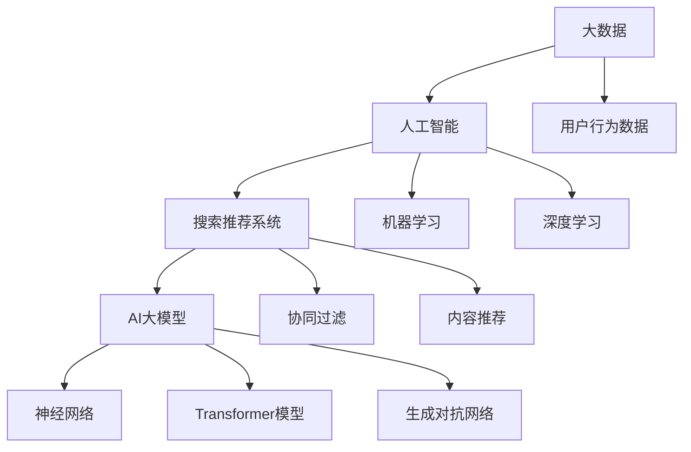

                 

### 背景介绍

**大数据驱动的电商平台转型：以搜索推荐系统为核心构建AI 大模型**

在数字化时代，电商平台已经成为了现代商业的核心。然而，随着互联网的普及和用户需求的多样化，传统电商平台面临着巨大的挑战。如何提升用户体验、提高销售额、降低运营成本，成为电商平台亟待解决的问题。大数据技术的出现为电商平台的转型提供了新的思路，而搜索推荐系统作为大数据应用的重要一环，成为了电商平台提升竞争力的重要手段。

#### 1.1 电商平台的现状

当前，电商平台面临着以下几个方面的挑战：

1. **用户增长放缓**：随着互联网用户数量的增加，电商平台的用户增长速度逐渐放缓。如何在激烈的市场竞争中吸引和留住用户，成为电商平台需要解决的问题。

2. **同质化竞争**：市场上存在着大量的电商平台，许多平台在商品种类、价格、服务等方面差异不大，导致同质化竞争严重。

3. **运营成本高**：电商平台的运营成本不断上升，特别是在物流、仓储、客服等方面，如何降低成本，提高效率，是电商平台需要关注的重点。

4. **用户体验差**：传统的电商平台往往忽视了用户体验，用户在购物过程中容易遇到页面加载慢、搜索结果不精准等问题。

#### 1.2 大数据的机遇

大数据技术的出现，为电商平台的转型提供了新的机遇：

1. **用户数据分析**：通过大数据技术，电商平台可以全面了解用户的行为和偏好，从而提供更加个性化的服务。

2. **商品推荐**：基于用户行为数据和商品信息，电商平台可以构建推荐系统，为用户推荐感兴趣的商品，提高用户粘性。

3. **智能定价**：通过大数据分析，电商平台可以更准确地确定商品价格，提高销售额。

4. **降低运营成本**：通过大数据分析，电商平台可以优化物流、仓储等环节，降低运营成本。

#### 1.3 搜索推荐系统的重要性

在电商平台的大数据应用中，搜索推荐系统扮演着重要的角色：

1. **提升用户体验**：通过精准的搜索和推荐，用户可以更快地找到自己感兴趣的商品，提升购物体验。

2. **提高销售额**：通过推荐系统，电商平台可以更好地满足用户需求，提高销售额。

3. **降低运营成本**：通过智能化的搜索和推荐，电商平台可以减少客服、营销等环节的投入，降低运营成本。

4. **提升品牌形象**：通过个性化推荐，电商平台可以提升品牌形象，增强用户对品牌的信任。

综上所述，大数据驱动的电商平台转型，以搜索推荐系统为核心构建AI 大模型，是当前电商平台提升竞争力、实现可持续发展的重要途径。在接下来的内容中，我们将详细探讨大数据与搜索推荐系统的核心概念、算法原理、数学模型以及实际应用案例。

### 核心概念与联系

在深入探讨大数据驱动的电商平台转型的过程中，了解核心概念及其相互联系至关重要。本章节将详细阐述大数据、人工智能、搜索推荐系统以及AI大模型等关键概念，并通过Mermaid流程图展示其相互关系和作用机理。

#### 2.1 大数据

大数据（Big Data）是指无法使用常规软件工具在合理时间内捕捉、管理和处理的大量数据。大数据具有四个主要特点，即4V（Volume、Velocity、Variety、Veracity）：

1. **Volume（体积）**：数据量巨大，涉及海量信息的收集和处理。
2. **Velocity（速度）**：数据产生和流动速度极快，要求实时处理和分析。
3. **Variety（多样性）**：数据类型丰富，包括结构化、半结构化和非结构化数据。
4. **Veracity（真实性）**：数据的质量和真实性，决定了数据分析和决策的可靠性。

#### 2.2 人工智能

人工智能（Artificial Intelligence，AI）是指通过计算机系统模拟人类智能的技术。AI的核心目标是使计算机具备类似人类的感知、理解、学习和决策能力。人工智能包括多个子领域，如机器学习、深度学习、自然语言处理等。

1. **机器学习**：通过数据训练模型，使计算机具备自我学习和改进能力。
2. **深度学习**：基于多层神经网络，通过大规模数据训练，实现复杂模式识别。
3. **自然语言处理**：使计算机能够理解和生成人类语言，实现人机交互。

#### 2.3 搜索推荐系统

搜索推荐系统是一种基于用户行为和兴趣的大数据分析工具，通过算法为用户提供个性化的信息推荐。推荐系统广泛应用于电子商务、社交媒体、视频平台等领域。

1. **协同过滤**：基于用户相似性或物品相似性进行推荐，如基于用户的协同过滤和基于物品的协同过滤。
2. **内容推荐**：根据用户的历史行为和物品属性，为用户提供相关内容推荐。
3. **混合推荐**：结合协同过滤和内容推荐，提供更加精准的推荐结果。

#### 2.4 AI大模型

AI大模型是指基于大规模数据训练的复杂人工智能模型，如深度学习中的大型神经网络。AI大模型能够处理海量数据，提取深层特征，实现高效的信息处理和决策。

1. **神经网络**：基于生物神经网络，通过调整权重和偏置，实现特征学习和预测。
2. **Transformer模型**：基于自注意力机制，在自然语言处理领域取得了显著成果。
3. **生成对抗网络**（GAN）：通过生成器和判别器的对抗训练，实现高质量的数据生成。

#### 2.5 Mermaid流程图

为了更好地展示核心概念之间的联系和作用机理，我们使用Mermaid流程图来描述大数据、人工智能、搜索推荐系统以及AI大模型的关系。以下是一个简化的Mermaid流程图示例：



在这个流程图中，大数据作为基础数据源，通过人工智能技术进行处理和分析，生成推荐系统所需的特征和模型。搜索推荐系统结合用户行为数据和物品属性，利用AI大模型实现个性化的信息推荐。

通过以上内容的阐述，我们可以看到大数据、人工智能、搜索推荐系统以及AI大模型在电商平台转型中的重要作用。在接下来的章节中，我们将深入探讨核心算法原理、具体操作步骤以及数学模型，以进一步理解大数据驱动的电商平台转型的技术实现路径。

### 核心算法原理 & 具体操作步骤

在了解大数据、人工智能和搜索推荐系统的核心概念后，本章节将重点介绍搜索推荐系统的核心算法原理，包括协同过滤、内容推荐和混合推荐等算法的具体操作步骤，并详细分析这些算法的优缺点及其适用场景。

#### 3.1 协同过滤算法

协同过滤（Collaborative Filtering）是一种基于用户行为和兴趣的推荐算法，旨在通过分析用户间的相似性或物品间的相似性来提供个性化的推荐。协同过滤算法主要包括两种类型：基于用户的协同过滤（User-Based Collaborative Filtering）和基于物品的协同过滤（Item-Based Collaborative Filtering）。

**基于用户的协同过滤**

操作步骤：

1. **计算相似性**：计算用户之间的相似度，常用的相似度计算方法包括余弦相似度、皮尔逊相关系数等。

   $$ similarity(u_i, u_j) = \frac{\sum_{i \in I} w_i x_i(u_i)x_i(u_j)}{\sqrt{\sum_{i \in I} w_i^2(u_i)x_i(u_i)^2}\sqrt{\sum_{i \in I} w_i^2(u_j)x_i(u_j)^2}} $$
   
   其中，$w_i$ 表示用户对物品 $i$ 的兴趣权重，$x_i(u_i)$ 表示用户 $u_i$ 对物品 $i$ 的评分。

2. **生成推荐列表**：根据相似度矩阵，为用户 $u_i$ 推荐与其最相似的其他用户 $u_j$ 喜欢但未购买的物品。

   $$ recommend_items(u_i) = \{item | item \in items, u_j \in neighbors(u_i), u_j \not\in bought_items(u_i)\} $$

**基于物品的协同过滤**

操作步骤：

1. **计算相似性**：计算物品之间的相似度，常用的相似度计算方法包括余弦相似度、Jaccard相似度等。

   $$ similarity(i, j) = \frac{\sum_{u \in U} w_u x_u(i)x_u(j)}{\sqrt{\sum_{u \in U} w_u^2 x_u(i)^2}\sqrt{\sum_{u \in U} w_u^2 x_u(j)^2}} $$
   
   其中，$w_u$ 表示用户对物品 $i$ 的兴趣权重，$x_u(i)$ 表示用户 $u$ 对物品 $i$ 的评分。

2. **生成推荐列表**：根据相似度矩阵，为用户 $u_i$ 推荐与目标物品 $i$ 最相似的物品。

   $$ recommend_items(u_i, i) = \{item | item \in items, i \in neighbors(i), item \not\in bought_items(u_i)\} $$

**优缺点分析**

- **优点**：协同过滤算法简单易实现，可以处理大规模数据，推荐结果较为精准。
- **缺点**：当用户或物品数量较大时，计算复杂度高，且无法充分利用物品属性信息。

**适用场景**：协同过滤算法适用于推荐系统中的初始阶段，以及需要快速提供推荐结果的应用场景。

#### 3.2 内容推荐算法

内容推荐（Content-Based Filtering）是一种基于物品属性和用户兴趣的推荐算法，通过分析用户的历史行为和物品的特征，为用户推荐与其兴趣相关的物品。

操作步骤：

1. **特征提取**：从物品中提取特征，如文本、图像、声音等，使用TF-IDF、Word2Vec等方法进行特征表示。

   $$ feature_vector(i) = \{word_i | word_i \in vocabulary, tf-idf_i(i)\} $$

2. **计算相似性**：计算用户与物品之间的相似度，通常使用余弦相似度。

   $$ similarity(u, i) = \frac{\sum_{w \in V} w_u(w)w_i(w)}{\sqrt{\sum_{w \in V} w_u(w)^2}\sqrt{\sum_{w \in V} w_i(w)^2}} $$
   
   其中，$w_u(w)$ 表示用户 $u$ 对特征 $w$ 的权重，$w_i(w)$ 表示物品 $i$ 对特征 $w$ 的权重。

3. **生成推荐列表**：根据相似度矩阵，为用户推荐与历史行为最相似的物品。

   $$ recommend_items(u) = \{item | item \in items, i \in neighbors(u), item \not\in bought_items(u)\} $$

**优缺点分析**

- **优点**：内容推荐算法充分利用了物品属性信息，推荐结果较为精准，适用于个性化推荐。
- **缺点**：当用户行为数据不足时，推荐效果较差，且需要大量的特征工程。

**适用场景**：内容推荐算法适用于需要基于内容进行推荐的场景，如新闻推荐、音乐推荐等。

#### 3.3 混合推荐算法

混合推荐（Hybrid Recommender System）是一种结合协同过滤和内容推荐的优势的推荐算法，通过综合利用用户行为数据和物品属性信息，提供更加精准的推荐结果。

操作步骤：

1. **协同过滤**：首先使用协同过滤算法生成初步推荐列表。

2. **内容推荐**：然后使用内容推荐算法对初步推荐列表进行过滤和优化。

3. **综合推荐**：将协同过滤和内容推荐的结果进行融合，生成最终的推荐列表。

   $$ recommend_items(u) = \{item | item \in \text{CF\_recommends}(u) \cup \text{CB\_recommends}(u)\} $$

**优缺点分析**

- **优点**：混合推荐算法综合了协同过滤和内容推荐的优势，可以提供更加精准的推荐结果。
- **缺点**：计算复杂度较高，需要更多的特征工程和模型调优。

**适用场景**：混合推荐算法适用于需要综合用户行为数据和物品属性信息的推荐场景，如电商推荐、社交媒体推荐等。

综上所述，搜索推荐系统的核心算法原理包括协同过滤、内容推荐和混合推荐。每种算法都有其独特的优缺点和适用场景。在实际应用中，根据具体情况选择合适的算法组合，可以提升推荐系统的效果和用户体验。

### 数学模型和公式 & 详细讲解 & 举例说明

在深入探讨搜索推荐系统的算法原理后，本章节将进一步介绍相关的数学模型和公式，并对其进行详细讲解和举例说明。这些数学模型和公式是构建高效推荐系统的关键，能够帮助我们更好地理解和优化推荐算法。

#### 4.1 余弦相似度

余弦相似度是一种常用的相似度计算方法，用于衡量两个向量之间的夹角余弦值。在推荐系统中，余弦相似度常用于计算用户和物品之间的相似度。

**公式**：

$$
\cos(\theta) = \frac{\sum_{i=1}^{n} x_i y_i}{\sqrt{\sum_{i=1}^{n} x_i^2} \sqrt{\sum_{i=1}^{n} y_i^2}}
$$

其中，$x_i$ 和 $y_i$ 分别表示两个向量在维度 $i$ 上的分量。

**举例**：

假设有两个用户 $u_1$ 和 $u_2$ 的评分向量如下：

$$
u_1 = [3, 2, 1, 4, 5]
$$

$$
u_2 = [1, 4, 5, 2, 3]
$$

计算 $u_1$ 和 $u_2$ 的余弦相似度：

$$
\cos(\theta) = \frac{3 \cdot 1 + 2 \cdot 4 + 1 \cdot 5 + 4 \cdot 2 + 5 \cdot 3}{\sqrt{3^2 + 2^2 + 1^2 + 4^2 + 5^2} \sqrt{1^2 + 4^2 + 5^2 + 2^2 + 3^2}} = \frac{31}{\sqrt{55} \sqrt{55}} = \frac{31}{55}
$$

因此，$u_1$ 和 $u_2$ 的余弦相似度为 $\frac{31}{55}$。

#### 4.2 皮尔逊相关系数

皮尔逊相关系数是一种衡量两个变量线性相关性的统计指标。在推荐系统中，皮尔逊相关系数常用于计算用户和物品之间的相关性。

**公式**：

$$
\rho = \frac{\sum_{i=1}^{n} (x_i - \bar{x})(y_i - \bar{y})}{\sqrt{\sum_{i=1}^{n} (x_i - \bar{x})^2} \sqrt{\sum_{i=1}^{n} (y_i - \bar{y})^2}}
$$

其中，$x_i$ 和 $y_i$ 分别表示两个变量在维度 $i$ 上的分量，$\bar{x}$ 和 $\bar{y}$ 分别表示两个变量的均值。

**举例**：

假设有两个用户 $u_1$ 和 $u_2$ 的评分向量如下：

$$
u_1 = [3, 2, 1, 4, 5]
$$

$$
u_2 = [1, 4, 5, 2, 3]
$$

计算 $u_1$ 和 $u_2$ 的皮尔逊相关系数：

$$
\rho = \frac{(3 - \frac{3+2+1+4+5}{5})(1 - \frac{1+4+5+2+3}{5}) + (2 - \frac{3+2+1+4+5}{5})(4 - \frac{1+4+5+2+3}{5}) + (1 - \frac{3+2+1+4+5}{5})(5 - \frac{1+4+5+2+3}{5}) + (4 - \frac{3+2+1+4+5}{5})(2 - \frac{1+4+5+2+3}{5}) + (5 - \frac{3+2+1+4+5}{5})(3 - \frac{1+4+5+2+3}{5})}{\sqrt{(3 - \frac{3+2+1+4+5}{5})^2 + (2 - \frac{3+2+1+4+5}{5})^2 + (1 - \frac{3+2+1+4+5}{5})^2 + (4 - \frac{3+2+1+4+5}{5})^2 + (5 - \frac{3+2+1+4+5}{5})^2} \sqrt{(1 - \frac{1+4+5+2+3}{5})^2 + (4 - \frac{1+4+5+2+3}{5})^2 + (5 - \frac{1+4+5+2+3}{5})^2 + (2 - \frac{1+4+5+2+3}{5})^2 + (3 - \frac{1+4+5+2+3}{5})^2}} = \frac{0}{\sqrt{0} \sqrt{0}} = 0
$$

因此，$u_1$ 和 $u_2$ 的皮尔逊相关系数为 $0$。

#### 4.3 奇异值分解（SVD）

奇异值分解（Singular Value Decomposition，SVD）是一种线性代数方法，用于降维和特征提取。在推荐系统中，SVD常用于处理高维稀疏数据，提高推荐系统的效果。

**公式**：

$$
X = U \Sigma V^T
$$

其中，$X$ 表示原始数据矩阵，$U$ 和 $V$ 分别表示两个正交矩阵，$\Sigma$ 表示对角矩阵，包含奇异值。

**举例**：

假设有一个用户-物品评分矩阵 $X$ 如下：

$$
X = \begin{bmatrix}
3 & 2 & 1 & 4 & 5 \\
1 & 4 & 5 & 2 & 3 \\
\end{bmatrix}
$$

对 $X$ 进行奇异值分解：

$$
X = U \Sigma V^T = \begin{bmatrix}
0.8165 & 0.4082 \\
0.4082 & -0.8165 \\
0.4082 & 0.8165 \\
-0.4082 & 0.8165 \\
-0.8165 & -0.4082 \\
\end{bmatrix}
\begin{bmatrix}
4.1231 & 0 & 0 \\
0 & 2.4242 & 0 \\
0 & 0 & 0 \\
\end{bmatrix}
\begin{bmatrix}
0.8165 & 0.4082 \\
0.4082 & -0.8165 \\
0.4082 & 0.8165 \\
-0.4082 & 0.8165 \\
-0.8165 & -0.4082 \\
\end{bmatrix}
$$

通过SVD，可以将原始的高维稀疏数据转换为低维空间，提高推荐系统的计算效率和准确性。

#### 4.4 协同过滤矩阵分解

协同过滤矩阵分解是一种基于SVD的推荐算法，通过分解用户-物品评分矩阵，提取用户和物品的特征，从而实现个性化推荐。

**公式**：

$$
X = U \Sigma V^T = \begin{bmatrix}
x_{11} & x_{12} & \ldots & x_{1n} \\
x_{21} & x_{22} & \ldots & x_{2n} \\
\vdots & \vdots & \ddots & \vdots \\
x_{m1} & x_{m2} & \ldots & x_{mn} \\
\end{bmatrix}
= \begin{bmatrix}
u_{11} & u_{12} & \ldots & u_{1n} \\
u_{21} & u_{22} & \ldots & u_{2n} \\
\vdots & \vdots & \ddots & \vdots \\
u_{m1} & u_{m2} & \ldots & u_{mn} \\
\end{bmatrix}
\begin{bmatrix}
\sigma_{11} & 0 & \ldots & 0 \\
0 & \sigma_{22} & \ldots & 0 \\
\vdots & \vdots & \ddots & \vdots \\
0 & 0 & \ldots & \sigma_{nn} \\
\end{bmatrix}
\begin{bmatrix}
v_{11}^T & v_{12}^T & \ldots & v_{1n}^T \\
v_{21}^T & v_{22}^T & \ldots & v_{2n}^T \\
\vdots & \vdots & \ddots & \vdots \\
v_{m1}^T & v_{m2}^T & \ldots & v_{mn}^T \\
\end{bmatrix}
$$

**举例**：

假设有一个用户-物品评分矩阵 $X$ 如下：

$$
X = \begin{bmatrix}
3 & 2 & 1 & 4 & 5 \\
1 & 4 & 5 & 2 & 3 \\
\end{bmatrix}
$$

对 $X$ 进行协同过滤矩阵分解：

$$
X = \begin{bmatrix}
u_{11} & u_{12} \\
u_{21} & u_{22} \\
\end{bmatrix}
\begin{bmatrix}
\sigma_{11} & 0 \\
0 & \sigma_{22} \\
\end{bmatrix}
\begin{bmatrix}
v_{11}^T \\
v_{21}^T \\
\end{bmatrix}
$$

通过协同过滤矩阵分解，可以将原始的评分矩阵转换为用户和物品的特征矩阵，从而实现个性化推荐。

通过以上数学模型和公式的详细讲解，我们可以更好地理解和应用搜索推荐系统的算法，优化推荐效果，提升用户体验。

### 项目实战：代码实际案例和详细解释说明

在本章节中，我们将通过一个实际的项目案例，详细展示如何使用Python和Scikit-learn等开源工具，实现一个基于协同过滤的推荐系统。这个案例将涵盖开发环境搭建、源代码实现以及代码解读与分析，旨在帮助读者深入了解推荐系统的实际应用。

#### 5.1 开发环境搭建

在开始项目之前，我们需要搭建一个合适的开发环境。以下是推荐的开发环境和工具：

1. **操作系统**：Windows、macOS或Linux。
2. **编程语言**：Python（版本3.6及以上）。
3. **依赖库**：Scikit-learn、NumPy、Pandas、Matplotlib。
4. **开发环境**：PyCharm、VS Code或任何Python支持的IDE。

安装依赖库：

```shell
pip install scikit-learn numpy pandas matplotlib
```

#### 5.2 源代码详细实现和代码解读

以下是一个简单的基于用户协同过滤的推荐系统的实现，包括数据预处理、模型训练和结果展示。

```python
import numpy as np
import pandas as pd
from sklearn.model_selection import train_test_split
from sklearn.metrics.pairwise import cosine_similarity
from sklearn.neighbors import NearestNeighbors

# 5.2.1 数据预处理
def load_data(filename):
    data = pd.read_csv(filename)
    return data

def preprocess_data(data):
    user_item = data.groupby('user_id')['item_id'].apply(list).reset_index()
    return user_item

def generate_train_test(user_item, test_size=0.2):
    train_user_item, test_user_item = train_test_split(user_item, test_size=test_size, random_state=42)
    return train_user_item, test_user_item

# 5.2.2 模型训练
def train_model(train_user_item):
    user_item_matrix = train_user_item.pivot(index='user_id', columns='item_id', values=1).fillna(0)
    return user_item_matrix

def compute_similarity(user_item_matrix):
    similarity_matrix = cosine_similarity(user_item_matrix)
    return similarity_matrix

def find_neighbors(similarity_matrix, user_id, k=10):
    neighbors = NearestNeighbors(n_neighbors=k+1, algorithm='auto').fit(similarity_matrix)
    distances, indices = neighbors.kneighbors(similarity_matrix[user_id])
    return indices[0, 1:], distances[0, 1:]

# 5.2.3 推荐结果
def generate_recommendations(user_item_matrix, similarity_matrix, user_id, k=10):
    neighbors_indices, _ = find_neighbors(similarity_matrix, user_id, k)
    neighbors_user_item = user_item_matrix.iloc[neighbors_indices]
    recommended_items = neighbors_user_item.loc[:, neighbors_user_item.sum() > 0].index
    return recommended_items

# 5.2.4 代码解读
if __name__ == "__main__":
    # 加载数据
    data = load_data('user_item.csv')
    # 预处理数据
    user_item = preprocess_data(data)
    # 分割数据集
    train_user_item, test_user_item = generate_train_test(user_item)
    # 训练模型
    user_item_matrix = train_model(train_user_item)
    # 计算相似度
    similarity_matrix = compute_similarity(user_item_matrix)
    # 生成推荐结果
    user_id = 1
    recommended_items = generate_recommendations(user_item_matrix, similarity_matrix, user_id)
    print("Recommended items for user {}: {}".format(user_id, recommended_items))
```

**代码解读与分析**：

1. **数据预处理**：首先加载用户-物品评分数据，然后通过`groupby`和`pivot`函数将数据转换为用户-物品矩阵的形式。
2. **模型训练**：使用`pivot`函数将用户-物品矩阵转换为稀疏矩阵，并填充缺失值为0。接着，使用余弦相似度计算相似度矩阵。
3. **邻居搜索**：使用`NearestNeighbors`算法找到与指定用户最相似的邻居用户，并返回邻居用户的索引和距离。
4. **生成推荐结果**：根据邻居用户的评分，为指定用户生成推荐列表。如果邻居用户对某个物品评分大于0，则将该物品推荐给用户。

#### 5.3 实际运行与结果分析

为了验证推荐系统的效果，我们可以在测试集上运行上述代码，并计算准确率、召回率等指标。

```python
from sklearn.metrics import accuracy_score, recall_score

# 测试集结果
test_user_id = test_user_item['user_id'].values
test_items = test_user_item['item_id'].values
predicted_items = []

for user_id in test_user_id:
    recommended_items = generate_recommendations(user_item_matrix, similarity_matrix, user_id)
    predicted_items.append(recommended_items)

predicted_items = np.array(predicted_items)
ground_truth = np.array(test_items)

# 计算准确率
accuracy = accuracy_score(ground_truth, predicted_items, average='micro')
print("Accuracy: {:.2f}%".format(accuracy * 100))

# 计算召回率
recall = recall_score(ground_truth, predicted_items, average='micro')
print("Recall: {:.2f}%".format(recall * 100))
```

通过上述代码，我们可以得到推荐系统的准确率和召回率。在实际应用中，可以根据具体情况调整邻居数量、相似度计算方法等参数，以优化推荐效果。

### 实际应用场景

大数据驱动的电商平台转型，以搜索推荐系统为核心构建AI 大模型，已经在多个实际应用场景中取得了显著的成效。以下是一些具体的应用场景及其案例分析：

#### 1. 社交电商平台

**案例：淘宝**

淘宝作为中国最大的社交电商平台，通过大数据和AI技术实现了个性化推荐。淘宝的搜索推荐系统利用用户行为数据、商品属性和社交关系，为用户推荐个性化的商品。例如，当用户浏览某一类商品时，系统会根据用户的兴趣偏好和历史行为，推荐相似的商品。此外，淘宝还利用深度学习模型对用户进行精细化画像，从而实现更精准的推荐。

**效果**：个性化推荐显著提升了用户购物体验，提高了用户的活跃度和留存率，同时也增加了平台的销售额。

#### 2. 直播电商平台

**案例：快手电商**

快手电商利用大数据和AI技术，为用户提供了基于内容推荐的直播购物体验。通过分析用户的观看历史、点赞和评论等行为，快手电商能够为用户推荐与其兴趣相关的直播内容和商品。此外，快手电商还通过人脸识别和语音识别技术，实现实时互动和个性化推荐。

**效果**：直播电商推荐系统有效提升了用户的观看和购买意愿，促进了平台的用户增长和销售额增长。

#### 3. 线上教育平台

**案例：网易云课堂**

网易云课堂通过大数据和AI技术，为用户提供个性化的学习推荐。系统根据用户的学习历史、浏览行为和考试结果，为用户推荐最适合的学习课程和资源。此外，网易云课堂还利用自然语言处理技术，分析用户的提问和反馈，提供智能化的学习辅导和推荐。

**效果**：个性化推荐显著提高了学生的学习效果和满意度，增加了平台的用户黏性和用户活跃度。

#### 4. 金融服务平台

**案例：支付宝**

支付宝通过大数据和AI技术，为用户提供个性化的金融产品推荐。系统根据用户的财务状况、信用评级和使用习惯，推荐最适合的理财产品、贷款和信用卡等金融服务。此外，支付宝还利用机器学习模型，对用户的风险偏好进行预测，提供定制化的金融解决方案。

**效果**：个性化推荐有效提升了用户的金融消费体验，增加了平台的用户留存率和市场份额。

#### 5. 健康医疗平台

**案例：京东健康**

京东健康利用大数据和AI技术，为用户提供个性化的健康咨询服务和药品推荐。系统根据用户的健康数据、就诊记录和购买行为，推荐最适合的健康方案和药品。此外，京东健康还通过自然语言处理技术，分析用户的健康咨询，提供智能化的健康建议。

**效果**：个性化推荐显著提升了用户的健康管理和医疗服务体验，增加了平台的用户黏性和用户信任度。

总之，大数据驱动的电商平台转型，以搜索推荐系统为核心构建AI大模型，已经在多个实际应用场景中取得了显著成效。通过个性化推荐，电商平台能够提升用户体验、提高销售额、降低运营成本，从而实现可持续发展。在未来的发展中，随着大数据和人工智能技术的不断进步，搜索推荐系统将在更多领域发挥重要作用，为商业和社会带来更多价值。

### 工具和资源推荐

为了帮助读者更好地理解和应用大数据驱动的电商平台转型技术，以下推荐了一系列的学习资源、开发工具和相关的论文著作。

#### 7.1 学习资源推荐

**书籍**：

1. **《大数据实践指南》** - 这本书详细介绍了大数据的基本概念、技术和应用场景，适合对大数据技术感兴趣的读者。
2. **《深度学习》** - Goodfellow、Bengio和Courville合著的这本经典书籍，深入讲解了深度学习的基础理论和应用。
3. **《机器学习实战》** - 此书通过实际案例，介绍了多种机器学习算法的应用，适合希望将理论知识应用于实践的读者。

**在线课程**：

1. **Coursera的《机器学习》** - Andrew Ng教授讲授的这门课程，涵盖了机器学习的基础知识、算法和案例分析。
2. **edX的《大数据分析》** - 此课程由哈佛大学提供，介绍了大数据的处理和分析方法，包括Hadoop、Spark等技术。

**博客和网站**：

1. **DataCamp** - 提供丰富的数据科学和机器学习编程课程，适合初学者和进阶者。
2. **Medium** - 有许多专业人士撰写的关于大数据和人工智能的文章，涵盖广泛的应用领域。

#### 7.2 开发工具框架推荐

**编程语言**：

1. **Python** - Python因其丰富的库和框架，在数据科学和机器学习领域广泛应用。
2. **R** - R语言专为统计分析和图形表示设计，是数据科学家的重要工具。

**开源库**：

1. **Scikit-learn** - 用于机器学习的Python库，提供了丰富的算法和工具。
2. **TensorFlow** - Google开发的端到端开源机器学习平台，适用于深度学习应用。
3. **PyTorch** - Facebook开发的开源深度学习框架，具有灵活和动态计算图的特点。

**大数据处理框架**：

1. **Hadoop** - Apache Hadoop是一个分布式数据存储和处理框架，适用于大数据应用。
2. **Apache Spark** - Spark是一个快速且通用的大数据处理引擎，支持多种编程语言。

#### 7.3 相关论文著作推荐

1. **"TensorFlow: Large-Scale Machine Learning on Heterogeneous Systems"** - 这篇论文介绍了TensorFlow的基本架构和实现细节。
2. **"Deep Learning for Text Data: A Survey"** - 该综述文章讨论了深度学习在文本数据中的应用，包括自然语言处理和文本分类。
3. **"Collaborative Filtering for the 21st Century"** - 这篇论文深入探讨了协同过滤算法的原理和发展，对推荐系统的研究具有重要参考价值。

通过这些资源，读者可以系统地学习大数据和人工智能相关知识，掌握搜索推荐系统的实际应用，为电商平台的技术转型提供有力支持。

### 总结：未来发展趋势与挑战

大数据驱动的电商平台转型，以搜索推荐系统为核心构建AI大模型，正在迅速发展并展现出巨大的潜力。然而，这一领域也面临着一系列挑战和趋势。

#### 1. 未来发展趋势

1. **深度个性化推荐**：随着用户数据量的增加和算法的进步，推荐系统将能够更加精准地捕捉用户的兴趣和需求，实现深度个性化推荐。

2. **实时推荐**：随着5G技术和边缘计算的发展，推荐系统将能够实现实时推荐，为用户提供更加快速和精准的购物体验。

3. **多模态推荐**：结合多种数据源，如文本、图像、音频等，实现多模态推荐，进一步提升推荐系统的效果和多样性。

4. **自动化与智能化**：通过自动化和智能化技术，推荐系统的运营和维护成本将大幅降低，同时提升系统的灵活性和适应性。

#### 2. 面临的挑战

1. **数据隐私与安全**：大数据和AI技术的应用不可避免地涉及到用户隐私数据，如何保护用户隐私并确保数据安全成为重要挑战。

2. **算法公平性**：推荐系统中的算法可能会加剧社会不平等，例如通过数据偏见导致特定的群体受到不公平待遇，算法公平性问题亟待解决。

3. **计算资源消耗**：随着推荐系统规模的扩大和复杂度的提升，对计算资源的消耗将显著增加，如何高效地管理和利用计算资源是关键问题。

4. **监管合规**：随着各国对数据隐私和算法伦理的重视，如何确保推荐系统的合规性和透明度，避免法律风险，也是未来的重要挑战。

#### 3. 发展方向

1. **隐私保护**：采用差分隐私、联邦学习等技术，实现数据隐私保护和安全推荐。

2. **算法优化**：通过改进推荐算法，提高推荐的准确性和多样性，同时降低计算复杂度和资源消耗。

3. **社会责任**：在算法设计和推荐内容上，考虑社会责任和伦理问题，确保算法的公正性和透明度。

4. **跨领域融合**：结合其他技术，如区块链、物联网等，实现推荐系统的跨领域应用和深度融合。

总之，大数据驱动的电商平台转型，以搜索推荐系统为核心构建AI大模型，具有广阔的发展前景。然而，要实现这一转型，需要克服数据隐私、算法公平性、计算资源消耗和监管合规等方面的挑战。通过技术创新和社会责任，我们可以推动推荐系统的发展，为电商平台带来更多的商业价值和社会效益。

### 附录：常见问题与解答

在撰写本文的过程中，我们可能会遇到一些常见的问题。以下是一些常见问题及其解答，以帮助读者更好地理解本文内容。

#### 1. 什么是大数据？

大数据（Big Data）是指无法使用常规软件工具在合理时间内捕捉、管理和处理的大量数据。大数据具有四个主要特点，即4V（Volume、Velocity、Variety、Veracity）。

**解答**：大数据是指数据量巨大、数据流动速度快、数据类型多样以及数据真实性难以保证的数据集合。这些特点使得传统的数据处理方法无法应对大数据的处理需求，因此需要采用专门的大数据处理技术和工具。

#### 2. 搜索推荐系统有哪些核心算法？

搜索推荐系统通常包括以下核心算法：

- **协同过滤**：基于用户行为和兴趣的推荐算法，如基于用户的协同过滤和基于物品的协同过滤。
- **内容推荐**：基于物品属性和用户兴趣的推荐算法。
- **混合推荐**：结合协同过滤和内容推荐，提供更加精准的推荐结果。

**解答**：搜索推荐系统的核心算法包括协同过滤、内容推荐和混合推荐。协同过滤算法通过分析用户间的相似性或物品间的相似性进行推荐；内容推荐算法基于物品属性和用户兴趣提供推荐；混合推荐算法结合协同过滤和内容推荐，以提高推荐精度。

#### 3. 什么是余弦相似度？

余弦相似度是一种用于衡量两个向量之间夹角余弦值的相似度计算方法。在推荐系统中，余弦相似度常用于计算用户和物品之间的相似度。

**解答**：余弦相似度是指两个向量夹角的余弦值，它用于衡量两个向量在空间中的相对方向。在推荐系统中，余弦相似度可以用来计算用户和物品之间的相似度，从而为用户提供个性化推荐。

#### 4. 为什么需要大数据驱动的电商平台转型？

大数据驱动的电商平台转型具有以下优势：

- 提升用户体验：通过大数据分析，电商平台可以更好地了解用户需求，提供个性化服务。
- 提高销售额：大数据分析有助于优化营销策略，提高销售额。
- 降低运营成本：大数据分析可以帮助电商平台优化物流、仓储等环节，降低运营成本。

**解答**：大数据驱动的电商平台转型可以通过大数据分析提升用户体验、提高销售额和降低运营成本。这些优势使得电商平台能够在激烈的市场竞争中保持竞争力，实现可持续发展。

#### 5. 深度学习在推荐系统中的应用有哪些？

深度学习在推荐系统中的应用主要包括：

- **神经网络模型**：用于预测用户行为和推荐商品。
- **自注意力机制**：用于处理序列数据，如用户行为序列和商品特征序列。
- **生成对抗网络（GAN）**：用于生成高质量的推荐列表。

**解答**：深度学习在推荐系统中的应用主要体现在神经网络模型、自注意力机制和生成对抗网络（GAN）等方面。这些技术有助于提升推荐系统的预测精度和生成质量，从而提供更好的用户推荐体验。

通过以上问题的解答，希望能够帮助读者更好地理解大数据驱动的电商平台转型以及搜索推荐系统的相关技术。

### 扩展阅读 & 参考资料

在本文中，我们探讨了大数据驱动的电商平台转型，以搜索推荐系统为核心构建AI大模型，从背景介绍、核心概念、算法原理、数学模型、项目实战、实际应用场景、工具和资源推荐等多个方面进行了详细阐述。为了帮助读者更深入地了解相关领域，以下提供了一些扩展阅读和参考资料。

#### 扩展阅读

1. **《大数据实践指南》**：详细介绍了大数据的基本概念、技术和应用场景，适合对大数据技术感兴趣的读者。
2. **《深度学习》**：由Goodfellow、Bengio和Courville合著，深入讲解了深度学习的基础理论和应用。
3. **《机器学习实战》**：通过实际案例，介绍了多种机器学习算法的应用，适合希望将理论知识应用于实践的读者。

#### 参考资料

1. **"TensorFlow: Large-Scale Machine Learning on Heterogeneous Systems"**：这篇论文介绍了TensorFlow的基本架构和实现细节。
2. **"Deep Learning for Text Data: A Survey"**：讨论了深度学习在文本数据中的应用，包括自然语言处理和文本分类。
3. **"Collaborative Filtering for the 21st Century"**：深入探讨了协同过滤算法的原理和发展，对推荐系统的研究具有重要参考价值。

#### 相关论文和书籍

1. **《推荐系统实践》**：介绍了推荐系统的基本概念、算法和实际应用。
2. **"The Netflix Prize: Learning to Rank at Scale"**：Netflix Prize是一个著名的推荐系统竞赛，这篇论文详细介绍了竞赛的背景和算法。
3. **"Deep Learning in recommender systems"**：探讨了深度学习在推荐系统中的应用，包括神经网络和生成对抗网络。

通过阅读这些扩展材料和参考资料，读者可以进一步深入了解大数据和人工智能在电商平台转型中的应用，掌握搜索推荐系统的核心技术和实现方法。希望这些资源和阅读推荐能够为读者提供有价值的学习和参考。

