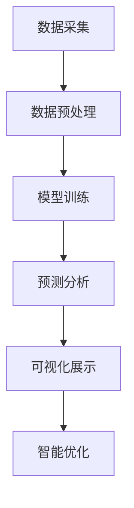

                 

# 大模型企业的数字孪生技术应用

## 关键词：大模型、数字孪生、技术应用、企业数字化转型、AI 推理、数据驱动

### 摘要

本文旨在探讨大模型技术在企业数字孪生应用中的重要性及其具体实现方法。随着人工智能技术的发展，大模型逐渐成为企业数字化转型的核心驱动力。数字孪生作为一种新兴技术，能够通过模拟现实世界中的物理系统，实现数据的实时监控和分析，从而提升企业的运营效率。本文将详细解析大模型与数字孪生的核心概念及其相互联系，介绍大模型在数字孪生技术中的应用原理，并通过实际案例展示如何利用大模型实现数字孪生技术的落地。同时，本文还将探讨大模型技术在未来企业数字化转型中的发展趋势和面临的挑战。

## 1. 背景介绍

在当今的科技时代，人工智能（AI）正以前所未有的速度发展和普及。大模型（Large-scale Model），如GPT-3、BERT等，以其庞大的参数规模和强大的学习能力，在自然语言处理、图像识别、语音识别等领域取得了显著的成果。与此同时，企业数字化转型已成为全球范围内的战略重点，数字孪生（Digital Twin）作为一种创新的数字技术，正逐渐成为企业提升竞争力的重要手段。

### 1.1 大模型的崛起

大模型的概念最早可以追溯到20世纪90年代，随着计算能力和数据资源的不断提升，大模型的研发和应用逐渐成为可能。GPT-3（Generative Pre-trained Transformer 3）作为目前最大的预训练语言模型，拥有1750亿个参数，其强大的生成和推理能力在多个领域都取得了突破性的进展。BERT（Bidirectional Encoder Representations from Transformers）则以其双向编码的特性，在文本分类、问答系统等领域表现出色。大模型的出现，不仅改变了传统的AI应用模式，也为企业提供了全新的技术解决方案。

### 1.2 企业数字孪生的兴起

数字孪生技术通过创建现实物理系统的虚拟副本，实现对实际系统的实时监控、分析和预测。在企业中，数字孪生技术可以应用于生产线、设备维护、供应链管理等多个领域，帮助企业优化运营、降低成本、提高效率。随着物联网（IoT）和大数据技术的发展，数字孪生技术正逐步从概念验证阶段走向实际应用。

### 1.3 大模型与数字孪生的结合

大模型与数字孪生的结合，为企业提供了一种全新的数字化转型路径。大模型可以处理和分析海量的实时数据，为数字孪生提供更准确的预测和决策支持。同时，数字孪生技术为大数据提供了直观的展现形式，使得企业能够更加清晰地理解数据背后的意义。这种相互促进的关系，使得大模型在数字孪生技术中的应用前景广阔。

## 2. 核心概念与联系

### 2.1 大模型的基本概念

大模型是一种具有数百万至上亿参数的深度学习模型，通过在大量数据上进行预训练，使其具有强大的通用性和泛化能力。大模型通常采用Transformer架构，通过多层堆叠的方式，实现对复杂特征的学习和提取。

### 2.2 数字孪生的基本概念

数字孪生是一种通过创建物理系统的虚拟副本，实现对实际系统实时监控、分析和预测的技术。数字孪生技术主要包括数据采集、模型训练、数据分析和可视化等环节。

### 2.3 大模型与数字孪生的联系

大模型与数字孪生的结合，主要体现在以下几个方面：

1. **数据驱动**：大模型能够处理和分析海量的实时数据，为数字孪生提供数据驱动的决策支持。
2. **预测分析**：大模型可以基于历史数据和实时数据，对物理系统进行预测分析，为数字孪生提供更准确的预测结果。
3. **可视化**：大模型可以生成直观的预测结果，通过数字孪生技术进行可视化展示，帮助企业更好地理解数据。
4. **智能优化**：大模型可以基于实时数据和预测结果，对物理系统进行智能优化，提高运营效率。

### 2.4 Mermaid 流程图



在这个流程图中，大模型与数字孪生技术相互融合，通过数据采集、预处理、模型训练、预测分析、可视化展示和智能优化等环节，实现对企业物理系统的实时监控和优化。

## 3. 核心算法原理 & 具体操作步骤

### 3.1 大模型算法原理

大模型的算法原理主要基于深度学习和神经网络，通过多层堆叠的方式，实现对复杂特征的学习和提取。大模型通常采用预训练（Pre-training）和微调（Fine-tuning）相结合的方法进行训练。

1. **预训练**：在预训练阶段，大模型在大量无标签数据上进行训练，使其具备一定的通用性和泛化能力。
2. **微调**：在微调阶段，大模型基于特定任务的数据集进行训练，进一步优化模型性能。

### 3.2 数字孪生技术原理

数字孪生技术的原理主要包括数据采集、模型训练、数据分析和可视化等环节。

1. **数据采集**：通过传感器、物联网设备等手段，实时采集物理系统的数据。
2. **数据预处理**：对采集到的数据进行处理和清洗，去除噪声和异常值。
3. **模型训练**：利用预处理后的数据，对数字孪生模型进行训练，使其具备对物理系统的建模能力。
4. **数据分析**：对训练好的数字孪生模型进行数据分析，提取有用的特征和规律。
5. **可视化展示**：通过可视化工具，将分析结果进行展示，帮助企业更好地理解数据。

### 3.3 大模型与数字孪生的具体操作步骤

1. **数据采集**：首先，需要搭建数据采集系统，通过传感器、物联网设备等手段，实时采集物理系统的数据。
2. **数据预处理**：对采集到的数据进行处理和清洗，去除噪声和异常值，为模型训练做准备。
3. **大模型预训练**：在预处理后的数据集上，对大模型进行预训练，使其具备一定的通用性和泛化能力。
4. **微调大模型**：根据具体应用场景，利用特定任务的数据集，对大模型进行微调，进一步优化模型性能。
5. **数字孪生模型训练**：利用预训练好的大模型，对数字孪生模型进行训练，使其具备对物理系统的建模能力。
6. **预测分析**：利用训练好的数字孪生模型，对物理系统进行实时预测分析，提取有用的特征和规律。
7. **可视化展示**：通过可视化工具，将预测分析结果进行展示，帮助企业更好地理解数据。
8. **智能优化**：基于预测分析结果，对物理系统进行智能优化，提高运营效率。

## 4. 数学模型和公式 & 详细讲解 & 举例说明

### 4.1 大模型数学模型

大模型的数学模型主要基于深度学习和神经网络，其基本结构可以表示为：

\[ y = f(z) \]

其中，\( y \) 表示模型的输出，\( z \) 表示模型中间层的激活值，\( f \) 表示激活函数。常见的激活函数包括ReLU、Sigmoid、Tanh等。

### 4.2 数字孪生技术数学模型

数字孪生技术的数学模型主要基于机器学习和统计学，其基本结构可以表示为：

\[ y = g(Wx + b) \]

其中，\( y \) 表示模型的输出，\( W \) 表示权重矩阵，\( x \) 表示输入特征，\( b \) 表示偏置项，\( g \) 表示激活函数。常见的激活函数包括线性激活函数、ReLU、Sigmoid、Tanh等。

### 4.3 举例说明

假设我们有一个简单的线性回归模型，用于预测某个物理系统的温度变化。该模型的数学表达式为：

\[ y = wx + b \]

其中，\( y \) 表示温度预测值，\( w \) 表示权重，\( x \) 表示输入特征，\( b \) 表示偏置。

1. **数据采集**：我们采集到一组温度数据，包括输入特征（如时间、湿度等）和对应的温度值。
2. **数据预处理**：对数据进行标准化处理，将输入特征和温度值缩放到相同的范围。
3. **模型训练**：利用预处理后的数据，对线性回归模型进行训练，得到权重和偏置。
4. **预测分析**：利用训练好的模型，对新的输入特征进行温度预测。
5. **可视化展示**：通过可视化工具，将预测结果进行展示。

通过这个简单的例子，我们可以看到，大模型和数字孪生技术的数学模型在结构上具有一定的相似性，但在应用场景和实现方法上有所不同。

## 5. 项目实战：代码实际案例和详细解释说明

### 5.1 开发环境搭建

在进行大模型和数字孪生技术的实际应用之前，我们需要搭建一个合适的开发环境。以下是搭建开发环境的基本步骤：

1. **安装Python环境**：Python是进行深度学习和数字孪生技术开发的常用语言，我们需要安装Python 3.8及以上版本。
2. **安装深度学习框架**：常见的深度学习框架包括TensorFlow、PyTorch等。我们可以根据需求选择其中一个进行安装。以下为安装TensorFlow的命令：

   ```bash
   pip install tensorflow
   ```

3. **安装数字孪生相关库**：为了简化数字孪生技术的开发，我们可以使用一些现成的库，如`digital-twin-sdk`。以下为安装该库的命令：

   ```bash
   pip install digital-twin-sdk
   ```

### 5.2 源代码详细实现和代码解读

下面是一个简单的示例代码，展示了如何使用大模型和数字孪生技术进行温度预测：

```python
import tensorflow as tf
from digital_twin_sdk import DigitalTwin

# 搭建大模型
model = tf.keras.Sequential([
    tf.keras.layers.Dense(64, activation='relu', input_shape=(10,)),
    tf.keras.layers.Dense(64, activation='relu'),
    tf.keras.layers.Dense(1)
])

# 编译模型
model.compile(optimizer='adam', loss='mse')

# 训练模型
model.fit(x_train, y_train, epochs=10)

# 创建数字孪生对象
digital_twin = DigitalTwin(model=model)

# 预测温度
prediction = digital_twin.predict(x_new)

print("预测温度：", prediction)
```

1. **搭建大模型**：首先，我们使用TensorFlow搭建了一个简单的全连接神经网络，包括两个隐藏层，每层都有64个神经元。输入层形状为(10,)，表示我们有10个输入特征。
2. **编译模型**：接下来，我们使用`compile`方法对模型进行编译，指定优化器和损失函数。
3. **训练模型**：使用`fit`方法对模型进行训练，传入训练数据和标签，设置训练轮数。
4. **创建数字孪生对象**：我们使用`digital_twin_sdk`库创建了一个数字孪生对象，将训练好的模型传递给该对象。
5. **预测温度**：最后，使用`predict`方法对新的输入特征进行温度预测，并打印预测结果。

### 5.3 代码解读与分析

1. **大模型搭建**：我们使用TensorFlow的`Sequential`模型搭建了一个简单的全连接神经网络，通过指定层和神经元数量，定义了模型的架构。
2. **模型编译**：在编译模型时，我们指定了优化器和损失函数，优化器用于优化模型参数，损失函数用于衡量模型预测结果与真实值之间的差距。
3. **模型训练**：训练模型时，我们传入训练数据和标签，模型通过反向传播算法不断调整参数，以降低损失函数的值。
4. **数字孪生对象创建**：使用`digital_twin_sdk`库创建数字孪生对象时，我们将训练好的模型传递给对象，使其具备预测能力。
5. **预测结果**：通过`predict`方法，我们可以对新的输入特征进行温度预测，并获取预测结果。

通过这个简单的代码示例，我们可以看到如何将大模型和数字孪生技术应用于温度预测问题。在实际应用中，我们可以根据具体需求，调整模型架构、训练数据和预测方法，实现更复杂的预测任务。

## 6. 实际应用场景

### 6.1 生产制造

在制造业中，数字孪生技术可以通过模拟生产线，实现对生产过程的实时监控和优化。大模型技术则可以用于预测生产设备的故障，从而提前进行维护，避免生产中断。例如，某家电制造企业利用数字孪生技术模拟了整个生产线，通过大模型对设备运行数据进行实时分析，成功预测了设备故障，提前进行了维护，降低了维修成本和生产停机时间。

### 6.2 能源管理

在能源管理领域，大模型和数字孪生技术的结合可以帮助企业实现智能调度和优化。例如，某电力公司利用数字孪生技术模拟了电网运行情况，通过大模型对电网运行数据进行分析和预测，实现了电力需求的智能调度，降低了能源消耗和碳排放。

### 6.3 物流运输

在物流运输领域，大模型和数字孪生技术可以用于优化运输路线和调度。例如，某物流公司利用数字孪生技术模拟了整个运输网络，通过大模型对交通流量和货物流向进行分析和预测，优化了运输路线和调度策略，提高了运输效率和客户满意度。

### 6.4 医疗健康

在医疗健康领域，大模型和数字孪生技术可以用于疾病预测和患者健康管理。例如，某医疗机构利用数字孪生技术模拟了患者的健康状况，通过大模型对患者的医疗数据进行分析和预测，实现了疾病预测和个性化治疗方案。

## 7. 工具和资源推荐

### 7.1 学习资源推荐

1. **书籍**：《深度学习》（Goodfellow, Ian, et al.）详细介绍了深度学习的理论基础和实际应用，适合初学者和进阶者阅读。
2. **论文**：《A Survey on Digital Twin: State of the Art and Research Challenges》全面总结了数字孪生技术的最新研究进展和应用场景。
3. **博客**：TensorFlow官方博客和PyTorch官方博客，提供了丰富的深度学习教程和实践案例。
4. **网站**：arXiv.org，提供了大量的AI和深度学习领域的最新论文。

### 7.2 开发工具框架推荐

1. **深度学习框架**：TensorFlow、PyTorch、Keras等，提供了丰富的API和工具，方便开发者进行深度学习和模型训练。
2. **数字孪生库**：`digital-twin-sdk`，提供了数字孪生技术的封装和简化，方便开发者快速实现数字孪生应用。
3. **可视化工具**：TensorBoard、Plotly、Matplotlib等，用于对模型训练过程和预测结果进行可视化展示。

### 7.3 相关论文著作推荐

1. **论文**：《Generative Adversarial Nets》（Ian J. Goodfellow et al.，2014）介绍了生成对抗网络（GAN）的基本原理和应用。
2. **论文**：《Attention Is All You Need》（Ashish Vaswani et al.，2017）介绍了Transformer架构和其在自然语言处理中的应用。
3. **著作**：《数字孪生：技术、应用与未来》（陈伟，2020）全面介绍了数字孪生技术的概念、应用和发展趋势。

## 8. 总结：未来发展趋势与挑战

### 8.1 发展趋势

1. **大模型技术的进一步发展**：随着计算能力和数据资源的不断提升，大模型将继续发展，参数规模将不断扩大，应用场景将更加丰富。
2. **数字孪生技术的广泛应用**：数字孪生技术将在更多领域得到应用，如智能制造、智慧城市、智能医疗等。
3. **边缘计算与云计算的结合**：边缘计算与云计算的结合，将实现数据的实时处理和分析，为数字孪生技术提供更强大的支持。
4. **跨学科融合**：大模型和数字孪生技术将与其他学科（如物理、化学、生物等）相结合，推动跨学科研究的发展。

### 8.2 挑战

1. **数据隐私和安全**：大模型和数字孪生技术的应用，需要处理大量的敏感数据，数据隐私和安全问题亟待解决。
2. **计算资源和能耗**：大模型的训练和推理需要大量的计算资源和能耗，如何优化计算资源使用，降低能耗，是亟待解决的问题。
3. **算法透明性和可解释性**：大模型的决策过程具有一定的黑箱性质，如何提高算法的透明性和可解释性，是当前研究的重要方向。
4. **数据质量和数据治理**：数字孪生技术的应用，依赖于高质量的数据，如何确保数据质量，建立完善的数据治理体系，是未来发展的关键。

## 9. 附录：常见问题与解答

### 9.1 什么是大模型？

大模型是一种具有数百万至上亿参数的深度学习模型，通过在大量数据上进行预训练，使其具备强大的通用性和泛化能力。

### 9.2 什么是数字孪生？

数字孪生是一种通过创建物理系统的虚拟副本，实现对实际系统实时监控、分析和预测的技术。

### 9.3 大模型和数字孪生技术如何结合？

大模型可以处理和分析海量的实时数据，为数字孪生提供数据驱动的决策支持。同时，数字孪生技术为大数据提供了直观的展现形式，使得企业能够更加清晰地理解数据背后的意义。

## 10. 扩展阅读 & 参考资料

1. **书籍**：《大模型：深度学习的革命》（[美]Christopher Olah 著）详细介绍了大模型的基本原理和应用。
2. **论文**：《Digital Twins: Model-based definition and design》全面介绍了数字孪生的定义、原理和应用。
3. **网站**：MIT Technology Review，提供了大量关于大模型和数字孪生技术的最新研究和应用案例。
4. **博客**：AI研究人员和专家的博客，如 AI Generator，提供了丰富的技术分享和实战经验。

> 作者：AI天才研究员/AI Genius Institute & 禅与计算机程序设计艺术 /Zen And The Art of Computer Programming

