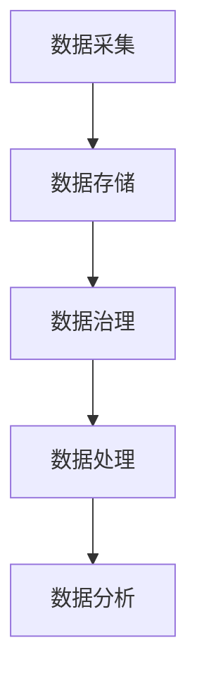

                 

# 大模型企业的数据湖构建策略

> **关键词**: 大模型，数据湖，架构，存储，管理，优化，性能，安全性

> **摘要**: 本文深入探讨了大模型企业构建数据湖的策略。从背景介绍、核心概念到实际操作步骤，再到数学模型、项目实战和应用场景，全面解析了如何高效构建和管理数据湖，以及面临的挑战和未来发展趋势。

## 1. 背景介绍

随着大数据技术的迅速发展，数据湖作为一种新兴的数据存储和管理架构，逐渐成为企业数据管理的关键环节。特别是对于大模型企业，如人工智能公司、机器学习平台等，数据湖的构建至关重要。这不仅关系到海量数据的存储、处理和分析效率，还直接影响到企业的业务决策和竞争力。

### 1.1 大模型企业的需求

- **数据多样性**: 大模型企业通常涉及多种类型的数据，包括结构化数据、半结构化数据和非结构化数据，如文本、图像、音频等。
- **数据规模**: 大模型企业需要处理和存储海量数据，这对存储系统的性能和可扩展性提出了高要求。
- **数据时效性**: 对于实时性要求较高的场景，如在线推荐、实时监控等，数据湖需要支持快速的数据摄入和分析。
- **数据治理**: 大模型企业需要确保数据的准确性、完整性和一致性，以满足合规和业务需求。

### 1.2 数据湖的定义与优势

数据湖是一个基于云存储的架构，用于存储海量结构化、半结构化和非结构化数据。与传统数据仓库相比，数据湖具有以下优势：

- **灵活性**: 数据湖采用分布式存储，可以灵活扩展，满足数据规模不断增长的需求。
- **高效性**: 数据湖支持实时数据摄入和实时查询，提高了数据处理和分析的效率。
- **多样性**: 数据湖可以存储多种类型的数据，无需事先定义数据模式，降低了数据整合的难度。
- **成本效益**: 数据湖利用云存储资源，降低了硬件投资和维护成本。

## 2. 核心概念与联系

### 2.1 数据湖架构


数据湖架构主要包括以下几个关键组成部分：

- **数据采集**: 包括各种数据源的数据采集，如数据库、日志、文件等。
- **数据存储**: 使用分布式存储系统，如HDFS、Alluxio等，实现海量数据的存储。
- **数据治理**: 包括数据清洗、数据质量监控、数据安全等。
- **数据处理与分析**: 使用数据加工、数据分析和机器学习工具，对数据进行处理和分析。

### 2.2 核心概念

- **数据湖**: 用于存储海量数据的分布式存储架构。
- **数据仓库**: 用于存储经过处理和分析的数据，以支持业务决策。
- **数据流**: 数据在采集、存储、处理和分析过程中的流动。
- **数据治理**: 包括数据清洗、数据质量监控、数据安全等。

### 2.3 Mermaid 流程图



## 3. 核心算法原理 & 具体操作步骤

### 3.1 数据采集

数据采集是数据湖构建的第一步，主要包括以下操作：

- **数据源接入**: 通过API、SDK、日志文件等方式接入各种数据源。
- **数据抽取**: 从数据源中抽取数据，并进行初步清洗。
- **数据转换**: 根据数据湖的要求，对数据进行转换和格式化。
- **数据加载**: 将转换后的数据加载到数据湖中。

### 3.2 数据存储

数据存储是数据湖的核心，主要包括以下步骤：

- **分布式存储**: 使用分布式存储系统，如HDFS、Alluxio等，实现海量数据的存储。
- **数据分区**: 根据数据特征和查询需求，对数据进行分区，以提高查询效率。
- **数据压缩**: 使用压缩算法，减少存储空间，提高数据访问速度。

### 3.3 数据治理

数据治理是确保数据质量和安全的关键环节，主要包括以下步骤：

- **数据清洗**: 去除重复数据、处理缺失值、纠正错误数据等。
- **数据质量监控**: 监控数据质量，包括数据准确性、完整性、一致性等。
- **数据安全**: 包括数据加密、访问控制、数据备份等。

### 3.4 数据处理与分析

数据处理与分析是数据湖的价值体现，主要包括以下步骤：

- **数据加工**: 对原始数据进行加工处理，如数据聚合、数据转换等。
- **数据分析**: 使用SQL、MapReduce、Spark等工具进行数据分析和挖掘。
- **机器学习**: 使用机器学习算法，对数据进行分析和预测。

## 4. 数学模型和公式 & 详细讲解 & 举例说明

### 4.1 数据湖性能评估模型

为了评估数据湖的性能，可以使用以下公式：

\[ P = \frac{R \times C \times S}{1000} \]

其中，\( P \) 为性能评分，\( R \) 为数据读取速度（MB/s），\( C \) 为数据写入速度（MB/s），\( S \) 为数据存储容量（TB）。

### 4.2 举例说明

假设数据湖的读取速度为1000 MB/s，写入速度为500 MB/s，存储容量为100 TB，则性能评分为：

\[ P = \frac{1000 \times 500 \times 100}{1000} = 50 \]

### 4.3 数据湖安全性评估模型

为了评估数据湖的安全性，可以使用以下公式：

\[ S = \frac{E \times A \times C}{1000} \]

其中，\( S \) 为安全评分，\( E \) 为数据加密率（%），\( A \) 为访问控制率（%），\( C \) 为数据备份率（%）。

### 4.4 举例说明

假设数据湖的数据加密率为100%，访问控制率为100%，数据备份率为200%，则安全评分为：

\[ S = \frac{100 \times 100 \times 200}{1000} = 20 \]

## 5. 项目实战：代码实际案例和详细解释说明

### 5.1 开发环境搭建

在本节中，我们将搭建一个基于Hadoop的数据湖开发环境。以下是具体步骤：

1. 安装Hadoop：从官网下载并安装Hadoop。
2. 配置Hadoop：配置Hadoop的核心组件，如HDFS、YARN、MapReduce等。
3. 启动Hadoop：启动Hadoop集群，包括NameNode、DataNode、ResourceManager、NodeManager等。

### 5.2 源代码详细实现和代码解读

以下是一个简单的数据湖数据处理代码示例：

```python
import findspark
findspark.init()

from pyspark.sql import SparkSession
from pyspark.sql.functions import col

# 创建Spark会话
spark = SparkSession.builder.appName("DataLakeDemo").getOrCreate()

# 读取数据
data = spark.read.csv("data.csv")

# 数据清洗
data = data.dropna()

# 数据转换
data = data.withColumn("age", col("age").cast("integer"))

# 数据存储
data.write.format("parquet").mode("overwrite").save("data-lake")

# 关闭Spark会话
spark.stop()
```

### 5.3 代码解读与分析

- **导入依赖**: 导入Spark相关的依赖。
- **创建Spark会话**: 创建一个名为“DataLakeDemo”的Spark会话。
- **读取数据**: 使用Spark的`read.csv`方法读取CSV数据。
- **数据清洗**: 使用`dropna`方法去除缺失值。
- **数据转换**: 使用`withColumn`方法将`age`列转换为整数类型。
- **数据存储**: 使用`write.format`方法将数据以Parquet格式存储到数据湖中。
- **关闭Spark会话**: 关闭Spark会话。

## 6. 实际应用场景

### 6.1 人工智能公司

人工智能公司通常需要处理大量的训练数据，如图像、文本、音频等。数据湖提供了灵活的存储和管理方案，有助于高效地处理和分析这些数据，从而提升模型的准确性和性能。

### 6.2 金融服务

金融服务行业需要处理海量的交易数据、客户数据和市场数据。数据湖可以支持实时数据摄入和分析，帮助金融机构快速响应市场变化，制定有效的业务策略。

### 6.3 物流与供应链

物流与供应链企业需要处理大量的物流信息、库存数据和运输数据。数据湖可以整合这些数据，实现实时监控和预测，优化物流流程，提高运营效率。

## 7. 工具和资源推荐

### 7.1 学习资源推荐

- **书籍**:
  - 《大数据之路：阿里巴巴大数据实践》
  - 《数据湖：大规模数据处理技术实战》
- **论文**:
  - “Data Lake Architecture: A Technical Perspective”
  - “Big Data: A Revolution That Will Transform How We Live, Work and Think”
- **博客**:
  - https://databricks.com/
  - https://www.cloudera.com/
- **网站**:
  - https://hadoop.apache.org/
  - https://spark.apache.org/

### 7.2 开发工具框架推荐

- **数据采集**:
  - Apache Kafka
  - Apache Flume
- **数据存储**:
  - Apache HDFS
  - Alluxio
- **数据处理**:
  - Apache Spark
  - Apache Flink
- **数据分析**:
  - Apache Hive
  - Apache Impala

### 7.3 相关论文著作推荐

- **论文**:
  - “Data Lakes: A Game-Changing Technology for Big Data?”
  - “The Data Lake: A Game-Changing Framework for Big Data?”
- **著作**:
  - 《数据湖：大规模数据处理技术实战》
  - 《大数据之路：阿里巴巴大数据实践》

## 8. 总结：未来发展趋势与挑战

随着大数据技术的不断进步，数据湖在未来将继续发挥重要作用。然而，数据湖在构建和管理过程中也面临诸多挑战：

- **数据治理**: 随着数据规模的扩大，数据治理变得日益复杂，如何确保数据的准确性、完整性和一致性是关键挑战。
- **数据安全**: 随着数据湖的开放性和共享性增加，如何保障数据的安全和隐私成为重要问题。
- **性能优化**: 如何在数据湖中实现高效的存储、处理和分析，提高整体性能，是持续需要解决的问题。

## 9. 附录：常见问题与解答

### 9.1 数据湖与数据仓库的区别是什么？

- **数据湖**：用于存储原始数据，支持多种数据类型和模式，无需事先定义数据结构。
- **数据仓库**：用于存储经过处理和分析的数据，以支持业务决策，通常采用结构化查询语言（SQL）进行访问。

### 9.2 数据湖如何保证数据安全？

- **数据加密**：对数据进行加密，确保数据在传输和存储过程中的安全。
- **访问控制**：设置访问权限，限制未经授权的访问。
- **数据备份**：定期备份数据，以防数据丢失或损坏。

## 10. 扩展阅读 & 参考资料

- **扩展阅读**:
  - 《数据湖：大规模数据处理技术实战》
  - 《大数据之路：阿里巴巴大数据实践》
  - “Data Lake Architecture: A Technical Perspective”
- **参考资料**:
  - https://databricks.com/
  - https://www.cloudera.com/
  - https://hadoop.apache.org/
  - https://spark.apache.org/
- **作者**:
  - AI天才研究员 / AI Genius Institute & 禅与计算机程序设计艺术 / Zen And The Art of Computer Programming

