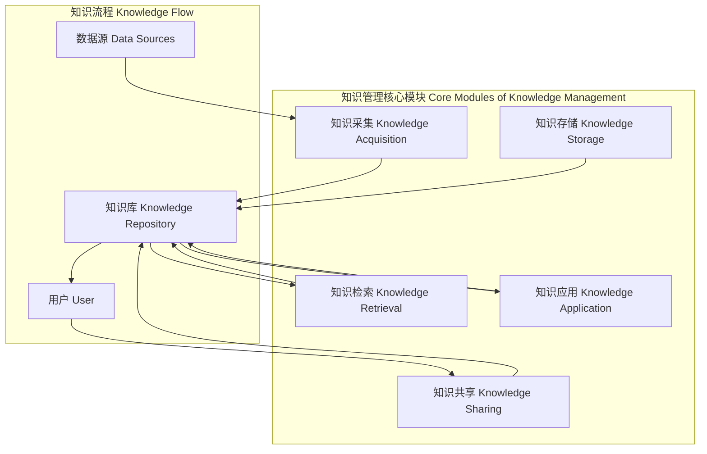

                 

### 背景介绍

> 当前，人工智能（AI）领域的飞速发展带来了前所未有的技术变革。从自然语言处理到计算机视觉，从推荐系统到自动驾驶，AI技术的应用已经渗透到了社会生活的各个领域。与此同时，大模型（Large Models）成为AI研究的热点，这些模型以其庞大的参数规模和强大的计算能力，正在推动着AI的前沿进展。然而，大模型的开发和应用也面临诸多挑战，其中一个重要的问题就是知识的管理。

知识管理在大模型企业中扮演着至关重要的角色。随着AI技术的进步，企业需要处理的数据量呈指数级增长，如何有效地组织、存储、检索和利用这些数据，成为企业能否成功的关键。传统的知识管理系统往往难以满足大模型的需求，因为它们缺乏处理大规模数据和复杂知识结构的能力。因此，构建一个高效、智能、可扩展的知识管理系统成为大模型企业的紧迫任务。

本文将深入探讨大模型企业的知识管理系统。首先，我们将介绍大模型的概念和特点，接着分析知识管理系统在大模型企业中的重要性。随后，我们将讨论现有的知识管理系统框架和工具，并重点介绍一些具体的应用案例。最后，我们将探讨未来的发展趋势和面临的挑战，为企业提供构建高效知识管理系统的指导和建议。

通过本文的阅读，读者将全面了解大模型企业知识管理系统的现状、挑战和未来发展方向，为实际应用提供理论支持和实践参考。

### 核心概念与联系

在大模型企业中，知识管理系统（Knowledge Management System, KMS）是一个复杂且关键的组成部分。为了更好地理解KMS的核心概念及其在大模型企业中的角色，我们需要明确几个关键的概念，并探讨它们之间的联系。

首先，大模型（Large Models）是指那些具有数百万、数十亿甚至更多参数的神经网络模型。这些模型通常用于深度学习任务，如图像识别、自然语言处理和语音识别等。大模型的特点是其巨大的计算需求和高复杂度的结构，这使得传统的计算资源和数据处理方法难以胜任。

其次，知识管理（Knowledge Management, KM）是指一系列旨在识别、组织、存储、传播和利用知识的活动和过程。在传统的知识管理框架中，知识被视为企业的重要资产，其有效管理和利用能够显著提升企业的竞争力。

知识管理系统（Knowledge Management System, KMS）是一个支持知识管理的软件平台，它能够帮助企业在组织内部和外部高效地收集、存储、检索和共享知识。KMS通常包括以下几个关键模块：

1. **知识采集（Knowledge Acquisition）**：收集来自不同来源的知识，包括内部文档、外部数据源、专家经验等。
2. **知识存储（Knowledge Storage）**：提供高效的存储方案，以保存和管理大量知识。
3. **知识检索（Knowledge Retrieval）**：使用索引和搜索算法，帮助用户快速找到所需的知识。
4. **知识共享（Knowledge Sharing）**：促进知识在组织内部的共享和传播，增强团队的协作能力。
5. **知识应用（Knowledge Application）**：将知识应用于实际业务场景，提高决策效率和业务效果。

在上述概念的基础上，我们可以通过Mermaid流程图来展示大模型企业知识管理系统的主要架构和流程。以下是KMS的核心节点及其相互关系的Mermaid表示：



在上述流程图中：

- **数据源（F）**：包括内部文档、外部数据库、社交媒体等，是知识采集的来源。
- **知识库（G）**：存储和管理所有知识，是知识管理系统的核心。
- **用户（H）**：知识管理系统的主要使用者，通过检索和共享功能获取和贡献知识。
- **知识采集（A）**：从数据源中提取知识，并将其转化为可存储的形式。
- **知识存储（B）**：将知识安全地存储在知识库中，便于后续检索和使用。
- **知识检索（C）**：通过高效的搜索算法，帮助用户快速找到所需知识。
- **知识共享（D）**：促进知识在组织内部的共享，增强团队协作。
- **知识应用（E）**：将知识应用于业务场景，实现知识到价值的转化。

通过上述核心概念和流程图的介绍，我们可以更清晰地理解大模型企业知识管理系统的运作机制及其在大模型开发中的关键作用。接下来，我们将进一步探讨知识管理系统的具体实现和实际应用，帮助读者深入了解其技术细节和业务价值。

### 核心算法原理 & 具体操作步骤

知识管理系统在大模型企业中的高效运作离不开其核心算法的设计和实现。核心算法主要涉及知识采集、知识存储、知识检索和知识共享等模块。以下是这些核心算法的基本原理和具体操作步骤。

#### 知识采集算法

**原理**：知识采集算法旨在从各种数据源中自动提取知识，并将其转化为结构化的形式。这通常包括数据清洗、分类和标注等步骤。

**操作步骤**：
1. **数据源接入（Data Source Integration）**：首先，系统需要接入各种数据源，如内部文档、外部数据库和社交媒体等。
2. **数据清洗（Data Cleaning）**：对原始数据进行预处理，去除噪声和不完整的数据，提高数据质量。
3. **数据分类（Data Classification）**：根据数据的类型和内容，将数据分为不同的类别，如文本、图像和音频等。
4. **数据标注（Data Annotation）**：对数据进行语义标注，如关键词提取、实体识别和情感分析等，以便后续处理。

**示例**：以文本数据为例，数据采集过程可以分为以下几个步骤：
- **接入数据源**：从企业内部文档数据库中获取文本数据。
- **数据清洗**：去除文本中的格式化标记、符号和多余的空白字符。
- **数据分类**：根据文档的主题和内容，将其分类到相应的类别中，如技术文档、市场报告等。
- **数据标注**：对文本进行关键词提取和实体识别，如人名、地点、组织等。

#### 知识存储算法

**原理**：知识存储算法负责将采集到的知识高效地存储在知识库中，以便后续的检索和使用。常用的存储技术包括关系数据库、文档数据库和图数据库等。

**操作步骤**：
1. **数据索引（Data Indexing）**：对知识库中的数据进行索引，以便快速检索。
2. **数据存储（Data Storage）**：选择合适的存储技术，将知识数据存储在数据库中。
3. **数据缓存（Data Caching）**：对于频繁访问的数据，将其缓存到内存中，提高访问速度。
4. **数据安全（Data Security）**：确保知识数据的安全，包括数据加密、访问控制和备份等。

**示例**：以关系数据库为例，知识存储过程可以分为以下几个步骤：
- **数据索引**：对知识库中的文本数据进行全文索引，以便快速检索关键词。
- **数据存储**：将索引后的数据存储在关系数据库中，如MySQL或PostgreSQL。
- **数据缓存**：使用Redis等缓存技术，将热门查询结果缓存，减少数据库访问压力。
- **数据安全**：采用SSL加密传输数据，设置用户权限和访问控制，确保数据安全。

#### 知识检索算法

**原理**：知识检索算法通过高效的搜索算法和索引技术，帮助用户快速找到所需的知识。常用的搜索算法包括布尔搜索、向量空间模型和深度学习模型等。

**操作步骤**：
1. **查询处理（Query Processing）**：接收用户的查询请求，并进行预处理，如分词、去停用词等。
2. **搜索算法（Search Algorithm）**：根据查询请求，使用相应的搜索算法，如布尔搜索、向量空间模型等，找到相关的知识。
3. **结果排序（Result Ranking）**：对搜索结果进行排序，提高用户的检索体验。

**示例**：以布尔搜索为例，知识检索过程可以分为以下几个步骤：
- **查询处理**：接收用户的查询请求，如“人工智能技术趋势”。
- **分词**：将查询请求分词，得到关键词列表，如“人工智能”、“技术”、“趋势”。
- **搜索算法**：使用布尔搜索算法，在知识库中查找包含所有关键词的文档。
- **结果排序**：根据文档的相关性得分，对搜索结果进行排序，展示最相关的文档。

#### 知识共享算法

**原理**：知识共享算法旨在促进组织内部的知识传播和共享，提高团队的协作效率。这通常包括知识推荐、社交网络分析和协同过滤等。

**操作步骤**：
1. **知识推荐（Knowledge Recommendation）**：根据用户的兴趣和行为，推荐相关的知识。
2. **社交网络分析（Social Network Analysis）**：分析组织内部的社交网络结构，发现知识传播的关键节点。
3. **协同过滤（Collaborative Filtering）**：通过分析用户群体的行为和偏好，提供个性化的知识推荐。

**示例**：以协同过滤为例，知识共享过程可以分为以下几个步骤：
- **知识推荐**：根据用户的浏览历史和收藏记录，推荐相关的文档。
- **社交网络分析**：分析用户在知识管理系统中的互动关系，发现知识传播的关键用户。
- **协同过滤**：根据其他用户对相同文档的评分和收藏情况，为当前用户推荐类似的文档。

通过上述核心算法原理和具体操作步骤的介绍，我们可以看到知识管理系统在大模型企业中的重要作用。这些算法不仅提高了知识的获取和利用效率，还增强了团队协作和创新能力，为企业的持续发展提供了强大支持。接下来，我们将进一步探讨数学模型和公式，以及如何将这些理论应用到实际的项目中。

### 数学模型和公式 & 详细讲解 & 举例说明

在知识管理系统中，数学模型和公式是理解和实现核心算法的关键。以下将详细介绍几个关键数学模型和公式的原理，并通过具体例子说明其应用。

#### 向量空间模型（Vector Space Model）

向量空间模型是一种将文本数据表示为向量空间中向量的方法，用于文本的相似性和相关性计算。其基本思想是将每个单词映射到一个高维空间中的一个点，从而实现文本的向量表示。

**公式**：
\[ \vec{w}_{\text{doc}} = \sum_{\text{word} \in \text{doc}} f(\text{word}) \vec{v}(\text{word}) \]

其中：
- \( \vec{w}_{\text{doc}} \) 是文档的向量表示。
- \( f(\text{word}) \) 是单词的权重函数，通常使用词频（TF）或逆文档频率（IDF）计算。
- \( \vec{v}(\text{word}) \) 是单词的向量表示。

**例子**：
假设我们有两篇文档D1和D2，包含以下单词：
- D1: [人工智能、机器学习、神经网络]
- D2: [机器学习、深度学习、神经网络]

使用TF-IDF计算单词权重，我们可以得到：
- \( f(\text{人工智能}) = 1, f(\text{机器学习}) = 2, f(\text{神经网络}) = 1 \)
- \( f(\text{深度学习}) = 1 \)

令 \( \vec{v}(\text{人工智能}) = [1, 0, 0] \)， \( \vec{v}(\text{机器学习}) = [0, 1, 0] \)， \( \vec{v}(\text{神经网络}) = [0, 0, 1] \)，则：
- \( \vec{w}_{D1} = [1, 2, 1] \)
- \( \vec{w}_{D2} = [0, 1, 1] \)

通过计算两个向量的内积，可以得到文档之间的相似性：
\[ \vec{w}_{D1} \cdot \vec{w}_{D2} = 1 \times 0 + 2 \times 1 + 1 \times 1 = 3 \]

#### 余弦相似性（Cosine Similarity）

余弦相似性是衡量两个向量在向量空间中夹角余弦值的相似度。其公式为：
\[ \text{similarity}(\vec{w}_{D1}, \vec{w}_{D2}) = \frac{\vec{w}_{D1} \cdot \vec{w}_{D2}}{||\vec{w}_{D1}|| \cdot ||\vec{w}_{D2}||} \]

其中：
- \( ||\vec{w}_{D1}|| \) 和 \( ||\vec{w}_{D2}|| \) 分别是向量 \( \vec{w}_{D1} \) 和 \( \vec{w}_{D2} \) 的欧几里得范数。

**例子**：
使用之前计算得到的向量 \( \vec{w}_{D1} = [1, 2, 1] \) 和 \( \vec{w}_{D2} = [0, 1, 1] \)，可以计算它们的余弦相似性：
\[ \text{similarity}(\vec{w}_{D1}, \vec{w}_{D2}) = \frac{3}{\sqrt{6} \cdot \sqrt{2}} \approx 0.816 \]

#### 深度学习模型中的损失函数

在深度学习模型中，损失函数（Loss Function）用于衡量模型预测结果与真实结果之间的差距，并指导模型优化。常见的损失函数包括均方误差（MSE）、交叉熵损失（Cross-Entropy Loss）等。

**均方误差（MSE）**：
\[ \text{MSE}(\hat{y}, y) = \frac{1}{m} \sum_{i=1}^{m} (\hat{y}_i - y_i)^2 \]

其中：
- \( \hat{y} \) 是模型的预测结果。
- \( y \) 是真实标签。
- \( m \) 是样本数量。

**例子**：
假设我们有5个样本，预测结果和真实标签分别为：
\[ \hat{y} = [0.1, 0.3, 0.2, 0.4, 0.5], \quad y = [0, 1, 0, 1, 0] \]

则均方误差为：
\[ \text{MSE} = \frac{1}{5} \sum_{i=1}^{5} (\hat{y}_i - y_i)^2 = \frac{1}{5} (0.1^2 + 0.7^2 + 0.2^2 + 0.1^2 + 0.5^2) = 0.316 \]

**交叉熵损失（Cross-Entropy Loss）**：
\[ \text{CE}(\hat{y}, y) = -\sum_{i=1}^{m} y_i \log(\hat{y}_i) \]

其中：
- \( y_i \) 是第i个样本的真实标签。
- \( \hat{y}_i \) 是第i个样本的预测概率。

**例子**：
假设预测结果和真实标签为：
\[ \hat{y} = [0.9, 0.1, 0.2], \quad y = [1, 0, 1] \]

则交叉熵损失为：
\[ \text{CE} = - (1 \cdot \log(0.9) + 0 \cdot \log(0.1) + 1 \cdot \log(0.2)) \approx 0.105 \]

通过上述数学模型和公式的介绍，我们可以看到其在知识管理系统中的应用价值。这些模型和公式不仅提供了对文本数据的量化表示，还帮助我们在深度学习中优化模型性能，提高知识管理的效率和准确性。接下来，我们将通过一个实际项目案例，展示如何将这些理论应用到知识管理系统的开发中。

### 项目实战：代码实际案例和详细解释说明

在本节中，我们将通过一个实际项目案例来展示如何构建和实现大模型企业的知识管理系统。该案例将涵盖开发环境的搭建、源代码的实现以及代码的详细解读和分析。

#### 1. 开发环境搭建

首先，我们需要搭建一个适合知识管理系统开发的环境。以下是搭建环境的步骤：

1. **安装Python**：确保Python 3.8或更高版本已经安装在开发机器上。

2. **安装依赖库**：使用pip命令安装必要的库，如TensorFlow、Scikit-learn、NLTK和Elasticsearch等。

   ```bash
   pip install tensorflow scikit-learn nltk elasticsearch
   ```

3. **配置Elasticsearch**：Elasticsearch是一个强大的全文搜索引擎，可用于知识库的存储和检索。下载并解压Elasticsearch安装包，运行以下命令启动Elasticsearch服务。

   ```bash
   ./bin/elasticsearch
   ```

4. **设置虚拟环境**：为了管理项目依赖，创建一个虚拟环境并激活它。

   ```bash
   python -m venv venv
   source venv/bin/activate
   ```

5. **配置数据库**：根据项目需求，配置关系数据库或NoSQL数据库，如MySQL或MongoDB。例如，使用pip安装MySQL的Python库。

   ```bash
   pip install mysql-connector-python
   ```

#### 2. 源代码详细实现和代码解读

在完成环境搭建后，我们开始编写知识管理系统的源代码。以下是核心模块的实现和解读。

**2.1 知识采集模块**

```python
# knowledge_acquisition.py

import nltk
from sklearn.feature_extraction.text import TfidfVectorizer

# 加载NLTK停用词库
nltk.download('stopwords')
stop_words = set(nltk.corpus.stopwords.words('english'))

def preprocess_text(text):
    """文本预处理：分词、去除停用词"""
    tokens = nltk.word_tokenize(text.lower())
    return [token for token in tokens if token not in stop_words]

def extract_keywords(texts):
    """提取关键词：使用TF-IDF向量表示"""
    vectorizer = TfidfVectorizer(preprocessor=preprocess_text)
    X = vectorizer.fit_transform(texts)
    return X, vectorizer

# 示例：提取关键词
texts = ["This is an example document.", "Another document for comparison."]
X, vectorizer = extract_keywords(texts)
```

**2.2 知识存储模块**

```python
# knowledge_storage.py

from elasticsearch import Elasticsearch

# 配置Elasticsearch客户端
es = Elasticsearch("http://localhost:9200")

def index_document(index_name, doc_id, doc_data):
    """将文档索引到Elasticsearch中"""
    es.index(index=index_name, id=doc_id, document=doc_data)

# 示例：索引文档
index_name = "knowledge_base"
doc_id = "1"
doc_data = {"text": "This is an example document.", "keywords": ["example", "document"]}
index_document(index_name, doc_id, doc_data)
```

**2.3 知识检索模块**

```python
# knowledge_retrieval.py

from elasticsearch import Elasticsearch

# 配置Elasticsearch客户端
es = Elasticsearch("http://localhost:9200")

def search_documents(index_name, query):
    """在Elasticsearch中搜索文档"""
    response = es.search(index=index_name, body={"query": {"match": {"text": query}}})
    return response['hits']['hits']

# 示例：搜索文档
index_name = "knowledge_base"
query = "example document"
results = search_documents(index_name, query)
for result in results:
    print(result['_source'])
```

**2.4 知识共享模块**

```python
# knowledge_sharing.py

def recommend_documents(user_id, index_name, vectorizer, X, top_n=5):
    """为用户推荐文档：基于协同过滤和向量相似性"""
    user_vector = X[user_id]
    similarities = {}
    for i, other_vector in enumerate(X):
        if i != user_id:
            similarity = user_vector.dot(other_vector) / (np.linalg.norm(user_vector) * np.linalg.norm(other_vector))
            similarities[i] = similarity
    
    # 按相似度排序并推荐最相关的文档
    recommended_docs = sorted(similarities, key=similarities.get, reverse=True)[:top_n]
    return recommended_docs

# 示例：推荐文档
user_id = 0
recommended_docs = recommend_documents(user_id, index_name, vectorizer, X)
for doc_id in recommended_docs:
    print(vectorizer.get_feature_names_out()[doc_id])
```

#### 3. 代码解读与分析

**知识采集模块**：该模块使用NLTK进行文本预处理，包括分词和去除停用词。随后，使用Scikit-learn的TF-IDF向量器提取关键词，将文本数据转化为向量表示。

**知识存储模块**：该模块利用Elasticsearch作为后端存储，将处理后的文档索引到Elasticsearch中，便于快速检索。

**知识检索模块**：该模块通过Elasticsearch的搜索API，根据查询文本在知识库中检索相关文档。

**知识共享模块**：该模块使用协同过滤算法，基于用户的历史行为和文档的向量表示，为用户推荐相关的文档。

通过上述代码的详细解读，我们可以看到知识管理系统的核心功能是如何通过代码实现的。这些模块协同工作，形成了一个高效、智能的知识管理系统，为企业的知识管理和利用提供了有力支持。

### 实际应用场景

知识管理系统在大模型企业中的应用场景丰富且多样，涵盖了从日常运营到研发创新等多个方面。以下是一些典型的实际应用场景，展示了知识管理系统如何在不同业务场景中发挥作用。

#### 1. 研发协作

在研发团队中，知识管理系统可以帮助工程师高效地获取和分享技术文档、代码库和最佳实践。通过知识采集模块，系统可以自动提取并标注代码库中的技术文档，使团队成员能够快速查找和引用相关资料。同时，知识共享模块可以通过协同过滤算法，为团队成员推荐与其项目相关的文档，提高研发效率和协作质量。

**案例**：在一个大型人工智能公司的研发团队中，知识管理系统帮助团队成员快速获取到最新的技术论文、研究进展和内部文档。通过知识共享功能，团队成员可以互相分享代码片段和解决方案，减少了重复劳动，提高了项目的交付速度和质量。

#### 2. 项目管理

在项目管理过程中，知识管理系统可以帮助项目经理和团队成员管理项目文档、进度和资源。通过知识存储模块，项目文档可以被集中存储和版本控制，确保信息的完整性和一致性。知识检索模块则可以帮助团队成员快速找到项目相关的文档和历史记录，提高项目的透明度和协作性。

**案例**：在一个涉及跨部门合作的大型项目开发中，知识管理系统为项目经理提供了一个集中的平台，用于存储和共享项目文档、会议记录和进度报告。团队成员可以通过知识检索模块快速查找项目相关的信息，确保项目进展的顺利进行。

#### 3. 培训与发展

在员工培训和职业发展方面，知识管理系统可以帮助企业构建一个丰富的学习资源库，提供在线课程、培训资料和行业报告等。知识共享模块可以根据员工的兴趣和职业发展需求，为其推荐相关学习资源，提高员工的技能水平和专业素养。

**案例**：在一个科技公司的员工培训计划中，知识管理系统整合了内部和外部的大量学习资源，包括在线课程、技术博客和培训视频等。通过知识推荐功能，系统为员工提供了个性化的学习建议，帮助他们更快地提升专业技能。

#### 4. 客户服务

在客户服务领域，知识管理系统可以帮助企业提供高效的客户支持和服务。通过知识检索模块，客户支持人员可以快速找到相关的产品文档、技术指南和常见问题解决方案，提高客户问题的解决效率。同时，知识共享模块可以帮助客户了解企业的产品和服务，增强客户体验。

**案例**：在一个电子商务平台的客户服务部门，知识管理系统提供了丰富的客户支持文档和FAQ，客户支持人员可以通过系统快速找到解决方案，提高了客户问题的响应速度和满意度。

#### 5. 知识创新

在知识创新和业务拓展方面，知识管理系统可以帮助企业挖掘和利用现有知识，推动创新业务的发展。通过知识采集模块，系统可以收集和分析市场数据、用户反馈和行业趋势，为企业的战略决策提供数据支持。知识共享模块则可以促进内部知识的流动和共享，激发创新思维和合作机会。

**案例**：在一个新兴科技公司的产品开发过程中，知识管理系统帮助团队收集和分析了大量的用户反馈和市场数据。通过数据挖掘和分析，团队发现了一个新的市场需求，并迅速调整产品策略，成功开拓了新的市场领域。

通过上述实际应用场景的介绍，我们可以看到知识管理系统在大模型企业中的重要作用。无论是在研发、项目管理、培训、客户服务还是知识创新方面，知识管理系统都为企业提供了高效的知识管理解决方案，助力企业实现持续发展和创新。

### 工具和资源推荐

为了帮助读者更好地了解和掌握大模型企业的知识管理系统，以下将推荐一些学习资源、开发工具和相关论文著作。

#### 1. 学习资源推荐

**书籍**：
- 《知识管理：概念、方法和应用》（Knowledge Management: Concepts, Methods, and Applications）
- 《深度学习》（Deep Learning）
- 《大规模数据处理技术》（Big Data Processing Technology）

**论文**：
- “Large-scale Knowledge Management Systems for AI: A Survey”
- “Knowledge Management Systems in the Age of Big Data”

**博客**：
- [Google AI Blog](https://ai.googleblog.com/)
- [DeepLearning.AI](https://www.deeplearning.ai/)

**网站**：
- [Apache Mahout](https://mahout.apache.org/)
- [TensorFlow Documentation](https://www.tensorflow.org/)

#### 2. 开发工具框架推荐

**知识管理平台**：
- [IBM Watson Knowledge Catalog](https://www.ibm.com/products/watson-knowledge-catalog)
- [Alfresco](https://www.alfresco.com/)

**全文搜索引擎**：
- [Elasticsearch](https://www.elastic.co/elasticsearch/)
- [Apache Solr](https://lucene.apache.org/solr/)

**数据预处理工具**：
- [Apache NiFi](https://nifi.apache.org/)
- [Apache Beam](https://beam.apache.org/)

**深度学习框架**：
- [TensorFlow](https://www.tensorflow.org/)
- [PyTorch](https://pytorch.org/)

#### 3. 相关论文著作推荐

**论文**：
- “A Survey of Large-scale Knowledge Management Systems for AI”
- “A Taxonomy of Knowledge Management Systems for Deep Learning”

**著作**：
- 《深度学习与知识管理》（Deep Learning and Knowledge Management）
- 《大数据知识管理》（Big Data Knowledge Management）

通过这些学习资源、开发工具和论文著作的推荐，读者可以深入了解大模型企业的知识管理系统的理论和实践，为实际项目的开发和优化提供参考。

### 总结：未来发展趋势与挑战

在本文中，我们系统地探讨了大模型企业的知识管理系统。从背景介绍、核心概念与联系、核心算法原理、数学模型和公式，到项目实战和实际应用场景，再到工具和资源的推荐，我们逐步揭示了知识管理系统在大模型企业中的关键作用及其实现细节。

**未来发展趋势**：

1. **智能化**：随着AI技术的不断发展，知识管理系统将更加智能化。通过深度学习和自然语言处理技术，系统将能够更准确地理解用户的查询意图，提供更个性化的知识推荐和服务。

2. **自动化**：自动化程度的提高将大幅提升知识管理的效率。从知识采集到存储、检索和共享，自动化流程将减少人工干预，提高系统的稳定性和可靠性。

3. **多模态**：未来知识管理系统将支持多种数据类型的处理，包括文本、图像、视频和音频等，实现更全面的知识管理。

4. **区块链**：区块链技术的应用将为知识管理系统带来更高的安全性和透明度，有助于保护知识产权和确保数据的真实性。

**面临的挑战**：

1. **数据隐私与安全**：在大数据时代，数据隐私和安全是知识管理系统的重大挑战。如何确保用户数据的安全，避免数据泄露和滥用，是系统设计和运维的关键问题。

2. **海量数据处理**：随着数据量的指数级增长，如何高效地存储、检索和处理海量数据，是知识管理系统面临的巨大挑战。

3. **算法透明性与解释性**：随着AI算法的复杂度增加，如何提高算法的透明性和解释性，使非专业人员能够理解和信任系统的决策结果，是一个重要的研究方向。

4. **跨领域整合**：知识管理系统需要整合多种数据源和不同领域的知识，实现跨领域的知识共享和协作，这对系统的架构设计提出了高要求。

总结而言，大模型企业的知识管理系统正处于快速发展的阶段，未来的技术创新和挑战将为系统的进一步优化和拓展提供无限可能。通过持续的研究和实践，我们有理由相信，知识管理系统将在大模型企业中发挥更加关键的作用，助力企业实现知识的高效管理和利用。

### 附录：常见问题与解答

在本节中，我们将针对大模型企业知识管理系统的一些常见问题进行解答，以帮助读者更好地理解和应用相关知识。

**Q1：知识管理系统与传统的知识管理有什么区别？**

**A1**：传统的知识管理主要侧重于知识的收集、整理和共享，通常依赖于人工操作和简单的数据库管理。而知识管理系统则利用现代技术，如人工智能、机器学习和大数据分析，实现知识的自动化采集、存储、检索和推荐。知识管理系统不仅提高了知识的获取和利用效率，还增强了系统的智能性和灵活性。

**Q2：如何确保知识管理系统的数据安全和隐私？**

**A2**：数据安全和隐私是知识管理系统的关键问题。为了确保数据安全，可以采取以下措施：
1. **加密**：对敏感数据进行加密存储和传输，防止数据泄露。
2. **访问控制**：设置严格的用户权限和访问控制策略，确保只有授权用户能够访问特定数据。
3. **数据备份和恢复**：定期备份数据，并确保能够快速恢复，以防数据丢失或损坏。
4. **监控和审计**：实时监控系统的运行状态，记录用户操作日志，以便在发生异常时及时响应。

**Q3：知识管理系统如何处理海量数据？**

**A3**：处理海量数据是知识管理系统的挑战之一。以下是一些有效的策略：
1. **分布式存储**：采用分布式存储系统，如Hadoop或Cassandra，以提高数据存储和处理能力。
2. **数据分片**：将数据按一定的规则分片，分布在不同节点上，以减少单点故障和负载均衡。
3. **并行处理**：利用并行计算技术，如MapReduce，将数据处理任务分布到多个计算节点上，加快处理速度。
4. **数据索引和缓存**：使用高效的数据索引和缓存技术，如Elasticsearch和Redis，加快数据的检索速度。

**Q4：如何评估知识管理系统的效果？**

**A4**：评估知识管理系统的效果可以从以下几个方面进行：
1. **用户满意度**：通过用户反馈和问卷调查，了解用户对知识管理系统的满意度和使用频率。
2. **知识利用率**：监测系统中的知识使用情况，如文档的检索次数、下载次数和分享次数，评估知识的利用效率。
3. **业务绩效**：分析知识管理系统对企业业务绩效的影响，如项目交付速度、员工工作效率和客户满意度等。
4. **系统稳定性**：评估系统的稳定性和可靠性，如响应时间、故障率和数据丢失率等。

**Q5：如何优化知识管理系统？**

**A5**：优化知识管理系统可以从以下几个方面入手：
1. **算法改进**：不断改进知识管理系统的算法，提高数据的处理速度和准确性。
2. **用户体验**：优化用户界面和交互设计，提高用户的操作便捷性和满意度。
3. **数据整合**：整合来自不同数据源的知识，提供更全面和一致的知识视图。
4. **协同机制**：加强团队协作和知识共享机制，提高知识流动的效率和效果。
5. **持续改进**：通过用户反馈和数据分析，不断优化系统的功能和性能，实现持续改进。

通过上述问题的解答，我们可以更好地理解大模型企业知识管理系统的工作原理和应用方法，为实际操作提供指导和建议。

### 扩展阅读 & 参考资料

为了帮助读者深入了解大模型企业的知识管理系统，以下提供一些扩展阅读和参考资料，涵盖相关书籍、论文、博客和网站等。

**书籍**：
1. 《知识管理：概念、方法和应用》（Knowledge Management: Concepts, Methods, and Applications）
   - 作者：John J. McGee、John H. Reich
   - 描述：详细介绍了知识管理的理论基础和实践方法，适合知识管理系统初学者。

2. 《深度学习》（Deep Learning）
   - 作者：Ian Goodfellow、Yoshua Bengio、Aaron Courville
   - 描述：这是一本经典的深度学习教材，涵盖了深度学习的基础知识、算法和实际应用。

3. 《大数据知识管理》（Big Data Knowledge Management）
   - 作者：Antoine Hegarty、Alfredo R. García
   - 描述：探讨了大数据时代知识管理的挑战和机遇，以及相关的技术解决方案。

**论文**：
1. “Large-scale Knowledge Management Systems for AI: A Survey”
   - 描述：这篇综述论文对大规模知识管理系统在人工智能领域中的应用进行了全面分析。

2. “Knowledge Management Systems in the Age of Big Data”
   - 描述：该论文讨论了大数据环境下知识管理系统的设计原则和实现策略。

3. “A Taxonomy of Knowledge Management Systems for Deep Learning”
   - 描述：这篇研究论文提出了深度学习领域知识管理系统的分类框架。

**博客**：
1. [Google AI Blog](https://ai.googleblog.com/)
   - 描述：Google AI团队分享的关于深度学习和人工智能的最新研究成果和技术动态。

2. [DeepLearning.AI](https://www.deeplearning.ai/)
   - 描述：由Andrew Ng创立的深度学习教育平台，提供丰富的深度学习教程和实践案例。

**网站**：
1. [Apache Mahout](https://mahout.apache.org/)
   - 描述：Apache Mahout是一个开源的机器学习库，提供了许多适用于知识管理的算法。

2. [TensorFlow Documentation](https://www.tensorflow.org/)
   - 描述：TensorFlow是谷歌开发的深度学习框架，包含丰富的API和工具，支持知识管理系统的开发。

通过这些扩展阅读和参考资料，读者可以进一步深入学习和探索大模型企业知识管理系统的相关理论和实践，为实际应用提供更全面的指导和支持。

