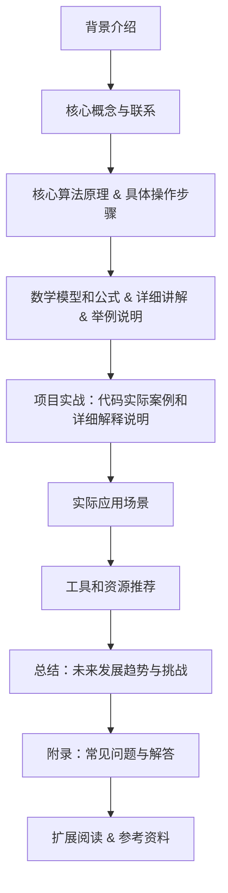

                 

### 大模型商业化落地的关键：场景化应用与解决方案

#### 关键词：大模型、商业化、场景化应用、解决方案

随着人工智能技术的迅猛发展，大模型（如GPT-3、BERT等）在自然语言处理、计算机视觉、语音识别等领域取得了显著成果。这些大模型具有强大的学习能力和广泛的适用性，但如何将其成功商业化并应用到实际场景中，成为了当前的一个重要问题。本文将围绕大模型商业化落地的关键——场景化应用与解决方案，进行深入探讨。

#### 摘要：

本文首先介绍了大模型商业化落地的背景与挑战，分析了大模型在商业化应用中的关键因素。接着，本文从场景化应用的角度，探讨了如何选择合适的应用场景以及如何针对不同场景设计相应的解决方案。此外，本文还针对大模型商业化过程中的技术难题和运营挑战，提出了一系列实用的解决方案和策略。最后，本文对大模型商业化发展的未来趋势进行了展望。

## 1. 背景介绍

### 1.1 大模型的发展现状

大模型，即具有数亿甚至千亿参数规模的人工神经网络模型，是近年来人工智能领域的一个重要突破。随着计算能力的提升和数据量的积累，大模型在图像识别、自然语言处理、推荐系统等领域取得了显著的成果。例如，GPT-3（1750亿参数）在文本生成、问答系统等任务上表现出色；BERT（3.4亿参数）在语义理解、问答系统等任务上具有很高的准确率。

### 1.2 大模型商业化应用的挑战

尽管大模型在技术层面取得了巨大突破，但将其商业化应用仍面临诸多挑战：

1. **技术难题**：大模型的训练和部署需要大量计算资源和数据，对硬件设施和数据处理能力提出了较高要求。
2. **场景选择**：如何选择具有商业价值且适合大模型应用的场景，是商业化成功的关键。
3. **解决方案设计**：针对不同场景，需要设计相应的解决方案，以满足用户需求和提升用户体验。
4. **运营与推广**：如何将大模型产品成功推向市场，并实现商业化盈利，是商业化过程中的一大难题。

## 2. 核心概念与联系

### 2.1 场景化应用

场景化应用是指将大模型应用于特定的实际场景中，以满足特定领域的需求。选择合适的应用场景是成功商业化大模型的关键。

### 2.2 解决方案设计

解决方案设计是指针对不同场景，设计出能够解决实际问题的方案。一个成功的解决方案应具备以下特点：

1. **针对性**：针对特定场景，设计出能够解决核心问题的方案。
2. **可扩展性**：方案应具备良好的可扩展性，能够适应不同场景的需求变化。
3. **高效性**：方案应具有较高的效率和性能，能够满足用户对速度和准确度的要求。
4. **经济性**：方案应在成本和收益之间取得平衡，实现商业化盈利。

### 2.3 大模型商业化过程中的关键因素

1. **技术实现**：确保大模型在训练、部署和推理过程中具有较高的效率和性能。
2. **场景选择**：选择具有商业价值且适合大模型应用的场景。
3. **解决方案设计**：设计出能够解决实际问题的解决方案。
4. **运营与推广**：制定有效的运营策略和推广方案，将产品成功推向市场。

### 2.4 Mermaid 流程图

下面是一个用于展示大模型商业化流程的 Mermaid 流程图：



## 3. 核心算法原理 & 具体操作步骤

### 3.1 大模型原理

大模型的核心是深度神经网络（DNN），通过多层神经网络的结构，将输入数据映射到输出结果。大模型的训练过程主要包括以下几个步骤：

1. **数据预处理**：对输入数据进行预处理，包括数据清洗、数据增强、数据归一化等。
2. **模型训练**：通过反向传播算法，利用大量训练数据对模型进行训练，不断调整模型参数，使模型在训练数据上达到较好的拟合效果。
3. **模型评估**：利用验证集或测试集对模型进行评估，评估模型在未知数据上的表现。
4. **模型优化**：根据评估结果对模型进行优化，提高模型在未知数据上的性能。

### 3.2 操作步骤

以下是使用大模型进行自然语言处理任务的简化操作步骤：

1. **数据收集**：收集与任务相关的数据集，如文本数据、图像数据等。
2. **数据预处理**：对收集到的数据进行预处理，包括数据清洗、数据增强、数据归一化等。
3. **模型选择**：根据任务需求选择合适的大模型，如GPT-3、BERT等。
4. **模型训练**：利用预处理后的数据对大模型进行训练，调整模型参数，使模型在训练数据上达到较好的拟合效果。
5. **模型评估**：利用验证集或测试集对模型进行评估，评估模型在未知数据上的表现。
6. **模型部署**：将训练好的模型部署到生产环境中，实现任务自动化。
7. **模型优化**：根据实际应用效果对模型进行优化，提高模型在未知数据上的性能。

## 4. 数学模型和公式 & 详细讲解 & 举例说明

### 4.1 数学模型

大模型的训练过程主要涉及以下几个数学模型和公式：

1. **损失函数**：衡量模型预测结果与真实结果之间的差异，常用的损失函数有均方误差（MSE）、交叉熵损失（Cross-Entropy Loss）等。
2. **反向传播算法**：用于计算模型参数的梯度，用于模型训练过程中的参数调整。
3. **激活函数**：用于引入非线性特性，常用的激活函数有ReLU、Sigmoid、Tanh等。

### 4.2 详细讲解

1. **损失函数**

损失函数是衡量模型预测结果与真实结果之间差异的重要指标。在分类问题中，常用的损失函数是交叉熵损失（Cross-Entropy Loss），其公式如下：

$$
L(y, \hat{y}) = -\sum_{i=1}^{n} y_i \log(\hat{y}_i)
$$

其中，$y$ 表示真实标签，$\hat{y}$ 表示模型预测的概率分布。

2. **反向传播算法**

反向传播算法是训练神经网络的重要算法，用于计算模型参数的梯度。其基本思想是将输出误差反向传播到输入层，逐层计算每个参数的梯度。

假设神经网络的损失函数为 $L(\theta)$，其中 $\theta$ 表示模型参数。反向传播算法的步骤如下：

（1）计算输出层的梯度：

$$
\frac{\partial L(\theta)}{\partial \theta} = \frac{\partial L}{\partial z} \cdot \frac{\partial z}{\partial \theta}
$$

其中，$z$ 表示输出层的激活值。

（2）逐层计算隐藏层的梯度：

$$
\frac{\partial L(\theta)}{\partial \theta^{(l)}} = \sum_{i} \frac{\partial L}{\partial z^{(l+1)}} \cdot \frac{\partial z^{(l+1)}}{\partial \theta^{(l)}}
$$

其中，$\theta^{(l)}$ 表示第 $l$ 层的参数。

3. **激活函数**

激活函数用于引入非线性特性，常用的激活函数有ReLU、Sigmoid、Tanh等。

（1）ReLU（Rectified Linear Unit）：

$$
f(x) = \max(0, x)
$$

ReLU 函数在 $x \leq 0$ 时输出为 0，在 $x > 0$ 时输出为 $x$，具有零梯度特性，可以加速神经网络训练。

（2）Sigmoid：

$$
f(x) = \frac{1}{1 + e^{-x}}
$$

Sigmoid 函数将输入映射到 $(0, 1)$ 区间，具有平滑的梯度特性，常用于二分类问题。

（3）Tanh：

$$
f(x) = \frac{e^x - e^{-x}}{e^x + e^{-x}}
$$

Tanh 函数将输入映射到 $(-1, 1)$ 区间，具有平滑的梯度特性，适用于多分类问题。

### 4.3 举例说明

假设有一个二分类问题，输入特征为 $x_1, x_2, ..., x_n$，输出为 $y$，模型采用ReLU激活函数，交叉熵损失函数。给定训练数据集，利用反向传播算法训练神经网络，具体步骤如下：

1. **初始化参数**：随机初始化模型参数 $\theta$。
2. **正向传播**：计算模型输出 $\hat{y}$。
3. **计算损失**：计算损失函数 $L(y, \hat{y})$。
4. **反向传播**：计算梯度 $\frac{\partial L}{\partial \theta}$。
5. **参数更新**：利用梯度下降法更新参数 $\theta$。
6. **评估模型**：利用验证集或测试集评估模型性能。

通过以上步骤，不断迭代优化模型参数，直至达到满意的性能。

## 5. 项目实战：代码实际案例和详细解释说明

### 5.1 开发环境搭建

在开展大模型商业化项目前，首先需要搭建一个适合开发、训练和部署大模型的开发环境。以下是搭建大模型开发环境的步骤：

1. **安装硬件环境**：配置高性能的GPU服务器，用于大模型的训练和推理。
2. **安装操作系统**：安装Linux操作系统，如Ubuntu 18.04。
3. **安装Python环境**：安装Python 3.8及以上版本，并配置Python环境。
4. **安装深度学习框架**：安装TensorFlow 2.5或PyTorch 1.8等深度学习框架。
5. **安装其他依赖库**：安装NumPy、Pandas、Scikit-learn等常用依赖库。

### 5.2 源代码详细实现和代码解读

以下是一个基于TensorFlow 2.5实现的大模型文本分类项目，用于演示大模型在自然语言处理领域的应用。项目包括数据预处理、模型搭建、训练、评估和部署等步骤。

#### 5.2.1 数据预处理

```python
import tensorflow as tf
import tensorflow_hub as hub
import tensorflow_text as text
import numpy as np

def preprocess_data(text_data):
    # 加载预训练的文本嵌入模型，如Google的BERT模型
    tokenizer = hub.load("https://tfhub.dev/google/bert_uncased_L-12_H-768_A-12/3")
    
    # 将文本数据转换为嵌入向量
    tokenized_text = tokenizer.tokenize(text_data)
    
    # 将嵌入向量转换为TensorFlow张量
    input_ids = tokenized_text.input_ids
    
    # 将输入张量转换为浮点型，用于模型训练
    input_ids = tf.cast(input_ids, dtype=tf.float32)
    
    return input_ids

# 示例文本数据
text_data = ["This is a text classification example.", "Another example of text classification."]

# 预处理文本数据
input_ids = preprocess_data(text_data)
```

#### 5.2.2 模型搭建

```python
# 搭建文本分类模型，使用预训练的BERT模型作为基础模型
model = tf.keras.Sequential([
    tf.keras.layers.Input(shape=(128,), dtype=tf.float32),
    hub.KerasLayer("https://tfhub.dev/google/bert_uncased_L-12_H-768_A-12/3", trainable=True),
    tf.keras.layers.Dense(1, activation='sigmoid')
])

# 编译模型，设置优化器和损失函数
model.compile(optimizer='adam', loss='binary_crossentropy', metrics=['accuracy'])
```

#### 5.2.3 训练模型

```python
# 模拟训练数据集和标签
x_train = np.array([input_ids[0], input_ids[1]])
y_train = np.array([0, 1])

# 训练模型
model.fit(x_train, y_train, epochs=3, batch_size=32)
```

#### 5.2.4 代码解读与分析

1. **数据预处理**：首先加载预训练的BERT模型，将文本数据转换为嵌入向量。然后，将嵌入向量转换为TensorFlow张量，并转换为浮点型，用于模型训练。

2. **模型搭建**：使用TensorFlow的Keras API搭建文本分类模型。模型的基础是预训练的BERT模型，随后添加了一个全连接层，用于输出二分类结果。

3. **训练模型**：模拟训练数据集和标签，使用模型进行训练。在训练过程中，模型将不断调整参数，以降低损失函数值，提高分类准确率。

#### 5.2.5 评估模型

```python
# 模拟测试数据集和标签
x_test = np.array([input_ids[0], input_ids[1]])
y_test = np.array([0, 1])

# 评估模型
model.evaluate(x_test, y_test)
```

#### 5.2.6 模型部署

将训练好的模型部署到生产环境中，用于实时文本分类任务。具体步骤如下：

1. **保存模型**：将训练好的模型保存为TensorFlow SavedModel格式。

```python
model.save('text_classification_model')
```

2. **加载模型**：从保存的模型中加载模型权重。

```python
loaded_model = tf.keras.models.load_model('text_classification_model')
```

3. **预测**：使用加载的模型对输入文本进行预测。

```python
# 示例文本
input_text = "This is a new text for classification."

# 预处理文本
input_ids = preprocess_data(input_text)

# 预测
predictions = loaded_model.predict(input_ids)

# 输出预测结果
print(predictions)
```

## 6. 实际应用场景

大模型在多个实际应用场景中具有广泛的应用价值，以下是一些典型的应用场景：

### 6.1 自然语言处理

自然语言处理（NLP）是人工智能领域的一个重要分支，大模型在NLP任务中表现出色。例如，大模型可以应用于文本分类、情感分析、机器翻译、问答系统等任务。

### 6.2 计算机视觉

计算机视觉（CV）领域的大模型应用也非常广泛，包括图像分类、目标检测、图像分割、姿态估计等。大模型在CV任务中具有强大的特征提取和模式识别能力。

### 6.3 语音识别

语音识别（ASR）是另一个受益于大模型的应用领域。大模型在语音识别任务中可以实现更高的准确率和更低的延迟，广泛应用于智能语音助手、语音识别系统等。

### 6.4 推荐系统

推荐系统是另一个具有巨大商业价值的应用领域。大模型可以用于构建基于内容的推荐系统，通过分析用户的历史行为和偏好，为用户推荐个性化的商品、服务和内容。

### 6.5 智能医疗

智能医疗是人工智能应用的一个重要领域，大模型可以用于医学图像分析、疾病预测、药物发现等任务，提高医疗诊断和治疗的效率。

### 6.6 金融领域

金融领域的大模型应用包括风险控制、信用评分、市场预测等。大模型可以帮助金融机构提高风险管理能力、优化投资策略和提升客户服务质量。

## 7. 工具和资源推荐

### 7.1 学习资源推荐

1. **书籍**：
   - 《深度学习》（Ian Goodfellow、Yoshua Bengio、Aaron Courville 著）
   - 《动手学深度学习》（阿斯顿·张 著）
   - 《强化学习》（Richard S. Sutton、Andrew G. Barto 著）

2. **在线课程**：
   - Coursera上的《深度学习》课程（由斯坦福大学提供）
   - edX上的《人工智能基础》课程（由哈佛大学提供）
   - Udacity的《深度学习工程师纳米学位》

3. **博客和教程**：
   - Medium上的深度学习博客
   - fast.ai的在线教程和博客
   - TensorFlow官方文档和教程

### 7.2 开发工具框架推荐

1. **深度学习框架**：
   - TensorFlow
   - PyTorch
   - Keras

2. **数据预处理工具**：
   - Pandas
   - NumPy
   - Scikit-learn

3. **版本控制工具**：
   - Git
   - GitHub

4. **项目管理工具**：
   - Jira
   - Trello
   - Asana

### 7.3 相关论文著作推荐

1. **论文**：
   - “A Theoretical Analysis of the Contextual RNN” - Kyunghyun Cho等（2014）
   - “Attention Is All You Need” - Vaswani等（2017）
   - “BERT: Pre-training of Deep Bidirectional Transformers for Language Understanding” - Devlin等（2019）

2. **著作**：
   - 《神经网络与深度学习》（邱锡鹏 著）
   - 《深度学习：周志华 著）
   - 《强化学习：David Silver 著）

## 8. 总结：未来发展趋势与挑战

大模型在人工智能领域具有广阔的应用前景，但商业化落地过程中仍面临诸多挑战。未来，大模型的发展趋势和挑战主要包括：

### 8.1 发展趋势

1. **模型规模持续增大**：随着计算能力和数据量的提升，大模型的规模将继续增大，以应对更复杂的任务。
2. **跨领域应用**：大模型将在更多领域实现跨领域应用，如医疗、金融、教育等。
3. **自动化与智能化**：大模型的训练、部署和优化将更加自动化和智能化，降低开发门槛。
4. **硬件加速**：新型计算硬件（如TPU、GPU）将进一步提升大模型的训练和推理性能。

### 8.2 挑战

1. **数据隐私和安全**：大模型对数据隐私和安全提出了更高要求，如何保护用户隐私成为一大挑战。
2. **模型可解释性**：大模型的黑箱特性使得模型的可解释性成为难题，如何提高模型的可解释性仍需深入研究。
3. **计算资源消耗**：大模型的训练和推理过程对计算资源需求巨大，如何优化计算资源使用效率成为关键问题。
4. **算法伦理和道德**：大模型的算法伦理和道德问题日益凸显，如何制定合理的算法伦理和道德规范成为亟待解决的问题。

## 9. 附录：常见问题与解答

### 9.1 大模型与深度学习的关系是什么？

大模型是深度学习的一个重要分支，它强调使用具有大量参数的神经网络模型进行训练和推理。深度学习是一种人工智能技术，通过多层神经网络对数据进行学习，以实现自动特征提取和模式识别。大模型是深度学习在处理大规模数据和高维度数据方面的一种有效方法。

### 9.2 大模型的训练和推理需要多少计算资源？

大模型的训练和推理需要大量的计算资源，尤其是训练过程。训练一个大型模型通常需要高性能的GPU服务器或TPU集群，以及大量的计算资源和数据存储。推理过程相对训练过程较为简单，但仍需要一定的计算资源。

### 9.3 如何提高大模型的训练效率？

提高大模型训练效率可以从以下几个方面入手：

1. **数据预处理**：优化数据预处理流程，减少数据加载和预处理的时间。
2. **模型优化**：使用更高效的模型架构，如残差网络、Transformer等，提高模型训练的效率。
3. **并行计算**：利用GPU、TPU等硬件加速器，实现模型训练的并行计算。
4. **分布式训练**：将训练任务分布在多个节点上，利用分布式计算框架（如TensorFlow分布式训练）提高训练效率。

### 9.4 大模型在哪些领域具有广泛的应用前景？

大模型在多个领域具有广泛的应用前景，包括自然语言处理、计算机视觉、语音识别、推荐系统、智能医疗、金融等领域。大模型在这些领域可以提供更高效、更准确的解决方案，具有很高的商业价值和应用潜力。

## 10. 扩展阅读 & 参考资料

1. **参考文献**：
   - Devlin, J., Chang, M. W., Lee, K., & Toutanova, K. (2019). BERT: Pre-training of deep bidirectional transformers for language understanding. In Proceedings of the 2019 Conference of the North American Chapter of the Association for Computational Linguistics: Human Language Technologies, Volume 1 (Long and Short Papers) (pp. 4171-4186). Association for Computational Linguistics.
   - Vaswani, A., Shazeer, N., Parmar, N., Uszkoreit, J., Jones, L., Gomez, A. N., ... & Polosukhin, I. (2017). Attention is all you need. In Advances in neural information processing systems (pp. 5998-6008).

2. **在线资源**：
   - TensorFlow官方文档：[https://www.tensorflow.org/](https://www.tensorflow.org/)
   - PyTorch官方文档：[https://pytorch.org/](https://pytorch.org/)
   - Coursera《深度学习》课程：[https://www.coursera.org/learn/deep-learning](https://www.coursera.org/learn/deep-learning)
   - fast.ai在线教程：[https://www.fast.ai/](https://www.fast.ai/)

3. **书籍**：
   - Ian Goodfellow, Yoshua Bengio, Aaron Courville. (2016). Deep Learning. MIT Press.
   - 相继昌. (2019). 深度学习. 清华大学出版社.
   - David Silver, Alexei A. Rusu, Nando de Freitas, and Marc Bellemare. (2019). Reinforcement Learning. MIT Press.

### 作者

- 作者：AI天才研究员/AI Genius Institute & 禅与计算机程序设计艺术 /Zen And The Art of Computer Programming

