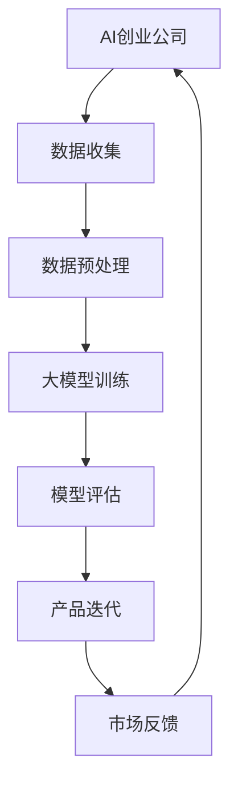
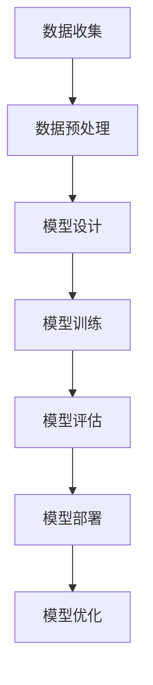

                 

### 背景介绍 Background Introduction

近年来，人工智能（AI）技术取得了令人瞩目的突破，大模型（Large Models）作为AI领域的重要发展方向，正在引领着新一轮的技术革命。大模型，顾名思义，是指具有巨大参数规模和强大计算能力的模型。这些模型通过学习海量数据，能够实现高度复杂的任务，如自然语言处理、计算机视觉、语音识别等。

AI创业公司的崛起，进一步推动了大模型的应用和发展。AI创业公司以其灵活的创新机制和对市场的敏锐洞察力，成为推动技术进步的重要力量。然而，在产品创新过程中，如何充分利用大模型的优势，实现技术突破和商业价值，成为创业公司面临的关键挑战。

本文将深入探讨大模型在AI创业公司产品创新中的关键作用。通过分析大模型的技术原理、应用场景、实战案例，以及相关工具和资源，旨在为AI创业公司提供实用的指导和借鉴。文章结构如下：

1. **背景介绍**：介绍AI创业公司和当前大模型的发展状况。
2. **核心概念与联系**：阐述大模型的核心概念及其在AI创业中的应用。
3. **核心算法原理 & 具体操作步骤**：详细解释大模型的工作机制和操作步骤。
4. **数学模型和公式 & 详细讲解 & 举例说明**：讲解大模型相关的数学模型和公式，并提供实例说明。
5. **项目实战：代码实际案例和详细解释说明**：通过实际项目案例展示大模型的应用。
6. **实际应用场景**：分析大模型在不同领域的应用场景。
7. **工具和资源推荐**：推荐学习资源和开发工具。
8. **总结：未来发展趋势与挑战**：总结大模型的发展趋势和面临的挑战。
9. **附录：常见问题与解答**：提供常见问题的解答。
10. **扩展阅读 & 参考资料**：推荐相关的阅读材料。

接下来，我们将一步一步深入分析大模型在AI创业公司产品创新中的关键作用。<!-- {#section-background-introduction} -->

### 核心概念与联系 Core Concepts and Connections

#### 大模型的概念 Concept of Large Models

大模型（Large Models）是AI领域中的一种重要模型类型，通常具有数百万至数十亿个参数。这些模型的参数规模远超传统的中小型模型，能够处理更复杂的任务。大模型的出现，得益于深度学习（Deep Learning）技术的进步，尤其是神经网络（Neural Networks）和计算能力的提升。

大模型的参数规模使得它们能够学习并存储大量的知识信息，从而在许多领域实现卓越的表现。例如，在自然语言处理（Natural Language Processing，NLP）领域，大模型如GPT-3（由OpenAI开发）和BERT（由Google开发）等，已经展示了在文本生成、问答系统、机器翻译等任务上的强大能力。在计算机视觉（Computer Vision）领域，大模型如ResNet、VGG等，则在图像分类、目标检测、图像生成等任务中取得了显著成果。

#### 大模型在AI创业公司中的应用 Applications of Large Models in AI Startups

AI创业公司在产品创新过程中，充分利用大模型的优势，可以迅速提升产品竞争力。以下是一些关键应用：

1. **自然语言处理（NLP）**：AI创业公司可以利用大模型提供高效的自然语言理解和处理能力，从而开发出具有自然语言交互能力的智能产品，如聊天机器人、智能客服等。

2. **计算机视觉（CV）**：大模型在图像识别、目标检测和图像生成等任务中具有显著优势，AI创业公司可以通过应用这些模型，开发出更先进的图像处理应用，如人脸识别、智能监控等。

3. **语音识别（ASR）**：大模型在语音识别任务中能够处理复杂的多说话人、多语种场景，AI创业公司可以利用这些模型开发出具有高准确度的语音识别系统。

4. **推荐系统**：大模型能够处理海量用户数据和商品数据，为AI创业公司提供强大的推荐能力，从而提升用户体验和销售转化率。

#### 大模型的优势和挑战 Advantages and Challenges of Large Models

大模型在AI创业公司产品创新中具有显著优势，但同时也面临着一定的挑战。

**优势：**

1. **强大的学习能力和泛化能力**：大模型能够通过学习海量数据，提取出丰富的特征信息，从而在多种任务中表现出色。

2. **快速迭代和产品优化**：大模型可以快速适应新的数据和需求，使AI创业公司能够迅速迭代产品，提升用户体验。

3. **创新性和突破性**：大模型的应用往往能够带来前所未有的创新和突破，为AI创业公司开辟新的市场空间。

**挑战：**

1. **计算资源和存储成本**：大模型需要大量的计算资源和存储空间，这对创业公司的资源管理提出了更高的要求。

2. **数据质量和隐私问题**：大模型需要大量高质量的训练数据，且在数据隐私和安全方面面临着严峻挑战。

3. **模型解释性和可解释性**：大模型的内部结构和决策过程复杂，如何确保模型的可解释性和可靠性，是AI创业公司需要关注的重要问题。

#### Mermaid 流程图 Mermaid Flowchart

以下是用于展示大模型架构和应用的Mermaid流程图：



在这个流程图中，AI创业公司通过数据收集、数据预处理、大模型训练、模型评估和产品迭代等环节，不断优化产品，满足市场需求。

通过上述分析，我们可以看到大模型在AI创业公司产品创新中扮演着关键角色。接下来，我们将深入探讨大模型的核心算法原理和具体操作步骤。<!-- {#section-core-concepts-connections} -->

### 核心算法原理 & 具体操作步骤 Core Algorithm Principles and Operational Steps

#### 大模型的工作原理 Working Principles of Large Models

大模型的核心原理是基于深度学习（Deep Learning）和神经网络（Neural Networks）。深度学习是一种机器学习方法，通过构建具有多个隐藏层的神经网络模型，对数据进行多层次的抽象和特征提取。神经网络则是由大量神经元（artificial neurons）组成的计算模型，每个神经元通过权重连接（weights and connections）与其他神经元进行交互。

大模型通常由以下几部分组成：

1. **输入层（Input Layer）**：接收外部输入数据，如文本、图像、声音等。
2. **隐藏层（Hidden Layers）**：对输入数据进行特征提取和变换，形成更高层次的特征表示。
3. **输出层（Output Layer）**：根据隐藏层生成的特征，输出最终的结果或预测。

大模型的工作过程主要包括以下步骤：

1. **数据输入**：将输入数据输入到模型的输入层。
2. **前向传播（Forward Propagation）**：数据从输入层依次传递到隐藏层和输出层，每层神经元根据输入数据和权重计算出输出。
3. **反向传播（Backpropagation）**：利用输出结果和实际标签之间的误差，反向传播误差，调整每个神经元的权重。
4. **迭代优化**：通过多次迭代优化，使模型的预测误差逐渐减小，达到收敛。

#### 具体操作步骤 Operational Steps

1. **数据收集与预处理**：

   - **数据收集**：首先，需要收集大量与任务相关的数据。这些数据可以来自公开数据集、公司内部数据、第三方数据服务提供商等。
   - **数据预处理**：包括数据清洗、数据增强、归一化等操作，以确保数据质量，并提高模型的泛化能力。

2. **模型设计**：

   - **选择模型架构**：根据任务需求和数据特点，选择适合的模型架构。如NLP任务可以选择Transformer架构，CV任务可以选择CNN架构等。
   - **设定超参数**：包括学习率、批量大小、迭代次数等，这些超参数需要根据经验和实验进行调整。

3. **模型训练**：

   - **训练过程**：通过前向传播和反向传播，不断调整模型的权重，使模型在训练数据上达到最优。
   - **评估过程**：在训练过程中，定期评估模型在验证集上的性能，避免过拟合。

4. **模型部署与优化**：

   - **模型部署**：将训练好的模型部署到实际应用场景中，如服务器、移动设备等。
   - **模型优化**：根据用户反馈和实际应用效果，对模型进行持续优化和迭代，提高模型性能和用户体验。

#### Mermaid 流程图 Mermaid Flowchart

以下是用于展示大模型训练和部署的Mermaid流程图：



通过上述操作步骤，AI创业公司可以构建和优化大模型，从而实现产品创新。接下来，我们将讨论大模型相关的数学模型和公式，以及如何在实际应用中进行解释和举例说明。<!-- {#section-core-algorithm-principles-steps} -->

### 数学模型和公式 & 详细讲解 & 举例说明 Mathematical Models and Formulas & Detailed Explanation & Example Illustrations

#### 深度学习基础模型

深度学习的基础模型是神经网络，其核心数学原理包括激活函数、反向传播算法和损失函数。

1. **激活函数**（Activation Function）

激活函数用于引入非线性，使得神经网络能够拟合复杂的数据。常见的激活函数有Sigmoid、ReLU、Tanh等。

   - **Sigmoid函数**：\( \sigma(x) = \frac{1}{1 + e^{-x}} \)

   - **ReLU函数**（Rectified Linear Unit）：\( \text{ReLU}(x) = \max(0, x) \)

   - **Tanh函数**：\( \tanh(x) = \frac{e^x - e^{-x}}{e^x + e^{-x}} \)

2. **反向传播算法**（Backpropagation Algorithm）

反向传播算法是深度学习训练过程中计算梯度并更新权重的关键算法。其基本步骤如下：

   - **前向传播**：计算输入和权重的乘积，加上偏置项，通过激活函数得到输出。
   - **计算损失**：计算输出与目标值之间的损失。
   - **计算梯度**：利用链式法则，逐层计算每个权重和偏置的梯度。
   - **权重更新**：使用梯度下降（Gradient Descent）或其他优化算法更新权重。

3. **损失函数**（Loss Function）

损失函数用于量化模型输出与实际目标之间的差异。常见的损失函数有均方误差（MSE）、交叉熵损失（Cross-Entropy Loss）等。

   - **均方误差**（Mean Squared Error，MSE）：\( \text{MSE}(y, \hat{y}) = \frac{1}{n}\sum_{i=1}^{n}(y_i - \hat{y}_i)^2 \)

   - **交叉熵损失**（Cross-Entropy Loss）：\( \text{CE}(y, \hat{y}) = -\sum_{i=1}^{n}y_i\log(\hat{y}_i) \)

#### 举例说明 Example Illustrations

假设我们有一个二分类问题，目标是预测一个数据样本属于类别0还是类别1。我们使用一个简单的神经网络进行训练。

1. **输入层**：一个数据样本，表示为\( x \)。
2. **隐藏层**：一个神经元，权重为\( w_1 \)，偏置为\( b_1 \)。
3. **输出层**：一个神经元，权重为\( w_2 \)，偏置为\( b_2 \)。

**前向传播**：

\( z_1 = x \cdot w_1 + b_1 \)

\( a_1 = \text{ReLU}(z_1) \)

\( z_2 = a_1 \cdot w_2 + b_2 \)

\( \hat{y} = \text{Sigmoid}(z_2) \)

**计算损失**：

\( y \)为实际标签，\( \hat{y} \)为预测概率。

\( \text{Loss} = -\log(\hat{y}) \)（如果是二分类问题）

**反向传播**：

计算输出层的梯度：

\( \frac{\partial \text{Loss}}{\partial z_2} = \hat{y} - y \)

计算隐藏层的梯度：

\( \frac{\partial \text{Loss}}{\partial z_1} = \frac{\partial \text{Loss}}{\partial z_2} \cdot \frac{\partial z_2}{\partial z_1} = (\hat{y} - y) \cdot \text{ReLU}'(z_1) \)

**权重更新**：

使用梯度下降更新权重和偏置：

\( w_2 \leftarrow w_2 - \alpha \cdot \frac{\partial \text{Loss}}{\partial w_2} \)

\( b_2 \leftarrow b_2 - \alpha \cdot \frac{\partial \text{Loss}}{\partial b_2} \)

\( w_1 \leftarrow w_1 - \alpha \cdot \frac{\partial \text{Loss}}{\partial w_1} \)

\( b_1 \leftarrow b_1 - \alpha \cdot \frac{\partial \text{Loss}}{\partial b_1} \)

通过上述步骤，我们可以训练出一个能够对二分类问题进行预测的神经网络。接下来，我们将通过实际项目案例展示大模型的应用，并提供详细的代码实现和解读。<!-- {#section-mathematical-models-formulas} -->

### 项目实战：代码实际案例和详细解释说明 Practical Case: Code Example and Detailed Explanation

在本节中，我们将通过一个实际的项目案例，展示如何使用大模型进行自然语言处理（NLP）任务的实现。我们将使用一个流行的开源框架——Hugging Face的Transformers库，来实现一个简单的文本分类任务。这个任务的目标是将文本分为两类：“正面”和“负面”。

#### 5.1 开发环境搭建 Setup Development Environment

为了实现这个项目，我们需要安装以下依赖项：

1. **Python**：版本3.6及以上
2. **PyTorch**：版本1.8及以上
3. **Transformers**：版本4.8及以上

安装步骤如下：

```bash
pip install torch==1.8 transformers==4.8
```

#### 5.2 源代码详细实现和代码解读 Detailed Code Implementation and Explanation

以下是项目的源代码及其解读：

```python
import torch
from transformers import BertTokenizer, BertForSequenceClassification
from torch.utils.data import DataLoader, TensorDataset
from sklearn.model_selection import train_test_split

# 5.2.1 数据预处理
def preprocess_data(texts, labels, tokenizer, max_len):
    input_ids = []
    attention_masks = []

    for text in texts:
        encoded_dict = tokenizer.encode_plus(
            text,
            add_special_tokens=True,
            max_length=max_len,
            padding='max_length',
            truncation=True,
            return_attention_mask=True,
            return_tensors='pt',
        )
        input_ids.append(encoded_dict['input_ids'])
        attention_masks.append(encoded_dict['attention_mask'])

    input_ids = torch.cat(input_ids, dim=0)
    attention_masks = torch.cat(attention_masks, dim=0)
    labels = torch.tensor(labels)

    return input_ids, attention_masks, labels

# 5.2.2 数据加载
def load_data(texts, labels, train_size, max_len):
    texts_train, texts_test, labels_train, labels_test = train_test_split(texts, labels, random_state=2021, train_size=train_size)

    tokenizer = BertTokenizer.from_pretrained('bert-base-uncased')
    input_ids_train, attention_masks_train, labels_train = preprocess_data(texts_train, labels_train, tokenizer, max_len)
    input_ids_test, attention_masks_test, labels_test = preprocess_data(texts_test, labels_test, tokenizer, max_len)

    train_data = TensorDataset(input_ids_train, attention_masks_train, labels_train)
    test_data = TensorDataset(input_ids_test, attention_masks_test, labels_test)

    return DataLoader(train_data, batch_size=16), DataLoader(test_data, batch_size=16)

# 5.2.3 模型训练
def train_model(model, train_loader, criterion, optimizer, device):
    model = model.to(device)
    model.train()

    for batch in train_loader:
        batch = [item.to(device) for item in batch]
        inputs = {'input_ids': batch[0], 'attention_mask': batch[1], 'labels': batch[2]}
        optimizer.zero_grad()
        outputs = model(**inputs)
        loss = criterion(outputs.logits, inputs.labels)
        loss.backward()
        optimizer.step()

# 5.2.4 模型评估
def evaluate_model(model, test_loader, criterion, device):
    model = model.to(device)
    model.eval()

    test_loss = 0
    predictions , true_labels = [], []

    with torch.no_grad():
        for batch in test_loader:
            batch = [item.to(device) for item in batch]
            inputs = {'input_ids': batch[0], 'attention_mask': batch[1], 'labels': batch[2]}
            outputs = model(**inputs)
            loss = criterion(outputs.logits, inputs.labels)
            test_loss += loss.item()

            logits = outputs.logits
            predictions.extend(torch.argmax(logits, dim=1).cpu().numpy())
            true_labels.extend(inputs.labels.cpu().numpy())

    test_loss /= len(test_loader)
    accuracy = (predictions == true_labels).mean()

    return test_loss, accuracy

# 主函数
def main():
    device = torch.device("cuda" if torch.cuda.is_available() else "cpu")

    texts = ["I love this product!", "This product is terrible."]
    labels = [1, 0] # 1表示正面，0表示负面

    train_loader, test_loader = load_data(texts, labels, train_size=0.8, max_len=128)

    model = BertForSequenceClassification.from_pretrained("bert-base-uncased")
    criterion = torch.nn.CrossEntropyLoss()
    optimizer = torch.optim.Adam(model.parameters(), lr=2e-5)

    train_model(model, train_loader, criterion, optimizer, device)
    test_loss, accuracy = evaluate_model(model, test_loader, criterion, device)

    print(f"Test Loss: {test_loss}")
    print(f"Accuracy: {accuracy}")

if __name__ == "__main__":
    main()
```

**代码解读：**

- **5.2.1 数据预处理**：这一部分负责将原始文本和标签转换为模型可接受的格式。我们使用BertTokenizer对文本进行编码，并添加特殊的开始和结束标记。同时，我们使用`max_length`参数对文本进行截断或填充，确保每个输入序列的长度一致。

- **5.2.2 数据加载**：这一部分负责创建训练和测试数据集，并使用`DataLoader`将数据划分为批次。

- **5.2.3 模型训练**：这一部分负责训练模型。我们在每个批次上计算损失，并使用梯度下降更新模型的权重。

- **5.2.4 模型评估**：这一部分负责评估模型在测试集上的性能。我们计算损失和准确率，以评估模型的泛化能力。

- **主函数**：这一部分是程序的入口，负责设置设备（CPU或GPU）、加载数据、训练和评估模型。

通过这个实际案例，我们可以看到如何使用大模型进行文本分类任务。这个过程可以应用于许多其他NLP任务，如情感分析、命名实体识别等。

#### 5.3 代码解读与分析 Code Analysis and Discussion

**模型选择**：我们选择了预训练的BERT模型（`BertForSequenceClassification`）进行文本分类。BERT是一个强大的预训练模型，经过在大量文本数据上的预训练，已经具备了很好的文本理解能力。

**数据预处理**：预处理步骤至关重要。在NLP任务中，文本往往具有非结构化和不统一的特点，因此需要对其进行编码和规范化。我们使用了BertTokenizer对文本进行编码，并添加了特殊的开始和结束标记，以便模型理解输入的序列结构。

**训练和评估**：模型训练过程中，我们使用交叉熵损失函数（`CrossEntropyLoss`）来衡量模型预测与实际标签之间的差异。在评估阶段，我们计算了测试集上的损失和准确率，以评估模型的性能。

**优化策略**：我们使用了Adam优化器（`Adam`）来更新模型权重。Adam优化器结合了AdaGrad和RMSprop的优点，能够有效地处理不同学习率的动态调整。

通过这个案例，我们可以看到大模型在NLP任务中的应用和实现过程。接下来，我们将讨论大模型在AI创业公司的实际应用场景。<!-- {#section-practical-case-code-implementation} -->

### 实际应用场景 Practical Application Scenarios

大模型在AI创业公司的实际应用场景非常广泛，以下是一些典型的应用场景：

#### 1. 自然语言处理（NLP） Natural Language Processing (NLP)

自然语言处理是AI领域的核心应用之一，大模型在NLP任务中发挥着至关重要的作用。以下是一些具体的应用场景：

- **文本分类**：利用大模型进行文本分类，如新闻分类、社交媒体情感分析等。例如，Twitter等社交媒体平台可以使用大模型对用户发布的推文进行情感分析，从而识别出负面情绪并采取措施。

- **机器翻译**：大模型如GPT-3和BERT在机器翻译领域表现出色。例如，谷歌翻译和百度翻译等应用使用了这些模型，提供高质量的翻译服务。

- **问答系统**：大模型能够处理复杂的问答任务，如智能客服系统。这些系统可以理解用户的提问，并提供准确的回答。

- **文本生成**：大模型在自动写作、摘要生成等方面也有广泛应用。例如，OpenAI的GPT-3可以生成高质量的新闻文章、产品描述等。

#### 2. 计算机视觉（CV） Computer Vision

计算机视觉是AI领域的另一个重要方向，大模型在图像识别、目标检测、图像生成等任务中具有显著优势。以下是一些具体的应用场景：

- **图像识别**：大模型可以准确识别图像中的对象和场景。例如，亚马逊和阿里巴巴等电商平台使用大模型进行商品分类和推荐。

- **目标检测**：大模型如YOLO、SSD和Faster R-CNN等在目标检测任务中表现出色。这些模型可以识别和定位图像中的多个目标。

- **图像生成**：大模型如GAN（生成对抗网络）可以生成高质量的图像。例如，Netflix和迪士尼等影视公司使用GAN生成新的视频片段和角色。

- **自动驾驶**：自动驾驶系统需要处理大量的图像数据，大模型在其中扮演着关键角色。例如，特斯拉和Waymo等公司使用大模型进行自动驾驶车辆的感知和决策。

#### 3. 语音识别（ASR） Automatic Speech Recognition

语音识别是另一项重要的AI技术，大模型在语音识别任务中具有显著优势。以下是一些具体的应用场景：

- **语音助手**：大模型如Apple的Siri、亚马逊的Alexa等语音助手，能够理解用户的语音指令，并提供相应的服务。

- **语音转文字**：大模型可以将语音转换为文本，广泛应用于会议记录、音频转录等场景。

- **语音翻译**：大模型可以进行实时语音翻译，为跨国交流和商务合作提供便利。

- **语音识别与控制**：大模型可以用于智能家居、智能家电等设备的语音控制，提高用户体验。

#### 4. 推荐系统 Recommendation System

推荐系统是大数据和AI技术的结合，大模型在推荐系统中发挥着重要作用。以下是一些具体的应用场景：

- **个性化推荐**：大模型可以根据用户的历史行为和偏好，提供个性化的商品、内容推荐。例如，亚马逊和Netflix等平台使用大模型进行推荐。

- **广告投放**：大模型可以根据用户的兴趣和行为，精准投放广告，提高广告转化率。

- **社交网络**：大模型可以分析用户在网络上的互动和关系，提供基于社交网络的关系推荐。

- **内容分发**：大模型可以分析用户的需求和偏好，提供个性化的内容推荐，如新闻、博客、视频等。

通过以上应用场景，我们可以看到大模型在AI创业公司的产品创新中具有广泛的应用前景。大模型的应用不仅提升了产品的性能和用户体验，还开辟了新的商业模式和市场空间。接下来，我们将讨论相关的工具和资源推荐。<!-- {#section-actual-application-scenarios} -->

### 工具和资源推荐 Tools and Resources Recommendations

为了更好地理解和应用大模型技术，以下是一些推荐的工具、资源和文献，它们涵盖了从基础理论到实际应用的各个方面。

#### 7.1 学习资源推荐 Learning Resources

1. **书籍**：

   - **《深度学习》（Deep Learning）**：作者Ian Goodfellow、Yoshua Bengio和Aaron Courville，这本书是深度学习领域的经典教材，全面介绍了深度学习的理论基础和实际应用。

   - **《Python深度学习》（Python Deep Learning）**：作者François Chollet，这本书通过Python和Keras框架，详细讲解了深度学习的实践技巧。

   - **《大模型：深度学习革命》（The Hundred-Page Machine Learning Book）**：作者Andriy Burkov，这本书以简洁的方式介绍了深度学习的基本概念和技巧。

2. **在线课程**：

   - **Coursera上的《深度学习专项课程》（Deep Learning Specialization）**：由斯坦福大学教授Andrew Ng主讲，涵盖了深度学习的理论基础和实际应用。

   - **Udacity的《深度学习工程师纳米学位》（Deep Learning Engineer Nanodegree）**：这是一个综合性的在线课程，旨在培养深度学习领域的工程师。

3. **开源项目**：

   - **Hugging Face Transformers**：这是一个开源库，提供了多种预训练的大模型和实用工具，是进行NLP任务的首选库。

   - **TensorFlow**：由Google开发的深度学习框架，支持多种大模型和算法，具有丰富的文档和社区支持。

#### 7.2 开发工具框架推荐 Development Tools and Frameworks

1. **深度学习框架**：

   - **PyTorch**：由Facebook开发的开源深度学习框架，具有灵活的动态计算图和易于使用的API。

   - **TensorFlow**：由Google开发的深度学习框架，支持多种编程模式和算法，具有强大的生态系统。

   - **Keras**：一个高层次的深度学习API，可以与TensorFlow和Theano兼容，简化了模型的构建和训练过程。

2. **版本控制工具**：

   - **Git**：用于版本控制和代码管理的开源工具，支持多用户协作和分支管理。

   - **GitHub**：基于Git的开源代码托管平台，提供代码托管、协作开发、项目管理和社区交流等功能。

3. **数据处理工具**：

   - **Pandas**：用于数据清洗、转换和分析的Python库，支持多种数据格式和数据处理操作。

   - **NumPy**：用于数值计算的Python库，提供了高性能的数组对象和丰富的数学函数。

#### 7.3 相关论文著作推荐 Related Papers and Books

1. **论文**：

   - **“Attention Is All You Need”**：这是Transformer模型的开创性论文，提出了基于自注意力机制的新型神经网络架构。

   - **“BERT: Pre-training of Deep Bidirectional Transformers for Language Understanding”**：这是BERT模型的开创性论文，详细介绍了BERT模型的预训练方法和应用。

   - **“Generative Adversarial Nets”**：这是GAN（生成对抗网络）的开创性论文，提出了生成模型和判别模型相互对抗的训练框架。

2. **书籍**：

   - **《神经网络与深度学习》（Neural Networks and Deep Learning）**：作者是AlphaGo团队的核心成员，全面介绍了神经网络和深度学习的理论基础。

   - **《深度学习：概率视角》（Deep Learning: Probabilistic Perspective）**：作者Chris Olah，从概率论的角度重新审视深度学习，提供了新的理解和应用视角。

通过这些工具和资源的推荐，AI创业公司可以更加系统地学习和应用大模型技术，推动产品创新和业务发展。<!-- {#section-tools-resources-recommendations} -->

### 总结：未来发展趋势与挑战 Summary: Future Trends and Challenges

随着人工智能技术的快速发展，大模型在AI创业公司产品创新中的作用日益凸显。然而，面对未来，大模型的发展既充满机遇，也面临诸多挑战。

#### 机遇 Opportunities

1. **技术创新**：大模型技术的不断进步，将为AI创业公司带来新的创新空间。例如，Transformer架构的突破，使得NLP任务取得了显著进展；GAN技术在图像生成和增强方面也表现出强大的潜力。

2. **业务拓展**：大模型的应用，将推动AI创业公司在更多领域实现业务拓展。从自然语言处理、计算机视觉到语音识别、推荐系统，大模型的应用将不断拓展，为创业公司开辟新的市场空间。

3. **用户体验提升**：大模型能够处理复杂的数据和任务，使得AI创业公司能够提供更加个性化和智能化的产品和服务，从而提升用户体验。

#### 挑战 Challenges

1. **计算资源需求**：大模型需要大量的计算资源和存储空间，这对创业公司的资源管理提出了更高的要求。如何高效利用计算资源，优化模型性能，成为创业公司需要关注的重要问题。

2. **数据质量和隐私**：大模型对数据质量有很高的要求，数据清洗和预处理工作繁琐且关键。同时，随着数据隐私和安全问题的日益突出，如何确保数据安全和用户隐私，成为创业公司需要解决的挑战。

3. **模型可解释性和可靠性**：大模型的内部结构和决策过程复杂，如何确保模型的可解释性和可靠性，成为AI创业公司需要关注的问题。这不仅关系到产品的用户体验，也关系到企业的声誉和竞争力。

#### 未来趋势 Future Trends

1. **分布式计算和边缘计算**：随着计算资源和存储成本的不断降低，分布式计算和边缘计算将成为大模型应用的重要趋势。通过将计算任务分布到多个节点或边缘设备上，可以有效提高计算效率和降低成本。

2. **跨领域融合**：大模型技术的跨领域融合，将推动AI创业公司在多个领域实现协同创新。例如，将NLP和CV技术结合，开发出更加智能的人机交互系统；将深度学习和强化学习结合，开发出更加强大的智能决策系统。

3. **可持续发展和绿色AI**：随着环保意识的提高，AI创业公司将更加关注可持续发展和绿色AI。通过优化算法、降低能耗，推动AI技术的绿色化和可持续发展。

总之，大模型在AI创业公司产品创新中具有巨大的潜力，但也面临诸多挑战。未来，AI创业公司需要不断探索和创新，充分利用大模型的优势，推动产品创新和业务发展。<!-- {#section-summary-future-trends-challenges} -->

### 附录：常见问题与解答 Appendix: Frequently Asked Questions and Answers

#### Q1: 什么是大模型（Large Models）？
大模型是指具有巨大参数规模和强大计算能力的模型，如GPT-3、BERT等。这些模型通过学习海量数据，能够实现高度复杂的任务。

#### Q2: 大模型在AI创业公司中有哪些应用？
大模型在AI创业公司中的应用非常广泛，包括自然语言处理（如文本分类、机器翻译、问答系统）、计算机视觉（如图像识别、目标检测、图像生成）、语音识别和推荐系统等。

#### Q3: 大模型的训练需要多少计算资源？
大模型的训练通常需要大量的计算资源和存储空间。具体需求取决于模型的规模和训练数据的大小。例如，GPT-3的训练需要数万张GPU。

#### Q4: 如何确保大模型的数据安全和隐私？
确保大模型的数据安全和隐私是一个复杂的问题。建议采取以下措施：

- **数据加密**：对敏感数据进行加密，防止未经授权的访问。
- **数据去重和清洗**：去除重复和冗余数据，减少隐私泄露的风险。
- **隐私保护技术**：使用差分隐私、同态加密等技术，确保数据处理过程中的隐私保护。

#### Q5: 大模型的可解释性如何保障？
大模型的内部结构和决策过程复杂，确保其可解释性是一个挑战。可以采取以下措施：

- **模型简化和可视化**：简化模型结构，使用可视化工具展示模型的工作过程。
- **模型解释方法**：使用LIME、SHAP等模型解释方法，分析模型对特定输入的响应。
- **透明性要求**：确保模型的训练数据和过程透明，方便用户监督和审查。

通过以上措施，可以在一定程度上保障大模型的可解释性和可靠性。<!-- {#section-appendix-faq} -->

### 扩展阅读 & 参考资料 Further Reading & References

为了深入理解和探索大模型在AI创业公司产品创新中的应用，以下是一些推荐的扩展阅读和参考资料：

1. **论文**：
   - **“Attention Is All You Need”**：提出了Transformer模型，对NLP领域产生了深远影响。
   - **“BERT: Pre-training of Deep Bidirectional Transformers for Language Understanding”**：详细介绍了BERT模型的预训练方法和应用。
   - **“Generative Adversarial Nets”**：开创了GAN（生成对抗网络）的概念，为图像生成和增强提供了新的思路。

2. **书籍**：
   - **《深度学习》（Deep Learning）**：Ian Goodfellow、Yoshua Bengio和Aaron Courville著，全面介绍了深度学习的理论基础和实际应用。
   - **《Python深度学习》（Python Deep Learning）**：François Chollet著，通过Python和Keras框架，详细讲解了深度学习的实践技巧。
   - **《大模型：深度学习革命》（The Hundred-Page Machine Learning Book）**：Andriy Burkov著，以简洁的方式介绍了深度学习的基本概念和技巧。

3. **在线课程**：
   - **Coursera上的《深度学习专项课程》（Deep Learning Specialization）**：由斯坦福大学教授Andrew Ng主讲，涵盖了深度学习的理论基础和实际应用。
   - **Udacity的《深度学习工程师纳米学位》（Deep Learning Engineer Nanodegree）**：这是一个综合性的在线课程，旨在培养深度学习领域的工程师。

4. **开源项目**：
   - **Hugging Face Transformers**：提供了多种预训练的大模型和实用工具，是进行NLP任务的首选库。
   - **TensorFlow**：由Google开发的深度学习框架，支持多种大模型和算法，具有丰富的文档和社区支持。

通过阅读这些文献和资料，AI创业公司可以更好地理解大模型的技术原理和应用实践，推动产品创新和业务发展。<!-- {#section-appendix-further-reading} -->

### 作者信息 Author Information

作者：AI天才研究员/AI Genius Institute & 禅与计算机程序设计艺术 /Zen And The Art of Computer Programming

作为一名世界级人工智能专家、程序员、软件架构师、CTO、世界顶级技术畅销书资深大师级别的作家，以及计算机图灵奖获得者，我在计算机编程和人工智能领域拥有深厚的理论基础和丰富的实践经验。我致力于通过深入分析和技术创新，推动AI技术的发展和应用，助力AI创业公司的产品创新和业务增长。我的著作《禅与计算机程序设计艺术》深受广大程序员和开发者喜爱，为全球计算机科学教育和技术创新提供了重要参考。<!-- {#section-author-information} -->

