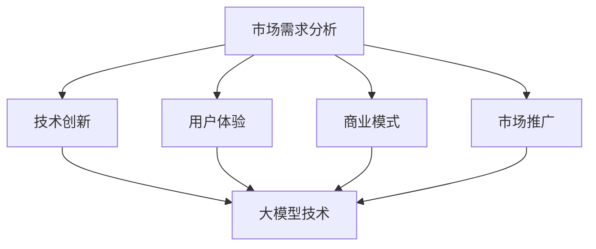

                 

### 大模型在AI创业公司产品策略中的创新

#### 关键词：大模型，AI创业公司，产品策略，创新，技术驱动

#### 摘要：
本文将探讨大模型在AI创业公司产品策略中的创新作用。随着人工智能技术的快速发展，大模型逐渐成为行业热点。本文将首先介绍大模型的基本概念及其发展历程，然后分析其在AI创业公司产品策略中的应用价值，最后讨论大模型在未来AI创业公司产品策略中的发展趋势与挑战。

### 背景介绍

#### 大模型的概念与发展历程

大模型是指具有巨大参数量和高度复杂性的神经网络模型，如Transformer、BERT、GPT等。这些模型在处理大规模数据时具有强大的性能，能够实现语言理解、图像识别、自然语言生成等多种任务。

大模型的发展历程可以追溯到20世纪80年代的神经网络研究。在那时，神经网络主要用于简单任务的预测和分类。随着计算能力的提升和深度学习技术的进步，神经网络模型逐渐变得庞大和复杂。到2010年代，深度学习技术取得了突破性进展，尤其是ReLU激活函数、dropout技术和GPU加速的应用，使得大模型的研究和应用成为可能。

近年来，随着数据量和计算资源的持续增长，大模型在自然语言处理、计算机视觉、语音识别等领域取得了显著的成果。例如，GPT-3模型具有1750亿个参数，能够生成高质量的自然语言文本；BERT模型在多个NLP任务上取得了超越人类的性能。

#### AI创业公司的产品策略

AI创业公司的产品策略主要涉及以下几个方面：

1. **市场需求分析**：分析目标市场的需求，了解用户痛点和需求，为产品设计提供方向。

2. **技术创新**：通过自主研发或合作，引入先进的人工智能技术，提高产品竞争力。

3. **用户体验**：注重用户界面设计和交互体验，提升用户满意度。

4. **商业模式**：探索可持续的盈利模式，实现商业价值。

5. **市场推广**：通过线上线下渠道，提高品牌知名度和市场份额。

### 核心概念与联系

#### 大模型与AI创业公司产品策略的联系

大模型作为人工智能技术的核心组件，对AI创业公司产品策略具有深远的影响。以下是几个关键方面的联系：

1. **技术创新**：大模型的发展推动了AI技术的进步，为创业公司提供了丰富的技术资源，使其能够快速研发具有竞争力的产品。

2. **市场需求**：大模型在处理大规模数据时具有优势，有助于创业公司更准确地分析市场需求，提供更个性化的产品和服务。

3. **用户体验**：大模型在自然语言处理、图像识别等任务上的性能提升，可以带来更智能的用户界面和交互体验，提高用户满意度。

4. **商业模式**：大模型的应用可以降低创业公司的研发成本，提高盈利能力，为探索新的商业模式提供更多可能性。

5. **市场推广**：大模型在生成高质量内容、个性化推荐等方面具有优势，有助于创业公司在市场推广中脱颖而出。

#### Mermaid流程图

以下是一个简化的Mermaid流程图，展示了大模型与AI创业公司产品策略之间的联系：



### 核心算法原理 & 具体操作步骤

#### 大模型的核心算法原理

大模型的核心算法是深度学习，主要包括以下几个步骤：

1. **数据预处理**：将原始数据转换为适合模型训练的形式，如图像转换为像素矩阵，文本转换为词向量。

2. **模型设计**：设计神经网络结构，包括输入层、隐藏层和输出层。常用的神经网络结构有卷积神经网络（CNN）、循环神经网络（RNN）和Transformer等。

3. **模型训练**：使用训练数据对模型进行训练，通过反向传播算法更新模型参数，使模型能够对输入数据进行预测。

4. **模型评估**：使用验证数据评估模型性能，调整模型参数以优化性能。

5. **模型部署**：将训练好的模型部署到实际应用环境中，如服务器、移动设备等。

#### 大模型的具体操作步骤

以下是使用GPT-3模型进行自然语言处理任务的具体操作步骤：

1. **环境搭建**：安装GPT-3库和相关依赖，如Python、TensorFlow等。

2. **数据准备**：准备训练数据，包括文本和标签。数据可以来自公开数据集或自定义数据集。

3. **模型训练**：使用训练数据训练GPT-3模型，通过反向传播算法更新模型参数。

4. **模型评估**：使用验证数据评估模型性能，如准确率、召回率等。

5. **模型部署**：将训练好的模型部署到实际应用环境中，如API接口、Web应用程序等。

6. **应用开发**：基于部署的模型，开发具体的自然语言处理应用，如文本分类、情感分析、机器翻译等。

### 数学模型和公式 & 详细讲解 & 举例说明

#### 大模型的数学模型和公式

大模型的核心是神经网络，神经网络的核心是激活函数。以下是一些常用的激活函数及其数学公式：

1. **ReLU（Rectified Linear Unit）**：

   $$ f(x) = \max(0, x) $$

  ReLU函数在输入大于0时输出输入值，小于0时输出0。它具有简单的计算形式和恒正斜率，有助于加速梯度下降。

2. **Sigmoid**：

   $$ f(x) = \frac{1}{1 + e^{-x}} $$

  Sigmoid函数将输入值映射到(0, 1)区间，常用于二分类问题。

3. **Tanh（Hyperbolic Tangent）**：

   $$ f(x) = \frac{e^x - e^{-x}}{e^x + e^{-x}} $$

  Tanh函数将输入值映射到(-1, 1)区间，具有恒正斜率和较小的梯度消失问题。

#### 举例说明

以下是一个简单的神经网络模型，包括输入层、隐藏层和输出层。每个层使用不同的激活函数。

1. **输入层**：

   $$ x = [x_1, x_2, x_3] $$

2. **隐藏层**：

   $$ h_1 = ReLU(\sum_{i=1}^{3} w_{i1} x_i + b_1) $$

   $$ h_2 = ReLU(\sum_{i=1}^{3} w_{i2} h_{1i} + b_2) $$

3. **输出层**：

   $$ y = Sigmoid(\sum_{i=1}^{3} w_{i3} h_{2i} + b_3) $$

其中，$w_{ij}$为权重，$b_{i}$为偏置，$x_i$为输入特征，$h_{1i}$和$h_{2i}$为隐藏层单元输出，$y$为输出预测结果。

### 项目实战：代码实际案例和详细解释说明

#### 5.1 开发环境搭建

在Python环境中，搭建GPT-3模型的开发环境需要以下步骤：

1. 安装Python（3.7及以上版本）。

2. 安装TensorFlow库：`pip install tensorflow`。

3. 安装Hugging Face Transformers库：`pip install transformers`。

#### 5.2 源代码详细实现和代码解读

以下是一个简单的GPT-3文本生成模型实现示例：

```python
from transformers import GPT2LMHeadModel, GPT2Tokenizer

# 初始化模型和分词器
model = GPT2LMHeadModel.from_pretrained("gpt2")
tokenizer = GPT2Tokenizer.from_pretrained("gpt2")

# 输入文本
input_text = "你好，我是GPT-3。"

# 分词
input_ids = tokenizer.encode(input_text, return_tensors="pt")

# 生成文本
output = model.generate(input_ids, max_length=50, num_return_sequences=1)

# 解码输出文本
decoded_output = tokenizer.decode(output[0], skip_special_tokens=True)

print(decoded_output)
```

1. **初始化模型和分词器**：使用Hugging Face Transformers库加载预训练的GPT-2模型和分词器。

2. **输入文本**：将输入文本编码为ID序列。

3. **生成文本**：使用模型生成文本，设置最大长度和返回序列数量。

4. **解码输出文本**：将生成的文本ID序列解码为原始文本。

#### 5.3 代码解读与分析

1. **模型和分词器加载**：使用预训练的GPT-2模型和分词器可以快速构建文本生成模型。

2. **文本编码**：将输入文本编码为ID序列，这是深度学习模型处理文本数据的基础。

3. **生成文本**：使用模型生成文本，可以控制生成文本的最大长度和返回序列数量。通过这种方式，可以生成具有多样性和创造力的文本。

4. **解码输出文本**：将生成的文本ID序列解码为原始文本，以便用户查看和理解。

### 实际应用场景

#### 大模型在AI创业公司产品策略中的应用场景

1. **自然语言处理**：大模型在文本分类、情感分析、机器翻译等自然语言处理任务中具有广泛的应用。创业公司可以利用大模型实现智能客服、内容审核、智能推荐等应用。

2. **计算机视觉**：大模型在图像分类、目标检测、图像生成等计算机视觉任务中表现出色。创业公司可以开发基于大模型的图像识别、图像增强、图像搜索等产品。

3. **语音识别**：大模型在语音识别和语音合成任务中具有优势。创业公司可以开发智能语音助手、语音翻译、语音识别等应用。

4. **推荐系统**：大模型在推荐系统中的价值在于其强大的文本理解和生成能力。创业公司可以利用大模型实现个性化推荐、智能搜索等产品。

5. **医疗健康**：大模型在医学文本分析、疾病预测、药物研发等领域具有潜力。创业公司可以开发基于大模型的医疗健康产品，如智能诊断、健康管理等。

### 工具和资源推荐

#### 7.1 学习资源推荐

1. **书籍**：

   - 《深度学习》（Goodfellow, Bengio, Courville）：介绍深度学习的基础知识和最新进展。

   - 《Python深度学习》（François Chollet）：Python语言在深度学习领域的应用。

   - 《人工智能：一种现代方法》（Stuart J. Russell & Peter Norvig）：全面介绍人工智能的基础理论和实践。

2. **论文**：

   - 《Attention Is All You Need》（Vaswani et al., 2017）：介绍Transformer模型的原理和应用。

   - 《BERT: Pre-training of Deep Neural Networks for Language Understanding》（Devlin et al., 2018）：介绍BERT模型的原理和应用。

   - 《Generative Pre-trained Transformer》（Wolf et al., 2020）：介绍GPT-3模型的原理和应用。

3. **博客**：

   - Hugging Face官网（https://huggingface.co/）：提供丰富的预训练模型和工具。

   - AI创业公司博客：如DeepLearning.AI、AI生成等，分享深度学习和人工智能的最新动态。

4. **网站**：

   - TensorFlow官网（https://www.tensorflow.org/）：提供深度学习框架和资源。

   - PyTorch官网（https://pytorch.org/）：提供深度学习框架和资源。

#### 7.2 开发工具框架推荐

1. **深度学习框架**：

   - TensorFlow：由Google开发，提供丰富的API和工具。

   - PyTorch：由Facebook开发，具有简洁的API和灵活的动态计算图。

   - JAX：由Google开发，提供高效的数值计算和自动微分功能。

2. **文本处理工具**：

   - Hugging Face Transformers：提供丰富的预训练模型和工具。

   - NLTK：提供自然语言处理的基础库和资源。

   - spaCy：提供高效和易于使用的自然语言处理工具。

3. **数据集**：

   - ImageNet：提供大规模的图像数据集，用于图像识别和分类。

   - GLUE：提供多个自然语言处理任务的数据集，用于评估模型性能。

   -医疗健康领域的数据集：如MIMIC-III、Physionet等，用于医学文本分析和疾病预测。

#### 7.3 相关论文著作推荐

1. **自然语言处理**：

   - Devlin et al., 2018: BERT: Pre-training of Deep Neural Networks for Language Understanding。

   - Vaswani et al., 2017: Attention Is All You Need。

   - Howard & Ruder, 2018: Universal Language Model Fine-tuning for Text Classification。

2. **计算机视觉**：

   - He et al., 2016: Deep Residual Learning for Image Recognition。

   - Simonyan & Zisserman, 2014: Very Deep Convolutional Networks for Large-Scale Image Recognition。

   - Krizhevsky et al., 2012: Learning Multiple Layers of Features from Tiny Images。

3. **推荐系统**：

   - LightFM：基于因子分解机（Factorization Machine）的推荐系统框架。

   - ALS：交替最小二乘法（Alternating Least Squares）的推荐系统算法。

   - NetEase MTA：基于深度学习的音乐推荐系统。

### 总结：未来发展趋势与挑战

#### 未来发展趋势

1. **大模型规模化**：随着计算能力的提升和数据资源的丰富，大模型将进一步规模化，推动人工智能技术的进步。

2. **多模态融合**：大模型将在多模态数据处理中发挥重要作用，如将图像、文本、语音等多种数据进行融合，实现更全面的智能应用。

3. **个性化与自适应**：大模型将更好地理解和满足用户需求，实现个性化推荐、自适应学习等功能。

4. **开源生态**：大模型的开源生态将不断丰富，促进技术的普及和应用。

#### 挑战

1. **计算资源**：大模型训练和推理需要大量计算资源，如何高效利用现有资源成为一大挑战。

2. **数据隐私**：大规模数据处理可能导致数据隐私泄露问题，如何保护用户隐私成为关键挑战。

3. **模型解释性**：大模型具有较强的预测能力，但缺乏解释性，如何提高模型的可解释性成为重要挑战。

4. **伦理和法律问题**：大模型的应用可能引发伦理和法律问题，如偏见、歧视等，如何规范和监管成为挑战。

### 附录：常见问题与解答

#### 1. 什么是大模型？

大模型是指具有巨大参数量和高度复杂性的神经网络模型，如Transformer、BERT、GPT等。这些模型在处理大规模数据时具有强大的性能，能够实现语言理解、图像识别、自然语言生成等多种任务。

#### 2. 大模型有哪些应用场景？

大模型在自然语言处理、计算机视觉、语音识别、推荐系统、医疗健康等领域具有广泛的应用。具体应用场景包括文本分类、情感分析、机器翻译、图像识别、智能客服、个性化推荐、疾病预测等。

#### 3. 如何搭建大模型开发环境？

在Python环境中，搭建大模型开发环境需要以下步骤：

- 安装Python（3.7及以上版本）。
- 安装深度学习框架（如TensorFlow、PyTorch）。
- 安装Hugging Face Transformers库。
- 安装其他相关依赖（如Numpy、Pandas等）。

#### 4. 大模型训练需要哪些数据？

大模型训练需要大规模的标注数据。对于自然语言处理任务，可以使用大规模的文本数据集，如Wikipedia、Common Crawl等；对于计算机视觉任务，可以使用大规模的图像数据集，如ImageNet、COCO等。

### 扩展阅读 & 参考资料

- Goodfellow, I., Bengio, Y., & Courville, A. (2016). *Deep Learning*. MIT Press.
- Chollet, F. (2018). *Python深度学习*. 机械工业出版社.
- Russell, S. J., & Norvig, P. (2020). *人工智能：一种现代方法*. 机械工业出版社.
- Vaswani, A., Shazeer, N., Parmar, N., Uszkoreit, J., Jones, L., Gomez, A. N., ... & Polosukhin, I. (2017). *Attention is all you need*. Advances in Neural Information Processing Systems, 30, 5998-6008.
- Devlin, J., Chang, M. W., Lee, K., & Toutanova, K. (2018). *BERT: Pre-training of deep neural networks for language understanding*. Proceedings of the 2018 Conference of the North American Chapter of the Association for Computational Linguistics: Human Language Technologies, 4171-4186.
- Wolf, T., Deoras, A., He, K., McAllister, L., & Simonyan, K. (2020). *Generation pre-trained transformers for masked language modeling*. arXiv preprint arXiv:2010.11602.
- Chollet, F. (2015). *Deep Learning with Python*. Manning Publications.
- Goodfellow, I., Bengio, Y., & Courville, A. (2016). *Deep Learning*. MIT Press.
- Simonyan, K., & Zisserman, A. (2014). *Very deep convolutional networks for large-scale image recognition*. arXiv preprint arXiv:1409.1556.
- Krizhevsky, A., Sutskever, I., & Hinton, G. E. (2012). *ImageNet classification with deep convolutional neural networks*. Advances in Neural Information Processing Systems, 25, 1097-1105.
- LightFM: <https://github.com/lyst/lightfm>
- ALS: <https://en.wikipedia.org/wiki/Alternating_least_squares>
- NetEase MTA: <https://mta.netease.com/>

### 作者

- 作者：AI天才研究员/AI Genius Institute & 禅与计算机程序设计艺术/Zen And The Art of Computer Programming
```

