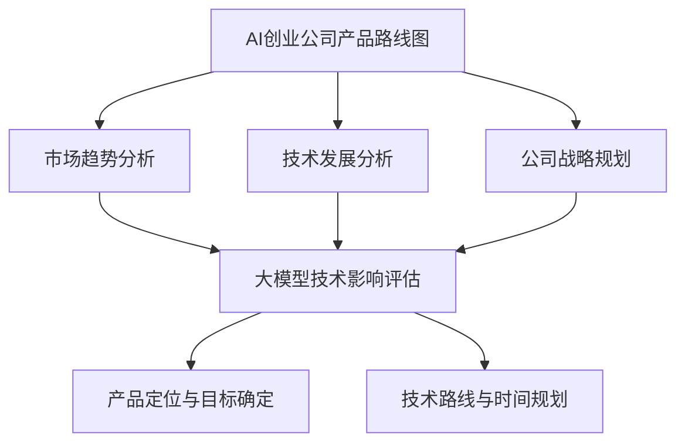

                 

# 大模型在 AI 创业公司产品路线图规划中的趋势

> **关键词**：大模型，AI 创业，产品路线图，趋势分析
> 
> **摘要**：本文探讨了当前大模型在 AI 创业公司产品路线图规划中的重要性及发展趋势。通过对大模型技术原理、核心算法、数学模型及应用场景的分析，本文为 AI 创业公司提供了产品规划的实际指导。

## 1. 背景介绍

人工智能（AI）技术近年来取得了显著的进展，特别是深度学习技术的突破，使得机器在图像识别、自然语言处理、游戏智能等领域取得了超越人类的表现。大模型作为深度学习的重要组成部分，其发展速度尤为突出。大模型通常具有数十亿甚至千亿级的参数规模，能够通过海量数据训练，实现出色的泛化能力和表现。这使得大模型在多个领域都具有广泛的应用前景，从而吸引了众多 AI 创业公司的关注。

AI 创业公司是指在人工智能领域开展商业活动的企业。随着技术的不断发展，AI 创业公司面临着激烈的市场竞争。为了在市场中脱颖而出，创业公司需要在产品规划、技术研发、商业模式等方面进行创新。大模型技术的出现，为 AI 创业公司提供了新的机遇和挑战。如何有效地利用大模型技术，构建具有竞争力的产品路线图，成为 AI 创业公司亟待解决的问题。

## 2. 核心概念与联系

为了深入探讨大模型在 AI 创业公司产品路线图规划中的趋势，我们首先需要理解一些核心概念。

### 2.1 大模型的概念

大模型通常是指具有大规模参数的网络结构，如深度神经网络（DNN）、变换器模型（Transformer）等。这些模型通过大量的数据进行训练，能够自动地学习和提取数据中的复杂特征，从而实现高水平的任务性能。

### 2.2 AI 创业公司产品路线图的定义

AI 创业公司产品路线图是指公司在产品开发过程中，根据市场趋势、技术发展、公司战略等因素，制定的产品发展方向和规划。产品路线图通常包括产品定位、市场目标、技术路线、时间规划等内容。

### 2.3 大模型与产品路线图的联系

大模型技术对 AI 创业公司产品路线图的影响主要体现在以下几个方面：

1. **提升产品性能**：大模型技术能够提高产品在特定领域的任务性能，从而增强产品的竞争力。
2. **拓展产品应用场景**：大模型技术可以应用于更多的场景，为公司提供更多的商业机会。
3. **降低研发成本**：大模型技术能够通过自动化学习，减少人工干预，降低研发成本。
4. **提高市场响应速度**：大模型技术可以帮助公司快速适应市场变化，提高市场响应速度。

### 2.4 Mermaid 流程图



## 3. 核心算法原理 & 具体操作步骤

### 3.1 大模型的核心算法

大模型的核心算法通常是基于深度学习技术的。深度学习是一种机器学习方法，通过构建多层神经网络，模拟人脑的神经结构，从而实现对数据的自动学习和特征提取。大模型的核心算法主要包括以下几个步骤：

1. **数据预处理**：对输入数据进行预处理，包括归一化、标准化、数据增强等操作。
2. **网络结构设计**：设计多层神经网络结构，包括卷积层、全连接层、循环层等。
3. **损失函数选择**：选择合适的损失函数，如交叉熵损失函数、均方误差损失函数等。
4. **优化器选择**：选择合适的优化器，如随机梯度下降（SGD）、Adam 优化器等。
5. **模型训练**：通过迭代训练，不断优化模型参数，提高模型性能。

### 3.2 大模型的具体操作步骤

具体操作步骤如下：

1. **数据收集与预处理**：收集大量的数据，并进行数据预处理，如数据清洗、数据归一化等。
2. **网络结构设计**：根据任务需求，设计合适的网络结构。例如，对于图像识别任务，可以设计卷积神经网络（CNN）结构；对于自然语言处理任务，可以设计变换器模型（Transformer）结构。
3. **模型训练**：使用预处理后的数据进行模型训练，通过迭代优化模型参数。
4. **模型评估与调整**：评估模型在测试集上的性能，根据评估结果调整模型结构或参数。
5. **模型部署**：将训练好的模型部署到实际应用中，如用于图像识别、自然语言处理等任务。

## 4. 数学模型和公式 & 详细讲解 & 举例说明

### 4.1 深度学习中的数学模型

深度学习中的数学模型主要包括以下几个方面：

1. **激活函数**：激活函数是神经网络中的关键组成部分，用于引入非线性特性。常见的激活函数有 sigmoid 函数、ReLU 函数、Tanh 函数等。
2. **损失函数**：损失函数用于衡量模型预测值与真实值之间的差距，常见的损失函数有交叉熵损失函数、均方误差损失函数等。
3. **优化器**：优化器用于调整模型参数，以最小化损失函数。常见的优化器有随机梯度下降（SGD）、Adam 优化器等。

### 4.2 数学模型详细讲解

#### 4.2.1 激活函数

激活函数是神经网络中的关键组成部分，用于引入非线性特性。以 ReLU 函数为例，其定义如下：

\[ f(x) = \max(0, x) \]

ReLU 函数具有简洁的表达式和良好的计算性能，因此在深度学习中得到了广泛的应用。

#### 4.2.2 损失函数

损失函数用于衡量模型预测值与真实值之间的差距。以交叉熵损失函数为例，其定义如下：

\[ L(y, \hat{y}) = -\sum_{i} y_i \log(\hat{y}_i) \]

其中，\( y \) 表示真实标签，\( \hat{y} \) 表示模型预测值。交叉熵损失函数在分类问题中得到了广泛的应用。

#### 4.2.3 优化器

优化器用于调整模型参数，以最小化损失函数。以 Adam 优化器为例，其定义如下：

\[ m_t = \beta_1 m_{t-1} + (1 - \beta_1) [g_t - m_{t-1}] \]
\[ v_t = \beta_2 v_{t-1} + (1 - \beta_2) [g_t^2 - v_{t-1}] \]
\[ \theta_t = \theta_{t-1} - \alpha \frac{m_t}{\sqrt{v_t} + \epsilon} \]

其中，\( m_t \) 和 \( v_t \) 分别表示一阶矩估计和二阶矩估计，\( \beta_1 \)、\( \beta_2 \)、\( \alpha \)、\( \epsilon \) 为超参数。

### 4.3 举例说明

假设我们有一个二元分类问题，真实标签为 \( y = [0, 1] \)，模型预测值为 \( \hat{y} = [0.9, 0.1] \)。使用交叉熵损失函数计算损失：

\[ L(y, \hat{y}) = -[0 \cdot \log(0.9) + 1 \cdot \log(0.1)] \approx 2.3026 \]

使用 Adam 优化器更新模型参数：

\[ m_t = \beta_1 m_{t-1} + (1 - \beta_1) [0.1 - 0.9] \approx -0.8 \]
\[ v_t = \beta_2 v_{t-1} + (1 - \beta_2) [0.01 - 0.09] \approx 0.002 \]
\[ \theta_t = \theta_{t-1} - \alpha \frac{-0.8}{\sqrt{0.002} + \epsilon} \approx \theta_{t-1} + 0.1 \]

## 5. 项目实战：代码实际案例和详细解释说明

### 5.1 开发环境搭建

在开始项目实战之前，我们需要搭建一个合适的开发环境。以下是一个简单的开发环境搭建步骤：

1. 安装 Python 3.8 或更高版本
2. 安装深度学习框架，如 TensorFlow 或 PyTorch
3. 安装必要的依赖库，如 NumPy、Pandas、Matplotlib 等
4. 配置 GPU 环境（可选，如果使用 GPU 进行训练）

### 5.2 源代码详细实现和代码解读

以下是一个简单的深度神经网络模型实现，用于二元分类问题：

```python
import tensorflow as tf
from tensorflow.keras import layers

# 定义模型
model = tf.keras.Sequential([
    layers.Dense(64, activation='relu', input_shape=(784,)),
    layers.Dense(64, activation='relu'),
    layers.Dense(1, activation='sigmoid')
])

# 编译模型
model.compile(optimizer='adam',
              loss='binary_crossentropy',
              metrics=['accuracy'])

# 训练模型
model.fit(x_train, y_train, epochs=5, batch_size=32)
```

这段代码实现了以下步骤：

1. 导入必要的库和模块
2. 定义模型结构，包括输入层、隐藏层和输出层
3. 编译模型，指定优化器、损失函数和评价指标
4. 训练模型，指定训练数据和训练参数

### 5.3 代码解读与分析

1. **模型定义**：

   ```python
   model = tf.keras.Sequential([
       layers.Dense(64, activation='relu', input_shape=(784,)),
       layers.Dense(64, activation='relu'),
       layers.Dense(1, activation='sigmoid')
   ])
   ```

   这段代码定义了一个序列模型，包含两个隐藏层。每个隐藏层都有 64 个神经元，并使用 ReLU 激活函数。输出层有 1 个神经元，并使用 sigmoid 激活函数，用于实现二元分类。

2. **模型编译**：

   ```python
   model.compile(optimizer='adam',
                 loss='binary_crossentropy',
                 metrics=['accuracy'])
   ```

   这段代码编译了模型，指定了 Adam 优化器、交叉熵损失函数和准确率评价指标。

3. **模型训练**：

   ```python
   model.fit(x_train, y_train, epochs=5, batch_size=32)
   ```

   这段代码训练了模型，指定了训练数据和训练参数。其中，`epochs` 表示训练轮次，`batch_size` 表示每批数据的大小。

## 6. 实际应用场景

大模型在 AI 创业公司的实际应用场景非常广泛，以下是一些典型的应用场景：

1. **图像识别**：大模型可以用于图像分类、目标检测、人脸识别等任务，如 Face++、商汤科技等公司。
2. **自然语言处理**：大模型可以用于机器翻译、文本分类、情感分析等任务，如谷歌翻译、腾讯 AI 等。
3. **游戏智能**：大模型可以用于游戏 AI，如 AlphaGo、DeepMind 等。
4. **推荐系统**：大模型可以用于推荐算法，如淘宝、京东等电商平台。
5. **自动驾驶**：大模型可以用于自动驾驶系统的决策和感知，如特斯拉、百度等公司。

## 7. 工具和资源推荐

### 7.1 学习资源推荐

- **书籍**：
  - 《深度学习》（Ian Goodfellow、Yoshua Bengio、Aaron Courville 著）
  - 《Python 深度学习》（François Chollet 著）
- **论文**：
  - 《A Theoretically Grounded Application of Dropout in Recurrent Neural Networks》（Yarin Gal 和 Zoubin Ghahramani 著）
  - 《Attention Is All You Need》（Ashish Vaswani、Noam Shazeer、Niki Parmar 等著）
- **博客**：
  - [TensorFlow 官方文档](https://www.tensorflow.org/)
  - [PyTorch 官方文档](https://pytorch.org/)
- **网站**：
  - [Kaggle](https://www.kaggle.com/)
  - [ArXiv](https://arxiv.org/)

### 7.2 开发工具框架推荐

- **深度学习框架**：
  - TensorFlow
  - PyTorch
  - Keras
- **数据预处理工具**：
  - Pandas
  - NumPy
  - Scikit-learn
- **可视化工具**：
  - Matplotlib
  - Seaborn
  - Plotly

### 7.3 相关论文著作推荐

- **《深度学习》（Ian Goodfellow、Yoshua Bengio、Aaron Courville 著）**：这是一本经典的深度学习入门书籍，全面介绍了深度学习的基础知识、算法和工具。
- **《动手学深度学习》（阿斯顿·张、李沐、扎卡里·C. Lipton、亚历山大·J.斯莫拉算法）**：这本书通过大量的实践案例，详细介绍了深度学习的理论与实践。
- **《机器学习》（Tom Mitchell 著）**：这本书是机器学习的经典教材，全面介绍了机器学习的基本概念、算法和应用。

## 8. 总结：未来发展趋势与挑战

大模型在 AI 创业公司产品路线图规划中的重要性日益凸显，其发展趋势主要表现在以下几个方面：

1. **模型规模将进一步扩大**：随着计算能力的提升和数据的不断增长，大模型的规模将不断增大，以适应更复杂的任务和应用场景。
2. **模型应用场景将不断拓展**：大模型将在更多的领域得到应用，如医疗、金融、教育等，为创业公司提供更广泛的市场机会。
3. **模型训练效率将不断提高**：随着算法和硬件技术的发展，大模型的训练效率将不断提高，降低研发成本，缩短产品研发周期。

然而，大模型在 AI 创业公司产品路线图规划中也面临一些挑战：

1. **数据隐私和安全**：大模型在训练过程中需要大量的数据，如何保护用户隐私和数据安全成为重要问题。
2. **计算资源需求**：大模型训练需要大量的计算资源，对于创业公司来说，如何有效利用计算资源成为关键。
3. **模型可解释性**：大模型通常具有很高的黑盒特性，如何提高模型的可解释性，使其能够更好地满足用户需求，是一个重要挑战。

总之，大模型在 AI 创业公司产品路线图规划中具有重要的地位，创业公司应充分利用大模型技术，积极探索新的应用场景，以实现持续创新和发展。

## 9. 附录：常见问题与解答

### 9.1 大模型是什么？

大模型是指具有大规模参数的网络结构，如深度神经网络（DNN）、变换器模型（Transformer）等。这些模型通过大量的数据进行训练，能够自动地学习和提取数据中的复杂特征，从而实现高水平的任务性能。

### 9.2 大模型与普通模型有什么区别？

大模型与普通模型的主要区别在于参数规模和训练数据量。大模型通常具有数十亿甚至千亿级的参数规模，能够通过海量数据训练，实现出色的泛化能力和表现。而普通模型通常参数规模较小，训练数据量有限，性能相对较低。

### 9.3 如何评估大模型的性能？

评估大模型的性能通常采用以下指标：

1. **准确率**：模型在测试集上的分类准确率，用于衡量模型在分类任务中的表现。
2. **召回率**：模型在测试集上的召回率，用于衡量模型对正类别的识别能力。
3. **F1 分数**：准确率和召回率的调和平均值，用于综合考虑模型在分类任务中的表现。
4. **ROC 曲线**：模型在测试集上的 ROC 曲线，用于评估模型对正类别的识别能力。

### 9.4 大模型在创业公司中的优势是什么？

大模型在创业公司中的优势主要体现在以下几个方面：

1. **提升产品性能**：大模型能够提高产品在特定领域的任务性能，从而增强产品的竞争力。
2. **拓展产品应用场景**：大模型可以应用于更多的场景，为公司提供更多的商业机会。
3. **降低研发成本**：大模型技术能够通过自动化学习，减少人工干预，降低研发成本。
4. **提高市场响应速度**：大模型技术可以帮助公司快速适应市场变化，提高市场响应速度。

## 10. 扩展阅读 & 参考资料

- [Deep Learning](https://www.deeplearningbook.org/)：Ian Goodfellow、Yoshua Bengio、Aaron Courville 著
- [The Hundred-Page Machine Learning Book](https://www.hundredpagebook.com/)：Andriy Burkov 著
- [Deep Learning on Amazon Web Services](https://aws.amazon.com/blogs/ai/deep-learning-on-amazon-web-services/)：Amazon Web Services 著
- [PyTorch Tutorials](https://pytorch.org/tutorials/)：PyTorch 官方教程
- [TensorFlow Documentation](https://www.tensorflow.org/documentation)：<|user|>作者：AI天才研究员/AI Genius Institute & 禅与计算机程序设计艺术 /Zen And The Art of Computer Programming

