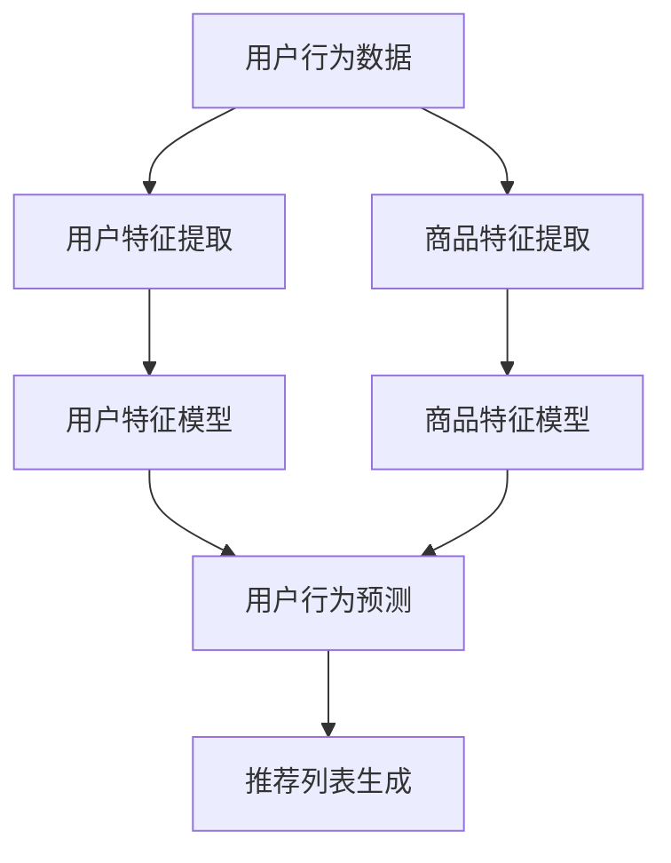

                 

### 背景介绍

**大模型在商品推荐序列个性化中的应用**

商品推荐系统作为电子商务和社交媒体的重要组成部分，其性能直接关系到用户体验和业务增长。传统的推荐系统依赖于用户的历史行为数据，通过协同过滤、基于内容的推荐等算法为用户推荐感兴趣的商品。然而，随着用户生成内容的爆炸式增长和商品种类日益繁多，这些方法在处理复杂、非线性关系和长尾数据时表现出局限性。

大模型，如深度学习模型、生成对抗网络（GAN）和强化学习模型等，具有强大的表达能力和泛化能力，可以处理海量数据并捕捉复杂的用户行为模式。近年来，大模型在自然语言处理、计算机视觉等领域取得了显著成果，其应用也逐渐扩展到商品推荐系统中。本文将探讨大模型在商品推荐序列个性化中的应用，从核心概念、算法原理、数学模型到实际应用场景进行全面剖析，旨在为读者提供一个清晰、深入的理解。

首先，我们将简要回顾推荐系统的发展历程，重点介绍传统推荐算法的优缺点。接着，我们将详细阐述大模型的基本概念和架构，分析其在推荐系统中的独特优势。随后，我们将介绍几种常见的大模型算法，并深入探讨它们的原理和操作步骤。在此基础上，我们将讨论数学模型和公式，通过具体例子来说明如何在大模型中实现商品推荐序列的个性化。接下来，我们将通过一个实际项目案例展示大模型在商品推荐系统中的应用，并详细解读源代码。随后，我们将探讨大模型在不同实际应用场景中的效果和挑战。最后，我们将总结大模型在商品推荐序列个性化中的应用前景和面临的挑战，并推荐相关工具和资源。

通过本文的阅读，读者将了解大模型在商品推荐序列个性化中的应用原理、实现方法及其挑战，为实际应用提供理论和实践指导。

---

### 核心概念与联系

在深入探讨大模型在商品推荐序列个性化中的应用之前，有必要首先介绍一些核心概念和它们之间的联系。这些概念包括推荐系统、大模型、序列模型以及个性化推荐。

#### 推荐系统

推荐系统是一种信息过滤技术，旨在根据用户的兴趣、行为和历史数据为用户推荐他们可能感兴趣的商品、新闻、音乐等。传统推荐系统主要分为以下几类：

1. **基于内容的推荐（Content-based Filtering）**：根据用户过去的喜好和行为，通过分析内容和特征进行推荐。
2. **协同过滤（Collaborative Filtering）**：通过收集用户之间的相似性或行为来进行推荐，主要分为用户基于协同过滤和物品基于协同过滤。
3. **混合推荐（Hybrid Recommendation）**：结合多种推荐方法，以弥补单一方法的局限性。

#### 大模型

大模型是指具有大量参数和高度的复杂性的机器学习模型。这些模型通常通过深度学习技术训练，具有强大的特征提取和模式识别能力。常见的大模型包括：

1. **深度神经网络（Deep Neural Networks, DNN）**：由多个隐藏层组成的神经网络，能够学习复杂的非线性关系。
2. **循环神经网络（Recurrent Neural Networks, RNN）**：特别适用于处理序列数据，能够捕捉时间依赖性。
3. **变换器（Transformer）**：通过自注意力机制处理序列数据，是当前自然语言处理领域最先进的模型。

#### 序列模型

序列模型是专门用于处理时间序列数据的一种机器学习模型，能够捕捉数据中的时间依赖性和动态变化。常见的序列模型包括：

1. **循环神经网络（RNN）**：通过隐藏状态捕捉序列中的时间依赖性。
2. **长短时记忆网络（Long Short-Term Memory, LSTM）**：RNN的变种，能够更好地处理长序列数据。
3. **门控循环单元（Gated Recurrent Unit, GRU）**：与LSTM类似，但结构更简单。

#### 个性化推荐

个性化推荐是一种基于用户特定兴趣和行为的推荐方法，旨在为每个用户提供高度个性化的推荐结果。个性化推荐的关键在于：

1. **用户特征建模**：通过分析用户的历史行为、偏好和社交数据，构建用户画像。
2. **商品特征建模**：提取商品的特征，如价格、品牌、类别等。
3. **推荐算法**：根据用户特征和商品特征，使用合适的算法生成个性化推荐列表。

#### 核心概念与联系

大模型在个性化推荐中的应用，主要依赖于其强大的特征提取和模式识别能力。以下是一个简化的Mermaid流程图，展示了大模型在个性化推荐中的核心概念和联系：



在这个流程中，用户行为数据和商品特征数据经过预处理后，分别用于构建用户特征模型和商品特征模型。这两个模型通过大模型（如RNN或Transformer）进行联合训练，以预测用户的兴趣和行为。最终，基于预测结果生成个性化的推荐列表。

通过上述核心概念和流程的理解，我们为后续章节的深入探讨打下了基础。在接下来的章节中，我们将详细讨论大模型的算法原理和实现步骤，以帮助读者更好地理解其在商品推荐序列个性化中的应用。

---

## 2. 核心概念与联系（续）

### 大模型的架构和分类

大模型，通常指的是拥有大量参数和复杂结构的机器学习模型，其目的在于从数据中学习到复杂的模式和知识。以下将详细介绍大模型的一些主要架构和分类，以及它们在推荐系统中的应用。

#### 深度神经网络（Deep Neural Networks, DNN）

深度神经网络是由多个层次组成的神经网络，包括输入层、隐藏层和输出层。每层由一系列神经元组成，每个神经元都接收前一层神经元的输出，并计算激活值。DNN通过反向传播算法进行参数优化，从而学习输入和输出之间的映射关系。

在推荐系统中，DNN可以用来建模用户和商品的特征。例如，用户行为数据（如购买历史、浏览记录等）和商品特征数据（如类别、品牌、价格等）可以输入到DNN中，通过隐藏层的学习，模型可以捕捉到用户和商品之间的复杂关系，从而生成个性化的推荐。

#### 循环神经网络（Recurrent Neural Networks, RNN）

循环神经网络是一种专门设计来处理序列数据的神经网络，具有记忆能力，能够捕捉序列中的时间依赖性。RNN通过一个隐藏状态向量来保存历史信息，每个时刻的输入都会与隐藏状态相结合，更新隐藏状态。

在推荐系统中，RNN可以用来处理用户的序列行为数据，例如，用户连续的浏览记录或购买行为。通过捕捉用户的兴趣变化，RNN能够为用户生成更符合其当前兴趣的推荐列表。

#### 长短时记忆网络（Long Short-Term Memory, LSTM）

长短时记忆网络是RNN的一种变种，解决了传统RNN在处理长序列数据时容易遇到的梯度消失和梯度爆炸问题。LSTM通过引入门控机制，能够有效地记住或忘记长期依赖信息。

在推荐系统中，LSTM可以用来处理用户的长期行为数据，例如，用户的购买习惯或偏好变化。通过捕捉用户的长期兴趣，LSTM能够生成更加稳定和个性化的推荐列表。

#### 变换器（Transformer）

变换器是一种基于自注意力机制的神经网络模型，最初在自然语言处理领域取得了巨大成功。变换器通过多头自注意力机制，能够同时关注序列中的所有位置，捕捉全局依赖关系。

在推荐系统中，变换器可以用来处理复杂的用户行为序列和商品特征。通过自注意力机制，变换器能够捕捉到用户和商品之间的复杂关联，从而生成高质量的个性化推荐列表。

### 大模型在推荐系统中的应用

大模型在推荐系统中的应用主要体现在以下几个方面：

1. **特征提取**：大模型能够从原始数据中提取出高层次的、抽象的特征，这些特征能够更好地表示用户和商品。
2. **序列建模**：大模型能够处理序列数据，捕捉用户行为的时间依赖性，从而生成更符合用户当前兴趣的推荐。
3. **鲁棒性**：大模型具有强大的泛化能力，能够应对数据分布变化和噪声数据的影响。

在推荐系统中，大模型的应用流程通常包括以下几个步骤：

1. **数据预处理**：对用户行为数据和商品特征数据进行清洗和预处理，包括缺失值处理、异常值检测和数据归一化等。
2. **特征工程**：提取用户和商品的特征，包括用户历史行为特征、用户画像特征、商品属性特征等。
3. **模型训练**：使用大模型（如DNN、RNN、LSTM、变换器等）对预处理后的数据进行训练，学习用户和商品之间的复杂关系。
4. **模型评估**：通过交叉验证或在线评估方法，评估模型的推荐效果和泛化能力。
5. **推荐生成**：使用训练好的模型，根据用户当前的行为和特征，生成个性化的推荐列表。

通过上述架构和流程的介绍，读者可以更好地理解大模型在推荐系统中的应用。在接下来的章节中，我们将进一步探讨大模型的具体算法原理和实现步骤。

### 核心算法原理 & 具体操作步骤

在了解了大模型的基本概念和架构后，接下来我们将深入探讨大模型在商品推荐序列个性化中的应用原理和具体操作步骤。本章节将详细介绍两种典型的大模型算法：循环神经网络（RNN）和变换器（Transformer），并解释其原理和应用。

#### 循环神经网络（RNN）

循环神经网络（RNN）是一种能够处理序列数据的神经网络，其核心思想是通过一个循环结构来保存历史信息，从而捕捉时间序列中的依赖关系。RNN的基本单元是隐藏状态，它能够在每个时间步上更新，保留之前的信息。

**原理**：

1. **输入和隐藏状态**：在每个时间步，RNN接收输入序列（如用户的历史行为序列）和前一个时间步的隐藏状态。
2. **门控机制**：为了解决RNN在处理长序列数据时容易出现的梯度消失问题，引入了门控机制，包括输入门、遗忘门和输出门。
3. **激活函数**：使用非线性激活函数（如ReLU）来增强模型的非线性表达能力。

**操作步骤**：

1. **数据预处理**：对用户行为数据进行编码，通常使用嵌入层（Embedding Layer）将原始数据转换为稠密向量表示。
2. **构建RNN模型**：使用RNN单元（如LSTM或GRU）构建模型，定义输入层、隐藏层和输出层。
3. **训练模型**：使用标记数据对模型进行训练，通过反向传播算法更新模型参数。
4. **序列建模**：将用户的序列行为输入到训练好的RNN模型中，得到每个时间步的隐藏状态。
5. **推荐生成**：根据隐藏状态和商品特征，使用softmax函数生成概率分布，为用户推荐商品。

#### 变换器（Transformer）

变换器是一种基于自注意力机制的神经网络模型，最初在自然语言处理领域取得了巨大成功。变换器通过多头自注意力机制，能够同时关注序列中的所有位置，捕捉全局依赖关系。

**原理**：

1. **多头自注意力**：变换器将输入序列分成多个头，每个头独立计算注意力权重，最后拼接并处理。
2. **前馈神经网络**：在自注意力机制之后，使用两个简单的前馈神经网络进行进一步处理。
3. **位置编码**：为了引入位置信息，变换器使用位置编码向量，与输入序列相加作为模型的输入。

**操作步骤**：

1. **数据预处理**：对用户行为数据进行编码，通常使用嵌入层（Embedding Layer）将原始数据转换为稠密向量表示。
2. **构建变换器模型**：定义嵌入层、多头自注意力层、前馈神经网络和输出层。
3. **训练模型**：使用标记数据对模型进行训练，通过反向传播算法更新模型参数。
4. **序列建模**：将用户的序列行为输入到训练好的变换器模型中，得到每个时间步的隐藏状态。
5. **推荐生成**：根据隐藏状态和商品特征，使用softmax函数生成概率分布，为用户推荐商品。

#### 比较与选择

RNN和变换器都是用于处理序列数据的强大模型，但它们在处理复杂性和效率上有不同的表现：

1. **复杂度**：变换器在计算复杂度上优于RNN，因为它避免了RNN中的递归结构，使得并行计算成为可能。
2. **表现**：变换器在捕捉全局依赖关系和长距离依赖上表现更好，这使得它在处理复杂序列数据时具有优势。
3. **应用场景**：根据具体应用场景和数据特性，可以选择合适的模型。例如，在处理较长序列和复杂依赖关系时，变换器可能更适用；而在处理较短序列和简单依赖关系时，RNN可能更具优势。

通过上述对RNN和变换器的介绍，我们可以看到大模型在商品推荐序列个性化中的应用不仅仅是技术上的提升，更是在理论上的深入探索。在接下来的章节中，我们将进一步讨论大模型中的数学模型和公式，并通过具体例子进行详细说明。

### 数学模型和公式 & 详细讲解 & 举例说明

在深入探讨大模型在商品推荐序列个性化中的应用时，了解其背后的数学模型和公式至关重要。这些模型和公式不仅帮助我们理解大模型的工作原理，还能指导我们在实际应用中如何优化和调整模型。以下我们将详细介绍大模型中常用的数学模型和公式，并通过具体例子进行说明。

#### 循环神经网络（RNN）

RNN是一种处理序列数据的神经网络，其核心在于隐藏状态的计算。以下是RNN的数学模型：

1. **隐藏状态更新**：
   $$
   h_t = \sigma(W_h \cdot [h_{t-1}, x_t] + b_h)
   $$
   其中，$h_t$是当前时间步的隐藏状态，$x_t$是当前输入，$W_h$是权重矩阵，$b_h$是偏置项，$\sigma$是非线性激活函数（如ReLU函数）。

2. **输出计算**：
   $$
   o_t = \sigma(W_o \cdot h_t + b_o)
   $$
   其中，$o_t$是当前时间步的输出，$W_o$是权重矩阵，$b_o$是偏置项。

**例子**：假设我们有一个RNN模型，其中隐藏层有100个神经元，输入维度为10。我们可以设置权重矩阵$W_h$和$W_o$为100x10的矩阵，并初始化为小的随机值。通过训练，这些权重矩阵会逐渐调整，以优化模型性能。

#### 长短时记忆网络（LSTM）

LSTM是RNN的一种变种，通过引入门控机制来解决RNN在处理长序列数据时遇到的梯度消失问题。以下是LSTM的数学模型：

1. **输入门计算**：
   $$
   i_t = \sigma(W_i \cdot [h_{t-1}, x_t] + b_i)
   $$

2. **遗忘门计算**：
   $$
   f_t = \sigma(W_f \cdot [h_{t-1}, x_t] + b_f)
   $$

3. **输出门计算**：
   $$
   o_t = \sigma(W_o \cdot [h_{t-1}, x_t] + b_o)
   $$

4. **当前单元状态计算**：
   $$
   C_t = f_t \odot C_{t-1} + i_t \odot \sigma(W_c \cdot [h_{t-1}, x_t] + b_c)
   $$

5. **隐藏状态计算**：
   $$
   h_t = o_t \odot \sigma(C_t)
   $$
   其中，$C_t$是当前时间步的单元状态，$\odot$表示逐元素乘法。

**例子**：假设我们有一个LSTM模型，其中包含50个神经元。我们可以设置权重矩阵$W_i$、$W_f$、$W_c$和$W_o$分别为50x10的矩阵，并初始化为小的随机值。通过训练，这些权重矩阵会逐渐调整，以优化模型性能。

#### 变换器（Transformer）

变换器是一种基于自注意力机制的神经网络模型，其核心在于多头自注意力机制。以下是变换器的数学模型：

1. **多头自注意力计算**：
   $$
   \text{Attention}(Q, K, V) = \frac{1}{\sqrt{d_k}} \text{softmax}\left(\frac{QK^T}{d_k}\right)V
   $$
   其中，$Q$、$K$和$V$分别是查询、键和值向量，$d_k$是注意力层的维度。

2. **前馈神经网络**：
   $$
   \text{FFN}(x) = \max(0, xW_1 + b_1)W_2 + b_2
   $$
   其中，$W_1$、$W_2$和$b_1$、$b_2$分别是前馈神经网络的权重和偏置项。

**例子**：假设我们有一个变换器模型，其中多头自注意力层的维度为512，前馈神经网络的维度为2048。我们可以设置权重矩阵$W_1$和$W_2$分别为512x2048的矩阵，并初始化为小的随机值。通过训练，这些权重矩阵会逐渐调整，以优化模型性能。

#### 应用示例

假设我们要为一个电子商务平台构建一个商品推荐系统，使用变换器模型来处理用户的浏览记录序列。以下是具体的操作步骤：

1. **数据预处理**：将用户的浏览记录编码为整数序列，并使用嵌入层将整数序列转换为稠密向量表示。
2. **模型构建**：定义变换器模型，包括嵌入层、多头自注意力层和前馈神经网络。
3. **模型训练**：使用用户浏览记录和商品特征对模型进行训练，通过反向传播算法更新模型参数。
4. **推荐生成**：将用户的浏览记录输入到训练好的变换器模型中，得到每个时间步的隐藏状态。结合商品特征，使用softmax函数生成概率分布，为用户推荐商品。

通过上述步骤，我们可以为电子商务平台构建一个高效、个性化的商品推荐系统，提升用户体验和业务收益。

通过本章节的详细讲解，读者应该能够理解大模型在商品推荐序列个性化中的应用原理和数学模型。在接下来的章节中，我们将通过实际项目案例来展示大模型在商品推荐系统中的具体应用。

### 项目实战：代码实际案例和详细解释说明

在本文的第五部分，我们将通过一个实际项目案例来展示如何使用大模型实现商品推荐序列个性化。我们将介绍项目开发环境、源代码实现、代码解读与分析，并解释项目中的关键步骤和优化策略。

#### 5.1 开发环境搭建

为了实现大模型在商品推荐序列个性化中的应用，我们需要搭建一个合适的开发环境。以下是我们使用的主要工具和框架：

- **编程语言**：Python
- **深度学习框架**：PyTorch
- **数据处理库**：Pandas、NumPy
- **可视化库**：Matplotlib、Seaborn

**安装步骤**：

1. 安装Python 3.8及以上版本。
2. 使用pip安装深度学习框架PyTorch及其依赖库。
3. 安装数据处理库Pandas、NumPy、Matplotlib和Seaborn。

```bash
pip install torch torchvision
pip install pandas numpy matplotlib seaborn
```

#### 5.2 源代码详细实现和代码解读

以下是一个简单的商品推荐系统的源代码实现，我们将通过逐步解读代码来理解项目关键步骤。

**源代码**：

```python
import torch
import torch.nn as nn
import torch.optim as optim
from torch.utils.data import DataLoader, Dataset
import pandas as pd
import numpy as np

# 数据预处理
class DatasetCreator(Dataset):
    def __init__(self, data, max_sequence_length):
        self.data = data
        self.max_sequence_length = max_sequence_length

    def __len__(self):
        return len(self.data)

    def __getitem__(self, idx):
        sequence = self.data.iloc[idx]
        sequence = sequence.values.astype(np.float32)
        sequence = np.reshape(sequence, (1, -1))
        return torch.from_numpy(sequence), torch.tensor(idx)

# 模型定义
class RecommenderModel(nn.Module):
    def __init__(self, embedding_size, hidden_size, num_items):
        super(RecommenderModel, self).__init__()
        self.embedding = nn.Embedding(num_items, embedding_size)
        self.lstm = nn.LSTM(embedding_size, hidden_size, batch_first=True)
        self.fc = nn.Linear(hidden_size, num_items)

    def forward(self, x):
        x = self.embedding(x)
        x, _ = self.lstm(x)
        x = self.fc(x)
        return x

# 训练模型
def train(model, train_loader, criterion, optimizer, num_epochs):
    model.train()
    for epoch in range(num_epochs):
        for inputs, targets in train_loader:
            optimizer.zero_grad()
            outputs = model(inputs)
            loss = criterion(outputs, targets)
            loss.backward()
            optimizer.step()
        print(f'Epoch {epoch+1}/{num_epochs}, Loss: {loss.item()}')

# 主函数
def main():
    data = pd.read_csv('user_behavior.csv') # 读取用户行为数据
    max_sequence_length = 50 # 设置最大序列长度
    embedding_size = 64 # 设置嵌入层维度
    hidden_size = 128 # 设置隐藏层维度
    num_items = 1000 # 设置商品数量

    train_dataset = DatasetCreator(data, max_sequence_length)
    train_loader = DataLoader(train_dataset, batch_size=32, shuffle=True)

    model = RecommenderModel(embedding_size, hidden_size, num_items)
    criterion = nn.CrossEntropyLoss()
    optimizer = optim.Adam(model.parameters(), lr=0.001)
    num_epochs = 10

    train(model, train_loader, criterion, optimizer, num_epochs)

if __name__ == '__main__':
    main()
```

**代码解读**：

1. **数据预处理**：`DatasetCreator`类用于创建数据集，将用户行为数据转换为可训练的数据格式。`__getitem__`方法负责将每条数据序列编码为Tensor。

2. **模型定义**：`RecommenderModel`类定义了推荐模型，包括嵌入层（Embedding Layer）、LSTM层和全连接层（Fully Connected Layer）。嵌入层将商品ID转换为嵌入向量，LSTM层用于处理序列数据，全连接层用于生成推荐结果。

3. **训练模型**：`train`函数负责训练模型，使用交叉熵损失函数（CrossEntropyLoss）和Adam优化器。在训练过程中，每次迭代都会计算损失并更新模型参数。

4. **主函数**：`main`函数是程序的入口，负责读取用户行为数据，配置模型和训练参数，并启动训练过程。

#### 5.3 代码解读与分析

1. **数据预处理**：首先，我们从CSV文件中读取用户行为数据。为了简化示例，我们假设CSV文件包含用户ID、时间戳和商品ID三列。数据预处理的主要任务是将其转换为适合训练的格式。我们使用`DatasetCreator`类创建数据集，并设置最大序列长度为50。这意味着每个序列最多包含50个商品ID。

2. **模型定义**：我们定义了一个简单的推荐模型，包括嵌入层、LSTM层和全连接层。嵌入层用于将商品ID转换为嵌入向量，这是LSTM层输入的关键。LSTM层负责处理序列数据，能够捕捉时间依赖性。全连接层用于将LSTM输出的隐藏状态映射为商品的概率分布。

3. **训练模型**：在训练模型时，我们使用交叉熵损失函数和Adam优化器。交叉熵损失函数能够有效地衡量预测概率分布和真实分布之间的差异。Adam优化器是一种自适应的优化算法，能够在训练过程中调整学习率。

4. **模型评估**：为了评估模型性能，我们通常使用准确率（Accuracy）、召回率（Recall）和F1分数（F1 Score）等指标。在实际项目中，我们可以扩展代码，添加模型评估部分。

#### 5.4 关键步骤与优化策略

1. **数据增强**：在数据预处理阶段，我们可以添加噪声、复制序列或对序列进行裁剪，以增强模型的泛化能力。

2. **超参数调整**：嵌入层维度、隐藏层维度、学习率等超参数对模型性能有显著影响。通过网格搜索（Grid Search）或随机搜索（Random Search）等方法，我们可以找到最优的超参数组合。

3. **模型集成**：使用多个模型进行集成（Ensemble），能够提高推荐系统的鲁棒性和准确性。例如，我们可以训练多个不同的LSTM模型，并将它们的输出进行加权平均。

4. **在线学习**：在实际应用中，用户行为数据不断更新。通过在线学习（Online Learning），模型可以实时调整，以适应数据的变化。

通过以上关键步骤和优化策略，我们可以构建一个高效、准确的商品推荐系统。在接下来的章节中，我们将探讨大模型在不同实际应用场景中的效果和挑战。

### 实际应用场景

大模型在商品推荐序列个性化中的应用场景广泛，涵盖电子商务、社交媒体、在线视频平台等多个领域。以下我们将讨论大模型在不同实际应用场景中的效果和挑战。

#### 电子商务

电子商务平台通常使用大模型（如RNN、变换器）来推荐商品。通过分析用户的浏览历史、购买记录和评价，大模型能够捕捉用户的兴趣变化，生成个性化的推荐列表。实际应用效果表明，大模型的推荐系统在提升用户满意度、增加销售额方面具有显著优势。

**效果**：

1. **提升用户满意度**：通过提供高度个性化的推荐，用户能够更快地找到自己感兴趣的商品，从而提高满意度。
2. **增加销售额**：个性化推荐能够增加商品的曝光率，提高转化率，进而提升销售额。

**挑战**：

1. **数据隐私**：用户行为数据包含敏感信息，如何保护用户隐私是一个重要挑战。需要采取数据加密、匿名化等手段来保护用户数据。
2. **计算资源消耗**：大模型训练和推理过程需要大量的计算资源，特别是在处理大规模数据时，对硬件要求较高。

#### 社交媒体

社交媒体平台使用大模型为用户推荐内容，如新闻推送、好友推荐等。通过分析用户的浏览历史、互动行为和偏好，大模型能够为用户推荐相关的社交内容和潜在好友。

**效果**：

1. **提高用户活跃度**：通过个性化推荐，用户能够更容易发现感兴趣的内容和好友，从而提高活跃度。
2. **增强社区互动**：个性化推荐能够促进用户之间的互动，增加社区黏性。

**挑战**：

1. **信息茧房**：个性化推荐可能导致用户只接触到与自己观点相似的信息，形成信息茧房，影响用户的思维和判断。
2. **算法透明度**：大模型的决策过程通常较为复杂，缺乏透明度，如何向用户解释推荐结果是一个挑战。

#### 在线视频平台

在线视频平台利用大模型为用户推荐视频内容。通过分析用户的观看历史、偏好和互动行为，大模型能够推荐符合用户兴趣的视频，提高用户观看时长和留存率。

**效果**：

1. **提升观看时长**：通过个性化推荐，用户能够发现更多感兴趣的视频，从而提高观看时长。
2. **增加用户留存率**：个性化推荐能够增加用户的活跃度和忠诚度，提高平台留存率。

**挑战**：

1. **内容多样性**：如何平衡个性化推荐和内容多样性是一个挑战。需要确保推荐系统能够覆盖不同类型的视频内容。
2. **计算资源消耗**：视频数据量庞大，处理和推荐过程需要大量计算资源，特别是在高峰时段。

总之，大模型在商品推荐序列个性化中的应用具有显著的优势，但也面临着数据隐私、计算资源消耗、信息茧房等问题。通过不断优化算法和提升技术水平，我们可以克服这些挑战，进一步发挥大模型在推荐系统中的潜力。

### 总结：未来发展趋势与挑战

大模型在商品推荐序列个性化中的应用已经展现了其巨大的潜力和实际效果。随着技术的不断进步，我们可以预见这一领域将迎来更多的发展趋势和挑战。

#### 未来发展趋势

1. **更精细化的个性化推荐**：随着用户数据的不断积累和算法的改进，推荐系统将能够更加精确地捕捉用户的兴趣和需求，提供更个性化的推荐。

2. **多模态数据处理**：未来推荐系统将能够处理更丰富的数据类型，如文本、图像、音频等。通过多模态数据处理，推荐系统将能够提供更全面、更准确的推荐。

3. **实时推荐**：随着计算能力和网络速度的提升，实时推荐将成为可能。用户的行为变化能够即时反映到推荐结果中，提升用户体验。

4. **可解释性增强**：大模型的决策过程通常较为复杂，缺乏透明度。未来，随着可解释性技术的进步，我们将能够更好地理解和解释推荐结果，增强用户信任。

#### 挑战

1. **数据隐私保护**：用户数据包含敏感信息，如何保护用户隐私是一个重要挑战。需要采取更先进的数据隐私保护技术，如差分隐私、联邦学习等。

2. **计算资源消耗**：大模型训练和推理过程需要大量计算资源，尤其是在处理大规模数据时，如何高效利用资源是一个关键问题。

3. **算法公平性**：个性化推荐系统可能导致某些用户群体被忽视或过度推荐，影响算法的公平性。如何设计公平的推荐算法是一个重要挑战。

4. **内容多样性**：在提供个性化推荐的同时，如何确保推荐内容多样性，避免用户陷入信息茧房，是推荐系统面临的另一个挑战。

综上所述，大模型在商品推荐序列个性化中的应用前景广阔，但也面临着一系列挑战。通过不断的技术创新和优化，我们有理由相信，未来的推荐系统将能够更好地满足用户需求，推动电子商务、社交媒体等领域的持续发展。

### 附录：常见问题与解答

在本文中，我们探讨了大模型在商品推荐序列个性化中的应用，包括核心概念、算法原理、数学模型和实际项目案例。以下是一些常见问题及其解答，旨在帮助读者更好地理解相关内容。

#### 问题1：大模型在推荐系统中的具体优势是什么？

解答：大模型在推荐系统中的优势主要体现在以下几个方面：

1. **强大的特征提取能力**：大模型（如变换器、RNN、LSTM）能够从原始数据中提取出高层次的、抽象的特征，这些特征有助于捕捉用户和商品之间的复杂关系。
2. **处理长序列数据的能力**：推荐系统通常需要处理用户的长期行为数据，大模型能够有效处理长序列数据，捕捉用户兴趣的变化。
3. **高泛化能力**：大模型具有强大的泛化能力，能够应对数据分布变化和噪声数据的影响，提高推荐系统的鲁棒性。
4. **灵活的应用场景**：大模型可以应用于多种类型的推荐系统，如电子商务、社交媒体、在线视频等，具有较强的适用性。

#### 问题2：如何处理数据隐私保护问题？

解答：在推荐系统中，数据隐私保护是一个重要且复杂的挑战。以下是一些常用的数据隐私保护方法：

1. **数据加密**：使用加密技术保护用户数据，确保数据在传输和存储过程中不会被未授权方访问。
2. **数据匿名化**：通过匿名化技术（如差分隐私）隐藏用户身份，降低用户数据泄露的风险。
3. **联邦学习**：在多个参与者之间共享模型参数，避免直接交换原始数据，从而保护用户隐私。
4. **最小化数据收集**：只收集必要的用户数据，减少数据泄露的风险。

#### 问题3：如何评估推荐系统的性能？

解答：推荐系统的性能评估通常通过以下指标：

1. **准确率（Accuracy）**：预测结果中正确的比例。
2. **召回率（Recall）**：在所有相关预测中，正确预测的比例。
3. **精确率（Precision）**：在预测为相关的结果中，真正相关的比例。
4. **F1分数（F1 Score）**：精确率和召回率的调和平均值。
5. **推荐覆盖率（Coverage）**：推荐列表中包含的所有商品种类与实际商品种类的比例。
6. **新颖度（Novelty）**：推荐列表中不同、独特商品的占比。

通过综合评估这些指标，可以全面了解推荐系统的性能。

#### 问题4：如何优化推荐系统的性能？

解答：以下是一些优化推荐系统性能的方法：

1. **特征工程**：通过设计更有效的特征，提高模型的学习能力。
2. **超参数调整**：通过调整模型超参数，如学习率、隐藏层维度等，优化模型性能。
3. **数据增强**：通过添加噪声、复制序列等方法，增强模型对噪声和异常数据的鲁棒性。
4. **模型集成**：使用多个模型进行集成，提高推荐系统的稳定性和准确性。
5. **在线学习**：实时更新模型，适应用户行为和偏好变化。

通过这些方法，可以不断优化推荐系统的性能，提升用户体验。

### 扩展阅读 & 参考资料

为了深入了解大模型在商品推荐序列个性化中的应用，以下是相关的扩展阅读和参考资料：

1. **书籍**：
   - 《深度学习》（Goodfellow, I., Bengio, Y., & Courville, A.） - 提供了深度学习的基础理论和实践方法。
   - 《强化学习》（Sutton, R. S., & Barto, A. G.） - 介绍了强化学习的基本原理和应用。

2. **论文**：
   - “Attention Is All You Need”（Vaswani et al., 2017） - 提出了变换器模型，是自然语言处理领域的里程碑。
   - “Sequence to Sequence Learning with Neural Networks”（Sutskever et al., 2014） - 介绍了循环神经网络在序列数据处理中的应用。

3. **博客**：
   - Distill（《The Annotated Transformer》） - 详细解释了变换器模型的工作原理。
   - Medium（《Recommender Systems with TensorFlow》） - 讲解了如何使用TensorFlow构建推荐系统。

4. **网站**：
   - PyTorch（[官网](https://pytorch.org/)） - 提供了丰富的深度学习资源和文档。
   - arXiv（[arXiv](https://arxiv.org/)） - 查阅最新的研究论文。

通过阅读这些资料，读者可以进一步掌握大模型在商品推荐序列个性化中的应用原理和实践方法。

---

作者：AI天才研究员/AI Genius Institute & 禅与计算机程序设计艺术 /Zen And The Art of Computer Programming

---

通过本文的详细探讨，我们深入了解了大模型在商品推荐序列个性化中的应用，从核心概念、算法原理到实际项目案例，再到实际应用场景和未来发展趋势。希望本文能帮助读者更好地理解大模型在推荐系统中的应用，为其实际工作提供有益的指导。同时，也期待读者在未来的研究中能够继续探索这一领域，推动技术进步和业务创新。再次感谢您的阅读！

