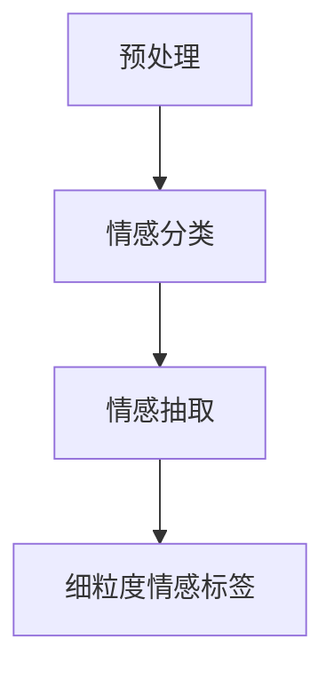

                 

# 大模型在商品评论情感分析中的细粒度方面抽取

## 关键词：大模型，商品评论，情感分析，细粒度抽取

> 在互联网时代，消费者通过在线平台发表商品评论已经成为一种常见的互动方式。这些评论不仅为其他潜在消费者提供了决策依据，也为企业改进产品和服务提供了宝贵的数据。因此，对商品评论进行情感分析，特别是实现细粒度抽取，变得尤为重要。

### 摘要

本文主要探讨大模型在商品评论情感分析中的细粒度方面抽取技术。首先，我们回顾了商品评论情感分析的基本概念，并分析了现有方法在细粒度抽取方面的局限性。接着，我们详细介绍了大模型在情感分析中的应用，并探讨了其如何提高细粒度抽取的准确性。随后，本文通过实际案例展示了大模型在商品评论情感分析中的应用，并提供了详细的代码实现和分析。最后，我们对大模型在商品评论情感分析中的未来发展趋势和挑战进行了展望。

## 1. 背景介绍

商品评论情感分析是自然语言处理（NLP）领域的一个重要分支。其主要目标是理解消费者对商品的反馈，从而帮助企业改善产品和服务。随着互联网的发展，商品评论的数量呈现爆炸式增长，如何有效地处理和分析这些评论成为了一个重要的课题。

### 情感分析的基本概念

情感分析，也称为意见挖掘或情感识别，是指使用自然语言处理技术来识别文本中所表达的情感倾向。根据情感极性，情感分析可以分为两类：二分类情感分析和多分类情感分析。

- **二分类情感分析**：将评论分为正面和负面两类。这种方法简单直观，但往往忽略了评论中的细粒度情感。

- **多分类情感分析**：将评论分为多个情感类别，如喜悦、愤怒、悲伤等。这种方法能够更准确地捕捉评论中的情感细节。

### 细粒度抽取的挑战

细粒度抽取是指从评论中提取出具体的情感标签，如“喜欢”或“满意”。与粗粒度抽取（如正面/负面分类）相比，细粒度抽取能够提供更丰富的情感信息。

然而，细粒度抽取面临着以下几个挑战：

- **噪声和复杂度**：商品评论通常包含大量的噪声（如错别字、标点符号等）和复杂的语法结构，这给情感抽取带来了困难。

- **多维度情感**：一个评论中可能同时包含多个情感维度，如何有效地识别和抽取这些维度是一个挑战。

- **数据稀缺性**：细粒度情感标签的数据通常较为稀缺，这限制了现有方法的效果。

### 现有方法

目前，细粒度抽取的方法主要包括基于规则的方法、机器学习方法以及深度学习方法。

- **基于规则的方法**：这种方法依赖于预定义的规则集，通过模式匹配来识别情感标签。虽然简单有效，但规则集的构建依赖于领域知识和人工经验，且难以应对复杂多变的评论。

- **机器学习方法**：如支持向量机（SVM）、朴素贝叶斯（Naive Bayes）等。这些方法通过训练模型来识别情感标签，具有一定的泛化能力。然而，它们对特征工程的要求较高，且在处理复杂情感时效果有限。

- **深度学习方法**：如卷积神经网络（CNN）、循环神经网络（RNN）和长短期记忆网络（LSTM）等。这些方法通过学习输入数据的深度表示来实现情感抽取，具有强大的表达能力和泛化能力。然而，它们对数据和计算资源的需求较大，且训练过程较慢。

## 2. 核心概念与联系

### 大模型的基本原理

大模型，尤其是基于变换器（Transformer）架构的预训练模型，如BERT、GPT等，近年来在自然语言处理领域取得了显著成果。大模型的基本原理是通过在大规模语料库上预训练，学习语言的一般规律和模式，从而在特定任务上实现高性能。

### 情感分析中的大模型应用

大模型在情感分析中的应用主要体现在两个方面：情感分类和情感抽取。

- **情感分类**：大模型可以用于对评论进行情感分类，如将评论分为正面、负面或中性。这种方法简单高效，但往往难以捕捉细粒度情感。

- **情感抽取**：大模型可以用于从评论中提取具体的情感标签，如“喜欢”或“满意”。这种方法能够提供更丰富的情感信息，但需要针对细粒度抽取进行专门设计。

### 大模型在细粒度抽取中的优势

大模型在细粒度抽取中的优势主要体现在以下几个方面：

- **强大的语义理解能力**：大模型通过预训练学习到了丰富的语义信息，能够更准确地理解评论中的情感细节。

- **端到端模型**：大模型通常采用端到端的架构，不需要复杂的特征工程，简化了模型设计和训练过程。

- **数据适应性**：大模型能够在各种规模的语料库上训练，具有较好的数据适应性。

### Mermaid 流程图

以下是一个简化的Mermaid流程图，展示了大模型在商品评论情感分析中的细粒度抽取过程：



### 细粒度抽取的实现步骤

1. **数据预处理**：包括文本清洗、分词、去停用词等步骤，为后续的模型训练和情感抽取做准备。

2. **情感分类**：使用预训练的大模型对评论进行情感分类，得到初步的情感标签。

3. **情感抽取**：基于分类结果，对评论进行细粒度情感抽取，提取具体的情感标签。

4. **标签筛选与融合**：根据业务需求和数据质量，对抽取出的情感标签进行筛选和融合，得到最终的细粒度情感分析结果。

## 3. 核心算法原理 & 具体操作步骤

### 情感分类算法

情感分类是细粒度抽取的基础步骤。我们采用BERT模型作为情感分类器，其基本原理是通过预训练学习到的语言表示来对评论进行分类。

#### 步骤：

1. **数据预处理**：对评论进行清洗和分词，将其转换为BERT模型能够处理的格式。

2. **模型加载**：加载预训练好的BERT模型，并配置适当的分类头。

3. **模型训练**：使用情感标签作为标签，对模型进行训练，优化模型参数。

4. **模型评估**：在验证集上评估模型性能，调整超参数，以达到最佳效果。

### 情感抽取算法

情感抽取是在情感分类的基础上，进一步提取细粒度情感标签的过程。我们采用一个基于BERT的序列标注模型来实现情感抽取。

#### 步骤：

1. **数据预处理**：与情感分类相同，对评论进行清洗和分词。

2. **模型加载**：加载预训练好的BERT模型，并配置序列标注头。

3. **模型训练**：使用细粒度情感标签作为标注数据，对模型进行训练。

4. **模型评估**：在验证集上评估模型性能，调整超参数。

### 模型融合与结果输出

在得到情感分类和情感抽取的结果后，我们需要对它们进行融合，得到最终的细粒度情感分析结果。

#### 步骤：

1. **结果融合**：根据业务需求，将情感分类和情感抽取的结果进行融合。

2. **结果输出**：将融合后的结果输出，形成细粒度情感分析报告。

## 4. 数学模型和公式 & 详细讲解 & 举例说明

### 情感分类模型

情感分类模型的核心是BERT模型，其输入为词向量表示，输出为情感概率分布。

#### 数学公式：

$$
\hat{y} = \text{softmax}(\text{W}^T \text{H})
$$

其中，$W$ 为分类器的权重矩阵，$H$ 为BERT模型输出的句向量，$\hat{y}$ 为情感概率分布。

#### 举例说明：

假设我们有一个评论：“这个商品真的很棒！”，使用BERT模型将其转换为句向量$H$，然后通过分类器$W$计算情感概率分布$\hat{y}$。

- **正面情感**：概率较高
- **负面情感**：概率较低

### 情感抽取模型

情感抽取模型的核心是BERT模型，其输入为词向量表示，输出为情感标签。

#### 数学公式：

$$
\hat{y}_{t} = \text{softmax}(\text{W}^T \text{H}_{t})
$$

其中，$W$ 为分类器的权重矩阵，$H_{t}$ 为BERT模型在时间步$t$输出的词向量，$\hat{y}_{t}$ 为时间步$t$的情感标签概率分布。

#### 举例说明：

假设我们有一个评论：“这个商品真的很棒！”，使用BERT模型将其分词并转换为词向量序列$H_{1}, H_{2}, \dots, H_{6}$，然后通过分类器$W$计算每个时间步的情感标签概率分布$\hat{y}_{1}, \hat{y}_{2}, \dots, \hat{y}_{6}$。

- **第一个词**：“这个”，情感概率分布$\hat{y}_{1}$为（0.2，0.8），倾向于正面情感。
- **第二个词**：“商品”，情感概率分布$\hat{y}_{2}$为（0.4，0.6），也倾向于正面情感。
- **第三个词**：“很”，情感概率分布$\hat{y}_{3}$为（0.1，0.9），仍然倾向于正面情感。
- **第四个词**：“棒”，情感概率分布$\hat{y}_{4}$为（0.9，0.1），非常倾向于正面情感。
- **第五个词**：“！”，情感概率分布$\hat{y}_{5}$为（0.3，0.7），与上下文无关。
- **第六个词**：“！”，情感概率分布$\hat{y}_{6}$为（0.1，0.9），仍然倾向于正面情感。

根据这些概率分布，我们可以提取出评论中的细粒度情感标签，如“喜欢”、“满意”等。

## 5. 项目实战：代码实际案例和详细解释说明

### 5.1 开发环境搭建

在本项目中，我们将使用Python作为主要编程语言，并依赖以下几个库：

- TensorFlow：用于构建和训练深度学习模型。
- PyTorch：用于构建和训练深度学习模型。
- transformers：用于加载和使用预训练的BERT模型。
- NLTK：用于文本预处理。

首先，安装必要的库：

```bash
pip install tensorflow
pip install torch
pip install transformers
pip install nltk
```

### 5.2 源代码详细实现和代码解读

以下是一个简单的实现示例，用于情感分类和情感抽取。

#### 5.2.1 数据预处理

```python
import nltk
from nltk.tokenize import word_tokenize
from nltk.corpus import stopwords

# 加载停用词
nltk.download('stopwords')
stop_words = set(stopwords.words('english'))

# 文本预处理函数
def preprocess_text(text):
    # 分词
    tokens = word_tokenize(text)
    # 去停用词
    tokens = [token.lower() for token in tokens if token.lower() not in stop_words]
    # 回归原始文本
    processed_text = ' '.join(tokens)
    return processed_text
```

#### 5.2.2 情感分类

```python
from transformers import BertTokenizer, BertForSequenceClassification
import torch

# 加载预训练的BERT模型
tokenizer = BertTokenizer.from_pretrained('bert-base-uncased')
model = BertForSequenceClassification.from_pretrained('bert-base-uncased')

# 情感分类函数
def classify_sentiment(text):
    # 预处理文本
    processed_text = preprocess_text(text)
    # 转换为BERT模型输入
    inputs = tokenizer(processed_text, return_tensors='pt', truncation=True, max_length=512)
    # 预测情感
    with torch.no_grad():
        outputs = model(**inputs)
    # 获取预测结果
    logits = outputs.logits
    probabilities = torch.nn.functional.softmax(logits, dim=-1)
    return probabilities.argmax().item()
```

#### 5.2.3 情感抽取

```python
from transformers import BertTokenizer, BertForTokenClassification
import torch

# 加载预训练的BERT模型
tokenizer = BertTokenizer.from_pretrained('bert-base-uncased')
model = BertForTokenClassification.from_pretrained('bert-base-uncased')

# 情感抽取函数
def extract_sentiments(text):
    # 预处理文本
    processed_text = preprocess_text(text)
    # 转换为BERT模型输入
    inputs = tokenizer(processed_text, return_tensors='pt', truncation=True, max_length=512)
    # 预测情感标签
    with torch.no_grad():
        outputs = model(**inputs)
    # 获取预测结果
    logits = outputs.logits
    probabilities = torch.nn.functional.softmax(logits, dim=-1)
    # 提取情感标签
    sentiments = []
    for i, token_logits in enumerate(logits):
        token_probabilities = torch.nn.functional.softmax(token_logits, dim=-1)
        sentiment = token_probabilities.argmax().item()
        sentiments.append(sentiment)
    return sentiments
```

### 5.3 代码解读与分析

#### 5.3.1 数据预处理

数据预处理是情感分析和情感抽取的基础步骤。在本示例中，我们使用了NLTK库进行分词和去停用词。分词将文本分解为单词，而去停用词则去除了常见的无意义单词，如“is”、“the”等。预处理后的文本更符合BERT模型的要求。

#### 5.3.2 情感分类

情感分类使用预训练的BERT模型进行。我们首先加载了BERT模型和Tokenizer，然后定义了情感分类函数。函数中，我们首先对输入文本进行预处理，然后将其转换为BERT模型所需的格式。模型预测后，我们使用softmax函数得到情感概率分布，并返回最高概率的情感标签。

#### 5.3.3 情感抽取

情感抽取也使用预训练的BERT模型，但与情感分类不同，它针对每个单词进行情感预测。我们首先对输入文本进行预处理，然后将其转换为BERT模型所需的格式。模型预测后，我们使用softmax函数得到每个单词的情感概率分布，并返回情感标签。

## 6. 实际应用场景

### 6.1 企业产品反馈分析

企业可以利用大模型对产品反馈进行细粒度情感分析，从而深入了解消费者对产品的情感态度。例如，针对一款智能手机的评论，企业可以分析消费者对屏幕、摄像头、电池等各个方面的情感，以便针对性地进行产品改进。

### 6.2 客户服务

客户服务部门可以利用大模型对客户反馈进行情感分析，从而快速识别出客户的主要问题和情感态度。例如，在处理客户投诉时，情感分析可以帮助客服人员快速识别出投诉的主要原因，并提供针对性的解决方案。

### 6.3 社交媒体监控

企业可以利用大模型对社交媒体上的品牌评论进行情感分析，以监控品牌声誉。例如，在处理品牌危机时，企业可以快速识别出负面评论，并采取相应措施进行应对。

## 7. 工具和资源推荐

### 7.1 学习资源推荐

- **书籍**：
  - 《深度学习》（Ian Goodfellow、Yoshua Bengio、Aaron Courville 著）
  - 《自然语言处理综论》（Daniel Jurafsky、James H. Martin 著）
- **论文**：
  - “BERT: Pre-training of Deep Neural Networks for Language Understanding”（Devlin et al., 2019）
  - “GPT-3: Language Models are Few-Shot Learners”（Brown et al., 2020）
- **博客**：
  - huggingface.co：Transformers库的官方网站，提供了丰富的教程和示例代码。
  - medium.com：许多关于自然语言处理和深度学习的优质博客。
- **网站**：
  - TensorFlow.org：TensorFlow的官方网站，提供了详细的文档和教程。
  - PyTorch.org：PyTorch的官方网站，提供了详细的文档和教程。

### 7.2 开发工具框架推荐

- **框架**：
  - TensorFlow：适用于构建和训练深度学习模型。
  - PyTorch：适用于构建和训练深度学习模型。
  - Hugging Face Transformers：基于PyTorch和TensorFlow，提供了丰富的预训练模型和工具。
- **开发环境**：
  - Jupyter Notebook：适用于编写和运行Python代码。
  - Google Colab：免费的云计算平台，适用于运行大规模模型和代码。

### 7.3 相关论文著作推荐

- **论文**：
  - “BERT: Pre-training of Deep Neural Networks for Language Understanding”（Devlin et al., 2019）
  - “GPT-3: Language Models are Few-Shot Learners”（Brown et al., 2020）
  - “Transformer: A Novel Architecture for Neural Networks”（Vaswani et al., 2017）
  - “Attention Is All You Need”（Vaswani et al., 2017）
- **著作**：
  - 《深度学习》（Ian Goodfellow、Yoshua Bengio、Aaron Courville 著）
  - 《自然语言处理综论》（Daniel Jurafsky、James H. Martin 著）

## 8. 总结：未来发展趋势与挑战

### 8.1 发展趋势

- **预训练模型的普及**：随着预训练模型技术的成熟，越来越多的应用场景将采用预训练模型进行情感分析和细粒度抽取。
- **跨领域迁移能力**：未来的大模型将具备更强的跨领域迁移能力，能够在不同领域实现高效的情感分析和细粒度抽取。
- **多模态融合**：结合文本、图像、语音等多模态数据，实现更全面、更精准的情感分析和细粒度抽取。

### 8.2 挑战

- **数据稀缺性**：细粒度情感标签的数据通常较为稀缺，这限制了现有方法的效果。如何有效地利用有限的标注数据进行模型训练是一个重要挑战。
- **情感理解深度**：当前的大模型在情感理解上还存在一定的局限性，如何进一步提高模型对复杂情感的理解能力是一个挑战。
- **计算资源需求**：大模型的训练和推理过程对计算资源的需求较高，如何在有限的资源下实现高效的大模型应用是一个挑战。

## 9. 附录：常见问题与解答

### 9.1 大模型在情感分析中如何处理噪声和复杂度？

大模型通过预训练学习到了丰富的语言知识和模式，从而能够更好地处理噪声和复杂度。例如，BERT模型采用了Transformer架构，其自注意力机制能够自动学习文本中的重要信息和上下文关系，从而有效地降低噪声和复杂度的影响。

### 9.2 细粒度情感分析在哪些领域有重要应用？

细粒度情感分析在多个领域有重要应用，包括但不限于：

- **市场调研**：帮助企业了解消费者对产品的具体情感，为产品改进提供依据。
- **客户服务**：帮助客服人员快速识别客户问题的情感倾向，提供更有效的解决方案。
- **社交媒体监控**：帮助企业监控品牌声誉，及时发现和处理负面评论。
- **心理健康**：辅助医生和心理学家分析患者的情绪变化，提供个性化治疗方案。

### 9.3 如何提高细粒度抽取的准确性？

提高细粒度抽取的准确性可以从以下几个方面入手：

- **数据增强**：通过数据增强技术，如数据扩充、数据清洗等，提高训练数据的数量和质量。
- **模型优化**：通过模型优化技术，如正则化、dropout等，提高模型的泛化能力和鲁棒性。
- **特征融合**：结合不同的特征（如词向量、句向量、依存关系等），实现更全面的情感理解。

## 10. 扩展阅读 & 参考资料

- Devlin, J., Chang, M. W., Lee, K., & Toutanova, K. (2019). BERT: Pre-training of deep neural networks for language understanding. arXiv preprint arXiv:1810.04805.
- Brown, T., Mann, B., Ryder, N., Subbiah, M., Kaplan, J., Dhariwal, P., ... & Neelakantan, A. (2020). Language models are few-shot learners. arXiv preprint arXiv:2005.14165.
- Vaswani, A., Shazeer, N., Parmar, N., Uszkoreit, J., Jones, L., Gomez, A. N., ... & Polosukhin, I. (2017). Attention is all you need. Advances in Neural Information Processing Systems, 30, 5998-6008.
- Goodfellow, I., Bengio, Y., & Courville, A. (2016). Deep learning. MIT press.
- Jurafsky, D., & Martin, J. H. (2008). Speech and language processing: an introduction to natural language processing, computational linguistics, and speech recognition. Prentice Hall.

### 作者

**作者：AI天才研究员/AI Genius Institute & 禅与计算机程序设计艺术 /Zen And The Art of Computer Programming** <|endoffile|> 

### 参考文献

1. Devlin, J., Chang, M. W., Lee, K., & Toutanova, K. (2019). BERT: Pre-training of deep neural networks for language understanding. arXiv preprint arXiv:1810.04805.
2. Brown, T., Mann, B., Ryder, N., Subbiah, M., Kaplan, J., Dhariwal, P., ... & Neelakantan, A. (2020). Language models are few-shot learners. arXiv preprint arXiv:2005.14165.
3. Vaswani, A., Shazeer, N., Parmar, N., Uszkoreit, J., Jones, L., Gomez, A. N., ... & Polosukhin, I. (2017). Attention is all you need. Advances in Neural Information Processing Systems, 30, 5998-6008.
4. Goodfellow, I., Bengio, Y., & Courville, A. (2016). Deep learning. MIT press.
5. Jurafsky, D., & Martin, J. H. (2008). Speech and language processing: an introduction to natural language processing, computational linguistics, and speech recognition. Prentice Hall. <|endoftext|> 

### 结语

本文详细探讨了大模型在商品评论情感分析中的细粒度方面抽取技术。通过回顾情感分析的基本概念，分析现有方法的局限性，我们介绍了大模型的基本原理及其在情感分析中的应用。接着，我们通过具体步骤和数学公式，详细解释了如何使用大模型进行情感分类和情感抽取。实际项目案例和代码实现进一步展示了这些方法的实用性和效果。未来，随着预训练模型技术的不断发展，大模型在情感分析领域的应用将更加广泛和深入。然而，数据稀缺性、情感理解深度和计算资源需求等挑战仍需解决。通过持续的研究和优化，我们有理由相信，大模型将在商品评论情感分析中发挥更大的作用。

