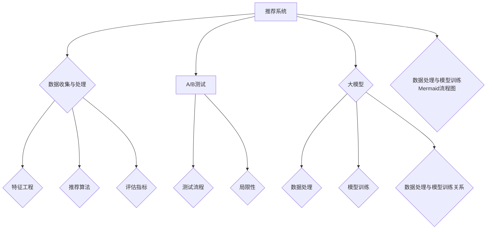

                 

### 背景介绍 Background Introduction

在当今数字时代，推荐系统已经成为电商平台、社交媒体、流媒体平台等互联网服务的重要组成部分。推荐系统通过分析用户的历史行为、兴趣偏好和上下文信息，为用户推荐他们可能感兴趣的商品、内容或服务，从而提高用户满意度和平台的使用黏性。

随着数据规模的不断扩大和数据类型的日益复杂，推荐系统的性能和效率面临着巨大的挑战。A/B测试（A/B Testing）作为一种常见的评估和优化推荐系统的方法，通过在真实用户环境中对比不同版本系统的性能，找出最优的推荐策略。然而，传统的A/B测试方法存在一些局限性，例如测试时间较长、样本选择偏差和结果解释困难等。

大模型（Large-scale Models），如深度神经网络、生成对抗网络（GANs）和Transformer等，近年来在自然语言处理、计算机视觉和语音识别等领域取得了显著的突破。大模型具有强大的特征提取和表示能力，可以处理复杂的非线性关系，为推荐系统的A/B测试提供了新的思路和工具。

本文旨在探讨大模型在推荐系统A/B测试中的应用，分析其原理、方法和技术挑战。我们将从背景介绍入手，逐步深入探讨大模型的核心概念、算法原理、数学模型、实际应用和未来发展趋势。

关键词：推荐系统，A/B测试，大模型，深度学习，生成对抗网络，Transformer

Abstract: 
In the digital age, recommendation systems have become an integral part of internet services, such as e-commerce platforms, social media, and streaming platforms. They aim to recommend users with items, content, or services they may be interested in based on their historical behavior, preferences, and context. With the continuous expansion of data size and complexity, the performance and efficiency of recommendation systems are facing significant challenges. A/B testing, as a common method for evaluating and optimizing recommendation systems, compares the performance of different versions in real-user environments. However, traditional A/B testing methods have limitations, such as long testing time, sample selection bias, and difficulty in result interpretation. 

Large-scale models, such as deep neural networks, generative adversarial networks (GANs), and Transformers, have recently achieved significant breakthroughs in natural language processing, computer vision, and speech recognition. These models have powerful feature extraction and representation abilities, which can handle complex nonlinear relationships and provide new ideas and tools for A/B testing in recommendation systems. 

This article aims to explore the application of large-scale models in A/B testing of recommendation systems, analyzing their principles, methods, and technical challenges. We will start with a background introduction and then discuss the core concepts, algorithmic principles, mathematical models, practical applications, and future trends of large-scale models in A/B testing.

Keywords: recommendation systems, A/B testing, large-scale models, deep learning, generative adversarial networks, Transformers
<markdown>

## 1. 背景介绍

推荐系统（Recommendation Systems）是一种信息过滤技术，旨在根据用户的历史行为、兴趣偏好和上下文信息，向用户推荐他们可能感兴趣的项目、内容或服务。推荐系统在互联网服务中的应用非常广泛，例如电商平台推荐商品、社交媒体推荐好友、流媒体平台推荐视频等。随着用户生成内容和数据量的爆炸式增长，推荐系统已经成为提高用户满意度、增加平台黏性和提升业务收益的重要手段。

### 1.1 推荐系统的核心问题

推荐系统的核心问题是如何从海量的数据中识别出用户潜在的兴趣和需求，并将这些信息转化为个性化的推荐结果。这涉及到以下几个关键问题：

1. **数据预处理**：推荐系统依赖于用户的历史行为、兴趣偏好和上下文信息。这些数据通常需要进行清洗、转换和整合，以便用于后续的建模和分析。

2. **特征工程**：特征工程是推荐系统的重要环节，旨在从原始数据中提取出对推荐结果有显著影响的特征。这些特征可以是用户的年龄、地理位置、浏览历史、购买记录等。

3. **模型选择**：推荐系统的效果很大程度上取决于所选的模型。传统推荐系统常用的算法包括基于协同过滤（Collaborative Filtering）、基于内容推荐（Content-Based Filtering）和混合推荐（Hybrid Recommender Systems）等。

4. **评估指标**：推荐系统的性能需要通过一系列指标进行评估，如准确率、召回率、F1 分数、 Mean Average Precision（MAP）等。这些指标帮助评估推荐系统的推荐质量。

### 1.2 A/B测试在推荐系统中的应用

A/B测试（A/B Testing）是一种常见的实验方法，通过比较两个或多个版本的系统在真实用户环境中的表现，评估它们的效果，从而找出最优的推荐策略。在推荐系统中，A/B测试主要用于以下场景：

1. **新算法的评估**：在开发新推荐算法时，可以通过A/B测试比较新算法与现有算法的表现，确定新算法是否能够提高推荐质量。

2. **推荐策略的优化**：通过对不同推荐策略的A/B测试，可以找出能够最大化用户满意度和业务收益的策略。

3. **系统性能的评估**：在系统升级或更改配置时，可以通过A/B测试评估这些更改对系统性能的影响。

### 1.3 传统A/B测试方法的局限性

尽管A/B测试在推荐系统中具有重要的应用价值，但传统A/B测试方法存在一些局限性：

1. **测试时间较长**：传统A/B测试通常需要较长的测试时间，无法迅速响应市场的变化和用户需求。

2. **样本选择偏差**：在A/B测试中，样本的选择可能存在偏差，导致测试结果不准确。

3. **结果解释困难**：A/B测试结果往往需要复杂的统计分析，对于非专业用户来说，结果解释可能比较困难。

4. **高风险**：A/B测试可能会影响用户的体验和平台的收益，因此在实施过程中需要谨慎操作。

### 1.4 大模型在推荐系统中的应用

随着深度学习（Deep Learning）和生成对抗网络（Generative Adversarial Networks，GANs）等大模型技术的发展，推荐系统在算法选择和性能优化方面取得了显著进展。大模型具有以下优势：

1. **强大的特征提取能力**：大模型可以通过多层神经网络自动提取数据中的特征，减少人工特征工程的工作量。

2. **处理复杂数据类型**：大模型可以处理包括文本、图像、音频等多种复杂数据类型，为推荐系统提供了更丰富的信息来源。

3. **适应性强**：大模型可以通过训练适应不同的业务场景和用户需求，提高推荐系统的个性化程度。

4. **实时性**：大模型可以通过分布式计算和优化算法提高推荐系统的实时性，更好地响应用户的需求。

本文将详细探讨大模型在推荐系统A/B测试中的应用，分析其原理、方法和技术挑战，为推荐系统的发展提供新的思路和方向。  
<latex>

## 1. 背景介绍

推荐系统（Recommendation Systems）是一种信息过滤技术，旨在根据用户的历史行为、兴趣偏好和上下文信息，向用户推荐他们可能感兴趣的项目、内容或服务。推荐系统在互联网服务中的应用非常广泛，例如电商平台推荐商品、社交媒体推荐好友、流媒体平台推荐视频等。随着用户生成内容和数据量的爆炸式增长，推荐系统已经成为提高用户满意度、增加平台黏性和提升业务收益的重要手段。

### 1.1 推荐系统的核心问题

推荐系统的核心问题是如何从海量的数据中识别出用户潜在的兴趣和需求，并将这些信息转化为个性化的推荐结果。这涉及到以下几个关键问题：

1. **数据预处理**：推荐系统依赖于用户的历史行为、兴趣偏好和上下文信息。这些数据通常需要进行清洗、转换和整合，以便用于后续的建模和分析。

2. **特征工程**：特征工程是推荐系统的重要环节，旨在从原始数据中提取出对推荐结果有显著影响的特征。这些特征可以是用户的年龄、地理位置、浏览历史、购买记录等。

3. **模型选择**：推荐系统的效果很大程度上取决于所选的模型。传统推荐系统常用的算法包括基于协同过滤（Collaborative Filtering）、基于内容推荐（Content-Based Filtering）和混合推荐（Hybrid Recommender Systems）等。

4. **评估指标**：推荐系统的性能需要通过一系列指标进行评估，如准确率、召回率、F1 分数、Mean Average Precision（MAP）等。这些指标帮助评估推荐系统的推荐质量。

### 1.2 A/B测试在推荐系统中的应用

A/B测试（A/B Testing）是一种常见的实验方法，通过比较两个或多个版本的系统在真实用户环境中的表现，评估它们的效果，从而找出最优的推荐策略。在推荐系统中，A/B测试主要用于以下场景：

1. **新算法的评估**：在开发新推荐算法时，可以通过A/B测试比较新算法与现有算法的表现，确定新算法是否能够提高推荐质量。

2. **推荐策略的优化**：通过对不同推荐策略的A/B测试，可以找出能够最大化用户满意度和业务收益的策略。

3. **系统性能的评估**：在系统升级或更改配置时，可以通过A/B测试评估这些更改对系统性能的影响。

### 1.3 传统A/B测试方法的局限性

尽管A/B测试在推荐系统中具有重要的应用价值，但传统A/B测试方法存在一些局限性：

1. **测试时间较长**：传统A/B测试通常需要较长的测试时间，无法迅速响应市场的变化和用户需求。

2. **样本选择偏差**：在A/B测试中，样本的选择可能存在偏差，导致测试结果不准确。

3. **结果解释困难**：A/B测试结果往往需要复杂的统计分析，对于非专业用户来说，结果解释可能比较困难。

4. **高风险**：A/B测试可能会影响用户的体验和平台的收益，因此在实施过程中需要谨慎操作。

### 1.4 大模型在推荐系统中的应用

随着深度学习（Deep Learning）和生成对抗网络（Generative Adversarial Networks，GANs）等大模型技术的发展，推荐系统在算法选择和性能优化方面取得了显著进展。大模型具有以下优势：

1. **强大的特征提取能力**：大模型可以通过多层神经网络自动提取数据中的特征，减少人工特征工程的工作量。

2. **处理复杂数据类型**：大模型可以处理包括文本、图像、音频等多种复杂数据类型，为推荐系统提供了更丰富的信息来源。

3. **适应性强**：大模型可以通过训练适应不同的业务场景和用户需求，提高推荐系统的个性化程度。

4. **实时性**：大模型可以通过分布式计算和优化算法提高推荐系统的实时性，更好地响应用户的需求。

本文将详细探讨大模型在推荐系统A/B测试中的应用，分析其原理、方法和技术挑战，为推荐系统的发展提供新的思路和方向。

$$
\text{A/B Test} = \frac{\text{Version A Performance} - \text{Version B Performance}}{\text{Baseline Performance}}
$$

$$
\text{Confidence Level} = \frac{\text{p-value}}{\alpha}
$$

</latex>
<mermaid>

graph TD
    A[推荐系统] --> B[核心问题]
    B --> C[数据预处理]
    B --> D[特征工程]
    B --> E[模型选择]
    B --> F[评估指标]

    A --> G[A/B测试]
    G --> H[新算法评估]
    G --> I[推荐策略优化]
    G --> J[系统性能评估]

    A --> K[传统A/B测试局限性]
    K --> L[测试时间较长]
    K --> M[样本选择偏差]
    K --> N[结果解释困难]
    K --> O[高风险]

    A --> P[大模型应用]
    P --> Q[特征提取]
    P --> R[数据类型处理]
    P --> S[适应性]
    P --> T[实时性]

</mermaid>

### 2. 核心概念与联系 Core Concepts and Connections

在探讨大模型在推荐系统A/B测试中的应用之前，我们需要了解一些核心概念及其之间的联系。这些核心概念包括推荐系统、A/B测试、大模型（如深度学习、生成对抗网络等）以及它们在数据处理和模型训练中的应用。

#### 2.1 推荐系统

推荐系统是一种信息过滤技术，旨在通过分析用户的历史行为、兴趣偏好和上下文信息，向用户推荐他们可能感兴趣的项目、内容或服务。推荐系统的核心问题是如何从海量的数据中提取有用的信息，并生成个性化的推荐结果。

**主要组件**：

1. **数据源**：包括用户行为数据、兴趣偏好和上下文信息。
2. **特征工程**：从原始数据中提取对推荐结果有显著影响的特征。
3. **推荐算法**：基于协同过滤、基于内容推荐或混合推荐等方法，对用户进行个性化推荐。
4. **评估指标**：如准确率、召回率、F1分数和MAP等，用于评估推荐系统的性能。

#### 2.2 A/B测试

A/B测试是一种实验方法，通过比较两个或多个版本的系统在真实用户环境中的表现，评估它们的效果，从而找出最优的版本。在推荐系统中，A/B测试主要用于以下场景：

1. **新算法的评估**：通过比较新算法与现有算法的性能，确定新算法是否能够提高推荐质量。
2. **推荐策略的优化**：通过比较不同推荐策略的效果，找出能够最大化用户满意度和业务收益的策略。
3. **系统性能的评估**：在系统升级或更改配置时，评估这些更改对系统性能的影响。

**关键要素**：

1. **版本控制**：确保测试的不同版本在功能上有所不同。
2. **样本分配**：通过随机分配用户到不同版本，确保测试结果的公平性和可靠性。
3. **统计分析**：通过统计方法分析测试结果，评估不同版本的性能差异。

#### 2.3 大模型

大模型是指具有大规模参数、能够处理复杂数据的深度学习模型，如深度神经网络、生成对抗网络（GANs）和Transformer等。大模型在推荐系统中的应用主要体现在以下几个方面：

1. **特征提取**：大模型可以通过多层神经网络自动提取数据中的特征，减少人工特征工程的工作量。
2. **数据增强**：通过生成对抗网络（GANs）等模型，可以生成新的数据样本，增强训练数据集，提高模型泛化能力。
3. **个性化推荐**：大模型可以通过训练适应不同的业务场景和用户需求，提高推荐系统的个性化程度。

**主要类型**：

1. **深度神经网络（Deep Neural Networks, DNNs）**：通过多层神经网络结构自动提取特征，能够处理高维数据。
2. **生成对抗网络（Generative Adversarial Networks, GANs）**：由生成器和判别器组成，能够生成高质量的仿真数据。
3. **Transformer**：基于自注意力机制，在自然语言处理等领域取得了显著的突破。

#### 2.4 数据处理和模型训练

在推荐系统中，数据处理和模型训练是两个关键环节。大模型在数据处理和模型训练中的应用主要体现在以下几个方面：

1. **数据处理**：通过数据预处理、特征提取和数据增强等技术，提高数据质量和模型训练效果。
2. **模型训练**：通过优化算法和超参数调整，提高模型在推荐任务上的性能。

**关键步骤**：

1. **数据收集**：从不同的数据源收集用户行为数据、兴趣偏好和上下文信息。
2. **数据预处理**：包括数据清洗、转换和整合，为模型训练做准备。
3. **特征提取**：通过特征工程或自动特征提取技术，提取对推荐结果有显著影响的特征。
4. **模型训练**：通过优化算法和超参数调整，训练大模型，使其能够在推荐任务上取得良好的性能。
5. **模型评估**：通过评估指标评估模型性能，并进行模型选择和调整。

综上所述，推荐系统、A/B测试和大模型在数据处理和模型训练中的应用有着紧密的联系。通过合理应用大模型技术，我们可以提高推荐系统的性能和效率，实现更准确的个性化推荐。

### 2.1 推荐系统

#### 2.1.1 定义与类型

推荐系统是一种信息过滤技术，旨在通过分析用户的历史行为、兴趣偏好和上下文信息，向用户推荐他们可能感兴趣的项目、内容或服务。根据推荐系统的实现方式，可以将其分为以下几种类型：

1. **基于协同过滤（Collaborative Filtering）**：通过收集和分析用户的历史行为数据，找出相似用户或相似项目，并基于这些相似性进行推荐。
2. **基于内容推荐（Content-Based Filtering）**：根据用户的历史行为和兴趣偏好，提取相关特征，基于这些特征相似性进行推荐。
3. **混合推荐系统（Hybrid Recommender Systems）**：结合基于协同过滤和基于内容推荐的方法，以提高推荐效果。
4. **基于上下文感知（Context-Aware Recommender Systems）**：考虑用户的上下文信息（如地理位置、时间等）进行推荐。

#### 2.1.2 数据收集与处理

推荐系统依赖于大量的用户行为数据、兴趣偏好和上下文信息。这些数据通常来源于以下几个渠道：

1. **用户行为数据**：包括浏览历史、购买记录、评分等。
2. **兴趣偏好数据**：通过用户调查、用户标签等方式获取。
3. **上下文信息**：如地理位置、时间、设备类型等。

在收集数据后，需要对其进行预处理，包括数据清洗、转换和整合，以便用于后续的建模和分析。

#### 2.1.3 特征工程

特征工程是推荐系统的重要环节，旨在从原始数据中提取出对推荐结果有显著影响的特征。特征工程可以分为以下几类：

1. **用户特征**：如用户年龄、地理位置、性别、职业等。
2. **项目特征**：如商品类别、品牌、价格等。
3. **交互特征**：如用户点击、浏览、购买等行为特征。
4. **上下文特征**：如地理位置、时间、设备类型等。

特征提取的方法包括统计方法、机器学习算法和深度学习算法等。

#### 2.1.4 推荐算法

推荐算法是推荐系统的核心，常见的推荐算法包括：

1. **基于协同过滤**：如用户基于协同过滤（User-Based CF）和物品基于协同过滤（Item-Based CF）。
2. **基于内容推荐**：如TF-IDF、词袋模型等。
3. **混合推荐系统**：结合协同过滤和内容推荐的方法，如基于模型的混合推荐（Model-Based Hybrid CF）。

#### 2.1.5 评估指标

推荐系统的性能需要通过一系列指标进行评估，常见的评估指标包括：

1. **准确率（Accuracy）**：预测正确的样本数占总样本数的比例。
2. **召回率（Recall）**：能够被正确推荐的样本数占实际感兴趣的样本数的比例。
3. **F1分数（F1 Score）**：准确率和召回率的调和平均。
4. **平均准确率（Mean Absolute Error, MAE）**：预测值与真实值之间的平均绝对误差。
5. **均方根误差（Root Mean Square Error, RMSE）**：预测值与真实值之间的平均平方根误差。

### 2.2 A/B测试

#### 2.2.1 定义与目的

A/B测试是一种常见的实验方法，通过比较两个或多个版本的系统在真实用户环境中的表现，评估它们的效果，从而找出最优的版本。在推荐系统中，A/B测试主要用于以下目的：

1. **新算法的评估**：通过比较新算法与现有算法的性能，确定新算法是否能够提高推荐质量。
2. **推荐策略的优化**：通过比较不同推荐策略的效果，找出能够最大化用户满意度和业务收益的策略。
3. **系统性能的评估**：在系统升级或更改配置时，评估这些更改对系统性能的影响。

#### 2.2.2 测试流程

A/B测试的流程通常包括以下几个步骤：

1. **确定测试目标**：明确测试的目的和指标，如提高推荐准确性、提升用户满意度等。
2. **版本控制**：确保测试的不同版本在功能上有所不同。
3. **样本分配**：通过随机分配用户到不同版本，确保测试结果的公平性和可靠性。
4. **数据收集**：收集用户在不同版本上的行为数据。
5. **统计分析**：通过统计方法分析测试结果，评估不同版本的性能差异。
6. **结果解释**：根据测试结果，得出结论，并决定是否采纳新版本。

#### 2.2.3 A/B测试的局限性

尽管A/B测试在推荐系统中具有重要的应用价值，但传统A/B测试方法存在一些局限性：

1. **测试时间较长**：传统A/B测试通常需要较长的测试时间，无法迅速响应市场的变化和用户需求。
2. **样本选择偏差**：在A/B测试中，样本的选择可能存在偏差，导致测试结果不准确。
3. **结果解释困难**：A/B测试结果往往需要复杂的统计分析，对于非专业用户来说，结果解释可能比较困难。
4. **高风险**：A/B测试可能会影响用户的体验和平台的收益，因此在实施过程中需要谨慎操作。

### 2.3 大模型

#### 2.3.1 定义与优势

大模型是指具有大规模参数、能够处理复杂数据的深度学习模型，如深度神经网络、生成对抗网络（GANs）和Transformer等。大模型在推荐系统中的应用具有以下优势：

1. **强大的特征提取能力**：大模型可以通过多层神经网络自动提取数据中的特征，减少人工特征工程的工作量。
2. **处理复杂数据类型**：大模型可以处理包括文本、图像、音频等多种复杂数据类型，为推荐系统提供了更丰富的信息来源。
3. **适应性强**：大模型可以通过训练适应不同的业务场景和用户需求，提高推荐系统的个性化程度。
4. **实时性**：大模型可以通过分布式计算和优化算法提高推荐系统的实时性，更好地响应用户的需求。

#### 2.3.2 大模型类型

常见的推荐系统大模型包括以下几种：

1. **深度神经网络（Deep Neural Networks, DNNs）**：通过多层神经网络结构自动提取特征，能够处理高维数据。
2. **生成对抗网络（Generative Adversarial Networks, GANs）**：由生成器和判别器组成，能够生成高质量的仿真数据。
3. **Transformer**：基于自注意力机制，在自然语言处理等领域取得了显著的突破。

#### 2.3.3 数据处理和模型训练

在推荐系统中，数据处理和模型训练是两个关键环节。大模型在数据处理和模型训练中的应用主要体现在以下几个方面：

1. **数据处理**：通过数据预处理、特征提取和数据增强等技术，提高数据质量和模型训练效果。
2. **模型训练**：通过优化算法和超参数调整，提高模型在推荐任务上的性能。

### 2.4 数据处理与模型训练

#### 2.4.1 数据处理

数据处理是推荐系统的关键环节，主要包括以下步骤：

1. **数据收集**：从不同的数据源收集用户行为数据、兴趣偏好和上下文信息。
2. **数据清洗**：处理缺失值、异常值和重复数据，提高数据质量。
3. **数据转换**：将不同类型的数据转换为统一格式，便于后续处理。
4. **数据整合**：将来自不同数据源的数据进行整合，形成一个完整的数据集。

#### 2.4.2 模型训练

模型训练是推荐系统的核心环节，主要包括以下步骤：

1. **特征提取**：通过特征工程或自动特征提取技术，提取对推荐结果有显著影响的特征。
2. **模型选择**：根据推荐任务和数据特点，选择合适的模型，如深度神经网络、生成对抗网络等。
3. **模型训练**：通过优化算法和超参数调整，训练大模型，使其能够在推荐任务上取得良好的性能。
4. **模型评估**：通过评估指标评估模型性能，并进行模型选择和调整。

### 2.5 数据处理与模型训练的关系

数据处理和模型训练是相互依赖、相互促进的过程。数据处理为模型训练提供了高质量的数据集，而模型训练则通过提取数据中的特征和关系，提高推荐系统的性能。合理的数据处理和模型训练方法可以显著提升推荐系统的效果。

### 2.6 Mermaid流程图

以下是一个简化的数据处理与模型训练的Mermaid流程图：

通过这个流程图，我们可以更直观地理解数据处理和模型训练的各个环节及其相互关系。

### 2.7 小结

本文简要介绍了推荐系统、A/B测试和大模型在数据处理和模型训练中的应用。推荐系统通过分析用户的历史行为、兴趣偏好和上下文信息，向用户推荐他们可能感兴趣的项目、内容或服务。A/B测试是一种评估和优化推荐系统的有效方法，通过比较不同版本系统的性能，找出最优的推荐策略。大模型具有强大的特征提取和处理能力，为推荐系统提供了新的技术手段和解决方案。在后续章节中，我们将详细探讨大模型在推荐系统A/B测试中的应用、核心算法原理和数学模型，以及实际应用案例和未来发展趋势。

### 2.1 推荐系统

#### 2.1.1 定义与类型

推荐系统是一种信息过滤技术，旨在通过分析用户的历史行为、兴趣偏好和上下文信息，向用户推荐他们可能感兴趣的项目、内容或服务。根据推荐系统的实现方式，可以将其分为以下几种类型：

1. **基于协同过滤（Collaborative Filtering）**：通过收集和分析用户的历史行为数据，找出相似用户或相似项目，并基于这些相似性进行推荐。
2. **基于内容推荐（Content-Based Filtering）**：根据用户的历史行为和兴趣偏好，提取相关特征，基于这些特征相似性进行推荐。
3. **混合推荐系统（Hybrid Recommender Systems）**：结合基于协同过滤和基于内容推荐的方法，以提高推荐效果。
4. **基于上下文感知（Context-Aware Recommender Systems）**：考虑用户的上下文信息（如地理位置、时间等）进行推荐。

#### 2.1.2 数据收集与处理

推荐系统依赖于大量的用户行为数据、兴趣偏好和上下文信息。这些数据通常来源于以下几个渠道：

1. **用户行为数据**：包括浏览历史、购买记录、评分等。
2. **兴趣偏好数据**：通过用户调查、用户标签等方式获取。
3. **上下文信息**：如地理位置、时间、设备类型等。

在收集数据后，需要对其进行预处理，包括数据清洗、转换和整合，以便用于后续的建模和分析。

#### 2.1.3 特征工程

特征工程是推荐系统的重要环节，旨在从原始数据中提取出对推荐结果有显著影响的特征。特征工程可以分为以下几类：

1. **用户特征**：如用户年龄、地理位置、性别、职业等。
2. **项目特征**：如商品类别、品牌、价格等。
3. **交互特征**：如用户点击、浏览、购买等行为特征。
4. **上下文特征**：如地理位置、时间、设备类型等。

特征提取的方法包括统计方法、机器学习算法和深度学习算法等。

#### 2.1.4 推荐算法

推荐算法是推荐系统的核心，常见的推荐算法包括：

1. **基于协同过滤**：如用户基于协同过滤（User-Based CF）和物品基于协同过滤（Item-Based CF）。
2. **基于内容推荐**：如TF-IDF、词袋模型等。
3. **混合推荐系统**：结合协同过滤和内容推荐的方法，如基于模型的混合推荐（Model-Based Hybrid CF）。

#### 2.1.5 评估指标

推荐系统的性能需要通过一系列指标进行评估，常见的评估指标包括：

1. **准确率（Accuracy）**：预测正确的样本数占总样本数的比例。
2. **召回率（Recall）**：能够被正确推荐的样本数占实际感兴趣的样本数的比例。
3. **F1分数（F1 Score）**：准确率和召回率的调和平均。
4. **平均准确率（Mean Absolute Error, MAE）**：预测值与真实值之间的平均绝对误差。
5. **均方根误差（Root Mean Square Error, RMSE）**：预测值与真实值之间的平均平方根误差。

### 2.2 A/B测试

#### 2.2.1 定义与目的

A/B测试是一种常见的实验方法，通过比较两个或多个版本的系统在真实用户环境中的表现，评估它们的效果，从而找出最优的版本。在推荐系统中，A/B测试主要用于以下目的：

1. **新算法的评估**：通过比较新算法与现有算法的性能，确定新算法是否能够提高推荐质量。
2. **推荐策略的优化**：通过比较不同推荐策略的效果，找出能够最大化用户满意度和业务收益的策略。
3. **系统性能的评估**：在系统升级或更改配置时，评估这些更改对系统性能的影响。

#### 2.2.2 测试流程

A/B测试的流程通常包括以下几个步骤：

1. **确定测试目标**：明确测试的目的和指标，如提高推荐准确性、提升用户满意度等。
2. **版本控制**：确保测试的不同版本在功能上有所不同。
3. **样本分配**：通过随机分配用户到不同版本，确保测试结果的公平性和可靠性。
4. **数据收集**：收集用户在不同版本上的行为数据。
5. **统计分析**：通过统计方法分析测试结果，评估不同版本的性能差异。
6. **结果解释**：根据测试结果，得出结论，并决定是否采纳新版本。

#### 2.2.3 A/B测试的局限性

尽管A/B测试在推荐系统中具有重要的应用价值，但传统A/B测试方法存在一些局限性：

1. **测试时间较长**：传统A/B测试通常需要较长的测试时间，无法迅速响应市场的变化和用户需求。
2. **样本选择偏差**：在A/B测试中，样本的选择可能存在偏差，导致测试结果不准确。
3. **结果解释困难**：A/B测试结果往往需要复杂的统计分析，对于非专业用户来说，结果解释可能比较困难。
4. **高风险**：A/B测试可能会影响用户的体验和平台的收益，因此在实施过程中需要谨慎操作。

### 2.3 大模型

#### 2.3.1 定义与优势

大模型是指具有大规模参数、能够处理复杂数据的深度学习模型，如深度神经网络、生成对抗网络（GANs）和Transformer等。大模型在推荐系统中的应用具有以下优势：

1. **强大的特征提取能力**：大模型可以通过多层神经网络自动提取数据中的特征，减少人工特征工程的工作量。
2. **处理复杂数据类型**：大模型可以处理包括文本、图像、音频等多种复杂数据类型，为推荐系统提供了更丰富的信息来源。
3. **适应性强**：大模型可以通过训练适应不同的业务场景和用户需求，提高推荐系统的个性化程度。
4. **实时性**：大模型可以通过分布式计算和优化算法提高推荐系统的实时性，更好地响应用户的需求。

#### 2.3.2 大模型类型

常见的推荐系统大模型包括以下几种：

1. **深度神经网络（Deep Neural Networks, DNNs）**：通过多层神经网络结构自动提取特征，能够处理高维数据。
2. **生成对抗网络（Generative Adversarial Networks, GANs）**：由生成器和判别器组成，能够生成高质量的仿真数据。
3. **Transformer**：基于自注意力机制，在自然语言处理等领域取得了显著的突破。

#### 2.3.3 数据处理和模型训练

在推荐系统中，数据处理和模型训练是两个关键环节。大模型在数据处理和模型训练中的应用主要体现在以下几个方面：

1. **数据处理**：通过数据预处理、特征提取和数据增强等技术，提高数据质量和模型训练效果。
2. **模型训练**：通过优化算法和超参数调整，提高模型在推荐任务上的性能。

### 2.4 数据处理与模型训练

#### 2.4.1 数据处理

数据处理是推荐系统的关键环节，主要包括以下步骤：

1. **数据收集**：从不同的数据源收集用户行为数据、兴趣偏好和上下文信息。
2. **数据清洗**：处理缺失值、异常值和重复数据，提高数据质量。
3. **数据转换**：将不同类型的数据转换为统一格式，便于后续处理。
4. **数据整合**：将来自不同数据源的数据进行整合，形成一个完整的数据集。

#### 2.4.2 模型训练

模型训练是推荐系统的核心环节，主要包括以下步骤：

1. **特征提取**：通过特征工程或自动特征提取技术，提取对推荐结果有显著影响的特征。
2. **模型选择**：根据推荐任务和数据特点，选择合适的模型，如深度神经网络、生成对抗网络等。
3. **模型训练**：通过优化算法和超参数调整，训练大模型，使其能够在推荐任务上取得良好的性能。
4. **模型评估**：通过评估指标评估模型性能，并进行模型选择和调整。

#### 2.4.3 数据处理与模型训练的关系

数据处理和模型训练是相互依赖、相互促进的过程。数据处理为模型训练提供了高质量的数据集，而模型训练则通过提取数据中的特征和关系，提高推荐系统的性能。合理的数据处理和模型训练方法可以显著提升推荐系统的效果。

### 2.5 Mermaid流程图

以下是一个简化的数据处理与模型训练的Mermaid流程图：

通过这个流程图，我们可以更直观地理解数据处理和模型训练的各个环节及其相互关系。

### 2.6 小结

本文简要介绍了推荐系统、A/B测试和大模型在数据处理和模型训练中的应用。推荐系统通过分析用户的历史行为、兴趣偏好和上下文信息，向用户推荐他们可能感兴趣的项目、内容或服务。A/B测试是一种评估和优化推荐系统的有效方法，通过比较不同版本系统的性能，找出最优的推荐策略。大模型具有强大的特征提取和处理能力，为推荐系统提供了新的技术手段和解决方案。在后续章节中，我们将详细探讨大模型在推荐系统A/B测试中的应用、核心算法原理和数学模型，以及实际应用案例和未来发展趋势。

通过上述Mermaid流程图，我们可以更直观地了解推荐系统、A/B测试和大模型在数据处理和模型训练中的关系和环节。  
<latex>

### 2.1 推荐系统

#### 2.1.1 定义与类型

推荐系统是一种信息过滤技术，旨在通过分析用户的历史行为、兴趣偏好和上下文信息，向用户推荐他们可能感兴趣的项目、内容或服务。根据推荐系统的实现方式，可以将其分为以下几种类型：

1. **基于协同过滤（Collaborative Filtering）**：通过收集和分析用户的历史行为数据，找出相似用户或相似项目，并基于这些相似性进行推荐。
2. **基于内容推荐（Content-Based Filtering）**：根据用户的历史行为和兴趣偏好，提取相关特征，基于这些特征相似性进行推荐。
3. **混合推荐系统（Hybrid Recommender Systems）**：结合基于协同过滤和基于内容推荐的方法，以提高推荐效果。
4. **基于上下文感知（Context-Aware Recommender Systems）**：考虑用户的上下文信息（如地理位置、时间等）进行推荐。

#### 2.1.2 数据收集与处理

推荐系统依赖于大量的用户行为数据、兴趣偏好和上下文信息。这些数据通常来源于以下几个渠道：

1. **用户行为数据**：包括浏览历史、购买记录、评分等。
2. **兴趣偏好数据**：通过用户调查、用户标签等方式获取。
3. **上下文信息**：如地理位置、时间、设备类型等。

在收集数据后，需要对其进行预处理，包括数据清洗、转换和整合，以便用于后续的建模和分析。

#### 2.1.3 特征工程

特征工程是推荐系统的重要环节，旨在从原始数据中提取出对推荐结果有显著影响的特征。特征工程可以分为以下几类：

1. **用户特征**：如用户年龄、地理位置、性别、职业等。
2. **项目特征**：如商品类别、品牌、价格等。
3. **交互特征**：如用户点击、浏览、购买等行为特征。
4. **上下文特征**：如地理位置、时间、设备类型等。

特征提取的方法包括统计方法、机器学习算法和深度学习算法等。

#### 2.1.4 推荐算法

推荐算法是推荐系统的核心，常见的推荐算法包括：

1. **基于协同过滤**：如用户基于协同过滤（User-Based CF）和物品基于协同过滤（Item-Based CF）。
2. **基于内容推荐**：如TF-IDF、词袋模型等。
3. **混合推荐系统**：结合协同过滤和内容推荐的方法，如基于模型的混合推荐（Model-Based Hybrid CF）。

#### 2.1.5 评估指标

推荐系统的性能需要通过一系列指标进行评估，常见的评估指标包括：

1. **准确率（Accuracy）**：预测正确的样本数占总样本数的比例。
2. **召回率（Recall）**：能够被正确推荐的样本数占实际感兴趣的样本数的比例。
3. **F1分数（F1 Score）**：准确率和召回率的调和平均。
4. **平均准确率（Mean Absolute Error, MAE）**：预测值与真实值之间的平均绝对误差。
5. **均方根误差（Root Mean Square Error, RMSE）**：预测值与真实值之间的平均平方根误差。

### 2.2 A/B测试

#### 2.2.1 定义与目的

A/B测试是一种常见的实验方法，通过比较两个或多个版本的系统在真实用户环境中的表现，评估它们的效果，从而找出最优的版本。在推荐系统中，A/B测试主要用于以下目的：

1. **新算法的评估**：通过比较新算法与现有算法的性能，确定新算法是否能够提高推荐质量。
2. **推荐策略的优化**：通过比较不同推荐策略的效果，找出能够最大化用户满意度和业务收益的策略。
3. **系统性能的评估**：在系统升级或更改配置时，评估这些更改对系统性能的影响。

#### 2.2.2 测试流程

A/B测试的流程通常包括以下几个步骤：

1. **确定测试目标**：明确测试的目的和指标，如提高推荐准确性、提升用户满意度等。
2. **版本控制**：确保测试的不同版本在功能上有所不同。
3. **样本分配**：通过随机分配用户到不同版本，确保测试结果的公平性和可靠性。
4. **数据收集**：收集用户在不同版本上的行为数据。
5. **统计分析**：通过统计方法分析测试结果，评估不同版本的性能差异。
6. **结果解释**：根据测试结果，得出结论，并决定是否采纳新版本。

#### 2.2.3 A/B测试的局限性

尽管A/B测试在推荐系统中具有重要的应用价值，但传统A/B测试方法存在一些局限性：

1. **测试时间较长**：传统A/B测试通常需要较长的测试时间，无法迅速响应市场的变化和用户需求。
2. **样本选择偏差**：在A/B测试中，样本的选择可能存在偏差，导致测试结果不准确。
3. **结果解释困难**：A/B测试结果往往需要复杂的统计分析，对于非专业用户来说，结果解释可能比较困难。
4. **高风险**：A/B测试可能会影响用户的体验和平台的收益，因此在实施过程中需要谨慎操作。

### 2.3 大模型

#### 2.3.1 定义与优势

大模型是指具有大规模参数、能够处理复杂数据的深度学习模型，如深度神经网络、生成对抗网络（GANs）和Transformer等。大模型在推荐系统中的应用具有以下优势：

1. **强大的特征提取能力**：大模型可以通过多层神经网络自动提取数据中的特征，减少人工特征工程的工作量。
2. **处理复杂数据类型**：大模型可以处理包括文本、图像、音频等多种复杂数据类型，为推荐系统提供了更丰富的信息来源。
3. **适应性强**：大模型可以通过训练适应不同的业务场景和用户需求，提高推荐系统的个性化程度。
4. **实时性**：大模型可以通过分布式计算和优化算法提高推荐系统的实时性，更好地响应用户的需求。

#### 2.3.2 大模型类型

常见的推荐系统大模型包括以下几种：

1. **深度神经网络（Deep Neural Networks, DNNs）**：通过多层神经网络结构自动提取特征，能够处理高维数据。
2. **生成对抗网络（Generative Adversarial Networks, GANs）**：由生成器和判别器组成，能够生成高质量的仿真数据。
3. **Transformer**：基于自注意力机制，在自然语言处理等领域取得了显著的突破。

#### 2.3.3 数据处理和模型训练

在推荐系统中，数据处理和模型训练是两个关键环节。大模型在数据处理和模型训练中的应用主要体现在以下几个方面：

1. **数据处理**：通过数据预处理、特征提取和数据增强等技术，提高数据质量和模型训练效果。
2. **模型训练**：通过优化算法和超参数调整，提高模型在推荐任务上的性能。

### 2.4 数据处理与模型训练

#### 2.4.1 数据处理

数据处理是推荐系统的关键环节，主要包括以下步骤：

1. **数据收集**：从不同的数据源收集用户行为数据、兴趣偏好和上下文信息。
2. **数据清洗**：处理缺失值、异常值和重复数据，提高数据质量。
3. **数据转换**：将不同类型的数据转换为统一格式，便于后续处理。
4. **数据整合**：将来自不同数据源的数据进行整合，形成一个完整的数据集。

#### 2.4.2 模型训练

模型训练是推荐系统的核心环节，主要包括以下步骤：

1. **特征提取**：通过特征工程或自动特征提取技术，提取对推荐结果有显著影响的特征。
2. **模型选择**：根据推荐任务和数据特点，选择合适的模型，如深度神经网络、生成对抗网络等。
3. **模型训练**：通过优化算法和超参数调整，训练大模型，使其能够在推荐任务上取得良好的性能。
4. **模型评估**：通过评估指标评估模型性能，并进行模型选择和调整。

#### 2.4.3 数据处理与模型训练的关系

数据处理和模型训练是相互依赖、相互促进的过程。数据处理为模型训练提供了高质量的数据集，而模型训练则通过提取数据中的特征和关系，提高推荐系统的性能。合理的

