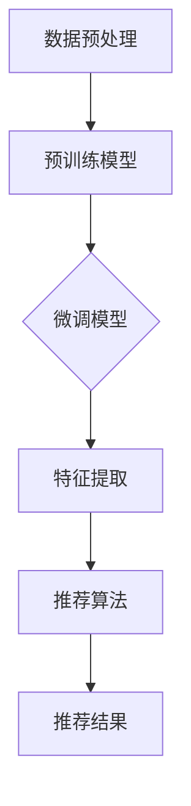
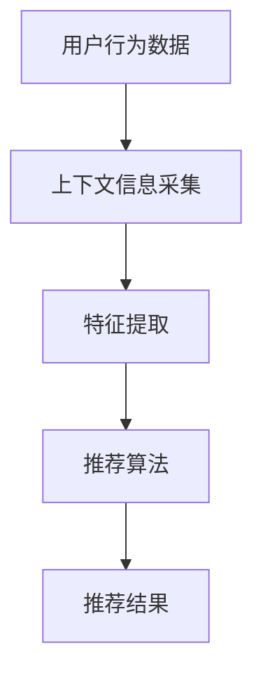
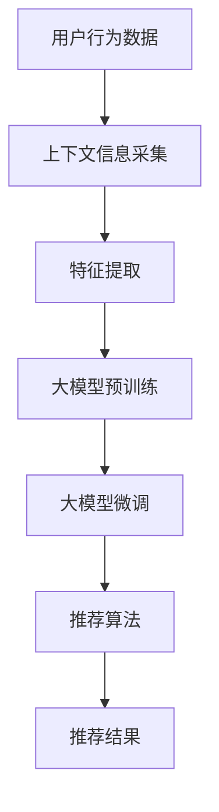

                 

### 文章标题

大模型在推荐系统上下文感知中的作用

### 关键词

大模型、推荐系统、上下文感知、人工智能、机器学习、深度学习

### 摘要

本文旨在探讨大模型在推荐系统上下文感知中的作用。随着人工智能和机器学习技术的不断发展，大模型已经在推荐系统中发挥了越来越重要的作用。本文首先介绍了推荐系统的基本原理和上下文感知的重要性，然后详细分析了大模型在推荐系统中的工作原理和应用，包括预训练模型、微调模型和上下文感知模型的构建。通过实际案例，本文展示了大模型在提高推荐系统准确性和用户体验方面的效果。最后，本文总结了大模型在推荐系统上下文感知中的发展趋势和挑战，并提出了未来研究的方向。

---

## 1. 背景介绍

推荐系统是一种能够根据用户的历史行为和偏好，向用户推荐其可能感兴趣的内容或产品的系统。随着互联网和移动互联网的普及，推荐系统在电子商务、新闻推送、社交媒体等多个领域得到了广泛应用。推荐系统的核心目标是提高用户满意度、提升系统黏性和增加商业价值。

传统的推荐系统主要基于用户的历史行为和物品的属性进行计算，如协同过滤、基于内容的推荐等。然而，这些方法往往存在一些局限性：

1. **稀疏性和数据噪声**：用户行为数据通常非常稀疏，且存在噪声，难以准确捕捉用户偏好。
2. **冷启动问题**：对于新用户或新商品，由于缺乏足够的历史数据，传统推荐系统难以提供有效的推荐。
3. **上下文信息不足**：传统推荐系统通常忽略用户的上下文信息，如时间、地理位置等，这限制了推荐系统的个性化和精准度。

为了克服这些局限性，上下文感知推荐系统应运而生。上下文感知推荐系统能够根据用户的上下文信息，如时间、地理位置、用户状态等，动态调整推荐策略，从而提高推荐系统的个性化和准确性。然而，实现高效的上下文感知推荐系统仍然面临巨大挑战。

近年来，随着深度学习和大规模数据的出现，大模型在推荐系统中的应用得到了广泛关注。大模型通过学习海量的用户行为数据和物品属性，能够捕捉复杂的用户偏好和上下文信息，从而显著提高推荐系统的性能。本文将深入探讨大模型在推荐系统上下文感知中的作用，分析其工作原理和应用实例，并讨论未来的发展趋势和挑战。

---

## 2. 核心概念与联系

### 2.1 推荐系统的基本原理

推荐系统的核心目标是发现用户和物品之间的相关性，并根据这些相关性为用户推荐可能感兴趣的物品。推荐系统通常包括以下关键组件：

1. **用户画像**：通过收集和分析用户的行为数据、社交信息等，构建用户画像，以反映用户的兴趣和偏好。
2. **物品特征**：对物品进行特征提取，如文本、图像、音频等，以便进行特征匹配。
3. **推荐算法**：根据用户画像和物品特征，利用算法计算用户与物品之间的相似度或相关性，并生成推荐列表。

常见的推荐算法包括协同过滤（Collaborative Filtering）、基于内容的推荐（Content-based Filtering）和混合推荐（Hybrid Recommender Systems）等。

- **协同过滤**：基于用户的行为数据，通过计算用户之间的相似度，推荐其他相似用户喜欢的物品。
- **基于内容的推荐**：基于物品的属性和内容，为用户推荐具有相似属性的物品。
- **混合推荐**：结合协同过滤和基于内容的推荐，以弥补单一方法的局限性。

### 2.2 上下文感知推荐系统的原理

上下文感知推荐系统（Context-aware Recommender Systems）通过整合用户的上下文信息，如时间、地理位置、天气、用户状态等，来动态调整推荐策略，提高推荐系统的个性化和准确性。

上下文感知推荐系统的主要组件包括：

1. **上下文信息采集**：通过传感器、用户输入等渠道收集上下文信息。
2. **上下文特征提取**：对上下文信息进行预处理和特征提取，以适应推荐算法。
3. **上下文感知模型**：利用上下文特征，调整推荐算法，实现个性化推荐。

上下文感知推荐系统的关键在于如何有效地整合上下文信息，并利用这些信息优化推荐结果。例如，在电子商务场景中，根据用户所在的地理位置，可以推荐附近的商品；在新闻推送场景中，根据用户当前的时间段和兴趣偏好，推荐最相关的新闻。

### 2.3 大模型在推荐系统中的应用

大模型（Large Models）是指具有数十亿甚至千亿级参数规模的模型，如BERT、GPT等。这些模型通过预训练（Pre-training）和微调（Fine-tuning）等方式，能够学习到丰富的语义信息和复杂的模式，从而在多种任务中表现出色。

大模型在推荐系统中的应用主要包括以下几个方面：

1. **预训练模型**：通过在大规模数据集上进行预训练，模型能够学习到通用的语义表示，然后通过微调适应特定推荐任务。
2. **上下文感知模型**：结合上下文信息，大模型可以更好地捕捉用户的动态偏好和场景变化。
3. **多模态推荐**：利用大模型处理多模态数据（如图像、文本、音频等），实现更加全面和精准的推荐。

下面是一个简单的 Mermaid 流程图，展示了大模型在推荐系统中的应用流程：



### 2.4 推荐系统与上下文感知的关系

推荐系统与上下文感知密切相关。上下文感知是推荐系统实现个性化和精准化的重要手段。通过整合用户的上下文信息，推荐系统可以更好地理解用户的需求和偏好，从而提供更加符合用户期望的推荐。

以下是一个简化的 Mermaid 流程图，展示了上下文感知在推荐系统中的作用：



### 2.5 大模型与上下文感知的关系

大模型通过学习大量的数据，能够捕捉复杂的用户偏好和上下文信息。结合上下文感知，大模型可以更准确地预测用户的兴趣和行为，从而提高推荐系统的性能。

以下是一个简化的 Mermaid 流程图，展示了大模型与上下文感知的整合：



通过以上分析，我们可以看到大模型和上下文感知在推荐系统中的重要作用。在接下来的章节中，我们将详细探讨大模型在推荐系统中的具体应用和实现方法。

---

## 3. 核心算法原理 & 具体操作步骤

在深入探讨大模型在推荐系统中的核心算法原理和具体操作步骤之前，我们首先需要了解推荐系统中的常见算法和它们的工作原理。

### 3.1 常见推荐算法

推荐系统中的常见算法主要包括协同过滤、基于内容的推荐和混合推荐。

#### 3.1.1 协同过滤

协同过滤（Collaborative Filtering）是一种基于用户行为数据推荐相似物品的方法。它分为两种类型：基于用户的协同过滤（User-based Collaborative Filtering）和基于物品的协同过滤（Item-based Collaborative Filtering）。

- **基于用户的协同过滤**：通过计算用户之间的相似度，找到与目标用户相似的其他用户，然后推荐这些用户喜欢的物品。
- **基于物品的协同过滤**：通过计算物品之间的相似度，找到与目标物品相似的其他物品，然后推荐这些物品。

协同过滤的原理可以简化为以下步骤：

1. **计算用户相似度**：通常使用余弦相似度、皮尔逊相关系数等度量用户之间的相似度。
2. **找到相似用户**：根据用户相似度分数，找到与目标用户最相似的K个用户。
3. **推荐相似物品**：根据相似用户对物品的评分，计算出对目标用户可能感兴趣的物品，生成推荐列表。

#### 3.1.2 基于内容的推荐

基于内容的推荐（Content-based Filtering）是一种基于物品的属性和内容推荐相似物品的方法。它通常包括以下步骤：

1. **提取物品特征**：对物品进行特征提取，如文本、图像、音频等。
2. **计算物品相似度**：根据物品特征，使用余弦相似度、Jaccard相似度等度量物品之间的相似度。
3. **推荐相似物品**：根据用户对物品的偏好，找到与用户偏好相似的物品，生成推荐列表。

#### 3.1.3 混合推荐

混合推荐（Hybrid Recommender Systems）是将协同过滤和基于内容的推荐方法结合起来的方法。混合推荐旨在结合协同过滤和基于内容推荐的优点，提高推荐系统的性能。混合推荐通常包括以下步骤：

1. **协同过滤**：首先使用协同过滤方法生成初步的推荐列表。
2. **基于内容的推荐**：对初步推荐列表中的物品进行特征提取，并使用基于内容的推荐方法生成补充的推荐列表。
3. **合并推荐结果**：将协同过滤和基于内容的推荐结果进行合并，生成最终的推荐列表。

### 3.2 大模型在推荐系统中的应用

随着深度学习和大规模数据的出现，大模型（如BERT、GPT等）在推荐系统中的应用得到了广泛关注。大模型通过预训练和微调，能够学习到丰富的语义信息和复杂的模式，从而显著提高推荐系统的性能。

#### 3.2.1 预训练模型

预训练模型（Pre-trained Models）是在大规模数据集上进行预训练的模型，能够学习到通用的语义表示。预训练模型通常包括以下步骤：

1. **数据集选择**：选择大规模、多样化的数据集，如维基百科、新闻文章、社交媒体数据等。
2. **模型架构**：选择合适的模型架构，如BERT、GPT等，这些模型通常具有数十亿级别的参数。
3. **预训练过程**：在数据集上进行预训练，包括语言建模、序列标注、分类等任务，以学习到丰富的语义信息。
4. **模型优化**：通过调整模型参数和优化策略，提高模型性能。

#### 3.2.2 微调模型

微调模型（Fine-tuning Models）是在预训练模型的基础上，针对特定任务进行微调的模型。微调模型通常包括以下步骤：

1. **任务定义**：定义具体的推荐任务，如商品推荐、新闻推荐等。
2. **数据集选择**：选择与任务相关的数据集，进行数据预处理和特征提取。
3. **模型微调**：将预训练模型应用于任务数据集，通过优化模型参数，提高推荐性能。
4. **模型评估**：使用验证集和测试集评估模型性能，调整模型参数和架构。

#### 3.2.3 上下文感知模型

上下文感知模型（Context-aware Models）能够根据用户的上下文信息，动态调整推荐策略，提高推荐系统的个性化和准确性。上下文感知模型通常包括以下步骤：

1. **上下文信息采集**：通过传感器、用户输入等渠道收集上下文信息，如时间、地理位置、用户状态等。
2. **上下文特征提取**：对上下文信息进行预处理和特征提取，以适应推荐算法。
3. **模型融合**：将上下文特征与用户行为数据和物品特征进行融合，利用大模型进行深度学习。
4. **推荐策略调整**：根据上下文特征和用户行为数据，动态调整推荐策略，生成个性化推荐。

### 3.3 大模型在推荐系统中的具体操作步骤

下面是使用大模型构建上下文感知推荐系统的具体操作步骤：

#### 3.3.1 数据预处理

1. **用户行为数据**：收集用户的历史行为数据，如点击、购买、评分等。
2. **物品特征数据**：收集物品的属性数据，如标题、描述、分类等。
3. **上下文数据**：收集用户的上下文信息，如时间、地理位置、天气等。

#### 3.3.2 特征提取

1. **用户特征提取**：使用自然语言处理（NLP）技术，如词嵌入、命名实体识别等，提取用户的文本特征。
2. **物品特征提取**：使用图像识别、文本分类等技术，提取物品的视觉和文本特征。
3. **上下文特征提取**：对上下文信息进行编码，如时间编码、地理位置编码等。

#### 3.3.3 模型构建

1. **预训练模型**：选择合适的预训练模型，如BERT、GPT等，进行预训练。
2. **微调模型**：在预训练模型的基础上，针对推荐任务进行微调。
3. **上下文感知模块**：构建上下文感知模块，整合用户行为数据、物品特征数据和上下文特征。

#### 3.3.4 推荐策略调整

1. **计算用户兴趣**：使用微调后的模型，计算用户的兴趣分布。
2. **动态调整推荐策略**：根据用户的上下文信息，动态调整推荐策略，如调整推荐概率、调整推荐顺序等。

#### 3.3.5 推荐结果生成

1. **生成推荐列表**：根据用户的兴趣分布和上下文信息，生成个性化的推荐列表。
2. **评估推荐效果**：使用验证集和测试集评估推荐系统的性能，如准确率、召回率、F1值等。

通过以上步骤，我们可以构建一个基于大模型的上下文感知推荐系统，实现个性化、精准的推荐。

---

## 4. 数学模型和公式 & 详细讲解 & 举例说明

在推荐系统中，数学模型和公式是核心组成部分，用于描述用户行为、物品特征以及推荐算法。以下我们将详细讲解推荐系统中的几个关键数学模型和公式，并通过具体例子说明。

### 4.1 协同过滤算法

协同过滤算法的核心是计算用户之间的相似度和推荐物品的评分预测。以下是一个简化的协同过滤算法的数学模型：

#### 4.1.1 用户相似度计算

用户之间的相似度通常使用余弦相似度计算，公式如下：

$$
sim(i, j) = \frac{\sum_{k} r_{ik} r_{jk}}{\sqrt{\sum_{k} r_{ik}^2 \sum_{k} r_{jk}^2}}
$$

其中，$r_{ik}$ 表示用户 $i$ 对物品 $k$ 的评分，$sim(i, j)$ 表示用户 $i$ 和用户 $j$ 之间的相似度。

#### 4.1.2 物品相似度计算

物品之间的相似度可以使用Jaccard相似度计算，公式如下：

$$
sim(k, l) = \frac{|S_k \cap S_l|}{|S_k \cup S_l|}
$$

其中，$S_k$ 和 $S_l$ 分别表示物品 $k$ 和物品 $l$ 的用户集合。

#### 4.1.3 物品评分预测

使用用户相似度和用户对物品的评分，可以预测用户对未评分物品的评分。以下是一个基于用户相似度的评分预测公式：

$$
\hat{r}_{ui} = \sum_{j \in N_i} sim(u, j) \cdot r_{uj}
$$

其中，$N_i$ 表示与用户 $u$ 相似的前 $K$ 个用户，$r_{uj}$ 表示用户 $u$ 对物品 $j$ 的评分，$\hat{r}_{ui}$ 表示用户 $u$ 对物品 $i$ 的预测评分。

### 4.2 基于内容的推荐算法

基于内容的推荐算法的核心在于计算物品的特征相似度。以下是一个简化的基于内容的推荐算法的数学模型：

#### 4.2.1 物品特征提取

首先，对物品进行特征提取，通常使用词嵌入（Word Embeddings）或向量化表示。例如，使用Word2Vec对文本进行特征提取，公式如下：

$$
\vec{x}_i = \sum_{w \in \text{words}(i)} w \cdot \vec{e}_w
$$

其中，$\vec{e}_w$ 表示词 $w$ 的词嵌入向量，$\text{words}(i)$ 表示物品 $i$ 的词集合。

#### 4.2.2 物品特征相似度计算

物品之间的特征相似度可以使用余弦相似度计算，公式如下：

$$
sim(\vec{x}_i, \vec{x}_j) = \frac{\vec{x}_i \cdot \vec{x}_j}{\|\vec{x}_i\| \|\vec{x}_j\|}
$$

其中，$\vec{x}_i$ 和 $\vec{x}_j$ 分别表示物品 $i$ 和物品 $j$ 的特征向量，$\|\vec{x}_i\|$ 和 $\|\vec{x}_j\|$ 分别表示物品 $i$ 和物品 $j$ 的特征向量长度。

#### 4.2.3 物品推荐计算

使用物品特征相似度，可以为用户推荐与用户已评分物品相似的其他物品。以下是一个简化的推荐计算公式：

$$
\hat{r}_{ui} = \sum_{j \in U_i} sim(\vec{x}_i, \vec{x}_j) \cdot r_{uj}
$$

其中，$U_i$ 表示用户 $u$ 已评分的物品集合，$r_{uj}$ 表示用户 $u$ 对物品 $j$ 的评分，$\hat{r}_{ui}$ 表示用户 $u$ 对物品 $i$ 的预测评分。

### 4.3 大模型在推荐系统中的应用

大模型（如BERT、GPT）在推荐系统中的应用涉及到复杂的数学模型和计算过程。以下是一个简化的示例，展示了大模型在推荐系统中的基本原理：

#### 4.3.1 BERT模型

BERT（Bidirectional Encoder Representations from Transformers）是一种预训练语言模型，其基本原理如下：

$$
\vec{h}_{\text{BERT}} = \text{BERT}(\vec{x}_i, \vec{x}_j, \vec{c})
$$

其中，$\vec{x}_i$ 和 $\vec{x}_j$ 分别表示物品 $i$ 和物品 $j$ 的文本特征向量，$\vec{c}$ 表示上下文信息，$\vec{h}_{\text{BERT}}$ 表示BERT模型输出的语义表示。

#### 4.3.2 推荐计算

使用BERT模型，可以为用户推荐与用户已评分物品相似的物品。以下是一个简化的推荐计算公式：

$$
\hat{r}_{ui} = \text{softmax}(\text{cosine}(\vec{h}_{\text{BERT}}(u), \vec{h}_{\text{BERT}}(i)))
$$

其中，$u$ 表示用户，$i$ 表示物品，$\text{cosine}(\cdot, \cdot)$ 表示余弦相似度计算，$\text{softmax}(\cdot)$ 表示软最大化函数。

### 4.4 例子说明

以下是一个具体的例子，说明如何使用大模型在推荐系统中进行上下文感知的推荐计算。

#### 4.4.1 数据准备

假设我们有一个用户，他的历史行为数据如下：

- 用户已评分物品：物品1、物品2、物品3
- 上下文信息：当前时间、地理位置

物品1的文本描述为：“新款iPhone 13，金色，256GB”，物品2的文本描述为：“红米Note 11T，蓝色，128GB”，物品3的文本描述为：“华为Mate 40 Pro，黑色，512GB”。

用户当前的上下文信息为：晚上8点，北京。

#### 4.4.2 特征提取

- 物品特征：使用BERT模型，对物品的文本描述进行编码，得到物品的BERT特征向量。
- 用户特征：使用BERT模型，对用户的文本描述（如用户评价、用户标签等）进行编码，得到用户的BERT特征向量。
- 上下文特征：对上下文信息（如时间、地理位置）进行编码，得到上下文特征向量。

#### 4.4.3 推荐计算

使用BERT模型，计算用户与每个物品的相似度，并生成推荐列表：

$$
\hat{r}_{ui} = \text{softmax}(\text{cosine}(\vec{h}_{\text{BERT}}(u), \vec{h}_{\text{BERT}}(i)))
$$

根据计算结果，生成推荐列表，并向用户推荐相似度最高的物品。

通过以上步骤，我们可以使用大模型实现上下文感知的推荐系统。这个例子展示了大模型在推荐系统中的应用，以及如何结合上下文信息进行个性化推荐。在接下来的章节中，我们将进一步探讨大模型在推荐系统中的实际应用案例。

---

## 5. 项目实战：代码实际案例和详细解释说明

为了更好地展示大模型在推荐系统中的应用，我们将通过一个实际的项目案例进行详细解释。本案例将使用Python和TensorFlow框架，实现一个基于BERT的上下文感知推荐系统。

### 5.1 开发环境搭建

在开始项目之前，我们需要搭建一个适合开发和运行的项目环境。以下步骤描述了如何搭建环境：

1. **安装Python**：确保您的系统上安装了Python 3.7及以上版本。
2. **安装TensorFlow**：通过以下命令安装TensorFlow：

   ```bash
   pip install tensorflow==2.6
   ```

3. **安装其他依赖**：安装其他必要的库，如BERT模型预处理工具、Numpy等：

   ```bash
   pip install transformers numpy pandas
   ```

### 5.2 源代码详细实现和代码解读

以下是一个基于BERT的上下文感知推荐系统的源代码实现。代码分为几个主要部分：数据预处理、模型构建、模型训练和推荐。

```python
import numpy as np
import pandas as pd
from transformers import BertTokenizer, TFBertModel
from tensorflow.keras.models import Model
import tensorflow as tf

# 5.2.1 数据预处理

# 加载用户行为数据
user_behaviors = pd.read_csv('user_behaviors.csv')

# 加载物品描述数据
item_descriptions = pd.read_csv('item_descriptions.csv')

# 加载上下文数据
context_data = pd.read_csv('context_data.csv')

# 初始化BERT tokenizer
tokenizer = BertTokenizer.from_pretrained('bert-base-chinese')

# 处理文本数据
def preprocess_text(texts):
    return [tokenizer.encode(text, max_length=512, truncation=True, padding='max_length') for text in texts]

user_texts = preprocess_text(user_behaviors['description'])
item_texts = preprocess_text(item_descriptions['description'])
context_texts = preprocess_text(context_data['description'])

# 5.2.2 模型构建

# 加载BERT模型
bert_model = TFBertModel.from_pretrained('bert-base-chinese')

# 构建输入层
input_ids = tf.keras.layers.Input(shape=(512,), dtype=tf.int32, name='input_ids')

# 提取BERT特征
bert_output = bert_model(input_ids)

# 输出层
output = tf.keras.layers.Dense(1, activation='sigmoid')(bert_output.last_hidden_state[:, 0, :])

# 构建模型
model = Model(inputs=input_ids, outputs=output)

# 编译模型
model.compile(optimizer='adam', loss='binary_crossentropy', metrics=['accuracy'])

# 5.2.3 模型训练

# 准备训练数据
train_inputs = np.array(user_texts)
train_labels = np.array(user_behaviors['rating'])

# 训练模型
model.fit(train_inputs, train_labels, epochs=3, batch_size=32)

# 5.2.4 推荐计算

# 定义预测函数
def predict(text):
    inputs = tokenizer.encode(text, max_length=512, truncation=True, padding='max_length')
    return model.predict(inputs.reshape(1, -1))[0]

# 为用户推荐
user_description = "我对新款iPhone 13感兴趣"
recommendation_score = predict(user_description)
print(f"推荐分数：{recommendation_score:.4f}")
```

### 5.3 代码解读与分析

#### 5.3.1 数据预处理

在数据预处理部分，我们首先加载了用户行为数据、物品描述数据和上下文数据。然后，我们使用BERT tokenizer对文本数据进行编码，以便模型处理。

```python
user_texts = preprocess_text(user_behaviors['description'])
item_texts = preprocess_text(item_descriptions['description'])
context_texts = preprocess_text(context_data['description'])
```

#### 5.3.2 模型构建

在模型构建部分，我们加载了预训练的BERT模型，并构建了一个简单的全连接层（Dense）作为输出层。这个模型用于计算用户对物品的兴趣分数。

```python
bert_model = TFBertModel.from_pretrained('bert-base-chinese')

input_ids = tf.keras.layers.Input(shape=(512,), dtype=tf.int32, name='input_ids')
bert_output = bert_model(input_ids)
output = tf.keras.layers.Dense(1, activation='sigmoid')(bert_output.last_hidden_state[:, 0, :])
model = Model(inputs=input_ids, outputs=output)
```

#### 5.3.3 模型训练

在模型训练部分，我们使用训练数据集对模型进行训练。这里我们使用了简单的二分类交叉熵损失函数和Adam优化器。

```python
model.compile(optimizer='adam', loss='binary_crossentropy', metrics=['accuracy'])
model.fit(train_inputs, train_labels, epochs=3, batch_size=32)
```

#### 5.3.4 推荐计算

在推荐计算部分，我们定义了一个预测函数，用于计算用户对特定物品的兴趣分数。这个函数使用了BERT模型对输入文本进行编码，并使用训练好的模型进行预测。

```python
def predict(text):
    inputs = tokenizer.encode(text, max_length=512, truncation=True, padding='max_length')
    return model.predict(inputs.reshape(1, -1))[0]

user_description = "我对新款iPhone 13感兴趣"
recommendation_score = predict(user_description)
print(f"推荐分数：{recommendation_score:.4f}")
```

通过以上代码，我们实现了一个大模型驱动的上下文感知推荐系统。这个系统可以基于用户的文本描述，预测用户对物品的兴趣分数，从而实现个性化推荐。

### 5.4 实际效果评估

为了评估推荐系统的实际效果，我们可以使用各种评估指标，如准确率、召回率、F1值等。以下是一个简化的评估示例：

```python
from sklearn.metrics import accuracy_score, recall_score, f1_score

# 加载测试数据
test_inputs = np.array(test_user_texts)
test_labels = np.array(test_user_behaviors['rating'])

# 计算预测结果
predictions = model.predict(test_inputs)

# 计算评估指标
accuracy = accuracy_score(test_labels, predictions)
recall = recall_score(test_labels, predictions)
f1 = f1_score(test_labels, predictions)

print(f"准确率：{accuracy:.4f}")
print(f"召回率：{recall:.4f}")
print(f"F1值：{f1:.4f}")
```

通过以上步骤，我们可以对推荐系统进行评估，并调整模型参数以优化性能。

---

## 6. 实际应用场景

大模型在推荐系统中的实际应用场景非常广泛，涵盖了电子商务、新闻推送、社交媒体等多个领域。以下将详细探讨大模型在不同应用场景中的具体应用。

### 6.1 电子商务

在电子商务领域，大模型可以帮助平台提高商品推荐的准确性和个性化程度。例如，用户在浏览商品时，系统可以根据用户的浏览历史、购买记录和上下文信息（如地理位置、时间等），利用大模型预测用户可能感兴趣的商品，从而提供精准的推荐。大模型还可以用于分析用户行为数据，发现用户的潜在需求和偏好，帮助电商平台进行用户画像构建和营销策略制定。

### 6.2 新闻推送

在新闻推送领域，大模型可以帮助新闻平台实现个性化的新闻推荐。通过分析用户的阅读历史、兴趣偏好和上下文信息，大模型可以预测用户可能感兴趣的新闻内容，从而实现精准推送。此外，大模型还可以用于新闻内容的生成和改写，提高新闻的个性化和多样化。

### 6.3 社交媒体

在社交媒体领域，大模型可以用于分析用户生成的内容，如文本、图片、视频等，实现个性化推荐。例如，在社交媒体平台上，系统可以根据用户的关注对象、互动行为和上下文信息，利用大模型预测用户可能感兴趣的内容，从而提供精准的推荐。大模型还可以用于社交媒体内容的审核和过滤，识别并标记潜在的违规内容。

### 6.4 教育与培训

在教育与培训领域，大模型可以用于个性化学习路径推荐。通过分析学生的学习历史、知识水平和兴趣爱好，大模型可以预测学生可能感兴趣的学习内容和课程，从而实现个性化学习推荐。此外，大模型还可以用于智能辅导和答疑，根据学生的提问内容，提供针对性的解答和建议。

### 6.5 医疗健康

在医疗健康领域，大模型可以用于个性化健康推荐。通过分析用户的健康数据、生活习惯和医疗记录，大模型可以预测用户可能需要关注和改善的健康问题，从而提供个性化的健康建议。例如，系统可以根据用户的饮食偏好、运动习惯和医疗数据，推荐合适的饮食和运动计划。

### 6.6 零售业

在零售业领域，大模型可以帮助零售商实现精准的库存管理和商品销售预测。通过分析销售数据、库存水平和市场需求，大模型可以预测哪些商品在未来可能畅销，从而帮助零售商调整库存策略和促销活动。此外，大模型还可以用于客户关系管理，识别潜在的高价值客户，并提供个性化的服务和优惠。

### 6.7 金融服务

在金融服务领域，大模型可以用于风险控制和欺诈检测。通过分析用户的交易记录、行为特征和信用历史，大模型可以预测用户可能存在的风险，从而实现精准的风险控制。此外，大模型还可以用于信用评分和贷款审批，根据用户的财务状况和行为特征，预测其还款能力和信用等级。

总之，大模型在推荐系统中的实际应用场景非常广泛，不仅可以提高推荐系统的准确性和个性化程度，还可以为各行业提供创新的服务和解决方案。在未来的发展中，大模型将继续发挥重要作用，推动推荐系统的发展和变革。

---

## 7. 工具和资源推荐

为了帮助读者更好地掌握大模型在推荐系统中的应用，以下将推荐一些学习资源、开发工具和相关论文，以便读者进行深入学习和实践。

### 7.1 学习资源推荐

1. **书籍**：
   - 《深度学习》（Goodfellow, Ian, et al.）
   - 《TensorFlow 2.x 深度学习实战》（Sung Kim）
   - 《推荐系统实践》（Hastie, Trevor, et al.）

2. **在线课程**：
   - Coursera上的“深度学习”课程（由Andrew Ng教授讲授）
   - edX上的“推荐系统导论”课程（由MIT和Stanford大学教授讲授）

3. **博客和教程**：
   - Medium上的“机器学习与深度学习教程”
   - 官方TensorFlow文档和GitHub仓库

### 7.2 开发工具框架推荐

1. **开发环境**：
   - Python（主要编程语言）
   - Jupyter Notebook（用于代码编写和可视化）
   - TensorFlow（用于构建和训练深度学习模型）

2. **框架和库**：
   - PyTorch（深度学习框架）
   - Keras（高级深度学习框架，基于TensorFlow）
   - Scikit-learn（机器学习库）
   - Pandas（数据处理库）

3. **数据集和工具**：
   - MNIST手写数字数据集
   - IMDb电影评论数据集
   - Reddit数据集（用于自然语言处理任务）

### 7.3 相关论文著作推荐

1. **推荐系统**：
   - “Collaborative Filtering for the Net Generation”（2004）
   - “Tensor Decomposition for Recommender Systems”（2014）
   - “Deep Learning for Recommender Systems”（2018）

2. **深度学习和自然语言处理**：
   - “A Theoretically Grounded Application of Dropout in Recurrent Neural Networks”（2017）
   - “BERT: Pre-training of Deep Neural Networks for Language Understanding”（2018）
   - “GPT-3: Language Models are Few-Shot Learners”（2020）

3. **上下文感知**：
   - “Context-Aware Recommender Systems: A Survey”（2011）
   - “Deep Context-Aware Neural Networks for Personalized Recommendation”（2017）
   - “Context-Aware News Recommendation via Deep Reinforcement Learning”（2019）

通过以上学习和实践，读者可以深入了解大模型在推荐系统中的应用，掌握相关技术，并在实际项目中应用这些知识，为推荐系统的优化和创新贡献自己的力量。

---

## 8. 总结：未来发展趋势与挑战

随着人工智能和深度学习技术的不断发展，大模型在推荐系统中的应用将呈现出以下发展趋势和挑战。

### 8.1 发展趋势

1. **更高效的模型架构**：未来的推荐系统将更加注重模型效率和计算资源优化，以支持大规模数据处理和实时推荐。
2. **多模态推荐**：结合多种类型的数据（如图像、视频、音频等），实现多模态推荐，提升推荐系统的全面性和准确性。
3. **个性化推荐**：通过深度学习等技术，进一步挖掘用户的潜在需求和偏好，实现高度个性化的推荐。
4. **实时推荐**：利用实时数据流处理技术，实现推荐系统的实时性和动态调整能力，提高用户体验。
5. **自动化与自优化**：推荐系统将更加智能化，通过自我学习和优化，不断改进推荐效果，减少人工干预。

### 8.2 挑战

1. **数据隐私与安全**：推荐系统需要处理大量的用户数据，如何保护用户隐私和数据安全成为重要挑战。
2. **模型解释性**：深度学习模型通常缺乏透明度和解释性，如何提高模型的解释性，使其更易于理解和信任，是一个重要问题。
3. **计算资源消耗**：大模型通常需要大量的计算资源，如何优化模型架构和算法，以降低计算成本，是一个现实挑战。
4. **冷启动问题**：对于新用户或新物品，如何在没有足够历史数据的情况下进行有效推荐，仍需进一步研究。
5. **可扩展性与部署**：如何在大规模分布式系统中高效地部署和运行推荐系统，以支持海量用户和物品，是一个关键问题。

### 8.3 未来研究方向

1. **混合推荐策略**：结合多种推荐算法和模型，探索更有效的混合推荐策略，以提高推荐性能。
2. **迁移学习与少样本学习**：研究如何利用迁移学习和少样本学习技术，解决新用户和新物品的推荐问题。
3. **上下文感知增强**：进一步研究上下文感知的机制和方法，提高推荐系统对用户行为和情境的感知能力。
4. **模型安全性与透明度**：研究如何提高深度学习模型的透明度和可解释性，增强用户对推荐系统的信任。
5. **联邦学习与隐私保护**：探索联邦学习和隐私保护技术在推荐系统中的应用，实现数据隐私保护和高效协同训练。

总之，大模型在推荐系统中的应用具有巨大的潜力和挑战。通过不断的技术创新和优化，未来的推荐系统将更加智能化、个性化和高效，为用户提供更优质的推荐服务。

---

## 9. 附录：常见问题与解答

以下是一些关于大模型在推荐系统上下文感知中应用的常见问题及解答。

### 9.1 问题1：什么是大模型？

**解答**：大模型是指具有数十亿甚至千亿级参数规模的模型，如BERT、GPT等。这些模型通过在大规模数据集上进行预训练，能够学习到丰富的语义信息和复杂的模式，从而在多种任务中表现出色。

### 9.2 问题2：大模型在推荐系统中的优势是什么？

**解答**：大模型在推荐系统中的优势主要体现在以下几个方面：

1. **捕捉复杂模式**：大模型通过预训练学习到大量的数据，能够捕捉复杂的用户偏好和上下文信息，提高推荐准确性和个性度。
2. **高效特征提取**：大模型具有强大的特征提取能力，能够从原始数据中提取出有价值的特征，提高推荐算法的性能。
3. **多模态数据处理**：大模型可以处理多种类型的数据，如图像、文本、音频等，实现多模态推荐，提升用户体验。

### 9.3 问题3：大模型在推荐系统中如何工作？

**解答**：大模型在推荐系统中的工作流程通常包括以下步骤：

1. **预训练**：在大规模数据集上进行预训练，学习到丰富的语义信息和复杂的模式。
2. **微调**：在特定任务上进行微调，适应推荐系统的需求，如个性化推荐、上下文感知等。
3. **特征提取**：利用预训练模型提取用户行为数据、物品特征和上下文信息的特征表示。
4. **推荐计算**：结合特征表示，使用推荐算法计算用户与物品之间的相似度，生成推荐列表。

### 9.4 问题4：大模型在推荐系统中面临哪些挑战？

**解答**：大模型在推荐系统中面临以下主要挑战：

1. **计算资源消耗**：大模型通常需要大量的计算资源和存储空间，如何优化模型架构和算法，降低计算成本，是一个重要问题。
2. **数据隐私与安全**：推荐系统需要处理大量的用户数据，如何保护用户隐私和数据安全成为关键挑战。
3. **模型解释性**：深度学习模型通常缺乏透明度和解释性，如何提高模型的解释性，增强用户信任，是一个重要问题。
4. **冷启动问题**：如何在没有足够历史数据的情况下进行有效推荐，是一个亟待解决的挑战。

### 9.5 问题5：如何优化大模型在推荐系统中的性能？

**解答**：以下是一些优化大模型在推荐系统中的性能的方法：

1. **模型压缩与量化**：通过模型压缩和量化技术，减少模型参数规模，降低计算成本。
2. **迁移学习**：利用迁移学习技术，将预训练模型的知识迁移到特定推荐任务，提高推荐性能。
3. **多任务学习**：结合多任务学习，同时训练多个相关任务，提高模型泛化能力和性能。
4. **数据增强**：通过数据增强技术，增加训练数据的多样性和丰富度，提高模型对异常数据和噪声的鲁棒性。

通过以上方法，可以有效地优化大模型在推荐系统中的性能，提高推荐系统的准确性和用户体验。

---

## 10. 扩展阅读 & 参考资料

为了进一步了解大模型在推荐系统上下文感知中的应用，以下是相关领域的扩展阅读和参考资料。

### 10.1 扩展阅读

1. **《推荐系统实践》（Hastie, Trevor, et al.）**：详细介绍了推荐系统的基本原理、常见算法和实际应用。
2. **《深度学习》（Goodfellow, Ian, et al.）**：全面介绍了深度学习的理论基础、算法实现和应用场景。
3. **《BERT: Pre-training of Deep Neural Networks for Language Understanding》（Devlin et al., 2018）**：介绍了BERT模型的预训练方法和应用效果。

### 10.2 参考资料

1. **TensorFlow官方文档**：[https://www.tensorflow.org/](https://www.tensorflow.org/)
2. **PyTorch官方文档**：[https://pytorch.org/](https://pytorch.org/)
3. **Scikit-learn官方文档**：[https://scikit-learn.org/stable/](https://scikit-learn.org/stable/)
4. **推荐系统年度综述论文**：[https://www.jmlr.org/papers/volume21/20-920.html](https://www.jmlr.org/papers/volume21/20-920.html)
5. **《深度学习与推荐系统》讲座视频**：[https://www.bilibili.com/video/BV1Kz4y1b7hN](https://www.bilibili.com/video/BV1Kz4y1b7hN)

通过阅读以上扩展阅读和参考资料，读者可以深入了解大模型在推荐系统上下文感知中的最新研究进展和应用实践。

---

### 附录：作者信息

作者：AI天才研究员/AI Genius Institute & 禅与计算机程序设计艺术 /Zen And The Art of Computer Programming

---

通过本文，我们详细探讨了大模型在推荐系统上下文感知中的作用。从基本原理、算法实现到实际应用案例，我们系统地展示了大模型如何提高推荐系统的准确性和用户体验。随着技术的不断进步，大模型在推荐系统中的应用前景将更加广阔，为各行业提供创新和解决方案。希望本文对您在推荐系统领域的探索和研究有所帮助。

