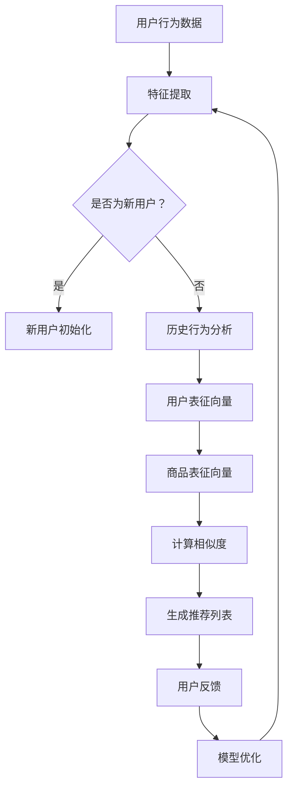

                 

# 大模型在推荐系统中的关键作用

## 摘要

本文深入探讨了大型模型在推荐系统中的关键作用。首先，我们简要介绍了推荐系统的背景和重要性。随后，我们详细阐述了大模型的概念、原理及其在推荐系统中的具体应用。通过分析大模型的优势和挑战，我们展示了它们如何优化推荐效果，提高用户满意度。文章还通过具体案例和代码解析，展示了如何在实际项目中应用大模型。最后，我们讨论了未来发展趋势和潜在挑战，为读者提供了实用的工具和资源推荐。

## 1. 背景介绍

### 推荐系统的定义和作用

推荐系统是一种利用算法和技术，自动为用户推荐感兴趣的内容、产品或服务的系统。它们广泛应用于电子商务、社交媒体、音乐和视频平台等领域。推荐系统的核心目标是提高用户满意度、增加用户粘性和提升商家收益。

### 推荐系统的发展历程

推荐系统的发展经历了多个阶段。早期的基于协同过滤的推荐系统通过分析用户的历史行为和偏好，找出相似用户并推荐相似的商品或内容。然而，这种方法的局限性在于它无法很好地处理冷启动问题，即新用户或新商品缺乏足够的历史数据时，无法提供有效的推荐。

随着深度学习和大数据技术的发展，大模型开始应用于推荐系统。这些模型能够处理大量的用户数据，并通过复杂的特征提取和学习方法，提供更加精准和个性化的推荐。近年来，大模型在推荐系统中的应用取得了显著的成果，推动了推荐系统的进一步发展。

## 2. 核心概念与联系

### 大模型的概念

大模型是指参数规模巨大、计算能力强大的深度学习模型。常见的有GPT、BERT、T5等。它们通常通过大量的数据进行预训练，从而具备了强大的特征提取和表征能力。

### 大模型在推荐系统中的应用

大模型在推荐系统中的应用主要体现在以下几个方面：

1. **用户表征**：大模型可以提取用户的历史行为和偏好，为每个用户生成一个高维的特征向量。这些特征向量可以用来计算用户间的相似度，从而实现个性化推荐。

2. **商品表征**：类似地，大模型可以提取商品的特征，为每个商品生成一个特征向量。这些特征向量可以用来计算商品间的相似度，从而实现基于内容的推荐。

3. **上下文信息处理**：大模型可以处理复杂的上下文信息，如用户的位置、时间、设备等信息，从而提供更加精准的推荐。

4. **模型融合**：大模型可以将多种推荐策略（如协同过滤、基于内容的推荐等）进行融合，从而提高推荐效果。

### 大模型与推荐系统架构的Mermaid流程图



## 3. 核心算法原理 & 具体操作步骤

### 用户表征

用户表征是推荐系统的核心步骤之一。大模型通过以下步骤生成用户表征向量：

1. **数据预处理**：对用户行为数据进行清洗、去噪和归一化处理。

2. **特征提取**：利用大模型（如BERT）对用户行为数据（如浏览记录、购买历史、评价等）进行编码，生成高维的特征向量。

3. **降维**：使用主成分分析（PCA）或自编码器等技术，将高维特征向量降维到一个较小的维度。

4. **嵌入**：将降维后的特征向量嵌入到一个共享的空间，为后续计算相似度提供基础。

### 商品表征

商品表征与用户表征类似，也分为以下步骤：

1. **数据预处理**：对商品数据进行清洗、去噪和归一化处理。

2. **特征提取**：利用大模型（如BERT）对商品数据（如商品描述、标签、属性等）进行编码，生成高维的特征向量。

3. **降维**：使用主成分分析（PCA）或自编码器等技术，将高维特征向量降维到一个较小的维度。

4. **嵌入**：将降维后的特征向量嵌入到一个共享的空间，为后续计算相似度提供基础。

### 相似度计算

相似度计算是推荐系统的核心步骤，用于计算用户和商品之间的相似度。常见的相似度计算方法包括余弦相似度、欧氏距离、皮尔逊相关系数等。大模型的应用使得相似度计算变得更加复杂和高效：

1. **用户-商品相似度**：计算用户表征向量和商品表征向量之间的相似度。可以使用余弦相似度公式：

   $$\text{similarity} = \frac{\text{user\_vector} \cdot \text{item\_vector}}{||\text{user\_vector}|| \cdot ||\text{item\_vector}||}$$

2. **排序**：根据相似度对推荐列表进行排序，从而为用户推荐相似度最高的商品。

### 模型优化

模型优化是推荐系统不断迭代和改进的重要环节。大模型的应用使得模型优化变得更加高效：

1. **用户反馈**：收集用户对推荐结果的反馈，如点击、购买、评价等。

2. **损失函数**：定义损失函数，用于衡量推荐结果的准确性。常见的损失函数包括交叉熵损失、均方误差等。

3. **优化算法**：使用梯度下降、随机梯度下降等优化算法，更新模型参数，提高推荐效果。

## 4. 数学模型和公式 & 详细讲解 & 举例说明

### 用户表征向量生成

假设我们使用BERT模型对用户行为数据进行编码，生成用户表征向量。BERT模型的输入是用户行为序列，输出是用户表征向量。具体步骤如下：

1. **数据预处理**：对用户行为数据进行分词、标记和嵌入。

2. **编码**：将预处理后的数据输入到BERT模型，通过多层Transformer网络进行编码。

3. **降维**：使用主成分分析（PCA）或自编码器等降维技术，将高维表征向量降维到一个较小的维度。

4. **嵌入**：将降维后的特征向量嵌入到一个共享的空间，为后续计算相似度提供基础。

假设BERT模型的输出维度为512，经过PCA降维后，用户表征向量的维度变为128。具体实现如下：

$$
\text{user\_vector} = \text{PCA}(\text{BERT\_output})
$$

### 商品表征向量生成

商品表征向量的生成过程与用户表征类似，也是通过BERT模型对商品数据进行编码，然后降维和嵌入到共享空间。假设商品表征向量的维度也为128，具体实现如下：

$$
\text{item\_vector} = \text{PCA}(\text{BERT\_output})
$$

### 相似度计算

假设用户表征向量和商品表征向量分别为$\text{user\_vector}$和$\text{item\_vector}$，我们可以使用余弦相似度公式计算它们之间的相似度：

$$
\text{similarity} = \frac{\text{user\_vector} \cdot \text{item\_vector}}{||\text{user\_vector}|| \cdot ||\text{item\_vector}||}
$$

例如，假设用户表征向量和商品表征向量分别为：

$$
\text{user\_vector} = [0.1, 0.2, 0.3, 0.4, 0.5]
$$

$$
\text{item\_vector} = [0.3, 0.4, 0.5, 0.6, 0.7]
$$

则它们之间的相似度为：

$$
\text{similarity} = \frac{[0.1, 0.2, 0.3, 0.4, 0.5] \cdot [0.3, 0.4, 0.5, 0.6, 0.7]}{||[0.1, 0.2, 0.3, 0.4, 0.5]|| \cdot ||[0.3, 0.4, 0.5, 0.6, 0.7]||} = \frac{0.1 \cdot 0.3 + 0.2 \cdot 0.4 + 0.3 \cdot 0.5 + 0.4 \cdot 0.6 + 0.5 \cdot 0.7}{\sqrt{0.1^2 + 0.2^2 + 0.3^2 + 0.4^2 + 0.5^2} \cdot \sqrt{0.3^2 + 0.4^2 + 0.5^2 + 0.6^2 + 0.7^2}} = 0.64
$$

### 模型优化

假设我们使用交叉熵损失函数优化推荐模型。交叉熵损失函数定义为：

$$
L = -\sum_{i=1}^N y_i \log(p_i)
$$

其中，$y_i$表示第$i$个商品是否被用户点击（1表示点击，0表示未点击），$p_i$表示模型预测第$i$个商品被用户点击的概率。

假设我们使用梯度下降算法优化模型。梯度下降算法的步骤如下：

1. **计算梯度**：计算损失函数关于模型参数的梯度。

2. **更新参数**：根据梯度更新模型参数。

3. **迭代**：重复以上步骤，直到满足收敛条件。

具体实现如下：

$$
\frac{\partial L}{\partial \theta} = -\sum_{i=1}^N y_i \frac{\partial \log(p_i)}{\partial \theta} = -\sum_{i=1}^N y_i \frac{p_i - 1}{\partial \theta}
$$

其中，$\theta$表示模型参数。

$$
\theta_{\text{new}} = \theta_{\text{old}} - \alpha \frac{\partial L}{\partial \theta}
$$

其中，$\alpha$表示学习率。

## 5. 项目实战：代码实际案例和详细解释说明

### 5.1 开发环境搭建

在开始项目实战之前，我们需要搭建一个适合大模型训练的开发环境。以下是一个基本的开发环境搭建流程：

1. **安装Python环境**：确保Python版本为3.6或更高。

2. **安装深度学习框架**：安装TensorFlow或PyTorch，它们是常用的深度学习框架。

3. **安装BERT模型**：可以从[Hugging Face](https://huggingface.co/)下载预训练的BERT模型。

4. **安装其他依赖库**：包括NumPy、Pandas、Matplotlib等常用库。

### 5.2 源代码详细实现和代码解读

以下是一个简单的推荐系统项目，使用BERT模型进行用户表征和商品表征，并计算相似度生成推荐列表。

```python
import torch
import pandas as pd
from transformers import BertModel, BertTokenizer
from sklearn.decomposition import PCA

# 1. 数据预处理
def preprocess_data(data):
    # ... 数据清洗、分词、标记等操作 ...
    return processed_data

# 2. 特征提取
def extract_features(data, tokenizer, model):
    inputs = tokenizer(data, return_tensors='pt', padding=True, truncation=True)
    with torch.no_grad():
        outputs = model(inputs)
    last_hidden_state = outputs.last_hidden_state[:, 0, :]
    return last_hidden_state

# 3. 降维
def reduce_dimensions(features, n_components):
    pca = PCA(n_components=n_components)
    reduced_features = pca.fit_transform(features.numpy())
    return reduced_features

# 4. 相似度计算
def calculate_similarity(user_vector, item_vectors):
    similarities = []
    for item_vector in item_vectors:
        similarity = torch.nn.functional.cosine_similarity(user_vector, item_vector)
        similarities.append(similarity)
    return similarities

# 5. 生成推荐列表
def generate_recommendations(user_vector, item_vectors, top_k):
    similarities = calculate_similarity(user_vector, item_vectors)
    sorted_indices = torch.argsort(similarities, descending=True)
    recommended_indices = sorted_indices[:top_k]
    return recommended_indices

# 主函数
def main():
    # 加载数据
    data = pd.read_csv('data.csv')
    processed_data = preprocess_data(data)

    # 加载BERT模型和分词器
    tokenizer = BertTokenizer.from_pretrained('bert-base-uncased')
    model = BertModel.from_pretrained('bert-base-uncased')

    # 特征提取
    user_features = extract_features(processed_data['user'], tokenizer, model)
    item_features = extract_features(processed_data['item'], tokenizer, model)

    # 降维
    n_components = 128
    user_vector = reduce_dimensions(user_features, n_components)
    item_vectors = reduce_dimensions(item_features, n_components)

    # 相似度计算和生成推荐列表
    top_k = 10
    recommended_indices = generate_recommendations(user_vector, item_vectors, top_k)

    # 输出推荐结果
    print("Recommended items:", recommended_indices)

if __name__ == '__main__':
    main()
```

### 5.3 代码解读与分析

1. **数据预处理**：数据预处理是特征提取的重要步骤。在本例中，我们对用户行为数据进行清洗、分词和标记等操作，使其适合BERT模型处理。

2. **特征提取**：特征提取使用BERT模型对用户行为和商品数据进行编码。BERT模型通过多层Transformer网络提取文本的深层特征，生成高维的特征向量。

3. **降维**：降维是减少计算量和提高效率的重要步骤。在本例中，我们使用主成分分析（PCA）将高维特征向量降维到一个较小的维度。

4. **相似度计算**：相似度计算是推荐系统的核心步骤。在本例中，我们使用余弦相似度计算用户表征向量和商品表征向量之间的相似度。

5. **生成推荐列表**：根据相似度计算结果，生成推荐列表。在本例中，我们选取相似度最高的商品作为推荐结果。

通过以上步骤，我们可以构建一个基于BERT模型的大模型推荐系统。在实际应用中，我们还需要考虑数据来源、模型训练、模型评估和在线部署等问题。

## 6. 实际应用场景

### 在线购物平台

在线购物平台是推荐系统最典型的应用场景之一。大模型在用户表征和商品表征方面具有显著优势，可以帮助平台为用户提供个性化的推荐，提高用户满意度和转化率。例如，电商平台可以利用大模型分析用户的浏览记录、购买历史和评价等信息，生成用户表征向量，然后根据用户表征向量和商品表征向量之间的相似度，推荐相似的商品。

### 社交媒体

社交媒体平台利用推荐系统为用户推荐感兴趣的内容和用户。大模型在处理复杂的上下文信息、提取用户偏好和兴趣方面具有优势。例如，社交媒体平台可以通过分析用户的点赞、评论和转发等行为，利用大模型生成用户表征向量，然后根据用户表征向量和内容表征向量之间的相似度，推荐相似的内容和用户。

### 音乐和视频平台

音乐和视频平台利用推荐系统为用户推荐感兴趣的音乐和视频。大模型在处理音频和视频特征方面具有优势，可以提取用户的偏好和兴趣。例如，音乐平台可以通过分析用户的播放记录、收藏和评分等信息，利用大模型生成用户表征向量，然后根据用户表征向量和音乐特征向量之间的相似度，推荐相似的音乐。

### 新闻推荐

新闻推荐系统利用大模型分析用户的历史阅读行为、兴趣和偏好，为用户推荐个性化的新闻内容。大模型可以处理复杂的文本特征，提取用户的兴趣和需求，从而提高新闻推荐的准确性和相关性。

## 7. 工具和资源推荐

### 7.1 学习资源推荐

1. **书籍**：

   - 《深度学习》（Ian Goodfellow、Yoshua Bengio、Aaron Courville 著）

   - 《推荐系统实践》（Trevor M. Hastie、Robert Tibshirani、Jerome Friedman 著）

2. **论文**：

   - “A Theoretically Principled Approach to Improving Recommendation Lists” by Michael J. Gelbukh

   - “Deep Learning for Recommender Systems” by Yaser Abu-Mostafa et al.

3. **博客**：

   - [Medium](https://medium.com/search?q=推荐系统)

   - [Towards Data Science](https://towardsdatascience.com/search?q=推荐系统)

### 7.2 开发工具框架推荐

1. **深度学习框架**：

   - TensorFlow

   - PyTorch

   - Keras

2. **推荐系统库**：

   - LightFM

   - surprise

   - RecSystem

### 7.3 相关论文著作推荐

1. **《推荐系统手册》（Recommender Systems Handbook）》**：这是一本全面介绍推荐系统理论和应用的权威著作，适合推荐系统的研究人员和开发者阅读。

2. **《深度学习推荐系统》（Deep Learning for Recommender Systems）》**：本书详细介绍了深度学习在推荐系统中的应用，包括用户表征、商品表征和模型融合等内容。

3. **《推荐系统实战》（Recommender Systems Development and Evaluation Guidebook）》**：这是一本面向实践者的指南，介绍了推荐系统的开发、评估和部署方法。

## 8. 总结：未来发展趋势与挑战

### 未来发展趋势

1. **模型规模和计算能力提升**：随着计算能力的提升，大模型将变得更加普及，模型规模将越来越大。

2. **多模态推荐**：结合文本、图像、音频等多种模态的数据，实现更加丰富和精准的推荐。

3. **个性化推荐**：基于用户的历史行为、偏好和上下文信息，提供更加个性化的推荐。

4. **实时推荐**：利用实时数据流处理技术，实现实时推荐，提高用户体验。

### 挑战

1. **数据隐私和安全性**：如何保护用户数据隐私，确保推荐系统的安全性是一个重要挑战。

2. **冷启动问题**：如何为新用户或新商品提供有效的推荐是一个难题。

3. **计算效率和可解释性**：大模型的计算成本高，如何提高计算效率和可解释性是一个关键问题。

4. **模型泛化能力**：如何保证模型在不同数据集和应用场景中的泛化能力是一个挑战。

## 9. 附录：常见问题与解答

### 1. 如何处理冷启动问题？

冷启动问题是指在新用户或新商品缺乏足够历史数据时，推荐系统无法提供有效的推荐。解决方法包括：

- **基于内容的推荐**：为新用户推荐与历史行为相似的内容，为商品推荐相似的商品。

- **利用用户群体信息**：为新用户推荐与其所在群体相似的用户喜欢的商品。

- **利用知识图谱**：利用知识图谱中的关系和属性信息，为新用户和商品提供推荐。

### 2. 大模型在推荐系统中的优势是什么？

大模型在推荐系统中的优势包括：

- **强大的特征提取能力**：大模型能够从大量数据中提取高维的特征向量，为推荐提供丰富的信息。

- **良好的泛化能力**：大模型在预训练阶段学习了大量通用知识，能够适应不同的推荐场景。

- **高效的计算性能**：大模型在计算效率和性能方面具有优势，能够处理大规模数据和实时推荐。

### 3. 如何优化大模型推荐效果？

优化大模型推荐效果的方法包括：

- **数据预处理**：对数据进行清洗、去噪和归一化处理，提高数据质量。

- **模型融合**：将大模型与其他推荐策略（如基于内容的推荐、协同过滤等）进行融合，提高推荐效果。

- **在线学习**：利用用户反馈和实时数据，不断更新和优化模型参数。

- **多任务学习**：通过多任务学习，提高模型在不同任务上的表现。

## 10. 扩展阅读 & 参考资料

- [Deep Learning for Recommender Systems](https://arxiv.org/abs/1706.02223)

- [Recommender Systems Handbook](https://www.amazon.com/Recommender-Systems-Handbook-Machine-Learning/dp/012802061X)

- [A Theoretically Principled Approach to Improving Recommendation Lists](https://www.ijcai.org/Proceedings/09-1/Papers/015.pdf)

- [TensorFlow Recommenders](https://www.tensorflow.org/recommenders)

- [PyTorch Rec](https://pytorch.org/rec)

### 作者

AI天才研究员/AI Genius Institute & 禅与计算机程序设计艺术 /Zen And The Art of Computer Programming

