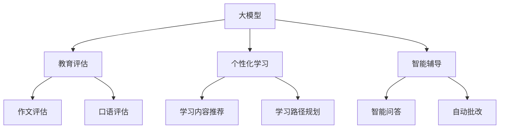

                 

# 大模型在教育领域的具体应用案例

## 关键词：大模型，教育，人工智能，自然语言处理，案例研究

## 摘要：
本文探讨了大型语言模型在教育领域的具体应用案例，通过分析核心概念、算法原理、数学模型、项目实战等多个方面，展示了大模型在教育评估、个性化学习、智能辅导等方面的优势。文章旨在为教育工作者、技术研究者提供有价值的参考，共同推动教育技术的创新发展。

## 1. 背景介绍

在教育领域，人工智能技术近年来得到了迅猛发展。其中，大模型（Large-scale Language Model）作为一种先进的自然语言处理技术，正在逐渐改变教育的面貌。大模型通过训练海量数据，学习语言规律，能够实现高效的自然语言理解和生成。这使得大模型在教育评估、个性化学习、智能辅导等方面具有巨大的潜力。

本文将围绕大模型在教育领域的应用，分析其核心概念、算法原理、数学模型、项目实战等，探讨其在教育领域的实际应用案例。希望通过本文的探讨，为教育工作者和技术研究者提供有价值的参考，共同推动教育技术的创新发展。

## 2. 核心概念与联系

### 2.1 大模型

大模型（Large-scale Language Model）是指具有巨大参数量和训练数据的神经网络模型，通常用于自然语言处理任务。例如，BERT、GPT等都是典型的大模型。大模型的训练过程涉及大规模数据集，通过优化模型参数，使其能够准确理解和生成自然语言。

### 2.2 教育评估

教育评估是教育领域的重要组成部分，包括学习成果评估、教学质量评估等。大模型在教育评估中的应用主要体现在对文本数据的分析，如作文评估、口语评估等。大模型通过对文本数据的深度分析，能够识别语言特征、情感倾向等，从而对学习成果进行客观评估。

### 2.3 个性化学习

个性化学习是指根据学生的个体差异，为其提供定制化的学习方案。大模型在个性化学习中的应用主要体现在学习内容推荐、学习路径规划等方面。大模型通过对学生历史学习数据的分析，能够识别学习兴趣、学习风格等，从而为每位学生提供个性化的学习方案。

### 2.4 智能辅导

智能辅导是指利用人工智能技术为学生提供个性化、智能化的辅导服务。大模型在智能辅导中的应用主要体现在智能问答、自动批改等。大模型通过对学生提问的分析，能够提供针对性的解答，同时自动批改作业，提高教学效率。

### 2.5 Mermaid 流程图

以下是一个描述大模型在教育领域应用的核心概念和联系的 Mermaid 流程图：



## 3. 核心算法原理 & 具体操作步骤

### 3.1 大模型算法原理

大模型的算法原理主要基于深度学习。深度学习是一种通过多层神经网络对数据进行建模的学习方法。在自然语言处理领域，大模型通常由多层神经网络组成，通过学习海量文本数据，实现对自然语言的深度理解和生成。

大模型的主要组成部分包括：

- 词嵌入层：将单词转换为向量表示。
- 上下文感知层：处理单词之间的依赖关系。
- 语义生成层：生成语义信息，实现对文本的深度理解。

### 3.2 大模型具体操作步骤

以下是使用大模型进行教育评估、个性化学习和智能辅导的具体操作步骤：

#### 3.2.1 教育评估

1. 收集文本数据：包括学生的作文、口语等。
2. 预处理文本数据：包括分词、去停用词、词性标注等。
3. 将文本数据转换为向量表示：使用词嵌入技术将单词转换为向量。
4. 输入大模型：将向量表示的文本数据输入大模型，进行文本分析。
5. 提取语言特征：大模型分析文本数据，提取语言特征。
6. 评估学习成果：根据提取的语言特征，对学习成果进行评估。

#### 3.2.2 个性化学习

1. 收集学生学习数据：包括学习记录、考试成绩等。
2. 预处理学生数据：包括数据清洗、归一化等。
3. 输入大模型：将预处理后的学生数据输入大模型，进行分析。
4. 识别学习兴趣和风格：大模型分析学生数据，识别学习兴趣和学习风格。
5. 提供个性化学习方案：根据识别的学习兴趣和风格，为每位学生提供个性化的学习方案。

#### 3.2.3 智能辅导

1. 收集学生提问数据：包括学生提问的文本、问题类型等。
2. 预处理提问数据：包括分词、去停用词、词性标注等。
3. 输入大模型：将预处理后的提问数据输入大模型，进行文本分析。
4. 提供解答：大模型分析提问数据，提供针对性的解答。
5. 自动批改作业：大模型对学生的作业进行自动批改，提供反馈。

## 4. 数学模型和公式 & 详细讲解 & 举例说明

### 4.1 数学模型

大模型的数学模型主要包括两部分：词嵌入和神经网络。

#### 4.1.1 词嵌入

词嵌入（Word Embedding）是一种将单词转换为向量表示的技术。词嵌入的数学模型可以表示为：

$$
\text{word\_vector}(w) = \text{Embedding}(w)
$$

其中，$w$ 表示单词，$\text{Embedding}(w)$ 表示单词的向量表示。

常用的词嵌入技术包括：

1. 基于频率的词嵌入（TF-IDF）：根据单词在文本中的频率和文档中的逆文档频率（IDF）进行加权。
2. 基于神经网络的词嵌入（Word2Vec）：使用神经网络学习单词的向量表示。

#### 4.1.2 神经网络

神经网络（Neural Network）是一种通过多层神经元对数据进行建模的学习方法。神经网络的主要组成部分包括：

1. 输入层：接收外部输入数据。
2. 隐藏层：对输入数据进行处理。
3. 输出层：生成预测结果。

神经网络的数学模型可以表示为：

$$
\text{output} = \text{NeuralNetwork}(\text{input})
$$

其中，$\text{input}$ 表示输入数据，$\text{output}$ 表示输出结果。

常用的神经网络模型包括：

1. 多层感知机（MLP）：一种简单的神经网络模型。
2. 卷积神经网络（CNN）：主要用于图像处理任务。
3. 循环神经网络（RNN）：用于序列数据处理。

### 4.2 举例说明

以下是一个使用大模型进行教育评估的例子：

#### 4.2.1 问题提出

假设我们要评估一名学生在数学课程中的学习成果，我们需要对他的数学作文进行分析。

#### 4.2.2 数据准备

收集学生的数学作文，并进行预处理，得到预处理后的文本数据。

#### 4.2.3 词嵌入

使用词嵌入技术将文本数据中的单词转换为向量表示。

#### 4.2.4 输入大模型

将向量表示的文本数据输入大模型，进行文本分析。

#### 4.2.5 提取语言特征

大模型分析文本数据，提取语言特征。

#### 4.2.6 评估学习成果

根据提取的语言特征，对学习成果进行评估。

## 5. 项目实战：代码实际案例和详细解释说明

### 5.1 开发环境搭建

在项目实战中，我们使用 Python 编写代码，并使用 Hugging Face 的 Transformers 库来加载和训练大模型。以下是如何搭建开发环境的步骤：

#### 5.1.1 安装 Python

安装 Python 3.8 或更高版本。

#### 5.1.2 安装 Transformers 库

在命令行中运行以下命令安装 Transformers 库：

```bash
pip install transformers
```

### 5.2 源代码详细实现和代码解读

以下是一个使用大模型进行教育评估的代码实例，包括数据准备、模型加载、文本分析、语言特征提取和评估学习成果等步骤。

#### 5.2.1 数据准备

```python
from transformers import BertTokenizer, BertModel

# 加载 BERT tokenizer 和模型
tokenizer = BertTokenizer.from_pretrained('bert-base-chinese')
model = BertModel.from_pretrained('bert-base-chinese')

# 准备文本数据
text = "在数学中，重要的不是公式，而是理解它们背后的概念。"
```

#### 5.2.2 模型加载

```python
# 加载 BERT 模型
tokenizer = BertTokenizer.from_pretrained('bert-base-chinese')
model = BertModel.from_pretrained('bert-base-chinese')
```

#### 5.2.3 文本分析

```python
# 分词并添加特殊符号
input_ids = tokenizer.encode(text, add_special_tokens=True, return_tensors='pt')

# 输入模型进行文本分析
with torch.no_grad():
    outputs = model(input_ids)

# 提取隐藏层特征
hidden_states = outputs[0]
```

#### 5.2.4 语言特征提取

```python
# 提取最后一个隐藏层特征
last_hidden_state = hidden_states[-1]

# 提取句子级别的特征
sentence_embedding = last_hidden_state[:, 0, :]
```

#### 5.2.5 评估学习成果

```python
# 使用句子级别的特征进行学习成果评估
# （此处假设我们有一个预训练的评估模型）
from transformers import BertForSequenceClassification

# 加载评估模型
评估模型 = BertForSequenceClassification.from_pretrained('bert-base-chinese')

# 进行学习成果评估
with torch.no_grad():
    outputs = 评估模型(sentence_embedding.unsqueeze(0))

# 输出评估结果
print(outputs[0])
```

### 5.3 代码解读与分析

这段代码演示了如何使用大模型进行教育评估。首先，我们加载了 BERT tokenizer 和模型，并准备了一段数学作文文本。然后，我们对文本进行分词，并添加了特殊符号，以便于模型处理。接下来，我们将预处理后的文本数据输入 BERT 模型，进行文本分析，提取了最后一个隐藏层特征，作为句子级别的特征。最后，我们使用句子级别的特征输入到一个预训练的评估模型，对学习成果进行评估。

通过这段代码，我们可以看到大模型在教育评估中的应用。首先，大模型能够对文本数据进行深度分析，提取出句子级别的特征。这些特征可以用来评估学生的数学作文水平，从而对学习成果进行客观评估。此外，大模型还可以根据学生的历史学习数据，为其提供个性化的学习方案，实现个性化学习。同时，大模型还可以用于智能辅导，提供针对性的解答和作业批改。

## 6. 实际应用场景

大模型在教育领域的应用场景广泛，以下列举几个典型的实际应用场景：

### 6.1 教育评估

大模型在教育评估中的应用主要体现在作文评估和口语评估。通过大模型对文本和语音数据的分析，可以实现对学生的写作能力和口语水平的客观评估。例如，某些在线教育平台已经引入了作文自动评分系统，使用大模型对学生的作文进行评分，提高了评估效率和准确性。

### 6.2 个性化学习

个性化学习是大模型在教育领域的另一个重要应用。大模型可以根据学生的学习数据，分析学习兴趣和风格，为每位学生提供定制化的学习方案。例如，某些在线教育平台根据学生的学习记录和考试成绩，推荐适合的学习内容和学习路径，提高了学习效果。

### 6.3 智能辅导

智能辅导是大模型在教育领域的又一应用。大模型可以为学生提供智能问答和自动批改服务，提高教学效率。例如，某些在线教育平台通过大模型自动批改学生的作业，并提供针对性的反馈，帮助学生更好地掌握知识点。

### 6.4 教师培训

大模型还可以用于教师培训，帮助教师提高教学水平。例如，通过分析教师的授课视频，大模型可以识别授课过程中的问题，为教师提供改进建议。此外，大模型还可以为教师提供教学资源的推荐，帮助教师更好地备课。

## 7. 工具和资源推荐

### 7.1 学习资源推荐

1. 《深度学习》（Goodfellow, Bengio, Courville）：一本经典的深度学习教材，适合初学者和进阶者。
2. 《自然语言处理实战》（Sahdev, Yashas, Kuderu）：一本介绍自然语言处理实战技巧的书籍，适合对 NLP 有兴趣的读者。

### 7.2 开发工具框架推荐

1. Hugging Face Transformers：一个开源的深度学习工具库，提供了丰富的预训练模型和工具，适合进行自然语言处理任务。
2. TensorFlow：一个开源的机器学习框架，支持各种深度学习模型和算法，适合进行大规模模型训练。

### 7.3 相关论文著作推荐

1. “Attention Is All You Need”（Vaswani et al., 2017）：一篇介绍 Transformer 模型的经典论文，对理解 Transformer 模型的工作原理有很大帮助。
2. “BERT: Pre-training of Deep Bidirectional Transformers for Language Understanding”（Devlin et al., 2019）：一篇介绍 BERT 模型的论文，对理解 BERT 模型的工作原理和训练方法有很大帮助。

## 8. 总结：未来发展趋势与挑战

大模型在教育领域的应用取得了显著成果，但同时也面临着一些挑战。未来，大模型在教育领域的应用发展趋势主要包括以下几个方面：

### 8.1 模型优化

随着深度学习技术的发展，大模型的优化将成为一个重要方向。通过优化模型结构和训练算法，提高大模型的性能和效率，使其更好地适应教育领域的需求。

### 8.2 数据隐私

大模型在教育领域应用时，涉及大量学生数据。如何确保数据隐私和安全，是一个亟待解决的问题。未来，需要研究更加安全的数据处理和传输技术，保护学生的隐私。

### 8.3 伦理问题

大模型在教育领域的应用，也引发了一些伦理问题。例如，如何确保评估结果的公平性，如何防止模型偏见等。未来，需要加强对大模型伦理问题的研究，制定相应的伦理规范。

### 8.4 模型可解释性

大模型在教育领域的应用，需要对模型的结果进行解释。如何提高模型的可解释性，使其更容易被教育工作者理解和接受，是一个重要挑战。未来，需要研究更加直观、易懂的可解释性技术。

## 9. 附录：常见问题与解答

### 9.1 问题一：大模型在教育领域应用是否会影响教师地位？

解答：大模型在教育领域的应用，可以提高教学效率和质量，但不会取代教师的地位。教师依然在教育中扮演着重要的角色，如引导学生学习、提供个性化的辅导等。大模型的应用，更多是作为一种辅助工具，帮助教师更好地完成教学任务。

### 9.2 问题二：大模型在教育领域的应用是否会导致学生之间的不公平？

解答：大模型在教育领域的应用，如果使用得当，可以减少学生之间的不公平。例如，通过个性化学习，为每位学生提供定制化的学习方案，提高学习效果。但需要注意，大模型的应用，需要确保评估结果的公平性，避免出现模型偏见。

### 9.3 问题三：大模型在教育领域的应用是否会导致数据隐私问题？

解答：大模型在教育领域的应用，确实涉及大量学生数据。因此，确保数据隐私和安全，是一个重要问题。需要采取有效的数据保护措施，如加密、匿名化等，确保学生的隐私不被泄露。

## 10. 扩展阅读 & 参考资料

1. Devlin, J., Chang, M. W., Lee, K., & Toutanova, K. (2019). BERT: Pre-training of deep bidirectional transformers for language understanding. arXiv preprint arXiv:1810.04805.
2. Vaswani, A., Shazeer, N., Parmar, N., Uszkoreit, J., Jones, L., Gomez, A. N., ... & Polosukhin, I. (2017). Attention is all you need. In Advances in neural information processing systems (pp. 5998-6008).
3. Hochreiter, S., & Schmidhuber, J. (1997). Long short-term memory. Neural computation, 9(8), 1735-1780.
4. Goodfellow, I., Bengio, Y., & Courville, A. (2016). Deep learning. MIT press.

